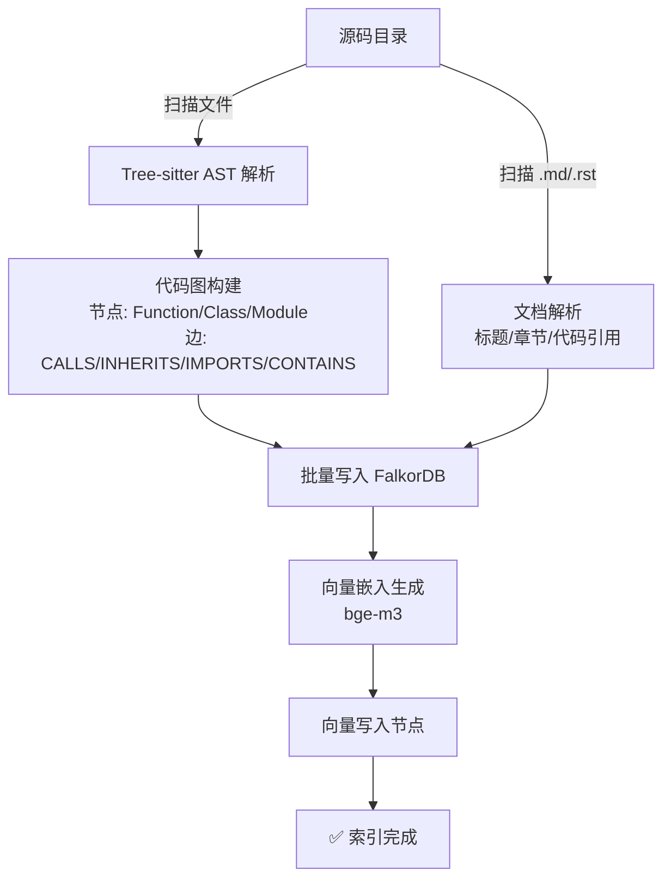
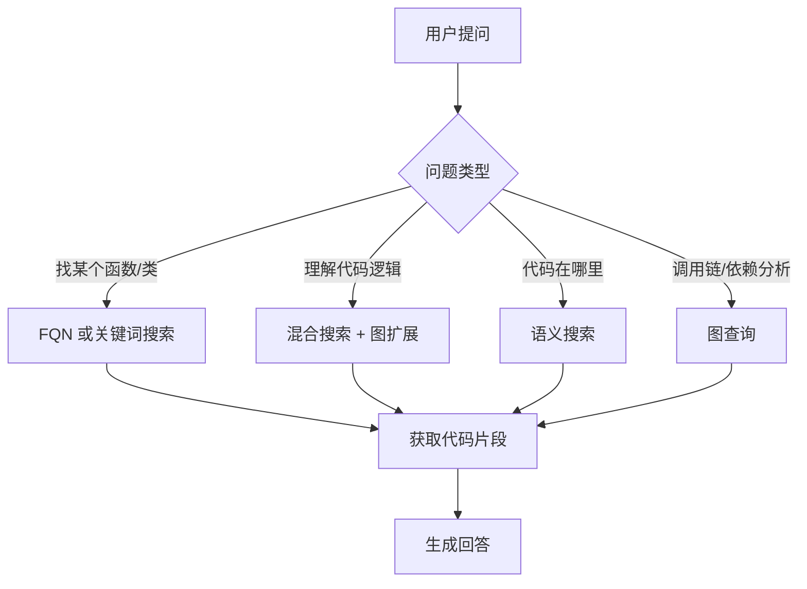

# 知识库服务

独立的 RAG（检索增强生成）服务，面向代码和文档知识。使用 Tree-sitter 将源代码解析为属性图，通过 BAAI/bge-m3（多语言+代码, 568M 参数, 1024 维, 8192 上下文, 支持 Dense/Sparse/ColBERT 三模式检索）生成向量嵌入，并存储在 FalkorDB 中实现图遍历和语义搜索的结合。

## 架构

```
                     HTTP API (:8100)
                          │
              ┌───────────┴───────────┐
              │   FastAPI 应用         │
              │                        │
  ┌───────────┼────────────────────────┼───────────┐
  │           │                        │           │
  │    ┌──────┴──────┐          ┌──────┴──────┐    │
  │    │  索引管道     │          │  查询引擎    │    │
  │    │              │          │             │    │
  │    │ Tree-sitter  │          │ 语义搜索     │    │
  │    │ → AST 解析   │          │ 图查询       │    │
  │    │ → 图构建     │          │ 混合查询     │    │
  │    │ → 向量嵌入   │          │             │    │
  │    └──────┬───────┘          └──────┬──────┘    │
  │           │                        │           │
  │           └────────┬───────────────┘           │
  │                    ▼                           │
  │           ┌────────────────┐                   │
  │           │   FalkorDB     │                   │
  │           │  图 + 向量存储  │                   │
  │           └────────────────┘                   │
  └────────────────────────────────────────────────┘
```

### 索引管道流程



## 快速开始

### 前置条件

- Python 3.12+
- [uv](https://docs.astral.sh/uv/)
- FalkorDB（通过 Docker 或原生安装）

### 一键启动（推荐）

```bash
cp .env.example .env
./dev.sh
```

脚本将自动：
1. 启动 FalkorDB (Docker)
2. 创建 Python 虚拟环境并安装依赖（如缺失）
3. 安装 Node 依赖（如缺失）
4. 启动 FastAPI 后端 (http://localhost:8100，`--reload` 模式)
5. 启动 Vite 前端开发服务器 (http://localhost:5173，HMR 热重载)

按 `Ctrl+C` 优雅停止所有服务。

### 手动启动

```bash
# 启动 FalkorDB
docker compose up -d falkordb

# 安装依赖
uv venv && source .venv/bin/activate
uv pip install -e ".[dev]"

# 配置
cp .env.example .env

# 启动后端
uv run uvicorn main:app --host 0.0.0.0 --port 8100 --reload

# 启动前端开发服务器（可选，另开终端）
cd dashboard && pnpm install && pnpm dev

# 运行测试
uv run pytest
```

### Dashboard

内置 React Dashboard 可视化界面，支持中英文切换：

- **概览** — 节点/边统计 + 分布图表
- **搜索** — 语义搜索 + 混合搜索（向量 + 图扩展）
- **图查询** — 9种查询类型的动态表单
- **仓库管理** — 已索引仓库列表 + 删除操作
- **索引** — 触发全量/增量索引
- **设置** — 语言切换、API Token、服务信息

访问：开发模式 http://localhost:5173 | 生产模式 http://localhost:8100

构建生产版本：`cd dashboard && pnpm build`（输出到 `static/`，由 FastAPI 自动服务）

### Docker 部署（仅 FalkorDB）

```bash
cp .env.example .env
docker compose up -d
```

> **注意**: 当前 docker-compose 仅启动 FalkorDB。知识库服务建议本地运行以利用 MPS (Apple Silicon) / CUDA GPU 加速。在 Docker 容器内无法使用 MPS。

---

## 使用指南

### 1. 全量索引（首次使用）

首次使用时，需要对整个代码仓库进行全量索引：

```bash
# 索引本地仓库
curl -X POST http://localhost:8100/api/v1/index \
  -H "Content-Type: application/json" \
  -d '{
    "directory": "/path/to/your/repo",
    "mode": "full"
  }'
```

全量索引会：
1. 递归扫描目录中所有支持的源码文件
2. 使用 Tree-sitter 解析每个文件的 AST（函数、类、导入、调用关系）
3. 扫描 `.md`/`.rst` 文档，提取标题、章节和代码引用
4. 将解析结果构建为属性图（节点 + 边）并写入 FalkorDB
5. 使用 bge-m3 为所有 Function、Class、Document 节点生成向量嵌入
6. 将向量写入节点的 `embedding` 属性

> **耗时**: 首次索引根据仓库大小可能需要数分钟（主要耗时在模型加载和向量生成）。后续增量索引通常在秒级完成。

### 2. 增量索引（日常更新）

代码变更后，使用增量索引仅更新变更的文件：

```bash
# 基于 git diff 的增量索引
curl -X POST http://localhost:8100/api/v1/index \
  -H "Content-Type: application/json" \
  -d '{
    "directory": "/path/to/your/repo",
    "mode": "incremental",
    "base_ref": "HEAD~1",
    "head_ref": "HEAD"
  }'
```

增量索引会：
1. 执行 `git diff --name-status base_ref head_ref` 获取变更文件列表
2. 对于删除的文件：从图中移除对应的所有节点和边
3. 对于新增/修改的文件：先删除旧数据，再重新解析并写入
4. 为变更的节点重新生成向量嵌入

#### 通过 GitLab Webhook 自动触发

配合 ACP Gateway 使用时，可通过 GitLab Webhook 在每次代码推送时自动触发增量索引：

1. 在 GitLab 仓库 → Settings → Webhooks 中添加：
   - URL: `http://your-gateway:9090/api/v1/webhooks/gitlab/push`
   - Secret Token: 与 Gateway 配置中的 `GITLAB_TOKEN` 一致
   - Trigger: Push events

2. Gateway 收到推送事件后，自动向知识库服务发送增量索引请求

### 3. 直接传入文件内容索引

当知识库服务无法直接访问仓库目录时（如 CI 环境），可以直接传入文件内容进行索引：

```bash
# 索引单个或多个文件（直接传入内容）
curl -X POST http://localhost:8100/api/v1/index/files \
  -H "Content-Type: application/json" \
  -d '{
    "repository": "my-project",
    "files": [
      {
        "file_path": "src/auth/service.py",
        "content": "class AuthService:\n    def authenticate(self, token: str) -> bool:\n        ..."
      },
      {
        "file_path": "docs/guide.md",
        "content": "# Quick Start Guide\n\n## Installation\n..."
      }
    ]
  }'
```

这在以下场景特别有用：
- **CI/CD 流水线**: 从 git diff 中提取变更文件内容直接送索引
- **远程仓库**: 知识库服务与代码仓库不在同一台机器上
- **选择性索引**: 只索引特定文件而非整个目录
- **文档索引**: 直接传入 Markdown 文档内容生成向量嵌入

> **注意**: 代码文件和文档文件（.md, .rst, .txt）都会被索引并生成向量嵌入。

### 4. 多仓库管理

知识库支持通过 `repository` 参数实现仓库级别的命名空间隔离：

```bash
# 索引时指定仓库名称
curl -X POST http://localhost:8100/api/v1/index \
  -H "Content-Type: application/json" \
  -d '{
    "directory": "/path/to/repo-a",
    "mode": "full",
    "repository": "repo-a"
  }'

# 查看所有已索引的仓库
curl http://localhost:8100/api/v1/repositories

# 查看特定仓库的统计
curl "http://localhost:8100/api/v1/stats?repository=repo-a"

# 删除某个仓库的所有索引数据
curl -X DELETE http://localhost:8100/api/v1/index/repo-a
```

**响应示例**（`GET /api/v1/repositories`）:

```json
{
  "repositories": [
    {"repository": "acp-gateway", "nodes": 350},
    {"repository": "code-review-bot", "nodes": 128}
  ],
  "total": 2
}
```

> **说明**: 不指定 `repository` 参数时，数据不带仓库标签，所有仓库共享一个图。建议在多仓库环境中始终指定 `repository`。

### 5. 语义搜索

使用自然语言搜索代码（可选按仓库过滤）：

```bash
# 搜索所有类型
curl -X POST http://localhost:8100/api/v1/search \
  -H "Content-Type: application/json" \
  -d '{
    "query": "用户认证中间件",
    "k": 10,
    "entity_type": "all"
  }'

# 只搜索函数
curl -X POST http://localhost:8100/api/v1/search \
  -H "Content-Type: application/json" \
  -d '{
    "query": "数据库连接池管理",
    "k": 5,
    "entity_type": "function"
  }'

# 只搜索类
curl -X POST http://localhost:8100/api/v1/search \
  -H "Content-Type: application/json" \
  -d '{
    "query": "HTTP 请求处理",
    "k": 5,
    "entity_type": "class"
  }'

# 只搜索文档
curl -X POST http://localhost:8100/api/v1/search \
  -H "Content-Type: application/json" \
  -d '{
    "query": "部署指南",
    "k": 5,
    "entity_type": "document"
  }'
```

**响应示例**:

```json
{
  "results": [
    {
      "name": "authenticate_request",
      "file": "src/auth/middleware.py",
      "start_line": 15,
      "end_line": 42,
      "signature": "async def authenticate_request(request: Request) -> Tenant",
      "docstring": "Verify API key and return tenant info.",
      "code_snippet": "...",
      "score": 0.87
    }
  ],
  "total": 3,
  "query": "用户认证中间件"
}
```

### 6. 图查询

利用代码的结构化关系进行精准查询：

```bash
# 追踪函数调用链（下游 — 该函数调用了哪些函数）
curl -X POST http://localhost:8100/api/v1/graph \
  -H "Content-Type: application/json" \
  -d '{
    "query_type": "call_chain",
    "name": "handle_request",
    "depth": 3,
    "direction": "downstream"
  }'

# 追踪函数被谁调用（上游）
curl -X POST http://localhost:8100/api/v1/graph \
  -H "Content-Type: application/json" \
  -d '{
    "query_type": "call_chain",
    "name": "save_to_database",
    "depth": 2,
    "direction": "upstream"
  }'

# 查看类继承树
curl -X POST http://localhost:8100/api/v1/graph \
  -H "Content-Type: application/json" \
  -d '{
    "query_type": "inheritance",
    "name": "BaseService"
  }'

# 列出类的所有方法
curl -X POST http://localhost:8100/api/v1/graph \
  -H "Content-Type: application/json" \
  -d '{
    "query_type": "class_methods",
    "name": "AuthService"
  }'

# 查看模块依赖关系
curl -X POST http://localhost:8100/api/v1/graph \
  -H "Content-Type: application/json" \
  -d '{
    "query_type": "module_deps",
    "name": "auth"
  }'

# 查看某个文件的所有代码实体
curl -X POST http://localhost:8100/api/v1/graph \
  -H "Content-Type: application/json" \
  -d '{
    "query_type": "file_entities",
    "file": "src/main.py"
  }'

# 执行自定义 Cypher 查询
curl -X POST http://localhost:8100/api/v1/graph \
  -H "Content-Type: application/json" \
  -d '{
    "query_type": "custom",
    "cypher": "MATCH (f:Function)-[:CALLS]->(g:Function) WHERE f.name = $name RETURN g.name, g.file",
    "params": {"name": "main"}
  }'
```

### 7. 混合搜索

结合语义搜索和图遍历，获取更丰富的上下文：

```bash
curl -X POST http://localhost:8100/api/v1/hybrid \
  -H "Content-Type: application/json" \
  -d '{
    "query": "API 层的错误处理",
    "k": 5,
    "expand_depth": 2
  }'
```

混合搜索会：
1. 先进行语义搜索，找到最相关的 k 个代码实体
2. 对每个结果，沿 CALLS、CONTAINS、INHERITS 边扩展 `expand_depth` 层
3. 返回搜索结果和扩展的图上下文

### 8. FQN 精确搜索

当存在多个同名函数或类时，可使用 Java 全限定名（FQN）精确定位：

```bash
# 通过类 FQN 精确定位（在多个同名 EsClient 中找到特定的那个）
curl -X POST http://localhost:8100/api/v1/search \
  -H "Content-Type: application/json" \
  -d '{
    "query": "com.immomo.moaservice.ultron.common.es.EsClient",
    "k": 5,
    "entity_type": "all"
  }'

# 通过 类#方法 FQN 精确定位
curl -X POST http://localhost:8100/api/v1/search \
  -H "Content-Type: application/json" \
  -d '{
    "query": "com.immomo.moaservice.ultron.common.es.EsClient#insert",
    "k": 5,
    "entity_type": "all"
  }'
```

FQN 格式说明：
- 类: `包名.类名`，如 `com.immomo.moaservice.ultron.common.es.EsClient`
- 方法: `包名.类名#方法名`，如 `com.immomo.moaservice.ultron.common.es.EsClient#insert`
- FQN 从文件路径自动推断（基于 `src/main/java/` 或 `src/test/java/` 标记）

> **注意**: FQN 在索引时自动计算并存储。对于已索引的旧数据，可调用 `POST /api/v1/admin/backfill-fqn` 批量补充。

### 9. 远程代码获取

当知识库部署在远程机器时，可通过 API 获取代码片段（无需访问源码目录）：

```bash
# 通过节点 UID 获取代码片段
curl http://localhost:8100/api/v1/code/<node_uid>
```

**响应示例**:

```json
{
  "name": "insert",
  "file": "/path/to/EsClient.java",
  "start_line": 209,
  "end_line": 225,
  "code_snippet": "public void insert(final String traceId, ...) { ... }",
  "signature": "public void insert(final String traceId, final String index, final String jsonStr) throws Exception",
  "fqn": "com.immomo.moaservice.ultron.common.es.EsClient#insert",
  "type": "Function"
}
```

> **提示**: 搜索结果中的 `uid` 字段即为节点 UID，可直接拼接到此 API 路径中。

### 10. 查看图统计信息

```bash
curl http://localhost:8100/api/v1/stats
```

**响应示例**:

```json
{
  "nodes": {
    "Function": 245,
    "Class": 38,
    "Module": 52,
    "Document": 15
  },
  "edges": {
    "CALLS": 412,
    "INHERITS": 12,
    "IMPORTS": 178,
    "CONTAINS": 320,
    "REFERENCES": 45
  },
  "total_nodes": 350,
  "total_edges": 967
}
```

---

## 向量更新

### 何时需要更新向量

以下场景需要更新向量嵌入：

| 场景 | 操作 |
|------|------|
| 代码变更（日常开发） | 增量索引自动更新 |
| 切换嵌入模型 | 需要全量重新索引 |
| 修改向量维度 | 需要全量重新索引 |
| 数据库清空/迁移 | 需要全量重新索引 |

### 手动触发全量重建

当需要完全重建索引（例如切换了嵌入模型）时：

```bash
# 1. 清空现有图数据（可选，不清空会覆盖更新）
# 连接 FalkorDB CLI
redis-cli -h localhost -p 6379
> GRAPH.DELETE code_knowledge

# 2. 重新全量索引
curl -X POST http://localhost:8100/api/v1/index \
  -H "Content-Type: application/json" \
  -d '{
    "directory": "/path/to/your/repo",
    "mode": "full"
  }'
```

### 更换嵌入模型

修改 `.env` 中的嵌入模型配置后重启服务：

```bash
# .env
EMBEDDING__MODEL_NAME=BAAI/bge-m3               # 多语言+代码嵌入模型
EMBEDDING__DIMENSION=1024                        # 必须匹配模型输出维度
EMBEDDING__DEVICE=auto                           # auto: cuda > mps > cpu
EMBEDDING__BATCH_SIZE=64                         # 根据 GPU 显存调整

# 重启服务后执行全量索引
```

> **注意**: 更换模型后**必须**进行全量重新索引，因为不同模型生成的向量不在同一语义空间中。

---

## MCP 工具集成

> **完整文档**: [docs/MCP-INTEGRATION.md](docs/MCP-INTEGRATION.md) — 包含 Cursor MCP 配置、认证、业务隔离、Agent 推荐工作流等详细说明。

知识库服务暴露 MCP (Model Context Protocol) 工具接口，可被 AI Agent 直接调用。

### 可用工具

#### `rag_query` — 自然语言搜索

Agent 使用自然语言查询代码库：

```json
{
  "tool_name": "rag_query",
  "arguments": {
    "query": "WebSocket 连接的认证流程",
    "k": 5,
    "expand_depth": 2
  }
}
```

#### `rag_graph` — 结构化图查询

Agent 查询代码结构关系：

```json
{
  "tool_name": "rag_graph",
  "arguments": {
    "query_type": "call_chain",
    "name": "authenticate",
    "depth": 3,
    "direction": "downstream"
  }
}
```

支持的 `query_type`:
- `call_chain` — 函数调用链
- `inheritance_tree` — 类继承树
- `class_methods` — 类方法列表
- `module_dependencies` — 模块依赖
- `reverse_dependencies` — 反向依赖
- `find_entity` — 查找实体
- `file_entities` — 文件内实体
- `graph_stats` — 图统计
- `raw_cypher` — 自定义 Cypher

#### `rag_index` — 触发索引

Agent 触发代码索引更新：

```json
{
  "tool_name": "rag_index",
  "arguments": {
    "directory": "/workspace/repo",
    "mode": "incremental",
    "base_ref": "HEAD~1",
    "head_ref": "HEAD"
  }
}
```

### MCP HTTP 端点

```bash
# 列出所有可用工具
curl http://localhost:8100/api/v1/mcp/tools

# 调用工具
curl -X POST http://localhost:8100/api/v1/mcp/tool \
  -H "Content-Type: application/json" \
  -d '{
    "tool_name": "rag_query",
    "arguments": {"query": "认证流程"}
  }'
```

---

## AI Agent 集成指南

本节说明 AI Agent（如 Cursor、Claude、GPT 等）应如何使用知识库来辅助代码开发。

### Agent 推荐工作流



### 1. 搜索策略

**优先级**: FQN 精确搜索 > 关键词搜索 > 语义搜索 > 图查询

| 场景 | 推荐方式 | 端点 |
|------|----------|------|
| 知道完整类名/方法名 | FQN 搜索 | `POST /search` with FQN |
| 知道函数/类名 | 关键词搜索 | `POST /search` with name |
| 用自然语言描述需求 | 语义搜索 | `POST /search` |
| 需要调用链/依赖分析 | 图查询 | `POST /graph` |
| 需要完整上下文 | 混合搜索 | `POST /hybrid` |

### 2. 典型 Agent 调用流程

**场景一: 用户问 "loginV2 方法做了什么"**

```bash
# Step 1: 搜索 loginV2
POST /api/v1/search
{"query": "loginV2", "k": 5, "entity_type": "function"}

# Step 2: 获取代码片段（用返回结果中的 uid）
GET /api/v1/code/<uid>

# Step 3: 查看调用链
POST /api/v1/graph
{"query_type": "call_chain", "name": "loginV2", "depth": 2, "direction": "downstream"}
```

**场景二: 用户问 "EsClient 有哪些方法"**

```bash
# Step 1: 用 FQN 精确定位
POST /api/v1/search
{"query": "com.immomo.moaservice.ultron.common.es.EsClient", "k": 1, "entity_type": "class"}

# Step 2: 列出类方法
POST /api/v1/graph
{"query_type": "class_methods", "name": "EsClient"}
```

**场景三: 用户问 "认证流程是怎样的"**

```bash
# Step 1: 混合搜索获取语义匹配 + 图上下文
POST /api/v1/hybrid
{"query": "用户认证流程", "k": 5, "expand_depth": 2}

# Step 2: 对关键函数获取代码
GET /api/v1/code/<uid>
```

### 3. 消歧义策略

当搜索结果返回多个同名实体时，Agent 应该：

1. **检查 FQN 字段**: 每个结果包含 `fqn` 字段，可区分不同包下的同名类/方法
2. **检查 file 字段**: 查看文件路径确定归属项目
3. **让用户确认**: 如果仍不确定，展示所有候选结果让用户选择
4. **使用 FQN 精确搜索**: 确认后用完整 FQN 重新搜索

### 4. MCP 工具调用

Agent 可通过 MCP 协议直接调用工具：

```json
// 自然语言搜索
{"tool_name": "rag_query", "arguments": {"query": "用户登录流程", "k": 5}}

// 图查询
{"tool_name": "rag_graph", "arguments": {"query_type": "call_chain", "name": "loginV2", "depth": 3}}

// 触发索引
{"tool_name": "rag_index", "arguments": {"directory": "/path/to/repo", "mode": "full"}}
```

### 5. 远程部署场景

当知识库部署在远程服务器时，Agent 无法直接读取代码文件。使用以下流程：

1. 通过搜索 API 找到目标代码实体（返回 uid）
2. 通过 `GET /api/v1/code/{uid}` 获取代码片段
3. 代码片段存储在 Function 节点的 `code_snippet` 属性中

> **限制**: 当前 `code_snippet` 仅存储于 Function 节点（Class 节点不含完整代码）。如需查看完整类代码，可通过 `class_methods` 图查询获取所有方法的代码片段。

---

## 配置

所有配置通过环境变量（`.env` 文件）管理：

### 服务配置

| 变量 | 说明 | 默认值 |
|---|---|---|
| `HOST` | 监听地址 | `0.0.0.0` |
| `PORT` | 监听端口 | `8100` |
| `LOG_LEVEL` | 日志级别（DEBUG/INFO/WARNING/ERROR） | `INFO` |
| `TOKENS_FILE` | Token 配置文件路径 | `tokens.yaml` |
| `API_TOKEN` | API 认证令牌（向后兼容，推荐用 `tokens.yaml`） | - |
| `API_TOKENS` | 多角色 Token（向后兼容，推荐用 `tokens.yaml`） | - |

### FalkorDB 配置

| 变量 | 说明 | 默认值 |
|---|---|---|
| `FALKORDB__HOST` | FalkorDB 主机 | `localhost` |
| `FALKORDB__PORT` | FalkorDB 端口 | `6379` |
| `FALKORDB_PASSWORD` | FalkorDB 密码 | - |
| `FALKORDB__GRAPH_NAME` | 图数据库名称 | `code_knowledge` |

### 嵌入模型配置

| 变量 | 说明 | 默认值 |
|---|---|---|
| `EMBEDDING__MODEL_NAME` | Sentence-transformers 模型 | `BAAI/bge-m3` |
| `EMBEDDING__DIMENSION` | 向量维度（必须匹配模型） | `1024` |
| `EMBEDDING__DEVICE` | 计算设备（`auto` / `cpu` / `cuda` / `mps`），`auto` 自动检测最优设备 | `auto` |
| `EMBEDDING__BATCH_SIZE` | 向量批处理大小 | `32` |
| `EMBEDDING__QUERY_PREFIX` | 查询指令前缀（bge-m3 不需要） | `` |
| `EMBEDDING__TRUST_REMOTE_CODE` | 允许加载远程模型代码 | `true` |

---

## 支持语言

| 语言 | 文件扩展名 | 解析实体 |
|---|---|---|
| Python | `.py` | 函数、类、导入、调用 |
| Java | `.java` | 方法、类、导入、调用 |
| Go | `.go` | 函数、结构体、导入、调用 |
| JavaScript | `.js`, `.jsx`, `.mjs` | 函数、类、导入、调用 |
| TypeScript | `.ts`, `.tsx` | 函数、类、导入、调用 |

---

## 图数据模型

### 节点类型

| 标签 | 关键属性 | 说明 |
|---|---|---|
| `Function` | name, file, start_line, end_line, signature, docstring, code_snippet, language, fqn, embedding | 函数/方法定义 |
| `Class` | name, file, start_line, end_line, docstring, language, base_classes, fqn, embedding | 类定义 |
| `Module` | name, path, language | 源文件/模块 |
| `Document` | name, file, title, content, content_hash, section, embedding | 文档（Markdown/RST 章节） |

### 边类型

| 类型 | 方向 | 说明 |
|---|---|---|
| `CALLS` | 调用者 → 被调用者 | 函数调用关系 |
| `INHERITS` | 子类 → 父类 | 类继承 |
| `IMPORTS` | 导入者 → 被导入模块 | 模块导入 |
| `CONTAINS` | 父 → 子 | 类→方法、模块→函数、文档→章节 |
| `USES_TYPE` | 函数 → 类型 | 类型引用（保留） |
| `REFERENCES` | 文档 → 代码实体 | 文档对代码的引用 |

### UID 格式

节点唯一标识: `{NodeLabel}:{file}:{name}:{line}`

### 索引

- 每种节点标签的 `uid`、`name`、`fqn` 属性上建立标量索引
- Function、Class、Document 的 `embedding` 属性上建立向量索引（余弦相似度）

---

## API 参考

所有端点以 `/api/v1` 为前缀。配置了 Token 后需要在请求头中包含 `Authorization: Bearer <token>`。Token 绑定了业务时无需传 `X-Business-Id`；管理员可通过 `X-Business-Id` 指定业务。

### 索引

| 方法 | 路径 | 说明 |
|------|------|------|
| POST | `/api/v1/index` | 触发目录级代码和文档索引 |
| POST | `/api/v1/index/files` | 直接传入文件内容索引（无需本地目录） |
| DELETE | `/api/v1/index/{repository}` | 删除指定仓库的所有索引数据 |
| GET | `/api/v1/repositories` | 列出所有已索引的仓库 |

#### POST /api/v1/index — 目录索引

```json
{
  "directory": "/path/to/repo",
  "mode": "full",
  "base_ref": "HEAD~1",
  "head_ref": "HEAD",
  "repository": "my-project"
}
```

| 参数 | 类型 | 必填 | 说明 |
|------|------|------|------|
| `directory` | string | 是 | 要索引的本地目录路径 |
| `mode` | string | 否 | `"full"` 扫描所有文件（默认），`"incremental"` 仅 git diff 变更 |
| `base_ref` | string | 否 | 增量模式的基准 Git 引用（如 `HEAD~1`） |
| `head_ref` | string | 否 | 增量模式的目标 Git 引用（如 `HEAD`） |
| `repository` | string | 否 | 仓库标识（用于多仓库命名空间隔离） |

#### POST /api/v1/index/files — 文件内容索引

```json
{
  "repository": "my-project",
  "files": [
    {"file_path": "src/main.py", "content": "..."},
    {"file_path": "docs/guide.md", "content": "..."}
  ]
}
```

| 参数 | 类型 | 必填 | 说明 |
|------|------|------|------|
| `repository` | string | 否 | 仓库标识 |
| `files` | array | 是 | 文件列表 |
| `files[].file_path` | string | 是 | 文件路径 |
| `files[].content` | string | 是 | 文件内容 |
| `files[].repository` | string | 否 | 单文件级别的仓库标识（覆盖顶层 repository） |

### 查询

| 方法 | 路径 | 说明 |
|------|------|------|
| POST | `/api/v1/search` | 语义搜索 |
| POST | `/api/v1/graph` | 图查询 |
| POST | `/api/v1/hybrid` | 混合搜索 |

#### POST /api/v1/search — 语义搜索

```json
{
  "query": "认证中间件",
  "k": 10,
  "entity_type": "function"
}
```

| 参数 | 类型 | 必填 | 说明 |
|------|------|------|------|
| `query` | string | 是 | 自然语言查询 |
| `k` | int | 否 | 返回结果数（默认 10） |
| `entity_type` | string | 否 | `"all"`（默认）, `"function"`, `"class"`, `"document"` |

#### POST /api/v1/graph — 图查询

```json
{
  "query_type": "call_chain",
  "name": "authenticate",
  "depth": 3,
  "direction": "downstream"
}
```

| 参数 | 类型 | 必填 | 说明 |
|------|------|------|------|
| `query_type` | string | 是 | 查询类型（见下表） |
| `name` | string | 视类型 | 实体名称 |
| `file` | string | 视类型 | 文件路径 |
| `depth` | int | 否 | 遍历深度（默认 3） |
| `direction` | string | 否 | `"downstream"` / `"upstream"` |
| `cypher` | string | 视类型 | 自定义 Cypher（`custom` 类型） |
| `entity_type` | string | 否 | `"function"` / `"class"` / `"any"` |

支持的 `query_type`:

| query_type | 说明 | 必需参数 |
|------------|------|----------|
| `call_chain` | 追踪函数调用路径 | `name`, `depth`, `direction` |
| `inheritance` | 类继承树 | `name` |
| `class_methods` | 列出类的方法 | `name` |
| `module_deps` | 模块依赖图 | `name` |
| `reverse_dependencies` | 反向依赖 | `name` |
| `find_entity` | 查找实体 | `name`, `entity_type` |
| `file_entities` | 文件内所有实体 | `file` |
| `graph_stats` | 图统计信息 | 无 |
| `custom` | 原始 Cypher 查询 | `cypher` |

#### POST /api/v1/hybrid — 混合搜索

```json
{
  "query": "API 层的错误处理",
  "k": 5,
  "expand_depth": 2
}
```

| 参数 | 类型 | 必填 | 说明 |
|------|------|------|------|
| `query` | string | 是 | 自然语言查询 |
| `k` | int | 否 | 语义搜索结果数（默认 5） |
| `expand_depth` | int | 否 | 图扩展深度（默认 2） |

### 代码获取

| 方法 | 路径 | 说明 |
|------|------|------|
| GET | `/api/v1/code/{node_uid}` | 返回节点的代码片段、签名、FQN 等信息 |

### 管理

| 方法 | 路径 | 说明 |
|------|------|------|
| POST | `/api/v1/admin/backfill-fqn` | 为已有 Java 节点批量补充 FQN 属性 |

### 图探索

| 方法 | 路径 | 说明 |
|------|------|------|
| POST | `/api/v1/graph/explore` | 返回实体周围的节点和边，用于力导向图可视化 |

### 工具

| 方法 | 路径 | 说明 |
|------|------|------|
| GET | `/api/v1/stats` | 返回图统计信息（可选 `?repository=` 按仓库过滤） |
| GET | `/api/v1/repositories` | 列出已索引仓库及节点数 |
| GET | `/api/v1/health` | 健康检查 |
| GET | `/api/v1/mcp/tools` | 列出 MCP 工具定义 |
| POST | `/api/v1/mcp/tool` | 执行 MCP 工具调用 |

---

## 项目结构

```
knowledge-base-service/
├── main.py                     # FastAPI 应用入口 + SPA 路由
├── config.py                   # Pydantic Settings 配置
├── service.py                  # 服务编排器（门面模式）
├── service_registry.py         # 多业务服务注册表
├── auth.py                     # 角色权限控制 (RBAC)
├── tokens.yaml.example         # Token 配置模板（支持业务绑定）
├── log.py                      # 结构化日志（structlog）
├── dev.sh                      # 一键启动脚本
├── indexer/
│   ├── tree_sitter_parser.py   # 多语言 AST 解析器
│   ├── code_graph_builder.py   # AST → 属性图节点/边
│   ├── embedding_generator.py  # sentence-transformers 向量嵌入
│   ├── incremental_indexer.py  # 全量 & 增量索引
│   └── doc_indexer.py          # Markdown/RST 文档解析器
├── store/
│   ├── schema.py               # 节点/边类型定义
│   ├── falkordb_store.py       # FalkorDB 异步封装（Cypher + 向量）
│   └── business_manager.py     # 业务元数据管理（Redis）
├── query/
│   ├── graph_query.py          # Cypher 图遍历查询
│   ├── semantic_query.py       # 向量相似度搜索
│   └── hybrid_query.py         # 语义 + 图扩展
├── api/
│   └── mcp_server.py           # MCP 工具定义 & 处理器
├── dashboard/                  # React Dashboard 源码
│   ├── src/
│   │   ├── api/               # API client + React Query hooks
│   │   ├── components/        # Layout, StatCard, Toast, Skeleton...
│   │   ├── i18n/              # 多语言 (en/zh)
│   │   └── pages/             # Overview, Search, Graph, Repos, Indexing, Settings
│   ├── vite.config.ts
│   └── package.json
├── static/                     # Dashboard 构建产物（gitignored）
├── docs/
│   ├── MCP-INTEGRATION.md      # MCP 集成指南（配置、认证、工作流）
│   ├── ONBOARDING.md           # 业务项目接入指南（完整步骤）
│   ├── proposals/              # 设计提案
│   ├── superpowers/            # 设计规格 & 实施计划
│   │   ├── specs/              #   规格文档
│   │   └── plans/              #   实施计划
│   └── templates/              # 可复用模板（Rules / Skills / MCP 配置 / Shell 命令）
│       ├── knowledge-base-coding.mdc   # Cursor Rule: 编码时查询 KB
│       ├── knowledge-base-docs.mdc     # Cursor Rule: 文档维护时查询 KB
│       ├── kb-doc-writer/SKILL.md      # Cursor Skill: 基于 KB 编写文档
│       ├── kb-doc-auditor/SKILL.md     # Cursor Skill: 文档准确性审计
│       ├── mcp-config.json             # Cursor MCP 连接配置
│       └── kb-shell-commands.md        # Shell curl 命令模板（非 MCP 环境）
├── scripts/
│   ├── index-services.sh       # 批量索引多服务脚本
│   ├── reindex_all.py          # 全量重索引脚本
│   └── export_onnx.py          # ONNX 模型导出
├── tests/                      # 单元测试
├── docker-compose.yaml         # FalkorDB Docker 部署
├── Dockerfile
└── pyproject.toml
```

## 模板与工具

`docs/templates/` 和 `scripts/` 提供了可直接复用的配置模板和自动化脚本，覆盖从 Cursor IDE 集成到 CI/CD 的完整场景。

### 模板索引

| 类型 | 文件 | 用途 | 适用场景 |
|------|------|------|----------|
| 配置 | [`docs/templates/mcp-config.json`](docs/templates/mcp-config.json) | Cursor MCP 连接配置 | 接入 KB 的第一步，配置 Agent 到 KB 的 MCP 连接 |
| Rule | [`docs/templates/knowledge-base-coding.mdc`](docs/templates/knowledge-base-coding.mdc) | 编码时查询 KB | 跨服务代码编写时，强制 Agent 先查 KB 再写代码（alwaysApply） |
| Rule | [`docs/templates/knowledge-base-docs.mdc`](docs/templates/knowledge-base-docs.mdc) | 文档维护时查询 KB | 编写/更新 `.md` 文档时，确保代码引用来自 KB 真实数据（alwaysApply） |
| Skill | [`docs/templates/kb-doc-writer/SKILL.md`](docs/templates/kb-doc-writer/SKILL.md) | 基于 KB 编写文档 | 开发者主动触发，7 步流程：全貌 → 接口 → 调用链 → 编写 → 验证 → 索引 |
| Skill | [`docs/templates/kb-doc-auditor/SKILL.md`](docs/templates/kb-doc-auditor/SKILL.md) | 文档准确性审计 | 定期/按需审计 docs/ 中的代码引用是否与真实代码一致，生成审计报告 |
| Shell | [`docs/templates/kb-shell-commands.md`](docs/templates/kb-shell-commands.md) | Shell curl 命令模板 | 非 MCP 环境（如 ACP Gateway、CI 脚本）通过 HTTP 直接查询 KB |

> **Rule vs Skill**：Rule 轻量常驻（每次 Agent 对话自动加载），Skill 按需激活（复杂多步骤工作流，手动触发）。两者互补。
>
> **双模式适配**：两个 Skill（kb-doc-writer、kb-doc-auditor）同时支持 MCP 工具调用和 Shell curl 命令。Agent 根据 Prompt 中是否包含 `[KNOWLEDGE BASE - SHELL QUERY TOOLS]` 段落自动选择调用方式，因此可在开发者 Cursor IDE（MCP）和 ACP Gateway Agent（Shell curl）两种环境下使用。

### 使用方式

#### 1. Cursor MCP 配置（开发者直接使用 KB）

```bash
# 复制 MCP 配置到项目
cp docs/templates/mcp-config.json <your-project>/.cursor/mcp.json

# 修改 token 和 URL
# 默认 URL: http://localhost:8100/api/v1/mcp
```

#### 2. Cursor Rules（编码/文档时自动触发 KB 查询）

```bash
# 编码规则 — 跨服务调用、继承实现、公共方法修改前必须查 KB
cp docs/templates/knowledge-base-coding.mdc <your-project>/.cursor/rules/

# 文档规则 — 文档中的代码引用必须来自 KB 查询结果
cp docs/templates/knowledge-base-docs.mdc <your-project>/.cursor/rules/
```

规则内置降级策略：KB 不可用时自动退回常规模式，不阻塞开发。

#### 3. Cursor Skills（复杂文档工作流，按需激活）

```bash
# 文档编写 Skill — 基于 KB 查询结果编写项目文档（7 步工作流）
cp -r docs/templates/kb-doc-writer ~/.cursor/skills/

# 文档审计 Skill — 验证文档中的代码引用是否准确
cp -r docs/templates/kb-doc-auditor ~/.cursor/skills/
```

安装后在 Cursor 中通过 Agent 对话手动激活：
- "请使用 kb-doc-writer 为当前项目编写 API 文档"
- "请使用 kb-doc-auditor 审计 docs/ 目录下的文档准确性"

#### 4. Shell 命令模板（非 MCP 环境）

适用于 ACP Gateway Agent、CI/CD 脚本等无法直接使用 MCP 的场景：

```bash
# 语义搜索
curl -s -X POST 'http://localhost:8100/api/v1/search' \
  -H 'Content-Type: application/json' \
  -H 'Authorization: Bearer <token>' \
  -d '{"query": "用户认证流程", "k": 5, "entity_type": "all"}'

# 图查询（调用链）
curl -s -X POST 'http://localhost:8100/api/v1/graph' \
  -H 'Content-Type: application/json' \
  -H 'Authorization: Bearer <token>' \
  -d '{"query_type": "call_chain", "name": "loginV2", "depth": 3, "direction": "downstream"}'
```

完整命令集见 [`docs/templates/kb-shell-commands.md`](docs/templates/kb-shell-commands.md)。

### 自动化脚本

| 脚本 | 用途 | 示例 |
|------|------|------|
| [`scripts/index-services.sh`](scripts/index-services.sh) | 批量索引多个服务 | `bash scripts/index-services.sh --base-dir /path/to/services --kb-token <token>` |
| [`scripts/reindex_all.py`](scripts/reindex_all.py) | 全量重新索引 | `uv run scripts/reindex_all.py` |

---

## 业务项目接入

> **完整文档**: [docs/ONBOARDING.md](docs/ONBOARDING.md) — 包含配置 Cursor MCP、安装 Rules、验证接入等详细步骤。

快速开始：

1. 确认仓库已索引（Dashboard 查看或 `GET /api/v1/repositories`）
2. 复制 `docs/templates/mcp-config.json` → 项目 `.cursor/mcp.json`，修改 token
3. 复制 `docs/templates/knowledge-base-coding.mdc` → 项目 `.cursor/rules/`
4. （可选）复制 `docs/templates/knowledge-base-docs.mdc` → 项目 `.cursor/rules/`（文档维护场景）
5. 在 Cursor 中验证 Agent 可查询知识库

批量索引多个服务：

```bash
bash scripts/index-services.sh --base-dir /path/to/services --kb-token your-token
```

## 与 ACP Gateway 集成

与 ACP Gateway 配合使用时，Gateway 会将 RAG 请求代理到本服务。

### Gateway 配置

```yaml
# Gateway config/config.yaml
rag:
  enabled: true
  knowledge_base_url: "http://kb-service:8100"  # 或 http://localhost:8100
  api_token: "your-kb-api-token"
```

Gateway 在 `/api/v1/rag/*` 路径下暴露代理端点，客户端无需直接访问知识库服务。

### 完整部署示例

```bash
# 在项目根目录
cp .env.production.example .env
cp knowledge-base-service/.env.example knowledge-base-service/.env

# 编辑配置文件
# .env — Gateway 配置
# knowledge-base-service/.env — 知识库配置

# 启动全栈（Gateway + 知识库 + FalkorDB）
docker compose up -d

# 验证服务状态
curl http://localhost:8100/api/v1/health   # 知识库
curl http://localhost:9090/health           # Gateway

# 索引代码仓库
curl -X POST http://localhost:8100/api/v1/index \
  -H "Content-Type: application/json" \
  -d '{"directory": "/path/to/repo", "mode": "full"}'

# 通过 Gateway 代理搜索
curl -X POST http://localhost:9090/api/v1/rag/search \
  -H "X-API-Key: your-api-key" \
  -H "Content-Type: application/json" \
  -d '{"query": "认证流程", "k": 5}'
```
