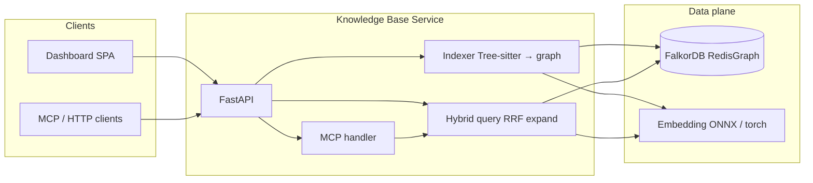

# Knowledge Base Service

Standalone **code and documentation knowledge base**: Tree-sitter parsing, FalkorDB property graph, dense embeddings (BAAI/bge-m3), hybrid retrieval, and a React dashboard. Exposes a **FastAPI** HTTP API and an **MCP-compatible** tool surface for AI agents.

## Key features

- **Multi-language code indexing** — Python, Java, Go, JavaScript, TypeScript (extensible via Tree-sitter)
- **Graph + vector** — Functions, classes, modules, documents, and business entities in FalkorDB with cosine vector indexes
- **Hybrid search** — Keyword (FalkorDB) + semantic + optional child-chunk search, **RRF fusion**, optional **cross-encoder rerank**, **per-file diversity cap**, and **graph expansion** (callers/callees, etc.)
- **Repository workflows** — Local path, `git_url` clone/pull (GitLab-aware config), incremental indexing via git diff
- **Wiki generation & browse** — Generated Markdown wiki pages, hybrid wiki search, MCP wiki tools
- **Role-based auth** — Viewer / Editor / Admin via `tokens.yaml` or env tokens; optional `REQUIRE_AUTH`
- **Dashboard** — React + Vite SPA (search, deep search, graph explorer, repositories, indexing, wiki, sync, settings)

## Architecture


```mermaid
flowchart LR
  subgraph clients [Clients]
    UI[Dashboard SPA]
    Agents[MCP / HTTP clients]
  end

  subgraph kb [Knowledge Base Service]
    API[FastAPI]
    IDX[Indexer Tree-sitter → graph]
    HYB[Hybrid query RRF expand]
    MCP[MCP handler]
  end

  subgraph data [Data plane]
    FK[(FalkorDB RedisGraph)]
    EMB[Embedding ONNX / torch]
  end

  UI --> API
  Agents --> API
  API --> IDX
  API --> HYB
  API --> MCP
  IDX --> FK
  IDX --> EMB
  HYB --> FK
  HYB --> EMB
  MCP --> HYB
```

## Quick start

### Prerequisites

- **Python 3.12+**
- **FalkorDB** (Redis with graph module) reachable from the app
- **uv** for Python env and runs
- **Node.js 20+** and **pnpm** (to build the dashboard into `static/`)

### Install and run (backend)

```bash
cd knowledge-base-service
uv sync
# optional: copy and edit environment
# cp .env.example .env
uv run uvicorn main:app --host 0.0.0.0 --port 8100
```

### Build the dashboard (optional)

The server serves the SPA from `static/` when present.

```bash
cd dashboard
pnpm install
pnpm build
# build output is configured to land in ../static
```

Open the app at `http://localhost:8100` (default). **Health:** `GET /health`.

## Configuration overview

| Variable | Purpose |
|----------|---------|
| `HOST`, `PORT`, `LOG_LEVEL` | Bind address and logging |
| `FALKORDB__HOST`, `FALKORDB__PORT`, `FALKORDB__GRAPH_NAME`, `FALKORDB_PASSWORD` | Graph database connection (`FALKORDB_PASSWORD` applies when nested password is empty) |
| `EMBEDDING__MODEL_NAME`, `EMBEDDING__DEVICE`, `EMBEDDING__BACKEND` | Embedding stack (defaults: bge-m3, `auto`, `onnx` / `torch` on MPS) |
| `LLM__ENABLED`, `LLM__BASE_URL`, `LLM__API_KEY`, `LLM__MODEL` | Optional OpenAI-compatible LLM (deep search, enrichment, wiki ask) |
| `HYBRID_SEARCH__USE_CHILD_CHUNKS`, `HYBRID_SEARCH__CHILD_CHUNK_*` | Parent–child chunk retrieval |
| `RERANK__ENABLED` | Cross-encoder reranking after RRF |
| `RATE_LIMIT_RPM`, `RATE_LIMIT_TRUST_PROXY` | Per-IP rate limit |
| `REQUIRE_AUTH`, `API_TOKEN` / `API_TOKENS`, `TOKENS_FILE` | Authentication |

See [docs/DEPLOYMENT.md](docs/DEPLOYMENT.md) for the full environment reference.

## Dashboard (visual description)

The UI is a **single-page application** with routed views: **Search** (hybrid NL query), **Deep Search** (LLM multi-step, when configured), **Graph Explorer** (entity neighborhood), **Repositories** (indexed repos and stats), **Indexing** (trigger jobs), **Documents**, **Wiki**, **Sync** (schedules), **Businesses**, and **Settings**. Charts and graph layouts load **on demand** per route to keep the initial bundle smaller.

## Documentation

| Doc | Description |
|-----|-------------|
| [docs/README-DOCS.md](docs/README-DOCS.md) | Documentation index and tech stack |
| [docs/ARCHITECTURE.md](docs/ARCHITECTURE.md) | Pipelines, schema, dashboard stack |
| [docs/MCP-INTEGRATION.md](docs/MCP-INTEGRATION.md) | All 16 MCP tools, roles, examples |
| [docs/DEPLOYMENT.md](docs/DEPLOYMENT.md) | Production, env vars, security |
| [docs/DEVELOPMENT.md](docs/DEVELOPMENT.md) | Repo layout, tests, extending the system |
| [docs/ONBOARDING.md](docs/ONBOARDING.md) | First-time user guide |
| [docs/wiki-generation-architecture.md](docs/wiki-generation-architecture.md) | Wiki pipeline and retrieval |
