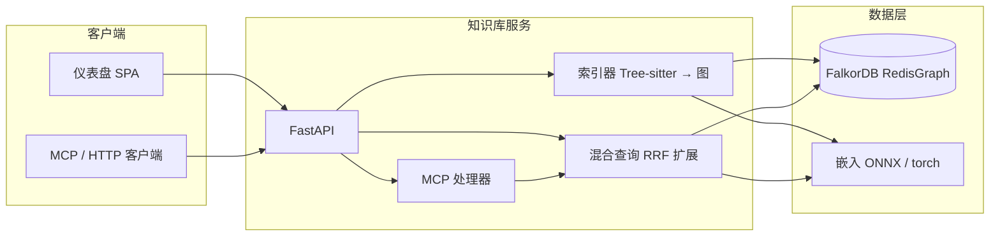

# Knowledge Base Service

独立的**代码与文档知识库系统**：基于 Tree-sitter 解析、FalkorDB 属性图、稠密向量嵌入（BAAI/bge-m3）、混合检索以及 React 仪表盘。对外提供 **FastAPI** HTTP API 和 **MCP 兼容**的工具接口，供 AI Agent 调用。

## 核心特性

- **多语言代码索引** — Python、Java、Go、JavaScript、TypeScript（通过 Tree-sitter 可扩展）
- **图 + 向量** — 函数、类、模块、文档和业务实体统一存储在 FalkorDB，支持余弦向量索引
- **混合搜索** — 关键词 + 语义 + **BM25 全文搜索**三路 **RRF 融合**、可选**交叉编码器重排序**、**每文件多样性上限**及**图扩展**（调用者/被调用者等），支持**分页和排序**
- **跨文件 Import 解析** — 自动将 import 语句解析到实际文件路径（Python / JS / TS / Java / Go），提升调用图和继承图的跨文件精度
- **Blast Radius 分析** — 变更影响范围分析：从变更实体出发沿调用链/继承链/导入链做 BFS，按深度分层展示受影响实体及置信度
- **社区发现** — 基于 Label Propagation 算法自动发现代码模块社区，含内聚度评分和自动标签生成
- **仓库工作流** — 本地路径、`git_url` 克隆/拉取（支持 GitLab 配置）、基于 git diff 的增量索引
- **Wiki 生成与浏览** — 生成 Markdown Wiki 页面，混合 Wiki 搜索，MCP Wiki 工具
- **完整源码获取** — 新增 `get_file_content` MCP 工具，Agent 可直接读取索引仓库的完整源文件，解决代码片段截断导致的幻觉问题
- **文件树浏览器** — Dashboard 新增文件资源管理器页面，支持按目录结构浏览代码、查看实体（函数/类）、快速跳转到图谱/搜索/Wiki
- **NL→Cypher 智能查询** — 自然语言图谱查询：通过 LLM 自动生成 Cypher，降低 Agent 和用户的图谱查询门槛
- **基于角色的认证** — Viewer / Editor / Admin，通过 `tokens.yaml` 或环境变量配置；支持 `REQUIRE_AUTH` 强制认证
- **仪表盘** — React + Vite SPA（搜索、深度搜索、图探索、文件浏览器、Blast Radius、社区发现、仓库管理、索引、Wiki、同步、设置）

## 系统架构


```mermaid
flowchart LR
  subgraph clients [客户端]
    UI[仪表盘 SPA]
    Agents[MCP / HTTP 客户端]
  end

  subgraph kb [知识库服务]
    API[FastAPI]
    IDX[索引器 Tree-sitter → 图]
    HYB[混合查询 RRF 扩展]
    MCP[MCP 处理器]
  end

  subgraph data [数据层]
    FK[(FalkorDB RedisGraph)]
    EMB[嵌入 ONNX / torch]
  end

  UI --> API
  Agents --> API
  API --> IDX
  API --> HYB
  API --> MCP
  IDX --> FK
  IDX --> EMB
  HYB --> FK
  HYB --> EMB
  MCP --> HYB
```

## 快速开始

### 前置条件

- **Python 3.12+**
- **FalkorDB**（Redis + 图模块），确保应用可访问
- **uv** — Python 环境和运行工具
- **Node.js 20+** 和 **pnpm**（用于构建仪表盘到 `static/`）

### 安装与运行（后端）

```bash
cd knowledge-base-service
uv sync
# 可选：拷贝并编辑环境变量
# cp .env.example .env
uv run uvicorn main:app --host 0.0.0.0 --port 8100
```

### 构建仪表盘（可选）

服务器会从 `static/` 目录提供 SPA 静态文件。

```bash
cd dashboard
pnpm install
pnpm build
# 构建产物配置输出到 ../static
```

打开 `http://localhost:8100`（默认端口）。**健康检查：** `GET /health`。

## 配置概览

| 变量 | 用途 |
|------|------|
| `HOST`、`PORT`、`LOG_LEVEL` | 绑定地址和日志级别 |
| `FALKORDB__HOST`、`FALKORDB__PORT`、`FALKORDB__GRAPH_NAME`、`FALKORDB_PASSWORD` | 图数据库连接（`FALKORDB_PASSWORD` 在嵌套密码为空时作为回退） |
| `EMBEDDING__MODEL_NAME`、`EMBEDDING__DEVICE`、`EMBEDDING__BACKEND` | 嵌入栈（默认：bge-m3、`auto`、MPS 上使用 `torch`，否则 `onnx`） |
| `LLM__ENABLED`、`LLM__BASE_URL`、`LLM__API_KEY`、`LLM__MODEL` | 可选的 OpenAI 兼容 LLM（深度搜索、丰富化、Wiki 问答） |
| `HYBRID_SEARCH__USE_CHILD_CHUNKS`、`HYBRID_SEARCH__CHILD_CHUNK_*` | 父子块检索配置 |
| `RERANK__ENABLED` | RRF 后交叉编码器重排序 |
| `RATE_LIMIT_RPM`、`RATE_LIMIT_TRUST_PROXY` | 按 IP 限流 |
| `REQUIRE_AUTH`、`API_TOKEN` / `API_TOKENS`、`TOKENS_FILE` | 认证配置 |

完整环境变量参考请见 [docs/DEPLOYMENT.md](docs/DEPLOYMENT.md)。

## 仪表盘

仪表盘是一个**单页应用**，包含多个路由视图：**搜索**（混合自然语言查询，支持分页排序）、**深度搜索**（LLM 多步推理，需配置 LLM）、**图探索**（渐进式实体邻域探索 + Blast Radius 面板 + 社区发现面板）、**文件浏览器**（目录树 + 源码查看 + 实体泳道）、**仓库**（已索引仓库及统计）、**索引**（触发任务）、**文档**、**Wiki**、**同步**（定时计划）、**业务**及**设置**。图表和图布局按路由**按需加载**，减小初始包体积。

## 文档

| 文档 | 说明 |
|------|------|
| [docs/README-DOCS.md](docs/README-DOCS.md) | 文档索引与技术栈 |
| [docs/ARCHITECTURE.md](docs/ARCHITECTURE.md) | 管道、Schema、仪表盘架构 |
| [docs/MCP-INTEGRATION.md](docs/MCP-INTEGRATION.md) | 全部 17 个 MCP 工具、角色、示例 |
| [docs/DEPLOYMENT.md](docs/DEPLOYMENT.md) | 生产部署、环境变量、安全 |
| [docs/DEVELOPMENT.md](docs/DEVELOPMENT.md) | 项目结构、测试、扩展指南 |
| [docs/ONBOARDING.md](docs/ONBOARDING.md) | 用户上手指南 |
| [docs/wiki-generation-architecture.md](docs/wiki-generation-architecture.md) | Wiki 管道与检索 |
