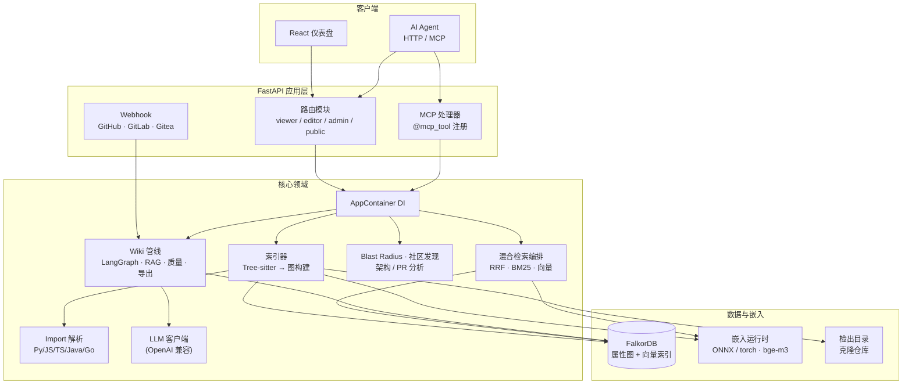

# Knowledge Base Service

独立的**代码与文档知识库系统**：将代码仓库索引为 **FalkorDB 属性图**与 **稠密向量嵌入**（默认 **BAAI/bge-m3**，1024 维），提供 **关键词 + 语义 + BM25 全文**的混合检索（RRF 融合）、可选交叉编码器重排序与图扩展，并内置完整的 **Wiki 生成 / 检索 / 质量 / 自动化**流水线。对外暴露 **FastAPI HTTP API**、与 Agent 集成的 **MCP 兼容工具接口**，以及基于 **React + Vite** 的可视化仪表盘。

---

## 技术栈概览

| 层级 | 技术 |
|------|------|
| **后端运行时** | Python 3.12+，`uv` 管理依赖与运行 |
| **Web 框架** | FastAPI，structlog，`pydantic-settings` |
| **图与向量** | FalkorDB（Redis 生态图数据库）、余弦向量索引 |
| **解析与嵌入** | Tree-sitter 多语言 AST；ONNX Runtime / PyTorch（`torch` 可选依赖）加载 bge-m3 |
| **Wiki / Agent** | LangGraph（Wiki 生成管线编排）、OpenAI 兼容 LLM 客户端 |
| **前端** | React 19、Vite 8、TypeScript 5.9、Tailwind CSS 4、TanStack Query 5、React Router 7 |
| **可视化与编辑** | xyflow（图谱）、Chart.js、CodeMirror、Mermaid 11、react-syntax-highlighter、react-markdown + rehype-sanitize |
| **测试** | 后端 **pytest**（约 **2603** 条用例）；前端 **Vitest**（**306** 条用例，**84** 个测试文件）；**Playwright** E2E |
| **包管理** | `uv`（Python）、`pnpm`（Node.js） |

---

## 核心能力（功能全景）

下列能力均在仓库内有对应实现；细节设计与 API 请参阅 `docs/` 下专题文档。

### 索引与图谱

1. **多语言代码索引**：基于 Tree-sitter 解析 Python、Java、Go、JavaScript、TypeScript；语言与扩展映射可在配置中扩展。
2. **图 + 向量统一存储**：函数、类、模块、文档节点与业务相关实体存入 FalkorDB 标注属性图；实体文本嵌入写入向量索引（cosine）。
3. **跨文件 Import 解析**：将 Python / JS / TS / Java / Go 的 import 解析到真实文件路径，强化调用图、继承图与依赖分析的跨文件一致性。
4. **配置文件文档化**：将 `.yml`、`.yaml`、`.xml`、`.properties`、`.env`、`.toml`、`.conf` 等索引为文档图节点，参与检索与 RAG。
5. **仓库工作流**：支持本地路径索引；支持 `git_url` 克隆 / 拉取（GitLab / GitHub 等，`GIT__GITLAB_URL`、`GIT__GITLAB_TOKEN`、`GIT__GITHUB_TOKEN`、`GIT__SSL_VERIFY` 等配置）；基于 **git diff** 的增量索引以降低重复扫描成本。

### 检索、分析与可视化

6. **混合搜索**：语义向量 + 关键词 + **BM25 全文**多路检索 → **加权 RRF 融合** → 可选 **交叉编码器重排序** → **单文件命中多样性上限（per-file cap）** → **图扩展**（如调用上下游）；支持分页、排序、**跨仓库聚合**（`repositories` 列表）。
7. **Blast Radius**：从变更实体出发，沿调用 / 继承 / 导入边 **BFS** 扩散，分层展示影响范围与置信度。
8. **社区发现**：**Label Propagation** 对代码模块聚类，辅助理解架构边界与模块内聚度。
9. **架构分析**：对类进行分层归类（presentation / business / data_access 等），抽取 HTTP/RPC/Kafka 风格端点。
10. **PR 影响分析**：结合变更集与图谱，评估合并请求的影响面（仪表盘 `/pr-impact` 与相关 HTTP/MCP 能力）。

### Wiki、RAG 与质量

11. **Wiki 生成与浏览**：LLM 驱动的 Markdown Wiki；支持分层生成策略、业务域分类、**跨仓业务 Wiki**；混合 Wiki 搜索与问答。
12. **深度检索与研究**：**深度搜索**支持 LLM 多步推理与 **SSE 流式**输出；**深度研究**基于 **IterativeRAGEngine** 做多轮拆解式检索与综合。
13. **Wiki 质量引擎**：置信度评分、矛盾检测、主张历史；记忆分层（工作记忆 → 情景 → 语义 → 程序性）与遗忘曲线等可调参数。
14. **Wiki 自动化**：GitHub / GitLab / **Gitea** Webhook；定时 Lint、**AutoHealer**、增量摄取等与 `WIKI__*` 开关联动。
15. **Wiki 导出**：Markdown、ZIP、Git 发布、Obsidian、MkDocs 等导出路径（详见 Wiki 配置与路由）。

### 访问控制、集成与工程化

16. **源码与浏览**：**`get_file_content`（MCP）** 读取已检出仓库中的源文件全文或行范围；仪表盘 **文件树** 支持目录导航、语法高亮与实体徽章。
17. **NL→Cypher**：仪表盘侧自然语言生成 **Cypher** 图谱查询（由 LLM 辅助；**非 MCP 工具**，便于人机交互）。
18. **RBAC**：**Viewer（1）/ Editor（2）/ Admin（3）** 三角色；支持 `tokens.yaml` 或环境变量中的令牌；令牌可绑定 **business** 作用域以实现多租户隔离。
19. **MCP 集成**：主服务 **22** 个 MCP 工具（**12** 个核心图谱/检索类 + **10** 个 Wiki 管线类）；在 `WIKI__MCP_SERVER_ENABLED=true` 且 Wiki 已 bootstrap 时，可选 **Wiki HTTP MCP** 额外暴露 **6** 个工具（与主清单互补）。
20. **应用架构**：**AppContainer** 依赖注入组装服务；FastAPI **lifespan** 分阶段初始化（`_init_security` → `_init_core_services` → `_init_wiki_and_lint`，退出时 `_shutdown_all`）；**`@mcp_tool`** + **`collect_tools`** 自动注册 MCP 处理器。
21. **国际化与主题**：仪表盘支持 **深色模式**与中英文 **i18n**。

---

## 仪表盘路由（SPA，按需懒加载）

| 路径 | 页面说明 |
|------|----------|
| `/` | 总览（健康状态、全局统计） |
| `/search` | 混合搜索（分页、排序、筛选） |
| `/explorer` | 图谱浏览器（Dagre 布局、展开子图、Blast Radius、社区） |
| `/files` | 文件浏览器（目录树、语法高亮源码、实体徽章） |
| `/architecture` | 架构分析（分层、端点） |
| `/repositories` | 已索引仓库列表与统计 |
| `/documents` | 文档浏览器 |
| `/indexing` | 索引任务管理 |
| `/wiki` | Wiki（目录树、正文、问答、导出、Lint、质量评估、Flow、知识图谱等子能力） |
| `/pr-impact` | PR 影响分析 |
| `/settings` | 系统配置（LLM、嵌入、存储、Wiki 功能开关等） |
| `/businesses` | 业务空间管理（CRUD、仓库绑定） |
| **兼容跳转** | `/deep-search` → `/search`；`/graph` → `/explorer` |

本地开发可使用 `dashboard` 目录下 `pnpm dev`；生产交付通常 `pnpm build`，静态资源输出到仓库根目录 `static/`，由 FastAPI 挂载。

---

## 系统架构


```mermaid
flowchart TB
  subgraph clients["客户端"]
    SPA["React 仪表盘"]
    Agents["AI Agent\nHTTP / MCP"]
  end

  subgraph api["FastAPI 应用层"]
    Routes["路由模块\nviewer / editor / admin / public"]
    MCP["MCP 处理器\n@mcp_tool 注册"]
    WH["Webhook\nGitHub · GitLab · Gitea"]
  end

  subgraph core["核心领域"]
    CTR["AppContainer DI"]
    IDX["索引器\nTree-sitter → 图构建"]
    IMP["Import 解析\nPy/JS/TS/Java/Go"]
    HYB["混合检索编排\nRRF · BM25 · 向量"]
    EXP["Blast Radius · 社区发现\n架构 / PR 分析"]
    WIKI["Wiki 管线\nLangGraph · RAG · 质量 · 导出"]
    LLM["LLM 客户端\n(OpenAI 兼容)"]
  end

  subgraph data["数据与嵌入"]
    FK[("FalkorDB\n属性图 + 向量索引")]
    EMB["嵌入运行时\nONNX / torch · bge-m3"]
    FS["检出目录\n克隆仓库"]
  end

  SPA --> Routes
  Agents --> Routes
  Agents --> MCP
  WH --> WIKI

  Routes --> CTR
  MCP --> CTR
  CTR --> HYB
  CTR --> IDX
  CTR --> WIKI
  CTR --> EXP

  IDX --> FK
  IDX --> EMB
  IDX --> IMP
  HYB --> FK
  HYB --> EMB
  WIKI --> FK
  WIKI --> LLM
  IDX --> FS
```

---

## 快速开始

### 前置条件

- **Python 3.12+**
- **FalkorDB** 实例可达（Redis + 图模块）
- **uv**（安装与管理 Python 依赖）
- **Node.js 20+** 与 **pnpm**（构建仪表盘）

### 启动后端

```bash
cd knowledge-base-service
uv sync
# 可选：复制并编辑环境变量模板
# cp .env.example .env
uv run uvicorn main:app --host 0.0.0.0 --port 8100
```

默认监听 **`http://localhost:8100`**。

### 构建仪表盘（可选）

```bash
cd dashboard
pnpm install
pnpm build
```

产物写入仓库根目录 **`static/`**，由后端直接提供 SPA。

### 健康检查

```http
GET /api/v1/health
```

初始化完成且 FalkorDB 可达时返回就绪信息；启动早期可能返回 **503**（`registry not started`）。

### 首次索引示例

触发索引需要 **Editor** 或以上角色令牌（若已启用认证）：

```http
POST /api/v1/index
Content-Type: application/json
Authorization: Bearer <your-token>

{
  "repository": "my-service",
  "directory": "/absolute/path/to/repo"
}
```

或使用远程仓库：

```json
{
  "repository": "my-service",
  "git_url": "https://gitlab.example.com/group/repo.git",
  "mode": "full"
}
```

须配置可用的 **`GIT__*`** 凭据与网络访问。增量模式可使用 **`"mode": "incremental"`** 配合 **`base_ref` / `head_ref`**。完整字段说明见 `docs/ONBOARDING.md` 与 `api/routes/kb_schemas.py` 中的 `IndexRequest`。

---

## 仓库目录结构（概要）

```
knowledge-base-service/
├── main.py                 # FastAPI 应用与 lifespan（安全 / 核心服务 / Wiki·Lint / 关停）
├── config.py               # Pydantic 配置（FalkorDB、Embedding、LLM、Wiki、Git、HybridSearch、Rerank…）
├── auth.py                 # 令牌注册表、Role（VIEWER=1 / EDITOR=2 / ADMIN=3）、business 作用域
├── log.py                  # structlog；LOG_FORMAT=console|json（环境变量）
├── core/
│   └── container.py        # AppContainer 服务容器
├── api/
│   ├── mcp_server.py       # 主 MCP（核心 + Wiki 工具合并清单）
│   ├── mcp_registry.py     # @mcp_tool、collect_tools
│   ├── mcp_wiki_server.py  # 可选 Wiki HTTP MCP（6 工具）
│   ├── pagination.py
│   ├── rate_limiter.py
│   └── routes/             # HTTP 路由模块
├── indexer/                # Tree-sitter、构图、嵌入、import 解析
├── store/                  # FalkorDB Cypher 与存储封装
├── query/                  # 混合搜索、Blast Radius、NL→Cypher 等编排
├── search/                 # RRF 等检索融合辅助
├── wiki/                   # Wiki 生成、RAG、搜索、Lint、质量、记忆、Webhook、导出
├── llm/                    # OpenAI 兼容 LLM 提供者抽象
├── services/               # ServiceRegistry、RepoRegistry、SyncScheduler 等
├── dashboard/              # React + Vite SPA
├── tests/                  # 后端 pytest 套件
└── docs/                   # 设计与运维文档
```

---

## 配置要点（环境变量）

以下为最常调整的变量；嵌套配置使用 **`__`** 分隔（见 `Settings` 中 `env_nested_delimiter`）。Wiki 相关开关众多（约 **50+**），完整列表以 `config.py` 中 `AppWikiFlags` 与 `docs/DEPLOYMENT.md` 为准。

| 类别 | 变量示例 | 说明 |
|------|-----------|------|
| **核心** | `HOST`、`PORT`、`LOG_LEVEL` | 绑定与日志级别 |
| **日志格式** | `LOG_FORMAT` | `console`（默认）或 `json` |
| **CORS** | `CORS_ORIGINS` | 逗号分隔允许来源；空则不加 CORS 中间件 |
| **FalkorDB** | `FALKORDB__HOST`、`FALKORDB__PORT`、`FALKORDB__PASSWORD`、`FALKORDB__GRAPH_NAME` | 图数据库连接；顶层 `falkordb_password` 可作嵌套密码为空时的回退（见部署文档） |
| **嵌入** | `EMBEDDING__MODEL_NAME`、`EMBEDDING__DEVICE`、`EMBEDDING__BACKEND` | 默认 bge-m3；`device=auto`；后端 `onnx` / `torch` / `auto` |
| **LLM** | `LLM__ENABLED`、`LLM__BASE_URL`、`LLM__API_KEY`、`LLM__MODEL` | 深度搜索、Wiki、NL→Cypher 等可选能力 |
| **混合检索** | `HYBRID_SEARCH__USE_CHILD_CHUNKS`、`HYBRID_SEARCH__ENABLE_BM25` | 子块检索、BM25 路径开关 |
| **重排序** | `RERANK__ENABLED` | RRF 后交叉编码器重排序 |
| **Wiki** | `WIKI__*` | 生成层级、质量、记忆、自动化、导出、可选 Wiki MCP 等 |
| **Git** | `GIT__GITLAB_URL`、`GIT__GITLAB_TOKEN`、`GIT__GITHUB_TOKEN`、`GIT__SSL_VERIFY` | 远程克隆与 PR 抓取等 |
| **认证** | `REQUIRE_AUTH`、`API_TOKEN`、`API_TOKENS`、`TOKENS_FILE` | RBAC；无令牌时默认开放（生产请务必配置） |
| **限流** | `RATE_LIMIT_RPM`、`RATE_LIMIT_TRUST_PROXY` | 按 IP 令牌桶限流 |

---

## 文档索引

| 文档 | 说明 |
|------|------|
| [docs/README-DOCS.md](docs/README-DOCS.md) | 文档导航与技术栈摘要 |
| [docs/ARCHITECTURE.md](docs/ARCHITECTURE.md) | 系统架构、流水线、Schema、仪表盘 |
| [docs/MCP-INTEGRATION.md](docs/MCP-INTEGRATION.md) | 全部 **22** 个主 MCP 工具 + **可选 6** 个 Wiki HTTP MCP、角色与示例 |
| [docs/DEPLOYMENT.md](docs/DEPLOYMENT.md) | 生产部署、环境变量、Docker、安全 |
| [docs/DEVELOPMENT.md](docs/DEVELOPMENT.md) | 目录说明、测试与扩展指南 |
| [docs/ONBOARDING.md](docs/ONBOARDING.md) | 用户上手与常见路径 |
| [docs/wiki-generation-architecture.md](docs/wiki-generation-architecture.md) | Wiki 流水线、RAG、质量与自动化 |
| [docs/IMPLEMENTATION-STATUS.md](docs/IMPLEMENTATION-STATUS.md) | 代码与规划对照状态 |
| [docs/KNOWN-ISSUES.md](docs/KNOWN-ISSUES.md) | 已知问题与规避方式 |
