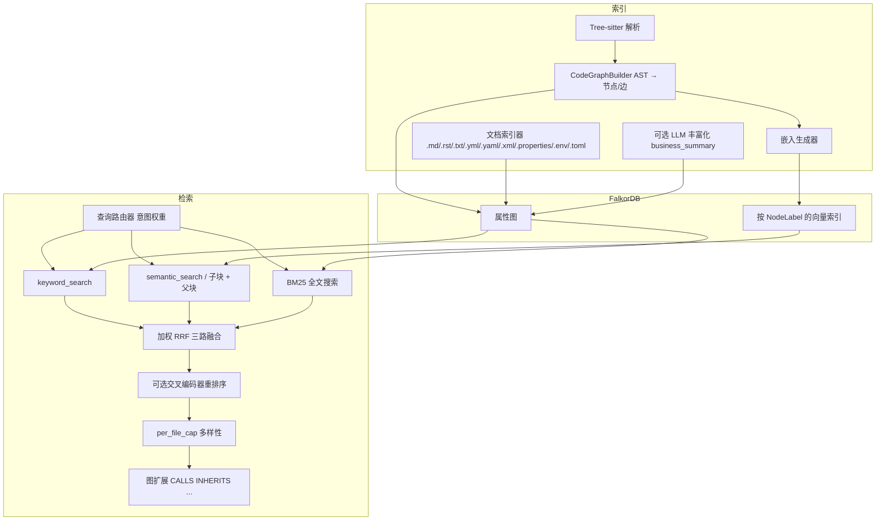
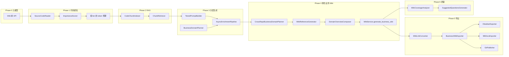

# 系统架构

## 整体架构

## 后端组件

| 组件 | 职责 |
|------|------|
| **FastAPI**（`main.py`） | HTTP API、静态 SPA 托管、生命周期管理（注册中心、调度器、Wiki 服务初始化） |
| **FalkorDB** | 带标签的属性图 + 全文/向量操作，由分层 Store 封装（`FalkorDBStore` / `SearchStore` / `TraversalStore` / `AnalysisStore` / `WikiStore` / `IndexerStore`） |
| **Tree-sitter** | 按文件 AST 捕获；每种语言的查询规则驱动 `CodeGraphBuilder` |
| **嵌入**（Embeddings） | `EmbeddingConfig`：默认 `BAAI/bge-m3`，在多种节点标签上建立向量索引（参见 `store/schema.py` 中的 `VECTOR_INDEX_CONFIGS`） |
| **LLM**（可选） | OpenAI 兼容 API，用于深度搜索、可选索引丰富化（`LLMConfig`） |
| **MCP 处理器**（`api/mcp_server.py`） | 混合/图/索引/Wiki（与 `wiki/mcp_tools.py` 合并清单）；**`get_file_content`** 读检出源文件；NL→Cypher 仅供 Dashboard UI 使用（`query/nl_cypher.py`，不暴露为 MCP 工具） |
| **业务 Wiki 任务** | `wiki/task_store.py`（**WikiTaskStore**：Redis Hash 任务元数据 + 并发锁）、`wiki/task_registry.py` 可选委托；`wiki/bootstrap` 注入 `app.state.wiki_task_store`；**`POST /api/v1/wiki/business/generate`** 返回 **202** 与后台 `task_id`，**`GET /api/v1/wiki/business/tasks/{task_id}`** 取进度；与增量 Ingest 正交的 **仓库级增量跳过** 见 `get_repo_wiki_freshness` + `WikiService.generate_business_wiki` |
| **Wiki MCP 子服务**（`api/mcp_wiki_server.py`） | 可选；`WIKI__MCP_SERVER_ENABLED` 为 true 时注册 `mcp_wiki_server`，HTTP：`GET /api/v1/mcp/tools/list`、`POST /api/v1/mcp/tools/call`（六工具，见 [MCP-INTEGRATION.md](MCP-INTEGRATION.md)） |
| **增量 Ingest** | `POST /api/v1/wiki/ingest` 按文件列表触发增量再生成；`GET /api/v1/wiki/changelog` 查仓库变更记录；`POST /api/v1/hooks/ingest/push` 在 Webhook 链路上触发自动 Ingest（与 `wiki/bootstrap` 中 `ChangeDetector` / `WikiChangeLogStore` 协同） |
| **Lint 与自愈** | `wiki/lint.py`（`WikiLintService`）含质量 lint、可选**置信度重算**、**模式校验**；`WikiLintService.run_lint()` 在 `WIKI__AUTO_HEAL_ENABLED=true`（`WikiConfig` 默认 `true`）时于 lint 后调用 **`AutoHealer.heal()`**，heal 指标写入 **`WikiChangeLog`**。`wiki/lint_scheduler.py` 在 `WIKI__LINT_SCHEDULER_ENABLED=true`（默认 `true`）下由 `main.py` 生命周期**启动**并周期性对注册仓库跑 `run_lint`；`wiki/auto_healer.py` 中的 **`AutoHealer`** 实现**断链（悬空 `WIKI_REFERENCES`）清理**与**无 `SOURCE_ENTITY` 的孤儿页降级**，**不**做陈旧页打标。HTTP / MCP / 调度器均经 `run_lint` 走同一管线（见 [IMPLEMENTATION-STATUS.md](IMPLEMENTATION-STATUS.md)） |
| **知识质量引擎** | `wiki/confidence_scorer.py` + `confidence_inputs.py`：页级 `confidence_score`（0.0–1.0）；矛盾检测与 LLM 裁决图持久化；主张/版本/替代关系（`supersession`）与 `GET /api/v1/wiki/pages/claim-history` |
| **记忆演化** | `wiki/memory_loop.py` 将问答沉淀为可检索记忆并注入生成上下文；`wiki/memory_tiers.py` 实现 Working→Episodic→Semantic→Procedural 分层与提升；`WIKI__FORGETTING_ENABLED` 时按保留曲线缓释优先级（不删节点） |
| **深度研究与合并** | `wiki/deep_research.py`：`POST /api/v1/wiki/research` 多轮分解；概念合并候选在 `WIKI__CONCEPT_MERGING_ENABLED` 时经 `GET /api/v1/wiki/merge-candidates` 等暴露 |
| **AGENTS.md** | `wiki/agents_md_generator.py` 从 Wiki 元数据生成供 AI Agent 阅读的结构化 Markdown（与导出/生成管线配合） |

## 索引管道

1. **解析** — 遍历源文件（遵守 `exclude_dirs` / `file_extensions`）；Tree-sitter 生成函数、类、导入、调用等 AST 节点。
2. **AST → 图** — `CodeGraphBuilder` 生成 `GraphNode` / `GraphEdge`，包含 `NodeLabel` 和 `EdgeType`（如 `CALLS`、`IMPORTS`、`CONTAINS`）。
3. **跨文件 Import 解析** — `ImportResolver` 在索引开始时构建文件索引，将 import 语句解析到实际文件路径（Python/JS/TS/Java/Go），生成精确的 `IMPORTS` 边；解析失败时回退到虚拟 Module 节点。
4. **父子块** — 大型函数/类/文档段落可被拆分为 `Chunk` 节点（`child_chunker.py`），通过 `PART_OF` 边关联；嵌入可针对子块生成。
5. **持久化** — `batch_upsert` 写入 FalkorDB；按标签更新向量索引。
6. **丰富化**（可选） — LLM 生成 `business_summary`。由 `enrichment_strategy` 配置控制：
   - `disabled`（默认）：索引阶段不调用 LLM，所有 enrichment 延迟到 Wiki 生成阶段
   - `core_only`：仅对核心业务实体（Controller/Service/Handler 等）在索引时 enrich，其余延迟到 Wiki 阶段

## 检索管道

1. **查询路由** — `query_router.route_query` 根据查询形态（标识符、自然语言等）动态调整关键词与语义的权重。
2. **查询扩展**（可选，`HYBRID_SEARCH__QUERY_EXPANSION_ENABLED`） — 以初始关键词命中为种子，从调用链/类方法中提取邻居名称构造辅助查询。
3. **并行三路检索** — 关键词经 `keyword_search`、语义经实体嵌入或子块路径、**BM25 全文搜索**（`SearchStore.fulltext_search`，基于 FalkorDB RediSearch 内置全文索引）三路并行执行。
4. **RRF 三路融合** — `rrf_fusion` 按查询权重合并三路排序列表（关键词权重 1.5、语义权重 1.0、BM25 权重 1.2，可配置）。
5. **重排序** — 若 `RERANK__ENABLED`，交叉编码器对融合候选进行重排序（`position_aware_blend` 结合 RRF 分数）。
6. **多样性** — `_apply_per_file_cap` 限制每个文件的命中数（默认 `per_file_cap=3`）。
7. **图扩展** — 从融合种子出发，沿关系遍历至 `expand_depth` 深度，获取上下文相关邻居。
8. **分页与排序** — 最终结果支持 `offset`/`limit` 分页和按分数/名称/路径排序。
9. **跨仓聚合** — `repositories: ["a", "b"]` 参数触发多仓并行搜索（`asyncio.gather`），各仓结果按分数排序合并，`uid` 级去重后再统一分页。支持部分失败容错（`return_exceptions=True`）。
10. **NL→Cypher**（Dashboard UI 专用）— 通过 LLM 生成只读 Cypher 后直接查图（不走上述 RRF 管道；详见 `query/nl_cypher.py`）。此能力供 Dashboard 的图谱查询面板使用，不暴露为 MCP 工具，Agent 可通过组合 `rag_query` + `rag_graph` 自主实现类似效果。

## 文件内容访问

**HTTP**：`GET /api/v1/files/tree`、`/api/v1/files/content`、`/api/v1/files/entities` — 仪表盘文件浏览器与 **`get_file_content`** MCP 工具共用路径校验与仓库解析逻辑：从本地检出读取文件，防止目录穿越与越出仓库根；二进制拒绝；单次读取上限与 MCP 一致。**文件树 API 需指定 `repository`。**

## Blast Radius 分析

`BlastRadiusAnalyzer`（`query/blast_radius.py`）从变更实体出发，沿 incoming `CALLS`/`INHERITS`/`IMPORTS` 边做 BFS，按深度分层返回受影响实体。每个受影响实体附带置信度分数（随深度衰减）和关系类型。支持按仓库过滤。

## 社区发现

`CommunityDetector`（`query/community_detection.py`）使用 Label Propagation 算法在代码图上自动发现模块社区。每个社区包含自动标签（前 3 个高连接度节点名）和内聚度评分（内部边数 / 可能边数）。

## 父子块策略

通过 `HybridSearchConfig` 配置：

| 设置 | 默认值 | 含义 |
|------|--------|------|
| `use_child_chunks` | `true` | 子块级检索 + 父块分组；MCP 调用者可省略此参数以继承服务端设置 |
| `child_chunk_window_chars` | 800 | 滑动窗口大小（约 200 token） |
| `child_chunk_stride_chars` | 600 | 重叠步长（约 25%） |
| `child_chunk_min_parent_chars` | 400 | 低于此阈值的父块跳过分块 |

子块在生成嵌入前会添加父签名上下文前缀（`indexer/child_chunker.py`）。

## 知识图谱 Schema

### NodeLabel（`store/schema.py`）

`Function`、`Class`、`Module`、`Document`、`BusinessFlow`、`BusinessConcept`、`WikiPage`、`WikiSpace`、`WikiSection`、`Chunk`。

### EdgeType

| 边类型 | 典型用途 |
|--------|----------|
| `CALLS`、`INHERITS`、`IMPORTS`、`CONTAINS`、`USES_TYPE`、`REFERENCES` | 代码结构 |
| `IMPLEMENTS`、`RELATES_TO`、`PART_OF`、`CONCEPT_IN`、`HAS_CHILD`（Wiki 树，`view_type`） | 业务/块层次 / Wiki 层级 |
| `PROVIDES_RPC`、`CONSUMES_RPC`、`CROSS_REPO_CALLS` | RPC / 多仓库 |
| `DEPENDS_ON`、`ACCESSES_TABLE`、`EVENT_PRODUCES`、`EVENT_CONSUMES` | 依赖注入 / 数据 / Kafka |
| `SOURCE_DOC` | Wiki 来源溯源 |

## 仪表盘架构

- **技术栈**：React + **Vite**（`dashboard/`）、TypeScript、Tailwind、React Router。
- **交付方式**：生产构建输出至 `static/`；FastAPI 挂载 `/assets` 并对 SPA 路由回退至 `index.html`（`search`、`deep-search`、`graph`、`explorer`、`files`（文件浏览器）、`repositories`、`indexing`、`settings`、`businesses`、`documents`、`sync`）。
- **懒加载**：基于路由的代码分割减小初始 JS 体积；重型可视化组件（图表、图形）仅在导航到对应页面时加载。

## Wiki 生成管道（Phase 0–6）

本节概括 **Wiki 元模型重置**、**代码感知 → RAG → 分层生成 → 跨仓业务 Wiki**、**导出与 Git 推送**、**质量保障** 的后端能力。上述主题曾计划拆成独立 spec 文档；当前以 [wiki-generation-architecture.md](wiki-generation-architecture.md) 与 [superpowers/specs/2026-04-26-llm-wiki-v2-upgrade-design.md](superpowers/specs/2026-04-26-llm-wiki-v2-upgrade-design.md) 为**主要设计引用**。实现与规划差异见 [IMPLEMENTATION-STATUS.md](IMPLEMENTATION-STATUS.md)。

### Wiki 数据模型（FalkorDB）

| 概念 | 说明 |
|------|------|
| **WikiSpace** | Wiki 树空间的根层容器节点 |
| **WikiSection** | 树中的章节/分组节点 |
| **HAS_CHILD** | 父子边；携带 `view_type`：`business_domain`（业务域视图）或 `code_structure`（代码结构视图） |
| **WikiPage**（扩展字段） | `path`、`version`、`importance_tier`、`content_hash`、`repositories` 等，用于版本、重要性分层与多仓归属 |

业务侧树查询：**`GET /api/v1/wiki/tree?business_id=&view=`**（按业务与视图类型拉取 Wiki 树；需已登录 `VIEWER+`）。

### 端到端流水线

- **Phase 1**：`SourceCodeReader` 从 `Chunk.text`、文件或签名回退读取源码；`ImportanceScorer` 基于图做 **core / standard / skeleton** 重要性；各 tier 有 **token 预算**。
- **Phase 2**：`CodeChunkIndexer` 批量为 `Chunk` 生成嵌入；`ChunkRetriever` 语义检索代码块；**`POST /api/v1/wiki/chunks/index`** 触发索引。
- **Phase 3**：`TieredPromptBuilder` 按重要性 tier 选用不同提示；`AsyncEnrichmentPipeline` 异步推进 **base → enriched → encyclopedia**；`BusinessDomainPlanner` 用 LLM 做模块到业务域分类（单仓模块数超过 `WikiConfig.business_domain_sub_batch_size` 时**子批**多次调用并合并结果，避免单次超大 prompt 触发长时间读超时）；全程可跟踪 **EnrichmentLevel**。底层 LLM 经 `LLMPortBridge.generate_stream()` 走 **SSE 流式**，长响应期间保持连接活性，缓解 httpx 等客户端读超时。
- **Phase 4**：跨仓域规划（`CrossRepoBusinessDomainPlanner`：多仓并行分类、单仓超时、内容哈希 + TTL 的进程内有界缓存；`WIKI__BUSINESS_DOMAIN_*`）、从代码图自动生成交叉引用、域总览页组合；**`WikiService.generate_business_wiki()`**（支持 **`incremental`** 与 **进度回调**）；**`POST /api/v1/wiki/business/generate`** 为**异步**（**202**、`task_id`；同 business 并发生成 **409**）；**`GET /api/v1/wiki/business/tasks/{task_id}`** 轮询任务进度；**`GET /api/v1/wiki/pages/{page_uid}/references`**。MCP 扩展：**`wiki_get_tree`**、**`wiki_get_related`**、**`wiki_get_domain_overview`**（与既有 Wiki MCP 工具并存，以服务端清单为准）。调参与默认值见 `WikiConfig` / [DEPLOYMENT.md](DEPLOYMENT.md) 中 `WIKI__BUSINESS_DOMAIN_*`。详见 [superpowers/specs/2026-04-27-wiki-generation-architecture-improvement-design.md](superpowers/specs/2026-04-27-wiki-generation-architecture-improvement-design.md) 与 [IMPLEMENTATION-STATUS.md](IMPLEMENTATION-STATUS.md)。
- **Phase 5**：`WikiLinkConverter` 将 `[[wikilink]]` 转为多种格式；`BusinessWikiExporter` 导出扁平文件树；`ObsidianExporter`（含 `.obsidian/`）、`MkDocsExporter`（含 `mkdocs.yml`）；`GitPublisher` 增量 Git 推送与注释回写；**`POST /api/v1/wiki/export`**（`markdown` / `zip` / `git` / `obsidian` / `mkdocs` 等）。
- **Phase 6**：`WikiCoverageAnalyzer` 覆盖率、知识缺口与陈旧检测；`SuggestedQuestionsGenerator` 模板化探索问题；**`GET /api/v1/wiki/coverage-report`**。

## 增量 / MCP / 质量 v2 扩展（概览；非 Phase 0–6 的「SP3–SP6」编号）

> **注意**：下表中的「增量 Ingest、MCP、质量引擎」等对应 **全量升级草案** [llm-wiki-full-upgrade-design](superpowers/specs/2026-04-26-llm-wiki-full-upgrade-design.md) 中 **SP3–SP6** 的叙述；[v2 已批准 spec](superpowers/specs/2026-04-26-llm-wiki-v2-upgrade-design.md) 使用**另一套** SP1–SP7 编号。详见 [IMPLEMENTATION-STATUS.md](IMPLEMENTATION-STATUS.md)。

以下能力与 Phase 0–6 **正交**：通过 `WikiConfig`（环境前缀 `WIKI__`）与独立 HTTP/MCP 面启用；细节见 [wiki-generation-architecture.md](wiki-generation-architecture.md) 与 [DEPLOYMENT.md](DEPLOYMENT.md)。

| 子系统 | 职责摘要 |
|--------|----------|
| **增量 Ingest** | 推代码后按路径增量再生成、changelog 可观测；与 Git Webhook 的 `/hooks/ingest/push` 集成 |
| **MCP Wiki HTTP 六工具** | `wiki_search` / `wiki_explain` / `wiki_navigate` / `wiki_qa` / `wiki_impact` / `wiki_get_snapshot`；与主清单分离，需 `WIKI__MCP_SERVER_ENABLED` |
| **内联 Wikilink** | 正文 `[[EntityName]]` 在组合/导出时解析为 Markdown 链向已有 Wiki 页或占位 |
| **业务流图** | `GET /api/v1/wiki/flows?business_id=` 提供节点（及预留边）供仪表盘 **xyflow** 渲染 |
| **用户反馈** | `POST/GET .../pages/{page_uid}/feedback`；纳入置信度与质量信号（见 `WIKI__FEEDBACK_ENABLED`） |
| **质量引擎（v2）** | 页级置信度、跨页矛盾（列表与 `acknowledge`/`resolve`）、主张历史与替代追踪 |
| **记忆层 + 遗忘** | 四层记忆、晋升规则；Ebbinghaus 式稳定性降低检索权重而非删除 |
| **Schema 校验** | `WIKI__SCHEMA_VALIDATION_ENABLED` 时用 `WIKI__SCHEMA_PATH`（默认 `wiki/schema.yaml`）在 lint 中校验页结构 |
