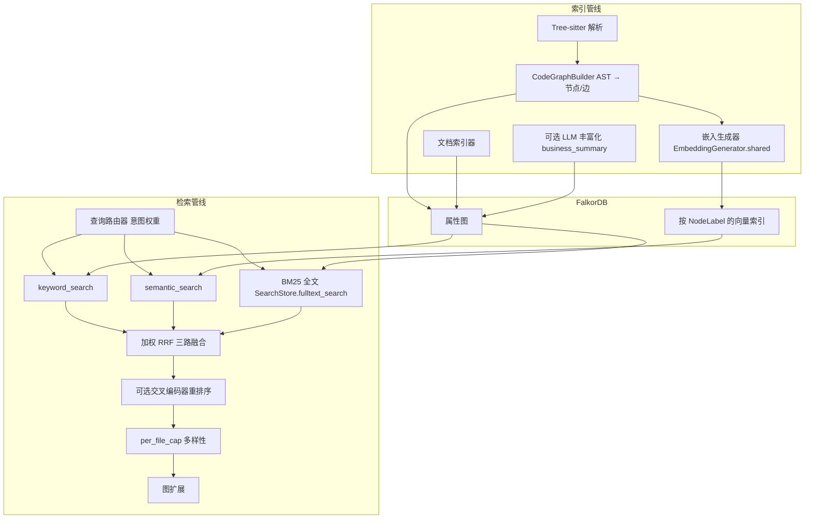
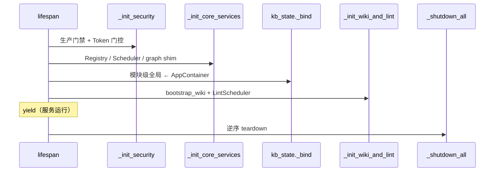
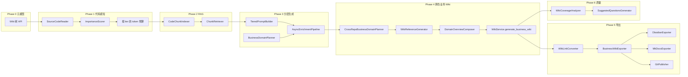

# Knowledge Base Service — 系统架构

本文档描述 **Knowledge Base Service** 的全栈架构：FastAPI 生命周期、依赖容器、HTTP 路由与中间件、FalkorDB 分层存储、索引与检索管道、Wiki 生成与质量子系统、MCP、仪表盘 SPA，以及横切模块（分页、FQN、协议边界）。实现细节与规划差异另见 [IMPLEMENTATION-STATUS.md](IMPLEMENTATION-STATUS.md)；Wiki 生成流水线延展说明见 [wiki-generation-architecture.md](wiki-generation-architecture.md)。

---

## 1. 顶层数据流

下列示意图概括 **索引 → 图与向量 → 混合检索** 的主路径（不含 Wiki 组合与 MCP）。

---

## 2. 应用生命周期（`main.py`）

FastAPI 通过 **`lifespan`** 上下文管理启动与关闭；初始化逻辑拆分为若干函数，便于测试与阅读。

### 2.1 `_init_security(settings)`

1. **`_enforce_production_security`**：`KB_ENV=production` 时强制 **`require_auth=true`** 且至少配置一种 API Token（`API_TOKEN` / `API_TOKENS` / `tokens.yaml`），否则拒绝启动。
2. **`_startup_auth_gate`**：若当前为开放认证模式（未配置 Token），记录告警；若同时 **`require_auth`** 已启用却无 Token，则启动失败。

### 2.2 `_init_core_services(container, app)`

1. 创建 **`IndexTaskManager`**，并向 **`ServiceRegistry`** 注入 MCP 可用的索引任务状态查询回调。
2. 基于 **`clone_base_path`** 解析数据目录，创建 **`RepoRegistry`**、**`SettingsStore`**（同时挂载 **`app.state.settings_store`**）。
3. 构造并 **`await registry.start()`** 启动 **`ServiceRegistry`**（共享 FalkorDB 连接、按业务 **`KnowledgeBaseService`**、就绪检查等）。
4. 取默认业务 **`KnowledgeBaseService`**，将 **`_AppGraphQuery`**（封装 **`FalkorDBStore.execute_query`**）挂到 **`app.state.graph`**，供 Business 路由等执行只读 Cypher。
5. 创建 **`SyncScheduler`**（持久化调度文件、`repo_registry` 注入），**`await scheduler.start()`**。
6. 镜像 **`app.state.registry`**、**`app.state.scheduler`**。

> **图查询线程池**：FalkorDB 驱动调用在 **`store/falkordb_store.py`** 的全局 **`ThreadPoolExecutor`**（**`_graph_executor`**）上卸载执行；**`_shutdown_all`** 末尾对其 **`shutdown(wait=False)`**，避免阻塞退出。

### 2.3 `_init_wiki_and_lint(container, app)`

1. **`init_webhook_state(app)`** — Webhook 相关状态。
2. **`WikiCache`** — 若 **`app.state.wiki_cache`** 为空则初始化。
3. **`wiki_lint_service_factory`** — 异步工厂：按配置可选装配 **`ContradictionDetector`**（嵌入相似度门控 + LLM 裁决），返回 **`WikiLintService`**（质量 lint、置信度重算、Schema 校验等与配置联动）。
4. **`await bootstrap_wiki(app, container.settings)`** — 将 Wiki 子系统各服务写入 **`app.state`**，并回填 **`AppContainer`** 中 Wiki 相关字段（见下文容器一节）。
5. **`LintScheduler`** — 当 **`WIKI__LINT_SCHEDULER_ENABLED`** 为真时，按间隔秒数周期对注册仓库调用 **`run_lint`**，实例保存在 **`app.state.wiki_lint_scheduler`**。

### 2.4 `lifespan` 其余步骤

- 构造 **`AppContainer`**（仅 **`settings`** 初始必填）。
- **`await _init_core_services`** → **`kb_state._bind(container)`** → **`app.state.container = container`**。
- **`await _init_wiki_and_lint`**。

### 2.5 `_shutdown_all(container, app)`（逆序卸载）

1. 停止 **`wiki_lint_scheduler`**（若存在）。
2. **`await teardown_wiki(app)`**。
3. **`await container.scheduler.stop()`**。
4. **`await container.registry.stop()`**。
5. **`await wiki_event_bus.shutdown()`**（若已挂载）。
6. **`_graph_executor.shutdown(wait=False)`**。

---

## 3. 服务容器（`core/container.py`）

**`AppContainer`** 为 **`dataclass`**，承载进程级单例依赖，取代历史上散落在 **`api/kb_state.py`** 的全局可变状态。

### 3.1 核心字段（启动期填充）

| 字段 | 说明 |
|------|------|
| **`settings`** | 全局 **`Settings`** |
| **`registry`** | **`ServiceRegistry`** |
| **`task_manager`** | **`IndexTaskManager`** |
| **`repo_registry`** | **`RepoRegistry`** |
| **`scheduler`** | **`SyncScheduler`** |
| **`settings_store`** | **`SettingsStore`** |
| **`reindex_sem`** | **`asyncio.Semaphore(1)`**，并发重建索引上限 |
| **`index_sem`** | **`asyncio.Semaphore(2)`**，并发索引任务上限 |

### 3.2 Wiki 子系统字段（**`bootstrap_wiki`** 后可选填充）

均为 **`Optional`/任意类型** 占位，与 **`app.state`** 对齐，包括但不限于：`wiki_store`、`wiki_service_factory`、`wiki_search_service`、`wiki_ask_service`、`wiki_event_bus`、`wiki_task_store`、`wiki_feedback_store`、`wiki_feedback_regen`、`wiki_cache`、`wiki_lint_service_factory`、`wiki_lint_scheduler`、`graph_query_service`、`conversation_store`、`change_detector`、`wiki_changelog_store`、`wiki_memory_loop`、`wiki_deep_research_service`、`mcp_wiki_server`。

### 3.3 过渡兼容层（`api/kb_state.py`）

**`_bind(container)`** 在 **`lifespan`** 中调用，将 **`registry`、`task_manager`、`repo_registry`、`scheduler`** 同步到模块级变量，供尚未迁移的调用点使用；容器本体保存在 **`_container`**。**模块级 `reindex_sem` / `index_sem`** 仍为常量语义下的默认值（与容器内实例并行存在时注意一致性时应优先读 **`AppContainer`**）。

---

## 4. HTTP 中间件栈（`create_app` 顺序）

自外向内（最后添加的最先执行）：

| 顺序（响应回程） | 组件 | 行为摘要 |
|------------------|------|----------|
| 1 | **`CORSMiddleware`** | 仅当配置了 **`cors_origins`**；允许凭证与常用 Method/Header |
| 2 | **`RequestLoggingMiddleware`** | 始终启用，请求日志 |
| 3 | **`register_exception_handlers`** | 统一异常映射 |
| 4 | **`RateLimiterMiddleware`**（**`install_rate_limiter`**） | 每 IP 令牌桶；跳过 **`/assets/`**、**`/favicon.ico`**、精确路径 **`/health`**；**`RATE_LIMIT_RPM`** 配置（0=关闭）；可选 **`trust_proxy`** 读取 **`X-Forwarded-For`** |

> **说明**：公开健康检查路由注册在 **`public_router`** 上为 **`GET /api/v1/health`**；速率限制跳过列表中的 **`/health`** 与此前缀不一致时，以 **`api/rate_limiter.py`** 实现为准。

---

## 5. 路由映射（十套路由）

所有 **`APIRouter`** 在 **`main.create_app`** 中 **`include_router`**；部分路由在子路径上再叠加 **`Depends(require_role(...))`**。

| 路由器 | 前缀 | 最低角色 / 备注 |
|--------|------|------------------|
| **`public_router`** | **`/api/v1`** | 无全局角色依赖（如 **`/health`**、**`/auth/me`**） |
| **`webhook_router`** | **`/api/v1/hooks`** | 混合：提供商 HMAC 校验与 **`ingest`** 等路径上的 **`Editor`** 等按需声明 |
| **`provider_router`** | **`/api/v1`** | 全局 **`VIEWER`**；**`/llm/providers/{name}/models`** 需 **`ADMIN`** |
| **`wiki_router`** | **`/api/v1/wiki`** | 全局 **`VIEWER`** |
| **`mcp_wiki_http_router`** | **`/api/v1/mcp`** | 全局 **`VIEWER`**（Wiki HTTP MCP 六工具子路由） |
| **`viewer_router`** | **`/api/v1`** | **`VIEWER`** |
| **`editor_router`** | **`/api/v1`** | **`EDITOR`** |
| **`admin_router`** | **`/api/v1`** | **`ADMIN`** |
| **`settings_router`** | **`/api/v1/settings`** | **`ADMIN`** |
| **`business_router`** | **`/api/v1`** | **混合**：路由级 **`Depends`**（如 **`list_businesses`** 等对 **`VIEWER`** 开放） |

---

## 6. 后端组件总览（按职责）

1. **FastAPI（`main.py`）**：HTTP API、静态 SPA（**`static/`**）、**`lifespan`** 分解初始化与安全门禁。
2. **`AppContainer`（`core/container.py`）**：依赖容器，取代零散全局单例。
3. **FalkorDB 生态**：属性图 + RediSearch 向量/全文；由多层 **`Store`** 与 **`BusinessManager`** 封装（下一节）。
4. **Tree-sitter**：按语言 AST 抽取符号与调用；查询驱动 **`CodeGraphBuilder`**。
5. **嵌入（`EmbeddingConfig`）**：默认 **`BAAI/bge-m3`**，**1024** 维；**ONNX**（默认）或 **torch** 后端；**`EmbeddingGenerator.shared()`** 进程内复用。
6. **LLM（可选，`LLMConfig`）**：OpenAI 兼容 **`openai` / `azure` / `custom` / `gateway`**；**gateway** 可同时支持 WebSocket 与 HTTP。
7. **主 MCP（`api/mcp_server.py` + `api/mcp_registry.py`）**：**`@mcp_tool`** 注册，**`collect_tools()`** 构建派发字典；与 **`wiki/mcp_tools.py`** 合并共 **22** 个工具（**12** 核心 + **10** Wiki）。
8. **`WikiTaskStore`（`wiki/task_store.py`）**：Redis Hash 任务元数据 + **`SET NX EX`** 业务级锁与 Lua CAS 解锁（见 §13）。
9. **Wiki MCP 子服务（`api/mcp_wiki_server.py`）**：可选 HTTP MCP（**`WIKI__MCP_SERVER_ENABLED`**），六工具清单见 [MCP-INTEGRATION.md](MCP-INTEGRATION.md)。
10. **增量 Ingest**：按文件列表 **`POST /wiki/ingest`**、**`changelog`**、**`/hooks/ingest/push`** 与 **`ChangeDetector`** / **`WikiChangeLogStore`** 协同。
11. **Lint & AutoHeal**：**`WikiLintService`**；**`AutoHealer`** 清理悬空 **`WIKI_REFERENCES`**、孤儿页降级；**`LintScheduler`** 周期运行。
12. **质量引擎**：**`ConfidenceScorer`**（五路加权信号）；**`ContradictionDetector`**（嵌入门槛 + LLM）；主张 / **`supersession`**。
13. **记忆演化**：**`MemoryLoop`**；**`MemoryTierManager`**（Working→Episodic→Semantic→Procedural；时间与访问驱动晋升）；遗忘曲线降低权重而非删除节点。
14. **深度研究**：**`DeepResearchService`** — LLM 分解子问题 → 各子问题 **`IterativeRAGEngine`** → 综合。
15. **`WikiEventBus`**：Pub-sub，每客户端 **`asyncio.Queue(maxsize=100)`**，SSE 流 **`30s`** 队列超时产生 **heartbeat** 保活（**`wiki/event_bus.py`**）。
16. **`ServiceRegistry`**：共享连接、每业务 **`KnowledgeBaseService`**；就绪路径包含 Redis ping 与嵌入加载状态（详见实现）。

---

## 7. FalkorDB 分层存储与业务隔离

| 组件 | 职责摘要 |
|------|----------|
| **`FalkorDBStore`** | 连接、基础 CRUD、通用 Cypher、线程池卸载 |
| **`SearchStore`** | 向量检索、关键词、**BM25** 全文 |
| **`TraversalStore`** | 调用链、继承、依赖遍历 |
| **`AnalysisStore`** | Blast radius、社区发现、洞察 |
| **`WikiStore`** | Wiki 图查询 |
| **`IndexerStore`** | 索引器专用查询 |
| **`BusinessManager`** | 多租户图命名与路由 |
| **`WikiPageStore` / `WikiTreeStore` / `WikiFeedbackStore` / `WikiQAStore` / `WikiClaimStore` / `WikiContradictionStore` / `WikiMemoryStore` / `WikiCoverageStore` / `WikiChangeLogStore`** | Wiki 领域读写 |
| **`SettingsStore`** | 运行时持久化配置 |
| **`ConversationStore`** | Wiki 会话 **SQLite** |

---

## 8. 索引管道（六步）

1. **解析**：Tree-sitter 产出函数、类、导入、调用等 AST 节点。
2. **AST → 图**：**`CodeGraphBuilder`** → **`GraphNode` / `GraphEdge`**（**`NodeLabel` / `EdgeType`**）。
3. **跨文件 Import**：**`ImportResolver`** 构建文件索引，解析 Python/JS/TS/Java/Go import；失败回退虚拟 **`Module`**。
4. **父子块**：**`child_chunker`** 大包拆解为 **`Chunk`**，**`PART_OF`** 连回父实体。
5. **持久化**：**`batch_upsert`**；按标签刷新向量索引。
6. **丰富化（可选）**：LLM **`business_summary`**；**`enrichment_strategy`**：**`disabled`**（默认）或 **`core_only`**。

---

## 9. 检索管道（十步）

1. **查询路由**：意图驱动的关键词/语义权重调整。
2. **查询扩展（可选）**：种子命中 → 调用链邻居名称构造辅助查询。
3. **并行三路**：**`keyword_search`** + **`semantic_search`** + **`BM25`**（**`SearchStore.fulltext_search`**）。
4. **RRF 融合**：默认权重 **keyword=1.5**、**semantic=1.0**、**BM25=1.2**（可配置）。
5. **重排序（可选）**：**bge-reranker-v2-m3** 等交叉编码器。
6. **Per-file cap**：默认每文件命中上限 **3**。
7. **图扩展**：沿关系扩展到 **`expand_depth`**。
8. **分页排序**：**`offset` / `limit`** 与排序键。
9. **跨仓聚合**：多仓库并行搜索、分数合并、**`uid`** 去重后再分页；允许部分失败。
10. **NL→Cypher（Dashboard）**：LLM 生成只读 Cypher（**`query/nl_cypher.py`**），**不**作为主 MCP 工具暴露。

---

## 10. 知识图谱 Schema（`store/schema.py`）

### 10.1 `NodeLabel`

**`Function`**、**`Class`**、**`Module`**、**`Document`**、**`BusinessFlow`**、**`BusinessConcept`**、**`WikiPage`**、**`WikiSpace`**、**`WikiSection`**、**`Chunk`**。

### 10.2 `EdgeType`

| 类别 | 类型 |
|------|------|
| 代码结构 | **`CALLS`**、**`INHERITS`**、**`IMPORTS`**、**`CONTAINS`**、**`USES_TYPE`**、**`REFERENCES`** |
| 业务 / Wiki / 层次 | **`IMPLEMENTS`**、**`RELATES_TO`**、**`PART_OF`**、**`CONCEPT_IN`**、**`HAS_CHILD`**（Wiki 树，边属性 **`view_type`**） |
| RPC / 多仓 | **`PROVIDES_RPC`**、**`CONSUMES_RPC`**、**`CROSS_REPO_CALLS`** |
| 依赖 / 数据 / 事件 | **`DEPENDS_ON`**、**`ACCESSES_TABLE`**、**`EVENT_PRODUCES`**、**`EVENT_CONSUMES`** |
| 溯源 | **`SOURCE_DOC`** |

---

## 11. Wiki 生成管道（Phase 0–7）

后端能力覆盖：**元模型与树 API**、**代码感知与重要性分层**、**Chunk 级 RAG**、**分层异步丰富化**、**跨仓业务 Wiki**、**导出与 Git**、**覆盖率与探索问题**、以及与 **Iterative RAG / 模型策略** 的整合。分阶段细则、延迟 Enrichment、混合搜索序列图见 **[wiki-generation-architecture.md](wiki-generation-architecture.md)**。

### 11.1 数据模型要点

- **`WikiSpace` / `WikiSection`**；父子关系边 **`HAS_CHILD`**，携带 **`view_type`**（**`business_domain`** / **`code_structure`**）。
- **`WikiPage`** 扩展 **`path`、`version`、`importance_tier`、`content_hash`、`repositories`** 等。
- 树查询：**`GET /api/v1/wiki/tree?business_id=&view=`**（需 **`VIEWER+`**）。

### 11.2 端到端 Phase 图（Mermaid）

### 11.3 Phase 7（架构整合摘要）

- **P0**：**`unified_knowledge_query`** 接入 **`IterativeRAGEngine`**；**`max_context_tokens`** 动态化；文档工具数量统一（**22 = 12 + 10**）。
- **P1-A**：LLM 抽象收敛为 **`wiki/llm_port.py`** **`LLMPort`**。
- **P1-B**：**`WikiAskService`**、**`DeepSearchEngine`**、**`DeepResearchService`** 共用 **`IterativeRAGEngine`**；**`HybridGraphRetriever`** 等统一检索内核。
- **P1-B2**：引擎内 **`plan` / `evaluate`** 节点与 **`model_strategy`** 路由（**`rag_plan` / `rag_generate` / `rag_evaluate`**）。
- **P1-C**：Business 路由去重、**`compose_concurrency`** 单一配置源等。

---

## 12. IterativeRAGEngine（`wiki/rag/engine.py`）

基于 **LangGraph `StateGraph`**，节点包括：**`initial_search`** → **`generate_draft`** → **条件分支** → **`finalize` | `evaluate` | `plan` | `dynamic_retrieve`**。

- **`initial_search`**：首轮检索，写入 **`accumulated_context`**。
- **`generate_draft`**：LLM 输出 JSON（answer / gaps / next_queries / confidence / is_complete）；**`confidence ≥ 0.85`** 且未显式完成时强制 **`is_complete`**。
- **`dynamic_retrieve`**：按 **`next_queries`** 追加检索并合并上下文。
- **`plan`**：将缺口与 **`eval_suggestions`** 分解为 **2–4** 条子查询（**`model_strategy` → `rag_plan`**）。
- **`evaluate`**：独立评分；**`score ≥ 0.85`** 则完成（**`model_strategy` → `rag_evaluate`**）。
- **`finalize`**：收尾 SSE 事件。

**`route_after_draft`**：完成或超 **`max_rounds`** → **`finalize`**；无 **`next_queries`** → **`finalize`**；轮次与置信度阈值触发 **`evaluate`** 或 **`plan`** 或 **`dynamic_retrieve`**。**`evaluate`** 后未完成则回到 **`plan`**。

---

## 13. Wiki 任务存储与分布式锁（`wiki/task_store.py`）

- 任务：**Redis Hash**，键前缀 **`kb:wiki_tasks:`**，**`DEFAULT_TTL`** 约 **30** 分钟。
- 锁：**`SET key token NX EX`**（**`LOCK_TTL`** **1** 小时），**`try_lock`** 返回 **UUID token**。
- 解锁：**Lua 脚本** 比较 **`GET` == token** 后 **`DEL`**（**`unlock`**）。
- 管理：**`force_release_lock`** 无令牌删除，用于取消与孤儿恢复。

---

## 14. MCP 工具分层

| 面 | 工具数 | 说明 |
|----|--------|------|
| 主 MCP STDIO / 聚合 HTTP | **22** | **`collect_tools()`**：**12** 核心 + **10** Wiki（**`wiki/mcp_tools.py`**） |
| 可选 Wiki HTTP MCP | **6** | **`WIKI__MCP_SERVER_ENABLED`**：**`wiki_search`**、**`wiki_explain`**、**`wiki_navigate`**、**`wiki_qa`**、**`wiki_impact`**、**`wiki_get_snapshot`**（**`/api/v1/mcp/tools/list`** / **`call`**） |

NL→Cypher 仅供 Dashboard，不当 MCP 工具暴露。

---

## 15. 质量引擎、Lint、矛盾与记忆（概要）

| 主题 | 实现要点 |
|------|----------|
| **ConfidenceScorer** | 五路加权：**来源实体覆盖**、**新鲜度**、**投票/反馈**、**wikilinks**、**矛盾罚分**（权重 **`WIKI__CONFIDENCE_WEIGHT_W1`–`W5`**） |
| **ContradictionDetector** | 嵌入相似度门槛 → LLM **judge** → 图持久化 |
| **AutoHealer** | 断链清理；无 **`SOURCE_ENTITY`** 孤儿页降级；**不**做陈旧页自动打标 |
| **MemoryTierManager** | **Working→Episodic（约 24h 窗口）→Semantic（约 7d）→Procedural**；**`access_count` / `confirmation` / `confidence`** 等晋升条件（见 **`wiki/memory_tiers.py`**） |
| **遗忘** | **`WIKI__FORGETTING_ENABLED`**：**`stability_factor`** 衰减，排序降权，**非物理删除** |

---

## 16. 仪表盘 SPA（`dashboard/`）

| 主题 | 说明 |
|------|------|
| **框架** | **React 19** + **Vite 8** + TypeScript + Tailwind |
| **路由** | **React Router**；**`Layout`** 内 **`Suspense`** 懒加载 |
| **服务端状态** | **TanStack Query**：全局默认 **`retry: 1`**、**`refetchOnWindowFocus: false`**、**`staleTime: 30_000`**（**`main.tsx`**） |
| **错误边界** | **`ErrorBoundary`** 包裹路由树 |
| **构建分包** | **`vite.config.ts`** **`manualChunks`**：**react**、**query**、**xyflow**、**chart**、**codemirror**、**syntax** |
| **主题 / i18n** | 深色模式 **`.dark`**，本地存储 **`kb_theme`**；中英 **`kb_locale`** |
| **无障碍** | 移动端侧栏 **`role="dialog"`**、**`aria-modal`**、**ESC** 关闭 |
| **命令面板** | **Cmd+K** **`CommandPalette`**，快捷搜索 |
| **多租户 UX** | **Auth / Business** 等上下文 |

生产构建输出至仓库根 **`static/`**，由 FastAPI 挂载 **`/assets`** 并对 SPA 路径回退 **`index.html`**。

---

## 17. 横切模块

### 17.1 FQN 工具（`store/fqn_utils.py`）

统一 **`traversal_store`** 与 **`hybrid_query`** 曾重复的 FQN 正则：**`FQN_RE`**、**`is_fqn`**、**`parse_fqn`**、**`extract_fqns`**。

### 17.2 Wiki 图存储协议（`wiki/protocols.py`）

**`WikiGraphStorePort`**：**`Protocol`**，要求 **`execute_query(cypher, params)`**，用于 **`WikiService`** 与快照等跨模块类型边界。

### 17.3 分页（`api/pagination.py`）

- **`PaginationParams`**：**`offset`≥0 默认 0**，**`limit`** **1–100** 默认 **20**。
- **`PaginatedResponse`**：**`items` / `total` / `offset` / `limit`**。
- **`slice_page`**：**`limit is None`** 时从 **`offset`** 起返回剩余全集（兼容旧列表 API）。

---

## 18. 其他分析能力（简述）

- **Blast Radius**：**`BlastRadiusAnalyzer`** — 沿入边 **`CALLS`/`INHERITS`/`IMPORTS`** BFS，深度衰减置信度。
- **社区发现**：**`CommunityDetector`** — Label Propagation，自动标签与高连接节点。
- **父子块**：**`HybridSearchConfig`** — **`use_child_chunks`**、窗口/步长/最小父长度等（见 **`indexer/child_chunker.py`**）。
- **文件内容**：**`GET /api/v1/files/*`** 与 MCP **`get_file_content`** 共用路径校验；文件树需 **`repository`**。

---

## 19. 相关文档索引

| 文档 | 内容 |
|------|------|
| [wiki-generation-architecture.md](wiki-generation-architecture.md) | Wiki 分层管道、延迟 Enrichment、混合搜索、Webhook/Lint、LLM Wiki v2 |
| [IMPLEMENTATION-STATUS.md](IMPLEMENTATION-STATUS.md) | 实现与规划对照 |
| [MCP-INTEGRATION.md](MCP-INTEGRATION.md) | 工具清单与 HTTP MCP |
| [DEPLOYMENT.md](DEPLOYMENT.md) | 环境变量与部署 |
