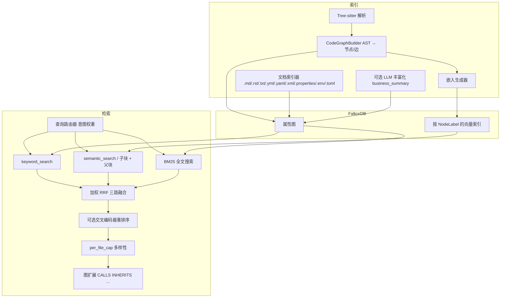

# 系统架构

## 整体架构

## 后端组件

| 组件 | 职责 |
|------|------|
| **FastAPI**（`main.py`） | HTTP API、静态 SPA 托管、生命周期管理（注册中心、调度器、Wiki 服务初始化） |
| **FalkorDB** | 带标签的属性图 + 全文/向量操作，由分层 Store 封装（`FalkorDBStore` / `SearchStore` / `TraversalStore` / `AnalysisStore` / `WikiStore` / `IndexerStore`） |
| **Tree-sitter** | 按文件 AST 捕获；每种语言的查询规则驱动 `CodeGraphBuilder` |
| **嵌入**（Embeddings） | `EmbeddingConfig`：默认 `BAAI/bge-m3`，在多种节点标签上建立向量索引（参见 `store/schema.py` 中的 `VECTOR_INDEX_CONFIGS`） |
| **LLM**（可选） | OpenAI 兼容 API，用于深度搜索、可选索引丰富化（`LLMConfig`） |
| **MCP 处理器**（`api/mcp_server.py`） | 混合/图/索引/Wiki；**`get_file_content`** 读检出源文件；NL→Cypher 仅供 Dashboard UI 使用（`query/nl_cypher.py`，不暴露为 MCP 工具） |

## 索引管道

1. **解析** — 遍历源文件（遵守 `exclude_dirs` / `file_extensions`）；Tree-sitter 生成函数、类、导入、调用等 AST 节点。
2. **AST → 图** — `CodeGraphBuilder` 生成 `GraphNode` / `GraphEdge`，包含 `NodeLabel` 和 `EdgeType`（如 `CALLS`、`IMPORTS`、`CONTAINS`）。
3. **跨文件 Import 解析** — `ImportResolver` 在索引开始时构建文件索引，将 import 语句解析到实际文件路径（Python/JS/TS/Java/Go），生成精确的 `IMPORTS` 边；解析失败时回退到虚拟 Module 节点。
4. **父子块** — 大型函数/类/文档段落可被拆分为 `Chunk` 节点（`child_chunker.py`），通过 `PART_OF` 边关联；嵌入可针对子块生成。
5. **持久化** — `batch_upsert` 写入 FalkorDB；按标签更新向量索引。
6. **丰富化**（可选） — LLM 生成 `business_summary`、跨仓库丰富化、架构/RPC 推断等（需显式启用）。

## 检索管道

1. **查询路由** — `query_router.route_query` 根据查询形态（标识符、自然语言等）动态调整关键词与语义的权重。
2. **查询扩展**（可选，`HYBRID_SEARCH__QUERY_EXPANSION_ENABLED`） — 以初始关键词命中为种子，从调用链/类方法中提取邻居名称构造辅助查询。
3. **并行三路检索** — 关键词经 `keyword_search`、语义经实体嵌入或子块路径、**BM25 全文搜索**（`SearchStore.fulltext_search`，基于 FalkorDB RediSearch 内置全文索引）三路并行执行。
4. **RRF 三路融合** — `rrf_fusion` 按查询权重合并三路排序列表（关键词权重 1.5、语义权重 1.0、BM25 权重 1.2，可配置）。
5. **重排序** — 若 `RERANK__ENABLED`，交叉编码器对融合候选进行重排序（`position_aware_blend` 结合 RRF 分数）。
6. **多样性** — `_apply_per_file_cap` 限制每个文件的命中数（默认 `per_file_cap=3`）。
7. **图扩展** — 从融合种子出发，沿关系遍历至 `expand_depth` 深度，获取上下文相关邻居。
8. **分页与排序** — 最终结果支持 `offset`/`limit` 分页和按分数/名称/路径排序。
9. **跨仓聚合** — `repositories: ["a", "b"]` 参数触发多仓并行搜索（`asyncio.gather`），各仓结果按分数排序合并，`uid` 级去重后再统一分页。支持部分失败容错（`return_exceptions=True`）。
10. **NL→Cypher**（Dashboard UI 专用）— 通过 LLM 生成只读 Cypher 后直接查图（不走上述 RRF 管道；详见 `query/nl_cypher.py`）。此能力供 Dashboard 的图谱查询面板使用，不暴露为 MCP 工具，Agent 可通过组合 `rag_query` + `rag_graph` 自主实现类似效果。

## 文件内容访问

**HTTP**：`GET /api/v1/files/tree`、`/api/v1/files/content`、`/api/v1/files/entities` — 仪表盘文件浏览器与 **`get_file_content`** MCP 工具共用路径校验与仓库解析逻辑：从本地检出读取文件，防止目录穿越与越出仓库根；二进制拒绝；单次读取上限与 MCP 一致。**文件树 API 需指定 `repository`。**

## Blast Radius 分析

`BlastRadiusAnalyzer`（`query/blast_radius.py`）从变更实体出发，沿 incoming `CALLS`/`INHERITS`/`IMPORTS` 边做 BFS，按深度分层返回受影响实体。每个受影响实体附带置信度分数（随深度衰减）和关系类型。支持按仓库过滤。

## 社区发现

`CommunityDetector`（`query/community_detection.py`）使用 Label Propagation 算法在代码图上自动发现模块社区。每个社区包含自动标签（前 3 个高连接度节点名）和内聚度评分（内部边数 / 可能边数）。

## 父子块策略

通过 `HybridSearchConfig` 配置：

| 设置 | 默认值 | 含义 |
|------|--------|------|
| `use_child_chunks` | `true` | 子块级检索 + 父块分组；MCP 调用者可省略此参数以继承服务端设置 |
| `child_chunk_window_chars` | 800 | 滑动窗口大小（约 200 token） |
| `child_chunk_stride_chars` | 600 | 重叠步长（约 25%） |
| `child_chunk_min_parent_chars` | 400 | 低于此阈值的父块跳过分块 |

子块在生成嵌入前会添加父签名上下文前缀（`indexer/child_chunker.py`）。

## 知识图谱 Schema

### NodeLabel（`store/schema.py`）

`Function`、`Class`、`Module`、`Document`、`BusinessFlow`、`BusinessConcept`、`WikiPage`、`Chunk`。

### EdgeType

| 边类型 | 典型用途 |
|--------|----------|
| `CALLS`、`INHERITS`、`IMPORTS`、`CONTAINS`、`USES_TYPE`、`REFERENCES` | 代码结构 |
| `IMPLEMENTS`、`RELATES_TO`、`PART_OF`、`CONCEPT_IN` | 业务/块层次 |
| `PROVIDES_RPC`、`CONSUMES_RPC`、`CROSS_REPO_CALLS` | RPC / 多仓库 |
| `DEPENDS_ON`、`ACCESSES_TABLE`、`EVENT_PRODUCES`、`EVENT_CONSUMES` | 依赖注入 / 数据 / Kafka |
| `SOURCE_DOC` | Wiki 来源溯源 |

## 仪表盘架构

- **技术栈**：React + **Vite**（`dashboard/`）、TypeScript、Tailwind、React Router。
- **交付方式**：生产构建输出至 `static/`；FastAPI 挂载 `/assets` 并对 SPA 路由回退至 `index.html`（`search`、`deep-search`、`graph`、`explorer`、`files`（文件浏览器）、`repositories`、`indexing`、`settings`、`businesses`、`documents`、`sync`）。
- **懒加载**：基于路由的代码分割减小初始 JS 体积；重型可视化组件（图表、图形）仅在导航到对应页面时加载。
