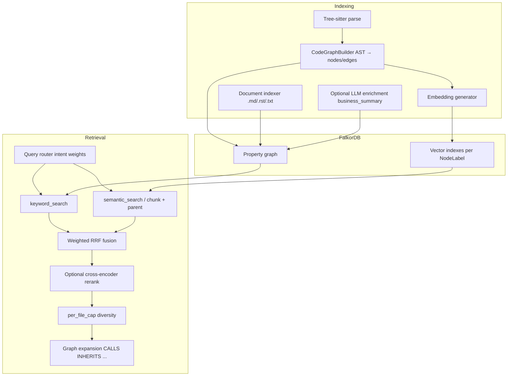

# System architecture

## High level

## Backend components

| Component | Role |
|-----------|------|
| **FastAPI** (`main.py`) | HTTP API, static SPA, lifespan wiring for registry, scheduler, wiki services |
| **FalkorDB** | Labeled property graph + full-text/vector operations used by `FalkorDBStore` |
| **Tree-sitter** | Per-file AST capture; queries per language feed `CodeGraphBuilder` |
| **Embeddings** | `EmbeddingConfig`: default `BAAI/bge-m3`, `embedding` on multiple node labels (see `VECTOR_INDEX_CONFIGS` in `store/schema.py`) |
| **LLM** (optional) | OpenAI-compatible API for deep search, optional indexing enrichment (`LLMConfig`) |
| **MCP handler** (`api/mcp_server.py`) | Maps tool calls to hybrid/graph/index/wiki services |

## Indexing pipeline

1. **Parse** — Walk source files (respect `exclude_dirs` / `file_extensions`); Tree-sitter produces functions, classes, imports, calls, etc.
2. **AST → graph** — `CodeGraphBuilder` emits `GraphNode` / `GraphEdge` with `NodeLabel` and `EdgeType` (e.g. `CALLS`, `IMPORTS`, `CONTAINS`).
3. **Parent–child chunks** — Large functions/classes/doc sections may be split into `Chunk` nodes (`child_chunker.py`) linked via `PART_OF`; embeddings can target chunks.
4. **Persist** — `batch_upsert` into FalkorDB; vector indexes updated per label.
5. **Enrich** (optional) — LLM `business_summary`, cross-repo enrichment, architecture/RPC inference when features are enabled.

## Retrieval pipeline

1. **Query routing** — `query_router.route_query` adjusts keyword vs semantic weights from query shape (identifiers, NL, etc.).
2. **Query expansion** (optional, `HYBRID_SEARCH__QUERY_EXPANSION_ENABLED`) — Seed keyword hits then add neighbor names from call chains / class methods to form auxiliary queries.
3. **Parallel retrieval** — Keyword lists via `keyword_search`; semantic via entity embeddings or **child-chunk** path (`search_with_parent_context`) when `use_child_chunks` is on.
4. **RRF** — `rrf_fusion` merges ranked lists with per-query weights.
5. **Rerank** — If `RERANK__ENABLED`, cross-encoder reranks fused candidates (`position_aware_blend` with RRF scores).
6. **Diversity** — `_apply_per_file_cap` limits how many hits per file (default `per_file_cap=3`).
7. **Graph expansion** — From fused seeds, traverse relationships up to `expand_depth` for contextual neighbors.

## Parent–child chunking

Configured via `HybridSearchConfig`:

| Setting | Default | Meaning |
|---------|---------|---------|
| `use_child_chunks` | `true` in `HybridSearchConfig` | Chunk-level retrieval with parent grouping; MCP callers may omit the argument to inherit this setting |
| `child_chunk_window_chars` | 800 | Sliding window size (~200 tokens) |
| `child_chunk_stride_chars` | 600 | Overlap (~25%) |
| `child_chunk_min_parent_chars` | 400 | Skip chunking small parents |

Chunks are prefixed with parent signature context before embedding (`indexer/child_chunker.py`).

## Knowledge graph schema

### NodeLabel (`store/schema.py`)

`Function`, `Class`, `Module`, `Document`, `BusinessFlow`, `BusinessConcept`, `WikiPage`, `Chunk`.

### EdgeType

| Edge | Typical use |
|------|-------------|
| `CALLS`, `INHERITS`, `IMPORTS`, `CONTAINS`, `USES_TYPE`, `REFERENCES` | Code structure |
| `IMPLEMENTS`, `RELATES_TO`, `PART_OF`, `CONCEPT_IN` | Business / chunk hierarchy |
| `PROVIDES_RPC`, `CONSUMES_RPC`, `CROSS_REPO_CALLS` | RPC / multi-repo |
| `DEPENDS_ON`, `ACCESSES_TABLE`, `EVENT_PRODUCES`, `EVENT_CONSUMES` | DI / data / Kafka |
| `SOURCE_DOC` | Wiki provenance |

## Dashboard architecture

- **Stack**: React + **Vite** (`dashboard/`), TypeScript, Tailwind, React Router.
- **Delivery**: Production build emitted to `static/`; FastAPI mounts `/assets` and falls back to `index.html` for SPA routes (`search`, `deep-search`, `graph`, `explorer`, `repositories`, `indexing`, `settings`, `businesses`, `documents`, `sync`).
- **Lazy loading**: Route-based code splitting keeps initial JS smaller; heavy visuals (charts, graph) load when navigating to those pages.
