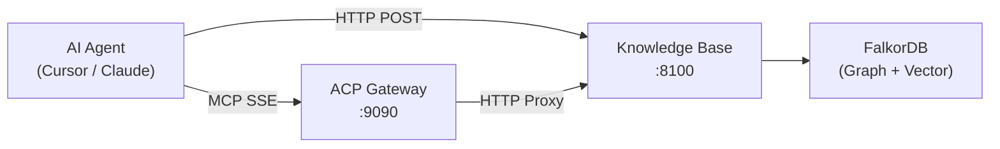
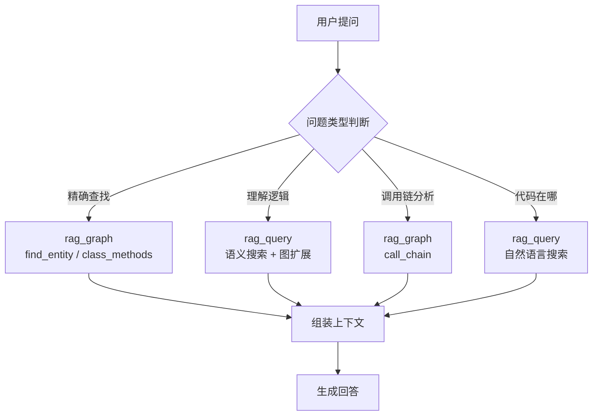

# MCP 集成指南

本文档说明 AI Agent 如何通过 MCP (Model Context Protocol) 接入知识库服务，以及相关配置。

## 概述

知识库服务通过 HTTP API 暴露 MCP 工具接口，AI Agent（如 Cursor、Claude、GPT 等）可通过以下方式接入：

1. **HTTP MCP 端点** — 通过 `/api/v1/mcp/tool` 调用工具（标准 HTTP POST）
2. **SSE MCP Server** — 通过 ACP Gateway 代理（支持 MCP SSE 协议）



## 可用工具

### 1. `rag_query` — 自然语言搜索

通过语义搜索找到最相关的代码/文档，并沿图关系扩展上下文。

**参数:**

| 参数 | 类型 | 必填 | 默认值 | 说明 |
|------|------|------|--------|------|
| `query` | string | 是 | — | 自然语言查询 |
| `k` | integer | 否 | 5 | 返回结果数 |
| `expand_depth` | integer | 否 | 2 | 图扩展深度 |

**调用示例:**

```json
{
  "tool_name": "rag_query",
  "arguments": {
    "query": "用户认证的中间件实现",
    "k": 5,
    "expand_depth": 2
  }
}
```

**返回结构:**

```json
{
  "query": "用户认证的中间件实现",
  "semantic_matches": [
    {
      "name": "authenticate_request",
      "file": "src/auth/middleware.py",
      "start_line": 15,
      "score": 0.87,
      "signature": "async def authenticate_request(request: Request) -> Tenant",
      "docstring": "Verify API key and return tenant info."
    }
  ],
  "graph_context": [
    {
      "name": "validate_token",
      "relationship": "CALLS",
      "depth": 1
    }
  ],
  "total_results": 5
}
```

### 2. `rag_graph` — 结构化图查询

对代码知识图谱执行结构化查询，支持调用链追踪、继承树、依赖分析等。

**参数:**

| 参数 | 类型 | 必填 | 默认值 | 说明 |
|------|------|------|--------|------|
| `query_type` | string | 是 | — | 查询类型（见下表） |
| `name` | string | 视类型 | — | 实体名称 |
| `file` | string | 视类型 | — | 文件路径 |
| `depth` | integer | 否 | 3 | 遍历深度 |
| `direction` | string | 否 | downstream | upstream / downstream |
| `cypher` | string | 视类型 | — | 自定义 Cypher 查询 |
| `entity_type` | string | 否 | any | function / class / any |

**支持的 `query_type`:**

| 类型 | 说明 | 必需参数 |
|------|------|----------|
| `call_chain` | 函数调用链追踪 | `name`, `depth`, `direction` |
| `inheritance_tree` | 类继承树 | `name` |
| `class_methods` | 列出类的所有方法 | `name` |
| `module_dependencies` | 模块依赖图 | `name` |
| `reverse_dependencies` | 反向依赖分析 | `name` |
| `find_entity` | 按名称查找实体 | `name`, `entity_type` |
| `file_entities` | 列出文件内所有实体 | `file` |
| `graph_stats` | 图统计信息 | 无 |
| `raw_cypher` | 自定义 Cypher 查询 | `cypher` |

**调用示例:**

```json
{
  "tool_name": "rag_graph",
  "arguments": {
    "query_type": "call_chain",
    "name": "handleRequest",
    "depth": 3,
    "direction": "downstream"
  }
}
```

### 3. `rag_index` — 触发索引

触发代码仓库的全量或增量索引。

**参数:**

| 参数 | 类型 | 必填 | 默认值 | 说明 |
|------|------|------|--------|------|
| `directory` | string | 是 | — | 要索引的目录路径 |
| `mode` | string | 否 | full | full / incremental |
| `base_ref` | string | 否 | HEAD~1 | 增量模式的基准 Git 引用 |
| `head_ref` | string | 否 | HEAD | 增量模式的目标 Git 引用 |

**调用示例:**

```json
{
  "tool_name": "rag_index",
  "arguments": {
    "directory": "/workspace/my-project",
    "mode": "incremental",
    "base_ref": "HEAD~5",
    "head_ref": "HEAD"
  }
}
```

## HTTP API 调用方式

所有 MCP 工具均可通过 HTTP API 调用：

```bash
# 列出所有可用工具
curl http://localhost:8100/api/v1/mcp/tools

# 调用工具
curl -X POST http://localhost:8100/api/v1/mcp/tool \
  -H "Content-Type: application/json" \
  -H "Authorization: Bearer <your-token>" \
  -H "X-Business-Id: default" \
  -d '{
    "tool_name": "rag_query",
    "arguments": {"query": "数据库连接池管理", "k": 5}
  }'
```

### 请求头说明

| Header | 必填 | 说明 |
|--------|------|------|
| `Content-Type` | 是 | `application/json` |
| `Authorization` | 视配置 | `Bearer <token>`，配置了 Token 时必填 |
| `X-Business-Id` | 否 | 业务 ID，默认 `default`。Token 绑定了业务时自动确定，无需传入 |

## Cursor MCP 配置

### 方式一：直接 HTTP（推荐本地部署）

在 Cursor 的 MCP 配置中添加：

```json
{
  "mcpServers": {
    "knowledge-base": {
      "url": "http://localhost:8100/api/v1/mcp",
      "headers": {
        "Authorization": "Bearer <your-api-token>"
      }
    }
  }
}
```

> Token 绑定了业务时无需 `X-Business-Id`。管理员 Token 可按需添加 `"X-Business-Id": "business_id"` 来指定业务。

> **注意**: 当前知识库服务暴露的是 HTTP REST 端点（非标准 MCP SSE 协议）。若需要标准 MCP SSE 协议，需通过 ACP Gateway 代理。

### 方式二：通过 ACP Gateway（推荐远程部署）

ACP Gateway 将知识库的 HTTP API 包装为标准 MCP SSE 协议：

```json
{
  "mcpServers": {
    "acp-knowledge-base": {
      "url": "http://gateway:9090/mcp/sse",
      "headers": {
        "X-API-Key": "<gateway-api-key>"
      }
    }
  }
}
```

Gateway 配置（`config/config.yaml`）：

```yaml
rag:
  enabled: true
  knowledge_base_url: "http://kb-service:8100"
  api_token: "<kb-api-token>"
```

## 认证与权限

### Token 配置

**推荐方式：`tokens.yaml` 文件**（支持业务绑定）

```yaml
# tokens.yaml
tokens:
  - token: sk-admin-001
    role: admin
    # 无 business 字段 → 通过 X-Business-Id 自由切换业务

  - token: sk-editor-001
    role: editor
    business: project_a
    # 绑定到 project_a → 无需传 X-Business-Id

  - token: sk-viewer-001
    role: viewer
    business: project_a
```

绑定规则：
- **绑定了 `business` 的 Token** → 自动使用绑定业务，无需 `X-Business-Id` Header
- **未绑定的 Token（通常是 admin）** → 通过 `X-Business-Id` 指定业务

**向后兼容：环境变量方式**

```env
# 方式 1: 多角色 Token（不支持业务绑定）
API_TOKENS=admin:sk-admin-xxx,editor:sk-editor-yyy,viewer:sk-viewer-zzz

# 方式 2: 单一 Token（自动获得 admin 权限）
API_TOKEN=your-secret-token

# 方式 3: 不配置（所有端点开放，仅限开发/测试）
```

> 优先级: `tokens.yaml` > `API_TOKENS` 环境变量 > `API_TOKEN` 环境变量

### MCP 工具权限

| 工具 | 最低权限 | 说明 |
|------|----------|------|
| `rag_query` | editor | 执行 MCP 工具调用需要 editor 权限 |
| `rag_graph` | editor | 同上 |
| `rag_index` | editor | 同上 |
| 工具列表 (`GET /mcp/tools`) | viewer | 查看可用工具只需 viewer |

### 角色说明

| 角色 | 能力 |
|------|------|
| **admin** | 所有操作（创建/删除业务、删除仓库索引、管理配置） |
| **editor** | 读写（搜索、图查询、触发索引、MCP 工具调用） |
| **viewer** | 只读（搜索、图查询、查看统计信息） |

## 业务隔离

多业务模式下，每个业务拥有独立的 FalkorDB 图（`kb_{business_id}`）。

业务上下文的确定方式取决于 Token 配置：

**Token 绑定了业务**（推荐 Agent 使用）：

```bash
# Token sk-editor-001 已绑定到 project_a，无需 X-Business-Id
curl -X POST http://localhost:8100/api/v1/mcp/tool \
  -H "Authorization: Bearer sk-editor-001" \
  -d '{
    "tool_name": "rag_query",
    "arguments": {"query": "用户登录流程"}
  }'
```

**管理员 Token（未绑定业务）**：

```bash
# 管理员通过 X-Business-Id 指定业务
curl -X POST http://localhost:8100/api/v1/mcp/tool \
  -H "X-Business-Id: team-alpha" \
  -H "Authorization: Bearer sk-admin-001" \
  -d '{
    "tool_name": "rag_query",
    "arguments": {"query": "用户登录流程"}
  }'
```

不指定 `X-Business-Id` 时默认使用 `default` 业务。

## Agent 推荐工作流



**搜索策略优先级**: FQN 精确搜索 > 关键词搜索 > 语义搜索 > 图查询

| 场景 | 推荐方式 |
|------|----------|
| 知道完整类名/方法名 | 通过 `rag_query` 传入 FQN 字符串 |
| 知道函数名但不确定位置 | `rag_graph` + `find_entity` |
| 用自然语言描述需求 | `rag_query` |
| 需要调用链/依赖分析 | `rag_graph` + `call_chain` / `module_dependencies` |
| 需要完整上下文 | `rag_query`（自动扩展图上下文） |
