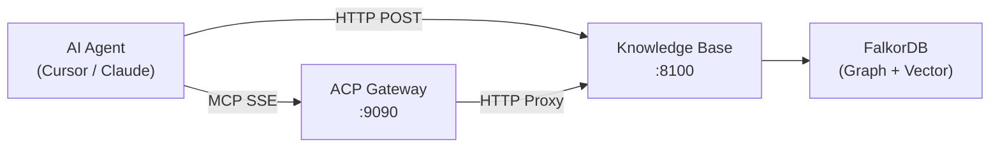
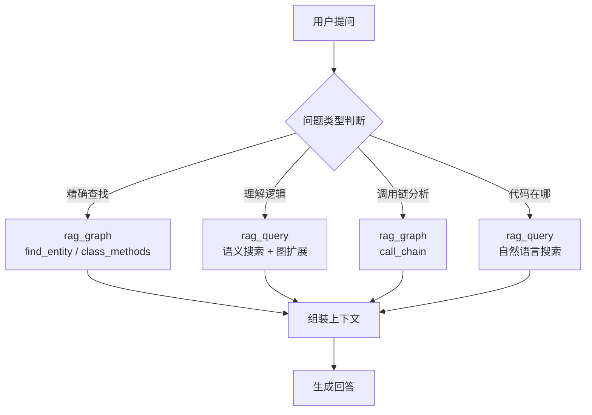
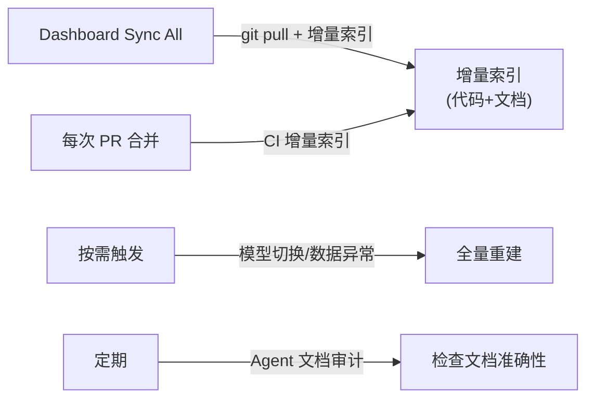

# MCP 集成指南

本文档说明 AI Agent 如何通过 MCP (Model Context Protocol) 接入知识库服务，以及相关配置。

## 概述

知识库服务通过 HTTP API 暴露 MCP 工具接口，AI Agent（如 Cursor、Claude、GPT 等）可通过以下方式接入：

1. **HTTP MCP 端点** — 通过 `/api/v1/mcp/tool` 调用工具（标准 HTTP POST）
2. **SSE MCP Server** — 通过 ACP Gateway 代理（支持 MCP SSE 协议）


```mermaid
graph LR
    Agent["AI Agent<br/>(Cursor / Claude)"] -->|MCP SSE| Gateway["ACP Gateway<br/>:9090"]
    Agent -->|HTTP POST| KB["Knowledge Base<br/>:8100"]
    Gateway -->|HTTP Proxy| KB
    KB --> FalkorDB["FalkorDB<br/>(Graph + Vector)"]
```

## 可用工具

### 1. `rag_query` — 自然语言搜索

通过语义搜索找到最相关的代码/文档，并沿图关系扩展上下文。

**参数:**

| 参数 | 类型 | 必填 | 默认值 | 说明 |
|------|------|------|--------|------|
| `query` | string | 是 | — | 自然语言查询 |
| `k` | integer | 否 | 5 | 返回结果数 |
| `expand_depth` | integer | 否 | 2 | 图扩展深度 |

**调用示例:**

```json
{
  "tool_name": "rag_query",
  "arguments": {
    "query": "用户认证的中间件实现",
    "k": 5,
    "expand_depth": 2
  }
}
```

**返回结构:**

```json
{
  "query": "用户认证的中间件实现",
  "semantic_matches": [
    {
      "name": "authenticate_request",
      "file": "src/auth/middleware.py",
      "start_line": 15,
      "score": 0.87,
      "signature": "async def authenticate_request(request: Request) -> Tenant",
      "docstring": "Verify API key and return tenant info."
    }
  ],
  "graph_context": [
    {
      "name": "validate_token",
      "relationship": "CALLS",
      "depth": 1
    }
  ],
  "total_results": 5
}
```

### 2. `rag_graph` — 结构化图查询

对代码知识图谱执行结构化查询，支持调用链追踪、继承树、依赖分析等。

**参数:**

| 参数 | 类型 | 必填 | 默认值 | 说明 |
|------|------|------|--------|------|
| `query_type` | string | 是 | — | 查询类型（见下表） |
| `name` | string | 视类型 | — | 实体名称 |
| `file` | string | 视类型 | — | 文件路径 |
| `depth` | integer | 否 | 3 | 遍历深度 |
| `direction` | string | 否 | downstream | upstream / downstream |
| `cypher` | string | 视类型 | — | 自定义 Cypher 查询 |
| `entity_type` | string | 否 | any | function / class / any |

**支持的 `query_type`:**

| 类型 | 说明 | 必需参数 |
|------|------|----------|
| `call_chain` | 函数调用链追踪 | `name`, `depth`, `direction` |
| `inheritance_tree` | 类继承树 | `name` |
| `class_methods` | 列出类的所有方法 | `name` |
| `module_dependencies` | 模块依赖图 | `name` |
| `reverse_dependencies` | 反向依赖分析 | `name` |
| `find_entity` | 按名称查找实体 | `name`, `entity_type` |
| `file_entities` | 列出文件内所有实体 | `file` |
| `graph_stats` | 图统计信息 | 无 |
| `raw_cypher` | 自定义 Cypher 查询 | `cypher` |
| `business_flow` | 按名称检索业务流程及其实现代码（`IMPLEMENTS`） | `name`（流程名关键词）；`depth` 可作返回条数上限 |
| `flows_for_function` | 某函数所属的业务流程（反向查询） | `name`（函数名） |
| `related_concepts` | 与某实体相关的业务概念 | `name`（实体名） |
| `explore_domain` | 按业务领域分类浏览流程 | `name`（`category` 分类名） |
| `flow_dependencies` | 流程层级 / 子流程关系（`PART_OF`） | `name`（流程名） |

**调用示例:**

```json
{
  "tool_name": "rag_graph",
  "arguments": {
    "query_type": "call_chain",
    "name": "handleRequest",
    "depth": 3,
    "direction": "downstream"
  }
}
```

### 3. `rag_business_search` — 业务流程 / 概念语义搜索

面向**业务语义**的专用检索：在已索引的 `BusinessFlow`、`BusinessConcept` 节点上做向量检索，可选附带关联代码位置。适合「用户下单」「私信」等业务语言查询。

**参数:**

| 参数 | 类型 | 必填 | 默认值 | 说明 |
|------|------|------|--------|------|
| `query` | string | 是 | — | 自然语言业务查询 |
| `search_type` | string | 否 | all | `flow`（仅流程）、`concept`（仅概念）、`all` |
| `k` | integer | 否 | 5 | 每类返回条数 |
| `include_code` | boolean | 否 | true | 是否为命中的流程补充 `code_locations`（图查询） |

**调用示例:**

```json
{
  "tool_name": "rag_business_search",
  "arguments": {
    "query": "用户下单与支付",
    "search_type": "all",
    "k": 5,
    "include_code": true
  }
}
```

**返回结构（节选）:** `status`、`results.flows`、`results.concepts`；当 `include_code` 为 true 时，流程项中可含 `code_locations`。

### 4. `rag_index` — 触发索引

触发代码仓库的全量或增量索引。

**参数:**

| 参数 | 类型 | 必填 | 默认值 | 说明 |
|------|------|------|--------|------|
| `directory` | string | 是 | — | 要索引的目录路径 |
| `mode` | string | 否 | full | full / incremental |
| `base_ref` | string | 否 | HEAD~1 | 增量模式的基准 Git 引用 |
| `head_ref` | string | 否 | HEAD | 增量模式的目标 Git 引用 |

**调用示例:**

```json
{
  "tool_name": "rag_index",
  "arguments": {
    "directory": "/workspace/my-project",
    "mode": "incremental",
    "base_ref": "HEAD~5",
    "head_ref": "HEAD"
  }
}
```

### 5. `analyze_impact` — 变更影响分析

分析代码变更的爆炸半径：给定修改的函数名，返回所有直接/间接调用方、受影响的架构层和入口点。

**参数:**

| 参数 | 类型 | 必填 | 默认值 | 说明 |
|------|------|------|--------|------|
| `changed_functions` | array[string] | 是 | — | 变更的函数名列表 |
| `max_depth` | integer | 否 | 5 | 最大调用链追踪深度（1-50） |

**调用示例:**

```json
{
  "tool_name": "analyze_impact",
  "arguments": {
    "changed_functions": ["processPayment", "validateOrder"],
    "max_depth": 5
  }
}
```

**返回结构:**

```json
{
  "changed_functions": ["processPayment"],
  "direct_callers": [{"uid": "...", "name": "handleCheckout", "file": "src/checkout.py", "depth": 1}],
  "transitive_callers": [{"uid": "...", "name": "createOrder", "depth": 2}],
  "affected_classes": ["CheckoutService", "OrderController"],
  "affected_layers": ["business", "presentation"],
  "affected_entry_points": [{"name": "handleCheckout", "semantic_roles": ["http_endpoint"]}],
  "total_affected": 5,
  "max_depth_reached": false
}
```

### 6. `list_endpoints` — API 端点列表

列出代码库中发现的所有 API 端点（HTTP、RPC、Kafka）。

**参数:**

| 参数 | 类型 | 必填 | 默认值 | 说明 |
|------|------|------|--------|------|
| `repository` | string | 否 | — | 仓库名称（可选，用于作用域过滤） |

**调用示例:**

```json
{
  "tool_name": "list_endpoints",
  "arguments": {}
}
```

**返回结构:**

```json
{
  "http_endpoints": [{"name": "getUser", "path": "/api/users", "method": "GET", "class": "UserController"}],
  "rpc_endpoints": [{"class": "UserService", "interface": "com.example.IUserService", "method": "findById"}],
  "kafka_endpoints": [{"name": "onUserCreated", "topic": "user-events", "file": "src/listener.java"}],
  "total": 15
}
```

### 7. `check_consistency` — 索引一致性校验

对比图数据库中的文件与磁盘上的实际仓库文件，检测幽灵节点和缺失文件。

**参数:**

| 参数 | 类型 | 必填 | 默认值 | 说明 |
|------|------|------|--------|------|
| `repository` | string | 是 | — | 仓库名称或路径 |

**调用示例:**

```json
{
  "tool_name": "check_consistency",
  "arguments": {
    "repository": "ultron-api"
  }
}
```

**返回结构:**

```json
{
  "repository": "ultron-api",
  "total_graph_files": 150,
  "total_repo_files": 155,
  "ghost_files": ["deleted_module.py"],
  "missing_files": ["new_feature.py"],
  "stale_files": [],
  "is_consistent": false
}
```

### 8. `review_pr` — PR 代码审查上下文 (P2)

分析 PR diff，构建结构化审查上下文。返回变更实体、影响分析、受影响 API 端点、跨仓库影响和审查建议。

**参数:**

| 参数 | 类型 | 必填 | 默认值 | 说明 |
|------|------|------|--------|------|
| `diff_text` | string | 二选一* | — | git diff 的统一差异文本 |
| `branch` | string | 二选一* | — | 与 `repo_path` 联用：要审查的分支名 |
| `base_branch` | string | 否 | master | 与 `branch` 联用：基准分支（`git diff base...branch`） |
| `repo_path` | string | 二选一* | — | 知识库**服务所在机器**上已 clone 的仓库根目录本地路径 |
| `repo_url` | string | 否 | — | 远程仓库 URL（预留；若传入则仅校验格式，服务端暂不据此拉取 diff） |
| `repository` | string | 否 | — | 限定分析范围的仓库名（图索引中的名称） |
| `max_depth` | integer | 否 | 3 | 调用链追踪最大深度 |

\* **必须**提供其一：`diff_text`；或同时提供 `branch` + `repo_path`（由服务进程在该路径执行 `git diff`）。`repo_url` 远程拉取 diff 为预留能力，当前版本不在服务端执行 clone/fetch。

**调用示例（原始 diff）:**

```json
{
  "tool_name": "review_pr",
  "arguments": {
    "diff_text": "diff --git a/...",
    "repository": "ultron/ultron-api",
    "max_depth": 3
  }
}
```

**调用示例（本地仓库 + 分支，需在 KB 服务可访问的路径下存在 git 仓库）:**

```json
{
  "tool_name": "review_pr",
  "arguments": {
    "repo_path": "/data/repos/my-service",
    "branch": "feature/foo",
    "base_branch": "master",
    "repository": "my-service",
    "max_depth": 3
  }
}
```

**返回结构:**

```json
{
  "changed_files": ["GiftWebServiceImpl.java"],
  "changed_entities": [{"name": "getSendGiftCtx", "entity_type": "function", "architecture_layer": "rpc"}],
  "impacts": [{"target_name": "getSendGiftCtx", "direct_callers": [...], "affected_endpoints": [...]}],
  "affected_endpoints_summary": [...],
  "cross_repo_summary": [...],
  "affected_layers": ["rpc"],
  "suggestions": ["This PR affects 1 API endpoint(s). Consider testing these endpoints."],
  "summary": {"total_changed_files": 1, "total_changed_entities": 2, "total_affected_endpoints": 1}
}
```

### 9. `build_context` — 智能上下文构建 (P2)

为代码实体构建最优上下文包，包含调用者、被调用者、父类、兄弟方法、跨仓库依赖、Entity 表、DI 依赖和接口信息。

**参数:**

| 参数 | 类型 | 必填 | 默认值 | 说明 |
|------|------|------|--------|------|
| `entity_name` | string | 是 | — | 函数或类名 |
| `entity_type` | string | 否 | function | function 或 class |
| `repository` | string | 否 | — | 限定搜索范围的仓库名 |

**调用示例:**

```json
{
  "tool_name": "build_context",
  "arguments": {
    "entity_name": "GiftWebServiceImpl",
    "entity_type": "class"
  }
}
```

**返回结构:**

```json
{
  "target": {"name": "GiftWebServiceImpl", "fqn": "...", "architecture_layer": "rpc", "semantic_roles": ["rpc_provider"]},
  "callers": [],
  "callees": [{"name": "getSendGiftVo", "signature": "..."}],
  "parent_class": null,
  "sibling_methods": [{"name": "sendGift", "signature": "..."}],
  "cross_repo_deps": [],
  "entity_tables": [],
  "di_dependencies": [],
  "architecture_layer": "rpc",
  "related_interfaces": []
}
```

## REST API 端点 (P2 新增)

### `POST /api/v1/enrich/cross-repo`

触发跨仓库增强：RPC 解析、DI 容器图、Entity 映射。

```bash
curl -X POST http://localhost:8100/api/v1/enrich/cross-repo \
  -H "Authorization: Bearer $TOKEN"
```

### `POST /api/v1/review/context`

从 git diff 构建 PR 审查上下文。请求体与 `review_pr` 一致：可提供 `diff_text`，或提供 `repo_path` + `branch`（可选 `base_branch`，默认 `master`）。可选 `repo_url` 仅做格式校验，供后续远程拉取能力扩展。

```bash
curl -X POST http://localhost:8100/api/v1/review/context \
  -H "Authorization: Bearer $TOKEN" \
  -H "Content-Type: application/json" \
  -d '{"diff_text": "diff --git ...", "repository": "ultron/ultron-api"}'
```

```bash
curl -X POST http://localhost:8100/api/v1/review/context \
  -H "Authorization: Bearer $TOKEN" \
  -H "Content-Type: application/json" \
  -d '{"repo_path": "/data/repos/my-service", "branch": "feature/foo", "base_branch": "master", "repository": "my-service"}'
```

### `POST /api/v1/context/build`

构建代码实体的智能上下文包。

```bash
curl -X POST http://localhost:8100/api/v1/context/build \
  -H "Authorization: Bearer $TOKEN" \
  -H "Content-Type: application/json" \
  -d '{"entity_name": "GiftWebServiceImpl", "entity_type": "class"}'
```

## HTTP API 调用方式

所有 MCP 工具均可通过 HTTP API 调用：

```bash
# 列出所有可用工具
curl http://localhost:8100/api/v1/mcp/tools

# 调用工具
curl -X POST http://localhost:8100/api/v1/mcp/tool \
  -H "Content-Type: application/json" \
  -H "Authorization: Bearer <your-token>" \
  -H "X-Business-Id: default" \
  -d '{
    "tool_name": "rag_query",
    "arguments": {"query": "数据库连接池管理", "k": 5}
  }'
```

### P1 新增 REST API 端点（管理员权限）

| 端点 | 方法 | 说明 |
|------|------|------|
| `/api/v1/endpoints/{repository}` | GET | 列出仓库所有 HTTP/RPC/Kafka 端点 |
| `/api/v1/analysis/impact` | POST | 变更影响分析（body: `changed_functions`, `max_depth`） |
| `/api/v1/analysis/consistency/{repository}` | GET | 索引与文件系统一致性校验 |
| `/api/v1/architecture/{repository}` | GET | 架构分层统计 |
| `/api/v1/index/report/{repository}` | GET | 最近一次索引质量报告 |

### 请求头说明

| Header | 必填 | 说明 |
|--------|------|------|
| `Content-Type` | 是 | `application/json` |
| `Authorization` | 视配置 | `Bearer <token>`，配置了 Token 时必填 |
| `X-Business-Id` | 否 | 业务 ID，默认 `default`。Token 绑定了业务时自动确定，无需传入 |

## Cursor MCP 配置

### 方式一：直接 HTTP（推荐本地部署）

在 Cursor 的 MCP 配置中添加：

```json
{
  "mcpServers": {
    "knowledge-base": {
      "url": "http://localhost:8100/api/v1/mcp",
      "headers": {
        "Authorization": "Bearer <your-api-token>"
      }
    }
  }
}
```

> Token 绑定了业务时无需 `X-Business-Id`。管理员 Token 可按需添加 `"X-Business-Id": "business_id"` 来指定业务。

> **注意**: 当前知识库服务暴露的是 HTTP REST 端点（非标准 MCP SSE 协议）。若需要标准 MCP SSE 协议，需通过 ACP Gateway 代理。

### 方式二：通过 ACP Gateway（推荐远程部署）

ACP Gateway 将知识库的 HTTP API 包装为标准 MCP SSE 协议：

```json
{
  "mcpServers": {
    "acp-knowledge-base": {
      "url": "http://gateway:9090/mcp/sse",
      "headers": {
        "X-API-Key": "<gateway-api-key>"
      }
    }
  }
}
```

Gateway 配置（`config/config.yaml`）：

```yaml
rag:
  enabled: true
  knowledge_base_url: "http://kb-service:8100"
  api_token: "<kb-api-token>"
```

**索引阶段的 LLM（与 MCP 并列）**：若在知识库侧设置 **`LLM__GATEWAY__ENABLED=true`**（`LLM__ENABLED` 等），`LLM__GATEWAY__WS_URL` / `HTTP_URL` 可留空并由 `LLM__BASE_URL` 推导；可用 **`LLM__GATEWAY__ENRICHMENT_ENABLED=false`** 跳过索引内摘要。索引时的业务摘要（`business_summary`）经 Gateway 的 **ACP WebSocket 任务**完成；服务内 **`RepoTaskManager`** 与 **`GatewayTaskClient`** 对齐处理反馈 **409** 等 HTTP 错误（standby 失败会换任务，循环中失败则返回部分结果）。`enrich:{repo_name}` 按仓库复用任务，Dashboard 深度搜索在带业务上下文时使用 `search:{tenant_id}`。**不再**用 URL 模式猜测 Gateway。架构与数据流见 [README — 索引管道流程](../README.md#索引管道流程)。仅补摘要可用 HTTP **`POST /api/v1/enrich`**。

## 认证与权限

### Token 配置

**推荐方式：`tokens.yaml` 文件**（支持业务绑定）

```yaml
# tokens.yaml
tokens:
  - token: sk-admin-001
    role: admin
    # 无 business 字段 → 通过 X-Business-Id 自由切换业务

  - token: sk-editor-001
    role: editor
    business: project_a
    # 绑定到 project_a → 无需传 X-Business-Id

  - token: sk-viewer-001
    role: viewer
    business: project_a
```

绑定规则：
- **绑定了 `business` 的 Token** → 自动使用绑定业务，无需 `X-Business-Id` Header
- **未绑定的 Token（通常是 admin）** → 通过 `X-Business-Id` 指定业务

**向后兼容：环境变量方式**

```env
# 方式 1: 多角色 Token（不支持业务绑定）
API_TOKENS=admin:sk-admin-xxx,editor:sk-editor-yyy,viewer:sk-viewer-zzz

# 方式 2: 单一 Token（自动获得 admin 权限）
API_TOKEN=your-secret-token

# 方式 3: 不配置（所有端点开放，仅限开发/测试）
```

> 优先级: `tokens.yaml` > `API_TOKENS` 环境变量 > `API_TOKEN` 环境变量

### MCP 工具权限

| 工具 | 最低权限 | 说明 |
|------|----------|------|
| `rag_query` | editor | 执行 MCP 工具调用需要 editor 权限 |
| `rag_graph` | editor | 同上 |
| `rag_business_search` | editor | 同上 |
| `rag_index` | editor | 同上 |
| `analyze_impact` | editor | 变更影响分析 |
| `list_endpoints` | editor | 列出 API 端点 |
| `check_consistency` | editor | 索引一致性校验 |
| 工具列表 (`GET /mcp/tools`) | viewer | 查看可用工具只需 viewer |

### 角色说明

| 角色 | 能力 |
|------|------|
| **admin** | 所有操作（创建/删除业务、删除仓库索引、管理配置） |
| **editor** | 读写（搜索、图查询、触发索引、MCP 工具调用） |
| **viewer** | 只读（搜索、图查询、查看统计信息） |

## 业务隔离

多业务模式下，每个业务拥有独立的 FalkorDB 图（`kb_{business_id}`）。

业务上下文的确定方式取决于 Token 配置：

**Token 绑定了业务**（推荐 Agent 使用）：

```bash
# Token sk-editor-001 已绑定到 project_a，无需 X-Business-Id
curl -X POST http://localhost:8100/api/v1/mcp/tool \
  -H "Authorization: Bearer sk-editor-001" \
  -d '{
    "tool_name": "rag_query",
    "arguments": {"query": "用户登录流程"}
  }'
```

**管理员 Token（未绑定业务）**：

```bash
# 管理员通过 X-Business-Id 指定业务
curl -X POST http://localhost:8100/api/v1/mcp/tool \
  -H "X-Business-Id: team-alpha" \
  -H "Authorization: Bearer sk-admin-001" \
  -d '{
    "tool_name": "rag_query",
    "arguments": {"query": "用户登录流程"}
  }'
```

不指定 `X-Business-Id` 时默认使用 `default` 业务。

## Agent 推荐工作流


```mermaid
graph TD
    A[用户提问] --> B{问题类型判断}
    B -->|精确查找| C["rag_graph<br/>find_entity / class_methods"]
    B -->|理解逻辑| D["rag_query<br/>语义搜索 + 图扩展"]
    B -->|调用链分析| E["rag_graph<br/>call_chain"]
    B -->|代码在哪| F["rag_query<br/>自然语言搜索"]
    C --> G[组装上下文]
    D --> G
    E --> G
    F --> G
    G --> H[生成回答]
```

**搜索策略优先级**: FQN 精确搜索 > 关键词搜索 > 语义搜索 > 图查询

| 场景 | 推荐方式 |
|------|----------|
| 知道完整类名/方法名 | 通过 `rag_query` 传入 FQN 字符串 |
| 知道函数名但不确定位置 | `rag_graph` + `find_entity` |
| 用自然语言描述需求 | `rag_query` |
| 需要调用链/依赖分析 | `rag_graph` + `call_chain` / `module_dependencies` |
| 需要完整上下文 | `rag_query`（自动扩展图上下文） |

## Agent System Prompt（跨服务开发提示词）

将以下内容添加到 Cursor Rules（`.cursor/rules/`）或 Agent 系统提示中，
可引导 Agent 在编写跨服务业务代码时优先查询知识库，减少幻觉。

### 推荐 Cursor Rule 文件

创建 `.cursor/rules/knowledge-base.mdc`：

````markdown
---
description: 跨服务业务代码编写时，优先通过知识库 MCP 获取真实代码上下文，减少幻觉
globs:
  - "**/*.java"
  - "**/*.py"
  - "**/*.go"
  - "**/*.ts"
alwaysApply: true
---

# 知识库优先原则 (Knowledge-Base-First)

你可以通过 MCP 工具 `knowledge-base` 访问项目的代码知识图谱。
在编写或修改涉及跨服务/跨模块调用的代码时，**必须先查询知识库**再动手写代码。

## 核心规则

1. **禁止臆造 API**：当你不确定某个类、方法、接口的签名/参数/返回值时，
   **必须**先调用 `rag_query` 或 `rag_graph` 查询真实定义，不得凭记忆或猜测编写。

2. **跨服务调用前查询**：涉及 RPC 调用、HTTP 接口调用、消息队列消费等跨服务交互时，
   先用 `rag_query` 搜索目标服务的接口定义和文档。

3. **类继承 / 接口实现前查询**：在继承基类或实现接口之前，
   用 `rag_graph`（`inheritance_tree` 或 `class_methods`）确认父类/接口的完整签名。

4. **复杂逻辑修改前查询调用链**：修改公共方法时，
   先用 `rag_graph`（`call_chain`, `direction: upstream`）了解哪些调用方会受影响。

## 查询策略

```
场景: 知道确切的类名/方法名（如 EsClient#insert）
→ rag_query: 传入 FQN 字符串，获取精确定义

场景: 知道功能描述但不确定实现位置
→ rag_query: 用自然语言描述，如 "送礼流程的入口方法"

场景: 需要了解调用链和影响范围
→ rag_graph: call_chain + upstream/downstream

场景: 需要查看文档说明
→ rag_query: 搜索关键词，返回的 Document 类型结果包含文档内容
```

## 示例

编写涉及 "送礼" 功能的代码前：
1. `rag_query("送礼流程入口 gift send")` → 获取相关函数签名和文档
2. `rag_graph(query_type="call_chain", name="sendGift", depth=3)` → 了解完整调用链
3. 基于查询结果编写代码，确保参数类型、返回值与现有实现一致
````

### 简洁版（适合直接添加到 System Prompt）

```text
你可以通过 knowledge-base MCP 工具访问项目代码知识图谱和业务文档。
规则：
- 涉及跨服务/跨模块调用时，必须先用 rag_query 查询目标服务的真实 API 定义
- 不确定类/方法签名时，用 rag_query 或 rag_graph(find_entity) 确认，禁止臆造
- 修改公共方法前，用 rag_graph(call_chain, upstream) 检查影响范围
- 实现接口/继承类前，用 rag_graph(class_methods / inheritance_tree) 确认签名
- 查询策略：精确名称用 FQN 查询 > 模糊描述用自然语言 > 结构分析用图查询
```

## 利用知识库维护文档（Prompt 模板）

在使用 AI Agent 编写或更新项目文档时，通过知识库 MCP 获取真实的代码结构和跨服务关系，
避免 Agent 基于过时信息或幻觉生成不准确的文档内容。

### 文档维护 Cursor Rule

创建 `.cursor/rules/doc-maintenance.mdc`：

````markdown
---
description: 使用知识库 MCP 辅助编写和维护项目文档，确保文档与代码一致
globs:
  - "**/*.md"
  - "**/*.rst"
alwaysApply: true
---

# 文档维护规范 (Documentation Maintenance with Knowledge Base)

你可以通过 MCP 工具 `knowledge-base` 访问项目的代码知识图谱和已有文档。
在编写或更新文档时，**必须先查询知识库获取真实代码信息**，确保文档内容准确。

## 核心规则

1. **文档中的所有代码引用必须来自知识库查询结果**
   写类名、方法签名、参数类型前，先用 `rag_query` 或 `rag_graph(find_entity)` 确认真实定义。
   禁止凭记忆或推测编写签名。

2. **写文档前先搜索已有文档**
   用 `rag_query("目标功能关键词")` 检查是否已有相关文档，避免重复编写或内容冲突。

3. **编写完成后验证 + 索引**
   - 用 `rag_query` 搜索文档中提到的每个关键类/方法名，确认它们在代码中真实存在
   - 完成后用 `rag_index(mode="incremental")` 将新文档索引到知识库

4. **调用链和依赖关系使用图查询获取**
   不要凭直觉画调用流程图。用 `rag_graph(call_chain)` 获取真实调用链后再画图。

## 文档编写工作流

### 编写新服务文档

```
步骤 1: 获取服务全貌
  → rag_graph(query_type="graph_stats") — 查看知识库索引统计
  → rag_query("服务名 核心接口 API") — 搜索相关代码

步骤 2: 获取接口列表
  → rag_graph(query_type="file_entities", file="服务路径/api/") — 列出 API 接口类
  → rag_graph(query_type="class_methods", name="XxxRemoteService") — 获取每个接口的方法签名

步骤 3: 获取调用关系
  → rag_graph(query_type="call_chain", name="核心方法", depth=3) — 画调用链
  → rag_graph(query_type="inheritance_tree", name="核心类") — 画继承树

步骤 4: 交叉验证
  → 对文档中出现的每个类名/方法名执行 rag_query 确认存在
  → 对比已有文档中的描述是否仍然准确

步骤 5: 索引新文档
  → rag_index(directory="文档路径", mode="incremental")
```

### 更新已有文档

```
步骤 1: 查找已有文档
  → rag_query("功能关键词") — 找到相关文档节点
  → 阅读文档当前内容

步骤 2: 获取代码最新状态
  → rag_graph(find_entity, name="变更的类/方法") — 确认当前签名
  → rag_graph(call_chain, name="变更的方法") — 确认当前调用链

步骤 3: 对比更新
  → 逐项对比文档描述和代码查询结果
  → 只更新不一致的部分，保留仍然准确的内容

步骤 4: 重新索引
  → rag_index(directory="文档路径", mode="incremental")
```

### 跨服务业务流程文档

```
步骤 1: 找到入口
  → rag_query("业务描述 入口 API") — 定位入口服务和方法

步骤 2: 追踪完整调用链
  → rag_graph(call_chain, name="入口方法", depth=5, direction="downstream")
  → 对链中每个跨服务调用，用 rag_query 获取目标服务的处理逻辑

步骤 3: 补充异步链路
  → rag_query("功能名 kafka 消息 MQ") — 查找消息队列相关代码
  → rag_query("功能名 回调 callback") — 查找异步回调

步骤 4: 生成流程图
  → 基于查询结果用 Mermaid 画序列图，标注服务名和方法签名
  → 确保图中每个方法名都来自知识库查询结果
```

## 示例 Prompt

### 编写新文档
"请帮我编写 ultron-room 服务的 API 文档。要求：
先用 rag_graph(graph_stats) 查看知识库统计；
然后用 rag_query('ultron-room RemoteService 接口') 获取所有远程服务接口；
用 rag_graph(class_methods) 逐个获取方法签名；
确保文档中所有类名和方法签名与知识库查询结果完全一致；
完成后索引新文档。"

### 代码变更后更新文档
"本次 PR 修改了 ultron-api 中的 GiftController.sendGift 方法。
请用 rag_query('sendGift GiftController') 搜索提及该方法的所有文档；
用 rag_graph(call_chain, name='sendGift', direction='upstream') 查看调用方是否变化；
列出需要更新的文档并执行更新。"

### 文档审计
"请对 ultron-doc 中的送礼流程文档进行准确性审计。
用 rag_query 搜索文档中提到的每个关键类名和方法名；
标记出文档中描述但知识库中不存在的实体（可能已删除或重命名）；
标记出签名/参数与知识库不一致的地方。"
````

### 关键原则

1. **文档中的代码引用必须来自知识库查询结果** — 不要让 Agent 凭记忆写类名或方法签名
2. **交叉验证** — 写完文档后用 `rag_query` 搜索文档中提到的关键类/方法，确认它们真实存在
3. **索引闭环** — 新文档写完后立即通过 `rag_index` 索引到知识库，保持知识库的完整性
4. **增量更新** — 代码变更后使用增量索引 (`mode: incremental`) 只更新变化的文件

## 定期校准策略

### 增量 vs 全量：什么时候需要全量重建？

**一般情况下只用增量就够了。** 以下是两种模式的对比：

| 模式 | 触发方式 | 覆盖范围 | 不足 |
|------|---------|---------|------|
| **增量** (`mode=incremental`) | PR 合并后自动 | 代码变更文件 | 不覆盖 `.md` 文档变更（只跟踪代码语言文件） |
| **增量** (`POST /index/files`) | CI 传入变更文件 | 代码 + 文档 | 依赖 CI 准确传入所有变更文件 |
| **全量** (`mode=full`) | 手动/定时 | 所有文件 | 耗时长（bge-m3 CPU 约 4-20 分钟/服务） |

**需要全量重建的场景：**

1. **切换了嵌入模型**（如本次从 CodeRankEmbed 切换到 bge-m3） — 所有向量需要重新生成
2. **数据完整性修复** — FalkorDB 重启后数据不一致等异常情况

**纯增量完全可以覆盖日常需求：**

- 增量索引已支持 `.md`/`.rst`/`.txt` 文档文件（不再仅限代码文件）
- `resolve_cross_file_edges()` 已改为先清理旧边再重建，不会有残留
- 通过 Dashboard 的「同步」能力可一键拉取最新代码并增量索引；亦可在 **设置 → 定时同步**（管理员）配置周期性 pull + 增量重索引（对应 `GET/POST /api/v1/sync/schedules` 等，详见主 README）

### 推荐方案：日常增量 + 按需全量


```mermaid
graph LR
    A["Dashboard Sync All"] -->|"git pull + 增量索引"| B["增量索引<br/>(代码+文档)"]
    C["每次 PR 合并"] -->|"CI 增量索引"| B
    D["按需触发"] -->|"模型切换/数据异常"| E["全量重建"]
    F["定期"] -->|Agent 文档审计| G["检查文档准确性"]
```

### Dashboard 同步功能

**一次性同步**（管理员）：

| 端点 | 说明 |
|------|------|
| `POST /api/v1/sync/repo` | 同步单个仓库：git pull + 增量索引 |
| `POST /api/v1/sync/all` | 同步所有已索引仓库：逐个 git pull + 增量索引 |

**定时同步**（管理员，配置持久化在服务端 `data/sync_schedules.json`，亦可于 **Dashboard → 设置 → 定时同步** 操作）：

| 端点 | 说明 |
|------|------|
| `GET /api/v1/sync/schedules` | 列出所有定时计划 |
| `POST /api/v1/sync/schedules` | 创建或更新计划（body：`repo_name`、`git_url`、`branch?`、`interval_minutes`、`enabled`） |
| `DELETE /api/v1/sync/schedules/{repo}` | 删除计划；`repo` 含 `/` 时须将 `/` 编码为 `%2F` |
| `POST /api/v1/sync/schedules/{repo}/trigger` | 立即对该仓库执行 pull + 增量索引 |

```bash
# 同步单个仓库
curl -X POST http://localhost:8100/api/v1/sync/repo \
  -H "Authorization: Bearer sk-admin-xxx" \
  -d '{"repository": "ultron-room"}'

# 同步所有仓库
curl -X POST http://localhost:8100/api/v1/sync/all \
  -H "Authorization: Bearer sk-admin-xxx"

# 列出定时同步计划
curl -s -H "Authorization: Bearer sk-admin-xxx" \
  http://localhost:8100/api/v1/sync/schedules
```

已是最新的仓库会返回 `"status": "up_to_date"` 并跳过索引，仅处理有实际变更的仓库。

### 1. PR 触发的增量索引（推荐）

在 CI/CD pipeline 中，PR 合并后自动触发增量索引。
**使用 `index/files` 端点** 而非 `index` + `mode=incremental`，因为前者可以传入文档文件：

```bash
#!/bin/bash
# ci/post-merge-index.sh — 在 PR 合并后运行

SERVICE_NAME=$(basename "$PWD")
KB_URL="http://kb-service:8100/api/v1/index/files"
KB_TOKEN="sk-editor-xxx"

# 获取本次 merge 变更的文件（包含 .java, .py, .md 等所有类型）
CHANGED_FILES=$(git diff --name-only HEAD~1 HEAD)

# 构建 JSON 请求
FILES_JSON="["
FIRST=true
for f in $CHANGED_FILES; do
  [ ! -f "$f" ] && continue  # 跳过已删除的文件
  CONTENT=$(cat "$f" | python3 -c "import sys,json; print(json.dumps(sys.stdin.read()))")
  if [ "$FIRST" = true ]; then FIRST=false; else FILES_JSON+=","; fi
  FILES_JSON+="{\"file_path\":\"$PWD/$f\",\"content\":$CONTENT,\"repository\":\"$SERVICE_NAME\"}"
done
FILES_JSON+="]"

# 增量索引（代码+文档一起）
curl -s -X POST "$KB_URL" \
  -H "Content-Type: application/json" \
  -H "Authorization: Bearer $KB_TOKEN" \
  -d "{\"files\": $FILES_JSON, \"repository\": \"$SERVICE_NAME\"}"
```

### 2. 按需全量重建脚本

只在需要时运行（模型切换、数据异常、首次部署等）：

```bash
#!/bin/bash
# scripts/full-reindex.sh — 按需全量重建

BASE="/path/to/ultron-services"
KB_URL="http://kb-service:8100/api/v1/index"
KB_TOKEN="sk-admin-xxx"

SERVICES=(ultron-activity ultron-api ultron-basic ultron-room ...)

for svc in "${SERVICES[@]}"; do
  echo "Indexing $svc..."
  curl -s -X POST "$KB_URL" \
    -H "Content-Type: application/json" \
    -H "Authorization: Bearer $KB_TOKEN" \
    -d "{\"directory\": \"$BASE/$svc\", \"mode\": \"full\", \"repository\": \"$svc\"}"
done

# 同步统一文档仓库
curl -s -X POST "$KB_URL" \
  -H "Content-Type: application/json" \
  -H "Authorization: Bearer $KB_TOKEN" \
  -d "{\"directory\": \"$BASE/ultron-doc\", \"mode\": \"full\", \"repository\": \"ultron-doc\"}"
```

### 3. 每月文档审计 Prompt

由 Agent 执行的文档准确性审计（可选）：

```text
请对知识库中的所有文档执行准确性审计：

1. 用 rag_graph(graph_stats) 获取当前知识库统计
2. 对 ultron-doc 中的每个文档文件：
   a. 用 rag_query 获取文档内容
   b. 提取文档中提到的类名、方法名、接口名
   c. 对每个提取的名称执行 rag_graph(find_entity) 确认在代码中存在
   d. 如果不存在 → 标记为 [可能已删除/重命名]
   e. 如果签名不匹配 → 标记为 [签名已变更]
3. 生成审计报告：
   - 总文档数 / 已审计数
   - 包含过时引用的文档列表
   - 每个过时引用的具体位置和建议修复
```

### 校准检查清单

全量重建或发现数据异常后应检查：

- [ ] 所有服务的最新代码已索引（检查 `rag_graph(graph_stats)` 的节点数量合理）
- [ ] 统一文档仓库已索引（ultron-doc）
- [ ] 向量索引维度与模型匹配（当前 bge-m3 = 1024）
- [ ] 跨服务引用已解析（`inherits`, `imports`, `references` 计数非零）
- [ ] 中文搜索验证通过（测试查询如 "送礼流程" 返回相关结果）
