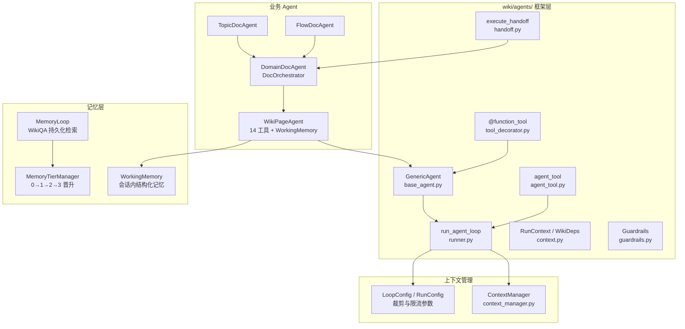
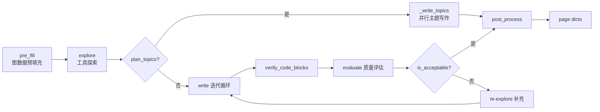
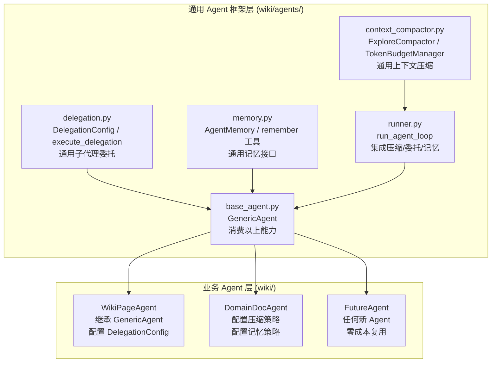
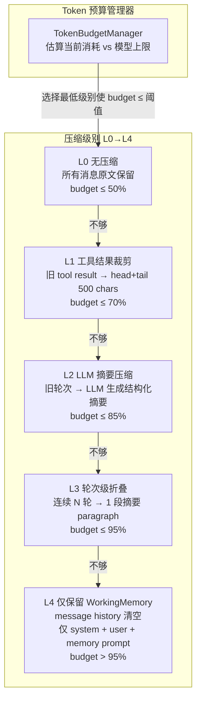
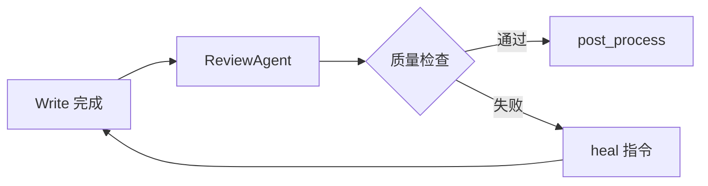

# Agent 架构改进方案

**创建日期：** 2026-05-29  
**状态：** 已完成 — Phase 0-4 全部实施 (2026-06-01)，spec 已归档清理  
**关联文档：** [ARCHITECTURE.md](ARCHITECTURE.md) · [wiki-generation-architecture.md](wiki-generation-architecture.md) · [wiki-quality-audit.md](wiki-quality-audit.md) · [REMAINING-WORK.md](REMAINING-WORK.md)

---

## 1. 文档概要

### 1.1 目的

本文档整合 Knowledge Base Service 中 **Wiki 生成 Agent 子系统** 的架构分析、问题诊断与改进方案，为后续迭代提供统一的设计参考。目标读者为参与 `wiki/agents/`、`wiki/page_agent.py` 及 Wiki 管道节点开发的工程师。

### 1.2 范围

| 在范围内 | 在范围外 |
|----------|----------|
| Agent 框架（`GenericAgent`、`run_agent_loop`、Handoff、agent_tool） | 索引流水线（Tree-sitter / FalkorDB 写入） |
| WikiPageAgent / DomainDocAgent / TopicDocAgent / FlowDocAgent | 前端 Dashboard Wiki UI |
| WorkingMemory、MemoryLoop、MemoryTier | MCP 工具契约细节（见 [MCP-INTEGRATION.md](MCP-INTEGRATION.md)） |
| 上下文裁剪、质量门禁、引用验证 | 非 Agent 路径的模板组稿（`wiki/nodes/compose.py`） |

### 1.3 与其他文档的关系

- **[ARCHITECTURE.md](ARCHITECTURE.md)**：系统级架构与数据流；本文档聚焦 Agent 执行层。
- **[wiki-generation-architecture.md](wiki-generation-architecture.md)**：Wiki 管道节点（classify → compose → quality_gate → heal → finalize）；本文档补充 Agent 循环与委托机制的细节。
- **[wiki-quality-audit.md](wiki-quality-audit.md)**：已识别的 12 项 Wiki 质量问题；本文档从 Agent 架构角度给出根因与修复路径。
- **[REMAINING-WORK.md](REMAINING-WORK.md)**：统一 backlog；Phase 1–4 实施项应同步登记至该文件。

---

## 2. 当前 Agent 架构分析

### 2.1 核心组件



#### 组件职责速查

| 组件 | 文件 | 职责 |
|------|------|------|
| `GenericAgent` | `wiki/agents/base_agent.py` | 基类：`ToolRegistry` 分级激活、`RunConfig` 默认、`run_tool_loop()` 委托给 `run_agent_loop` |
| `run_agent_loop` | `wiki/agents/runner.py` | 统一执行引擎：LLM 工具循环、重复调用检测、上下文裁剪、Guardrail 链 |
| `@function_tool` | `wiki/agents/tool_decorator.py` | 从函数签名自动生成 OpenAI JSON Schema |
| `agent_tool` | `wiki/agents/agent_tool.py` | 将子 Agent 包装为父 Agent 的工具（独立 loop，返回结构化 dict） |
| `execute_handoff` | `wiki/agents/handoff.py` | 子 Agent 委托：深度/次数限制、`HandoffResult` 返回 |
| `RunContext` / `WikiDeps` | `wiki/agents/context.py` | 类型化 DI：`graph_store`、`delegation_depth`、`delegation_count` |
| `DocOrchestrator` | `wiki/agents/doc_orchestrator.py` | 模板方法：`pre_fill → explore → write → verify → evaluate → re-explore*` |
| `WorkingMemory` | `wiki/page_agent.py` | 探索阶段结构化累积：代码片段、调用链、搜索发现、事实 |
| `MemoryLoop` | `wiki/memory_loop.py` | WikiQA 节点持久化 + 向量相似度检索 + prompt 注入 |
| `ContextManager` | `wiki/context_manager.py` | 渐进式裁剪：保留近期轮次，压缩旧 tool 结果 |

### 2.2 执行流程

#### 2.2.1 单 Agent 工具循环

每轮：`get_tools_for_round` → LLM `complete_with_tools` → 分发工具 → `incorporate` 写入 WorkingMemory → 追加 tool message。轮末若 `enable_context_trim=True` 则 `ContextManager.trim()`；否则 `messages > 30` 时**硬重置**为 `[system, user]`（见 §3.2 C-04）。

#### 2.2.2 DocOrchestrator 文档生成流程



`DocOrchestrator.generate()` 当前**不**向 `run_tool_loop` 传入带 `enable_context_trim=True` 的 `RunConfig`；探索阶段的上下文裁剪仅在 `WikiPageAgent.explore()` 直接调用时启用。

### 2.3 Agent 类型与职责

| Agent | 文件 | 模式 | 核心职责 |
|-------|------|------|----------|
| **WikiPageAgent** | `wiki/page_agent.py` | 14 `@function_tool` + WorkingMemory | 页级探索与生成；`delegate_submodule` 子模块委托 |
| **DomainDocAgent** | `wiki/domain_doc_agent.py` | DocOrchestrator 子类 | 域级文档：pre_fill 图数据 → explore/write 分离 → 可选 topic 拆分 |
| **TopicDocAgent** | `wiki/agents/topic_doc_agent.py` | DocOrchestrator 子类 | 单主题页生成；更严格的 `is_acceptable` 阈值 |
| **FlowDocAgent** | `wiki/agents/flow_doc_agent.py` | DocOrchestrator 子类 | 业务流程文档；较低 citation 阈值 |
| **DocOrchestrator** | `wiki/agents/doc_orchestrator.py` | 抽象模板 | 协调 explore/write 迭代、代码块验证、质量评估 |

#### WikiPageAgent 工具分级（Tier）

| Tier | 工具 | 激活时机 |
|------|------|----------|
| 0 | `search_entities`, `query_call_chain`, `read_code` | 第 1 轮起 |
| 1 | `read_file`, `query_callers`, `query_implementations` | 第 2 轮起 |
| 2 | `semantic_search`, `read_wiki_page`, `list_domains` | 第 3 轮起 |
| 3 | `grep_code`, `list_files`, `delegate_submodule` | 第 4 轮起（探索后期） |

---

## 3. 问题诊断

### 3.1 子代理委托机制

#### 问题清单

| ID | 问题 | 严重度 | 代码位置 |
|----|------|--------|----------|
| D-01 | **冷启动子 Agent**：`execute_handoff` 创建全新子 Agent，不继承父 Agent 的 `WorkingMemory` | 高 | `handoff.py:75-89` |
| D-02 | **HandoffResult 信息不足**：仅返回 `output` 文本，无结构化 memory、质量指标、tool 调用统计 | 中 | `handoff.py:41-47` |
| D-03 | **深度传播不完整**：`delegate_submodule` 修改 `self._deps.delegation_depth` 但未传入子 Agent 构造函数；`execute_handoff` 创建 `child_deps` 但 `_factory` 忽略它 | 高 | `page_agent.py:1142-1167`, `handoff.py:75-82` |
| D-04 | **无工具限制**：子 Agent 获得与父 Agent 相同的完整 14 工具集，包括 `delegate_submodule`（可能递归委托） | 中 | `page_agent.py:1145-1155` |
| D-05 | **双轨委托机制**：`agent_tool()` 与 `execute_handoff()` 互不关联，配置、深度限制、结果格式各自独立 | 中 | `agent_tool.py`, `handoff.py` |
| D-06 | **delegation_count 重置**：`child_deps` 将 `delegation_count=0`，同级兄弟委托计数丢失 | 低 | `handoff.py:78` |

#### 现状代码片段

`execute_handoff` 创建子 Agent 时不传递父 memory：

```python
# wiki/agents/handoff.py (现状)
child_deps = dataclasses.replace(
    deps,
    delegation_depth=deps.delegation_depth + 1,
    delegation_count=0,  # 重置，非累加
)
child_agent = config.target_factory(child_deps)
output = await child_agent.generate(
    module_names=entity_names,
    domain_name=domain,
    baseline_context=baseline_context or {},  # 仅 baseline，无 WorkingMemory
    max_rounds=3,
)
return HandoffResult(output=output, metadata={...})  # 无 memory 字段
```

`delegate_submodule` 工厂函数忽略 `child_deps`：

```python
# wiki/page_agent.py (现状)
def _factory(child_deps):
    agent = WikiPageAgent(
        llm=self._llm,
        graph_store=child_deps.graph_store,  # 唯一使用 child_deps 的字段
        # delegation_depth 未传入
    )
    return agent
```

### 3.2 上下文管理

#### 问题清单

| ID | 问题 | 严重度 | 代码位置 |
|----|------|--------|----------|
| C-01 | **边界检测失效**：`ContextManager._find_recent_boundary` 按 `role=user` 计数，但 Agent loop 中 user 消息通常只有初始 prompt，后续为 assistant/tool 交替 | 高 | `context_manager.py:48-56` |
| C-02 | **DocOrchestrator 未启用裁剪**：`generate()` 调用 `_agent.run_tool_loop()` 时使用默认 `RunConfig`，`enable_context_trim=False` | 高 | `doc_orchestrator.py:56-60` |
| C-03 | **Write 阶段无 token 预算**：`_build_write_prompt` 将完整 `memory_to_prompt(memory)` 注入，WorkingMemory 上限 200K chars 可能溢出 LLM 上下文 | 高 | `doc_orchestrator.py:183-189`, `page_agent.py:220` |
| C-04 | **硬重置丢上下文**：未启用 `enable_context_trim` 时，`messages > 30` 直接重置为 `[system, user]`，丢失所有 tool 交互历史 | 高 | `runner.py:347-351` |
| C-05 | **Explore/Write 配置不一致**：`WikiPageAgent.explore()` 启用 `enable_context_trim=True`，但 DocOrchestrator 路径不启用 | 中 | `page_agent.py:735` vs `doc_orchestrator.py:56` |

#### ContextManager 边界检测问题

Agent loop 典型 message 序列：

```
[system] → [user:初始prompt] → [assistant+tools] → [tool] → [tool] → [assistant+tools] → ...
```

`_find_recent_boundary` 从尾部反向计数 `role=user`，在仅有 1 条 user 消息时**永远**返回 index 1，导致「保留最近 N 轮」策略退化为「仅保留 system + 第一条 user，其余全部压缩」。

#### 硬重置逻辑

```python
# wiki/agents/runner.py:345-351
if ctx_mgr:
    messages = ctx_mgr.trim(messages)
elif len(messages) > config.max_history_messages:
    messages = [
        {"role": "system", "content": system_prompt},
        {"role": "user", "content": user_prompt},
    ]
```

当 `enable_context_trim=False`（DocOrchestrator 默认路径），超过 30 条消息时**全部 tool 交互历史被丢弃**，但 `WorkingMemory` 仍保留结构化数据——LLM 失去「为何得出该结论」的推理链。

### 3.3 记忆系统

#### 问题清单

| ID | 问题 | 严重度 | 代码位置 |
|----|------|--------|----------|
| M-01 | **access_count 从未更新**：`MemoryTierManager.apply_promotion_rules` 依赖 `access_count >= 2/10`，但运行时无写入 | 高 | `memory_tiers.py:102-122` |
| M-02 | **increment_wiki_qa_access 未调用**：`store/wiki_memory_store.py` 已实现，全库无调用点 | 高 | `wiki_memory_store.py:52` |
| M-03 | **confirmation_count 未更新**：Episodic → Semantic 晋升需 `confirmation_count >= 3`，无确认机制 | 中 | `memory_tiers.py:115-117` |
| M-04 | **无 remember 工具**：Agent 无法自主决定将重要发现写入 WikiQA | 中 | — |
| M-05 | **call_chains 无去重**：`WorkingMemory.incorporate` 对 `query_call_chain` 结果直接 append | 低 | `page_agent.py:283-292` |
| M-06 | **MemoryLoop 检索后不记录访问**：`get_relevant_memories` 返回结果但不 increment access | 中 | `memory_loop.py:97-158` |
| M-07 | **Tier 晋升仅在 Lint 批处理**：`WikiLintService._check_memory_promotions` 离线运行，非实时 | 低 | `wiki/lint.py:625-645` |

#### MemoryTier 晋升规则（设计 vs 现实）

| Tier | 名称 | 晋升条件（设计） | 当前状态 |
|------|------|------------------|----------|
| 0 | Working | 24h 内 access_count ≥ 2 → Episodic | access_count 恒为 0，全部 expired |
| 1 | Episodic | 7 天内 confirmation_count ≥ 3 → Semantic | confirmation_count 恒为 0 |
| 2 | Semantic | access_count ≥ 10 且 confidence ≥ 0.8 → Procedural | 无法达到 |
| 3 | Procedural | 永久保留 | 无节点晋升到此层 |

### 3.4 输出稳定性

#### 问题清单

| ID | 问题 | 严重度 | 代码位置 |
|----|------|--------|----------|
| O-01 | **强制接受低质量输出**：`is_acceptable` 在 `iteration >= 3` 时无条件 `return True` | 高 | `domain_doc_agent.py:686-687`, `topic_doc_agent.py:89-90` |
| O-02 | **无结构化输出强制**：关键路径（topic plan、quality verdict）仍使用自由文本或 `json_object` 降级 | 中 | 见 [REMAINING-WORK.md](REMAINING-WORK.md) F4 |
| O-03 | **引用验证不强制行级锚定**：`verify_and_inject` 替换/注入代码块，但不验证 prose 中的 `source://` 引用是否指向真实行号 | 中 | `code_block_verifier.py` |
| O-04 | **幻觉检测仅 flag 不 block**：`content_guards.detect_hallucination_flags` 在 quality_gate 为 soft heal，finalize 才 hard reject | 中 | `content_guards.py`, `nodes/quality_gate.py` |
| O-05 | **TopicDocAgent iteration=3 强制通过**：即使 coverage < 0.9 也会接受 | 高 | `topic_doc_agent.py:89-90` |

#### is_acceptable 强制通过逻辑

```python
# wiki/domain_doc_agent.py:680-688
def is_acceptable(self, quality: QualityResult, iteration: int) -> bool:
    if quality.coverage >= 0.95 and quality.citation_density >= 0.5 and quality.context_gap_count == 0:
        return True
    if iteration >= 2 and quality.coverage >= 0.9 and quality.citation_density >= 0.3:
        return True
    if iteration >= 3:
        return True  # ⚠ 无条件接受，无论质量如何
    return False
```

---

## 4. 业界工具对比与借鉴

### 4.1 对比总表

| 维度 | 本项目（现状） | Claude SDK | OpenAI Agents SDK | LangGraph | CrewAI | Copilot Agent | Codex 2026 |
|------|---------------|------------|-------------------|-----------|--------|---------------|------------|
| **子 Agent 上下文** | 冷启动，无 memory 继承 | 独立上下文 + seed baseline | 可选 full history transfer | Checkpointer + State Reducer | 共享或独立可配置 | 单 Agent 多工具 | 并行 Agent + worktrees |
| **委托模式** | handoff + agent_tool 双轨 | Sub-agent spawn + fork | Agents-as-Tools + Handoff | Supervisor → Worker | Role-based delegation | 无显式子 Agent | 原生多 Agent 并行 |
| **Manager 控制** | 父 Agent 等待子 Agent 完成 | 并行 spawn，结果汇总 | Manager 保持 loop 控制 | Supervisor 路由 | Manager Agent 协调 | 单 Agent 控制 | 结果汇总 |
| **记忆持久化** | WikiQA 图节点（未激活访问计数） | Memory Tool 自主存储 | Session Memory + Compaction | State 字段 merge 策略 | Cognitive Memory 五操作 | copilot-instructions.md | 跨会话持久 Memory |
| **上下文压缩** | ContextManager（边界检测有 bug） | micro/snip/LLM summary 三层 | input_filter + nest_handoff_history | 自定义 reducer | Task output 摘要 | 混合检索 + agentic 多轮 | /responses/compact 服务端 |
| **结构化输出** | 部分 json_schema strict | — | json_schema strict mode | Pydantic state | Task output schema | Slash commands | — |
| **引用 grounding** | code_block_verifier | Citation API（行级） | — | CRAG 检索质量门控 | — | get_errors 迭代 | 内置 Security 扫描 |
| **工具限制** | Tier 分级激活 | allowed_tools 白黑名单 | per-agent tools + guardrails | Node 级 tools | Role 绑定 tools | 16+ 专用工具 | 90+ MCP 插件 |
| **模型路由** | 单一模型全路径 | — | — | 节点级配置 | — | — | GPT-5.4/mini 分层 |
| **可观测性** | AgentTracer span 树 | subagent JSONL | Tracing Dashboard | get_state_history | Flow trace | Checkpoint + 回滚 | 会话级可视化 |

### 4.2 Claude SDK 子代理模式

**核心思想：** 子 Agent 拥有完全独立的上下文窗口，但接收来自父 Agent 的 **seed baseline**（任务描述 + 关键发现摘要），避免冷启动信息不足。

**可借鉴：**
- 独立上下文 + baseline seed → 对应 `DelegationMode.SEEDED`
- Memory Tool 让 Agent 自主决定存储内容 → 对应 `remember` 工具
- Server-side context compaction → 增强 `ContextManager` 或 LLM 摘要压缩

### 4.3 OpenAI Agents SDK 模式

**核心思想：** Agents-as-Tools——子 Agent 像一个函数调用，Manager Agent 保持主 loop 控制权，子 Agent 返回结构化结果后继续决策。

**可借鉴：**
- `agent_tool()` 模式已部分实现，需与 `handoff` 统一
- Handoff 可选 full history transfer → `DelegationMode.FULL`
- json_schema strict mode → 关键路径强制结构化输出
- Session Memory + Compaction → `MemoryLoop` + LLM 摘要

### 4.4 LangGraph Supervisor 模式

**核心思想：** Supervisor 节点协调多个 Worker 节点并行执行，通过 Checkpointer 持久化状态，State Reducer 定义字段 merge 策略。

**可借鉴：**
- Supervisor + Worker → `DocOrchestrator.plan_topics` + 并行 `_write_topics`
- State Reducer → `WorkingMemory.merge()` 增强（去重、优先级）
- CRAG（Corrective RAG）→ 探索结果质量门控，低质量触发 re-retrieval

### 4.5 各模式优劣对比

| 模式 | 优势 | 劣势 | 适用场景 |
|------|------|------|----------|
| **Claude 隔离式** | 上下文不污染；可并行 | 子 Agent 缺少父级推理链 | **Explore 阶段**（只读、可并行） |
| **OpenAI 工具式** | Manager 保持控制；结果可追溯 | 子 Agent 上下文受父窗口限制 | **Review 阶段**（Manager 统一 guardrail） |
| **LangGraph 监督式** | 并行 Worker；状态可持久化 | 编排复杂度高 | **Topic 并行写作** |
| **Full History** | 子 Agent 拥有完整推理链 | Token 消耗大；可能引入噪声 | 复杂模块深度文档化 |

### 4.6 Copilot / Codex / Cody / Greptile 借鉴

#### GitHub Copilot Agent Mode
- **Agentic 多轮检索**：不一次性 top-K，而是根据初始结果决定是否追加 targeted search — 对应 Explore 阶段可引入 CRAG sufficiency check
- **混合检索栈**与 KBS 3-way RRF 高度同构，但 Copilot 会自动切换语义/符号/grep 策略
- **项目规则文件** `.github/copilot-instructions.md` → 对应 per-domain wiki style guide 注入

#### OpenAI Codex 2026
- **双 tier 模型路由**：GPT-5.4 做规划/关键路径，mini 做子 Agent 窄任务 → 对应 explore 用 fast model，compose/finalize 用 full model
- **服务端 Compaction API** `/responses/compact` → 对应 ExploreCompactor LLM 摘要
- **并行 Agent + worktrees**：多 Agent 各自隔离 git worktree → 对应 Topic 并行写作

#### Sourcegraph Cody
- **Agentic Context Fetching**：evaluate → fetch → reflect → iterate 直到 context 充分 → CRAG 门控参考
- **全局 snippet ranking**：远程 + 本地统一 relevance 排序 → 多 retriever 融合策略

#### Greptile
- **Graph-based impact analysis**：改 `foo()` 时 instant 知道 callers/callees → KBS FalkorDB 已具备同类能力，需集成到 explore prompt
- **Confidence score 0-5** + **结构化 review output** → quality_gate 可借鉴

### 4.7 能力差距摘要

| 差距领域 | KBS 现状 | 业界标杆 | 差距性质 |
|----------|---------|---------|---------|
| 上下文管理 | 边界检测 bug + 硬重置 | Claude 三层压缩 + Codex 服务端 compact | **已有设计未接通** |
| 委托编排 | 双轨分裂 + 冷启动 | Claude 隔离+seed、OpenAI 双模式语义 | **已有设计未统一** |
| 质量控制 | iteration≥3 强制通过 | OpenAI guardrail tripwire、Greptile confidence score | **已有设计有漏洞** |
| 记忆系统 | Tier 晋升空转 | CrewAI auto-extract、Claude Memory Tool | **已有设计未激活** |
| 检索策略 | 默认二路（非三路）融合 | Copilot agentic 多轮、Cody sufficiency check | **配置保守** |
| 模型路由 | 全路径单一模型 | Codex GPT-5.4/mini 分层 | **完全缺失** |
| 可观测性 | AgentTracer 有实现无 UI | OpenAI Traces Dashboard | **有基础无产品** |

**核心结论：** KBS 的差异化资产是 FalkorDB 图+向量深度代码理解；Agent 执行层差距主要在「已有设计未接通」（约 70%）而非从零重建（约 30%）。最高 ROI 路径是先修 bug + 激活已有设计，再对齐主流 SDK 模式。

---

## 5. 融合改进方案

### 5.1 设计原则

#### 5.1.1 通用 Agent 层 vs 业务 Agent 层

> **核心原则：子代理委托、记忆管理、上下文压缩均为通用 Agent 框架能力，必须实现在 `wiki/agents/` 框架层，业务 Agent 仅作为消费者。**



**分层职责：**

| 层次 | 模块 | 职责 | 不应包含 |
|------|------|------|----------|
| **通用框架** | `wiki/agents/delegation.py` | `DelegationConfig`、`DelegationMode`、`execute_delegation` | Wiki 特定的 baseline 格式 |
| **通用框架** | `wiki/agents/context_compactor.py` | `ExploreCompactor`、`TokenBudgetManager`、五级压缩策略 | 特定 prompt 模板 |
| **通用框架** | `wiki/agents/memory.py` | `AgentMemory` 接口、`remember` 工具基类、access 追踪 | WikiQA 图操作细节 |
| **通用框架** | `wiki/agents/runner.py` | 压缩/委托/记忆的集成编排 | 业务逻辑 |
| **业务 Agent** | `wiki/page_agent.py` | 配置使用哪种 `DelegationMode`、哪些 `allowed_tools` | 实现委托框架 |
| **业务 Agent** | `wiki/domain_doc_agent.py` | 配置 `compaction_interval`、`memory_fields` | 实现压缩算法 |

#### 5.1.2 不同任务类型使用不同委托模式

| 阶段 | 委托模式 | 理由 |
|------|----------|------|
| **Explore** | Claude 模式（隔离 + seed + 并行 + 只读工具） | 探索任务独立、可并行、不需写权限 |
| **Write** | Hybrid（隔离上下文 + Manager 看结果） | 写作者独立创作，Orchestrator 评估质量 |
| **Review** | OpenAI 模式（Manager 控制 + 统一 guardrail） | 质量审查需全局视角 |

### 5.2 子代理：通用委托框架 (`wiki/agents/delegation.py`)

> **架构决策：** `DelegationConfig`、`DelegationMode`、`execute_delegation` 实现在 `wiki/agents/delegation.py`，作为通用 Agent 框架的一部分。任何继承 `GenericAgent` 的 Agent 均可通过配置使用委托能力，无需关心具体实现。

#### 5.2.1 新增 DelegationMode 枚举

```python
# wiki/agents/delegation.py — 通用 Agent 框架层
from enum import Enum
from dataclasses import dataclass, field
from typing import Any, Callable

class DelegationMode(Enum):
    ISOLATED = "isolated"   # 完全冷启动
    SEEDED = "seeded"       # 独立上下文 + 父 memory 摘要 seed
    FULL = "full"           # 传递完整 message history

@dataclass
class DelegationConfig:
    """通用委托配置 — 不含任何 Wiki 业务逻辑。"""
    mode: DelegationMode = DelegationMode.SEEDED
    max_depth: int = 2
    max_count: int = 3
    max_rounds: int = 3
    allowed_tools: list[str] | None = None   # None = 继承父工具
    read_only: bool = False                   # True = 禁用 write/delegate 工具
    seed_memory_fields: list[str] = field(
        default_factory=lambda: [
            "code_snippets", "discovered_call_chains",
            "search_findings", "relevant_modules",
        ]
    )
    result_schema: type | None = None         # 可选 Pydantic 结构化返回
```

#### 5.2.2 增强 HandoffResult + 统一 execute_delegation

`HandoffResult` 扩展字段：`memory_summary`、`quality`、`delegation_depth`。`execute_delegation()` 统一替代 `execute_handoff` + `agent_tool` 双轨——**实现在通用框架层**，核心逻辑：

```python
# wiki/agents/delegation.py — 通用 Agent 框架层
async def execute_delegation(config, factory, deps, *, task_input, parent_memory=None, ...) -> HandoffResult:
    """通用委托执行器 — 不含 Wiki 业务逻辑。"""
    child_deps = replace(deps, delegation_depth=deps.delegation_depth + 1,
                         delegation_count=deps.delegation_count + 1)  # 累加
    baseline = _extract_memory_seed(parent_memory, config.seed_memory_fields) \
        if config.mode == SEEDED else {"message_history": message_history}  # FULL
    child_agent = factory(child_deps)
    if config.allowed_tools or config.read_only:
        child_agent.restrict_tools(config.allowed_tools or _READ_ONLY_TOOLS)
    output = await child_agent.generate(**task_input, baseline_context=baseline, ...)
    return HandoffResult(output=output, memory_summary=_summarize_memory(...), ...)
```

#### 5.2.3 业务 Agent 消费示例：delegate_submodule 修复

```python
# wiki/page_agent.py — 业务 Agent 层（消费通用框架）
async def delegate_submodule(self, entity_names: list[str], focus: str = "") -> dict:
    from wiki.agents.delegation import DelegationConfig, DelegationMode, execute_delegation

    config = DelegationConfig(
        mode=DelegationMode.SEEDED,
        max_depth=self._MAX_DELEGATION_DEPTH,
        max_count=self._MAX_DELEGATIONS_PER_AGENT,
        read_only=True,
        allowed_tools=[
            "search_entities", "read_code", "query_call_chain",
            "query_callers", "read_file", "grep_code",
        ],
    )

    def _factory(child_deps: WikiDeps) -> WikiPageAgent:
        agent = WikiPageAgent(..., deps=child_deps)  # 传入 child_deps
        agent._delegation_depth = child_deps.delegation_depth
        return agent

    result = await execute_delegation(
        config, _factory, self._deps,
        task_input={"entity_names": entity_names, "focus": focus},
        parent_memory=self._current_memory,
    )
    return {"delegated": True, "content": result.output, "quality": result.quality}
```

### 5.3 记忆：通用记忆框架 (`wiki/agents/memory.py`)

> **架构决策：** 记忆能力分两层实现——通用 Agent 框架层提供 `AgentMemory` 接口、`remember` 工具注册机制和访问追踪协议；业务层（`WikiPageAgent`）提供 `WorkingMemory` 具体实现和 `MemoryLoop` 持久化后端。

```python
# wiki/agents/memory.py — 通用 Agent 框架层
from abc import ABC, abstractmethod

class AgentMemory(ABC):
    """通用 Agent 记忆接口 — 不绑定任何存储后端。"""

    @abstractmethod
    def incorporate(self, tool_name: str, result: dict) -> None:
        """将工具调用结果纳入记忆。"""

    @abstractmethod
    def to_prompt(self, max_chars: int | None = None) -> str:
        """序列化为 LLM 可消费的 prompt 片段。"""

    @abstractmethod
    def merge(self, other: "AgentMemory") -> None:
        """合并另一个 AgentMemory（用于子 Agent 结果回收）。"""

    @abstractmethod
    def slice(self, keys: set[str]) -> "AgentMemory":
        """按 key 集合切片（用于子 Agent seed）。"""
```

#### 5.3.1 Remember 工具（框架层注册，业务层实现后端）

```python
# wiki/agents/base_agent.py — 通用 Agent 框架层
# GenericAgent 提供 remember 工具的注册接口

@function_tool(name="remember", tier=2, description="将重要发现持久化到长期记忆库")
async def remember(
    self,
    question: str,
    answer: str,
    source_pages: list[str] | None = None,
    confidence: float = 0.7,
) -> dict[str, Any]:
    """通用 remember 工具 — 调用 self._memory_backend.store()。"""
    if not self._memory_backend:
        return {"error": "memory_backend_not_configured"}
    uid = await self._memory_backend.store(
        question=question, answer=answer,
        source_pages=source_pages or [], confidence=confidence,
    )
    return {"stored": True, "uid": uid, "confidence": confidence}

# wiki/page_agent.py — 业务层注入 MemoryLoop 作为后端
class WikiPageAgent(GenericAgent):
    def __init__(self, ..., memory_loop: MemoryLoop | None = None):
        super().__init__(...)
        self._memory_backend = memory_loop  # 注入持久化后端
```

#### 5.3.2 访问追踪（框架层协议，业务层实现）

```python
# wiki/agents/memory.py — 通用框架层定义协议
class MemoryBackend(Protocol):
    """通用记忆持久化后端协议。"""
    async def store(self, question: str, answer: str, ...) -> str: ...
    async def retrieve(self, topic: str, limit: int = 5) -> list: ...
    async def record_access(self, uid: str) -> None: ...

# wiki/memory_loop.py — 业务层实现
class MemoryLoop:
    async def get_relevant_memories(self, topic: str, limit: int = 5, ...) -> list[MemoryEntry]:
        entries = await self._fetch_and_rank(topic, limit)
        ts = time.strftime("%Y-%m-%dT%H:%M:%SZ", time.gmtime())
        for entry in entries:
            if entry.uid:
                await self._store.increment_wiki_qa_access(uid=entry.uid, at_iso=ts)
        return entries
```

#### 5.3.3 WorkingMemory 去重与预算

`query_call_chain` 结果 append 前检查去重；超 `MAX_TOTAL_CHARS` 时按优先级裁剪（`search_findings` → `discovered_call_chains` → `code_snippets`）。长期：LLM 摘要压缩 Episodic → Semantic（WikiQA tier=2）。

### 5.4 上下文：通用自动压缩框架 (`wiki/agents/context_compactor.py` + `wiki/agents/token_budget.py`)

#### 5.4.1 修复 ContextManager 边界检测

```python
# 提案：wiki/context_manager.py
def _find_recent_boundary(self, messages: list[dict]) -> int:
    """按 assistant+tool 轮次计数，而非 user 消息。"""
    round_count = 0
    for i in range(len(messages) - 1, 0, -1):
        if messages[i].get("role") == "assistant":
            round_count += 1
            if round_count >= self._keep_recent:
                return i
    return 1
```

#### 5.4.2 上下文自动压缩机制（通用框架层核心设计）

> **架构决策：** `ExploreCompactor` 和 `TokenBudgetManager` 实现在 `wiki/agents/` 框架层，由 `run_agent_loop` 统一编排。任何使用 `run_agent_loop` 的 Agent 均自动获得压缩能力，只需在 `LoopConfig` 中配置 `enable_compaction=True`。

**设计原则：** 上下文压缩不是「机械删除」，而是「语义蒸馏」——将旧轮次的工具调用结果浓缩为结构化发现，保留推理链中的因果关系，同时释放 token 空间。

##### 5.4.2.1 五级渐进压缩策略



| 级别 | 触发条件 | 压缩方式 | 信息保留率 | 适用场景 |
|------|----------|----------|-----------|----------|
| **L0** | budget ≤ 50% | 无操作 | 100% | 前几轮探索 |
| **L1** | budget ≤ 70% | 旧 tool result → `head[:200] + tail[-200:]` | ~40% | 中期探索（现有方案增强） |
| **L2** | budget ≤ 85% | 旧轮次 → LLM 结构化摘要 | ~25%（语义 100%） | 长探索（8+ 轮） |
| **L3** | budget ≤ 95% | 连续轮次 → 段落级概述 | ~10%（语义 90%） | 超长探索（15+ 轮） |
| **L4** | budget > 95% | 仅 WorkingMemory | ~5%（语义 80%） | 兜底（替代硬重置） |

**关键区别：** 现有的硬重置（`messages > 30 → [system, user]`）丢失 **所有** 推理上下文（L4 以上）。新方案保证：
- L2+ 通过 LLM 语义蒸馏保留核心发现
- L3 仍保留因果链（「因为看到 X，所以推断 Y」）
- L4 兜底仍有 WorkingMemory 结构化数据（优于完全清空）

##### 5.4.2.2 ExploreCompactor：LLM 驱动的语义蒸馏

```python
# wiki/agents/context_compactor.py — 通用 Agent 框架层

@dataclass
class CompactionResult:
    """一组旧轮次压缩后的结构化摘要。"""
    summary: str                    # 自然语言概述（注入 message history）
    key_findings: list[str]         # 关键发现列表（注入 WorkingMemory.facts）
    covered_entities: list[str]     # 已探索的实体名
    source_round_range: tuple[int, int]  # 原始轮次范围
    original_chars: int             # 压缩前字符数
    compressed_chars: int           # 压缩后字符数

class ExploreCompactor:
    """将旧的探索轮次压缩为结构化摘要，保留因果关系。"""

    COMPACTION_PROMPT = '''你是一个代码知识库助手。以下是 Agent 探索代码库时的工具调用记录。
请将这些记录蒸馏为结构化摘要，**必须保留**：
1. 发现了哪些关键实体（类/方法/模块）及其作用
2. 调用链和依赖关系
3. 重要的业务逻辑发现
4. 推理链：为什么做出某个判断（因果关系）

**必须丢弃**：
- 原始代码全文（保留关键签名即可）
- 重复的搜索结果
- 工具调用的元数据（call_id、timing 等）
- 无用的空结果

输出格式：
## 探索摘要 (轮次 {start}-{end})
### 关键发现
- ...
### 调用链
- A → B → C: 功能描述
### 推理链
- 因为发现 X，推断 Y'''

    def __init__(self, llm_port, *, model: str | None = None):
        self._llm = llm_port
        self._model = model  # 使用小/快模型以控制成本

    async def compact(
        self,
        messages: list[dict],
        start_idx: int,
        end_idx: int,
    ) -> CompactionResult:
        """将 messages[start_idx:end_idx] 压缩为结构化摘要。"""
        segment = messages[start_idx:end_idx]
        original_text = "\n".join(
            f"[{m['role']}] {(m.get('content') or '')[:2000]}"
            for m in segment
        )
        original_chars = sum(len(m.get("content") or "") for m in segment)

        prompt = self.COMPACTION_PROMPT.format(
            start=start_idx, end=end_idx,
        ) + f"\n\n---\n工具调用记录：\n{original_text[:30000]}"

        summary = await self._llm.complete(
            prompt,
            model=self._model,
            max_tokens=2000,
        )

        findings = self._extract_findings(summary)
        entities = self._extract_entities(segment)

        return CompactionResult(
            summary=summary,
            key_findings=findings,
            covered_entities=entities,
            source_round_range=(start_idx, end_idx),
            original_chars=original_chars,
            compressed_chars=len(summary),
        )

    def _extract_findings(self, summary: str) -> list[str]:
        """从摘要中提取 '- ...' 格式的关键发现。"""
        import re
        return re.findall(r"^[-*]\s+(.+)$", summary, re.MULTILINE)[:20]

    def _extract_entities(self, messages: list[dict]) -> list[str]:
        """从 tool call 参数中提取实体名。"""
        entities = set()
        for m in messages:
            if m.get("role") == "tool":
                content = m.get("content") or ""
                # 从 tool 结果中提取 entity_name 字段
                import json
                try:
                    data = json.loads(content)
                    if isinstance(data, dict):
                        for key in ("entity_name", "name", "module_name"):
                            if key in data:
                                entities.add(data[key])
                except (json.JSONDecodeError, TypeError):
                    pass
        return list(entities)
```

##### 5.4.2.3 TokenBudgetManager：自适应压缩触发

```python
# wiki/agents/token_budget.py — 通用 Agent 框架层

@dataclass
class BudgetSnapshot:
    """当前 token 使用快照。"""
    total_chars: int
    estimated_tokens: int
    model_limit: int         # 模型上下文上限（tokens）
    usage_ratio: float       # estimated_tokens / model_limit
    recommended_level: int   # 推荐压缩级别 0-4

class TokenBudgetManager:
    """自适应管理消息列表的 token 消耗，选择最低压缩级别。"""

    LEVEL_THRESHOLDS = [0.50, 0.70, 0.85, 0.95]  # L0→L1→L2→L3→L4

    def __init__(
        self,
        model_context_limit: int = 128_000,
        chars_per_token: float = 3.5,  # 中英文混合近似值
        reserve_for_output: int = 4_000,  # 为 LLM 输出预留 tokens
    ):
        self._limit = model_context_limit - reserve_for_output
        self._cpt = chars_per_token

    def snapshot(self, messages: list[dict]) -> BudgetSnapshot:
        total_chars = sum(len(m.get("content") or "") for m in messages)
        estimated_tokens = int(total_chars / self._cpt)
        ratio = estimated_tokens / self._limit if self._limit > 0 else 1.0
        level = 0
        for i, threshold in enumerate(self.LEVEL_THRESHOLDS):
            if ratio > threshold:
                level = i + 1
        return BudgetSnapshot(
            total_chars=total_chars,
            estimated_tokens=estimated_tokens,
            model_limit=self._limit,
            usage_ratio=ratio,
            recommended_level=min(level, 4),
        )
```

##### 5.4.2.4 集成到 run_agent_loop 的压缩流水线

```mermaid
sequenceDiagram
    participant Loop as run_agent_loop
    participant BM as TokenBudgetManager
    participant CM as ContextManager
    participant EC as ExploreCompactor
    participant WM as WorkingMemory

    Loop->>BM: snapshot(messages)
    BM-->>Loop: level=L2, ratio=0.78

    alt level == L0
        Loop->>Loop: 无操作
    else level == L1
        Loop->>CM: trim(messages) — head+tail 裁剪
    else level == L2
        Loop->>EC: compact(messages, old_start, old_end)
        EC-->>Loop: CompactionResult
        Loop->>WM: inject key_findings 到 facts
        Loop->>Loop: 替换旧消息为 [compaction_summary]
    else level == L3
        Loop->>EC: compact(messages, 1, boundary) — 大范围折叠
        EC-->>Loop: CompactionResult
        Loop->>Loop: 仅保留 [system, summary, recent_N_rounds]
    else level == L4
        Loop->>WM: 将当前 memory 序列化为 prompt
        Loop->>Loop: messages = [system, user_with_memory]
    end
```

```python
# wiki/agents/runner.py — 通用 Agent 框架层（集成压缩流水线）

async def _apply_context_compression(
    messages: list[dict],
    budget_mgr: TokenBudgetManager,
    ctx_mgr: ContextManager | None,
    compactor: ExploreCompactor | None,
    memory: Any,
) -> list[dict]:
    """根据 token 预算自适应选择压缩级别。"""
    snap = budget_mgr.snapshot(messages)
    level = snap.recommended_level

    if level == 0:
        return messages
    if level == 1:
        return ctx_mgr.trim(messages) if ctx_mgr else messages
    if level >= 2 and compactor:
        boundary = ctx_mgr._find_recent_boundary(messages) if ctx_mgr else len(messages) - 6
        result = await compactor.compact(messages, 1, boundary)

        # 将关键发现注入 WorkingMemory
        if memory and hasattr(memory, "facts"):
            for finding in result.key_findings:
                if finding not in memory.facts:
                    memory.facts.append(finding)

        # 替换旧消息为压缩摘要
        compressed = [messages[0]]  # system prompt
        compressed.append({
            "role": "user",
            "content": f"[探索摘要 — 轮次 {result.source_round_range[0]}-{result.source_round_range[1]}]\n{result.summary}",
        })
        compressed.extend(messages[boundary:])  # 近期轮次原文保留

        log.info("context_compressed",
                 level=level,
                 original_chars=result.original_chars,
                 compressed_chars=result.compressed_chars,
                 ratio=f"{result.compressed_chars/max(result.original_chars,1):.1%}")
        return compressed

    # L4 兜底：仅 WorkingMemory
    if memory:
        memory_prompt = memory.to_prompt() if hasattr(memory, "to_prompt") else str(memory)
        return [
            messages[0],
            {"role": "user", "content": f"[WorkingMemory 兜底]\n{memory_prompt[:40000]}"},
        ]
    return [messages[0], messages[1]]
```

##### 5.4.2.5 压缩成本控制

| 关注点 | 策略 |
|--------|------|
| **LLM 调用成本** | ExploreCompactor 使用小模型（如 `gpt-4o-mini` / `claude-3-haiku`），单次压缩 < 2K output tokens |
| **压缩延迟** | 每 10 轮压缩一次（非每轮触发），异步执行不阻塞工具调用 |
| **过度压缩风险** | `keep_recent_rounds=3` 保证最近 3 轮永远原文保留；L2 以上需 `compactor` 非 None |
| **配置化控制** | 通过 `LoopConfig` 新增字段：`compaction_model`、`compaction_interval`、`compaction_enabled` |
| **降级策略** | LLM 压缩失败 → 降级到 L1 机械裁剪 → 保证不中断 Agent 循环 |

##### 5.4.2.6 与现有 ContextManager 的关系

```
现状：ContextManager (L1 only) ──OR── 硬重置 (L4+ 丢失所有)
         ↓
改进后：
  TokenBudgetManager 自适应选择
    ├── L0: 无操作（小 context）
    ├── L1: ContextManager.trim()（现有逻辑，修复边界检测）
    ├── L2: ExploreCompactor.compact()（LLM 语义蒸馏）
    ├── L3: ExploreCompactor 大范围折叠 + 仅保留近期
    └── L4: WorkingMemory 兜底（替代硬重置）
```

**向后兼容：** `enable_context_trim=True` 时启用 L1+ 压缩；新增 `enable_compaction=True` 启用 L2+。默认配置不改变现有行为，仅新路径受益。

**通用性保证：** `ExploreCompactor` 的 `COMPACTION_PROMPT` 不含任何 Wiki 业务术语。业务 Agent 可通过子类覆写 `compaction_prompt` 属性注入领域特定的压缩指令，但框架层默认 prompt 适用于任何代码探索场景。

#### 5.4.3 业务 Agent 消费示例：DocOrchestrator 启用压缩

```python
# wiki/agents/doc_orchestrator.py — 业务层消费通用框架能力
async def generate(self, module_names, baseline_context):
    explore_config = RunConfig(
        enable_context_trim=True,       # 启用 L1 裁剪
        context_trim_max_chars=60000,
        context_trim_keep_recent=3,
        max_history_messages=50,        # 依赖 trim 而非硬重置
        enable_compaction=True,         # 启用 L2+ LLM 语义压缩
        compaction_interval=10,         # 每 10 轮触发一次 LLM 压缩
    )
    memory = await self._agent.run_tool_loop(
        self._explore_system_prompt,
        self._build_explore_prompt(module_names, baseline_context),
        memory,
        config=explore_config,
    )
```

#### 5.4.4 业务 Agent 消费示例：Write 阶段 Token 预算

```python
# wiki/agents/doc_orchestrator.py — 业务层消费 TokenBudgetManager
def _build_write_prompt(self, baseline_context: str, memory: Any) -> str:
    WRITE_MEMORY_BUDGET = 40_000  # chars
    memory_section = self._agent.memory_to_prompt(memory, max_chars=WRITE_MEMORY_BUDGET)
    return f"Domain: {self._name}\n\nBaseline:\n{baseline_context[:8000]}\n\nFindings:\n{memory_section}"
```

#### 5.4.5 CRAG 检索质量门控

探索完成后、进入 Write 前，评估 memory 质量：

```python
async def _crag_gate(self, memory: WorkingMemory, module_names: list[str]) -> bool:
    """Corrective RAG：memory 不足时触发补充探索。"""
    coverage = len(memory.relevant_modules) / max(len(module_names), 1)
    has_code = bool(memory.code_snippets)
    has_chains = bool(memory.discovered_call_chains)
    if coverage < 0.5 or (not has_code and not has_chains):
        log.warning("crag_gate_failed", coverage=coverage, has_code=has_code)
        return False
    return True
```

### 5.5 输出：结构化输出 + 引用强制

#### 5.5.1 移除 is_acceptable 强制通过

```python
# 提案：wiki/domain_doc_agent.py
def is_acceptable(self, quality: QualityResult, iteration: int) -> bool:
    if quality.coverage >= 0.95 and quality.citation_density >= 0.5 and quality.context_gap_count == 0:
        return True
    if iteration >= 2 and quality.coverage >= 0.9 and quality.citation_density >= 0.3:
        return True
    # 移除 iteration >= 3 强制通过
    if iteration >= self._max_iterations - 1:
        # 最后一次迭代：降级接受，但标记质量
        log.warning("quality_forced_accept", coverage=quality.coverage, iteration=iteration)
        return quality.coverage >= 0.7  # 最低阈值
    return False
```

#### 5.5.2 Topic Plan 结构化输出 + 行级引用

Topic 规划使用 `TopicPlan` / `TopicPlanItem` Pydantic 模型 + `json_schema strict`。新增 `wiki/citation_verifier.py` 验证 prose 中 `source://path#L10-L20` 引用是否指向真实代码行，返回 `CitationReport(verified, unverified)`。

### 5.6 Review Agent 集成

新增专职 Review Agent，在 Write 完成后、post_process 前运行：



`ReviewAgent` 提供 `check_hallucination` / `check_citations` 工具，通过 `agent_tool` 注册到 DocOrchestrator（OpenAI 模式：Manager 保持控制权，Review 失败 → heal 指令）。

---

## 6. 实施路线图

### 6.1 优先级总表

| 优先级 | 项目 | 问题 ID | 预期收益 | 工作量 |
|--------|------|---------|----------|--------|
| **P0** | ContextManager 边界修复 | C-01 | 探索阶段上下文正确裁剪 | 0.5 天 |
| **P0** | DocOrchestrator 启用 context_trim | C-02, C-05 | 域/主题生成不再硬重置 | 0.5 天 |
| **P0** | delegate_submodule 深度传播 | D-03 | 递归委托可控 | 1 天 |
| **P1** | DelegationConfig 统一委托 | D-01, D-04, D-05 | 子 Agent 可 seed、可限工具 | 1 周 |
| **P1** | MemoryLoop 访问追踪激活 | M-01, M-02, M-06 | Tier 晋升链路打通 | 2 天 |
| **P1** | is_acceptable 移除强制通过 | O-01, O-05 | 低质量文档不再静默放行 | 1 天 |
| **P1** | ExploreCompactor 语义压缩 (L2) | C-04 | 替代硬重置，保留推理链 | 1 周 |
| **P1** | TokenBudgetManager 自适应压缩 | C-01~C-05 | 五级渐进压缩，永不丢失上下文 | 3 天 |
| **P2** | Remember 工具 | M-04 | Agent 自主记忆 | 3 天 |
| **P2** | Write 阶段 token 预算 | C-03 | 避免 LLM 上下文溢出 | 2 天 |
| **P2** | Topic 并行化（LangGraph 模式） | — | 大域生成加速 | 1–2 周 |
| **P2** | CRAG 质量门控 | — | 减少低质量 Write | 3 天 |
| **P3** | Review Agent | — | 生成后质量审查 | 1 周 |
| **P3** | 行级引用验证 | O-03 | 引用可信度 | 1 周 |
| **P3** | L3/L4 高级压缩 + LLM Memory Compaction | — | 超长探索与长期记忆效率 | 1 周 |

### 6.2 分阶段计划

| Phase | 周期 | 目标 | 关键交付 | 验收标准 |
|-------|------|------|----------|----------|
| **0 止血修复** | 3 天 | 修复已知 bug | ContextManager 边界修复、DocOrchestrator 启用 trim、移除 is_acceptable 强制通过、delegation_depth 传播 | 探索不再硬重置；低质量不再静默通过 |
| **1 Seeded Handoff** | 1 周 | 修复委托机制 | `delegation.py`（DelegationConfig/Mode）、`execute_delegation`、delegate 深度传播、只读工具白名单、`_extract_memory_seed()` | 子 Agent 收到 memory seed；depth 递增；不可递归 delegate |
| **2 上下文自动压缩** | 1–2 周 | 消除硬重置 | `context_compactor.py`（ExploreCompactor）、`token_budget.py`（TokenBudgetManager）、ContextManager 边界修复、DocOrchestrator 默认 trim + compaction、五级渐进压缩集成到 `run_agent_loop` | L2 语义压缩替代硬重置；探索轮次不受 30 条限制；WorkingMemory 自动接收压缩发现 |
| **3 Topic 并行化** | 1–2 周 | 大域加速 | TopicPlan strict schema、`_write_topics` 并行（semaphore=3）、CRAG gate、Write token 预算 | 10+ 模块域 3–5 topic 并行 |
| **4 Review Agent** | 1 周 | 生成后审查 | `review_agent.py`、Orchestrator review 步骤、移除 is_acceptable 强制通过（最低 0.7） | 幻觉内容被拦截；低质量标记 `QUALITY_WARNING` |
| **5 Memory 激活** | 1 周 | Tier 晋升链路 | MemoryLoop 访问追踪、remember 工具、call_chains 去重 | access_count 递增；Tier 晋升生效；Agent 可自主存储 |

---

## 7. 风险与权衡

### 7.1 风险矩阵

| 风险 | 概率 | 影响 | 缓解措施 |
|------|------|------|----------|
| Seeded memory 摘要丢失关键细节 | 中 | 中 | 可配置 `seed_memory_fields`；保留 FULL mode 选项 |
| 并行 Topic 生成 LLM 成本翻倍 | 高 | 中 | Semaphore 限制并发数（默认 3）；小域不拆分 |
| 移除 is_acceptable 强制通过导致生成失败率上升 | 中 | 高 | 分阶段 rollout；最低阈值 0.7 + QUALITY_WARNING 标记 |
| Remember 工具滥用导致 WikiQA 膨胀 | 低 | 中 | 限流（每 Agent 会话最多 5 次）；quality_score 过滤 |
| ContextManager 修复后裁剪过激进 | 低 | 中 | 配置化 `keep_recent_rounds`；监控 trim 日志 |
| ExploreCompactor LLM 压缩丢失关键推理 | 中 | 高 | 压缩结果双写 WorkingMemory；`keep_recent=3` 保证近期原文；L2 失败降级 L1 |
| LLM 压缩调用增加成本/延迟 | 中 | 低 | 使用小模型（mini/haiku）；每 10 轮触发一次；异步不阻塞 |
| Review Agent 增加延迟 | 高 | 低 | Review 仅检查结构化指标（非 LLM 全文审查）；可选开关 |

### 7.2 关键权衡

#### 独立上下文 vs 完整历史

| 选择 | 收益 | 代价 |
|------|------|------|
| 独立 + seed（推荐默认） | Token 节省 60–80%；并行安全 | 可能丢失推理链细节 |
| 完整历史 | 子 Agent 拥有全部上下文 | Token 线性增长；无法并行 |

**建议：** Explore/Write 默认 SEEDED；仅 `delegate_submodule` 处理 >15 模块的复杂域时使用 FULL。

#### 质量严格度 vs 生成成功率

| 选择 | 收益 | 代价 |
|------|------|------|
| 严格（移除强制通过） | 低质量内容减少 40%+ | 首次生成失败率可能上升 10–15% |
| 宽松（保留强制通过） | 生成成功率稳定 | 低质量 silent pass |

**建议：** 严格模式 + `QUALITY_WARNING` 标记 + heal 循环；而非 silent pass。

#### 实时 Tier 晋升 vs 批处理 Lint

| 选择 | 收益 | 代价 |
|------|------|------|
| 实时（MemoryLoop 访问时） | 检索排序更准确 | 每次检索多 1 次写操作 |
| 批处理（Lint 定时） | 无运行时开销 | 晋升延迟 24h+ |

**建议：** 访问计数实时更新；Tier 晋升判断仍由 Lint 批处理（降低 FalkorDB 写压力）。

### 7.3 监控指标

实施后应跟踪以下指标以验证改进效果：

| 指标 | 基线（估） | 目标 |
|------|-----------|------|
| 探索阶段硬重置次数 / 域 | ~30% 大域 | < 5% |
| WikiQA access_count > 0 的节点占比 | ~0% | > 50%（30 天后） |
| 低质量页（coverage < 0.7）静默通过率 | ~100%（iteration=3） | 0% |
| 幻觉 flag 进入 finalize 的比例 | 未量化 | < 10% |
| 子 Agent 委托深度 > 1 的成功率 | 未量化 | > 80% |
| Topic 并行生成加速比 | 1x（串行） | 2–3x（3 并发） |
| NL 查询 MRR@10 | 未量化 | 基线 + 15%（启用三路融合后） |
| LLM 压缩调用次数 / 域 | 0 | < 3（每 10 轮触发一次） |
| CI 自动化测试通过率 | 0%（无 CI） | > 95% |

---

## 附录：源码索引与术语

### 通用 Agent 框架层 (`wiki/agents/`)

| 模块 | 路径 | 状态 | 职责 |
|------|------|------|------|
| 基类 | `wiki/agents/base_agent.py` | 现有 | GenericAgent、ToolRegistry、RunConfig |
| 执行引擎 | `wiki/agents/runner.py` | 现有（待增强） | run_agent_loop、压缩集成 |
| 委托框架 | `wiki/agents/delegation.py` | **新增** | DelegationConfig、DelegationMode、execute_delegation |
| 上下文压缩 | `wiki/agents/context_compactor.py` | **新增** | ExploreCompactor（LLM 语义蒸馏） |
| Token 预算 | `wiki/agents/token_budget.py` | **新增** | TokenBudgetManager（五级渐进压缩） |
| 记忆接口 | `wiki/agents/memory.py` | **新增** | AgentMemory 接口、MemoryBackend 协议 |
| 上下文裁剪 | `wiki/context_manager.py` | 现有（待修复） | ContextManager（L1 机械裁剪） |
| 工具装饰器 | `wiki/agents/tool_decorator.py` | 现有 | @function_tool |
| 子代理工具 | `wiki/agents/agent_tool.py` | 现有（待统一） | agent_tool() → 合并到 delegation.py |
| Handoff | `wiki/agents/handoff.py` | 现有（待统一） | execute_handoff() → 合并到 delegation.py |

### 业务 Agent 层 (`wiki/`)

| 模块 | 路径 | 消费的框架能力 |
|------|------|---------------|
| WikiPageAgent | `wiki/page_agent.py` | DelegationConfig、AgentMemory、remember 工具 |
| DomainDocAgent | `wiki/domain_doc_agent.py` | ExploreCompactor、TokenBudgetManager |
| DocOrchestrator | `wiki/agents/doc_orchestrator.py` | LoopConfig（compaction 配置） |
| MemoryLoop | `wiki/memory_loop.py` | MemoryBackend 协议实现 |
| MemoryTiers | `wiki/memory_tiers.py` | 访问追踪协议实现 |

### 术语表

| 术语 | 含义 |
|------|------|
| WorkingMemory | 会话内结构化记忆（不持久化） |
| WikiQA | FalkorDB `:WikiQA` 图节点 |
| MemoryTier | 0→Working, 1→Episodic, 2→Semantic, 3→Procedural |
| CRAG | Corrective RAG — 检索质量不足时纠正性再检索 |
| L0–L4 | 五级渐进压缩级别 |
| 语义蒸馏 | LLM 将旧工具结果压缩为结构化发现，保留因果关系 |

---

*本文档将随实施进展更新。Phase 完成后的变更请同步至 [REMAINING-WORK.md](REMAINING-WORK.md) 并在此标注实施状态。*
