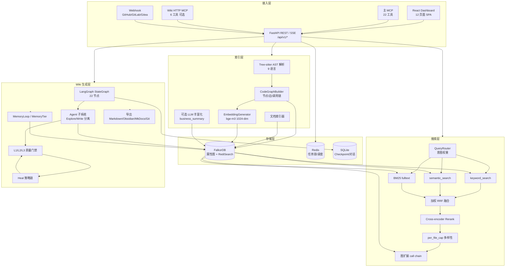
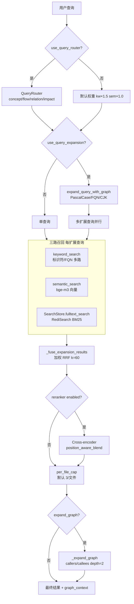
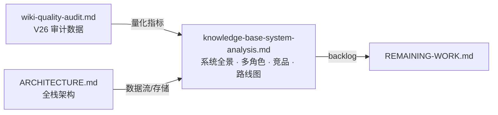

# Knowledge Base Service — 系统综合分析

**创建日期：** 2026-05-29  
**状态：** 活跃参考文档  
**关联文档：** [ARCHITECTURE.md](ARCHITECTURE.md) · [wiki-generation-architecture.md](wiki-generation-architecture.md) · [MCP-INTEGRATION.md](MCP-INTEGRATION.md) · [wiki-quality-audit.md](wiki-quality-audit.md) · [REMAINING-WORK.md](REMAINING-WORK.md)

---

## 1. 文档概要

### 1.1 目的

本文档从**产品、工程、竞品与演进**四个维度，对 Knowledge Base Service（以下简称 **KBS**）进行全景式分析。目标读者包括产品团队、前后端与客户端工程师、测试团队，以及评估本系统与 AI 代码智能竞品差异的技术决策者。

### 1.2 范围

| 在范围内 | 在范围外 |
|----------|----------|
| 索引、混合搜索、Wiki 生成、MCP、Dashboard 的能力与边界 | 具体业务仓库（如 ultron）的业务逻辑解读 |
| 多角色使用场景与价值映射 | 逐文件 API 参数手册（见 [ONBOARDING.md](ONBOARDING.md)） |
| 与 GitHub Copilot、Sourcegraph Cody 等竞品的差异化对比 | 第三方 LLM Provider 选型建议 |
| 已知弱点、优先级与季度路线图建议 | 已关闭的历史 PR 细节 |

### 1.3 系统定位（一句话）

KBS 是一套**自托管的代码与文档知识库平台**：将多语言仓库索引为 FalkorDB **属性图 + 向量空间**，提供 **三路 RRF 混合检索**与**图扩展**，并可选通过 **LangGraph Wiki 管道 + Agent 工具循环**生成带质量门禁的 Markdown 文档，经 **22+6 MCP 工具**与 **React Dashboard** 对外暴露。

### 1.4 当前成熟度快照（2026-06）

| 维度 | 状态 | 说明 |
|------|------|------|
| 代码索引 | ✅ 生产可用 | Tree-sitter 9 语言插件，图 + 向量双写 |
| 混合搜索 | ✅ 生产可用 | keyword + semantic + BM25 → RRF → rerank → graph expand |
| 搜索默认配置 | ✅ 已更新 | `reranker=True`，`enrichment_strategy=core_only` |
| Wiki 生成 | ⚠ 质量波动 | V26 审计：Topic 覆盖率 76.5%；Part N/stub/infra 止血项已实现（T0） |
| Agent 框架 | ✅ Phase 0-4 已完成 | GenericAgent + run_agent_loop + TokenBudget + Delegation |
| 记忆分层 | ⚠ 部分激活 | `access_count` 已接入；`confirmation` 反馈待前端完善 |
| 前端 Dashboard | ✅ 开发者向 | 12 lazy 页面，测试覆盖率已确认达标；WikiShell/GraphExplorer 已拆分；非开发者 UX 不足 |
| 部署 | ⚠ 门槛偏高 | 有 Dockerfile，缺官方 Docker Compose 一键栈 |
| 测试 | ✅ 强健 | 后端 5074+ 测试，前端 550 测试（136 文件） |
| CI/CD | ❌ 未建立 | 无 PR 级自动化测试流水线；Dockerfile 不含测试阶段 |

---

## 2. 系统能力全景

### 2.1 分层架构总览



### 2.2–2.6 各层能力摘要

| 层 | 核心模块 | 关键能力 | 边界/缺口 |
|----|----------|----------|-----------|
| **索引** | Tree-sitter、`CodeGraphBuilder`、`EmbeddingGenerator` | 9 语言 AST → 图 + bge-m3 向量；增量索引；延迟 enrichment | 不支持 PDF/Office/图片 ingest |
| **搜索** | `HybridQueryService`、`QueryRouter`、`search/fusion.py` | keyword + semantic + BM25 → RRF → rerank → graph expand | 见 §6 |
| **Wiki** | LangGraph 22 节点、DomainDocAgent、quality_gate/heal | 域分解、Explore/Write、L1/L2/L3 门、导出 | V26：Topic 覆盖 76.5%，Part N 66.7% |
| **前端** | React 19 Dashboard，12 lazy 页面 | 搜索/图谱/Wiki SSE/域管理/Settings | 开发者向；API 无运行时校验 |
| **MCP** | 主 22 工具 + 可选 Wiki HTTP 6 工具 | `rag_query`、Wiki 树/导出/问答；`X-Business-Id` 多租户 | 索引不暴露为 MCP 工具 |

#### Wiki LangGraph 主路径

```
detect_reorg → classify_entity_roles → graph_decompose → assign_canonical_keys
→ generate_titles → compose_leaf_modules → classify_architecture_layers
→ graph_domain_decompose → persist_classification → compose_domain_agents
→ summarize_leaves → compose_parent_pages → reassemble_domains
→ compose_flow_agents → merge_flow_pages → quality_gate ⇄ heal_pages
→ create_links → generate_tour → finalize
```

**MCP 工具（22+6）：** 核心含 `rag_query`、`rag_graph`、`search_architecture`、`get_complete_context`、`graph_path` 等；Wiki 含 `wiki_search`、`wiki_get_tree`、`wiki_export`（Editor+）等。详见 [MCP-INTEGRATION.md](MCP-INTEGRATION.md)。

---

## 3. 多角色视角分析

### 3.1 产品团队视角

**核心诉求：** 理解业务功能覆盖、域间关系、特性完整度，无需深入代码。

| 可用能力 | 使用路径 | 满足度 | 缺口 |
|----------|----------|--------|------|
| 业务域 Wiki 树 | Dashboard `/wiki` → business_domain 视图 | ⭐⭐⭐⭐ | 4 域仍无 Topic 页（V26）；壳域与错挂影响信任 |
| 业务流可视化 | Wiki 内 xyflow 流图、`GET /wiki/flows` | ⭐⭐⭐⭐ | 依赖 Wiki 生成质量；流模型三级仍较技术化 |
| 覆盖率报告 | `GET /api/v1/wiki/coverage-report` | ⭐⭐⭐⭐ | 指标偏代码/module 维度，缺产品功能矩阵视图 |
| 架构分层 | `/architecture` 页面 | ⭐⭐⭐ | presentation/domain 标签对 PM 仍不够「业务语言」 |
| 自然语言问答 | Wiki Ask（SSE） | ⭐⭐⭐ | 回答质量随 RAG 与 Wiki 新鲜度波动 |
| 建议探索问题 | `SuggestedQuestionsGenerator` | ⭐⭐⭐ | 已集成仪表盘，引导性尚可 |

**改进建议（产品向）：** 增加「功能清单 ↔ Wiki 页」映射视图；Overview 默认业务摘要；非开发者 Wiki 模式（隐藏 source:// 与代码块）。

### 3.1.1 功能缺口 P0 清单

| # | 缺口 | 影响角色 |
|---|------|----------|
| 1 | Wiki Topic 语义命名（66.7% Part N） | 全员导航 |
| 2 | Stub/壳域页（3 壳域 + 2 stub topic） | 产品信任 |
| 3 | Infra 模块错挂（2 处） | 架构理解 |
| 4 | 非开发者 Wiki 模式不存在 | 产品、QA |
| 5 | 官方 SDK / OpenAPI codegen | 前端、客户端 |

### 3.2 前端团队视角

**核心诉求：** 组件架构、API 契约、UI 模式、与后端的类型一致性。

| 可用能力 | 位置 | 满足度 | 缺口 |
|----------|------|--------|------|
| API 客户端 | `dashboard/src/api/client.ts` + `hooks.ts` | ⭐⭐⭐⭐ | 无运行时 schema 校验（F-04） |
| Wiki 组件体系 | `components/wiki/` ~70 文件 | ⭐⭐⭐⭐⭐ | WikiShell 已拆分至 387 行 |
| 服务端状态 | TanStack Query，分层 staleTime | ⭐⭐⭐⭐ | mutation 错误处理已统一 toast |
| 图谱可视化 | @xyflow/react + dagre | ⭐⭐⭐⭐ | GraphExplorer 已拆分至 335 行（useGraphExplorerState + graph/ 子面板） |
| OpenAPI | FastAPI 自动生成 | ⭐⭐⭐ | 前端未 codegen，手写类型易漂移 |
| SSE 流式 | Ask/Deep Search/Wiki 任务 | ⭐⭐⭐⭐ | 需代理关闭缓冲（见 DEPLOYMENT） |

**前端团队关注的关键 API：**

| API | 用途 |
|-----|------|
| `POST /api/v1/hybrid` | 代码实体搜索 |
| `GET /api/v1/wiki/tree` | Wiki 导航 |
| `GET /api/v1/wiki/pages/{uid}` | 页面正文 |
| `POST /api/v1/wiki/ask/stream` | 流式问答 |
| `GET /api/v1/graph/explore` | 图谱探索 |
| `GET/POST /api/v1/wiki/domains/*` | 域 CRUD、pin/unpin |

**改进建议：** 引入 openapi-typescript 或 zod 契约层；Wiki 页面增加「API 引用」侧栏（从 `SOURCE_ENTITY` 边自动聚合 REST 端点）。

**架构质量：4/5** — API 层、Query 缓存策略、Wiki 组件化成熟；暗色模式检测重复 3 处、SearchPage(642 行)/AskPanel(620 行) 仍偏大。WikiShell 已拆分至 387 行。

**测试覆盖：72.08%**（Lines，达标 ≥70%）；E2E 仅 1 条有效 smoke + 2 条 skipped placeholder。

### 3.3–3.5 后端 / 客户端 / 测试视角（摘要）

| 角色 | 核心诉求 | KBS 满足点 | 主要缺口 |
|------|----------|------------|----------|
| **后端** | 架构清晰、可测试、技术债可见 | AppContainer DI、PipelineConcurrency、5074 测试 | FalkorDBStore/MCPHandler 过大；kb_state 过渡层；8 处 json_object |
| **客户端** | SDK、API 发现、多租户 | Bearer + `X-Business-Id`；MCP 22 工具；SSE 流式 | 无官方 SDK；OpenAPI 未 codegen |
| **测试** | 覆盖与回归面 | pytest/Vitest/Playwright；镜像源码结构 | 无 Wiki 质量 benchmark CI；缺负载测试 |

**后端关键 API：** `POST /hybrid`、`GET /wiki/tree`、`POST /wiki/ask/stream`、`POST /index`（Editor）、`GET /graph/explore`。

**高险回归区：** Wiki 管道节点、RRF 融合权重、repo\|name 复合键、heal 循环、MCP schema。

### 3.6 测试深度分析

**整体评级：** 后端 A- / 前端 B+ / 集成与 CI **C** / 整体 B+

| 维度 | 数据 | 评价 |
|------|------|------|
| 后端测试 | 5074 用例，~770 文件，覆盖率 ≥75% | 镜像源码结构，mock 策略成熟 |
| 前端测试 | 550 用例，136 文件，覆盖率 72.08% | MSW 严格模式，a11y 专项 |
| E2E | 1 条有效 smoke | 形同占位 |
| CI/CD | **无 PR 级自动化测试流水线** | **最大短板** |
| Wiki 质量 CI | 无 golden repo 回归 | B-21 未实现 |
| 集成测试 | 命名含 integration 实为组件 smoke | 无真实 FalkorDB 联调 |

**关键测试缺口：** Wiki 生成质量回归 CI（P0）、CI 流水线（P0）、Testcontainers 集成（P1）、E2E 用户旅程（P1）、lifespan 启动测试（P1）。

---

## 4. 竞品对比分析

### 4.1 对比总表

| 维度 | **KBS（本系统）** | **GitHub Copilot** | **Sourcegraph Cody** | **Greptile** | **CodeRabbit** | **Devin (DeepWiki)** |
|------|-------------------|--------------------|-----------------------|--------------|----------------|----------------------|
| **定位** | 自托管代码知识库 + Wiki 平台 | IDE 内 AI 结对编程 | 企业代码搜索 + AI 助手 | 代码库感知 NL 查询 | AI Code Review | 自动化 Wiki / 自主 Agent |
| **部署** | 自托管（FalkorDB） | SaaS | 自托管/Cloud | SaaS | GitHub App | SaaS |
| **代码索引** | Tree-sitter 图 + 向量 | 闭源 | 语言服务器 + 索引 | 闭源 | PR diff 为主 | 闭源 |
| **搜索** | 3-way RRF + 图扩展 | 嵌入检索（闭源） | 混合搜索 | NL → 代码 | N/A | 有限 |
| **Wiki/文档** | LangGraph Agent 管道 | 无 | 有限代码解释 | 无 | PR 摘要 | **核心卖点** |
| **Agent 工具** | 22+6 MCP | Copilot Chat | Cody Agent | API | Review Agent | 自主执行 |
| **质量门禁** | L1/L2/L3 + heal | 无 | 无 | 无 | Review rules | 未知 |
| **多租户** | Business 实体 | Org 级 | 实例/Namespace | Team | Repo | 未知 |
| **IDE 集成** | MCP 间接 | **原生** | 插件 | API/Web | GitHub PR | Web |
| **价格** | 基础设施成本 | 订阅 | 企业定价 | 订阅 | 订阅 | 订阅 |

### 4.2 竞品定位简述

| 竞品 | 与 KBS 关系 | 一句话 |
|------|-------------|--------|
| **GitHub Copilot** | 互补 | Copilot 写代码；KBS 提供组织级图索引、Wiki 与 MCP 知识基础设施 |
| **Sourcegraph Cody** | 部分重叠 | Cody 搜索成熟度更高；KBS 强于 Agent Wiki 闭环与业务域分解 |
| **Greptile** | 部分重叠 | Greptile 开箱 NL 查询快；KBS 适合建设可审计、可导出的持久知识资产 |
| **CodeRabbit** | 互补 | CodeRabbit 审 PR；KBS 提供 Blast Radius 与全库上下文（`/pr-impact`） |
| **Devin (DeepWiki)** | 直接对比 | DeepWiki 零配置体验好；KBS 可私有化、管道可定制，但 Wiki 质量仍波动 |

### 4.3 Agent 工具深度对比（2026-05 更新）

基于对 8 个 Agent 框架的最新调研，补充更深层的技术对比：

| 能力 | KBS 现状 | Claude Agent SDK | OpenAI Agents SDK | Copilot Agent | Codex 2026 |
|------|---------|-----------------|-------------------|---------------|------------|
| 上下文压缩 | 硬重置 30 条 | 三层 compaction（micro/snip/LLM summary） | input_filter + nest_handoff_history | 混合检索 + agentic 多轮 | /responses/compact 服务端压缩 |
| 子代理 | 双轨分裂 | 隔离式 + fork 模式 | Handoff vs Agents-as-Tools | 单 Agent 多工具 | 并行 Agent + worktrees |
| 质量控制 | is_acceptable 强制通过 | Pre/Post Hooks | 三级 Guardrail + tripwire | get_errors 迭代 loop | 内置 Security 扫描 |
| 记忆 | Tier 0-3（未激活） | Memory Tool 自主存储 | Session compaction | 项目规则文件 | 跨会话持久 Memory |
| 模型路由 | 单一模型 | — | — | — | GPT-5.4/mini 分层 |

**KBS 领先领域：** 代码智能检索（图+向量+3-way RRF）超过 Copilot/Cody/Greptile 的单一向量 RAG。
**KBS 落后领域：** 上下文管理、委托编排、质量控制、记忆激活，落后主流 SDK 约 6-12 个月，但差距主要在「已有设计未接通」。

### 4.4 差异化优势总结

1. **深度图索引：** Tree-sitter → FalkorDB，非纯向量 RAG；支持 RPC/Kafka/DI 等业务边。
2. **可审计 Wiki 管道：** LangGraph 22 节点 + L1/L2/L3 质量门 + heal，非黑盒一次性生成。
3. **混合搜索可解释：** 三路 RRF 权重可配、QueryRouter 意图路由、per_file_cap 防单文件霸榜。
4. **MCP 一等公民：** 22+6 工具，Agent 宿主即插即用。
5. **多租户 Business 模型：** 跨仓 Wiki 聚合，适合大型组织多 repo 业务线。
6. **记忆与矛盾检测设计：** MemoryTier + ContradictionDetector + ConfidenceScorer（实现待完善）。
7. **增量与导出：** 三级增量、Obsidian/MkDocs/Git 发布，适配知识管理工具链。

---

## 5. 系统提升方向

按优先级组织；与 [REMAINING-WORK.md](REMAINING-WORK.md) 和 [wiki-quality-audit.md](wiki-quality-audit.md) 对齐。

### 5.1 P0：Wiki 质量与 Agent 输出稳定性

| 问题 | 现状 | 方向 |
|------|------|------|
| Part N 机械命名 | 66.7% Topic 使用 Part 1/2/3 | Topic 语义化 slug + LLM 标题生成门禁 |
| 壳域 bypass | tree_linker 在 finalize 后覆写 | persist 前强制 quality_gate |
| 错挂域 | 2 处 infra 模块错挂 | DomainAnchor 接入 + placement 规则扩展 |
| Agent 强制通过 | iteration=3 时 coverage<0.7 仍接受 | CRAG 门控 + QUALITY_WARNING 标记 |
| 无 Structured Output | compose/heal 等 8 处 json_object | 逐步迁移 json_schema strict |
| Stub Topic | 2 页 placeholder | finalize stub 检测 |
| 默认检索配置保守 | child_chunks=True 跳过 BM25；enrichment/reranker 默认关 | 启用三路融合 + 条件 reranker + core_only enrichment |

### 5.2 P1：非开发者角色支持

| 项 | 说明 |
|----|------|
| 产品视图模式 | Wiki 隐藏代码块/source://，突出业务流程与能力清单 |
| 功能覆盖率矩阵 | module → 产品功能映射，非纯 module 计数 |
| Executive Summary | 域 Overview 顶部固定业务摘要（部分已有 metadata） |
| 引导式 Tour | `generate_tour` 输出对接 PM 可读路径 |
| Dashboard 默认 landing | 业务空间 Wiki 而非 Indexing |

### 5.3 P1：非代码内容支持

| 项 | 说明 |
|----|------|
| B-19 Generic document ingest | PDF、docx/xlsx、HTML 入图 |
| B-20 Multi-modal | 图片、设计稿 OCR/描述入向量 |
| 文档-代码链接 | REFERENCES 边扩展至外部 doc |

### 5.4 P2：部署与运维

| 项 | 说明 |
|----|------|
| B-22 Docker Compose 一键栈 | FalkorDB + Redis + KBS + 健康探针 |
| 官方 Helm Chart | K8s 生产编排 |
| 可观测性 | Prometheus metrics、检索延迟分位、Wiki 任务 SLA |
| 嵌入模型预打包 | 减小冷启动下载 |

### 5.5 P2：安全加固

| 项 | 说明 |
|----|------|
| 生产门禁 | `KB_ENV=production` 强制 auth（已实现，需文档化） |
| Token 轮换 | tokens.yaml 热加载 |
| 速率限制 | 已有限流中间件；MCP 路径需独立配额 |
| 审计日志 | Wiki 编辑、索引、导出操作留痕 |
| SBOM / 依赖扫描 | CI 集成 |

### 5.6 P3：高级功能

| 项 | 说明 |
|----|------|
| 实时协作 | Wiki 多人编辑、OT/CRDT |
| 自然语言查询 UI | 面向 PM 的简化搜索（非 hybrid 表单） |
| 子 Agent 记忆继承 | Handoff 时 WorkingMemory 快照传递 |
| Token 预算全局协调 | ContextManager 与 TokenBudgetResolver 统一 |
| Wiki 质量 Benchmark | B-21 回归基线 |

---

## 6. 搜索系统深度分析

### 6.1 管道架构



### 6.2 关键参数

| 参数 | 默认值 | 作用 |
|------|--------|------|
| RRF k | 60 | 秩融合平滑常数 |
| keyword 权重 | 1.5（主查询） | 代码标识符查询偏好 |
| semantic 权重 | 1.0 | 自然语言语义 |
| BM25 权重 | 1.2 × semantic 路由权重 | 全文匹配 |
| Top-rank bonus | #1 +0.05, #2-3 +0.02 | 单榜第一名额外加分 |
| per_file_cap | 3 | 防止单文件刷屏 |
| expand_depth | 2 | 图扩展跳数 |
| fetch_k | `(limit+offset)×3` | 分支召回上限 |

**Wiki 搜索权重（`wiki/search.py`）：** graph **2.0**、vector **1.0**、FTS **1.5**——更偏结构导航而非纯语义。

### 6.3 QueryRouter 意图矩阵

| 问题类型 | keyword_weight | semantic_weight | expand_graph | entity_priority |
|----------|----------------|-----------------|--------------|-----------------|
| concept | 0.5 | 1.5 | ✅ | — |
| flow | 1.0 | 1.0 | ✅ | Function |
| relation | 1.5 | 1.0 | ✅ | — |
| impact | 1.5 | 0.8 | ✅ | — |
| general | 1.0 | 1.0 | ✅ | — |

代码样式查询（FQN、camelCase）会进一步调高 keyword 权重。

### 6.4 优势与改进机会

**优势：** 多路召回互补；图查询扩展（PascalCase/FQN/CJK）；per_file_cap 多样性；可选 Cross-encoder rerank；跨仓 `search_multi_repo`。

**改进机会：** LLM/ learned QueryRouter；搜索路径 query→result 缓存；Wiki 反馈驱动 LTR；大文件默认 child-chunk 模式；检索 trace 可观测性；文档 ingest 扩展 BM25 字段。

### 6.5 默认配置现状（2026-06 更新）

> 以下为源码 `core/config.py` + `tests/test_config_defaults.py` 确认的实际默认值。

| 配置项 | 默认值 | 说明 |
|--------|--------|------|
| `use_child_chunks` | `True` | 跳过 BM25 和查询扩展，实际为**二路融合**而非三路 |
| `enrichment_strategy` | **`core_only`** | 仅高价值实体生成 business_summary（`EnrichmentPriorityClassifier`） |
| `reranker.enabled` | **`True`** | Cross-encoder reranker 默认启用 |
| `reranker.nl_only` | **`True`** | 仅 NL 查询启用 rerank，代码式查询（FQN/camelCase）跳过 |
| `concept_extraction_enabled` | **`True`** | 已启用，但 `ConceptExtractor` 尚未接入索引管线（节点空） |
| `business_flow_enabled` | **`True`** | BusinessFlow 通过 `flow_compose` 节点生成 |
| `include_raw_docs_in_results` | `False` | Document 节点不进入 hybrid 召回 |
| `query_prefix` | **bge-m3 官方前缀** | `"Represent this sentence for searching relevant passages: "` |

**Schema 与实际嵌入不一致：** `VECTOR_INDEX_CONFIGS` 声明 9 类向量索引，但 `_generate_and_store_embeddings` 仅处理 Function/Class/Document/Chunk 四类。Module/BusinessConcept 索引空跑（BusinessFlow 通过 Wiki 管线生成）。

**待处理：** `ConceptExtractor` 虽 flag=True 但未接入 `incremental_indexer` 生产路径，BusinessConcept 节点仍不存在。

---

## 7. ROI 驱动的优先级路线图

> **方法论：** 按 ROI（Impact / Effort）分层排列。与 [REMAINING-WORK.md](REMAINING-WORK.md) 和 [wiki-quality-audit.md](wiki-quality-audit.md) 对齐。
>
> **更新日期：** 2026-06-01（基于 V26 审计 + Agent Phase 0-4 完成后全面评估）

### 7.1 T0 — 零成本收割：已实现未落地（ROI ∞）

已实现但未提交的功能，需立即提交落地：

| # | 功能 | 影响 | 状态 |
|---|------|------|------|
| 1 | 搜索 rerank 智能门控（should_rerank + nl_only） | NL 查询精排质量提升 | ✅ 已实现 |
| 2 | Wiki stub topic 检测拦截 | V26 P0-2 修复 | ✅ 已实现 |
| 3 | Part N 机械命名拒绝 | V26 P0-1 修复（66.7%→0%） | ✅ 已实现 |
| 4 | Infra 模块检测与重分配 | V26 P0-4 修复 | ✅ 已实现 |
| 5 | Shell 域 overview 过滤（prose/cn 门禁） | 壳域缩减 | ✅ 已实现 |
| 6 | Post-commit hook 增量索引 | 提交即索引 | ✅ 已实现 |
| 7 | Agent WorkingMemory 容量分级 | CORE 300k / STANDARD 200k / SKELETON 100k | ✅ 已实现 |

### 7.2 T1 — Wiki 质量止血残留（高影响，低工作量）

| # | 功能 | 影响 | 工作量 | ROI |
|---|------|------|--------|-----|
| 8 | 代码块截断修复（repair_unclosed_code_blocks 接入管线） | ≥6 页未闭合 fence → 文档可信度 | 1d | 极高 |
| 9 | 重复标题去重增强 | 2 组跨页重复标题 → 导航清晰度 | 0.5d | 高 |
| 10 | 4 域无 Topic（需重跑管线验证） | 覆盖率 76.5%→95%+ | 配置已调整 | 高 |

### 7.3 T2 — 搜索检索增强（中-高影响，低工作量）

| # | 功能 | 影响 | 工作量 | ROI |
|---|------|------|--------|-----|
| 11 | bge-m3 query prefix 启用 | NL 查询 MRR@10 预估 +10-15% | 0.5d | 极高 |
| 12 | 检索 trace 可观测性 | 搜索调优基础（query→recall→fusion→rerank 路径日志） | 2d | 中高 |
| 13 | 文档-配置对齐（enrichment/rerank/concept 默认值） | 防止部署踩坑 | 0.5d | 中 |

**注：** `enrichment_strategy` 已默认 `core_only`，`concept_extraction_enabled` / `business_flow_enabled` 已默认 `True`（文档需同步更新）。

### 7.4 T3 — Agent/管线稳定性（中影响，中工作量）

| # | 功能 | 影响 | 工作量 | ROI |
|---|------|------|--------|-----|
| 14 | Structured Output 剩余 8 处迁移（json_object→json_schema） | 输出格式稳定性 | 1w | 中 |
| 15 | Wiki 质量 Benchmark（B-21：golden repo 回归基线） | 质量回归防护 | 1-2w | 中 |
| 16 | 模型路由分层（explore=fast, compose/finalize=full） | LLM 成本 -30-50% | 3d | 中 |

### 7.5 T4 — 前端功能增强（中影响，中工作量）

| # | 功能 | 影响 | 工作量 | ROI |
|---|------|------|--------|-----|
| 17 | OpenAPI codegen（→TS 类型自动生成） | 前端类型漂移防护 | 2d | 中高 |
| 18 | E2E 核心用户旅程（search→result、graph、wiki ask） | 功能回归防护 | 2-3d | 中 |
| 19 | SearchPage(643行) / AskPanel(620行) 组件拆分 | 可维护性 | 2d | 中 |

### 7.6 T5 — 产品体验扩展（高影响，高工作量）

| # | 功能 | 影响 | 工作量 | ROI |
|---|------|------|--------|-----|
| 20 | Docker Compose 一键部署（B-22） | 新用户门槛降低 | 2d | 中高 |
| 21 | PM 视图模式（Wiki 隐藏代码块、突出业务流程） | 非开发者可用性 | 1w | 中 |
| 22 | NL 查询统一入口 | 非开发者搜索体验 | 1w | 中 |

### 7.7 T6 — 代码健康与平台化（长期投资）

| # | 功能 | 影响 | 工作量 | ROI |
|---|------|------|--------|-----|
| 23 | MCPHandler 拆分（1350行） | 可维护性 | 3d | 中低 |
| 24 | WikiPageAgent 拆分（1885行） | 可维护性 | 3-5d | 中低 |
| 25 | Generic document ingest（B-19: PDF/Office/HTML） | 知识源扩展 | 2-3w | 低 |
| 26 | ConceptExtractor 接入索引管线 | BusinessConcept 节点生成 | 3d | 低 |

### 7.8 建议执行节奏

```
Week 1:   T0(#1-7 提交) → T1(#8-9) → T2(#11)
Week 2-3: T2(#12-13) → T3(#14)
Week 4+:  T4(#17-18) → T5(#20-21) → T3(#15-16)
长期:     T6(#23-26)
```

---

## 8. Agent 架构改进完成状态

Agent 子系统的架构改进（Phase 0-4）已于 2026-06-01 全部完成。原 `agent-architecture-improvement.md` 设计文档已归档删除，实施记录见 [REMAINING-WORK.md](REMAINING-WORK.md) 已完成归档区。



### 8.1 已解决问题总表

| 弱点领域 | 修复状态 | 关键实施 |
|----------|---------|----------|
| Wiki 质量波动 | ✅ V26 P0 5/8 已修；Part N/stub/infra 已实现（T0 #2-5） | content_guards、finalize 门禁、tree_linker 过滤 |
| Agent 输出不稳定 | ✅ Phase 0 止血完成 | coverage ≥0.7 最低阈值 + `QUALITY_WARNING` 标记 |
| 上下文管理薄弱 | ✅ Phase 1 完成 | TokenBudgetManager 五级压缩 + ExploreCompactor |
| 记忆系统未激活 | ⚠ Phase 2-4 完成 | `access_count` 已接入；confirmation 待前端 |
| 子代理冷启动 | ✅ Phase 2 完成 | DelegationConfig / execute_delegation 统一委托 |
| Structured Output 不完整 | ⚠ 部分完成 | 3 处已迁移 json_schema；8 处降级 P2（T3 #14） |

### 8.2 建议阅读顺序

1. **决策者 / PM：** 本文 §1–§4、§7 路线图  
2. **Wiki 管道工程师：** 本文 §2.4 + [wiki-generation-architecture.md](wiki-generation-architecture.md)  
3. **Agent 框架工程师：** `wiki/agents/` 源码 + 本文 §5.1  
4. **搜索工程师：** 本文 §6 + [ARCHITECTURE.md](ARCHITECTURE.md) §检索管线  
5. **集成工程师：** 本文 §2.6 + [MCP-INTEGRATION.md](MCP-INTEGRATION.md)

### 8.3 同步维护约定

- 本报告 **季度更新**（能力快照、竞品、路线图）。  
- **wiki-quality-audit.md** 每次全量 Wiki 审计后更新指标；本报告 §2.4 引用最新 V 版本号。  
- 新 backlog 项统一进入 [REMAINING-WORK.md](REMAINING-WORK.md)，避免多份文档漂移。

---

---

*文档结束 — 技术栈见 [ARCHITECTURE.md](ARCHITECTURE.md)；入职与 API 见 [ONBOARDING.md](ONBOARDING.md)。指标或架构重大变更时同步更新 §1.4 与 §7。*
