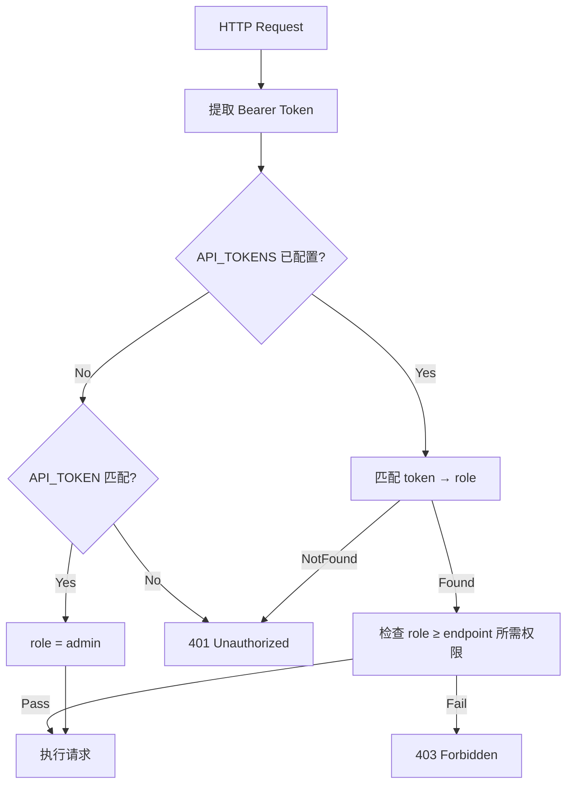

# 提案：知识库服务权限系统

**状态**: Implemented
**日期**: 2026-03-25

## 背景

当前系统仅通过单一 `API_TOKEN` 做全局认证，持有 token 的所有用户拥有相同权限。任何人都可以删除仓库、删除业务、触发索引等危险操作。需要引入角色权限控制。

## 目标

1. 保护危险操作（删除仓库、删除业务、全量索引）不被普通用户执行
2. 支持多角色（至少 Admin / Member / Viewer）
3. 最小化对现有架构的侵入
4. 向后兼容：不配置权限时行为不变

## 设计方案

### 角色定义

| 角色 | 权限说明 |
|------|----------|
| **admin** | 所有操作（创建/删除业务、删除仓库、全量索引、配置管理） |
| **editor** | 读 + 写（搜索、图查询、增量索引、索引文件） |
| **viewer** | 只读（搜索、图查询、查看统计、健康检查） |

### 端点权限映射

| 端点 | Method | 最低权限 |
|------|--------|----------|
| `/health` | GET | 无需认证 |
| `/search` | POST | viewer |
| `/graph` | POST | viewer |
| `/hybrid` | POST | viewer |
| `/stats` | GET | viewer |
| `/repositories` | GET | viewer |
| `/code/{uid}` | GET | viewer |
| `/mcp/tools` | GET | viewer |
| `/graph/explore` | POST | viewer |
| `/businesses` | GET | viewer |
| `/index` | POST | editor |
| `/index/files` | POST | editor |
| `/mcp/tool` | POST | editor |
| `/admin/backfill-fqn` | POST | admin |
| `/index/{repo}` | DELETE | admin |
| `/businesses` | POST | admin |
| `/businesses/{id}` | DELETE | admin |

### 认证机制：多 Token 方案

采用**配置驱动的多 Token** 方案，无需引入用户/密码/数据库：

```env
# .env 配置
API_TOKEN=legacy-token              # 向后兼容（admin 权限）
API_TOKENS=admin:sk-admin-xxx,editor:sk-editor-yyy,viewer:sk-viewer-zzz
```

**解析规则:**
- `API_TOKENS` 格式: `role:token,role:token,...`
- 如果 `API_TOKENS` 未配置，回退到 `API_TOKEN`（保持向后兼容）
- `API_TOKEN` 始终赋予 admin 权限

### 实现架构



### 文件变更清单

| 操作 | 文件 | 说明 |
|------|------|------|
| 修改 | `config.py` | 新增 `api_tokens: str` 配置字段 |
| 新建 | `auth.py` | Token 解析、角色定义、权限检查逻辑 |
| 修改 | `main.py` | 替换 `_verify_token` 为新的权限中间件，按端点声明所需角色 |
| 修改 | `dashboard/src/api/client.ts` | 无需修改（已使用 Bearer token） |
| 新建 | `dashboard/src/contexts/AuthContext.tsx` | 可选：解析 token 推断角色，用于前端 UI 隐藏/禁用按钮 |
| 修改 | 前端组件 | 根据角色条件隐藏删除按钮等 |

### 关键设计决策

1. **配置驱动 vs 数据库**: 选择配置驱动（.env），避免引入额外的用户管理复杂度
2. **前端感知**: 新增 `GET /api/v1/auth/me` 端点返回当前 token 的角色信息，前端据此隐藏 UI
3. **粒度**: 端点级权限（非资源级），避免过度设计
4. **健康检查免认证**: `/health` 端点用于监控探针，不应需要认证

### 测试计划

- [ ] admin token 可以执行所有操作
- [ ] editor token 可以搜索和索引，但不能删除
- [ ] viewer token 只能搜索和查看
- [ ] 无 token 被拒绝（401）
- [ ] 错误 token 被拒绝（401）
- [ ] editor 尝试删除操作返回 403
- [ ] 不配置 API_TOKENS 时向后兼容
- [ ] 前端根据角色隐藏删除按钮

---

**请确认此方案，我将进入实施阶段。**
