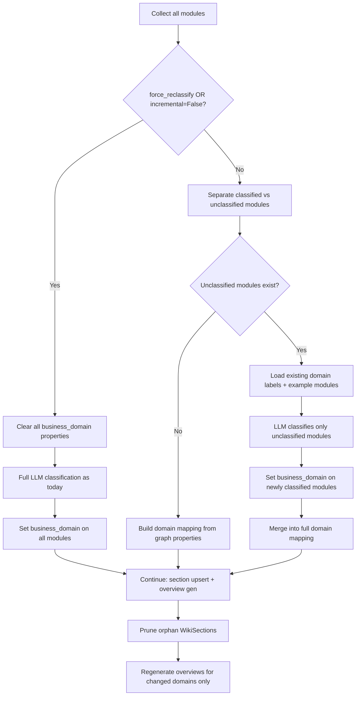

# Proposal: Incremental Domain Classification for New Repository Merging

**Date:** 2026-04-28
**Status:** AwaitingApproval

## Background

When a new repository (C) is added to a business that already has wiki generated for repositories (A, B), the current `generate_business_wiki(incremental=True)` flow:

- **Correctly** skips repo-level wiki generation for A/B (freshness check)
- **Incorrectly** re-runs full LLM domain classification on ALL modules (A+B+C)

This causes:
1. **Domain instability** — LLM may reassign A/B modules to different domains
2. **Orphan WikiSections** — renamed/dropped domains leave stale section nodes
3. **Unnecessary LLM cost** — classifying 4876+ modules every time (~5min)
4. **Domain overview churn** — all domain overviews are regenerated

## Goal

Enable reliable new-repo merging where:
- Existing repos' domain assignments are **stable** (never changed without explicit request)
- Only new/unclassified modules go through LLM domain classification
- Orphan WikiSections are cleaned up
- Domain overviews are only regenerated for affected domains

## Design

### Core Idea: Module-Level Domain Cache via Graph Properties

Instead of a separate cache node, persist domain assignments directly on `Module` nodes as a `business_domain` property. This is graph-native, queryable, and requires no separate cache management.

### Detection Logic

```
Classified module:   m.business_domain IS NOT NULL AND m.business_domain != ''
Unclassified module: m.business_domain IS NULL OR m.business_domain = ''
```

### Flow Changes in `generate_business_wiki`



### Component 1: `CrossRepoBusinessDomainPlanner.classify` Changes

**File:** `wiki/cross_repo_domain_planner.py`

Add `classify_incremental()` method:

```python
async def classify_incremental(
    self, business_id: str, all_modules: dict[str, list[GraphNode]],
    *, force_reclassify: bool = False,
) -> dict[str, list[tuple[str, str]]]:
    """Incremental domain classification using cached assignments on Module nodes."""

    if force_reclassify:
        await self._clear_domain_cache(all_modules)
        return await self.classify(business_id, all_modules)

    classified, unclassified = self._partition_modules(all_modules)

    if not unclassified:
        return self._build_mapping_from_classified(classified)

    existing_domains = self._extract_domain_context(classified)
    new_assignments = await self._classify_new_modules(
        business_id, unclassified, existing_domains,
    )

    await self._persist_domain_assignments(new_assignments)
    return self._merge_mappings(classified, new_assignments)
```

### Component 2: Incremental LLM Prompt

For classifying new modules against existing domains:

```
You are classifying Java modules into business domains.

## Existing Business Domains

{for each domain}
### {domain_name}
Example modules: {top 5 module names from this domain}
{end for}

## New Modules to Classify

{for each unclassified module}
- {repo_name}: {module_fqn}
{end for}

## Instructions
- Assign each module to the MOST appropriate existing domain
- STRONGLY prefer existing domains over creating new ones
- Only propose a NEW domain if a module clearly doesn't fit any existing domain
- Output format: JSON {"domain_name": [["repo_name", "module_fqn"], ...]}
```

### Component 3: Orphan WikiSection Pruning

**File:** `store/wiki_tree_store.py`

```python
async def prune_orphan_sections(
    self, business_id: str, active_domains: list[str],
) -> int:
    """Delete WikiSections not in the active domain list and having no WikiPage children."""
    q = (
        "MATCH (ws:WikiSpace {business_id: $bid})-[:HAS_CHILD]->(sec:WikiSection) "
        "WHERE NOT sec.domain_key IN $domains "
        "AND NOT EXISTS { MATCH (sec)-[:HAS_CHILD]->(:WikiPage) } "
        "DETACH DELETE sec "
        "RETURN count(sec) AS cnt"
    )
    result = await self._store.execute_query(q, {"bid": business_id, "domains": active_domains})
    return int(result.data[0].get("cnt", 0)) if result.data else 0
```

### Component 4: Domain Overview Caching

Only regenerate domain overviews for domains whose module set changed:

```python
# In generate_business_wiki, after classification:
changed_domains = set()
for domain, modules in domain_mapping.items():
    module_set = frozenset((r, m) for r, m in modules)
    if module_set != previous_module_sets.get(domain):
        changed_domains.add(domain)

# Only compose overviews for changed_domains
```

### Component 5: Config Additions

**File:** `config.py`

```python
# Incremental domain classification (reuses cached Module.business_domain)
domain_classification_cache_enabled: bool = True
```

### Component 6: `generate_business_wiki` Integration

**File:** `wiki/service.py`

```python
# Replace the current classify call:
if getattr(app_cfg, "domain_classification_cache_enabled", True) and incremental:
    domain_mapping = await planner.classify_incremental(
        business_id, all_modules,
        force_reclassify=not incremental,
    )
else:
    domain_mapping = await planner.classify(business_id, all_modules)
```

## API Changes

Add `force_reclassify` parameter to `BusinessWikiGenerateBody`:

```python
class BusinessWikiGenerateBody(BaseModel):
    ...
    force_reclassify: bool = False
```

Pass through to `generate_business_wiki` and then to planner.

## Edge Cases

| Case | Behavior |
|------|----------|
| First run (no cached domains) | All modules unclassified → full LLM classification |
| New repo added | Only new repo's modules classified against existing domains |
| Module deleted from repo | Property goes away with node; domain may lose members |
| force_reclassify=True | Clear all caches, full classification |
| incremental=False | Same as force_reclassify |
| LLM creates unnecessary new domain | Prompt design minimizes this; force_reclassify can fix |

## Performance Impact

| Scenario | Current | After |
|----------|---------|-------|
| Full regen (4876 modules) | ~5min LLM | ~5min LLM (same) |
| Add new repo (~500 modules) | ~5min LLM | ~30s LLM |
| No changes (incremental) | ~5min LLM | 0s (no LLM call) |

## Component 7: Granular Task Progress Reporting

### Problem

Current task status API only reports:
- `phase`: "classifying_domains" / "generating_pages"
- `completed_repos` / `total_repos`
- `current_repo`

This is a black box — during the `generating_pages` phase (which takes 90%+ of time), there's no visibility into page-level progress.

### Solution: Multi-Level Progress

Add sub-phase progress that is updated at every stage of the pipeline:

```python
# Extended progress info passed to task store
{
    "phase": "generating_pages",
    "completed_repos": 0,
    "total_repos": 2,
    "current_repo": "ultron/user-moa",
    "repo_progress": {
        "subphase": "leaf_compose",     # leaf_compose | parent_aggregate | navigation | enrichment | persist
        "pages_composed": 350,
        "total_pages": 4158,
        "pages_pct": 8,
        "elapsed_s": 120,
        "estimated_remaining_s": 1380,
    }
}
```

### Implementation

**File:** `wiki/service.py` — `generate()` method

Pass `progress_callback` from `generate_business_wiki` down to `generate()`, then into `_compose_all_pages`:

```python
# In _compose_all_pages, after each leaf_result batch:
_composed_count = 0

async def compose_leaf(node):
    nonlocal _composed_count
    # ... existing compose logic ...
    _composed_count += 1
    if progress_callback and _composed_count % 50 == 0:
        await progress_callback({
            "subphase": "leaf_compose",
            "pages_composed": _composed_count,
            "total_pages": _total_nodes,
        })
    return page
```

**File:** `api/routes/wiki_task_routes.py` — `_progress` handler

Merge `repo_progress` into task metadata:

```python
async def _progress(info):
    extra = {
        "completed_repos": str(cr),
        "total_repos": str(tr),
        "current_repo": str(info.get("current_repo", "")),
        "progress_pct": str(pct),
    }
    # Merge sub-phase progress
    repo_progress = info.get("repo_progress")
    if repo_progress:
        extra["subphase"] = repo_progress.get("subphase", "")
        extra["pages_composed"] = str(repo_progress.get("pages_composed", 0))
        extra["total_pages"] = str(repo_progress.get("total_pages", 0))
    await task_store.update_status(task_id, "running", **extra)
```

### API Response Enhancement

Task status API response becomes:

```json
{
    "task_id": "biz-wiki-xxx",
    "status": "running",
    "business_id": "default",
    "phase": "generating_pages",
    "completed_repos": "0",
    "total_repos": "2",
    "current_repo": "ultron/user-moa",
    "subphase": "leaf_compose",
    "pages_composed": "350",
    "total_pages": "4158",
    "progress_pct": "4"
}
```

## Testing Plan

1. Unit test: `classify_incremental()` with pre-cached modules
2. Unit test: Orphan section pruning
3. Unit test: Progress callback receives sub-phase data
4. Integration test: Add new repo to existing business wiki
5. Integration test: force_reclassify resets everything
6. Integration test: Task status API shows page-level progress

## Files Modified

| File | Change |
|------|--------|
| `wiki/cross_repo_domain_planner.py` | Add `classify_incremental()` + helper methods |
| `wiki/service.py` | Use incremental classification; thread progress_callback through generate→compose |
| `store/wiki_tree_store.py` | Add `prune_orphan_sections()` |
| `config.py` | Add `domain_classification_cache_enabled` |
| `api/models/wiki_models.py` | Add `force_reclassify` to body |
| `api/routes/wiki_task_routes.py` | Pass `force_reclassify`; merge sub-phase progress |
