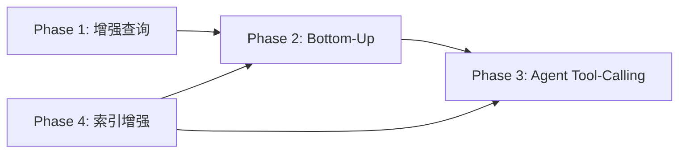

# 提案: Wiki生成流水线上下文增强策略

**日期**: 2026-05-07  
**状态**: Phase 1-3A Implemented  
**背景**: 当前wiki生成流水线在上下文不足时无法自主补充，导致生成内容缺少外部接口逻辑和跨服务调用关系。

---

## 1. 问题分析

### 1.1 当前架构

```
classify_entities → classify_domains → decompose_hierarchy → plan_topics → compose_pages
                                                                              ↑
                                                              ContentContextBuilder (一次性查询)
```

**已有的上下文机制 (`ContentContextBuilder`)**:
- 查询模块的 methods (方法签名)
- 查询 call_chains (调用链, depth=2)
- 查询 key_snippets (代码片段, 依赖 SourceCodeReader)
- 查询 enums_and_constants
- 计算跨域依赖关系
- 获取已有wiki上下文

### 1.2 瓶颈

| 问题 | 根因 |
|------|------|
| 一次性查询，无迭代能力 | LLM 无法在生成中发现上下文不足并请求补充 |
| 跨服务调用关系缺失 | 图谱中 cross-repo CALLS 边 = 0，索引阶段未检测 Feign/MOA 引用 |
| 无源码原文访问 | key_snippets 依赖 SourceCodeReader 是否有存储数据 |
| 固定查询模式 | 预定义查询(methods, calls, enums)不能根据业务场景自适应 |

---

## 2. 业界方案对比

### 2.1 DeepWiki: Agent + Tool Calling

- **三阶段方法论**: GATHER → THINK → WRITE
- GATHER 阶段 LLM 使用 `GitTool.ListFiles()` + `GitTool.ReadFile()` 主动搜索和读取代码
- Token 预算管理: `READ_MAX_TOKENS` (默认10万token，模型容量的70%)
- **核心优势**: LLM自主决定需要查询什么，能处理"发现上下文不足"的情况
- **劣势**: LLM调用次数增加2-5x，延迟增加

### 2.2 CodeWiki: 分层递归 + 自底向上合成

- 基于 AST + 依赖图将代码库分解为层次化模块
- 递归多Agent处理：叶子模块由专用Agent处理，复杂度自适应
- **自底向上合成**: 先生成叶子文档，再逐层合成父级文档
- 质量分数 68.79%，优于 DeepWiki 的 64.06%
- **核心优势**: 每层上下文窗口小、细节保留完整、增量更新友好

---

## 3. 推荐实施路线

### Phase 1: 增强现有 ContentContextBuilder (短期, 1-2天)

**目标**: 在现有架构内最大化上下文质量

**改动点**:
1. 在 `ContentContextBuilder.build_context()` 中增加查询:
   - 接口对应的实现类 (`IMPLEMENTS` 边)
   - 实现类对应的接口定义
   - RPC入口(MoaService)对应的ServiceImpl
2. 在 prompt 中要求 LLM 标记"上下文不足处"
3. 收集统计数据，为后续方案提供依据

### Phase 2: Bottom-Up Synthesis (中期, 3-5天)

**目标**: 实现自底向上合成，确保细节不丢失

**新增 LangGraph 节点**: `compose_leaf_modules_node`

```
classify_entities → classify_domains → compose_leaf_modules → plan_topics → compose_from_topics
                                              ↑                                      ↑
                                    DataCollector + SourceCodeReader     leaf_summaries 作为输入
```

**实现要点**:
1. 新增节点在 `classify_domains` 之后，为每个入口点+Service实现生成 leaf 文档
2. 复用现有 `DataCollector` 获取模块上下文 (methods, edges, children, code_snippets)
3. LLM 生成 leaf summary (2000 tokens/模块): 职责、接口、依赖、关键流程
4. leaf_summaries 注入到 `EnrichedDomainContext.leaf_summaries` 字段
5. 域概览从 leaf summaries 合成，而非从原始 module 属性生成

**新增数据结构**:
```python
@dataclass
class EnrichedDomainContext:
    # ... 已有字段 ...
    leaf_summaries: dict[str, str] = field(default_factory=dict)  # 新增
```

**并发控制**: 复用 `_COMPOSE_CONCURRENCY` (默认5)
**预估耗时**: 136模块 / 5并发 * 20s = ~9分钟

### Phase 3: Agent Tool-Calling (长期, 1-2周)

**目标**: LLM 自主决定查询什么，多轮迭代直到上下文充足

**新增文件**: `wiki/page_agent.py`

**Tool 定义**:
| Tool | 功能 | 返回 |
|------|------|------|
| `query_module_detail(name)` | 模块详情 | methods, annotations, business_summary |
| `query_callers(name)` | 谁调用了此模块 | caller列表 + 方法签名 |
| `query_callees(name)` | 此模块调用了谁 | callee列表 + 方法签名 |
| `query_implementations(interface)` | 接口的实现类 | 实现类列表 + 仓库 |
| `read_source_snippet(name, max_lines)` | 读取源码 | 代码文本 |
| `search_modules(keyword)` | 按关键词搜索 | 匹配模块列表 |

**Agent循环**:
```python
class WikiPageAgent:
    MAX_ROUNDS = 5
    
    async def generate_page(self, initial_context):
        messages = [system_msg, initial_user_msg(initial_context)]
        for _ in range(self.MAX_ROUNDS):
            response = await llm.generate_with_tools(messages, tools)
            if not response.tool_calls:
                return parse_wiki_content(response)
            tool_results = await execute_tools(response.tool_calls)
            messages.extend([assistant_msg(response), tool_msg(tool_results)])
        # Fallback: 强制生成
        messages.append(user_msg("Please write the final wiki page now."))
        return await llm.generate(messages)
```

**Token预算**: 每轮查询结果累积不超过模型容量的60%

### Phase 4: 跨服务依赖检测 (索引增强)

**目标**: 让图谱中包含跨仓库调用关系

**改动范围**: `code_indexer` 模块 (不在wiki流水线内)

**检测策略**:
1. 扫描 `@Resource`/`@Autowired` 注入的服务引用
2. 如果引用的服务名匹配另一仓库的接口定义 → 创建 `CALLS` 边
3. 扫描 MOA 客户端引用 (如 `UltronUserWrapperMoaService` → `ultron-basic-user`)

---

## 4. 优先级与依赖



Phase 4 (索引增强) 是 Phase 2/3 的数据质量前提，但非阻塞依赖。

---

## 5. 风险与缓解

| 风险 | 缓解措施 |
|------|----------|
| LLM成本增加 | Phase 2: 并发减小延迟; Phase 3: MAX_ROUNDS=5 限制 |
| 生成时间过长 | 并发度可调; leaf docs 可缓存/增量更新 |
| Agent循环不收敛 | 设置 MAX_ROUNDS + fallback 机制 |
| Tool结果质量差(图谱数据不足) | Phase 1 先评估数据质量; Phase 4 补充索引 |

---

## 6. 实施记录

### Phase 1 实施结果 (2026-05-07)

**已完成改动:**

1. **ContentContextBuilder 增强** (`wiki/content_context_builder.py`):
   - 新增 `_IMPLEMENTS_CY` / `_CALLERS_CY` Cypher 查询
   - 新增 `_query_implementations()` 和 `_query_callers()` 方法
   - `EnrichedDomainContext` 新增 `interface_impls` 和 `external_callers` 字段
   - 6 个查询全部并行执行

2. **Prompt 模板增强** (`wiki/unified_prompt_templates.py`):
   - 新增 `build_interface_impls_section()` 和 `build_external_callers_section()`
   - `build_topic_detail_prompt()` 新增接口实现关系和外部调用者参考数据段
   - CONTEXT_GAP 标记指令添加到核心约束

3. **Quality Gate 增强** (`wiki/quality_evaluator.py` + `wiki/pipeline_graph.py`):
   - `structural_check()` 检测 `<!-- CONTEXT_GAP -->` 标记
   - quality_gate_done 日志增加 `context_gaps_total` 统计

### Phase 2 设计讨论结论 (2026-05-07)

**核心方案: CodeWiki 式 Bottom-Up Synthesis**

- 每层只看下一层的摘要，上下文窗口天然小
- 两轮 leaf 生成: Round 1 并行独立生成 → Round 2 对有 CONTEXT_GAP 的 leaf 注入依赖模块摘要重生成
- 增量更新与定向编辑留给 Phase 3 Agent 方案
- 入口点识别: 已有 LLM 智能识别 (EntityRoleClassifier) + 规则识别双路径互补

### Phase 2.5 实施结果: 方法级调用链 + Cypher 解耦 (2026-05-07)

**P1: Cypher 查询解耦**

1. **新增 `wiki/cypher_queries.py`**: 集中管理所有共享 Cypher 查询常量（`METHODS_CY`, `SNIPPETS_CY`, `IMPLEMENTS_CY`, `CALLERS_CY`, `FUNCTION_CALLS_CY` 等）
2. **`content_context_builder.py`**: 改为从 `cypher_queries` 导入，删除原有内联定义
3. **`pipeline_nodes.py`**: 改为从 `cypher_queries` 导入，消除对 `content_context_builder` 私有常量的耦合

**P0: 方法级调用链构建器**

1. **新增 `wiki/call_chain_builder.py`**: 实现 `CallChainBuilder`，使用单次批量 Cypher 查询 (`FUNCTION_CALLS_CY`) + Python BFS 构建方法级端到端调用链
2. **BFS 算法要点**: 复合 key (`module.func`) 防止同名方法混淆，`visited` 集合防环，`max_depth` 深度限制
3. **集成到上下文**: `EnrichedDomainContext` 新增 `method_call_chains` 字段，`build_topic_detail_prompt` 新增方法级调用链参考数据段

### Phase 3A 实施结果: Agent Tool-Calling 框架 (2026-05-07)

**LLM Provider 扩展**

1. **`llm/provider.py`**: `LLMProvider` 新增 `complete_with_tools()` 方法支持原生 OpenAI Tool-Calling API
2. **`llm/base_provider.py`**: `BaseLLMProvider` Protocol、`GatewayLLMProviderAdapter`、`LLMPortBridge` 均新增对应方法
3. **`wiki/llm_port.py`**: `LLMPort` Protocol 新增 `complete_with_tools()` 签名

**Agent 框架**

1. **新增 `wiki/page_agent.py`**: 实现 `WikiPageAgent` + `WorkingMemory`
2. **6 个 Tool**: `query_module_detail`, `query_callers`, `query_callees`, `query_implementations`, `query_call_chain`, `read_source_snippet`
3. **Working Memory 模式**: 每轮 tool 结果通过规则化提炼写入 `WorkingMemory`（而非堆积原始消息），总量控制在 6000 字符内，确保上下文不线性膨胀
4. **Fallback**: MAX_ROUNDS=5 后调用 `generate()` 兜底，所有 tool 失败时返回原始页面内容
5. **集成**: 在 `_compose_single_leaf_domain` 中，页面生成后、sanitize 之前，检测 CONTEXT_GAP 标记并触发 Agent enrichment
