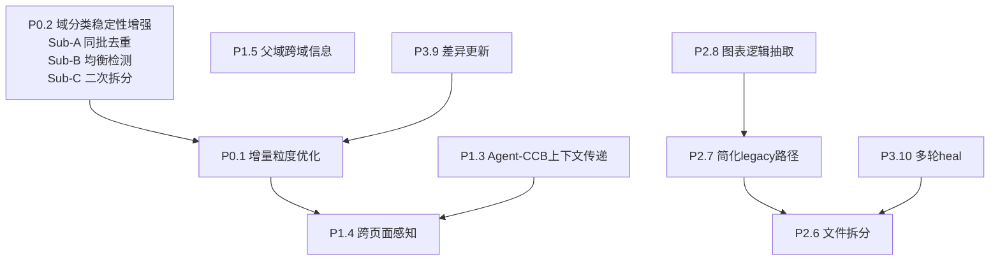
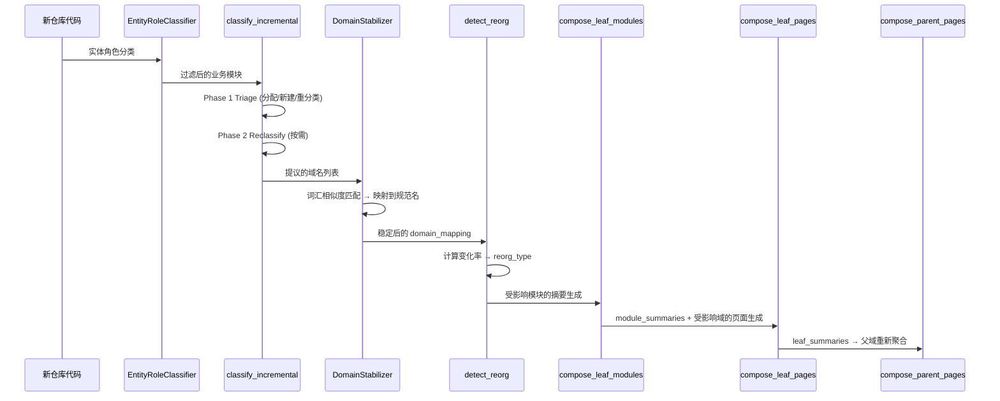

# Proposal: Wiki Pipeline 架构优化

**日期**: 2026-05-08
**状态**: Draft
**关联文档**:
- `PROPOSAL_20260507_193240_context_augmentation_strategy.md`
- `SPEC_20260507_224402_agent_tools_enhancement.md`
- `PLAN_20260507_call_chain_and_agent.md`

---

## 1. 背景

当前 Wiki 生成 Pipeline 已实现「自底向上递归聚合」架构：

```
Phase 1: classify_entities_node (确定性规则)
Phase 2a: classify_domains_node (LLM 域分类)
Phase 2b: decompose_hierarchy_node (层次化分解)
Phase 3-bottom: compose_leaf_modules_node (模块级摘要, Round 1+2)
Phase 3-leaf: compose_leaf_pages_node (叶子域页面)
Phase 3-parent: compose_parent_pages_node (父域聚合)
Phase 4: synthesize_overviews_node (系统概览)
```

经全面审计，发现以下架构问题和优化机会。

---

## 2. 问题清单与优化建议

### 2.1 [P0] 增量生成粒度不足

**现状**:
- `compose_leaf_pages_node` 遍历所有 leaf domains 生成页面，不区分是否受增量变更影响
- `detect_reorg_node` 产生 `reorg_type` 和 `affected_domains`，但 compose 层未消费这些信号
- 增量场景下重新生成所有域的页面 → 大量无效 LLM 调用

**影响**: 10 个域中只变化了 2 个时，仍会执行全部 10 个域的页面生成，浪费 ~80% 的 LLM 调用和时间。

**设计方案 (Approved 2026-05-08)**:

核心原则：「谁产生变化，谁报告变化」

**Step 1: classify_incremental 返回受影响域列表**

```python
# CrossRepoBusinessDomainPlanner.classify_incremental() 返回值变更
async def classify_incremental(
    self, business_id: str, all_modules: dict[str, list[GraphNode]]
) -> tuple[dict[str, list[tuple[str, str]]], set[str]]:
    """Returns (domain_mapping, affected_domain_names)."""
    # ... existing triage logic ...
    affected = set()
    for pair, domain in triage.assignments.items():
        affected.add(domain)
    affected.update(triage.new_domains.keys())
    affected.update(triage.reclassify_domains)
    return existing, affected
```

**Step 2: classify_domains_node 写入 state**

```python
# classify_domains_node 中
if is_incremental:
    domain_mapping, affected_domains = await planner.classify_incremental(business_id, biz_modules)
else:
    domain_mapping = await planner.classify(business_id, biz_modules)
    affected_domains = set(domain_mapping.keys())  # 全量时所有域都 affected

return {"domain_mapping": domain_mapping, "affected_domains": list(affected_domains)}
```

**Step 3: compose_leaf_pages_node 增加过滤逻辑**

```python
# compose_leaf_pages_node 中
reorg_type = state.get("reorg_type", "full")
affected_domains = set(state.get("affected_domains", []))

if reorg_type == "light" and affected_domains:
    leaf_domains = [d for d in leaf_domains if d["name"] in affected_domains]
elif reorg_type == "none":
    return {"pages": [], "generated_topic_pages": []}
# full / first_run / heavy: 处理所有 leaf_domains (不过滤)
```

**Step 4: compose_parent_pages_node 判断子域变化**

```python
# 仅当某个 parent 的 children 中有 affected_domain 时才重新生成该 parent
if affected_domains:
    parent_affected = any(cn in affected_domains for cn in child_names)
    if not parent_affected:
        continue  # 跳过未受影响的 parent
```

**职责分工**:
- `classify_domains_node`: 产生变化，报告 affected_domains
- `detect_reorg_node`: 根据变化规模决定 reorg_type (保持不变)
- `compose_*_node`: 根据 reorg_type + affected_domains 决定生成范围

---

### 2.2 [P0] 域分类稳定性增强

**现状问题**:
1. `DomainStabilizer` 只对比「新提议 vs 已存在于图谱的域名」，不对比「新提议 vs 新提议」
2. `HierarchicalDecomposer` 一次性由 LLM 生成树结构，对超大叶子域没有显式检测和二次拆分
3. 大批量模块分批处理时，各批次结果简单拼接，无跨批次去重

**影响**:
- 多仓库首次全量分类可能产生 "订单处理" 和 "订单管理" 两个实际应合并的域
- 单个叶子域可能包含 30+ 模块，导致内容生成质量下降
- 增量加入新仓库后域膨胀，无触发重新拆分的机制

**设计方案 (Approved 2026-05-08)**:

#### Sub-A: 同批去重 — 修改 `stabilize_sync()`

在 `DomainStabilizer.stabilize_sync()` 内部增加 Phase 2「同批互比」逻辑：

```python
def stabilize_sync(self, proposed_domains: list[str], existing_domains: list[str]) -> dict[str, str]:
    # ... existing index building (unchanged) ...
    
    result: dict[str, str] = {}
    batch_canonical: list[str] = []  # 新增：同批已确认的 canonical 列表
    
    for proposed in proposed_domains:
        # Phase 1: 与 existing 匹配 (现有逻辑不变)
        best_existing = self._find_best_in_existing(proposed, index, existing_domains)
        if best_existing[0] >= self._threshold:
            result[proposed] = best_existing[1]
            continue
        
        # Phase 2: 与同批 canonical 匹配 (新增)
        best_batch = (-1.0, proposed)
        for canonical in batch_canonical:
            sim = self.compute_similarity(proposed, canonical)
            if sim > best_batch[0]:
                best_batch = (sim, canonical)
        
        if best_batch[0] >= self._threshold:
            result[proposed] = best_batch[1]
        else:
            result[proposed] = proposed
            batch_canonical.append(proposed)
    
    return result
```

**Canonical 选择策略**: 第一个出现的作为 canonical（输入顺序反映优先级 tier1 > tier2 > tier3）。

#### Sub-B: 域大小均衡性检测

在 `decompose_hierarchy_node` 返回前增加后处理检测：

```python
MAX_LEAF_MODULES = 15  # 叶子域模块数阈值

def _detect_oversized_leaves(domain_tree: list[dict]) -> list[dict]:
    """返回 modules 数超过阈值的叶子域。"""
    oversized = []
    for leaf in _collect_leaf_domains(domain_tree):
        modules = leaf.get("modules", [])
        if len(modules) > MAX_LEAF_MODULES:
            oversized.append(leaf)
    return oversized
```

#### Sub-C: 超大叶子域二次分解

对检测到的超大叶子域，使用 `HierarchicalDecomposer(max_depth=1)` 做一次子域拆分：

```python
# decompose_hierarchy_node 内部后处理
oversized = _detect_oversized_leaves(domain_tree)
if oversized and llm:
    rebalance_decomposer = HierarchicalDecomposer(llm, max_depth=1, min_modules_for_nesting=3)
    for leaf in oversized:
        leaf_modules = [m for m in all_module_infos if m.name in set(leaf["modules"])]
        if not leaf_modules:
            continue
        module_graph = ModuleGraph(modules=leaf_modules, edges=[], entry_points=[])
        try:
            sub_tree = await rebalance_decomposer.decompose(leaf_modules, module_graph)
            if sub_tree and len(sub_tree) > 1:
                leaf["children"] = _normalize_domain_tree(sub_tree)
                leaf["modules"] = []  # 模块下移到子域
                log.info("leaf_rebalanced", domain=leaf.get("name"), sub_domains=len(sub_tree))
        except Exception:
            log.warning("leaf_rebalance_failed", domain=leaf.get("name"), exc_info=True)
```

**防护条件**:
- Sub-C 只执行一次（不递归），避免无限拆分
- 拆分失败时保持原始结构不变（log warning 继续）
- 拆分结果 `len(sub_tree) <= 1` 时视为无法拆分，保持原样

**修改文件**:
| 文件 | 变更 | 子能力 |
|------|------|--------|
| `wiki/domain_stabilizer.py` | 修改 `stabilize_sync()` 增加 Phase 2 | Sub-A |
| `wiki/pipeline_nodes.py` | 修改 `decompose_hierarchy_node` 增加后处理 | Sub-B + Sub-C |
| `tests/wiki/test_domain_stabilizer.py` | 新增同批去重测试 | Sub-A |
| `tests/wiki/test_pipeline_graph.py` 或新文件 | 新增叶子域拆分测试 | Sub-B + Sub-C |

---

### 2.3 [P1] WikiPageAgent 与 CCB 信息重复查询

**现状**:
- `ContentContextBuilder` 在 compose 阶段已查询图谱获取完整上下文（方法签名、调用链、实现关系、外部调用者）
- `WikiPageAgent` 在 CONTEXT_GAP 补充阶段再次通过 tool-calling 查询相同图谱
- Agent 不知道 CCB 已提供了哪些信息，可能重复查询

**影响**: 浪费 Agent 的 tool-calling 轮次（每轮消耗 LLM 输入 token），且可能获取相同结果。

**设计方案 (Approved 2026-05-08)**:

1. `EnrichedDomainContext` 新增 `format_summary_for_agent()` 方法：
   - 将已查询到的 biz_entities 方法签名、intra/cross_domain_calls、interface_impls、external_callers 压缩为 ~2000 字符的结构化摘要
   - 格式为 Agent 可理解的自然语言 + 列表

2. `WikiPageAgent.enrich()` 新增 `known_context: str` 参数：
   - 将 known_context 注入到 Agent 的 system prompt 中
   - Agent 的 system prompt 增加指令："以下信息已经被查询过，不要重复查询"

3. `_compose_single_leaf_domain` 中传递：
```python
if gap_count > 0:
    ccb_summary = context.format_summary_for_agent()
    agent = WikiPageAgent(llm, graph_store)
    enriched = await agent.enrich(
        raw, domain_name=domain_name, known_context=ccb_summary,
    )
```

**修改文件**:
- `wiki/content_context_builder.py` — 新增 `format_summary_for_agent()`
- `wiki/page_agent.py` — enrich() 增加 known_context 参数
- `wiki/pipeline_nodes.py` — 传递 known_context

---

### 2.4 [P1] 跨页面感知缺失 (read_wiki_page 未实现)

**现状**:
- SPEC 中定义了 `read_wiki_page` 工具（P1 优先级），但尚未实现
- 各页面生成时不知道其他页面写了什么，可能产生内容重复或矛盾

**影响**: 同域的多个 topic 页面可能对相同流程做不同描述。

**设计方案 (Approved 2026-05-08)**:

按 SPEC_20260507_224402 中定义的方案实现，核心要点：

1. **数据来源优先级**:
   - 优先从当前 Pipeline 生成的 `existing_pages` 列表搜索（内存中）
   - 未找到则 fallback 到图谱 WikiPage 节点查询

2. **传递机制**:
   - `_compose_single_leaf_domain` 在生成完一个域的页面后，将其加入 `existing_pages` 列表
   - 同域的后续 topic 页面生成时传入这个列表
   - `WikiPageAgent.enrich()` 接收 `existing_pages` 参数

3. **实现 read_wiki_page 工具**:
   - 按标题/路径关键字搜索
   - 返回页面标题 + 内容摘要（截断到 SINGLE_RESULT_LIMIT=4000）

**修改文件**:
- `wiki/page_agent.py` — 实现 read_wiki_page 工具 + enrich 接收 existing_pages
- `wiki/pipeline_nodes.py` — 传递 existing_pages

---

### 2.5 [P1] 父域聚合缺少跨域调用信息

**现状**:
- `compose_parent_pages_node` 仅使用子域的 `executive_summary`（150-300 字）+ `snippet_text`
- 不包含 `cross_domain_calls` 信息（这些信息在 `EnrichedDomainContext` 中存在）

**影响**: 父域概览无法准确描述子域之间的数据流和调用关系。

**设计方案 (Approved 2026-05-08)**:

1. **`compose_leaf_pages_node` 输出跨域调用元数据**:
   - 在 compose 阶段，`ContentContextBuilder` 已查询 cross_domain_calls
   - 将每个域的 cross_domain_calls 摘要存入 page_dict metadata：
   ```python
   page_dict["metadata"]["cross_domain_calls"] = [
       {"from": caller_module, "to": callee_module, "to_domain": target_domain}
       for step in context.cross_domain_calls[:10]
   ]
   ```

2. **`compose_parent_pages_node` 构建子域间关系**:
   - 从已生成的子域页面中提取 cross_domain_calls metadata
   - 聚合为子域间调用关系图
   - 将其作为 prompt 的一部分供 LLM 生成域间关系描述

3. **Prompt 增强**:
   ```
   ## Sub-domain Interactions
   - 订单处理 → 支付网关: processPayment, validateAmount
   - 支付网关 → 通知服务: sendReceipt, notifyUser
   ```

**修改文件**:
- `wiki/pipeline_nodes.py` — compose_parent_pages_node 增加跨域调用信息
- `wiki/pipeline_nodes.py` — _compose_single_leaf_domain 写入 metadata

---

### 2.6 [P2] pipeline_nodes.py 过大 (2034 行)

**现状**:
- 单文件包含所有 pipeline nodes + 大量辅助函数
- `_compose_single_leaf_domain` 单函数 ~270 行
- 修改任何 node 都需要在 2000+ 行中定位

**设计方案 (Approved 2026-05-08)**:

拆分为：
| 文件 | 内容 | 预估行数 |
|------|------|----------|
| `wiki/nodes/__init__.py` | Re-export all nodes | ~30 |
| `wiki/nodes/classify.py` | classify_entities_node, classify_domains_node, detect_reorg_node | ~300 |
| `wiki/nodes/compose.py` | compose_leaf_modules_node, compose_leaf_pages_node, _compose_single_leaf_domain | ~600 |
| `wiki/nodes/aggregate.py` | compose_parent_pages_node, summarize_leaves_node, synthesize_overviews_node | ~400 |
| `wiki/nodes/heal.py` | heal_pages_node | ~150 |
| `wiki/nodes/links.py` | create_links_node | ~50 |
| `wiki/nodes/utils.py` | 辅助函数 (_collect_leaf_domains, _build_page_data_for_semantic_diagrams 等) | ~300 |
| `wiki/pipeline_nodes.py` | Re-export from wiki.nodes (向后兼容) | ~30 |

**向后兼容**: 原 `wiki/pipeline_nodes.py` 保留为 re-export 文件，所有现有 import 不需要修改。

---

### 2.7 [P2] 双路径逻辑 (CCB + Legacy) 维护成本高

**现状**:
- `_compose_single_leaf_domain` 有两条完整路径：
  - 路径 A: graph_store 可用 → CCB + TopicPageComposer.compose_leaf_domain_from_context()
  - 路径 B: graph_store 不可用/CCB 失败 → legacy（从 module_index 直接构建）
- 两条路径都包含：图表生成、sanitize、entity 收集等类似逻辑

**影响**: 任何对 compose 逻辑的修改都需要改两处，且 legacy 路径不使用 module_summaries，丢失 Round 2 上下文补充效果。

**设计方案 (Approved 2026-05-08)**:

1. **抽取公共逻辑为独立函数**:
   - `_generate_diagrams_for_pages(pages, llm, page_data, digest)` 
   - `_sanitize_pages(pages, known_entities)`
   - `_enrich_pages_with_agent(pages, llm, graph_store, domain_name, context)`

2. **简化 legacy 路径为最小 fallback**:
   - legacy 路径只做最基础的页面生成（TopicPageComposer.compose_leaf_domain）
   - 不做图表、不做 Agent enrichment
   - 仅做基础 sanitize

3. **合并后的结构**:
   ```python
   async def _compose_single_leaf_domain(...):
       pages = None
       if graph_store:
           try:
               pages = await _compose_via_ccb(...)  # CCB 路径
           except Exception:
               log.warning("ccb_failed_fallback")
       if pages is None:
           pages = await _compose_legacy_fallback(...)  # 精简 fallback
       
       # 公共后处理（仅对 CCB 路径执行完整后处理）
       if graph_store and pages:
           pages = await _post_process_pages(pages, llm, ...)
       return pages
   ```

---

### 2.8 [P2] 图表生成嵌入 compose 中，难以独立重试/缓存

**现状**:
- `SemanticDiagramGenerator` 在 `_compose_single_leaf_domain` 和 `compose_parent_pages_node` 内部调用
- 图表生成失败只记录 warning，不影响页面生成
- 但无法独立重试或缓存图表结果

**设计方案 (Approved 2026-05-08)**:

与 2.7 的「抽取公共逻辑」配合：
1. 图表生成作为 `_post_process_pages()` 的一部分执行
2. 增量时可基于 affected_domains 跳过未变化域的图表重新生成
3. 未来可进一步抽离为独立的 pipeline node（当缓存机制就绪时）

当前阶段作为 2.7 重构的一部分实现，不单独成为 pipeline node。

---

### 2.9 [P3] 引入「差异更新」模式

**现状**: 增量时整页重新生成，即使只增加了一个新方法。

**方向** (长期，依赖 P0.1 完成后评估效果):
- Wiki 页面按 section 结构化存储（需要定义 section schema）
- 增量时识别受影响的 section，仅重新生成该 section
- 需要页面结构化解析 + section 级别的 diff 能力
- 前提：P0.1 的域级增量粒度不够时才需要进一步细化到 section 级

---

### 2.10 [P3] heal_pages_node 支持多轮修复循环

**现状**: heal 只执行一次尝试。

**方向** (依赖 P2.6 文件拆分后更容易实现):
- LangGraph conditional edge：heal → quality_check → (不达标) → heal（最多 3 轮）
- 每轮的 hint 应该包含上一轮修复后的新问题
- heal_attempts 已存在于 state 中，只需在 graph 路由中增加循环条件

---

## 3. 实施优先级与依赖关系



**建议实施顺序**:

| 批次 | 优化项 | 理由 |
|------|--------|------|
| 1 | P0.2 Sub-A (同批去重) | 独立、低风险、快速落地 |
| 1 | P1.3 (Agent-CCB 上下文传递) | 独立、中等复杂度、可并行 |
| 2 | P0.2 Sub-B+C (均衡检测+二次拆分) | 依赖 Sub-A 完成 |
| 2 | P0.1 (增量粒度优化) | 核心改进、影响面大 |
| 3 | P1.4 (跨页面感知) | 依赖 Agent tools SPEC 实现 |
| 3 | P1.5 (父域跨域信息) | 独立 |
| 4 | P2.6 (文件拆分) | 纯重构、可在任何时候执行 |
| 4 | P2.7+2.8 (简化 legacy + 图表抽取) | 依赖文件拆分 |
| 5 | P3.9+3.10 (差异更新+多轮heal) | 长期，按需推进 |

---

## 4. 数据类参与度总结 (问题1 答案固化)

| 角色 | 域分类 | 模块摘要 | 页面生成 | 递归聚合 |
|------|--------|----------|----------|----------|
| entry_point | ✓ 参与 | ✓ 参与 | ✓ 主角 | ✓ 向上聚合 |
| has_business_logic | ✓ 参与 | ✓ 参与 | ✓ 主角 | ✓ 向上聚合 |
| supporting | ✓ 参与 | ✓ 参与 | ✓ 辅助 | ✓ 向上聚合 |
| data_model | ✗ 排除 | ✗ 排除 | ✓ 嵌入辅助(≤20个) | ✗ 不参与 |
| framework_noise | ✗ 排除 | ✗ 排除 | ✗ 排除 | ✗ 不参与 |

**结论**: DTO/VO/Request/Response 等无逻辑数据类不参与递归聚合的主链路，仅作为辅助信息嵌入到同域业务页面中。

---

## 5. 多仓库增量合并机制总结 (问题2 答案固化)



三层保障：
1. **classify_incremental**: 轻量分诊 + 按需重分类
2. **DomainStabilizer**: 近似域名合并到规范名
3. **内容重新生成**: 受影响域整页重新生成（包含新旧模块完整上下文）
