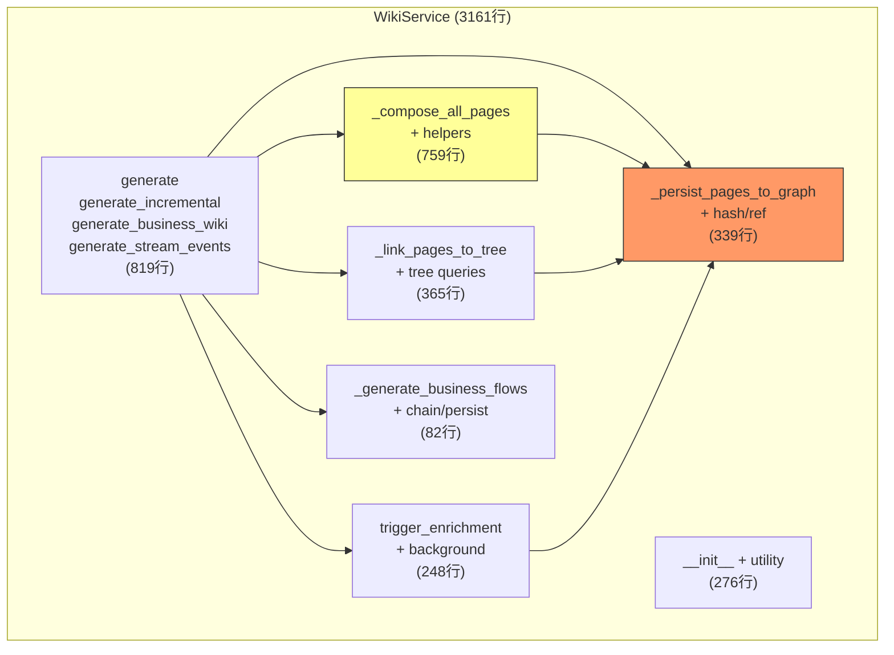

# 提案: WikiService 拆分重构 (P1-5)

> **提案编号**: PROPOSAL_20260430_235807  
> **优先级**: P1-5  
> **状态**: ✅ Implemented  
> **预计工作量**: 5-8h (5 个 Sprint)  
> **影响范围**: ~20 个文件, 1402 个测试

---

## 1. 背景与动机

`wiki/service.py` 当前 **3161 行、50+ 方法**，是项目中最大的单文件。存在以下问题：

- **认知负荷过高**: 开发者需要理解全部 3000+ 行才能安全修改
- **职责混杂**: 持久化、树链接、富化、流程推理、页面组合全部混在一个类中
- **测试耦合**: 测试 mock 层级深，修改一处可能影响大量测试
- **大量宽泛 `except Exception`**: 掩盖真实缺陷

## 2. 依赖分析



**关键洞察**: `_persist_pages_to_graph` 是依赖枢纽（被 7 个方法调用），必须最先提取。

## 3. 拆分方案

### 3.1 新模块总览

| # | 新文件 | 类名 | 行数 | 职责 |
|---|--------|------|------|------|
| 1 | `wiki/persistence.py` | `WikiPagePersistence` | ~340 | 页面持久化、代码哈希、引用同步 |
| 2 | `wiki/tree_linker.py` | `WikiTreeLinker` | ~370 | 域树构建、嵌套树、树查询 API |
| 3 | `wiki/enrichment_coordinator.py` | `WikiEnrichmentCoordinator` | ~250 | 页面富化触发、后台执行、状态查询 |
| 4 | `wiki/flow_writer.py` | `BusinessFlowWriter` | ~82 | 业务流推理、调用链追踪、流持久化 |

### 3.2 拆分后 service.py

- **预计行数**: ~2100 行（减少 ~1000 行）
- **保留内容**: `__init__`、4 个编排方法（generate / incremental / business / stream）、`_compose_all_pages` 及辅助方法
- **持有新服务实例**: `self._persistence`、`self._tree_linker`、`self._enrichment`、`self._flow_writer`

### 3.3 各模块接口设计

#### Module 1: `WikiPagePersistence`

```python
class WikiPagePersistence:
    def __init__(
        self,
        store: Any,
        wiki_store: Any,
        wiki_cfg: WikiAppConfig,
        embedding_cfg: EmbeddingConfig,
        llm: Any = None,
    ) -> None: ...

    async def persist_pages_to_graph(
        self, business_id: str, pages: list[WikiPage], *, language: str = "zh"
    ) -> None: ...

    async def bulk_set_wiki_code_hashes(self, repository: str) -> None: ...
    async def update_wiki_code_hashes(self, repository: str, uids: list[str]) -> None: ...
    async def inject_wikilinks(self, repository: str, pages: list[WikiPage]) -> None: ...
    async def sync_graph_references_into_page_content(
        self, business_id: str, repository: str
    ) -> None: ...
    def confidence_scoring_enabled(self) -> bool: ...
```

#### Module 2: `WikiTreeLinker`

```python
class WikiTreeLinker:
    def __init__(
        self,
        wiki_store: Any,
        wiki_cfg: WikiAppConfig,
        persistence: WikiPagePersistence,
    ) -> None: ...

    async def link_pages_to_tree(
        self, business_id: str, repository: str, pages: list[WikiPage], ...
    ) -> None: ...

    async def link_pages_to_nested_tree(
        self, business_id: str, domain_tree: list[DomainNode], ...
    ) -> None: ...

    async def get_domain_tree(self, business_id: str) -> dict[str, Any]: ...
    async def get_topic_tree(self, business_id: str) -> dict[str, Any]: ...
    async def get_domain_edges(self, business_id: str) -> dict[str, Any]: ...
```

#### Module 3: `WikiEnrichmentCoordinator`

```python
class WikiEnrichmentCoordinator:
    def __init__(
        self,
        store: Any,
        wiki_cfg: WikiAppConfig,
        persistence: WikiPagePersistence,
        llm_resolver: Callable,
    ) -> None: ...

    async def trigger_enrichment(self, repository: str) -> dict[str, Any]: ...
    async def get_enrichment_status(self, repository: str) -> dict[str, Any]: ...
    async def enrich_pages_after_compose(
        self, repository: str, pages: list[WikiPage], ...
    ) -> None: ...
```

#### Module 4: `BusinessFlowWriter`

```python
class BusinessFlowWriter:
    def __init__(
        self,
        store: Any,
        wiki_cfg: WikiAppConfig,
        flow_inferencer: Any = None,
    ) -> None: ...

    async def generate_business_flows(self, repository: str) -> int: ...
```

## 4. 迁移步骤

### Sprint 1: 提取 WikiPagePersistence (优先级最高)

- [ ] 创建 `wiki/persistence.py`，移入 6 个方法
- [ ] WikiService.__init__ 创建 self._persistence
- [ ] 保留同名委托方法（后向兼容）
- [ ] 运行全量测试验证 → verify: 1402 passed
- [ ] 更新内部调用点为 self._persistence.xxx()
- [ ] 删除委托方法
- [ ] 运行全量测试验证 → verify: 1402 passed

### Sprint 2: 提取 WikiTreeLinker

- [ ] 创建 `wiki/tree_linker.py`，移入 6 个方法
- [ ] 注入 WikiPagePersistence 用于 nested tree 概览页
- [ ] 保留委托 → 测试 → 删除委托 → 测试
- [ ] verify: 1402 passed

### Sprint 3: 提取 WikiEnrichmentCoordinator

- [ ] 创建 `wiki/enrichment_coordinator.py`，移入 4 个方法
- [ ] 注入 WikiPagePersistence
- [ ] 保留委托 → 测试 → 删除委托 → 测试
- [ ] verify: 1402 passed

### Sprint 4: 提取 BusinessFlowWriter

- [ ] 创建 `wiki/flow_writer.py`，移入 3 个方法
- [ ] 保留委托 → 测试 → 删除委托 → 测试
- [ ] verify: 1402 passed

### Sprint 5: 清理与验证

- [ ] 删除死代码 `_find_module_node`
- [ ] 运行 lint 检查
- [ ] 全量测试最终验证
- [ ] 更新审计文档 P1-5 状态

## 5. 安全策略

### 后向兼容委托模式

每个 Sprint 分两阶段执行，确保渐进安全：

```python
# 阶段 1: 委托 (保证测试不改)
class WikiService:
    async def _persist_pages_to_graph(self, *args, **kwargs):
        return await self._persistence.persist_pages_to_graph(*args, **kwargs)

# 阶段 2: 直接调用 (更新所有内部调用点后删除委托)
# self._persistence.persist_pages_to_graph(...)
```

### 外部 API 不变

- API routes 继续 import `WikiService` 并调用其公开方法
- `WikiService.generate()` / `generate_business_wiki()` 等签名不变
- 外部调用者无感知

## 6. 风险与缓解

| 风险 | 概率 | 缓解 |
|------|------|------|
| 循环导入 | 中 | 新模块不 import WikiService；共享类型放 `wiki/models.py` |
| 测试 mock 路径变化 | 高 | 委托阶段逐步过渡；Mock 补丁路径渐进更新 |
| _compose_all_pages 内部调用 persist | 中 | 通过 self._persistence 注入而非直接引用 |
| 隐式状态耦合 | 低 | _enrichment_running 类变量随 Enrichment 一起迁移 |

## 7. 成功标准

### 硬指标
- [ ] 1402 个 wiki 测试全部通过（排除已知 flaky）
- [ ] service.py 减少至 2200 行以下
- [ ] 新提取的 4 个模块各自有独立测试文件
- [ ] 零循环导入
- [ ] WikiService 公开 API 签名不变

### 软指标
- [ ] 每个新模块可独立测试
- [ ] 模块间通过构造函数注入依赖
- [ ] 新模块有清晰的输入/输出类型

## 8. 未来迭代

本次拆分后 service.py 仍有 ~2100 行。后续可进一步：

1. **提取 `WikiPageComposerService`** (637 行 `_compose_all_pages`)
2. **编排方法瘦身**: 4 个 generate 方法成为薄编排层
3. **Protocol 化**: 用 Protocol 替代具体类依赖，提升可测试性
