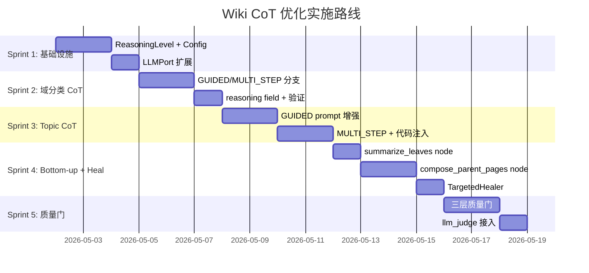

# 提案: 自适应链式推理 Wiki 生成管道优化

> **状态**: AwaitingApproval  
> **创建**: 2026-05-01  
> **方法**: 10 轮 sequential-thinking 深度分析  
> **关联审阅**: `wiki-audit-20260501_005708.md`

---

## 1. 背景与问题陈述

### 当前现状
所有 LLM 提示词采用 **"one-shot direct output"** 模式：输入上下文 → 要求直接输出 JSON/Markdown。缺乏中间推理步骤。

### 为什么不应该固定为 2 步 CoT

现有 `cot_generator.py` 采用经典的 "分析 → 生成" 两步模式。但这是过度简化：

1. **不同任务需要不同推理深度**: 5 个模块的域分类不需要中间推理；50 个跨仓库模块则需要多轮分析
2. **固定步数忽略输入复杂度**: 硬编码步数 = 简单任务浪费 token + 复杂任务质量不足
3. **LLM 原生 thinking 已能自适应**: 现代 LLM 的 extended thinking 可在单次调用中自适应推理深度

**核心主张: 采用复杂度自适应的多层推理策略，而非固定 N 步。**

---

## 2. ReasoningLevel 架构设计

### 2.1 四级推理深度

```python
class ReasoningLevel(IntEnum):
    NONE = 0       # 直接输出，无推理 (快速模型，轻量任务)
    NATIVE = 1     # LLM 原生 thinking (thinking_budget 控制)
    GUIDED = 2     # Prompt 嵌入分析框架 + reasoning 字段 (单次调用)
    MULTI_STEP = 3 # 多次调用 + 中间验证 (调用-验证-调用)
```

### 2.2 自适应选择逻辑

```python
def select_reasoning_level(
    task_type: str,
    complexity: float,  # 0.0 - 1.0
    config: ReasoningConfig,
) -> ReasoningLevel:
    """根据任务类型和输入复杂度自动选择推理深度。"""
    if not config.cot_enabled:
        return ReasoningLevel.NONE

    # 用户可强制指定
    if config.forced_level is not None:
        return config.forced_level

    # 自适应选择
    if complexity < 0.3:
        return ReasoningLevel.NONE
    if complexity < 0.6:
        return ReasoningLevel.NATIVE
    if complexity < 0.8:
        return ReasoningLevel.GUIDED
    return ReasoningLevel.MULTI_STEP
```

### 2.3 复杂度计算示例

| 任务 | 复杂度因子 | 示例 |
|------|-----------|------|
| 域分类 | `len(modules) / 50` | 10 模块 = 0.2, 30 模块 = 0.6, 60 模块 = 1.0 |
| 层级分解 | `len(domains) * avg_module_per_domain / 100` | |
| Topic 生成 | DomainComplexityScorer 已有 | LOW=0.2, MEDIUM=0.5, HIGH=0.9 |
| Heal | `1 - bench_score.overall` | 分数 0.3 → 复杂度 0.7 |

---

## 3. 每个 Pipeline 节点的具体方案

### 3.1 域分类 (classify_domains_node)

| 输入规模 | Level | 方案 |
|----------|-------|------|
| ≤ 10 模块 | NONE | 当前 prompt 已够用 |
| 11-30 模块 | GUIDED | 单次调用，prompt 嵌入分析框架 |
| > 30 模块 | MULTI_STEP | 调用-验证-调用 |

**GUIDED prompt (11-30 模块):**
```
Classify these modules into business domains.

Before classifying, analyze the relationships:
1. Identify calling patterns between modules (who calls whom)
2. Group modules that share data models or API boundaries
3. Name each domain by its business capability (not technology)

Return JSON with reasoning:
{
  "reasoning": {
    "call_clusters": [
      {"cluster": ["ModA", "ModB"], "reason": "share OrderDTO"}
    ],
    "boundary_signals": ["ModA↔ModC: no calls, different data"],
    "confidence": 0.85
  },
  "domains": {
    "order-management": [["repo1", "OrderService"], ...]
  }
}
```

**MULTI_STEP (> 30 模块):**
- Step 1: 调用关系分析 → JSON (call_graph, clusters, boundary_signals)
- 中间验证: 检查 clusters 是否覆盖所有模块
- Step 2: 基于分析进行分类

**reasoning field 价值:**
- 可审计: 用户在审查面板中看到 "为什么这样分类"
- 可缓存: 相同模块集的 call_graph 分析可复用
- confidence 低时触发重试或人工审查

### 3.2 层级分解 (decompose_hierarchy)

| Level | 方案 |
|-------|------|
| GUIDED | prompt 中要求先评估每个域的内部聚合度 (1-5)，再决定是否拆分子域 |

**GUIDED prompt 增强:**
```
Before building the hierarchy, evaluate each domain:
- Internal cohesion (1-5): How closely related are the modules?
- Coupling with other domains (1-5): How much cross-domain interaction?

Only create sub-domains when cohesion < 3 AND module count > 8.

Return JSON:
{
  "reasoning": {
    "evaluations": [
      {"domain": "user-mgmt", "cohesion": 4, "coupling": 2, "split": false}
    ]
  },
  "domains": [...]
}
```

### 3.3 Topic 页面生成 (compose_pages_node)

| 复杂度 | Level | 方案 |
|--------|-------|------|
| LOW | NONE | 保持现有 concise prompt |
| MEDIUM | GUIDED | prompt 嵌入 "Before writing, analyze" 框架 |
| HIGH | MULTI_STEP | Step1: 服务分析 → Step2: 验证 → Step3: 生成 |

**GUIDED prompt (MEDIUM):**
```
Generate a wiki page for domain: **{name}**

Before writing, analyze the services:

Step 1 - Core Responsibilities:
What is each service's primary business role?

Step 2 - Collaboration Patterns:
How do these services interact? (callers, shared data)

Step 3 - Content Planning:
Which flows deserve Mermaid diagrams? Which services need deep sections?

Then write the wiki page. Write like a technical blog post - explain
WHY these services exist, HOW they collaborate, and WHAT business
value they deliver.

Required sections:
1. ## 业务概述
2. ## 核心业务流程 (Mermaid based on Step 2)
3. ## 核心服务详情 (depth based on Step 3)
4. ## 关联主题

{entities_desc}
{code_snippets}
```

**MULTI_STEP (HIGH) - 三阶段:**

Step 1 - 服务分析:
```
Analyze these {n} services for wiki documentation planning.

For each service, provide:
- Primary responsibility (one sentence)
- Key collaborators
- Documentation priority: HIGH/MEDIUM/LOW

Also identify:
- Top 3 business flows worth diagramming
- Service clusters that should be documented together

Return JSON:
{
  "service_analysis": [...],
  "key_flows": [...],
  "clusters": [...]
}
```

中间验证 (应用层):
```python
# 检查 HIGH priority 服务是否都有 collaborators
# 检查 key_flows 是否覆盖 HIGH priority 服务
# 从图数据库查询实际 CALLS 边丰富 key_flows
```

Step 2 - 内容生成:
```
Write a wiki page for domain: **{name}**

Use this analysis to guide your writing:
{enriched_analysis}

Write like a technical blog post.
```

### 3.4 Heal 节点 (heal_pages_node)

**从"重写"改为"诊断+手术":**

| Level | 方案 |
|-------|------|
| GUIDED | 单次调用: 诊断 + 生成 patches |

```
You are reviewing a wiki page that scored below quality threshold.

Page content:
{page_content}

Quality issues identified:
{bench_issues}

Before fixing, diagnose the root cause for each issue:
- Why is the section weak?
- What specific information should be added?
- Which sections are fine and should NOT be changed?

Return JSON:
{
  "diagnosis": [
    {"issue": "missing_overview_section", "root_cause": "...", "fix": "..."}
  ],
  "patches": [
    {
      "action": "insert_after|replace_section|append",
      "target_heading": "## 业务概述",
      "content": "...markdown content..."
    }
  ],
  "preserved_sections": ["## 核心服务详情"]
}
```

应用层执行 patches:
```python
class TargetedHealer:
    async def heal(self, page, issues, llm) -> WikiPage:
        result = await self._diagnose_and_plan(page, issues, llm)
        if not result or 'patches' not in result:
            return await self._full_regen(page, issues, llm)  # fallback
        return page.with_content(self._apply_patches(page.content, result['patches']))
```

**优势:**
- 保留好的 sections，只修复缺失部分
- 降低 token 成本
- 修复可追溯 (diagnosis JSON 记录)

### 3.5 System Overview (synthesize_overviews_node)

**方案: 复用 SystemOverviewComposer + Bottom-up 输入**

```python
# 新增 summarize_leaves_node (规则提取，无 LLM 成本)
def extract_executive_summary(page_content: str, max_chars: int = 300) -> str:
    """优先取 ## 业务概述 section，fallback 取前 N 段落。"""
    overview = extract_section(page_content, ["业务概述", "Overview", "域概览"])
    if overview and len(overview) >= 50:
        return overview[:max_chars]
    return page_content[:max_chars]

# 修改 synthesize_overviews_node 使用 SystemOverviewComposer
async def synthesize_overviews_node(state, config):
    domain_summaries = []
    for domain_name, pages in pages_by_domain.items():
        summary = extract_executive_summary(pages[0]['content'])
        domain_summaries.append({'name': domain_name, 'summary': summary})

    composer = SystemOverviewComposer(llm, language)
    overview = await composer.compose(domain_summaries, repo_infos, ...)
    # ...
```

---

## 4. Bottom-up 递归生成

### 新增 Pipeline 阶段

```
Phase 1: compose_leaf_pages      (并行生成所有 leaf domain pages)
                    ↓
Phase 2: summarize_leaves        (规则提取 executive summary, 无 LLM)
                    ↓
Phase 3: compose_parent_pages    (用 leaf summaries 生成 parent overview)
                    ↓
Phase 4: synthesize_system       (用所有 domain summaries 生成 system overview)
```

**约束:**
- 仅当 `domain_tree` 有层级 (children 非空) 时启用 bottom-up
- 扁平域结构仍用当前流程
- `summarize_leaves` 无 LLM 成本

### Parent Domain Overview prompt

```
Generate a domain overview page for: **{parent_domain}**

This domain contains the following sub-topics, each already documented:

### {child_1.name}
{child_1.executive_summary}
---
### {child_2.name}
{child_2.executive_summary}
---

Your task:
1. Explain the business capability of {parent_domain} as a whole
2. Show how sub-topics relate (Mermaid diagram)
3. Highlight cross-cutting concerns or shared patterns
4. Link to sub-topic pages using [[wikilinks]]

Do NOT repeat detailed content from sub-topics.
Focus on the big picture and relationships.
```

---

## 5. 内联代码片段注入

### 智能选择策略

```python
def select_key_snippets(
    entities: list[dict],
    max_snippets: int = 5,
    max_lines_per_snippet: int = 15,
) -> list[dict]:
    """选择最有信息量的代码片段。

    优先级:
    1. 入口点方法 (constructors, handlers)
    2. 被调用最多的方法
    3. 有 docstring 的方法
    """
    ...
```

### Prompt 集成

```
## Key Code Signatures
The following method signatures provide concrete implementation context:

### OrderService.createOrder
```java
public OrderDTO createOrder(CreateOrderRequest req) throws InsufficientStockException
```
Handles order creation with inventory validation.
---

Use these signatures to:
- Name specific methods in your documentation
- Describe actual parameter types
- Reference real class/method names in Mermaid diagrams
```

---

## 6. 实施路线图



---

## 7. 风险矩阵

| 风险 | 概率 | 影响 | 缓解策略 |
|------|------|------|---------|
| CoT 增加 token 成本 | 高 | 中 | reasoning_level 自适应；简单任务不启用 |
| LLM reasoning 质量不稳定 | 中 | 高 | 中间验证 + confidence 检查 + fallback to NONE |
| Qwen3 thinking 延迟 | 高 | 高 | 分类用快速模型 (无 CoT)，生成用强模型 |
| Bottom-up 增加 pipeline 复杂度 | 中 | 中 | 仅层级树启用；扁平结构走现有路径 |
| Patches 解析失败 | 低 | 低 | fallback to full regen |
| 向后兼容 | 低 | 中 | `cot_enabled=False` 默认关闭，渐进启用 |

---

## 8. 成功指标

| 指标 | 当前基线 | 目标 |
|------|---------|------|
| structural_check 通过率 | ~85% | > 90% |
| bench_score 均值 | ~0.6 | > 0.75 |
| heal 成功率 (单次修复) | ~50% | > 70% |
| 域分类 confidence | 未度量 | > 0.8 均值 |
| system_overview 质量 (人工评审) | 低 (200 chars 上下文) | 高 (bottom-up 综合) |
| Token 成本增幅 | 基线 | < +30% (GUIDED 主导) |

---

## 9. 文件变更清单

### 新建文件
- `wiki/reasoning.py` — ReasoningLevel, ReasoningConfig, select_reasoning_level
- `wiki/targeted_healer.py` — TargetedHealer, patch 应用逻辑
- `wiki/snippet_selector.py` — select_key_snippets
- `tests/wiki/test_reasoning.py`
- `tests/wiki/test_targeted_healer.py`
- `tests/wiki/test_snippet_selector.py`

### 修改文件
- `wiki/pipeline_nodes.py` — compose_pages_node, heal_pages_node, synthesize_overviews_node
- `wiki/pipeline_graph.py` — 新增 summarize_leaves_node, compose_parent_pages_node
- `wiki/pipeline_state.py` — 新增 leaf_summaries 状态字段
- `wiki/cross_repo_domain_planner.py` — GUIDED/MULTI_STEP 分支
- `wiki/topic_page_composer.py` — GUIDED/MULTI_STEP prompt
- `wiki/models.py` — WikiConfig 增加 reasoning_config
- `config.py` — reasoning 相关配置项
- `wiki/context.py` — LLMPort 增加 thinking_budget 参数
