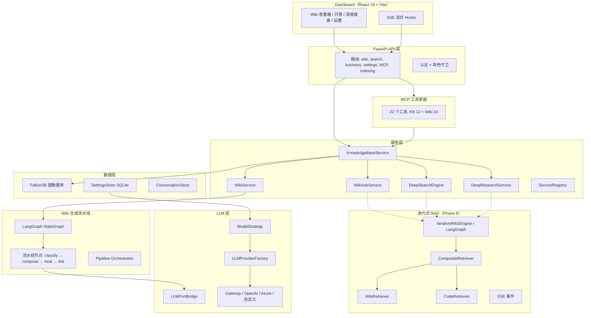

# Knowledge Base Service — 系统全面审计报告

> **日期:** 2026-05-01  
> **范围:** 全系统审阅 — 后端、前端、架构、竞争力定位  
> **替代:** `DEEP_ANALYSIS_20260501_085742_wiki_gaps_and_bugs.md`（已删除）

---

## 1. 总体摘要

Knowledge Base Service 是一个**成熟且功能丰富的代码知识平台**，可从源代码自动生成多仓库业务 Wiki，底层采用 FalkorDB 图存储、混合搜索和 LLM 驱动的内容组合。

完成 Phase 6（迭代式 RAG + 动态模型策略）后，系统相比 DeepWiki 和 CodeWiki 具备 **14 项竞争优势**，核心差异化体现在：
- 多仓库业务领域智能
- 质量保障体系（lint、heal、覆盖率、矛盾检测）
- Agent 工具链（22 个 MCP 工具）
- 搜索能力（混合搜索 + 深度搜索 + 迭代式 RAG）
- LLM 管理（多 Provider 池、动态模型路由）

**下一阶段 Top 3 优先事项：**
1. **全局问答** — 解耦 Ask 与 Wiki 页面上下文，任何视图均可访问
2. ~~**实现 `unified_knowledge_query`**~~ — ✅ Phase 7 已接入 IterativeRAGEngine
3. ~~**整合 LLM 抽象层**~~ — ✅ Phase 7 已收敛为 `wiki/llm_port.py` 单一 Protocol

---

## 2. 系统架构

**核心数据：**
- 后端：~52K 行 Python，21+ 个数据存储，22 个 MCP 工具
- 前端：React 19 + TypeScript 5.9 + Tailwind 4，Vite 8
- 测试：200+ 个后端测试，Vitest 前端测试（70% 覆盖率阈值）

---

## 3. 竞争力对比分析

| 功能特性 | DeepWiki | CodeWiki（论文） | 我们的系统 |
|---------|----------|-----------------|-----------|
| 从代码自动生成 Wiki | ✅ | ✅ | ✅ |
| 多仓库业务级 Wiki | ❌ | ❌ | ✅ **优势** |
| 交互式图表 | ✅ 丰富 | ✅ | ⚠️ 静态 Mermaid |
| 全局问答 | ✅ | ❌ | ⚠️ 绑定页面 |
| 公开分享 | ✅ | N/A | ❌ |
| 混合搜索 | ⚠️ 基础 | ❌ | ✅ **优势** |
| 质量门禁 | ❌ | ✅ | ✅ **优势** |
| 复杂度自适应组合 | ❌ | ✅ | ✅ **优势** |
| Agent MCP 工具 | ❌ | ❌ | ✅ 22个工具 **优势** |
| 多 LLM Provider 池 | ❌ | ❌ | ✅ **优势** |
| 动态模型路由 | ❌ | ❌ | ✅ **优势** |
| 迭代式 RAG | ❌ | ❌ | ✅ LangGraph **优势** |
| SSE 实时进度 | ⚠️ | ❌ | ✅ **优势** |
| PR 影响分析 | ❌ | ❌ | ✅ **优势** |
| 矛盾检测 | ❌ | ❌ | ✅ **优势** |
| 记忆/会话管理 | ❌ | ❌ | ✅ 多级缓存 **优势** |
| 国际化 | ❌ | ❌ | ✅ 中/英 **优势** |
| 零配置启动 | ✅ | N/A | ❌ |
| E2E 测试覆盖 | N/A | N/A | ⚠️ 骨架 |

**得分：14 项优势，3 项差距（全局问答、公开分享、零配置），2 项持平**

---

## 4. 差距分析

### 4.1 业务/产品视角差距

| 编号 | 差距 | 严重度 | 描述 |
|------|-----|--------|------|
| B1 | 全局问答 | **高** | Ask 绑定 `toolTab === 'page'` + `pagePath`，用户必须导航到特定 Wiki 页面才能提问。DeepWiki 提供随时可用的上下文问答。 |
| B2 | 公开 Wiki 分享 | **高** | 内部 Dashboard 在认证后才可访问，无公开 URL 供外部利益相关者使用。DeepWiki 可生成可分享的公开 Wiki 页面。 |
| B3 | 交互式图表 | **中** | Wiki 中的图表是 Markdown 内嵌的静态 Mermaid，没有可点击、可缩放的架构可视化。ReactFlow 存在于图探索器中但与 Wiki 独立。 |
| B4 | 零配置入门 | **高** | 需要配置 FalkorDB、Git、索引等。缺乏"输入 GitHub URL 即获得 Wiki"的体验。 |
| B5 | DeepSearch 与 Research 命名混乱 | **低** | "Deep Search"（搜索页）、"Research"（Wiki 标签）、"Deep Research"（API）— 用户感到困惑。 |

### 4.2 开发者/架构视角差距

| 编号 | 差距 | 严重度 | 描述 |
|------|-----|--------|------|
| D1 | KnowledgeBaseService 过于庞大 | **中** | 巨大的组合根同时承担索引 + 查询 + Wiki + MCP 职责，难以独立测试、部署和演进。 |
| D2 | 5 套 LLM 抽象层重叠 | **高** | `LLMProvider`、`BaseLLMProvider`、`LLMPortBridge`、`wiki.context.LLMPort`、`wiki.ask.LLMPort` — 功能重叠，贡献者困惑。**（Phase 7：已收敛为 `wiki/llm_port.py`。）** |
| D3 | 3 套并行深度搜索系统 | **高** | `DeepSearchEngine`、`IterativeRAGEngine`、`DeepResearchService` 做类似的多步 LLM 搜索但实现各异，应收敛。**（Phase 7：已统一委托 `IterativeRAGEngine`。）** |
| D4 | 配置膨胀 | **中** | `AppWikiFlags` 包含 50+ 字段。环境变量和数据库双源配置共存（`WIKI__COMPOSE_CONCURRENCY` vs `AppWikiFlags.compose_concurrency`）。**（Phase 7：`compose_concurrency` 已统一配置源；其余 AppWikiFlags 分组仍待后续迭代。）**
| D5 | MCP Manifest/分发不一致 | **高** | `generate_wiki` handler 存在但**未注册**到 manifest 或 dispatcher — 对 MCP 客户端而言是死代码。**（Phase 7：已注册。）** |
| D6 | Business 路由重复 | **低** | `business_routes.py` 和 `business_sync_routes.py` 都暴露了 `GET /api/v1/businesses`。**（Phase 7：已去重。）** |
| D7 | Gateway max_context_tokens 硬编码 | **中** | `GatewayLLMProviderAdapter` 硬编码 `128000` 而未读取 `LLMConfig.max_context_tokens`。**（Phase 7：已动态化。）** |
| D8 | 流水线缺乏可观测性 | **中** | Wiki LangGraph 流水线仅有基础日志，无结构化遥测或链路追踪。 |

### 4.3 Agent/MCP 视角差距

| 编号 | 差距 | 严重度 | 描述 |
|------|-----|--------|------|
| A1 | `unified_knowledge_query` 为占位实现 | **P0** ✅ | 旗舰级 Agent 工具已接入 IterativeRAGEngine（Phase 7）。 |
| A2 | 缺少 `code_semantic_search` 工具 | **中** | Agent 可通过 MCP 搜索 Wiki 但无法语义搜索代码。 |
| A3 | 缺少机器可读 Wiki 格式 | **中** | Wiki 页面为面向人类的 Markdown，无 JSON/结构化输出供 Agent 消费。 |
| A4 | MCP 响应缺少 Token 预算控制 | **低** | 大规模工具响应可能溢出 Agent 上下文窗口，缺少 `max_tokens` 截断参数。 |
| A5 | 缺少代码→Wiki 影响分析工具 | **中** | 无法通过工具获知"修改此函数后，哪些 Wiki 页面需要更新"。 |
| A6 | MCP 工具数量文档不一致 | **高** ✅ | 文档已统一为 22（12+10）（Phase 7）。 |

---

## 5. 技术债务清单

### P0 — 必须修复

| # | 问题 | 位置 | 影响 | 状态 |
|---|------|------|------|------|
| 1 | `unified_knowledge_query` 为占位实现 | `wiki/mcp_tools.py` | Agent 旗舰工具不可用 | ✅ 已完成 |
| 2 | MCP `generate_wiki` 未注册到 manifest | `api/mcp_server.py` | Handler 为死代码 | ✅ 已完成 |
| 3 | MCP 工具数量文档不一致 | `README-DOCS.md`, `ONBOARDING.md`, `CODEMAPS/INDEX.md` | 文档不一致 | ✅ 已完成 |
| 4 | `GatewayLLMProviderAdapter.max_context_tokens` 硬编码 | `llm/base_provider.py:69` | Token 预算计算错误 | ✅ 已完成 |
| 5 | CODEMAPS/INDEX.md 断裂链接 | `docs/CODEMAPS/INDEX.md` | 引用不存在的 spec 文件 | ✅ 已完成 |

### P1 — 应该修复

| # | 问题 | 位置 | 状态 |
|---|------|------|------|
| 1 | 5 套重叠的 LLM 抽象 | `llm/`、`wiki/context.py`、`wiki/ask.py` | ✅ 已完成 |
| 2 | 3 套并行深度搜索系统 | `query/deep_search.py`、`wiki/rag/engine.py`、`wiki/deep_research.py` | ✅ 已完成 |
| 3 | AppWikiFlags 50+ 字段膨胀 | `config.py` | ⬜ 未纳入 Phase 7 |
| 4 | Business 路由重复 | `api/routes/business_routes.py`、`business_sync_routes.py` | ✅ 已完成 |
| 5 | 流水线 compose_concurrency 双源配置 | `pipeline_nodes.py` env vs `config.py` | ✅ 已完成 |
| 6 | Phase 6 设计规范状态元数据过期 | `docs/superpowers/specs/` 标记为 "AwaitingApproval" | ⬜ 未纳入 Phase 7 |

### P2 — 产品增强

| # | 问题 |
|---|------|
| 1 | 全局问答（解耦 Wiki 页面依赖） |
| 2 | 交互式 Wiki 图表（基于 ReactFlow 嵌入 Wiki 内容） |
| 3 | Agent Token 预算管理 |
| 4 | 结构化 Wiki API 输出供 Agent 使用 |

### P3 — 锦上添花

| # | 问题 |
|---|------|
| 1 | 公开 Wiki 托管 |
| 2 | 零配置"试用公开仓库" |
| 3 | E2E Playwright 测试流水线 |
| 4 | OpenTelemetry 流水线链路追踪 |
| 5 | 有状态 MCP 研究会话 |

---

## 6. 竞争优势

1. **多仓库业务领域智能** — 跨仓库领域分类，以业务为中心的 Wiki 横跨多个代码仓库
2. **质量保障流水线** — WikiLint、质量门禁、自动修复、覆盖率分析、矛盾检测
3. **22 个 MCP 工具** — 全面的 Agent 工具链，覆盖代码理解、搜索和 Wiki 操作
4. **混合搜索** — 语义 + 关键词 + 图搜索，配合 LLM 驱动的深度搜索合成
5. **迭代式 RAG** — 基于 LangGraph 的多轮检索，动态上下文获取
6. **动态模型路由** — 按任务类型分配模型策略，支持 SettingsStore 热重载
7. **多 Provider LLM 池** — 支持 Gateway、OpenAI、Azure、自定义 Provider，各 Provider 独立 baseURL
8. **实时 SSE 流式推送** — Wiki 生成进度、问答流式、深度搜索阶段
9. **PR 影响分析** — 代码变更 → 受影响 Wiki 页面 → 影响半径
10. **多级记忆体系** — 多层级会话持久化（内存 LRU、SQLite、Wiki 图）
11. **复杂度自适应组合** — CompositionStrategy 驱动模型选择、推理深度和页面结构
12. **国际化** — 完整的中英文本地化，类型安全的翻译键
13. **功能开关体系** — 通过 AppWikiFlags + SettingsStore 热重载实现细粒度控制
14. **导出系统** — Obsidian、MkDocs、自定义 Wiki 导出格式

---

## 7. Phase 7 路线图建议

> **Phase 7 交付状态（2026-05-01）**：Sprint 1（P0 五项）与 Sprint 2 中的 LLM 抽象统一、深度搜索收敛、`compose_concurrency` 单源、Business 路由去重及 IterativeRAGEngine 3-LLM 升级已完成。`AppWikiFlags` 分组与 Phase 6 spec 元数据仍待后续迭代。

### Sprint 1 — 关键修复（P0）✅ 已完成
1. ✅ 将 `unified_knowledge_query` 接入 `IterativeRAGEngine`
2. ✅ 将 `generate_wiki` 注册到 MCP manifest 和 dispatcher
3. ✅ 修复 `GatewayLLMProviderAdapter` 中硬编码的 `max_context_tokens`
4. ✅ 统一所有文档中的工具数量引用（20 → 22）
5. ✅ 修复 CODEMAPS 断裂链接

### Sprint 2 — 架构整合（P1）✅ 部分完成
1. ✅ 统一 LLM 抽象 — `wiki/llm_port.py` 单一 Protocol（`generate` / `complete` / `complete_stream`）
2. ✅ 收敛深度搜索：`DeepSearchEngine` 和 `DeepResearchService` 与 `WikiAskService` 统一委托 `IterativeRAGEngine`
3. ⬜ 将 `AppWikiFlags` 按功能集分组，消除双源配置（剩余项）

### Sprint 3 — 全局问答（P2）
1. 解耦 Ask 对 Wiki 页面的强依赖
2. 添加全局问答面板，所有视图均可访问
3. 查看 Wiki 时可选注入页面上下文

### Sprint 4 — Agent 增强
1. 添加 `code_semantic_search` MCP 工具
2. 为 MCP 工具响应添加 `max_tokens` 参数
3. 添加 `get_business_overview` MCP 工具
4. 添加代码→Wiki 影响分析工具

### Sprint 5 — 用户体验
1. 交互式 Wiki 图表（ReactFlow 嵌入 Wiki 内容）
2. 统一 "Deep Search" 与 "Research" 命名
3. E2E Playwright 测试流水线

---

## 8. 文档一致性审计

| 问题 | 涉及文件 | 状态 |
|------|---------|------|
| MCP 工具数量：20 vs 22 | `README-DOCS.md`、`ONBOARDING.md`、`CODEMAPS/INDEX.md` | ✅ Phase 7 已统一为 22 |
| 断裂的 spec 链接 | `CODEMAPS/INDEX.md` → 不存在的 `2026-04-27-wiki-generation-architecture-improvement-design.md` | ✅ Phase 7 已修复 |
| Phase 6 状态元数据 | `specs/*.md` 标记 "AwaitingApproval" 但实现已完成 | ⚠️ 需要修复 |
| `IMPLEMENTATION-STATUS.md` | 仅覆盖到 Phase 3，未包含 Phase 4-6 | ⚠️ 考虑合并到 ARCHITECTURE.md |
| `KNOWN-ISSUES.md` | 最后更新 2026-04-30，部分问题可能已修复 | ⚠️ 需要核实 |

---

## 9. 附录

### 9.1 后端模块清单

| 领域 | 文件数 | 核心类 |
|------|--------|--------|
| API 路由 | 15 | FastAPI 路由器 |
| LLM | 7 | LLMProvider、Factory、Bridge、Adapters |
| Wiki | 35+ | WikiService、Ask、Pipeline、RAG、Lint、Export |
| 查询 | 6 | Hybrid、Graph、Deep、Semantic、Analysis |
| 存储 | 21+ | FalkorDB、Wiki 存储、Settings |
| 索引 | 21 | Parser、Embeddings、Incremental、Enrichment |
| MCP | 2 | KnowledgeBaseMCPHandler、WikiMCPHandler |
| 配置 | 1 | Settings、AppWikiFlags、嵌套配置 |

### 9.2 前端组件清单

| 领域 | 组件数 | 质量评估 |
|------|--------|---------|
| Wiki 查看器 | 25+ | 成熟，功能丰富 |
| 问答面板 | 5 | 良好，需扩展为全局 |
| 设置 | 12 | 良好，最近新增扩展 |
| 搜索 | 8 | 良好 |
| 图/文件浏览器 | 6 | 可用 |
| 国际化 | 4 | 完整中英文 |

### 9.3 测试覆盖率概要

| 领域 | 测试数 | 覆盖率 | 备注 |
|------|--------|--------|------|
| wiki/rag/ | 15 | 高 | Phase 6 新代码 |
| wiki/unit/ | 40+ | 良好 | Wiki 核心逻辑 |
| wiki/integration/ | 20+ | 良好 | Phase 冒烟测试 |
| api/ | 15+ | 中等 | 路由测试 |
| store/ | 10+ | 低 | 需要补充 |
| query/ | 5+ | 低 | 需要补充 |
| 前端 | Vitest 70% | 中等 | E2E 骨架已就位 |

---

*本文档为系统级分析的唯一事实来源。架构细节参见 `docs/ARCHITECTURE.md`，MCP 集成参见 `docs/MCP-INTEGRATION.md`。*
