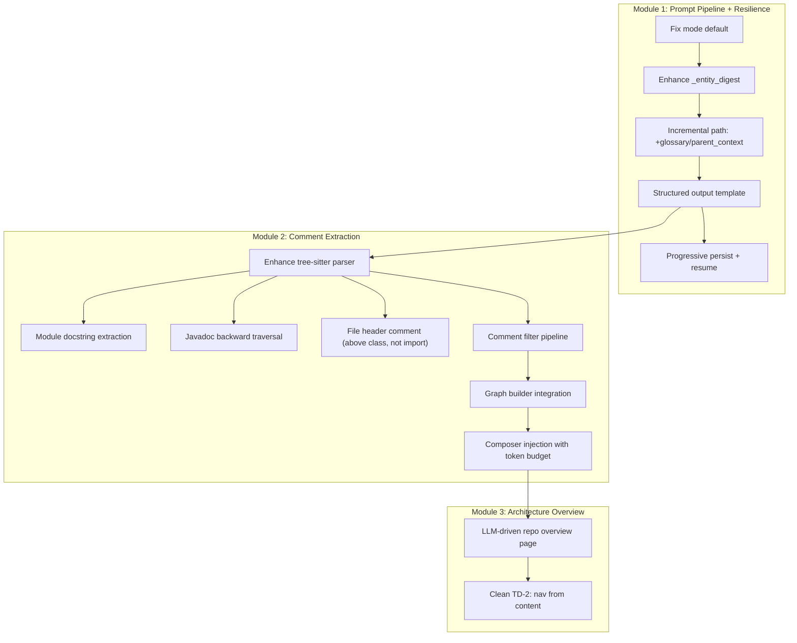
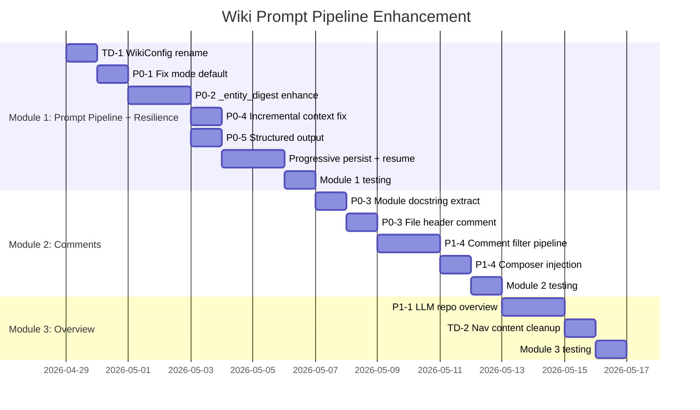

# Wiki Prompt Pipeline Enhancement Design

> **Created**: 2026-04-28  
> **Status**: Draft  
> **Approach**: Progressive — Module 1 (Prompt + Resilience) → Module 2 (Comments) → Module 3 (Architecture Overview)  
> **References**: [wiki-gap-analysis](../../wiki-gap-analysis-deepwiki-codewiki.md), [llm-wiki-v2-upgrade-design](2026-04-26-llm-wiki-v2-upgrade-design.md) (Approved)

---

## 1. Background & Motivation

### 1.1 Core Problem

The wiki generation pipeline has strong infrastructure (FalkorDB graph, incremental update, quality system) but **underutilizes LLM capabilities**:

- Incremental mode defaults to `mode=structure`, skipping LLM entirely
- `_entity_digest` injects only a subset of available graph properties into prompts
- Incremental path misses `parent_context` and `glossary` that full path provides
- No structured output template — LLM output varies wildly in quality and format
- Code comments (a key business intent signal) are barely extracted

### 1.2 Goal

Maximize wiki page quality by enriching the LLM prompt context with all available structured data, code comments, and output constraints — without adding new infrastructure.

### 1.3 Non-Goals

- New UI features (page-level Ask, code line references) — deferred to P2
- Adaptive complexity decomposition (CodeWiki DP) — deferred to P2
- Stream generation overhaul — deferred to P2

---

## 2. Architecture Overview



---

## 3. Module 1: Prompt Pipeline Enhancement

### 3.1 Fix mode Default (P0-1)

**File**: `dashboard/src/hooks/useWikiRegenerate.ts`

Decouple `mode` from `incremental` flag. Default to `full` for all cases.

```typescript
// Before
const mode = incremental ? "structure" : "full";
// After
const mode = "full";
```

Optionally expose a UI mode selector in `WikiGenerationSection` for explicit control.

**File**: `api/models/wiki_models.py` — verify `WikiGenerateRequest.mode` default aligns.

### 3.2 Enhance `_entity_digest` (P0-2 + P1-6)

**File**: `wiki/composer.py`, method `_entity_digest`

**New properties to inject from graph nodes:**

| Property | Node Types | Prompt Value |
|----------|-----------|-------------|
| `annotations` | Class, Function | Reveals business role (`@Service`, `@RestController`, `@Transactional`) |
| `semantic_roles` | Class, Function | Indexer-inferred roles (controller, repository, utility, etc.) |
| `base_classes` | Class | Direct inheritance list (supplements INHERITS edges) |
| `interfaces` | Class | Interface implementations |
| `parameters` | Function (methods) | Structured parameter info beyond signature string |
| `return_type` | Function (methods) | Explicit return type |

**Implementation**: Add property reads after existing `business_summary` block:

```python
for prop_name, label in [
    ("annotations", "Annotations"),
    ("semantic_roles", "Semantic roles"),
    ("base_classes", "Base classes"),
    ("interfaces", "Implements"),
]:
    val = n.properties.get(prop_name)
    if val:
        lines.append(f"- {label}: {val}")
```

For method-level detail, extend the method loop:

```python
m_params = m.properties.get("parameters", "")
m_ret = m.properties.get("return_type", "")
if m_params:
    detail += f" | params: {str(m_params)[:100]}"
if m_ret:
    detail += f" | returns: {str(m_ret)[:60]}"
```

### 3.3 Incremental Path: Inject glossary + parent_context (P0-4)

**File**: `wiki/service.py`, method `generate_incremental`

**Problem**: `compose_page` is called without `parent_context` or `glossary`, unlike the full generation path in `repo_composer._compose_module_pages`.

**Fix**: Before the `compose_page` call in the incremental loop:

1. Look up the parent node's WikiPage (if exists) to get `parent_context`
2. Build/cache glossary for the repository (one-time per incremental run)
3. **Sort affected UIDs by graph depth (leaves first)** — so child pages are composed before parents, allowing parent compose to use fresh child content

```python
glossary = await self._ctx.build_glossary(repository, all_modules)

# Sort by depth: leaves first, parents last (mirrors repo_composer's dependency_levels)
sorted_uids = _sort_by_depth(all_affected_uids, graph_edges)

for uid in sorted_uids:
    # ... existing code ...
    parent_context = ""
    parent_uids = [e.source_uid for e in page_data.edges 
                   if e.edge_type == EdgeType.CONTAINS and e.target_uid == uid]
    if parent_uids:
        # Check freshly-generated pages first, then fall back to existing wiki pages
        parent_page = just_generated.get(parent_uids[0]) or \
                      await wiki_store.get_page_by_entity_uid(repository, parent_uids[0])
        if parent_page and parent_page.content:
            parent_context = parent_page.content[:1200]
    
    page = await composer.compose_page(
        page_data, page_type, effective_config,
        parent_context=parent_context,
        glossary=glossary,
        ...
    )
    just_generated[uid] = page  # cache for parent lookups
```

**Also fix TD-3** (Domain link fragility): In `_link_pages_to_tree`, add fallback matching by `entity_uid` when title match fails.

### 3.4 Structured Output Template (P0-5)

**File**: `wiki/composer.py`, method `_tier2_llm`

Add section requirements to the prompt task block:

```python
STRUCTURED_SECTIONS = """
Structure your documentation with these sections (adapt as needed):
1. **Purpose & Responsibility** — What this component does and why it exists
2. **Key Components** — Main classes/functions/interfaces and their roles
3. **Integration Points** — How this connects to other parts of the system
4. **Data Flow** — Input/output, transformations, side effects
5. **Design Decisions** — Notable trade-offs, patterns used, constraints
"""
```

Inject after the `Write a detailed documentation page` line in `_tier2_llm`.

For Class pages, replace section 2 with "**Methods & Properties**".
For Function pages, simplify to: Purpose, Parameters & Return, Usage Context, Design Notes.

### 3.5 Progressive Page Persistence (New — Resilience)

**Problem**: `_compose_all_pages` collects ALL pages in memory, then calls `_persist_pages_to_graph` in one batch at the end. If the process crashes after composing 500/1000 pages, all progress is lost.

**Existing code** (`incremental_persist_enabled` at `service.py:457`): Batches the final persist into chunks of N, but still runs AFTER all pages are composed — doesn't prevent data loss from mid-composition crashes.

**Design**: Save pages progressively during composition, not after.

#### Leaf Phase: Batched Compose + Persist

Replace the single `asyncio.gather` for all leaves with batched execution:

```python
PERSIST_BATCH_SIZE = 20  # configurable via WikiConfig

for batch_start in range(0, len(leaves), PERSIST_BATCH_SIZE):
    batch = leaves[batch_start : batch_start + PERSIST_BATCH_SIZE]
    leaf_results = await asyncio.gather(*(compose_leaf(n) for n in batch))
    
    batch_pages = [p for p in leaf_results if p is not None]
    for page in batch_pages:
        pages.append(page)
        # ... existing summary_index update ...
    
    # Persist this batch immediately
    if batch_pages:
        await self._persist_pages_to_graph(
            repository, batch_pages,
            language=language, skip_claim_tracking=skip_claim,
        )
```

#### Parent Phase: Persist After Each Depth Level

Parents are already processed by depth level. After each level, persist:

```python
for depth, parent_nodes in sorted(parents_by_depth.items()):
    parent_results = await asyncio.gather(*(compose_parent(n) for n in parent_nodes))
    parent_pages = [p for p in parent_results if p is not None]
    pages.extend(parent_pages)
    
    if parent_pages:
        await self._persist_pages_to_graph(
            repository, parent_pages,
            language=language, skip_claim_tracking=skip_claim,
        )
```

#### Resume on Restart

When `generate()` is called for a repository that already has partial WikiPages:

1. Load existing WikiPage paths + `wiki_code_hash` from graph
2. For each structure leaf node, check if a WikiPage exists with a matching hash
3. If match: skip composition, load existing page into `summary_index` (for parent aggregation)
4. If no match: compose normally

```python
# At start of _compose_all_pages
existing_pages: dict[str, str] = {}  # path → code_hash
if resume_enabled:
    existing_pages = await self._load_existing_page_hashes(repository)

async def compose_leaf(node: WikiStructureNode) -> WikiPage | None:
    if node.path in existing_pages:
        log.info("skip_existing_page", path=node.path)
        # Load summary for parent aggregation
        existing = await wiki_store.get_page_by_path(repository, node.path)
        if existing:
            summary_index[node.path] = _extract_summary_from_existing(existing)
            return None  # don't re-add to pages list
    # ... existing compose logic ...
```

#### Config

```python
progressive_persist_enabled: bool = True     # save pages during composition
progressive_persist_batch_size: int = 20     # leaves per batch
resume_from_saved: bool = False              # skip already-saved pages on restart
```

#### Post-Persist Pass

Enrichment, claim tracking, and compilation snapshot remain as the final pass after all pages are composed and persisted — no change needed.

---

### 3.6 Tech Debt Cleanup (TD-1, TD-4)

**TD-1 (WikiConfig naming)**: Rename `config.WikiConfig` to `config.AppWikiFlags` to distinguish from `wiki.models.WikiConfig` (per-run config). Update all imports.

**TD-4 (Incremental/full divergence)**: Addressed by 3.3 above — after the fix, both paths pass equivalent context to `compose_page`.

---

## 4. Module 2: Comment Extraction Enhancement

### 4.1 File Header Comment Extraction (P0-3)

**Key insight from user review**: File header comments in Java/TypeScript projects are typically placed **above the class declaration**, not above imports. The extraction logic must account for this pattern.

**File**: `indexer/tree_sitter_parser.py`

#### 4.1.1 Module Docstring (Python)

Python modules may have a docstring as the first expression:

```python
@staticmethod
def _extract_module_docstring(root_node: Node, language: str, source: bytes) -> str:
    if language == "python":
        for child in root_node.children:
            if child.type == "expression_statement":
                expr = child.children[0] if child.children else None
                if expr and expr.type in ("string", "concatenated_string"):
                    raw = expr.text.decode("utf-8") if expr.text else ""
                    return raw.strip("'\"").strip()
                break  # only check first expression_statement
            if child.type not in ("comment", "import_statement", "import_from_statement"):
                break
    return ""
```

#### 4.1.2 Class-Level Header Comment (Java/JS/TS/Go)

For Java and similar languages, the file-level documentation comment is typically the **block comment immediately preceding the first class/interface declaration** — NOT above imports.

```python
@staticmethod
def _extract_file_header_comment(root_node: Node, language: str) -> str:
    """Extract file-level documentation comment above the first class declaration."""
    if language not in ("java", "javascript", "typescript", "go"):
        return ""
    
    first_class = None
    for child in root_node.children:
        if child.type in (
            "class_declaration", "interface_declaration",
            "enum_declaration", "annotation_type_declaration",
            "class",
        ):
            first_class = child
            break
        # JS/TS: export_statement may wrap a class — check children
        if child.type == "export_statement":
            for sub in child.children:
                if sub.type in ("class_declaration", "interface_declaration", "class"):
                    first_class = child  # use export_statement as anchor (comment is its sibling)
                    break
            if first_class:
                break
    
    if first_class is None:
        return ""
    
    # Walk backwards from class to find preceding comment
    prev = first_class.prev_named_sibling
    # Skip past annotations/decorators
    while prev and prev.type in ("decorator", "annotation", "marker_annotation", "modifiers"):
        prev = prev.prev_named_sibling
    
    if prev and prev.type in ("comment", "block_comment"):
        raw = prev.text.decode("utf-8") if prev.text else ""
        cleaned = raw.strip("/* \n\t")
        # Filter license headers
        if _is_license_comment(cleaned):
            return ""
        return cleaned
    
    return ""
```

#### 4.1.3 Enhanced Javadoc Extraction

Current `_extract_docstring` fails when annotations separate Javadoc from method. Fix by walking backwards past annotation nodes:

```python
elif language in ("java", "javascript", "typescript", "go"):
    prev = node.prev_named_sibling
    # Walk backwards past annotations/decorators that separate Javadoc from declaration
    while prev and prev.type in (
        "decorator", "annotation", "marker_annotation",
        "modifiers", "module_attribute",
    ):
        prev = prev.prev_named_sibling
    if prev and prev.type in ("comment", "block_comment"):
        raw = prev.text.decode("utf-8") if prev.text else ""
        return raw.strip("/* \n\t")
```

### 4.2 Comment Filter Pipeline (P1-4)

**New file**: `indexer/comment_filter.py`

```python
class CommentTier(Enum):
    STRUCTURED_DOC = 1   # JSDoc/Javadoc/docstring (always include)
    FILE_HEADER = 2      # Module/class-level doc comment
    BLOCK_COMMENT = 3    # Significant block comments
    INLINE = 4           # Meaningful inline comments
    NEVER = 99           # License, boilerplate, commented-out code

class CommentFilter:
    LICENSE_PATTERNS: list[re.Pattern]  # Apache, MIT, GPL, Copyright, etc.
    TRIVIAL_MIN_LENGTH = 20
    CODE_KEYWORD_RATIO_THRESHOLD = 0.3  # if >30% of tokens are code keywords → commented-out code
    
    def classify(self, comment: str) -> CommentTier: ...
    def _is_license(self, text: str) -> bool: ...
    def _is_commented_code(self, text: str) -> bool: ...
    def _is_trivial(self, text: str) -> bool: ...
```

**Heuristics for commented-out code detection**:
- High density of language keywords (`if`, `for`, `return`, `class`, `import`)
- Contains semicolons, braces, or assignment operators
- Matches common code patterns (function calls, variable assignments)

### 4.3 Graph Builder Integration (P0-3)

**File**: `indexer/code_graph_builder.py`

For Module nodes, store the extracted module docstring / file header comment:

```python
# In _build_graph, Module node construction
module_doc = self._parser._extract_module_docstring(tree.root_node, language, source_bytes)
if not module_doc:
    module_doc = self._parser._extract_file_header_comment(tree.root_node, language)
if module_doc:
    module_props["docstring"] = module_doc[:1000]
```

### 4.4 Composer Injection with Token Budget (P1-4)

**File**: `wiki/composer.py`, method `_entity_digest`

```python
# Module pages: inject file-level documentation
if page_type == PageType.MODULE_OVERVIEW:
    module_doc = n.properties.get("docstring")
    if module_doc:
        lines.append(f"- Module documentation: {module_doc[:500]}")

# Method-level: inject enhanced docstring when business_summary is absent
# (already partially implemented, extend to use filtered comments)
```

**Token budget control** via `WikiConfig`:

```python
comment_injection_tier: int = 2   # inject all tiers from 1 through N (e.g., 2 = Tier1 + Tier2)
comment_max_chars: int = 500      # per-entity comment character budget
```

---

## 5. Module 3: Architecture Overview Page

### 5.1 LLM-Driven Repository Overview (P1-1)

**File**: `wiki/composer.py`, method `compose_incremental_navigation_pages`

**Problem**: `build_repository_context([])` with empty module list produces placeholder text.

**Fix**: Pass real top-level module list:

```python
top_modules = await self._store.find_top_level_modules(repository)
module_summaries = []
for m in top_modules[:30]:
    name = m.properties.get("name", "")
    bs = m.properties.get("business_summary", "")
    doc = m.properties.get("docstring", "")
    module_summaries.append({"name": name, "summary": bs or doc[:200]})

repo_ctx = await self._ctx.build_repository_context(module_summaries)
```

When LLM is available, generate an architectural narrative:

```python
_REPO_OVERVIEW_SYSTEM = (
    "You are a senior architect writing a repository overview for developer onboarding. "
    "Describe the overall architecture, key design patterns, major module responsibilities, "
    "how they collaborate, and the system's primary data flows. "
    "Include a Mermaid architecture diagram showing module relationships."
)
```

### 5.2 Clean TD-2: Navigation from Content

**File**: `wiki/composer.py`, method `_markdown_body`

Remove `render_navigation_section` output from `content` field. Navigation data already lives in `navigation_json` (consumed by frontend `WikiTreeNav`). Keeping it in `content` causes:
- Doubled page size
- Sync risk between two representations
- Noisy content for RAG / embedding

---

## 6. Testing Strategy

### 6.1 Module 1 Tests

| Test | What | How |
|------|------|-----|
| mode default | Incremental no longer defaults to structure | Unit: mock `useWikiRegenerate`, assert mode="full" |
| digest enrichment | New properties appear in digest | Unit: mock PageData with annotations/roles, verify digest output |
| incremental context | glossary + parent_context passed | Integration: run incremental on test repo, verify compose_page args |
| structured output | LLM prompt contains section template | Unit: capture prompt string, assert section headings present |
| progressive persist | Pages saved during composition, not after | Integration: interrupt mid-generation, verify partial pages in DB |
| resume | Restart skips already-saved pages | Integration: generate partially, restart with resume=True, verify skip |

### 6.2 Module 2 Tests

| Test | What | How |
|------|------|-----|
| Python module docstring | First string literal extracted | Unit: parse test file with known docstring |
| Java file header | Comment above class (not import) extracted | Unit: parse Java file with license header + class doc |
| Javadoc past annotations | `@Override` doesn't break extraction | Unit: parse annotated method |
| License filter | Apache/MIT/GPL headers rejected | Unit: CommentFilter.classify on known patterns |
| Commented-out code | Code blocks rejected | Unit: CommentFilter on code-like comments |

### 6.3 Module 3 Tests

| Test | What | How |
|------|------|-----|
| Real module list | Overview uses actual modules | Integration: verify overview contains real module names |
| LLM overview | Mermaid diagram generated | Integration: verify overview contains ```mermaid block |
| Nav removal | content field has no nav section | Unit: verify _markdown_body output |

---

## 7. Rollout Plan



**Total estimated time**: ~17 working days (~3.5 weeks)

---

## 8. Operational Notes

- **Re-indexing required**: After deploying Module 2 (comment extraction), existing repositories must be re-indexed for Module nodes to populate the new `docstring` field. New repositories indexed after deployment will get it automatically.
- **`build_repository_context` interface**: Section 5.1 passes module summary dicts; verify `wiki/context.py` `build_repository_context` accepts this format. May need a small adapter or signature change.

---

## 9. Risk Mitigation

| Risk | Mitigation |
|------|-----------|
| Prompt too long (token overflow) | Add token counting in `_entity_digest`; truncate lowest-priority sections first |
| LLM output ignores section template | Add few-shot example in system prompt; validate output structure post-generation |
| Comment extraction false positives | Conservative default: `comment_injection_tier=2`; license filter tested on 5+ real projects |
| Incremental glossary performance | Cache glossary per repository; invalidate on graph version change |
| Module 1 breaks existing wiki | A/B test: run both old and new prompt on sample, compare quality scores |
| Parent ordering in incremental | Sort affected UIDs by depth (leaves first); cache just-generated pages for parent lookup |
| Progressive persist partial state | If crash during persist batch, some pages saved, some not | Each batch is atomic; resume picks up from last saved state |
