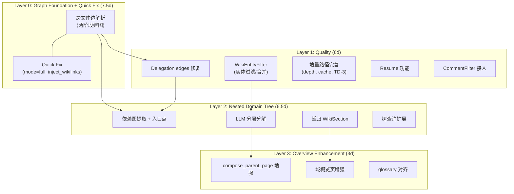
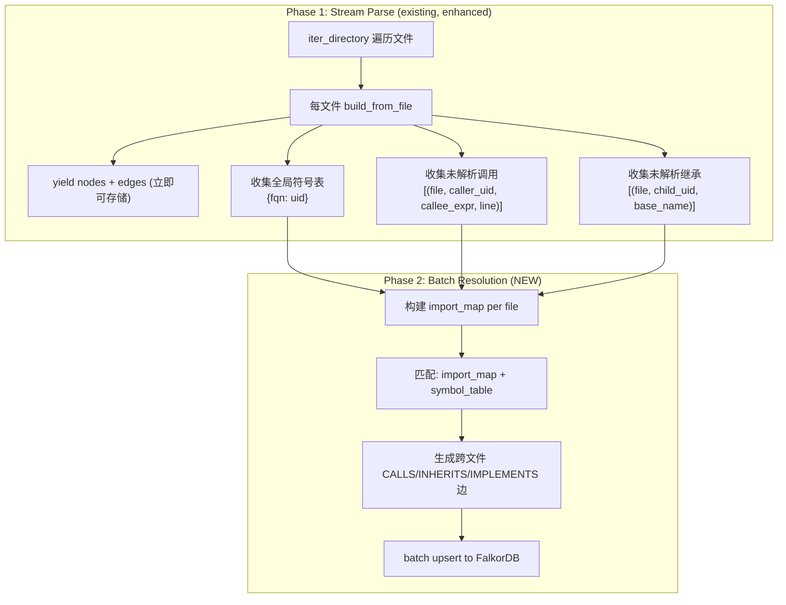
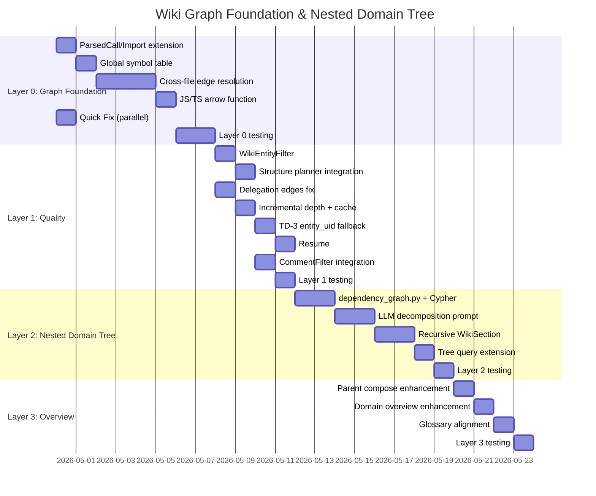

# Wiki Graph Foundation & Nested Domain Tree — Unified Implementation Design

> **Created**: 2026-04-29  
> **Status**: Draft  
> **Scope**: 合并 Prompt Pipeline 剩余项(A) + 嵌套域树形 Wiki 重设计(B)，按依赖关系分 4 层推进  
> **Approach**: Layer 0 (Graph Foundation) → Layer 1 (Quality) → Layer 2 (Nested Domain Tree) → Layer 3 (Overview Enhancement)  
> **References**: [nested-domain-tree-proposal](PROPOSAL_20260429_084030_nested-domain-tree-wiki-redesign.md), [prompt-pipeline-enhancement](2026-04-28-wiki-prompt-pipeline-enhancement-design.md), [hierarchical-generation](2026-04-28-wiki-hierarchical-generation-design.md)

---

## 1. Background

### 1.1 合并动机

两份已有提案存在大量交叉依赖：

- **Prompt Pipeline Enhancement**（A）大部分已实现（6 项 DONE），但有 6 项 PARTIAL
- **Nested Domain Tree Redesign**（B）的 Phase 1 依赖跨文件 CALLS 边（当前缺失），Phase 2 与 A 的 PARTIAL 项重叠

将二者合并为一份按技术依赖排列的统一实施计划，避免重复和冲突。

### 1.2 AST-to-Graph 审阅结论

经过深度审查 `tree_sitter_parser.py`、`code_graph_builder.py`、`import_resolver.py`、`cross_repo_enricher.py`、`schema.py`，并与 CodeWiki/GitNexus 横向对比：

**结论：架构优秀，填充率不足。**

| 维度 | 本系统 | CodeWiki | GitNexus |
|------|:------:|:--------:|:--------:|
| 边类型丰富度 | **4.5/5** | 2.5/5 | 4/5 |
| 跨文件解析 | **1.5/5** | 4/5 | 4.5/5 |
| 跨仓库解析 | **4/5** | 1/5 | 2/5 |
| 图存储 | **5/5** | 2/5 | 4/5 |

**致命短板**：`code_graph_builder.py:649-662` 中 `func_uid_by_name` 只含当前文件函数，跨文件的 `callee_name` 永远匹配不到。`UserController.createUser()` → `UserService.create()` 产生 **零条 CALLS 边**。

**独特优势**（必须保留）：16 种边类型（含 RPC/DI/Entity-Table/Kafka 业务边）、FalkorDB 图数据库、CrossRepoEnricher 跨仓库解析。

### 1.3 Prompt Pipeline PARTIAL 项清单

| 项 | 状态 | 说明 |
|----|------|------|
| 3.1 Fix mode default | PARTIAL | dashboard 已改，`BusinessWikiGenerateBody.mode` API default 未改 |
| 3.3 Incremental context | PARTIAL | 缺 depth ordering、just_generated cache、TD-3 entity_uid fallback |
| 3.5 Progressive persist | PARTIAL | 缺 resume 功能（restart skips saved pages） |
| 4.2 Comment filter | PARTIAL | tier 模型不完整 |
| 4.4 Composer injection | PARTIAL | CommentFilter 未 import/使用于 wiki/ |

---

## 2. Architecture Overview



---

## 3. Layer 0: Graph Foundation + Quick Fix

### 3.1 Two-Phase Graph Building

#### 3.1.1 Problem

`code_graph_builder.py` 的 `_build_graph` 方法逐文件运行，`func_uid_by_name` 只含当前文件的函数。跨文件的 CALLS、INHERITS、IMPLEMENTS 边完全缺失。

#### 3.1.2 Solution: Stream Parse + Batch Resolution



#### 3.1.3 Memory Management

**Phase 1 只收集轻量索引，不保留完整 ParseResult：**

| 数据结构 | 每条目大小 | 10万条 | 说明 |
|---------|----------|-------|------|
| 符号表 `{fqn: uid}` | ~200B | 20MB | Class + Function 的 fqn |
| 未解析调用 | ~150B | 15MB | file + caller_uid + callee_expr + line |
| 未解析继承 | ~120B | 12MB | file + child_uid + base_name |
| **总额外内存** | | **< 50MB** | 5 万文件仓库 |

**不截断**：即使 25 万条未解析调用也只需 37.5MB，全量处理不丢信息。

**符号表优化**：分语言构建独立符号表，减少无效匹配：

```python
symbol_table_by_lang: dict[str, dict[str, str]] = {
    "java": {},
    "python": {},
    "typescript": {},
    "javascript": {},
    "go": {},
}
```

**超大仓兜底**：符号表超过 500MB（约 25 万实体）时，回退到 FalkorDB 临时节点 + Cypher 批量匹配（Strategy C）。

#### 3.1.4 ParsedCall Extension

```python
@dataclass
class ParsedCall:
    caller_name: str
    callee_name: str       # short name (existing)
    receiver_expr: str     # NEW: "self.service.doSomething"
    file: str
    line: int
```

Tree-sitter query 需修改：不再只取最后一个 identifier，而是保留完整的 member expression 或 method invocation。

**Receiver 类型推断策略**（语言分级）:
- **Java**: 优先从 field type 声明推断（`@Autowired UserService userService` → receiver `userService` 类型为 `UserService`），精度最高
- **Python/JS/TS**: 降级为 simple name matching + import symbol 追踪（`from pkg import UserService; self.service = UserService()` → `self.service` 推断为 `UserService`），精度较低但好于零

#### 3.1.5 ParsedImport Extension

```python
@dataclass
class ParsedImport:
    module: str
    alias: str
    symbols: list[str]    # NEW: ["UserService", "OrderDTO"]
    file: str
    line: int
    language: str
```

Python: `from pkg import A, B` → `symbols=["A", "B"]`
Java: `import com.example.UserService` → `symbols=["UserService"]`
JS/TS: `import { A, B } from './module'` → `symbols=["A", "B"]`

#### 3.1.6 Global Symbol Table Builder

```python
def _build_global_symbol_table(
    self, all_nodes: list[GraphNode],
) -> dict[str, dict[str, str]]:
    """Build per-language {fqn: node_uid} for all Class and Function nodes."""
    tables: dict[str, dict[str, str]] = {}
    for node in all_nodes:
        lang = node.properties.get("language", "")
        fqn = node.properties.get("fqn", "")
        if fqn and node.label in (NodeLabel.CLASS, NodeLabel.FUNCTION):
            tables.setdefault(lang, {})[fqn] = node.uid
        name = node.properties.get("name", "")
        if name and node.label in (NodeLabel.CLASS, NodeLabel.FUNCTION):
            tables.setdefault(lang, {}).setdefault(name, node.uid)
    return tables
```

#### 3.1.7 Import Map Builder

For each file, build a local `{imported_symbol: fqn}` mapping using the file's import statements:

```python
def _build_import_map(
    self, imports: list[ParsedImport], file_path: str, 
    symbol_table: dict[str, str],
) -> dict[str, str]:
    """Map imported symbol names to their fqn/uid for this file's scope."""
    result: dict[str, str] = {}
    for imp in imports:
        for sym in imp.symbols:
            # Try module.symbol as fqn
            candidate_fqn = f"{imp.module}.{sym}" if imp.module else sym
            if candidate_fqn in symbol_table:
                result[sym] = symbol_table[candidate_fqn]
            elif sym in symbol_table:
                result[sym] = symbol_table[sym]
    return result
```

#### 3.1.8 Cross-File Edge Resolution (Phase 2 core)

```python
def _resolve_cross_file_edges(
    self,
    per_file_data: list[CrossFileData],
    symbol_tables: dict[str, dict[str, str]],
) -> list[GraphEdge]:
    edges: list[GraphEdge] = []
    for data in per_file_data:
        lang = data.language
        table = symbol_tables.get(lang, {})
        import_map = self._build_import_map(data.imports, data.file_path, table)
        
        for call in data.unresolved_calls:
            target_uid = self._resolve_call_target(call, import_map, table)
            if target_uid and call.caller_uid != target_uid:
                edges.append(GraphEdge(
                    edge_type=EdgeType.CALLS,
                    source_uid=call.caller_uid,
                    target_uid=target_uid,
                    properties={"line": call.line, "cross_file": True},
                ))
        
        for inherit in data.unresolved_inherits:
            target_uid = import_map.get(inherit.base_name) or table.get(inherit.base_name)
            if target_uid and inherit.child_uid != target_uid:
                edges.append(GraphEdge(
                    edge_type=EdgeType.INHERITS,
                    source_uid=inherit.child_uid,
                    target_uid=target_uid,
                ))
        
        for impl in data.unresolved_implements:
            target_uid = import_map.get(impl.iface_name) or table.get(impl.iface_name)
            if target_uid and impl.child_uid != target_uid:
                edges.append(GraphEdge(
                    edge_type=EdgeType.IMPLEMENTS,
                    source_uid=impl.child_uid,
                    target_uid=target_uid,
                ))
    
    return edges
```

#### 3.1.9 JS/TS Arrow Function Extraction

**只提取 module-level 的箭头函数**（顶层 lexical_declaration），不提取嵌套在函数内部或作为 callback 参数的箭头函数。

新增 tree-sitter query（仅匹配 root children）:

```
(lexical_declaration
  (variable_declarator
    name: (identifier) @func.name
    value: (arrow_function) @func.def))
```

同时处理 `export default`:

```
(export_statement
  (lexical_declaration
    (variable_declarator
      name: (identifier) @func.name
      value: (arrow_function) @func.def)))
```

**过滤**：在 `_extract_functions` 中检查匹配节点的 parent chain，确保只取 `program` 直接子节点或 `export_statement` → `program` 的路径。

### 3.2 Quick Fix（可与 3.1 并行）

| 任务 | 文件 | 改动 |
|------|------|------|
| API mode 默认值对齐 | `api/models/wiki_models.py` | `BusinessWikiGenerateBody.mode` default → `"full"` |
| inject_wikilinks 接入 | `wiki/service.py` | compose 完成后调用 `inject_wikilinks()` |

### 3.3 Layer 0 File Inventory

| 文件 | 改动类型 |
|------|---------|
| `indexer/tree_sitter_parser.py` | 修改: ParsedCall + receiver_expr, ParsedImport + symbols, arrow function query |
| `indexer/code_graph_builder.py` | 修改: _build_global_symbol_table, _resolve_cross_file_edges, iter_directory 两阶段 |
| `store/indexer_store.py` | 修改: 新增 upsert_edges_batch |
| `api/models/wiki_models.py` | 修改: mode default |
| `wiki/service.py` | 修改: inject_wikilinks 调用 |

**接口兼容策略**：保持现有 `iter_directory()` 签名不变。新增 `iter_directory_with_cross_file()` 方法，在内部调用 `iter_directory()` + Phase 2 全局解析。调用方按需选择。

### 3.4 Layer 0 Test Plan

| Test | What | How |
|------|------|-----|
| 跨文件 CALLS (Java) | Controller→Service CALLS 边 | 集成: 索引 2 文件 Spring Boot 项目 |
| 跨文件 CALLS (Python) | service.method() CALLS 边 | 集成: 索引 2 文件 Python 项目 |
| 跨文件 INHERITS | `class Impl extends Base` (不同文件) | 集成: 验证 INHERITS 边 |
| 跨文件 IMPLEMENTS | `class Impl implements Iface` (不同文件) | 集成: 验证 IMPLEMENTS 边 |
| 符号表完整性 | 所有 fqn 节点被索引 | 单元: build_global_symbol_table |
| 箭头函数 | `const fn = () => {}` | 单元: 解析 TS 文件 |
| 内存监控 | 大仓场景 | 集成: 5000 文件 mock，监控内存 |
| 向后兼容 | 同文件 CALLS 仍工作 | 回归: 现有测试套件 |

---

## 4. Layer 1: Quality Enhancement

### 4.1 WikiEntityFilter — 实体过滤

**新文件**: `wiki/entity_filter.py`

```python
class EntityStrategy(StrEnum):
    FULL_PAGE = "full_page"
    STANDARD_PAGE = "standard"
    MERGE_TO_PARENT = "merge"

class WikiEntityFilter:
    def classify(self, node: GraphNode, edge_count: int, children_count: int) -> EntityStrategy:
        # MERGE conditions (any match → merge to parent):
        # - Enum class (is_interface=False, methods_count=0)
        # - Trivial function (end_line - start_line < 5, no CALLS out)
        # - Constant holder (only static final fields)
        # - Pure delegation (all methods call single target)
```

**与 ImportanceTier 的映射关系**:

| ImportanceTier | 实体特征 | → EntityStrategy |
|---------------|---------|-----------------|
| SKELETON | 小实体（enum/constant/trivial） | MERGE_TO_PARENT |
| SKELETON | 大实体（有子节点/多方法） | STANDARD_PAGE (用 SKELETON template) |
| STANDARD | — | STANDARD_PAGE |
| CORE | — | FULL_PAGE |

**集成**: `wiki/structure_planner.py` `_build_module_tree` 在创建子节点页面前调用。被过滤实体信息附加到父模块页面的 `## Auxiliary Entities` 章节。

### 4.2 Delegation edges 修复

**文件**: `wiki/service.py`

```python
# Before:
groups = group_children_by_graph(child_nodes, edges=[])

# After:
inter_child_edges = await self._store.find_edges_between(
    repository, [c.entity_uid for c in child_nodes],
    edge_types=[EdgeType.CALLS, EdgeType.IMPORTS]
)
groups = group_children_by_graph(child_nodes, edges=inter_child_edges)
```

需新增 `find_edges_between` Cypher 查询:

```cypher
MATCH (a)-[r]->(b)
WHERE a.uid IN $uids AND b.uid IN $uids
  AND type(r) IN $edge_types
RETURN a.uid, type(r), b.uid
```

### 4.3 Incremental Path Enhancement

**Depth ordering**: 按 CONTAINS 边深度排序（leaves first）:

```python
sorted_uids = self._sort_by_depth(affected_uids, contains_edges)
just_generated: dict[str, WikiPage] = {}
for uid in sorted_uids:
    parent_context = just_generated.get(parent_uid) or existing_page
    page = await composer.compose_page(..., parent_context=parent_context)
    just_generated[uid] = page
```

**TD-3**: `_link_pages_to_tree` 增加 `entity_uid` fallback:

```python
# Before: match by page.title only
# After: try entity_uid first, then title fallback
page = pages_by_entity_uid.get(entity_uid) or pages_by_title.get(title)
```

### 4.4 Resume

```python
if resume_enabled:
    existing = await self._load_existing_page_hashes(repository)
    for node in leaves:
        if node.path in existing and existing[node.path] == current_hash:
            summary_index[node.path] = await self._load_existing_summary(node.path)
            continue
```

### 4.5 CommentFilter Integration

Complete tier model in `indexer/comment_filter.py`:

```python
class CommentTier(Enum):
    STRUCTURED_DOC = 1    # JSDoc/Javadoc/docstring
    FILE_HEADER = 2       # Module/class-level doc
    BLOCK_COMMENT = 3     # Significant block comments
    INLINE = 4            # Meaningful inline
    NEVER = 99            # License, boilerplate, commented-out code
```

Wire into `wiki/composer.py` `_entity_digest`:

```python
from indexer.comment_filter import CommentFilter, CommentTier
filter_instance = CommentFilter()

if config.comment_injection_tier >= CommentTier.STRUCTURED_DOC.value:
    # inject structured docs (already partially done via docstring)
if config.comment_injection_tier >= CommentTier.FILE_HEADER.value:
    module_doc = n.properties.get("docstring", "")
    if module_doc and filter_instance.classify(module_doc) <= CommentTier.FILE_HEADER:
        lines.append(f"- Module documentation: {module_doc[:config.comment_max_chars]}")
```

### 4.6 Layer 1 File Inventory

| 文件 | 改动类型 |
|------|---------|
| `wiki/entity_filter.py` | 新文件 |
| `wiki/structure_planner.py` | 修改: 接入 EntityFilter |
| `wiki/service.py` | 修改: delegation edges, depth ordering, just_generated, TD-3, resume |
| `store/falkordb_store.py` | 修改: find_edges_between query |
| `indexer/comment_filter.py` | 修改: 完善 tier 模型 |
| `wiki/composer.py` | 修改: CommentFilter 接入 |

---

## 5. Layer 2: Nested Domain Tree

### 5.1 Module Dependency Graph

**新文件**: `wiki/dependency_graph.py`

```python
@dataclass
class ModuleGraph:
    modules: list[ModuleInfo]           # name, path, summary, roles, annotations
    edges: list[ModuleEdge]             # source, target, edge_type, weight
    entry_points: list[str]             # zero in-degree CALLS + semantic_roles match

class ModuleDependencyGraph:
    async def build(self, repository: str) -> ModuleGraph:
        # 1. Query all Module nodes
        # 2. Aggregate function-level CALLS to module-level
        # 3. Query Module→Module IMPORTS
        # 4. Topological sort → entry points (zero in-degree CALLS)
        # 5. Supplement with semantic_roles match:
        #    - HTTP entry: controller/endpoint
        #    - RPC entry: rpc_provider (@MoaProvider, @DubboService)
        #    - Async entry: message_listener (@KafkaListener)
        #    - Scheduler entry: scheduled_task (@Scheduled)
        # 6. Heuristic: module name contains controller/endpoint/handler/main/gateway
```

**Key Cypher** (module-level CALLS aggregation):

```cypher
MATCH (m1:Module {repository: $repo})-[:CONTAINS*1..3]->(f1)
      -[:CALLS]->(f2)<-[:CONTAINS*1..3]-(m2:Module {repository: $repo})
WHERE m1 <> m2
RETURN m1.name AS source, m2.name AS target, count(*) AS weight
ORDER BY weight DESC
```

#### 5.1.2 RPC 入口点增强 (@MoaProvider/@DubboService)

本系统服务大量采用内部 RPC 框架（Moa/Dubbo），`@MoaProvider` 注解标注在实现类上，表示该类对外提供 RPC 服务。这类类是**核心入口点**，在 Wiki 生成中具有特殊地位：

**已有能力（直接复用）**：
- `annotation_semantics.py` 已将 `@MoaProvider` 映射为 `SemanticRole.RPC_PROVIDER`
- `cross_repo_enricher.py` 已解析 `@MoaProvider(uri=...)` 的 `uri` 参数，建立跨仓库 RPC CALLS 边
- `graph_enricher.py` 已在 enrichment 阶段识别 RPC provider 并设置 `rpc_interface` 属性

**Wiki 生成增强**：

1. **入口点识别**：`ModuleDependencyGraph.build()` 在步骤 5 中，将 `semantic_roles` 包含 `rpc_provider` 的模块标记为入口点。RPC Provider 类与 HTTP Controller 同等优先级。

2. **域分类权重**：在 LLM 分层分解时，RPC Provider 模块的描述中注入其 `rpc_interface`（即服务的接口 FQN），帮助 LLM 理解该模块的业务边界：
   ```python
   # ModuleReprBuilder.build() P0 层级
   if "rpc_provider" in module.semantic_roles:
       rpc_iface = module.properties.get("rpc_interface", "")
       if rpc_iface:
           lines.append(f"  RPC Interface: {rpc_iface}")
   ```

3. **Wiki 页面增强**：`@MoaProvider` 类的 Wiki 页面自动注入：
   - RPC 接口 FQN
   - 所有 `@MoaConsumer` 调用者（跨仓库 RPC CALLS 反向查询）
   - 方法列表按 RPC 接口方法对应关系组织

4. **God Class 豁免**：标注了 `@MoaProvider` 的类即使方法数量多、import 多，也**不应**被 `HubNodeDetector` 降权，因为它们是核心业务入口。在 hub detection whitelist 中加入：
   ```python
   # HubNodeDetector.detect_hubs() whitelist
   WHITELIST_ROLES = {"rpc_provider", "http_controller", "message_listener"}
   ```

### 5.2 LLM Hierarchical Decomposition

**Refactor**: `wiki/cross_repo_domain_planner.py`

#### 5.2.1 Module Representation (Token-Budget Aware)

```python
class ModuleReprBuilder:
    MAX_TOKENS_PER_BATCH = 30_000

    def build(self, module: ModuleInfo, budget: TokenBudget) -> str:
        lines = [f"Module: {module.name}"]
        
        # P0 (always included, ~50 tokens):
        if module.semantic_roles:
            lines.append(f"  Role: {', '.join(module.semantic_roles)}")
        if "rpc_provider" in (module.semantic_roles or []):
            rpc_iface = module.properties.get("rpc_interface", "")
            if rpc_iface:
                lines.append(f"  RPC Interface: {rpc_iface}")
        lines.append(f"  Deps OUT: {module.calls_out[:10]}")
        lines.append(f"  Deps IN: {module.called_by[:10]}")
        
        # P1 (if budget allows, ~100 tokens):
        if budget.allows_p1():
            summary = module.summary or module.docstring
            lines.append(f"  Summary: {summary[:300]}")
        
        # P2 (if budget allows, ~80 tokens):
        if budget.allows_p2():
            lines.append(f"  Key classes: {module.top_classes[:5]}")
            lines.append(f"  Annotations: {module.annotations[:5]}")
        
        return "\n".join(lines)
```

#### 5.2.2 Batch Strategy (Token-Driven)

| Module count | Estimated tokens | Strategy |
|-------------|:----------------:|----------|
| ≤ 50 | ≤ 30K | Single pass |
| 51-200 | 30-120K | Batch decompose (pre-cluster by IMPORTS) + merge |
| > 200 | > 120K | Three-level recursive decompose |

```python
class HierarchicalDecomposer:
    async def decompose(self, modules: list[ModuleInfo], graph: ModuleGraph) -> DomainTree:
        estimated = self._estimate_tokens(modules, graph)
        
        if estimated <= self.MAX_TOKENS_PER_BATCH:
            return await self._single_pass(modules, graph)
        
        batch_count = math.ceil(estimated / self.MAX_TOKENS_PER_BATCH)
        # pre_cluster: 基于 IMPORTS 边的弱连通分量，大分量二分拆分至 batch_count
        pre_clusters = self._pre_cluster_by_imports(modules, graph, batch_count)
        trees = [await self._single_pass(c.modules, graph) for c in pre_clusters]
        return await self._merge_domains(trees)
```

#### 5.2.3 Hub Node Handling

```python
class HubNodeDetector:
    def detect_hubs(self, graph: ModuleGraph, percentile: float = 90) -> list[str]:
        degrees = sorted(
            [(m.name, len(graph.calls_out.get(m.name, [])) + len(graph.called_by.get(m.name, [])))
             for m in graph.modules],
            key=lambda x: x[1],
        )
        idx = int(len(degrees) * percentile / 100)
        threshold = degrees[idx][1] if idx < len(degrees) else float("inf")
        return [m for m, d in degrees if d > threshold]
    
    def prepare(self, graph: ModuleGraph) -> tuple[ModuleGraph, list[HubInfo]]:
        hubs = self.detect_hubs(graph)
        reduced = graph.remove_nodes(hubs)
        return reduced, [HubInfo(name=h, domain="__infrastructure__") for h in hubs]
```

#### 5.2.4 Dynamic Depth Control

```python
# Config
max_domain_depth: int = 4             # configurable, recommended 3-5
min_modules_for_nesting: int = 3      # don't nest if < 3 modules

# LLM prompt constraint
"""
## Constraints
- Maximum tree depth: {max_depth} levels
- Only create a sub-domain if it contains >= {min_modules} modules
- Prefer flatter trees when modules are loosely related
"""
```

#### 5.2.5 God Class Handling

For classes with 30+ methods, three-level treatment:

**Domain classification**: Hub detection + downweight (§5.2.3)

**Wiki page**: Method grouping:

```python
class LargeClassStrategy:
    METHOD_GROUP_THRESHOLD = 30
    
    def group_methods(self, methods: list[GraphNode]) -> list[MethodGroup]:
        # Strategy 1: Semantic role grouping
        #   CRUD: create*/add* → "Creation", get*/find* → "Query"
        # Strategy 2: Annotation grouping
        #   @RequestMapping → "API Endpoints", @Scheduled → "Tasks"
        # Strategy 3: Call chain grouping
        #   A→B→C in same class → one group
```

**LLM prompt**: Top-N important methods + grouped summary for rest:

```python
class ClassPromptBuilder:
    MAX_METHODS = 20
    
    def build(self, class_node, methods):
        if len(methods) <= self.MAX_METHODS:
            return self._full_prompt(methods)
        
        top = self._rank_by_importance(methods)[:self.MAX_METHODS]
        rest_groups = self._group_remaining([m for m in methods if m not in top])
        return self._full_prompt(top) + self._group_summary(rest_groups)
    
    def _rank_by_importance(self, methods):
        # CALLS in-degree × 2
        # API endpoint annotation × 3
        # Event handler × 2
        # Has Javadoc × 1
        # LOC > 20 × 1
```

### 5.3 Recursive WikiSection Construction

Refactor `_link_pages_to_tree` to recursive version:

```python
async def _link_pages_to_nested_tree(
    self,
    business_id: str,
    domain_tree: list[DomainNode],
    pages_by_entity_uid: dict[str, WikiPage],
    tree_builder: WikiTreeBuilder,
) -> None:
    async def _link_domain(parent_uid: str, domain: DomainNode, sort_idx: int):
        section_uid = tree_builder.generate_domain_section_uid(business_id, domain.name)
        await self._wiki_store.upsert_wiki_section(...)
        await self._wiki_store.add_has_child_edge(parent_uid, section_uid, ...)
        
        for module_name in domain.modules:
            page = pages_by_entity_uid.get(module_name)  # entity_uid match
            if page:
                await self._wiki_store.add_has_child_edge(section_uid, page["uid"], ...)
        
        for i, child in enumerate(domain.children):
            await _link_domain(section_uid, child, i)
```

### 5.4 Tree Query Extension

`store/wiki_tree_store.py`: Support multi-level HAS_CHILD traversal:

```cypher
MATCH path = (root:WikiSection {uid: $root_uid})-[:HAS_CHILD*1..{max_depth}]->(child)
RETURN path
ORDER BY length(path)
```

### 5.5 Layer 2 File Inventory

| 文件 | 改动类型 |
|------|---------|
| `wiki/dependency_graph.py` | 新文件 |
| `wiki/cross_repo_domain_planner.py` | 重构: LLM 分层分解 prompt |
| `wiki/service.py` | 修改: _link_pages_to_nested_tree |
| `store/wiki_tree_store.py` | 修改: 多层 HAS_CHILD 查询 |
| `store/falkordb_store.py` | 修改: module-level CALLS aggregation Cypher |
| `wiki/entity_filter.py` | 修改: LargeClassStrategy, HubNodeDetector |
| `wiki/business_domain_planner.py` | 修改: 复用分层分解逻辑（单仓库 scope）|

**单仓库 vs 跨仓库**：`HierarchicalDecomposer` 的核心逻辑（依赖图提取 + LLM 分解 + 递归建树）对两者通用，区别仅在于 scope（单仓 `repository=$repo` vs 跨仓 `repository IN $repos`）。`BusinessDomainPlanner` 和 `CrossRepoBusinessDomainPlanner` 共享同一个 `HierarchicalDecomposer` 实例。

---

## 6. Layer 3: Overview Enhancement

### 6.1 Parent Compose Enhancement

Inject inter-child CALLS/IMPORTS edges + multi-stage synthesis prompt (inspired by CodeWiki §3.3):

```python
_PARENT_SYSTEM_PROMPT_V2 = (
    "You are a senior architect synthesizing module documentation. "
    "You receive child component summaries AND their inter-dependencies. "
    "Generate a cohesive module overview with these sections:\n"
    "1. **Purpose & Responsibility**\n"
    "2. **Architecture Overview** (with Mermaid diagram)\n"
    "3. **Key Data Flows**\n"
    "4. **Entry Points**\n"
    "5. **Design Patterns**"
)
```

### 6.2 Domain Overview Enhancement

- Nested sub-domain navigation links
- Domain entry point list (from Phase 1 entry point identification)
- Module collaboration Mermaid diagram
- LLM generates domain-level architectural narrative

### 6.3 Glossary Alignment

Fix `build_glossary` parameter shape in incremental path to match full generation path.

### 6.4 Layer 3 File Inventory

| 文件 | 改动类型 |
|------|---------|
| `wiki/composer.py` | 修改: _PARENT_SYSTEM_PROMPT_V2, inter-child edges injection |
| `wiki/domain_overview_composer.py` | 修改: 嵌套子域导航 + 入口点 |
| `wiki/service.py` | 修改: glossary 参数对齐 |

---

## 7. Configuration

```python
# config.py AppWikiFlags additions

# Layer 0: Cross-file resolution
cross_file_resolution_enabled: bool = True
cross_file_max_unresolved: int = 0         # 0 = no limit
cross_file_fallback_to_db: bool = True     # FalkorDB fallback for huge repos

# Layer 1: Entity filtering
entity_filter_enabled: bool = True
large_class_method_threshold: int = 30
large_class_top_methods: int = 20

# Layer 2: Domain tree
max_domain_depth: int = 4
min_modules_for_nesting: int = 3
hub_detection_percentile: float = 90
decomposition_max_tokens_per_batch: int = 30_000

# Layer 2: Resume
resume_from_saved: bool = False
```

---

## 8. Implementation Timeline



**Total: ~23 working days**

---

## 9. Risk Assessment

| Risk | Probability | Impact | Mitigation |
|------|:----------:|:------:|------------|
| Cross-file CALLS resolution accuracy insufficient | Medium | High | fqn + import tracking dual match; tolerate partial (better than zero) |
| Memory pressure on huge repos (symbol table) | Low | Medium | Per-language tables; FalkorDB fallback at 500MB |
| LLM nested tree JSON parse failure | Medium | Medium | Retain flat classification as fallback; retry + JSON repair |
| Module-level CALLS Cypher query slow | Medium | Medium | Limit CONTAINS expansion to 3 levels; cache results |
| Hub detection removes important modules | Low | Medium | Whitelist ROLES={rpc_provider, http_controller, message_listener}; conservative P90 threshold |
| God Class method grouping incoherent | Medium | Low | Prefer annotation-based grouping; fallback to alphabetical |
| Token budget overflow in LLM decomposition | Medium | Medium | Batch strategy auto-scales; P0/P1/P2 priority trimming |
| Arrow function extraction false positives | Low | Low | Only match variable_declarator + arrow_function combo |
| Parallel Layer 0 Quick Fix conflicts with main work | Low | Low | Quick Fix touches different files |

---

## 10. Decision Log

> Awaiting user approval.
