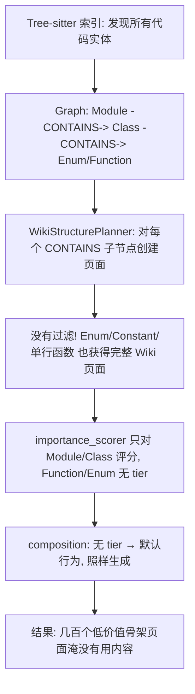
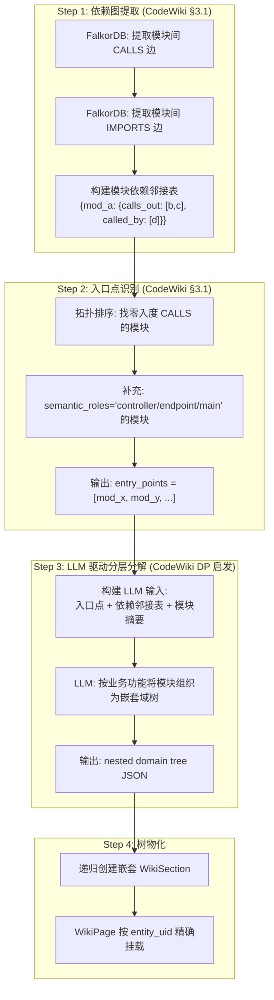
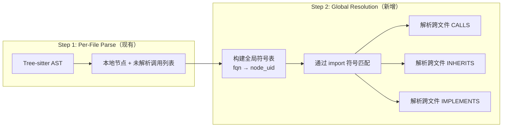
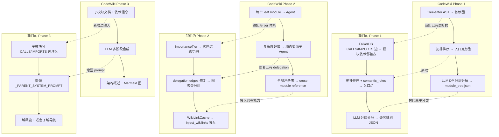

# 提案：嵌套业务域树型 Wiki 重设计 + 页面质量治理

> **Created**: 2026-04-29  
> **Status**: AwaitingApproval  
> **Scope**: Wiki 域分类重构 + 页面质量提升 + 交叉引用补全  
> **References**: [wiki-gap-analysis](../../wiki-gap-analysis-deepwiki-codewiki.md), [prompt-pipeline-enhancement](2026-04-28-wiki-prompt-pipeline-enhancement-design.md)

---

## 1. 问题诊断

### 1.1 域分类：只有一层扁平桶，不是真正的业务模块树

**现状代码路径**：

```
CrossRepoBusinessDomainPlanner.classify()
  → LLM 返回 { "domain_A": [(repo, mod), ...], "domain_B": [...] }
  → _link_pages_to_tree() 创建 WikiSpace → WikiSection(domain) → WikiPage (扁平)
```

**核心问题**：

| # | 问题 | 代码位置 | 影响 |
|---|------|---------|------|
| D1 | LLM prompt 只要求输出 `domain → [modules]` 单层映射，无子域概念 | `cross_repo_domain_planner.py:158-167` | 100+ 模块混在一个域下，无业务模块层级 |
| D2 | `_link_pages_to_tree()` 把所有 WikiPage 扁平挂在 WikiSection 下 | `service.py:1291-1336` | sidebar 树没有嵌套，无法体现 controller→service→dao 的业务调用链 |
| D3 | 域分类只用模块的 `name` + `business_summary` 两个信号，未利用图中的 CALLS/IMPORTS/INHERITS 依赖边 | `cross_repo_domain_planner.py:146-157` | LLM 缺乏依赖拓扑信息，分类质量全靠名字猜测 |
| D4 | 域匹配用 `page.title` 而非 `entity_uid`，fallback 逻辑取第一个同 repo 的域 | `service.py:1309-1315` | 非 Module 页面（Class、Function）可能被错误分配到随机域 |
| D5 | 无增量域分类（`classify_incremental` 只存在于设计文档） | — | 每次全量重分类，代价高 |

**对标分析**：

| 系统 | 域/主题组织方式 |
|------|----------------|
| **DeepWiki** | LLM 先从 repo 结构生成全局目录，再递归按主题分组，生成嵌套 wiki 树 |
| **CodeWiki** (ACL 2026) | DP 启发的分层分解：从入口点（main, API endpoint）出发，按调用链深度建立层级 |
| **GitNexus** | 基于代码依赖图的社区检测算法（Louvain / Leiden）自动发现模块边界 |
| **本系统** | 扁平 LLM 分类桶 → 无层级 |

### 1.2 页面质量问题：骨架页 + 枚举爆炸 + 零交叉引用

**直接原因分析**：

| # | 现象 | 根因 | 代码位置 |
|---|------|------|---------|
| Q1 | 大量页面只有骨架（"The X module organizes part of the codebase."） | `useWikiRegenerate.ts` 增量模式默认 `mode=structure`，跳过 LLM | `dashboard/src/hooks/useWikiRegenerate.ts:155` |
| Q2 | 枚举值、单函数、trivial 常量都单独一个页面 | `WikiStructurePlanner._build_module_tree` 对所有 CONTAINS 子节点一律生成页面，无过滤 | `structure_planner.py:113-122` |
| Q3 | 有内容的页面之间没有互相关联 | `WikiReferenceGenerator.inject_wikilinks` 实现了但**未被主管道调用** | `reference_generator.py:70-85`（存在但未接入 `service.py`） |
| Q4 | Parent 聚合页质量低，只是子页面摘要的拼接 | `_PARENT_SYSTEM_PROMPT` 过于通用，子模块间边信息未注入 | `composer.py:35-39, 322-385` |
| Q5 | 增量生成路径不传 `parent_context` 和 `glossary` | 增量路径调用 `compose_page` 时缺少这两个参数 | `service.py:generate_incremental` |
| Q6 | `trigger_enrichment` 是空操作 | 只统计数量，不实际执行 | `service.py` |
| Q7 | Backlinks (`## Referenced by`) 只有引用方名字，无业务语义 | `backlink_builder.py` 从 CALLS/IMPORTS 边收集，但无 LLM 增强 | `backlink_builder.py:14-44` |

**枚举爆炸的具体机制**：



### 1.3 为什么当前实现不合理 — 根因总结

**核心矛盾**：系统有强大的图基础设施（FalkorDB、CALLS/IMPORTS/INHERITS 边、增量 diff），但 Wiki 生成管道**几乎不利用图的拓扑信息**：

1. **域分类不看依赖图**：只把模块名+摘要丢给 LLM，等于让 LLM 从名字猜业务分组，而图中清楚记录了谁调用谁
2. **结构规划不过滤实体**：把图中每个节点都变成页面，不区分核心实体和辅助实体
3. **交叉引用信号被浪费**：`WIKI_REFERENCES` 边已生成，`inject_wikilinks` 已实现，但管道没有接入
4. **增量路径和全量路径的上下文差异**：增量应该是全量的"精准子集"，而非"降级版"

---

## 1.4 AST-to-Graph 基础设施差距审阅

> **2026-04-29 补充**：在设计 Phase 1 "依赖图提取 + 入口点识别"之前，需要先审查图数据基础设施是否满足需求。

### 审阅结论：架构优秀，填充率不足

| 维度 | 本系统 | CodeWiki | GitNexus |
|------|:------:|:--------:|:--------:|
| 解析器质量 | 3.5/5 | 4/5 | 4.5/5 |
| 节点类型丰富度 | 4/5 | 3/5 | 4.5/5 |
| 边类型丰富度 | **4.5/5** | 2.5/5 | 4/5 |
| 跨文件解析 | **1.5/5** | 4/5 | 4.5/5 |
| 跨仓库解析 | **4/5** | 1/5 | 2/5 |
| 图存储 | **5/5** | 2/5 | 4/5 |

### 独特优势（必须保留）

1. **Schema 最丰富** — 16 种边类型（含 PROVIDES_RPC, CONSUMES_RPC, CROSS_REPO_CALLS, DEPENDS_ON, ACCESSES_TABLE, EVENT_PRODUCES/CONSUMES），CodeWiki 只有 1 种 depends_on
2. **FalkorDB 图数据库** — Cypher 查询能力，CodeWiki 只用 JSON 文件
3. **CrossRepoEnricher 跨仓库解析独一无二** — Dubbo/Moa RPC, Spring DI, Entity-Table, Kafka 事件链路
4. **节点属性丰富** — fqn, annotations, semantic_roles, parameters, return_type, complexity

### 致命短板：跨文件 CALLS 完全缺失

**根因**（`code_graph_builder.py:649-662`）：

```python
for call in result.calls:
    caller_uids = func_uid_by_name.get(call.caller_name, [])    # 只含当前文件函数
    callee_uids = func_uid_by_name.get(call.callee_name, [])    # 跨文件的 callee 永远匹配不到
    if not caller_uids or not callee_uids:
        continue  # ← 跨文件调用全部在此处被丢弃
```

- `func_uid_by_name` 只包含当前文件的函数
- `ParsedCall.callee_name` 只取最后一个 identifier（如 `service.doSomething()` → `doSomething`）
- 结果：`UserController.createUser()` → `UserService.create()` **产生零条 CALLS 边**

### 对本提案的直接影响

| 影响 | 阻塞的功能 |
|------|----------|
| Phase 1 的 Cypher 查询（§2.1.1）通过 `CALLS` 边聚合模块间调用关系 → **跨文件 CALLS 缺失意味着查询结果为空** | 模块依赖图提取 |
| Phase 1 的拓扑排序（§2.1.2）依赖完整调用图找零入度入口点 → **不完整的调用图导致入口点识别不准** | 入口点识别 |
| Phase 2 的 `group_children_by_graph`（§2.2.2）需要真实 CALLS 边 → **当前 `edges=[]` 的根因之一** | delegation 图聚类 |
| Phase 3 的子模块间依赖边注入（§2.3.1）→ **无跨文件边可注入** | Parent 页面质量 |

### 其他差距点

| # | 差距 | 影响级别 |
|---|------|---------|
| 1 | INHERITS/IMPLEMENTS 只解析同文件 | 高 — 类层级图不完整 |
| 2 | JS/TS 箭头函数不提取 | 中 — 现代前端项目大量丢失 |
| 3 | Import 只记录模块名不记录具体符号 | 中 — 无法追踪具体导入的类/函数 |
| 4 | USES_TYPE 边定义了但从未生产 | 低 — 类型引用关系缺失 |
| 5 | Go package 靠目录名猜测 | 低 — 多包目录不准确 |

---

## 2. 设计方案（主要参考 CodeWiki 实现）

> **核心理念**：借鉴 CodeWiki 的三阶段架构（Repository Analysis → Recursive Generation → Hierarchical Assembly），将其核心创新（依赖图驱动的分层分解、复杂度自适应、层级聚合）适配到我们的图数据库基础设施上。

### 2.0 Phase 0：Quick Fix（0.5 天）

| 修复 | 文件 | 改动 |
|------|------|------|
| `mode=structure` → `mode=full` | `dashboard/src/hooks/useWikiRegenerate.ts:155` | 一行改动 |
| `inject_wikilinks()` 接入主管道 | `wiki/service.py` compose 完成后 | 调用已实现的方法 |

### 2.1 Phase 1：CodeWiki-style 分层分解（5-7 天）

**对标 CodeWiki Phase 1**: Repository Analysis + Hierarchical Module Decomposition



#### 2.1.1 依赖图提取（新增 `wiki/dependency_graph.py`）

```python
class ModuleDependencyGraph:
    """从 FalkorDB 提取模块间依赖关系，构建拓扑结构。"""

    async def build(self, repository: str) -> ModuleGraph:
        """
        Returns:
            ModuleGraph with:
            - modules: list of module info (name, path, summary, semantic_roles)
            - edges: list of (source_mod, target_mod, edge_type, weight)
            - entry_points: modules with zero in-degree CALLS or role=controller/endpoint
        """
        # 1. 查询所有 Module 节点
        # 2. 查询 Module→Module 的 CALLS 边（聚合函数级调用到模块级）
        # 3. 查询 Module→Module 的 IMPORTS 边
        # 4. 拓扑排序找入口点
        # 5. 补充 semantic_roles 匹配
```

**关键 Cypher**（模块间 CALLS 聚合）：

```cypher
MATCH (m1:Module {repository: $repo})-[:CONTAINS*1..3]->(f1)
      -[:CALLS]->(f2)<-[:CONTAINS*1..3]-(m2:Module {repository: $repo})
WHERE m1 <> m2
RETURN m1.name AS source, m2.name AS target, count(*) AS weight
ORDER BY weight DESC
```

#### 2.1.2 LLM 驱动的分层分解（重构 `CrossRepoBusinessDomainPlanner`）

**对标 CodeWiki `cluster_modules.py`**：CodeWiki 用 LLM 做分层分解决策，只传入 component ID 和依赖关系（不传源码），输出 feature-oriented module tree。

**新 LLM Prompt 模板**（替代当前扁平分类 prompt）：

```
You are a senior architect organizing a codebase into a hierarchical business domain tree.

## Input

### Entry Points (modules with no incoming calls - the system's external interfaces):
{entry_points_json}

### Module Dependency Graph (who calls/imports whom):
{adjacency_json}

### Module Summaries:
{summaries_json}

## Task

Organize these modules into a **nested** business domain tree:
1. Group tightly-coupled modules (many mutual calls/imports) into the same domain
2. Identify parent-child relationships between domains based on call direction
   (e.g. "API Layer" calls "Business Logic" calls "Data Access")
3. Entry points typically form the top-level domains or domain entry nodes
4. Place shared utilities under "__infrastructure__"
5. Maximum tree depth: 3 levels (domain → sub_domain → modules)

## Output Format

Return ONLY valid JSON:
{
  "domains": [
    {
      "name": "User Management",
      "description": "Handles user registration, authentication, and profile management",
      "entry_points": ["UserController", "AuthEndpoint"],
      "modules": ["user_controller", "auth_service"],
      "children": [
        {
          "name": "Authentication",
          "description": "Login, token management, OAuth integration",
          "modules": ["auth_service", "token_manager", "oauth_provider"],
          "children": []
        }
      ]
    }
  ]
}
```

**vs 原提案的图社区检测方案**：

| 维度 | 原提案（图社区检测 + LLM 命名） | 新方案（CodeWiki-style LLM 分层分解） |
|------|-------------------------------|-------------------------------------|
| 分组依据 | 弱连通分量/Louvain 算法 | LLM 理解依赖图 + 业务语义 |
| 嵌套能力 | 算法输出扁平分区，需二次 LLM 嵌套 | LLM 直接输出嵌套树 |
| Hub 节点问题 | 需预处理移除 hub | LLM 自然理解 infrastructure |
| 新依赖 | 可能需要图算法库 | 无新依赖 |
| CodeWiki 对标 | 偏 GitNexus (Leiden) | 直接对标 CodeWiki (cluster_modules.py) |

#### 2.1.3 递归 WikiSection 构建 + 精确匹配

重构 `_link_pages_to_tree`：

```python
async def _link_pages_to_nested_tree(
    self,
    business_id: str,
    domain_tree: list[DomainNode],  # 嵌套树结构
    repo_names: list[str],
    tree_builder: WikiTreeBuilder,
) -> None:
    """递归创建嵌套 WikiSection 并用 entity_uid 挂载 WikiPage。"""
    
    async def _link_domain(parent_uid: str, domain: DomainNode, sort_idx: int) -> None:
        section_uid = tree_builder.generate_domain_section_uid(business_id, domain.name)
        await self._wiki_store.upsert_wiki_section(...)
        await self._wiki_store.add_has_child_edge(
            parent_uid=parent_uid, child_uid=section_uid,
            view_type="business_domain", ...
        )
        # 挂载域内 WikiPage（用 entity_uid 而非 title）
        for module_name in domain.modules:
            page = pages_by_entity_uid.get(module_name)  # 精确匹配
            if page:
                await self._wiki_store.add_has_child_edge(
                    parent_uid=section_uid, child_uid=page["uid"],
                    view_type="business_domain", ...
                )
        # 递归处理子域
        for i, child in enumerate(domain.children):
            await _link_domain(section_uid, child, i)
```

### 2.2 Phase 2：CodeWiki-style 质量增强（4-5 天）

**对标 CodeWiki Phase 2**: Recursive Documentation Generation + Dynamic Delegation

#### 2.2.1 复杂度自适应生成（借鉴 CodeWiki Dynamic Delegation）

**CodeWiki 的做法**：Agent 根据模块复杂度（圈复杂度、嵌套深度、语义多样性）决定是否委派子 Agent。复杂模块获得更深入的处理，简单模块快速处理。

**我们的适配**：利用已有的 `ImportanceTier` 体系（CORE / STANDARD / SKELETON），实现复杂度自适应：

```python
class WikiEntityFilter:
    """借鉴 CodeWiki 的复杂度自适应：决定实体的处理策略。"""

    def classify(self, node: GraphNode, edge_count: int, children_count: int) -> EntityStrategy:
        # CORE 实体（高引用、高连接）: 独立页面 + 详细 prompt
        # STANDARD 实体: 独立页面 + 标准 prompt
        # TRIVIAL 实体: 合并到父模块页面的 '## Auxiliary Entities' 章节
        #   - 枚举类：方法数 == 0 → 合并
        #   - 单行函数：代码行数 < 5 且无调用边 → 合并
        #   - 常量持有类：仅含 static final 字段 → 合并
        #   - 纯转发层：所有方法只调用一个目标 → 合并
```

**不被过滤的实体继续生成独立页面，被过滤的实体信息附加到父模块页面中**——确保信息不丢失，只是呈现方式改变。

#### 2.2.2 修复 delegation edges（启用图聚类分组）

**当前 bug**：`_compose_all_pages` 调用 `group_children_by_graph` 时传入 `edges=[]`（有 TODO 注释），导致图聚类分组从未生效。

**修复**：传入真实的 CALLS/IMPORTS 边：

```python
# 修复前 (service.py ~1710)
groups = group_children_by_graph(child_nodes, edges=[])  # TODO: wire real edges

# 修复后
inter_child_edges = await self._graph.find_edges_between(
    repository, [c.path for c in child_nodes], edge_types=[EdgeType.CALLS, EdgeType.IMPORTS]
)
groups = group_children_by_graph(child_nodes, edges=inter_child_edges)
```

#### 2.2.3 Cross-module Reference Management（借鉴 CodeWiki §3.2）

**CodeWiki 的做法**：全局注册表跟踪已文档化的组件，Agent 遇到外部组件时创建 cross-reference 而非复制内容。

**我们的适配**：

```
WikiReferenceGenerator.generate()  ← 已被调用，创建了 WIKI_REFERENCES 边 ✓
WikiReferenceGenerator.inject_wikilinks()  ← 存在但未接入主管道！只在 tests 中使用 ✗
WikiLinkCache  ← 已有全局注册表能力 ✓
```

**修复**：在 compose 完成后调用 `inject_wikilinks()`，为每个页面追加 `## Related Pages` 章节。WikiLinkCache 充当 CodeWiki 全局注册表的角色。

#### 2.2.4 增量路径上下文对齐

`service.generate_incremental` 调用 `compose_page` 时注入 `parent_context` + `glossary`（与 prompt-pipeline-enhancement P0-4 一致）。

### 2.3 Phase 3：CodeWiki-style 层级聚合（2-3 天）

**对标 CodeWiki Phase 3**: Hierarchical Assembly and Documentation Synthesis

#### 2.3.1 Parent Compose 增强（借鉴 CodeWiki §3.3 多阶段合成）

**CodeWiki 的做法**：Parent 模块通过 LLM 合成，输入包含子模块文档 + module tree + 依赖信息 + 合成指令。多阶段合成：分析主题 → 架构概述 → 功能摘要 → 使用指南 → 架构图。

**改进 `compose_parent_page`**：

```python
_PARENT_SYSTEM_PROMPT_V2 = (
    "You are a senior architect synthesizing module documentation. "
    "You receive child component summaries AND their inter-dependencies. "
    "Generate a cohesive module overview with these sections:\n"
    "1. **Purpose & Responsibility** — What this module owns in the system\n"
    "2. **Architecture Overview** — How child components collaborate (with Mermaid diagram)\n"
    "3. **Key Data Flows** — Primary input/output paths through this module\n"
    "4. **Entry Points** — External interfaces (APIs, events, commands)\n"
    "5. **Design Patterns** — Notable patterns used (MVC, Repository, Event-driven, etc.)\n"
    "Output Markdown."
)
```

**新增：注入子模块间依赖边**：

```python
async def compose_parent_page(self, ...) -> WikiPage:
    # 新增：查询子模块间的 CALLS/IMPORTS 边
    inter_child_edges = await self._graph.find_edges_between(
        repository, [c.path for c in children_summaries], 
        edge_types=[EdgeType.CALLS, EdgeType.IMPORTS]
    )
    edge_summary = self._format_inter_child_edges(inter_child_edges)
    
    prompt = f"{child_summaries_block}\n\n## Inter-component Dependencies\n{edge_summary}"
    # ... LLM 调用 with _PARENT_SYSTEM_PROMPT_V2
```

#### 2.3.2 域概览页增强

- 注入域内模块间的 CALLS/IMPORTS 边摘要
- 对嵌套域，概览页包含子域导航链接
- 展示域内入口点列表（来自 Phase 1 的入口点识别）
- 要求 LLM 生成模块协作 Mermaid 图

---

## 3. 实施清单（CodeWiki 三阶段对照）

### Phase -1: Graph Foundation — 跨文件边解析（7 天）

> **前置条件**：本阶段解决 §1.4 识别的致命短板。必须在 Phase 1 之前完成，否则依赖图提取和入口点识别将基于不完整的图数据。



| # | 任务 | 文件 | 预估 |
|---|------|------|------|
| G.1 | 扩展 `ParsedCall` — 保存完整 receiver expression（`self.service.doSomething` 而非只取 `doSomething`） | `indexer/tree_sitter_parser.py` | 0.5d |
| G.2 | 扩展 `ParsedImport` — 记录具体导入符号（`from X import A, B` 记录 `[A, B]`） | `indexer/tree_sitter_parser.py` | 0.5d |
| G.3 | 新增全局符号表构建 `_build_global_symbol_table()` — `{fqn: node_uid}` 映射 | `indexer/code_graph_builder.py` | 1d |
| G.4 | 新增跨文件边解析 `_resolve_cross_file_edges()` — 两阶段建图的第二阶段 | `indexer/code_graph_builder.py` | 3d |
| G.5 | JS/TS 箭头函数提取 — 添加 `variable_declarator` → `arrow_function` query | `indexer/tree_sitter_parser.py` | 0.5d |
| G.6 | 集成测试 + 回归测试 | `tests/` | 1.5d |

**关键实现细节**：

```python
# Step 3: 全局符号表
def _build_global_symbol_table(self, all_nodes: list[GraphNode]) -> dict[str, str]:
    table: dict[str, str] = {}
    for node in all_nodes:
        fqn = node.properties.get("fqn", "")
        if fqn and node.label in (NodeLabel.CLASS, NodeLabel.FUNCTION):
            table[fqn] = node.uid
        name = node.properties.get("name", "")
        if name and node.label in (NodeLabel.CLASS, NodeLabel.FUNCTION):
            table.setdefault(name, node.uid)  # simple name fallback
    return table

# Step 4: 跨文件解析（在 build_from_directory 收集完所有文件后执行）
def _resolve_cross_file_edges(
    self,
    all_nodes: list[GraphNode],
    per_file_results: list[tuple[str, ParseResult]],
    symbol_table: dict[str, str],
) -> list[GraphEdge]:
    edges: list[GraphEdge] = []
    for file_path, result in per_file_results:
        import_map = self._build_import_map(result, file_path)  # symbol → fqn
        for call in result.calls:
            target_uid = self._resolve_call_target(call, import_map, symbol_table)
            if target_uid:
                caller_uid = symbol_table.get(
                    compute_fqn(file_path, call.caller_name, "Function")
                )
                if caller_uid and caller_uid != target_uid:
                    edges.append(GraphEdge(
                        edge_type=EdgeType.CALLS,
                        source_uid=caller_uid,
                        target_uid=target_uid,
                    ))
        # 同理解析 cross-file INHERITS / IMPLEMENTS ...
    return edges
```

**测试计划**：

| Test | What | How |
|------|------|-----|
| 跨文件 CALLS | Java Controller→Service 产生 CALLS 边 | 集成测试: 索引 2 文件项目，验证边存在 |
| 跨文件 INHERITS | `class Impl extends Base`（不同文件） | 集成测试: 验证 INHERITS 边 |
| 符号表完整性 | 所有带 fqn 的节点被索引 | 单元测试: build_global_symbol_table 覆盖率 |
| 箭头函数 | `const fn = () => {}` 创建 Function 节点 | 单元测试: 解析 TS 文件 |
| 向后兼容 | 已有的同文件 CALLS 仍然工作 | 回归测试: 运行现有测试套件 |

### Phase 0: Quick Fix（0.5 天）

- [ ] P0.1: `useWikiRegenerate.ts` — `mode=structure` → `mode=full`
- [ ] P0.2: `service.py` — 在 compose 完成后调用 `inject_wikilinks()` 接入主管道

### Phase 1: CodeWiki-style 分层分解（5-7 天）

| # | 任务 | CodeWiki 对标 | 文件 |
|---|------|-------------|------|
| P1.1 | 新增 `wiki/dependency_graph.py` — 模块间依赖图提取 + 入口点识别 | §3.1 Dependency Graph + Entry Points | 新文件 |
| P1.2 | 新增 Cypher 查询 — 模块间 CALLS/IMPORTS 聚合 | §3.1 depends_on relation | `store/falkordb_store.py` |
| P1.3 | 重构 `CrossRepoBusinessDomainPlanner` — LLM 分层分解 prompt | §3.1 Hierarchical Decomposition | `wiki/cross_repo_domain_planner.py` |
| P1.4 | 重构 `_link_pages_to_tree()` — 递归嵌套 WikiSection + entity_uid 匹配 | — | `wiki/service.py` |
| P1.5 | 扩展 `get_wiki_tree` — 支持多层 HAS_CHILD 遍历 | — | `store/wiki_tree_store.py` |
| P1.6 | 单元测试 + 集成测试 | — | `tests/` |

### Phase 2: CodeWiki-style 质量增强（4-5 天）

| # | 任务 | CodeWiki 对标 | 文件 |
|---|------|-------------|------|
| P2.1 | 新增 `wiki/entity_filter.py` — 复杂度自适应实体过滤 | §3.2 Dynamic Delegation (复杂度标准) | 新文件 |
| P2.2 | 修改 `_build_module_tree` — 接入过滤器，trivial 实体合并到父页 | §3.2 Delegation criteria | `wiki/structure_planner.py`, `wiki/composer.py` |
| P2.3 | 修复 delegation `edges=[]` — 传入真实 CALLS/IMPORTS 边 | §3.2 dependency graph traversal | `wiki/service.py` |
| P2.4 | 接入 `inject_wikilinks()` + WikiLinkCache 全局注册表 | §3.2 Cross-Module Reference Management | `wiki/service.py` |
| P2.5 | 增量路径 `parent_context` + `glossary` 注入 | — | `wiki/service.py` |
| P2.6 | 测试 | — | `tests/` |

### Phase 3: CodeWiki-style 层级聚合（2-3 天）

| # | 任务 | CodeWiki 对标 | 文件 |
|---|------|-------------|------|
| P3.1 | 增强 `compose_parent_page` — 注入子模块间边 + 多阶段合成 prompt | §3.3 Hierarchical Assembly | `wiki/composer.py` |
| P3.2 | 增强 `DomainOverviewComposer` — 嵌套子域导航 + 入口点列表 | §3.3 Repository Overview | `wiki/domain_overview_composer.py` |
| P3.3 | 测试 | — | `tests/` |

---

## 4. CodeWiki 三阶段完整对标



### 我们的差异化优势（CodeWiki 不具备）

| 能力 | CodeWiki | 我们 |
|------|---------|------|
| 图数据库持久化 | 无（文件系统） | FalkorDB |
| 增量更新 | 无（每次全量） | graph-diff 增量 |
| 质量保证 | CodeWikiBench 评测（事后） | 置信度/矛盾/主张（持续） |
| 记忆演化 | 无 | Q&A 循环 + 遗忘曲线 |
| 版本管理 | 无 | WikiPageVersion + 人工编辑 |
| 跨仓库 | 无 | CrossRepo 域分类 |

---

## 5. 风险评估

| 风险 | 概率 | 缓解 |
|------|------|------|
| LLM 嵌套树 JSON 解析失败 | 中 | 保留当前扁平分类作为 fallback；多次重试 + JSON 修复 |
| 模块间 CALLS 聚合 Cypher 查询慢（大 repo 多级 CONTAINS 展开） | 中 | 限制 CONTAINS 展开深度为 3；缓存查询结果 |
| LLM 分层分解对小 repo（<10 模块）过度嵌套 | 低 | 模块数 < 阈值时 fallback 到当前单层分类 |
| 实体过滤误杀关键 Class | 低 | 过滤器白名单（图属性标记或 annotation 匹配）；默认保守阈值 |
| 嵌套 WikiSection Cypher 查询性能 | 低 | 限制最大嵌套层数为 3；可变长路径查询 |
| 与 prompt-pipeline-enhancement 的并行冲突 | 中 | P0.1（mode 修复）由本提案直接实施；共享代码位置同步 |
| 入口点识别不准确（零入度不等于真正入口点） | 中 | semantic_roles 补充 + LLM 可在分解时修正入口点列表 |
| Phase -1 跨文件边解析准确率不够高 | 中 | 全局符号表 + import 追踪双重匹配；容忍部分未解析（好于零解析） |
| 全局符号表内存占用过大（超大 repo） | 低 | fqn → uid 映射是轻量 string dict；必要时按模块分批 |
| 箭头函数提取引入误匹配 | 低 | 仅匹配 `variable_declarator` + `arrow_function` 组合，不匹配 callback 参数 |

---

## 6. 深度审阅：对标 DeepWiki / CodeWiki / GitNexus 后的修正

> 基于 sequential-thinking 深度审阅和网络调研后的修正建议

### 6.1 三项目深度对标

| 维度 | DeepWiki (15.3K⭐) | CodeWiki (ACL 2026) | GitNexus (14K⭐) | 本系统（当前） | 本提案（改进后） |
|------|-------------------|---------------------|-----------------|--------------|----------------|
| **树结构来源** | LLM 从 file tree+README 生成语义主题树（4-12页） | Tree-sitter AST → 依赖图 → 拓扑排序 → 入口点分解 → LLM DP 分层 | Tree-sitter → LadybugDB 图 → Leiden 社区检测 | CONTAINS 边机械递归（每实体一页） | 图社区检测 + LLM 嵌套命名 |
| **页面粒度** | 文件组级（每页覆盖多个相关文件） | 模块级（复杂模块动态委派拆分） | Cluster 级（社区 = 功能聚类） | 实体级（枚举/函数都独立页面） | 模块级 + 实体过滤聚合 |
| **分层方法** | Top-down: LLM 理解 repo 后分主题 | Top-down: 从零入度入口点递归分解 | Bottom-up: Leiden 图聚类 | 无分层（扁平桶） | Bottom-up 聚类 + 调用链深度子层 |
| **动态委派** | 无 | Agent 根据复杂度自动委派子 Agent | 无 | delegation.py 存在但 edges=[] 未使用 | 修复 edges 传入 + tier-aware prompt |
| **交叉引用** | 页面间通过主题自然关联 | 全局注册表 + cross-module reference | 图上 CALLS/IMPORTS 直接查询 | inject_wikilinks 存在但未接入 | 接入主管道 |

### 6.2 必须修改的设计缺陷

#### 缺陷 1：弱连通分量算法不足以做社区检测

**问题**：提案选择"弱连通分量 + 边密度合并"，但实际代码库中大多数模块通过 infrastructure 类（utils, config, common）相连，导致全部模块在一个巨大连通分量中。这会退化为 chunk-only 分组，与当前无异。

**GitNexus 的做法**：使用 Leiden 社区检测算法（igraph 实现），能在稠密图中发现模块度最优的分区。

**修正方案**：

| 选项 | 优点 | 缺点 | 推荐 |
|------|------|------|------|
| A. 纯 Python 简化 Louvain | 无 C 依赖，<300 行代码 | 对 >500 模块可能慢 | ✅ 首选 |
| B. 先移除 hub 节点再做连通分量 | 极简实现 | 需要可靠的 hub 检测阈值 | 备选 |
| C. 引入 python-igraph + leidenalg | 算法最优 | C 扩展编译问题 | 未来升级路径 |

**关键补充**：无论选哪种算法，必须先进行 **hub 节点预处理**：
- 计算每个模块的入度+出度
- 超过阈值（如 P90）的高连接节点标记为 infrastructure
- 从社区检测图中移除 hub 节点，独立归入 `__infrastructure__` 域
- 在剩余图上做社区检测

#### 缺陷 2：缺少 top-down 入口点分解（CodeWiki 核心创新）

**问题**：提案只有 bottom-up 聚类，缺少 CodeWiki 的核心创新——从入口点（API endpoint、main 方法）出发的 top-down 分层。

**修正**：在社区检测基础上，为每个社区内部添加第二层结构：
1. 找到社区内的零入度节点（对外接口、controller）
2. 按调用链深度分层：`controller → service → repository → model`
3. 这构成每个域内的子层级

这不需要单独实现——利用已有的 `semantic_roles` 属性（indexer 已推断 controller/service/repository 等角色）即可。

#### 缺陷 3：实施优先级错误

**原提案**：Phase 1（嵌套域树）→ Phase 2（质量治理）→ Phase 3（域概览增强）

**修正后实施顺序**：

```
Phase -1: Graph Foundation (7天, 新增)
├── 扩展 ParsedCall/ParsedImport
├── 全局符号表构建
├── 跨文件 CALLS/INHERITS/IMPLEMENTS 解析
├── JS/TS 箭头函数提取
└── 集成测试 + 回归测试

P0 Quick Fix (0.5天)
├── mode=structure → mode=full
└── inject_wikilinks 接入主管道

Phase A: 质量治理 (3-4天, 原 Phase 2)
├── WikiEntityFilter 实体过滤
├── delegation edges=[] 修复（传入真实 CALLS/IMPORTS 边）← 依赖 Phase -1 的 CALLS 边
├── 增量路径 parent_context + glossary 注入
└── importance_scorer 扩展到所有实体类型

Phase B: 嵌套域树 (5-7天, 原 Phase 1)
├── 依赖图提取 + 入口点识别 ← 依赖 Phase -1 的完整调用图
├── LLM 分层分解
├── 递归 WikiSection + entity_uid 匹配
├── 社区内调用链深度分层
└── 树查询扩展

Phase C: 域概览增强 (2-3天, 原 Phase 3)
```

**理由**：
1. Phase -1 是 Phase A 和 Phase B 的数据基础——没有跨文件 CALLS 边，依赖图提取和 delegation 修复都无意义
2. P0 Quick Fix 可与 Phase -1 并行
3. Phase A（质量治理）先于 Phase B（嵌套域树），因为即时可见效果更高

### 6.3 建议补充的设计要素

1. **两个视图的页面策略差异**：
   - `code_structure` 视图：保持当前 Module → Class/Function 结构，但应用 WikiEntityFilter
   - `business_domain` 视图：使用新的嵌套域树，页面是模块级的（不展开到 Class）

2. **嵌套树最大深度控制**：建议限制为 3 层（domain → sub_domain → module），避免过深嵌套影响导航体验

3. **与 prompt-pipeline-enhancement 的合并策略**：P0-1（mode 修复）、P0-4（增量上下文）应由本提案直接实施，避免两份设计的执行冲突

---

## 7. 决策记录

> **待用户审批后填写。**
