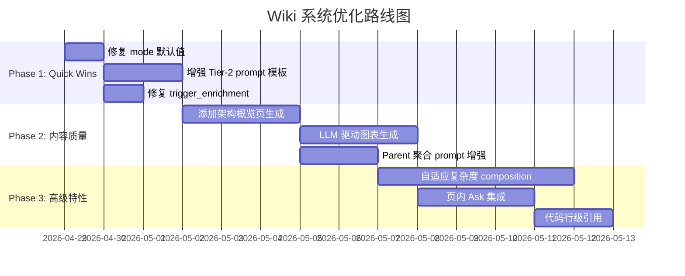

# Wiki 系统深度分析：对标 DeepWiki / CodeWiki

> 创建时间：2026-04-28  
> 目的：系统性识别当前 Wiki 子系统的优势、欠缺与优化方向  
> 对标项目：[DeepWiki-Open](https://github.com/AsyncFuncAI/deepwiki-open) (15.3K ⭐)、[CodeWiki](https://github.com/FSoft-AI4Code/CodeWiki) (ACL 2026)

---

## 1. 三系统定位对比

| 维度 | 当前系统 (KB Service) | DeepWiki | CodeWiki |
|------|----------------------|----------|----------|
| 定位 | 企业级代码知识库 + 持续演化 Wiki | 开源即时 Wiki 生成器 | 学术研究框架 (评测驱动) |
| 存储 | FalkorDB 图数据库 | 文件缓存 + 向量 | 文件系统 |
| 代码解析 | Tree-sitter AST → 图实体 | 文件级读取 | DP 分层分解 |
| LLM 策略 | 分层 (Tier1 缓存/Tier2 LLM/Tier3 模板) | 每页一次 LLM | 递归多智能体 + 动态委派 |
| 图表 | 依赖图 + 类图 (静态 AST 提取) | LLM 驱动 Mermaid (语义) | 多模态综合 (架构/数据流/时序) |
| 增量更新 | ✅ graph-diff | ❌ | ❌ |
| 质量保证 | 置信度 / 矛盾 / 主张追踪 | ❌ | CodeWikiBench 评测 |
| 记忆演化 | ✅ Q&A 循环 + 遗忘曲线 | ❌ | ❌ |

---

## 2. 当前系统的独特优势

这些能力是 DeepWiki 和 CodeWiki **均不具备**的，代表核心竞争力：

### 2.1 图数据库驱动的知识表示
- FalkorDB 存储代码实体（Module/Class/Function）及其关系（CALLS/IMPORTS/INHERITS）
- 支持跨实体图查询、路径遍历、引用追踪
- 为 Wiki 内容提供结构化 ground truth，而非仅依赖 LLM 理解

### 2.2 增量更新能力
- `generate_incremental`: 基于 graph-diff 仅重生成变更实体的页面
- `wiki_code_hash` baseline: 指纹检测变更
- 对标：DeepWiki/CodeWiki 每次全量重建

### 2.3 业务域分类 (Cross-Repo)
- `CrossRepoBusinessDomainPlanner`: LLM 驱动的跨仓库业务域分类
- `classify_incremental`: 增量分类，缓存已分类模块
- 生成业务域维度的 Wiki 树视图
- 对标：DeepWiki/CodeWiki 无业务语义层

### 2.4 完整页面生命周期
- 版本历史 + diff 对比 (`WikiPageVersion`)
- 人工编辑 + 版本锁 (`expected_version`)
- 软删除 + 版本快照
- 对标：DeepWiki/CodeWiki 仅生成，不可编辑

### 2.5 质量保证体系
- **置信度评分**: 多维度评估页面质量
- **矛盾检测**: 嵌入相似度 + LLM 裁决
- **主张追踪 + 更替检测**: claim/supersession edges
- **记忆演化**: Q&A 记忆循环 + 遗忘曲线
- 对标：CodeWiki 有评测但不持续维护；DeepWiki 无

### 2.6 Agent 集成
- MCP Server (6 个 Wiki 工具)
- 支持 Agent 直接调用 Wiki 搜索、解释、导航、影响分析

---

## 3. 关键欠缺与优化点

### P0 — 致命问题（直接影响内容质量）

#### 3.1 默认 mode=structure 导致全部页面无业务内容

**现状**：Dashboard 增量生成默认 `mode=structure`，跳过 LLM，只生成模板骨架。

```
// dashboard/src/hooks/useWikiRegenerate.ts:155
const mode = incremental ? "structure" : "full";
```

**影响**：用户触发"增量生成"后得到的 Wiki 页面内容仅包含：
- 679 个 sibling 链接 (已修复，限制为 10)
- 12 行模板文字：_"The X module organizes part of the codebase."_

**对标**：
- DeepWiki：始终调用 LLM，无 structure-only 模式
- CodeWiki：递归 Agent 确保每个模块都有 LLM 描述

**建议**：
1. 将 `useWikiRegenerate` 的增量模式 mode 改为 `full`
2. 或在 UI 增加明确的 mode 选择器，不与 incremental 耦合

**代码位置**：`dashboard/src/hooks/useWikiRegenerate.ts:155`、`api/models/wiki_models.py:60-62`

---

#### 3.2 Tier-2 LLM Prompt 缺少业务上下文引导

**现状**：`WikiComposer._tier2_llm` 的 prompt 包含：
- 代码实体摘要 (AST 结构)
- RAG 检索的相关文档片段
- 父模块上下文
- 术语表
- 记忆注入

**问题**：prompt 缺少以下关键上下文：
- 该模块所属**业务域**的描述 (domain classification 结果未注入)
- 该模块的**调用链上下文** (谁调用它？它调用谁？)
- **数据流描述** (输入什么数据，输出什么结果)
- **结构化输出要求** (没有明确要求特定章节)

**对标**：
- CodeWiki：递归 Agent 根据模块复杂度动态调整处理深度
- DeepWiki：prompt 中包含仓库结构概览和文件间关系

**建议**：
1. 在 prompt 中注入 `business_domain` 分类结果和域描述
2. 从图中提取 CALLS/IMPORTS 边构建调用链摘要
3. 使用结构化 prompt template 要求生成特定章节：
   - **Purpose & Responsibility** (目的与职责)
   - **Key Components** (关键组件)
   - **Integration Points** (集成点/对外接口)
   - **Data Flow** (数据流)
   - **Design Decisions** (设计决策/权衡)

**代码位置**：`wiki/composer.py:213-241` (`_tier2_llm`)

---

#### 3.3 缺少"架构叙事"层

**现状**：每个 Wiki 页面独立生成，缺少跨模块的架构概述。

**问题**：
- 无 "Repository Overview" 页面描述整体架构
- 无 "Architecture Decision Records" 类型内容
- 业务域概览页 (`DomainOverviewComposer`) 存在但内容可能不足
- Parent 聚合页仅拼接子页面摘要，缺少"如何协作"的叙事

**对标**：
- DeepWiki：自动生成仓库概览 + 架构说明
- CodeWiki："层次聚合" 生成连贯的上层文档

**建议**：
1. 增加 `REPO_OVERVIEW` 类型页面的 LLM 生成（当前 `compose_incremental_navigation_pages` 生成的 overview 过于简单）
2. 为 `compose_parent_page` 增强 prompt，要求描述子模块间的协作关系
3. 利用已有的 `BusinessFlow` 数据生成流程说明页

**代码位置**：`wiki/composer.py:289-343` (`compose_parent_page`)、`wiki/service.py:344-412` (`compose_incremental_navigation_pages`)

---

### P1 — 重要优化

#### 3.4 图表生成过于简单

**现状**：
- `_build_diagrams` 仅生成依赖图 (Module) 或类图 (Class)
- 图表来自 AST 边的机械转换，无语义理解
- 无时序图、数据流图、架构总览图

**对标**：
- DeepWiki：LLM 理解代码后生成语义 Mermaid 图表
- CodeWiki：多模态综合 — 架构图 + 数据流图 + 时序图

**建议**：
1. 在 Tier-2 LLM prompt 中增加图表生成指令，要求输出 Mermaid 格式的：
   - 关键流程时序图 (sequence diagram)
   - 数据流图 (flowchart)
2. 保留现有 AST 图表作为补充
3. 使用 LLM 为 Parent 页面生成模块交互架构图

**代码位置**：`wiki/composer.py:873-894` (`_build_diagrams`)

---

#### 3.5 缺少分层分解策略 (Hierarchical Decomposition)

**现状**：`WikiStructurePlanner` 基于 CONTAINS 关系递归构建树，是机械的图遍历。

**对标**：CodeWiki 的核心创新 — DP 启发的分层分解，根据代码复杂度和耦合度智能分组。

**建议**：
1. 为 `WikiStructurePlanner` 引入复杂度评分（子模块数量 × 边数量 × 代码行数）
2. 高复杂度模块：多步 composition (先理解结构 → 分析交互 → 综合描述)
3. 低复杂度实体：简短 prompt 或模板

**代码位置**：`wiki/structure_planner.py`

---

#### 3.6 Parent 聚合页质量低

**现状**：`compose_parent_page` 收集子页面摘要后用 `_PARENT_SYSTEM_PROMPT` 生成描述。

**问题**：prompt 过于通用，缺少对"模块如何协作"、"架构分层"、"设计模式"的引导。

**建议**：
1. 增强 parent prompt：要求描述子模块间的职责划分和协作方式
2. 注入子模块间的边信息（CALLS/IMPORTS between children）
3. 要求生成至少一个 Mermaid 架构图

**代码位置**：`wiki/composer.py:35-39` (`_PARENT_SYSTEM_PROMPT`)、`wiki/composer.py:289-343`

---

### P2 — 体验优化

#### 3.7 页内 Ask/对话未集成

**现状**：Ask 功能作为独立 Tab 存在，与当前查看的 Wiki 页面上下文分离。

**对标**：DeepWiki 核心体验 — "每个页面都可以对话"。

**建议**：在 Wiki 页面查看器中增加 inline 对话入口，自动预加载当前页面的 entity context。

---

#### 3.8 代码行级引用缺失

**现状**：`source_locations` 和 `method_locations` 存储了源文件路径，但 Wiki 中不展示行级链接。

**建议**：在 Wiki 页面中展示可点击的源码位置，跳转到代码浏览器的具体行。

---

#### 3.9 trigger_enrichment 是空操作

**现状**：`WikiService.trigger_enrichment` 只统计符合条件的页面数量，不实际执行 enrichment。enrichment pipeline 在 `mode=structure` 下完全跳过。

**代码位置**：`wiki/service.py` (`get_enrichment_status` / `trigger_enrichment`)

---

#### 3.10 流式生成与主管道功能差异

**现状**：`generate_stream_events` 被标记为 legacy，缺少 Phase 2 功能（parent 聚合、部分 nav/backlink 行为）。

---

## 4. 实施路线图



---

## 5. 技术债务

| 项目 | 描述 | 风险 |
|------|------|------|
| WikiConfig 命名冲突 | `config.WikiConfig` (app flags) vs `wiki.models.WikiConfig` (per-run) | 开发困惑 |
| 导航内容嵌入 page content | `render_navigation_section` 将 nav 写入 content，与前端 navigation_json 重复 | 页面体积 + 同步风险 |
| Delegation chunk-only | `group_children_by_graph` 始终使用 chunk 分组，不使用图聚类 | 子页面分组不够智能 |
| Domain 链接脆弱 | `_link_pages_to_tree` 用 page title 匹配 module name | 非 Module 页面可能错误分配 |
| 流式生成 legacy | `generate_stream_events` 缺少 Phase 2 功能 | 前端 SSE 体验受限 |

---

## 6. 深度审阅补充（2026-04-28 Code Review）

以下为基于前后端代码深度审阅后的补充发现，作为原文档的修正和增强。

### 6.1 文档修正

#### 3.2 节精度修正

原文称"缺少调用链上下文"，但 `_entity_digest` **已包含**基础调用链：

```python
# wiki/composer.py:627-638
calls_out = [e for e in page_data.edges if e.edge_type == EdgeType.CALLS and e.source_uid == n.uid]
calls_in = [e for e in page_data.edges if e.edge_type == EdgeType.CALLS and e.target_uid == n.uid]
# → 生成 "Calls out to: ..." 和 "Called by: ..." 列表（各最多 10 条）
```

**真正缺失的是**：调用链的**语义描述**（调用目的、数据流向），而非调用链本身。

#### 遗漏：已有图属性未注入 Prompt

`_entity_digest` 仅使用节点属性的子集，以下重要属性**已存储在图中但未注入 prompt**：

| 属性 | 存储位置 | 说明 |
|------|---------|------|
| `annotations` | Class/Function 节点 | Spring `@Service`、`@RestController` 等标注，直接揭示业务角色 |
| `semantic_roles` | Class/Function 节点 | 由 indexer 推断的语义角色 |
| `base_classes` / `interfaces` | Class 节点属性 | INHERITS 边有但属性列表未直接呈现 |
| `parameters` / `return_type` | Function 节点 | 仅通过 signature 间接体现，结构化信息丢失 |
| `neighbor_tier` | 边属性 | `data_collector._annotate_neighbor_tiers` 计算但 composer 完全忽略 |

#### 遗漏：增量路径 vs 全量路径的质量差距

`service.generate_incremental` 调用 `compose_page` 时**不传** `parent_context` 和 `glossary`，而 `repo_composer._compose_module_pages` 在全量流程中会传。这导致增量生成的页面比全量生成**系统性缺少上下文**，属于隐性质量退化。

### 6.2 代码注释作为 Prompt 输入 — 深度分析

#### 当前注释提取现状

Tree-sitter 解析器的注释提取**非常有限**（`indexer/tree_sitter_parser.py:376-403`）：

| 语言 | 提取能力 | 遗漏 |
|------|---------|------|
| Python | 函数/类体内第一个字符串字面量 | `#` 注释完全忽略；模块级 docstring 不提取 |
| Java | 紧邻前兄弟 `comment`/`block_comment` | 装饰器隔开的 Javadoc 丢失；类/方法体内注释忽略 |
| JS/TS | 同 Java | 同 Java |
| Go | 同 Java | 同 Java |
| 所有语言 | — | Module 节点**无 docstring/description 字段** |

#### 优点

1. **业务意图信号**：注释解释"为什么这样做"，恰好是 Wiki 最需要的内容
   - TODO/FIXME 揭示已知问题；架构决策注释解释设计权衡
   - API 文档注释（JSDoc/Javadoc）包含参数语义和使用示例
2. **领域词汇注入**：注释常含业务术语（如 `// 处理跨境交易结算流程`），LLM 无法仅从变量名推断
3. **与 AST 互补**：AST 告诉"做什么"，注释告诉"为什么"和"怎么用"
4. **实现成本低**：Tree-sitter 已解析完整 AST，注释节点现成可用
5. **提升 `business_summary` 质量**：enrichment 阶段有原始注释输入 → 更准确的摘要

#### 缺点

1. **Token 预算爆炸**：企业代码常有 100+ 行许可证头、自动生成模板注释
2. **注释质量不可靠**：过时/错误/无意义注释会**误导** LLM
3. **处理成本增加**：更多 token → 更高 API 费用 + 更大存储占用
4. **需要健壮过滤**：许可证头、注释掉的代码、IDE 模板、trivial 注释
5. **与矛盾检测交互**：过时注释可能触发假阳性矛盾

#### 推荐：分层注释注入策略

| 层级 | 内容 | 注入时机 | 优先级 |
|------|------|---------|--------|
| Tier 1 | 结构化文档注释（JSDoc/Javadoc/Python docstring） | 始终注入 | **已部分实现**，需增强 |
| Tier 2 | 文件级头注释 / 模块 docstring | Module 页面生成时 | P0 新增 |
| Tier 3 | 类/函数级块注释（非 docstring） | Token 预算允许时 | P1 |
| Tier 4 | 有意义的内联注释（启发式：长度>20 char、非许可证/模板） | 仅复杂实体深度分析页 | P2 |
| 永不注入 | 许可证头、注释掉的代码、trivial 注释 | — | — |

### 6.3 修订版 TODO 优先级

#### P0 — 影响核心价值（1-2 周）

| # | 能力 | 现状 | 预估 |
|---|------|------|------|
| P0-1 | mode 默认值修复 | 增量=structure，跳过 LLM | 0.5d |
| P0-2 | Prompt 上下文增强（业务域 + annotations + semantic_roles） | 多属性未注入 | 2d |
| P0-3 | Module docstring/文件头注释提取 | Module 无 docstring | 1d |
| P0-4 | 增量路径注入 glossary/parent_context | 增量不传 | 1d |
| P0-5 | 结构化输出模板（Purpose/Components/Integration/DataFlow/Design） | prompt 无章节要求 | 1d |

#### P1 — 内容质量飞跃（2-4 周）

| # | 能力 | 现状 | 预估 |
|---|------|------|------|
| P1-1 | 架构叙事概览页（REPO_OVERVIEW LLM 生成） | overview 仅模板文字 | 3d |
| P1-2 | LLM 驱动语义图表（时序图、数据流图） | 仅 AST 机械图 | 3d |
| P1-3 | Parent 聚合增强（子模块协作描述 + 架构图） | 通用 prompt | 2d |
| P1-4 | 注释分层注入（Tier 2-3 注释提取 + 过滤管线） | 仅 docstring | 3d |
| P1-5 | trigger_enrichment 实装 | 干运行空操作 | 2d |
| P1-6 | 已有图属性全量利用（parameters/return_type/neighbor_tier） | 未注入 | 1d |

#### P2 — 体验差异化（4-8 周）

| # | 能力 | 现状 | 预估 |
|---|------|------|------|
| P2-1 | 页内 Ask/对话 | 独立 Tab | 3d |
| P2-2 | 自适应复杂度分解（DP 启发分层） | 机械图遍历 | 5d |
| P2-3 | 代码行级引用 | 无跳转链接 | 2d |
| P2-4 | 多语言 Wiki 输出 | 单语言 | 2d |
| P2-5 | 流式生成补全（Phase 2 功能） | legacy | 3d |

---

## 7. 核心洞察

> **当前系统的基础设施（图数据库、增量更新、质量体系）远超 DeepWiki/CodeWiki，但内容生成管道的 LLM 利用率是最大短板。**
>
> 最高 ROI 的优化不是添加新功能，而是**让现有 LLM 管道真正运行**（修复 mode 默认值）并**增强 prompt 质量**（注入业务域、调用链语义、图属性、代码注释、结构化输出要求）。
>
> **代码注释是最被低估的信号源**：当前 tree-sitter 仅提取了注释冰山一角，通过分层注入策略可以在可控 token 成本下显著提升 Wiki 的业务理解深度。
