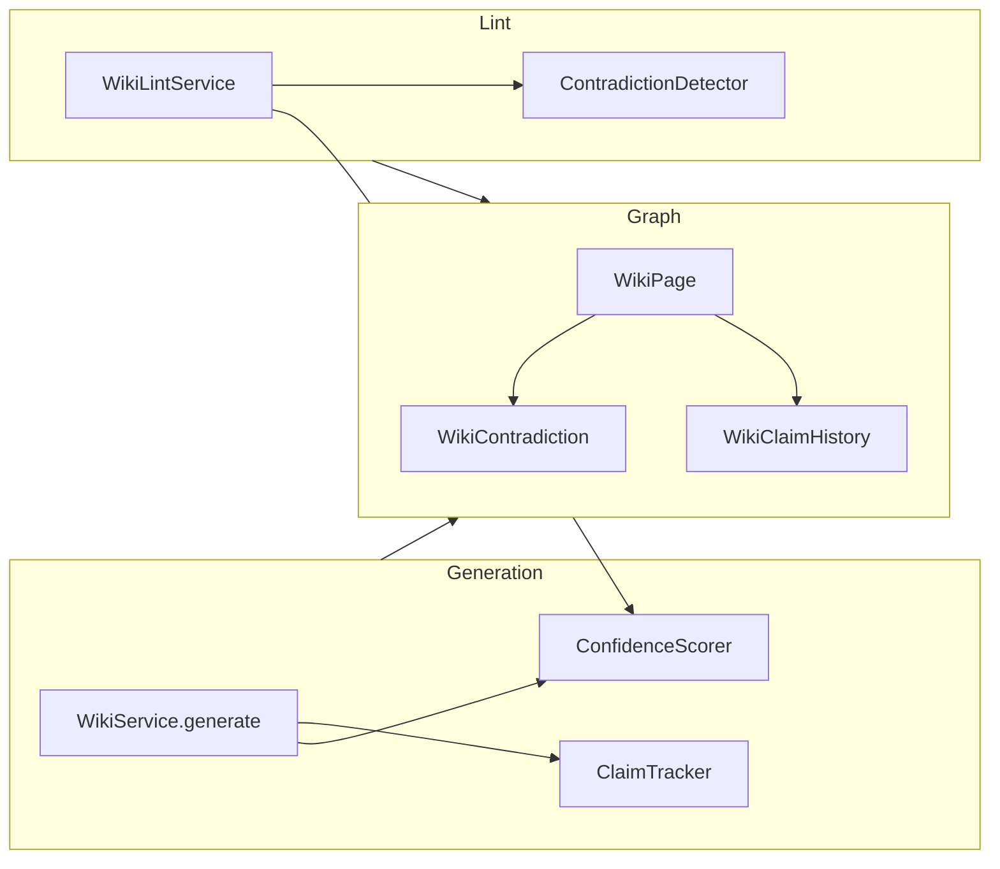

# Phase 2 — Knowledge Quality Engine (SP3, SP4, SP5)

**Spec**: [`../specs/2026-04-26-llm-wiki-v2-upgrade-design.md`](../specs/2026-04-26-llm-wiki-v2-upgrade-design.md) (Section 3: Phase 2)  
**Date**: 2026-04-26

---

## 1. Header

### Goal

Ship three additive capabilities—**per-page confidence scoring**, **batch contradiction detection with lifecycle**, and **claim-level supersession history**—behind `WikiConfig` feature flags, with graph persistence, lint integration, API surfaces, and dashboard UX consistent with the existing wiki stack.

### Architecture

- **Scoring & detection** live in pure Python modules under `wiki/` (`ConfidenceScorer`, `ContradictionDetector`, `ClaimTracker`), orchestrated by `WikiService` and `WikiLintService`.
- **Graph**: FalkorDB / `FalkorDBStore.persist_wiki_pages` and new Cypher for `WikiContradiction` and `WikiClaimHistory` nodes, linked from `WikiPage` (see data model in spec §3).
- **API**: FastAPI routes follow existing patterns in `api/routes/wiki_routes.py` (prefix `/api/v1/wiki`, `Depends`, `get_settings()` gates); SP4 may add a dedicated router file aggregated into the app like other route modules.
- **Frontend**: React components in `dashboard/src/components/wiki/`, data from extended `get_page_by_path` / new list endpoints, types in `dashboard/src/hooks/wikiTypes.ts`.



### Tech stack

| Layer        | Tooling |
|-------------|---------|
| Python      | `uv run pytest` / `uv run ruff` / `uv sync` (per repo `pyproject.toml`) |
| Tests       | `pytest`, tests under `tests/wiki/` and `tests/api/` |
| Frontend    | `pnpm` in `knowledge-base-service/dashboard` — `pnpm test`, `pnpm lint`, `pnpm build` |
| Config      | `config.py` → `Settings.wiki` (`WikiConfig`) + env `WIKI__*` nested keys |

---

## 2. File structure mapping

| Concern | New / touched files (repo root: `knowledge-base-service/`) |
|--------|----------------------------------------------------------------|
| **SP3** | `wiki/confidence_scorer.py` (new); `tests/wiki/test_confidence_scorer.py` (new); `wiki/service.py`, `wiki/lint.py`, `config.py`, `store/falkordb_store.py` (`persist_wiki_pages` batch fields + Cypher), `store/wiki_page_store.py` (`get_page_by_path` return columns), `api/routes/wiki_routes.py` (expose `confidence_score` on page payload), `dashboard/src/components/wiki/ConfidenceBadge.tsx` (new), `dashboard/src/components/wiki/WikiContent.tsx`, `dashboard/src/hooks/wikiTypes.ts` |
| **SP4** | `wiki/contradiction_detector.py` (new); `tests/wiki/test_contradiction_detector.py` (new); `store/wiki_contradiction_store.py` or mixin in `store/wiki_*.py` (CRUD + queries); `wiki/lint.py`; `api/routes/wiki_contradiction_routes.py` (new) + wire in `create_app` / parent router; `dashboard/.../ContradictionAlert.tsx`, `WikiContent.tsx`, `wikiTypes.ts` |
| **SP5** | `wiki/claim_tracker.py` (new); `tests/wiki/test_claim_tracker.py` (new); `wiki/service.py` (pre/post generation hooks); `store/` claims persistence; `dashboard/.../ClaimHistoryPanel.tsx`, `WikiContent.tsx`, `wikiTypes.ts` |
| **Bootstrap** | `main.py` — pass `get_settings().wiki` into `WikiLintService` / factories where needed (mirror pattern used for `WikiService` in `wire_wiki_app_state`) |

**Existing anchor files (read before coding):**

- Generation: `wiki/service.py` — `_persist_pages_to_graph` → `persist_wiki_pages` page dicts.
- Lint: `wiki/lint.py` — `WikiLintService.lint` gathers checks via `asyncio.gather`.
- Store facade: `store/wiki_store.py` — add methods via `store/wiki_page_store.py` / new mixin.
- Feedback: `store/wiki_feedback_store.py` — `get_feedback_summary(page_uid, business_id)`.
- Config: `config.py` — `class WikiConfig` (add Phase 2 flags + optional weight fields per spec §7).
- UI: `dashboard/src/components/wiki/WikiContent.tsx` — header metadata row (place badges near `WikiVersionPicker`).
- Routes: `api/routes/wiki_routes.py` — e.g. `GET /api/v1/wiki/pages/by-path`, `POST /api/v1/wiki/{repository}/lint`.

---

## 3. TDD loop (use for every task)

Each bite-sized task follows:

1. **Red**: add a failing test (`uv run pytest path/to/test.py -q`).
2. **Green**: implement minimal code to pass.
3. **Refactor** (only if needed for clarity).
4. **Commit** with a scoped message, e.g. `feat(wiki): add ConfidenceScorer formula tests`.

**Commands (from `knowledge-base-service/`):**

```bash
uv run pytest tests/wiki/test_confidence_scorer.py -q
cd dashboard && pnpm test --run ConfidenceBadge
```

---

# SP3 — Confidence Scoring

**Reference formula** (spec):  
`confidence = w1*source + w2*fresh + w3*feedback + w4*refs - w5*contradiction_penalty`  
with weights `0.30, 0.25, 0.25, 0.20, 1.0` and definitions for each factor.

---

## SP3 — Task 1: `ConfidenceScorer` class with formula

**Failing test** (`tests/wiki/test_confidence_scorer.py`):

```python
import pytest
from wiki.confidence_scorer import ConfidenceInputs, ConfidenceScorer, DEFAULT_WEIGHTS


def test_confidence_happy_path_matches_spec() -> None:
    scorer = ConfidenceScorer(weights=DEFAULT_WEIGHTS)
    inputs = ConfidenceInputs(
        source_entity_count=3,
        days_since_generated=0,
        up_votes=1,
        down_votes=0,
        inbound_wikilink_count=5,
        contradiction_count=0,
    )
    assert scorer.compute(inputs) == pytest.approx(0.3 * 1.0 + 0.25 * 1.0 + 0.25 * 0.5 + 0.20 * 1.0, rel=1e-5)


def test_contradiction_penalty_reduces_score() -> None:
    scorer = ConfidenceScorer(weights=DEFAULT_WEIGHTS)
    base = ConfidenceInputs(3, 0, 0, 0, 5, 0)
    with_pen = ConfidenceInputs(3, 0, 0, 0, 5, 2)
    assert scorer.compute(with_pen) < scorer.compute(base)
```

**Implementation** (`wiki/confidence_scorer.py`):

```python
from __future__ import annotations

from dataclasses import dataclass
from typing import NamedTuple


class WeightBundle(NamedTuple):
    w1: float
    w2: float
    w3: float
    w4: float
    w5: float


DEFAULT_WEIGHTS = WeightBundle(0.30, 0.25, 0.25, 0.20, 1.0)


@dataclass(frozen=True)
class ConfidenceInputs:
    source_entity_count: int
    days_since_generated: int
    up_votes: int
    down_votes: int
    inbound_wikilink_count: int
    contradiction_count: int


class ConfidenceScorer:
    def __init__(self, weights: WeightBundle = DEFAULT_WEIGHTS) -> None:
        self._w = weights

    def compute(self, x: ConfidenceInputs) -> float:
        source = min(x.source_entity_count / 3, 1.0)
        fresh = max(1.0 - x.days_since_generated / 90, 0.0)
        total_fb = x.up_votes + x.down_votes + 1
        feedback = x.up_votes / total_fb
        refs = min(x.inbound_wikilink_count / 5, 1.0)
        penalty = x.contradiction_count * 0.15
        raw = (
            self._w.w1 * source
            + self._w.w2 * fresh
            + self._w.w3 * feedback
            + self._w.w4 * refs
            - self._w.w5 * penalty
        )
        return max(0.0, min(1.0, raw))
```

**Commit:** `test(wiki): add ConfidenceScorer unit tests` then `feat(wiki): add ConfidenceScorer`.

---

## SP3 — Task 2: Wire scorer into `WikiService.generate` / persist path

**Behavior**: After `persist_wiki_pages`, each `WikiPage` has `confidence_score` set (float 0..1). When `confidence_scoring_enabled` is false, skip scoring (leave property unset or previous value).

**Failing test** (extend `tests/wiki/test_wiki_page_persistence.py` or new `test_confidence_persist.py`):

- Mock `store.execute_query` to return fake counts, or integration-style: call a new package-level function `async def recalculate_confidence_for_repo(...)` with mocked store.

**Implementation sketch** in `wiki/service.py` after `await self._store.persist_wiki_pages(...)`:

```python
if self._wiki_cfg.confidence_scoring_enabled and self._store is not None:
    from wiki.confidence_scorer import ConfidenceScorer

    scorer = ConfidenceScorer()  # optionally pass weights from self._wiki_cfg
    for pd in page_dicts:
        uid = f"WikiPage:{repository}:{pd['path']}"
        inputs = await self._fetch_confidence_inputs(uid, repository, pd)  # new helper
        score = scorer.compute(inputs)
        await self._store.execute_query(
            "MATCH (w:WikiPage {uid: $uid}) SET w.confidence_score = $score",
            {"uid": uid, "score": score},
        )
```

Implement `_fetch_confidence_inputs` using:

- `COUNT` of `(:WikiPage)-[:SOURCE_ENTITY]->()` 
- `generated_at` vs `now` for freshness
- `WikiFeedbackStore.get_feedback_summary` (construct store with `self._store`) for thumbs
- Inbound WIKI edges: follow existing `wiki_orphan_in_degrees` / reference queries in `store/wiki_page_store.py` (add `count_incoming_wikilinks(page_uid)` if missing)
- `contradiction_count`: `OPTIONAL MATCH (w)-[:HAS_CONTRADICTION]->(c:WikiContradiction) WHERE c.status <> 'resolved' RETURN count(c)` (0 until SP4)

**`persist_wiki_pages` batch** (`store/falkordb_store.py`): add `confidence_score` to the `batch` dict and `SET w.confidence_score = page.confidence_score` when present so single-pass write remains possible (prefer computing scores before `persist` and passing in `page_dict` to avoid N+1 updates).

**Commit:** `feat(wiki): persist confidence_score on wiki generation`.

---

## SP3 — Task 3: Wire scorer into `WikiLintService`

**Failing test** (`tests/wiki/test_lint_confidence.py` new):

- Mock `WikiLintService` with a fake `store` that has pages without `confidence_score`.
- When flag on, `lint` result includes an info-level issue or a dedicated `stats["confidence_recalibrated"]` count after recalculation.

**Implementation** (`wiki/lint.py`):

- Extend `__init__` with optional `wiki_config: WikiConfig | None` (import `TYPE_CHECKING` to avoid cycles).
- In `lint`, if `wiki_config and wiki_config.confidence_scoring_enabled`, `await self._recalculate_confidence_scores(repository)` before or after existing checks.
- Reuse the same `ConfidenceScorer` + input gathering as `WikiService` (extract shared `wiki/confidence_inputs.py` if duplication exceeds ~30 lines).

**`main.py`** — pass settings into factory:

```python
async def wiki_lint_service_factory() -> WikiLintService:
    kb = await kb_state.registry.get_service("default")
    return WikiLintService(
        kb.store,
        wiki_cache=getattr(app.state, "wiki_cache", None),
        repo_registry=kb_state.repo_registry,
        wiki_config=get_settings().wiki,
    )
```

**Commit:** `feat(wiki): recalculate confidence during lint when enabled`.

---

## SP3 — Task 4: `ConfidenceBadge` frontend

**Failing test** (`dashboard/src/components/wiki/ConfidenceBadge.test.tsx` with Vitest):

```tsx
import { render, screen } from "@testing-library/react";
import { describe, it, expect } from "vitest";
import { ConfidenceBadge } from "./ConfidenceBadge";

describe("ConfidenceBadge", () => {
  it("shows high label when score >= 0.8", () => {
    render(<ConfidenceBadge score={0.85} />);
    expect(screen.getByText(/high/i)).toBeInTheDocument();
  });
});
```

**Component** (`dashboard/src/components/wiki/ConfidenceBadge.tsx`):

```tsx
type Props = { score: number };

export function ConfidenceBadge({ score }: Props) {
  const tier = score >= 0.8 ? "high" : score >= 0.5 ? "medium" : "low";
  const label =
    tier === "high" ? "High Confidence" : tier === "medium" ? "Medium" : "Low Confidence";
  const color =
    tier === "high"
      ? "bg-emerald-100 text-emerald-800"
      : tier === "medium"
        ? "bg-amber-100 text-amber-800"
        : "bg-rose-100 text-rose-800";
  return (
    <span className={`inline-flex rounded-full px-2 py-0.5 text-[10px] font-semibold ${color}`}>
      {label} ({score.toFixed(2)})
    </span>
  );
}
```

**Wire in** `WikiContent.tsx` (header row near version badge):

```tsx
import { ConfidenceBadge } from "./ConfidenceBadge";
// ...
{detail?.context?.confidence_score != null && detail?.context?.confidence_score !== "" && (
  <ConfidenceBadge score={Number(detail.context.confidence_score)} />
)}
```

**API**: extend `get_page_by_path` in `api/routes/wiki_routes.py` and Cypher in `store/wiki_page_store.py` to return `wp.confidence_score AS confidence_score` in the `context` or top-level (keep consistent with `importance_tier`).

**Types** — `wikiTypes.ts`:

```ts
// inside WikiPageDetail.context (optional)
confidence_score?: string;
```

**Commit:** `feat(dashboard): add ConfidenceBadge and expose confidence in page API`.

---

## SP3 — Task 5: Feature flag

**`config.py`** — inside `WikiConfig`:

```python
# Phase 2: Knowledge quality (LLM Wiki v2)
confidence_scoring_enabled: bool = False
confidence_weight_w1: float = 0.30
confidence_weight_w2: float = 0.25
confidence_weight_w3: float = 0.25
confidence_weight_w4: float = 0.20
confidence_weight_w5: float = 1.0
```

**Failing test** `tests/wiki/test_sp3_feature_flags.py`:

```python
def test_confidence_scoring_default_off() -> None:
    from config import WikiConfig
    assert WikiConfig().confidence_scoring_enabled is False
```

Use weights in `ConfidenceScorer(WeightBundle(...))` when flag on.

**Commit:** `feat(config): add confidence scoring feature flag and weights`.

---

# SP4 — Contradiction Detection

---

## SP4 — Task 1: `ContradictionDetector` class

**Failing test** (`tests/wiki/test_contradiction_detector.py`):

```python
import pytest
from unittest.mock import AsyncMock, MagicMock
from wiki.contradiction_detector import ContradictionDetector, ContradictionCandidate


@pytest.mark.asyncio
async def test_detector_skips_high_similarity_without_llm() -> None:
    store = MagicMock()
    det = ContradictionDetector(graph=store, embedding_fn=AsyncMock(), llm=AsyncMock(), similarity_threshold=0.85)
    # mock returns two pages with similarity 0.9 -> expect no LLM call
    out = await det._maybe_flag_pair(page_a={}, page_b={}, similarity=0.9)
    assert out is None
```

**Implementation** (`wiki/contradiction_detector.py`):

- `group_pages_by_entity_name(rows: list[dict]) -> dict[str, list[page_props]]` using `title` or linked entity FQN.
- `cosine_sim(a, b) -> float` on embeddings (reuse `EmbeddingGenerator` or stored `WikiPage` vectors).
- If similarity < `similarity_threshold`, call LLM with structured output:

```python
# pydantic or JSON schema
class LlmVerdict(BaseModel):
    is_contradiction: bool
    description: str
    severity: Literal["high", "medium", "low"]
```

- Return list of `ContradictionRecord` for the lint pass to persist.

**Commit:** `feat(wiki): add ContradictionDetector with embedding gate + LLM judge`.

---

## SP4 — Task 2: `WikiContradiction` graph model

**Cypher (persist helper)** in `store/wiki_contradiction_store.py` (new):

```python
async def upsert_contradiction(
    self,
    uid: str,
    page_uid_a: str,
    page_uid_b: str,
    description: str,
    severity: str,
    status: str = "detected",
) -> None:
    q = (
        "MERGE (c:WikiContradiction {uid: $uid}) "
        "SET c.page_uid_a = $a, c.page_uid_b = $b, c.description = $d, "
        "c.severity = $s, c.status = $st, c.detected_at = timestamp() "
        "WITH c "
        "MATCH (a:WikiPage {uid: $a}) "
        "MATCH (b:WikiPage {uid: $b}) "
        "MERGE (a)-[:HAS_CONTRADICTION]->(c) "
        "MERGE (b)-[:HAS_CONTRADICTION]->(c)"
    )
    await self._graph.execute_query(q, {"uid": uid, "a": page_uid_a, "b": page_uid_b, "d": description, "s": severity, "st": status})
```

**Failing test** `tests/store/test_wiki_contradiction_store.py` with mocked `execute_query` asserting the query string contains `WikiContradiction` and `HAS_CONTRADICTION`.

**Commit:** `feat(store): add WikiContradiction persistence`.

---

## SP4 — Task 3: Contradiction detection in lint

**Failing test** `tests/wiki/test_lint_contradictions.py`:

- When `contradiction_detection_enabled` is true, `WikiLintService.lint` calls detector (mock) once per repo.

**Implementation** (`wiki/lint.py`):

```python
async def _check_contradictions(self, repository: str) -> list[LintIssue]:
    if self._wiki_config is None or not self._wiki_config.contradiction_detection_enabled:
        return []
    # list pages, group, run ContradictionDetector, upsert new nodes, append LintIssue for each new detection
    return issues
```

**Commit:** `feat(wiki): run contradiction detection in lint when enabled`.

---

## SP4 — Task 4: Contradiction API routes

**New file** `api/routes/wiki_contradiction_routes.py`:

```python
from fastapi import APIRouter, Depends, Query, Request
from auth import Role, require_role
from config import get_settings
from store.wiki_store import WikiStore

router = APIRouter(
    prefix="/api/v1/wiki",
    tags=["wiki", "contradictions"],
    dependencies=[Depends(require_role(Role.VIEWER))],
)


@router.get("/{repository}/contradictions")
async def list_contradictions(
    request: Request,
    repository: str,
    include_resolved: bool = Query(default=False),
) -> dict:
    if not get_settings().wiki.contradiction_detection_enabled:
        return {"items": []}
    raw = getattr(request.app.state, "wiki_store", None)
    # ...
    return {"items": []}
```

**Mutations** (Editor role) — `POST .../ack`, `POST .../resolve` setting `status` and `resolved_at`.

**Register** in `create_app` or colocate in `wiki_routes.py` via `router.include_router(...)` to avoid circular imports (follow Phase 1 split if `wiki_routes` was already decomposed).

**Failing test** `tests/api/test_wiki_contradiction_routes.py` using `TestClient` and dependency overrides (pattern from `tests/api/test_wiki_lint_api.py`).

**Commit:** `feat(api): add contradiction list and state transition routes`.

---

## SP4 — Task 5: `ContradictionAlert` frontend

**Failing test** + **Component** `dashboard/src/components/wiki/ContradictionAlert.tsx`:

```tsx
type Props = { unresolvedCount: number; summary?: string };
export function ContradictionAlert({ unresolvedCount, summary }: Props) {
  if (unresolvedCount < 1) return null;
  return (
    <div className="border-l-4 border-amber-400 bg-amber-50 px-4 py-3 text-amber-900 dark:border-amber-500 dark:bg-amber-950/40">
      <strong>Contradiction warning</strong>
      {summary ? <p className="mt-1 text-sm">{summary}</p> : null}
    </div>
  );
}
```

**Fetch**: extend page load hook to call `GET /api/v1/wiki/{repo}/contradictions?...` filtered by `page_uid`, or embed `unresolved_contradictions` in `get_page_by_path` (preferred for one round-trip).

**Wire** in `WikiContent.tsx` below stale alert block:

```tsx
<ContradictionAlert unresolvedCount={n} summary={...} />
```

**Commit:** `feat(dashboard): show ContradictionAlert on pages with open contradictions`.

---

## SP4 — Task 6: Feature flag

**`config.py`:**

```python
contradiction_detection_enabled: bool = False
contradiction_similarity_threshold: float = 0.75  # tune: below => candidate for LLM
```

**Test** + **commit:** `feat(config): add contradiction detection flag`.

---

# SP5 — Supersession / Version Claims

---

## SP5 — Task 1: Claim extraction via LLM

**Failing test** `tests/wiki/test_claim_extraction.py`:

- Mock LLM port returning fixed JSON: `[{"claim_text": "Method X returns Y", "subject_entity": "Foo"}]`.
- Parser normalizes to dataclasses.

**Implementation** in `wiki/claim_tracker.py` (or `wiki/claim_extraction.py`):

```python
class ExtractedClaim(BaseModel):
    claim_text: str
    subject_entity: str


async def extract_claims(llm: Any, page_markdown: str, language: str) -> list[ExtractedClaim]:
    # structured output; prompt asks for one sentence per factual assertion
    ...
```

Follow patterns from `wiki/composer.py` / `wiki/domain_overview_composer.py` for `llm` invocation.

**Commit:** `feat(wiki): add LLM claim extraction for wiki pages`.

---

## SP5 — Task 2: `ClaimTracker` class

**Failing test:**

```python
def test_diff_marks_supersession() -> None:
    from wiki.claim_tracker import ClaimTracker, ExtractedClaim
    ct = ClaimTracker(llm_compare=... )
    old = [ExtractedClaim(claim_text="A", subject_entity="E")]
    new = [ExtractedClaim(claim_text="B", subject_entity="E")]
    # after compare, assert superseded link uid mapping
```

**Implementation**: After extraction of old and new claim lists, call LLM to match / classify changed pairs, or use deterministic text hash + embedding similarity for cheap pre-filter, LLM for borderline. Output operations: `create WikiClaimHistory`, set `superseded_by` on old when replaced.

**Commit:** `feat(wiki): add ClaimTracker supersession comparison`.

---

## SP5 — Task 3: `WikiClaimHistory` graph model

**Cypher** in `store/wiki_claim_store.py` (new) or mixin:

```cypher
CREATE (h:WikiClaimHistory {
  uid: $uid,
  page_uid: $page_uid,
  claim_text: $claim_text,
  version: $version,
  superseded_by: $superseded_by,
  created_at: $created_at,
  superseded_at: $superseded_at
})
WITH h
MATCH (p:WikiPage {uid: $page_uid})
MERGE (p)-[:HAS_CLAIM]->(h)
```

**Page property** `supersedes: list[str]` (JSON string in graph) for quick listing — set via `SET w.supersedes = $list` on `WikiPage` after generation.

**Commit:** `feat(store): persist WikiClaimHistory and supersedes list`.

---

## SP5 — Task 4: Wire into generation pipeline

**In** `wiki/service.py` `generate` / `_persist_pages_to_graph`:

1. If `not wiki_config.supersession_tracking_enabled`: return early.
2. For each page path being regenerated, load prior content from graph (if exists), `extract_claims` old, generate new page as today, `extract_claims` new, `ClaimTracker.diff`, persist history nodes + update `WikiPage.supersedes`.

**Edge case**: first generation — no old claims; only store new `WikiClaimHistory` rows with `superseded_by = null`.

**Failing test** in `tests/wiki/test_claim_pipeline.py` with mocked store + LLM.

**Commit:** `feat(wiki): snapshot and compare claims during generation`.

---

## SP5 — Task 5: `ClaimHistoryPanel` frontend

**Component** `dashboard/src/components/wiki/ClaimHistoryPanel.tsx`:

```tsx
type ClaimEvent = { uid: string; claim_text: string; version: number; supersededBy?: string; at: string };
export function ClaimHistoryPanel({ claims }: { claims: ClaimEvent[] }) {
  if (!claims.length) return null;
  return (
    <details className="mt-6 rounded-lg border p-3">
      <summary className="cursor-pointer text-sm font-semibold">Claim history</summary>
      <ol className="mt-2 space-y-2 text-sm">
        {claims.map((c) => (
          <li key={c.uid}>
            <span className="text-gray-500">v{c.version}</span> {c.claim_text}
          </li>
        ))}
      </ol>
    </details>
  );
}
```

**API** — `GET /api/v1/wiki/pages/{page_uid}/claims` returning timeline sorted by `created_at`.

**Wire** in `WikiContent.tsx` under feedback section.

**Commit:** `feat(dashboard): add ClaimHistoryPanel`.

---

## SP5 — Task 6: Feature flag

**`config.py`:**

```python
supersession_tracking_enabled: bool = False
```

**Test** + **commit:** `feat(config): add supersession tracking flag`.

---

## Dependency & rollout order

1. **SP3** first (no dependency on SP4/5 except `contradiction_count` reads as 0 until `WikiContradiction` exist).
2. **SP4** next — once contradictions are stored, confidence penalty in SP3 backfill/lint uses real counts.
3. **SP5** in parallel with SP4 after SP3 **or** after SP4 if you want claim text to reference resolved contradictions (optional; not required by spec).

**Data migration** (spec §6): one-time lint pass with `confidence_scoring_enabled=True` to backfill `confidence_score` for existing pages.

---

## Verification checklist (before release)

- `uv run pytest tests/wiki/ tests/api/ -q`
- `uv run ruff check wiki store api`
- `cd dashboard && pnpm lint && pnpm test --run && pnpm build`
- Manual: enable all three flags in dev `.env` (`WIKI__CONFIDENCE_SCORING_ENABLED=true`, etc.), regenerate a wiki, run lint, load dashboard page.

---

**End of plan.**
