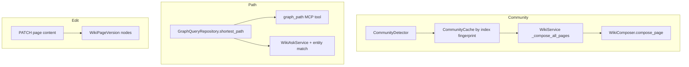

# Phase 2 — Graph Community–Driven Wiki Organization, Path Retrieval, and Wiki Editing

> **HISTORICAL — see [IMPLEMENTATION-STATUS.md](../../IMPLEMENTATION-STATUS.md) for current state.**

**Spec**: [`../specs/2026-04-27-phase2-graph-community-wiki-editing-design.md`](../specs/2026-04-27-phase2-graph-community-wiki-editing-design.md)  
**Date**: 2026-04-27

**Review constraints (incorporated)**:

1. Cache community detection; recompute only when the repository’s index fingerprint changes (equivalent to “after indexing” without tight coupling to every indexer call site).
2. Verify FalkorDB `shortestPath` in implementation; if unavailable or query errors, fall back to `MATCH path = (a)-[*1..5]-(b) … ORDER BY length(path) LIMIT 1` with the same relationship filters.
3. Multi-tenant security: an Editor may only edit `WikiPage` nodes that belong to their business graph (`WikiSpace` → `HAS_CHILD` → `WikiPage`), enforced server-side; respect `TokenInfo.business_id` via `resolve_business_id` (`api/routes/kb_dependencies.py`).
4. Conflicts: **last-write-wins** on content; return **`version_mismatch_warning: true`** when the client’s `expected_version` ≠ current graph version (optimistic locking signal).
5. Relationship/path enhancement in Ask: **post-process** the user question by matching **entity names against graph entities** (from search results + optional repo name list), not keyword heuristics alone.
6. Delivery order: **Iteration A (community) → B (path) → C (editing)**; three **independent** task groups (can be parallelized by team after interfaces are stable).

---

## 1. Header

### Goal

Ship three capabilities: **(A)** feed cached code-community analysis into wiki generation as Markdown context; **(B)** shortest-path relationship retrieval exposed via `GraphQueryRepository`, MCP, and Ask; **(C)** in-dashboard wiki content editing with version history, business-scoped authorization, and conflict warnings—without breaking existing Phase 0/1 behavior.

### Architecture

- **A — Community context**: `CommunityDetector` (`query/community_detection.py`) output is **formatted** and **cached** behind an index fingerprint (max `indexed_at` / node count for the repo). `WikiService` injects the Markdown into repository overview content and, when `config.mode == "full"`, into `WikiComposer.compose_page` via `parent_context` so the LLM sees community boundaries. The current `WikiStructurePlanner` remains graph-structural (no LLM); the spec’s “StructurePlanner prompt” is realized as **compose-time** context, which is where LLM calls occur (`wiki/composer.py`, `wiki/service.py`).

- **B — Path**: `GraphQueryRepository` gains `shortest_path_between_names(...)` using repository-scoped Cypher; `api/mcp_server.py` adds tool **`graph_path`** (or extends `rag_graph` if you prefer one MCP surface—this plan uses a **dedicated** tool per spec). `wiki/ask.py` uses **`pick_two_entities_from_question(question, candidate_names)`** where `candidate_names` come from hybrid search `SearchResult` locations **plus** optional graph-backed names. `GraphQueryRepository` also powers `ask_query_relation_paths` migration to the same scoping/fallback rules.

- **C — Editing**: `PATCH /api/v1/wiki/pages/{page_uid}/content` with `business_id` (query) + `X-Business-Id` + token binding. Persist **`content_source` / `source`** on `WikiPage` (`human_edit` vs `llm_generated`), bump **`version`**, create **`WikiPageVersion`** (or reuse existing version-store pattern), optional **`WikiChangeLog`** if already present. Frontend: `WikiEditor.tsx` + `WikiContent.tsx` entry; reuse `rehype-sanitize` in preview path.



### Tech stack

| Layer    | Command / tooling (repo root: `knowledge-base-service/`) |
|----------|-----------------------------------------------------------|
| Python   | `uv run pytest <path> -q`, `uv run ruff check <path>`, `uv sync` |
| API      | FastAPI routes under `api/routes/wiki_page_routes.py`, `api/mcp_server.py` |
| Graph    | FalkorDB via `store/falkordb_store.py`, `store/graph_queries.py` |
| Frontend | `cd dashboard && pnpm test --run <pattern>`, `pnpm lint`, `pnpm build` |
| Auth     | `auth.py` (`TokenInfo`, `require_role`, `resolve_business_id`) + `api/routes/kb_dependencies.get_effective_business_id` |

---

## 2. File structure mapping

| Sub-feature | New / touched files |
|-------------|---------------------|
| **A** | `query/community_context.py` (or `wiki/community_context.py`) — `format_communities_markdown`, `get_repository_index_fingerprint`, `CachedCommunityService`; `query/community_detection.py` (import only); `indexer/` *optional* explicit `invalidate` hook if not using fingerprint-only; `wiki/service.py`; `tests/wiki/test_community_context.py`, `tests/wiki/test_community_injection.py` |
| **B** | `store/graph_queries.py` — `shortest_path_between_names`; `api/mcp_server.py` — `graph_path` tool + handler; `wiki/ask.py` — `select_entity_pair_for_path`, wire `GraphEnhancedContextCollector` / `WikiAskService`; `store/wiki_page_store.py` — align `ask_query_relation_paths` with `repository` + fallback; `tests/store/test_graph_queries_shortest_path.py`, `tests/wiki/unit/test_ask_path_entities.py` |
| **C** | `api/models/wiki_models.py` — `WikiPageContentPatch` body; `store/wiki_page_store.py` — `update_wiki_page_content`, `list_wiki_page_versions`, `get_wiki_page_version_diff` (if missing); `api/routes/wiki_page_routes.py` — `PATCH`, `GET .../versions`, `GET .../diff` (if missing; dashboard already calls these URLs); `auth.py` usage + `get_effective_business_id`; `wiki/compilation_snapshot.py` *optional* tick after human edit (if Phase 1 snapshot exists and flag enabled); `dashboard/src/components/wiki/WikiEditor.tsx` (new), `WikiContent.tsx`, `wikiTypes.ts`; `tests/api/test_wiki_page_edit.py` |

**Anchor reads before coding**:
- `wiki/service.py` — `_compose_all_pages`, `_make_repo_overview_page`, `generate` / `generate_stream_events`.
- `store/wiki_page_store.py` — `get_page_by_path`, `ask_query_relation_paths`, `ask_query_wiki_pages`.
- `api/mcp_server.py` — tool list and `rag_graph` handler block (~900+).
- `auth.py` — `TokenInfo`, `resolve_business_id`, `require_role`.
- `dashboard/src/hooks/useWikiVersions.ts`, `useWikiDiff.ts` — contract for backend routes.

---

## 3. TDD loop (every task)

1. **Red**: add/extend a failing test; run the exact `uv run pytest` command for that file.
2. **Green**: implement minimal production code in the listed path.
3. **Refactor** only if needed.
4. **Commit** with a scoped message (e.g. `feat(wiki): add community markdown formatter`).

**Workspace**: `/Users/earthchen/ai-work/agent-work/knowledge-base-service`

---

# Task Group A — Community cache + wiki injection

*Independent deliverable: formatted communities + cache + `WikiService` wiring + tests.*

**Track A — completed 2026-04-27**

- [x] A1 — Add `format_communities_markdown` (pure function) + unit test
- [x] A2 — Add `get_repository_index_fingerprint` async helper + test with mocked store
- [x] A3 — Add `CachedCommunityService` (in-memory) + test
- [x] A4 — Wire `CachedCommunityService` into `WikiService` (constructor + branch in `_compose_all_pages`)
- [x] A5 — Bootstrap wiring in `main.py` / `wire_wiki_app_state` (or equivalent)

---

## A1 — Add `format_communities_markdown` (pure function) + unit test

**Action (one step)**: Add the formatter and a test; no I/O.

**Failing test** — create `tests/wiki/test_community_context.py`:

```python
from wiki.community_context import format_communities_markdown


def test_format_communities_markdown_includes_label_and_cohesion() -> None:
    payload = {
        "communities": [
            {
                "id": 0,
                "label": "AuthService / TokenManager",
                "size": 2,
                "cohesion": 0.85,
                "members": [
                    {"name": "AuthService", "type": "Class", "file": "a.py"},
                    {"name": "TokenManager", "type": "Class", "file": "b.py"},
                ],
            }
        ],
        "total_communities": 1,
        "unclustered_count": 0,
    }
    out = format_communities_markdown(payload)
    assert "### Community 1:" in out
    assert "AuthService" in out
    assert "0.85" in out or "cohesion" in out.lower()
```

**Implementation** — create `wiki/community_context.py`:

```python
"""Community detection result formatting and cache-friendly helpers for wiki generation."""

from __future__ import annotations

from typing import Any


def format_communities_markdown(detect_result: dict[str, Any], *, max_communities: int = 20) -> str:
    """Serialize CommunityDetector output into Markdown for LLM / overview context."""
    communities = list(detect_result.get("communities") or [])
    if not communities:
        return ""
    lines: list[str] = [
        "## Code Module Communities (from graph analysis)",
        "",
        "The following module clusters were detected from code dependency analysis. "
        "Use them as non-binding boundaries for documentation sections.",
        "",
    ]
    for i, c in enumerate(communities[:max_communities], start=1):
        label = str(c.get("label") or f"cluster-{i}")
        size = c.get("size", 0)
        coh = c.get("cohesion")
        coh_s = f"{float(coh):.4f}" if isinstance(coh, (int, float)) else "n/a"
        members = list(c.get("members") or [])
        core = [str(m.get("name") or "") for m in members[:8] if m.get("name")]
        block = f"### Community {i}: {label} ({int(size)} entities)\n- Cohesion: {coh_s}\n- Entities: {', '.join(core) or '(none)'}\n"
        lines.append(block)
    return "\n".join(lines).rstrip() + "\n"
```

**Command**:

```bash
cd /Users/earthchen/ai-work/agent-work/knowledge-base-service && uv run pytest tests/wiki/test_community_context.py -q
```

**Commit**: `test(wiki): add community markdown formatter tests`

---

## A2 — Add `get_repository_index_fingerprint` async helper + test with mocked store

**Action**: Fingerprint = deterministic string from graph so cache invalidates when indexing updates nodes (implements “recompute after indexing” without ad-hoc hooks).

**Failing test** (append to `tests/wiki/test_community_context.py`):

```python
import pytest
from unittest.mock import AsyncMock, MagicMock

from wiki.community_context import get_repository_index_fingerprint


@pytest.mark.asyncio
async def test_fingerprint_uses_max_indexed_at_and_node_count() -> None:
    store = MagicMock()
    store.execute_query = AsyncMock(
        side_effect=[
            MagicMock(data=[{"mx": 100.0, "cnt": 42}]),
        ]
    )
    fp = await get_repository_index_fingerprint(store, "my-repo")
    assert "my-repo" in fp or "100" in fp
    assert "42" in fp
```

**Implementation** (append to `wiki/community_context.py`):

```python
from typing import Any


async def get_repository_index_fingerprint(store: Any, repository: str) -> str:
    """Return a short cache key; must change when repo graph index metadata changes."""
    r = await store.execute_query(
        "MATCH (n) WHERE n.repository = $repo "
        "RETURN count(n) AS cnt, max(n.indexed_at) AS mx",
        {"repo": repository},
    )
    row = (r.data or [{}])[0]
    cnt = int(row.get("cnt") or 0)
    mx = row.get("mx")
    return f"{repository}:{cnt}:{mx!s}"
```

**Command**:

```bash
cd /Users/earthchen/ai-work/agent-work/knowledge-base-service && uv run pytest tests/wiki/test_community_context.py -q
```

**Commit**: `feat(wiki): add repository index fingerprint for community cache`

---

## A3 — Add `CachedCommunityService` (in-memory) + test

**Action**: Wrap `CommunityDetector.detect`; key = `(repo, fingerprint)`; on miss, detect + store.

**Failing test** (append to `tests/wiki/test_community_context.py`):

```python
from wiki.community_context import CachedCommunityService


@pytest.mark.asyncio
async def test_cached_community_skips_second_detect() -> None:
    detector = MagicMock()
    detector.detect = AsyncMock(
        return_value={"communities": [], "total_communities": 0, "unclustered_count": 0}
    )
    store = MagicMock()
    store.execute_query = AsyncMock(return_value=MagicMock(data=[{"cnt": 1, "mx": 1.0}]))
    svc = CachedCommunityService(store, detector)
    await svc.get_cached("r1")
    await svc.get_cached("r1")
    assert detector.detect.call_count == 1
```

**Implementation** (append to `wiki/community_context.py`):

```python
from __future__ import annotations

from typing import Any

from query.community_detection import CommunityDetector


class CachedCommunityService:
    def __init__(self, store: Any, detector: CommunityDetector) -> None:
        self._store = store
        self._detector = detector
        self._cache: dict[str, dict[str, Any]] = {}

    def clear_repository(self, repository: str) -> None:
        self._cache.pop(repository, None)

    async def get_cached(self, repository: str) -> dict[str, Any]:
        fp = await get_repository_index_fingerprint(self._store, repository)
        key = f"{repository}::{fp}"
        hit = self._cache.get(key)
        if hit is not None:
            return hit
        out = await self._detector.detect(repository=repository)
        self._cache[key] = out
        return out
```

**Command**:

```bash
cd /Users/earthchen/ai-work/agent-work/knowledge-base-service && uv run pytest tests/wiki/test_community_context.py -q
```

**Commit**: `feat(wiki): add CachedCommunityService for community detection`

---

## A4 — Wire `CachedCommunityService` into `WikiService` (constructor + branch in `_compose_all_pages`)

**Action**: Add optional `community_service: CachedCommunityService | None` to `WikiService.__init__` (store as `self._community_service`). In `generate` / `generate_stream_events`, after `structure = await self._planner.plan(...)`, set `community_md = ""`; if `self._community_service` is not `None`, set `community_md = format_communities_markdown(await self._community_service.get_cached(repository))`. Pass `community_markdown=community_md` into `_compose_all_pages` and any `_make_repo_overview_page` call sites inside it.

**Failing test** — create `tests/wiki/test_community_injection.py`:

```python
import pytest
from unittest.mock import AsyncMock, MagicMock

from config import EmbeddingConfig, WikiConfig as WikiAppConfig
from wiki.models import PageType, WikiStructure, WikiStructureNode, WikiConfig
from wiki.service import WikiService


@pytest.mark.asyncio
async def test_make_repo_overview_appends_community_markdown() -> None:
    graph = MagicMock()
    graph.find_top_level_modules = AsyncMock(return_value=[])
    svc = WikiService(
        graph,
        llm=None,
        repository_exists=AsyncMock(return_value=True),
        wiki_config=WikiAppConfig(),
        embedding_config=EmbeddingConfig(),
    )
    structure = WikiStructure(
        repository="r1",
        root=WikiStructureNode(
            path="/", title="r1", page_type=PageType.REPO_OVERVIEW, children=[],
        ),
        total_pages=1,
    )
    cfg = WikiConfig(repository="r1", mode="structure", format="json", language="en")
    block = "## Code Module Communities"
    page = svc._make_repo_overview_page("r1", structure, cfg, community_markdown=block)
    assert block in page.content
    assert "r1" in page.content
```

**Implementation** (edits in `wiki/service.py` — signatures only; keep existing method bodies for unrelated lines):

```python
# In WikiService.__init__ add: community_service: Any | None = None, then self._community_service = community_service

def _make_repo_overview_page(
    self,
    repository: str,
    structure: WikiStructure,
    config: WikiConfig,
    community_markdown: str = "",
) -> WikiPage:
    lines = [
        f"# {structure.repository}",
        "",
        "Repository overview generated from the knowledge graph.",
        "",
        f"- Planned wiki pages: {structure.total_pages}",
    ]
    if community_markdown.strip():
        lines.extend(["", community_markdown.rstrip(), ""])
    return WikiPage(
        path="README.md",
        title=structure.repository,
        page_type=PageType.REPO_OVERVIEW,
        content="\n".join(lines),
        diagrams=[],
        source_locations=[],
        metadata=WikiPageMetadata(
            node_count=0,
            edge_count=0,
            generation_mode=config.mode,
            fallback_tier=None,
        ),
    )

# In _compose_all_pages(..., add community_markdown: str = ""):
#   if node.page_type == PageType.REPO_OVERVIEW:
#       page = self._make_repo_overview_page(repository, structure, config, community_markdown=community_markdown)
#   else:
#       merged_parent = f"{community_markdown}\n\n{parent_ctx}".strip() if community_markdown else parent_ctx
#       page = await composer.compose_page(..., parent_context=merged_parent)

# In generate() after structure = await self._planner.plan(...):
#   community_md = ""
#   if self._community_service is not None:
#       from wiki.community_context import format_communities_markdown
#       raw = await self._community_service.get_cached(repository)
#       community_md = format_communities_markdown(raw)
#   pages, degraded = await self._compose_all_pages(..., community_markdown=community_md)
# Apply the same for generate_stream_events walk.
```

**Command**:

```bash
cd /Users/earthchen/ai-work/agent-work/knowledge-base-service && uv run pytest tests/wiki/test_community_injection.py tests/wiki/test_community_context.py -q
```

**Commit**: `feat(wiki): inject cached community context into generation`

---

## A5 — Bootstrap wiring in `main.py` / `wire_wiki_app_state` (or equivalent)

**Action**: Construct `CachedCommunityService` when `FalkorDBStore` and `CommunityDetector` are available; pass to `WikiService`. If `community_context_enabled` flag is needed, add `WikiConfig` boolean default `True`.

**Command** (smoke):

```bash
cd /Users/earthchen/ai-work/agent-work/knowledge-base-service && uv run python -c "import main; print('ok')"
```

**Commit**: `chore(wiki): wire community cache in app bootstrap`

---

# Task Group B — Path retrieval (graph + MCP + Ask entity match)

*Independent after `GraphQueryRepository` method signature is stable.*

**Track B — completed 2026-04-27**

- [x] B1 — Implement `GraphQueryRepository.shortest_path_between_names` with `shortestPath` + fallback
- [x] B2 — Register MCP tool `graph_path` in `api/mcp_server.py`
- [x] B3 — Add `select_entity_pair_for_path(question, names)` in `wiki/ask.py`
- [x] B4 — Wire path query into `GraphEnhancedContextCollector.collect` or `WikiAskService` flow
- [x] B5 — Align `ask_query_relation_paths` with `repository` parameter + shared path builder

---

## B1 — Implement `GraphQueryRepository.shortest_path_between_names` with `shortestPath` + fallback

**Action**: `repository` filter on all nodes; relationship types: `CALLS|INHERITS|IMPORTS` (align with `ask_query_relation_paths`); `max_depth` default 5. On query failure or empty, run fallback Cypher from review notes.

**Failing test** — `tests/store/test_graph_queries_shortest_path.py`:

```python
import pytest
from unittest.mock import AsyncMock, MagicMock

from store.graph_queries import GraphQueryRepository


@pytest.mark.asyncio
async def test_shortest_path_uses_store_execute() -> None:
    store = MagicMock()
    store.execute_query = AsyncMock(
        return_value=MagicMock(
            data=[{"path": []}],
        )
    )
    repo = GraphQueryRepository(store)
    await repo.shortest_path_between_names(
        repository="r1",
        from_name="A",
        to_name="B",
        max_depth=5,
    )
    assert store.execute_query.await_count >= 1
```

**Implementation** (in `store/graph_queries.py`):

```python
async def shortest_path_between_names(
    self,
    repository: str,
    from_name: str,
    to_name: str,
    *,
    max_depth: int = 5,
) -> dict[str, Any]:
    rel = "CALLS|INHERITS|IMPORTS"
    d = min(max(1, int(max_depth)), 8)
    primary = (
        f"MATCH (a), (b) "
        f"WHERE a.repository = $repo AND b.repository = $repo "
        f"AND (a.name = $from OR a.fqn = $from) AND (b.name = $to OR b.fqn = $to) "
        f"MATCH p = shortestPath((a)-[:{rel}*1..{d}]-(b)) "
        f"RETURN p, length(p) AS depth, "
        f"[n IN nodes(p) | coalesce(n.name, n.fqn, '')] AS nodes, "
        f"[r IN relationships(p) | type(r)] AS rels LIMIT 1"
    )
    params = {"repo": repository, "from": from_name, "to": to_name}
    try:
        res = await self._store.execute_query(primary, params)
        if res.data:
            return {"ok": True, "rows": res.data, "used": "shortestPath"}
    except Exception:
        pass
    fb = (
        f"MATCH (a), (b) "
        f"WHERE a.repository = $repo AND b.repository = $repo "
        f"AND (a.name = $from OR a.fqn = $from) AND (b.name = $to OR b.fqn = $to) "
        f"MATCH path = (a)-[*1..{d}]-(b) "
        f"RETURN path, length(path) AS depth, "
        f"[n IN nodes(path) | coalesce(n.name, n.fqn, '')] AS nodes, "
        f"[r IN relationships(path) | type(r)] AS rels "
        f"ORDER BY depth LIMIT 1"
    )
    res2 = await self._store.execute_query(fb, params)
    return {"ok": bool(res2.data), "rows": res2.data or [], "used": "variable_length_fallback"}
```

**Command**:

```bash
cd /Users/earthchen/ai-work/agent-work/knowledge-base-service && uv run pytest tests/store/test_graph_queries_shortest_path.py -q
```

**Commit**: `feat(graph): add shortest path query with fallback`

---

## B2 — Register MCP tool `graph_path` in `api/mcp_server.py`

**Action**: Add a new tool dict (same pattern as existing tools) with parameters `from_entity`, `to_entity`, `max_depth`, `repository`. In the MCP call handler (same switch as `rag_graph`), resolve `GraphQueryRepository` from app state and call `shortest_path_between_names`; normalize response to spec JSON.

**Failing test** — create `tests/api/test_mcp_graph_path.py`:

```python
import pytest
from unittest.mock import AsyncMock, MagicMock, patch

from api.mcp_server import KnowledgeBaseMCPHandler


@pytest.mark.asyncio
async def test_handle_graph_path_calls_graph_query_repository() -> None:
    mock_hybrid = MagicMock()
    mock_graph_svc = MagicMock()
    mock_indexer = MagicMock()
    mock_store = MagicMock()
    handler = KnowledgeBaseMCPHandler(
        hybrid_svc=mock_hybrid,
        graph_svc=mock_graph_svc,
        indexer=mock_indexer,
        store=mock_store,
    )
    with patch("api.mcp_server.GraphQueryRepository") as GQR:
        inst = GQR.return_value
        inst.shortest_path_between_names = AsyncMock(
            return_value={
                "ok": True,
                "used": "shortestPath",
                "rows": [{"depth": 2, "nodes": ["A", "B"], "rels": ["CALLS"]}],
            }
        )
        out = await handler.handle_graph_path(
            {
                "from_entity": "A",
                "to_entity": "B",
                "repository": "repo1",
                "max_depth": 5,
            }
        )
        inst.shortest_path_between_names.assert_awaited_once()
        assert out["from"] == "A"
        assert out["to"] == "B"
        assert out["depth"] == 2
```

**Implementation** (in `api/mcp_server.py`):

1. Append the `graph_path` tool to `MCP_TOOLS_MANIFEST` (same structure as other top-level tools):

```json
{
  "name": "graph_path",
  "description": "Find the shortest relationship path between two code entities in a repository.",
  "inputSchema": {
    "type": "object",
    "properties": {
      "from_entity": { "type": "string", "description": "Source entity name (function, class, module)" },
      "to_entity": { "type": "string", "description": "Target entity name" },
      "max_depth": { "type": "integer", "default": 5, "description": "Maximum path length" },
      "repository": { "type": "string", "description": "Repository name" }
    },
    "required": ["from_entity", "to_entity", "repository"]
  }
}
```

2. Register handler: `"graph_path": self.handle_graph_path` inside `handlers` in `handle_tool_call`.

3. Add method on `KnowledgeBaseMCPHandler`:

```python
async def handle_graph_path(self, args: dict[str, Any]) -> dict[str, Any]:
    from store.graph_queries import GraphQueryRepository

    repo = (args.get("repository") or "").strip()
    a = (args.get("from_entity") or "").strip()
    b = (args.get("to_entity") or "").strip()
    if not repo or not a or not b:
        return _mcp_error("invalid_params", "repository, from_entity, and to_entity are required")
    try:
        md = max(1, min(8, int(args.get("max_depth", 5))))
    except (TypeError, ValueError):
        md = 5
    if self._store is None:
        return _mcp_error("unavailable", "Graph store not configured")
    gq = GraphQueryRepository(self._store)
    raw = await gq.shortest_path_between_names(repo, a, b, max_depth=md)
    rows = raw.get("rows") or []
    depth = None
    path_steps: list[dict[str, Any]] = []
    if rows and isinstance(rows[0], dict):
        depth = rows[0].get("depth")
        nodes = list(rows[0].get("nodes") or [])
        rels = list(rows[0].get("rels") or [])
        for i, name in enumerate(nodes):
            rel = rels[i] if i < len(rels) else ""
            path_steps.append({"entity": name, "type": "", "relation": rel})
    return {
        "from": a,
        "to": b,
        "depth": depth,
        "path": path_steps,
        "method": raw.get("used"),
        "ok": bool(raw.get("ok")),
    }
```

**Command**:

```bash
cd /Users/earthchen/ai-work/agent-work/knowledge-base-service && uv run pytest tests/api/test_mcp_graph_path.py -q
```

**Commit**: `feat(mcp): add graph_path tool`

---

## B3 — Add `select_entity_pair_for_path(question, names)` in `wiki/ask.py`

**Action**: **Post-process**: from sorted unique `names` (longest first), find two **distinct** names that appear in `question` (substring match with word boundaries for ASCII; for CJK, `in` check). No keyword-only `relation` detection for choosing path; optionally still use `detect_question_type` only for token budget, not gating.

**Failing test** — `tests/wiki/unit/test_ask_path_entities.py`:

```python
from wiki.ask import select_entity_pair_for_path


def test_picks_two_entities_mentioned() -> None:
    q = "How does UserService connect to OrderRepository?"
    names = ["OrderRepository", "UserService", "X"]
    a, b = select_entity_pair_for_path(q, names)
    assert {a, b} == {"UserService", "OrderRepository"}
```

**Implementation** (in `wiki/ask.py`):

```python
def select_entity_pair_for_path(question: str, candidate_names: list[str]) -> tuple[str | None, str | None]:
    if not question.strip() or len(candidate_names) < 2:
        return None, None
    uniq: list[str] = []
    seen: set[str] = set()
    for n in sorted({n for n in candidate_names if n}, key=len, reverse=True):
        if n not in seen:
            seen.add(n)
            uniq.append(n)
    found: list[str] = []
    for n in uniq:
        if n in question:
            found.append(n)
        if len(found) >= 2:
            return found[0], found[1]
    return None, None
```

**Command**:

```bash
cd /Users/earthchen/ai-work/agent-work/knowledge-base-service && uv run pytest tests/wiki/unit/test_ask_path_entities.py -q
```

**Commit**: `feat(wiki): select path entities by name overlap with question`

---

## B4 — Wire path query into `GraphEnhancedContextCollector.collect` or `WikiAskService` flow

**Action**: Add optional `path_query: Callable[..., Awaitable[dict]] | None` to `GraphEnhancedContextCollector` (or pass `GraphQueryRepository` + `repository` into `collect`). After building `names` via `_seed_names`, run `a, b = select_entity_pair_for_path(question, names)`; if both non-`None`, `await path_query(...)`, then append `"## Shortest path (graph)\n"` + formatted hop lines to the graph section **before** `_assemble_sections` (only when a path row exists; skip on empty to limit noise).

**Failing test** — append to `tests/wiki/unit/test_ask_path_entities.py`:

```python
import pytest
from unittest.mock import AsyncMock, MagicMock

from wiki.ask import GraphEnhancedContextCollector, select_entity_pair_for_path
from wiki.search import SearchResult


def _one_result(name: str) -> SearchResult:
    return SearchResult(
        title=name,
        page_path=f"p/{name}.md",
        snippet="x",
        score=0.9,
        context={},
        source_locations=[{"entity": name, "name": name, "file_path": "f.py", "start_line": 1}],
    )


@pytest.mark.asyncio
async def test_collect_includes_path_when_pair_resolved() -> None:
    wiki = MagicMock()
    wiki.ask_query_wiki_pages = AsyncMock(return_value=MagicMock(data=[]))
    wiki.ask_query_one_hop = AsyncMock(return_value=MagicMock(data=[]))
    wiki.ask_query_signatures = AsyncMock(return_value=MagicMock(data=[]))
    wiki.ask_query_module_overview = AsyncMock(return_value=MagicMock(data=[]))

    async def path_q(repo: str, fr: str, to: str, max_depth: int) -> dict:
        return {
            "ok": True,
            "rows": [{"depth": 1, "nodes": [fr, to], "rels": ["CALLS"]}],
            "used": "shortestPath",
        }

    col = GraphEnhancedContextCollector(wiki)
    # After implementation: col.collect(..., path_query=path_q, repository="r1")
    fr, to = select_entity_pair_for_path(
        "link between Foo and Bar", ["Foo", "Bar", "Baz"]
    )
    assert fr and to
    text = await col.collect("r1", [_one_result("Foo"), _one_result("Bar")], "relation", 8000)
    assert "CALLS" in text or "path" in text.lower()
```

Tighten assertions once `path_query` is wired: expect `"Shortest path"` in `text` when the mock returns rows.

**Command**:

```bash
cd /Users/earthchen/ai-work/agent-work/knowledge-base-service && uv run pytest tests/wiki/unit/test_ask.py tests/wiki/unit/test_ask_path_entities.py -q
```

**Commit**: `feat(wiki): enrich ask context with graph path when two entities match`

---

## B5 — Align `ask_query_relation_paths` with `repository` parameter + shared path builder

**Action**: Deprecate seed order ambiguity by requiring **either** `from_name`/`to_name` **or** reusing `select_entity_pair_for_path` at call site. Update `ask_query_relation_paths` signature to `(repository, names)` and filter nodes with `WHERE n.repository = $repo`.

**Command**:

```bash
cd /Users/earthchen/ai-work/agent-work/knowledge-base-service && uv run pytest tests/wiki/unit/test_ask.py -q
```

**Commit**: `refactor(wiki): scope relation path query by repository`

---

# Task Group C — Wiki editing (API + store + UI)

*Independent: can ship read-only `GET` for versions first if not present.*

**Track C — completed 2026-04-27**

- [x] C1 — Pydantic body model for patch
- [x] C2 — Cypher: assert page in business, update content, insert version
- [x] C3 — `GET /api/v1/wiki/pages/{page_uid}/versions` and `GET .../diff` (if missing)
- [x] C4 — `PATCH /api/v1/wiki/pages/{page_uid}/content`
- [x] C5 — Optional `compilation_snapshot` tick after human edit
- [x] C6 — Frontend `WikiEditor.tsx` and `WikiContent.tsx` entry
- [x] C7 — Update `WikiPage` graph persistence to respect `human_edit` on regeneration (guard)

---

## C1 — Pydantic body model for patch

**Action**: In `api/models/wiki_models.py`, add `WikiPageContentBody` with `content: str`, `edit_reason: str = ""`, `expected_version: int | None = None`.

**Failing test** — `tests/api/test_wiki_models.py` (or inline schema test).

**Command**:

```bash
cd /Users/earthchen/ai-work/agent-work/knowledge-base-service && uv run pytest tests/api/test_wiki_models.py -q
```

**Commit**: `feat(api): add wiki page content patch model`

---

## C2 — Cypher: assert page in business, update content, insert version

**Action**: In `store/wiki_page_store.py`:

1. `async def assert_wiki_page_in_business(self, business_id: str, page_uid: str) -> bool` — `MATCH (ws:WikiSpace {business_id: $b})-[:HAS_CHILD*1..10]->(wp:WikiPage {uid: $u}) RETURN count(*)>0`.

2. `async def update_wiki_page_content(..., content, source, expected_version)` — `MATCH (wp:WikiPage {uid: $u})` with `SET wp.content = $c, wp.content_source = $s, wp.version = coalesce(wp.version,1)+1` and **if** `expected_version` given and `coalesce(wp.version,1) != expected_version`, return flag `stale: True` but still allow write if implementing LWW (spec: still save and warn).

3. `MERGE`/`CREATE` a `WikiPageVersion` node with `version`, `content snapshot`, `reason`, `created_at`.

**Failing test** — `tests/api/test_wiki_page_edit.py` with mocked `execute_query` asserting Cypher substrings `WikiSpace` and `content_source`.

**Command**:

```bash
cd /Users/earthchen/ai-work/agent-work/knowledge-base-service && uv run pytest tests/api/test_wiki_page_edit.py -q
```

**Commit**: `feat(store): wiki page content update with business scope + version node`

---

## C3 — `GET /api/v1/wiki/pages/{page_uid}/versions` and `GET .../diff` (if missing)

**Action**: Implement routes in `api/routes/wiki_page_routes.py` matching `dashboard/src/hooks/useWikiVersions.ts` and `useWikiDiff.ts` (paths relative to client base; confirm `api` client prefix in `dashboard/src/api/client.ts`).

**Command**:

```bash
cd /Users/earthchen/ai-work/agent-work/knowledge-base-service && uv run pytest tests/api/test_wiki_page_versions.py -q
```

**Commit**: `feat(api): list wiki page versions and diff`

---

## C4 — `PATCH /api/v1/wiki/pages/{page_uid}/content`

**Action**:

- `dependencies=[Depends(require_role(Role.EDITOR))]`
- `business_id: str = Query("default")` (or `Depends(get_effective_business_id)` for header)
- `Depends` chain: `get_effective_business_id` from `kb_dependencies` (Editor still gets business resolution)
- Body: `WikiPageContentBody`
- On success: `{ "ok": true, "version": N, "version_mismatch_warning": bool }`
- 404 if page not in business graph

**Command**:

```bash
cd /Users/earthchen/ai-work/agent-work/knowledge-base-service && uv run pytest tests/api/test_wiki_page_edit.py -q
```

**Commit**: `feat(api): patch wiki page content with editor role + business scoping`

---

## C5 — Optional `compilation_snapshot` tick after human edit

**Action**: If `wiki.compilation_snapshot_enabled` and `wiki.compilation_snapshot` exists, call incrementally with `business_id` + `repository` from `WikiPage` (read from node). **If Phase 1 not merged**, `skip` with feature flag `False`.

**Command**: same as integration tests for snapshot if present.

**Commit**: `feat(wiki): optional compilation snapshot on human edit`

---

## C6 — Frontend `WikiEditor.tsx` and `WikiContent.tsx` entry

**Action**: New component: left editor / right `MarkdownRenderer`, load `detail.context.version`, `PATCH` on save, show toast on `version_mismatch_warning`. Add i18n keys.

**Failing test** — `dashboard/src/components/wiki/__tests__/WikiEditor.test.tsx` with `vi.mock` of `api`.

**Command**:

```bash
cd /Users/earthchen/ai-work/agent-work/knowledge-base-service/dashboard && pnpm test --run WikiEditor
```

**Commit**: `feat(dashboard): inline wiki editor with optimistic version`

---

## C7 — Update `WikiPage` graph persistence to respect `human_edit` on regeneration (guard)

**Action**: In `wiki/service.py` / `generate_incremental` (or `persist_wiki_pages` merge), **if** `content_source == 'human_edit'`, do not overwrite `content` from LLM (spec §2.3). Add test with mocked store.

**Command**:

```bash
cd /Users/earthchen/ai-work/agent-work/knowledge-base-service && uv run pytest tests/wiki/test_human_edit_preserve.py -q
```

**Commit**: `fix(wiki): preserve human-edited page content on regeneration`

---

## 4. Verification (before merge)

**Backend**:

```bash
cd /Users/earthchen/ai-work/agent-work/knowledge-base-service
uv run pytest tests/wiki/test_community_context.py tests/store/test_graph_queries_shortest_path.py tests/wiki/unit/test_ask_path_entities.py tests/api/test_wiki_page_edit.py -q
uv run ruff check wiki store/api api/models query
```

**Frontend**:

```bash
cd /Users/earthchen/ai-work/agent-work/knowledge-base-service/dashboard
pnpm lint
pnpm test --run WikiEditor
pnpm build
```

---

## 5. Out of scope (explicit)

- Leiden/Louvain replacement for label propagation (keep `CommunityDetector` as today).
- CRDT/merge for Markdown (LWW + warning only per review).
- Replacing `WikiStructurePlanner` with a full LLM planner (compose-time injection only).

---

## 6. Task group independence summary

| Group | Can ship without | Blocked by |
|-------|------------------|------------|
| **A** | B, C | None (needs `CommunityDetector` + `WikiService` ctor access) |
| **B** | A, C | `GraphQueryRepository` + `WikiAskService` constructor wiring |
| **C** | A, B | `auth` + `WikiStore` Cypher; frontend API prefix |

**Suggested integration order**: merge A, then B, then C; run full `uv run pytest` and `pnpm build` before release.

---

## Supplementary: Deficiencies discovered during 2026-04-27 full audit

### S1 — WikiStore SRP refactor (prep for editing)

`WikiStore` inherits 7 Mixins (`WikiPageStoreMixin`, `WikiTreeStoreMixin`, `WikiCoverageStoreMixin`, `WikiQaStoreMixin`, `WikiMemoryStoreMixin`, `WikiContradictionStoreMixin`, `WikiClaimStoreMixin`), violating SRP. Before adding Group C editing, consider splitting into independent Repository services to keep editing logic isolated.

- [ ] **Step S1.1** — Identify methods used by Group C editing and extract into `store/wiki_edit_store.py`
- [ ] **Step S1.2** — Wire new store into `bootstrap_wiki` and editing routes

### S2 — Configuration profiles (reduce 40+ flags complexity)

`WikiConfig` has 40+ flags. Borrow from DeepWiki's zero-config philosophy:

- [ ] **Step S2.1** — Add `wiki_profile: Literal["minimal", "standard", "full"] = "standard"` to `WikiConfig`
- [ ] **Step S2.2** — On startup, if `wiki_profile` is set and individual flags are not overridden, apply profile defaults
- [ ] **Step S2.3** — Document profiles in `DEPLOYMENT.md`

### S3 — Graph schema migration tooling

FalkorDB graph schema evolves without formal migration. Before adding WikiPageVersion nodes (Group C):

- [ ] **Step S3.1** — Create `store/migrations/` with a simple version-check + migration runner
- [ ] **Step S3.2** — Add migration for WikiPageVersion node type and version property on WikiPage
