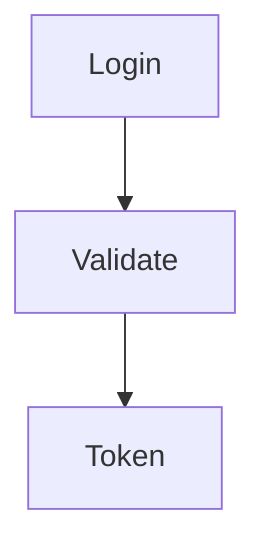

# Wiki Sprint 2: 并行分组执行实施计划

> **For agentic workers:** REQUIRED SUB-SKILL: Use superpowers:subagent-driven-development (recommended) or superpowers:executing-plans to implement this plan task-by-task. Steps use checkbox (`- [ ]`) syntax for tracking.

**Goal:** 通过 3 个并行工作流实现 B0-B8 全部 Backlog 项，将 Wiki 文档质量从 ~30% 提升至 ~80%+

**Architecture:** 3 个独立工作流并行执行 — 工作流A (上下文增强: B0/B1/B7), 工作流B (评估体系: B3/B8), 工作流C (基础设施: B5/B6/B2) — 最后 B4 收尾。各工作流修改文件无交叉。

**Tech Stack:** Python 3.11+, pytest, asyncio, FalkorDB (Cypher), LangGraph

**Spec:** `docs/superpowers/specs/2026-05-09-wiki-sprint2-parallel-execution-design.md`

---

## 工作流 A: 上下文增强 (B0 → B1 → B7)

### Task A1: B0 — Harness-lite 图查询增强叶子生成

**Files:**
- Modify: `wiki/nodes/graph_nodes.py`
- Modify: `wiki/cypher_queries.py` (引用查询常量)
- Test: `tests/wiki/test_compose_bottomup_node.py`

- [ ] **Step 1: Write failing test for `_enrich_leaf_context`**

```python
# tests/wiki/test_compose_bottomup_node.py — append to existing file
import pytest
from unittest.mock import AsyncMock, MagicMock
from wiki.models.module_tree import ModuleNode


@pytest.mark.asyncio
async def test_enrich_leaf_context_returns_structured_text():
    """_enrich_leaf_context should query graph and return structured context string."""
    from wiki.nodes.graph_nodes import _enrich_leaf_context

    node = ModuleNode(
        canonical_key="auth-service",
        entity_uids=["AuthService", "LoginHandler"],
        file_paths=["src/auth/service.py"],
        children=[],
    )

    mock_graph = AsyncMock()
    # METHODS_CY result
    methods_result = MagicMock()
    methods_result.data = [
        {"module_name": "AuthService", "func_name": "login", "signature": "(username, password)", "docstring": "Authenticate user", "file_path": "src/auth/service.py"},
    ]
    # CALLERS_CY result
    callers_result = MagicMock()
    callers_result.data = [
        {"caller_name": "ApiController", "target_name": "AuthService"},
    ]
    # call_chain result
    chain_result = MagicMock()
    chain_result.data = [
        {"caller": "ApiController", "callee": "AuthService", "caller_functions": ["handle_request"], "callee_functions": ["login"]},
    ]
    # CHUNK_SNIPPETS_CY result
    snippets_result = MagicMock()
    snippets_result.data = [
        {"entity_name": "AuthService", "snippet": "class AuthService:\n    def login(self, username, password):\n        return self.db.authenticate(username, password)", "file_path": "src/auth/service.py"},
    ]

    mock_graph.execute_query = AsyncMock(side_effect=[methods_result, callers_result, chain_result, snippets_result])

    result = await _enrich_leaf_context(node, mock_graph)

    assert isinstance(result, str)
    assert "login" in result
    assert "AuthService" in result
    assert "ApiController" in result
    assert len(result) > 100
    assert len(result) <= 8000
```

- [ ] **Step 2: Run test to verify it fails**

Run: `cd /Users/earthchen/ai-work/agent-work/knowledge-base-service && python -m pytest tests/wiki/test_compose_bottomup_node.py::test_enrich_leaf_context_returns_structured_text -v`
Expected: FAIL with "cannot import name '_enrich_leaf_context'"

- [ ] **Step 3: Implement `_enrich_leaf_context`**

Add to `wiki/nodes/graph_nodes.py` before `_compose_leaf_for_bottomup`:

```python
async def _enrich_leaf_context(node: Any, graph_store: Any) -> str:
    """Batch graph queries to gather rich context for a leaf node. No LLM calls."""
    from wiki.cypher_queries import METHODS_CY, CALLERS_CY, CHUNK_SNIPPETS_CY, call_chain_cypher

    names = list(node.entity_uids[:15])
    if not names:
        return ""

    params = {"names": names}

    async def _safe_query(cypher: str) -> list[dict]:
        try:
            result = await graph_store.execute_query(cypher, params)
            return getattr(result, "data", []) or []
        except Exception:
            log.warning("enrich_context_query_failed", exc_info=True)
            return []

    methods_rows, callers_rows, chain_rows, snippet_rows = await asyncio.gather(
        _safe_query(METHODS_CY),
        _safe_query(CALLERS_CY),
        _safe_query(call_chain_cypher(2)),
        _safe_query(CHUNK_SNIPPETS_CY),
    )

    sections: list[str] = []

    if methods_rows:
        lines = ["### 方法签名"]
        for r in methods_rows[:20]:
            sig = r.get("signature", "")
            doc = r.get("docstring", "")
            lines.append(f"- `{r.get('module_name', '')}.{r.get('func_name', '')}({sig})`" + (f" — {doc[:80]}" if doc else ""))
        sections.append("\n".join(lines))

    if callers_rows:
        lines = ["### 调用方"]
        for r in callers_rows[:15]:
            lines.append(f"- {r.get('caller_name', '')} → {r.get('target_name', '')}")
        sections.append("\n".join(lines))

    if chain_rows:
        lines = ["### 调用链"]
        for r in chain_rows[:10]:
            c_fns = r.get("caller_functions", [])
            e_fns = r.get("callee_functions", [])
            fn_info = f" [{','.join(c_fns[:3])} → {','.join(e_fns[:3])}]" if c_fns or e_fns else ""
            lines.append(f"- {r.get('caller', '')} → {r.get('callee', '')}{fn_info}")
        sections.append("\n".join(lines))

    if snippet_rows:
        lines = ["### 关键代码"]
        for r in snippet_rows[:5]:
            snippet = r.get("snippet", "")[:1500]
            lines.append(f"**{r.get('entity_name', '')}** ({r.get('file_path', '')})")
            lines.append(f"```\n{snippet}\n```")
        sections.append("\n".join(lines))

    context = "\n\n".join(sections)
    return context[:8000]
```

- [ ] **Step 4: Run test to verify it passes**

Run: `cd /Users/earthchen/ai-work/agent-work/knowledge-base-service && python -m pytest tests/wiki/test_compose_bottomup_node.py::test_enrich_leaf_context_returns_structured_text -v`
Expected: PASS

- [ ] **Step 5: Write failing test for enriched compose_leaf**

```python
# tests/wiki/test_compose_bottomup_node.py — append
@pytest.mark.asyncio
async def test_compose_leaf_uses_enriched_context_when_graph_available():
    """When graph_store is available, _compose_leaf_for_bottomup should include code snippets in prompt."""
    from unittest.mock import patch
    from wiki.nodes.graph_nodes import _compose_leaf_for_bottomup

    node = ModuleNode(
        canonical_key="auth-service",
        entity_uids=["AuthService"],
        file_paths=["src/auth/service.py"],
        children=[],
    )
    node.title = "Auth Service"

    mock_llm = AsyncMock()
    mock_llm.generate = AsyncMock(return_value="# Auth Service\n\nHandles authentication with login() method.")

    mock_graph = AsyncMock()

    with patch("wiki.nodes.graph_nodes._enrich_leaf_context", new_callable=AsyncMock) as mock_enrich:
        mock_enrich.return_value = "### 方法签名\n- `AuthService.login(username, password)` — Authenticate user"
        result = await _compose_leaf_for_bottomup(node, mock_llm, None, graph_store=mock_graph)

    assert result["content"]
    mock_enrich.assert_called_once_with(node, mock_graph)
    call_args = mock_llm.generate.call_args
    prompt_text = str(call_args)
    assert "AuthService.login" in prompt_text or "方法签名" in prompt_text
```

- [ ] **Step 6: Run test to verify it fails**

Run: `cd /Users/earthchen/ai-work/agent-work/knowledge-base-service && python -m pytest tests/wiki/test_compose_bottomup_node.py::test_compose_leaf_uses_enriched_context_when_graph_available -v`
Expected: FAIL (signature mismatch or missing graph_store param)

- [ ] **Step 7: Wire graph_store into `_compose_leaf_for_bottomup` and `compose_bottomup_node`**

Modify `wiki/nodes/graph_nodes.py`:

In `compose_bottomup_node`, restore graph_store extraction:
```python
    configurable = (config or {}).get("configurable", {}) or {}
    llm = configurable.get("llm")
    graph_store = configurable.get("graph_store")
```

In `_bounded_leaf`, pass graph_store:
```python
    async def _bounded_leaf(node: Any) -> dict[str, Any]:
        async with sem:
            result = await _compose_leaf_for_bottomup(node, llm, module_summaries, graph_store=graph_store)
```

In `_compose_leaf_for_bottomup`, add parameter and enrichment logic:
```python
async def _compose_leaf_for_bottomup(
    node: Any,
    llm: Any,
    module_summaries: dict[str, Any] | None = None,
    *,
    graph_store: Any | None = None,
) -> dict[str, Any]:
    title = node.title or node.canonical_key
    # ... existing module_summaries check ...

    # After collected_summaries check, before llm fallback:
    enriched_context = ""
    if graph_store and not collected_summaries:
        try:
            enriched_context = await _enrich_leaf_context(node, graph_store)
        except Exception:
            log.warning("enrich_context_failed", key=node.canonical_key, exc_info=True)

    if collected_summaries:
        # ... existing reuse logic (unchanged) ...
    elif not llm:
        content = f"# {title}\n\n(No LLM available)"
    else:
        system = "你是代码文档专家，根据代码模块信息生成清晰的 Wiki 文档页面。输出 Markdown 格式。"
        context_section = f"\n\n## 代码上下文\n\n{enriched_context}" if enriched_context else ""
        prompt = (
            f"为代码模块「{title}」生成 Wiki 文档。\n"
            f"包含的代码实体: {', '.join(node.entity_uids[:15])}\n"
            f"文件路径: {', '.join(node.file_paths[:10])}\n"
            f"{context_section}"
        )
        try:
            content = await llm.generate(prompt, system=system, max_tokens=2000)
        except Exception:
            log.warning("compose_leaf_failed", canonical_key=node.canonical_key, exc_info=True)
            content = f"# {title}\n\n(Generation failed)"
    # ... return dict ...
```

- [ ] **Step 8: Run all compose_bottomup tests**

Run: `cd /Users/earthchen/ai-work/agent-work/knowledge-base-service && python -m pytest tests/wiki/test_compose_bottomup_node.py -v`
Expected: ALL PASS

- [ ] **Step 9: Commit**

```bash
git add wiki/nodes/graph_nodes.py tests/wiki/test_compose_bottomup_node.py
git commit -m "feat(B0): add Harness-lite graph-enriched leaf generation

Pre-fetch methods, callers, call chains, and code snippets from graph
database before LLM call. Single LLM call with rich context instead
of multi-round agent loop. Quality ~80% at ~1x latency cost."
```

---

### Task A2: B1 — 上下文预算优化

**Files:**
- Modify: `wiki/page_agent.py`
- Test: `tests/wiki/test_page_agent_constants.py` (create)

- [ ] **Step 1: Write failing test for updated constants**

```python
# tests/wiki/test_page_agent_constants.py
def test_single_result_limit_is_6000():
    from wiki.page_agent import SINGLE_RESULT_LIMIT
    assert SINGLE_RESULT_LIMIT == 6000


def test_working_memory_max_total_chars_is_80000():
    from wiki.page_agent import WorkingMemory
    assert WorkingMemory.MAX_TOTAL_CHARS == 80000
```

- [ ] **Step 2: Run test to verify it fails**

Run: `cd /Users/earthchen/ai-work/agent-work/knowledge-base-service && python -m pytest tests/wiki/test_page_agent_constants.py -v`
Expected: FAIL (4000 != 6000, 50000 != 80000)

- [ ] **Step 3: Update constants in `wiki/page_agent.py`**

```python
# Line 43: SINGLE_RESULT_LIMIT = 4000 → 6000
SINGLE_RESULT_LIMIT = 6000

# In WorkingMemory class: MAX_TOTAL_CHARS = 50000 → 80000
MAX_TOTAL_CHARS = 80000
```

And in `_tool_read_file`, change the default end_line calculation:
```python
# Line ~991: end_line = start_line + 100 → start_line + 200
if not end_line:
    end_line = start_line + 200
if end_line < start_line:
    end_line = start_line + 200
```

- [ ] **Step 4: Run test to verify it passes**

Run: `cd /Users/earthchen/ai-work/agent-work/knowledge-base-service && python -m pytest tests/wiki/test_page_agent_constants.py -v`
Expected: PASS

- [ ] **Step 5: Commit**

```bash
git add wiki/page_agent.py tests/wiki/test_page_agent_constants.py
git commit -m "feat(B1): increase context budget limits

SINGLE_RESULT_LIMIT: 4000→6000, WorkingMemory: 50K→80K chars,
read_file default range: 100→200 lines."
```

---

### Task A3: B7 — heal_pages 暴露图查询工具

**Files:**
- Modify: `wiki/nodes/heal.py`
- Test: `tests/wiki/test_heal_pages_enhanced.py`

- [ ] **Step 1: Write failing test**

```python
# tests/wiki/test_heal_pages_enhanced.py — append or create
import pytest
from unittest.mock import AsyncMock, MagicMock, patch


@pytest.mark.asyncio
async def test_heal_uses_agent_enrich_when_graph_store_available():
    """heal_pages_node should pass graph_store to WikiPageAgent.enrich when available."""
    from wiki.nodes.heal import heal_pages_node

    state = {
        "pages": [
            {
                "path": "test-page",
                "title": "Test Page",
                "content": "# Test\n\n<!-- CONTEXT_GAP: missing implementation details -->\n\nShort content.",
                "page_type": "module_overview",
                "diagrams": [],
                "source_locations": [],
                "method_locations": [],
                "metadata": {"node_count": 0, "edge_count": 0, "generation_mode": "structure"},
            }
        ],
        "pages_to_heal": ["test-page"],
        "heal_attempts": {},
        "heal_hints": {},
        "quality_scores": {"test-page": {"l1_structural": 0.3, "overall": 0.3}},
        "config": {},
        "modules": {},
    }

    mock_llm = AsyncMock()
    mock_llm.generate = AsyncMock(return_value="# Test\n\n## 概述\n\nThis is a well-written test page with proper content and structure.\n\n## 核心业务流程\n\nThe test module handles testing workflows.")
    mock_graph = AsyncMock()

    config = {"configurable": {"llm": mock_llm, "graph_store": mock_graph}}

    with patch("wiki.nodes.heal.WikiPageAgent") as MockAgent:
        mock_agent_instance = AsyncMock()
        mock_agent_instance.enrich = AsyncMock(return_value="# Test\n\n## 概述\n\nEnriched content with graph context.\n\n## 核心业务流程\n\nDetailed flow.")
        MockAgent.return_value = mock_agent_instance

        result = await heal_pages_node(state, config)

    MockAgent.assert_called_once()
    call_kwargs = MockAgent.call_args
    assert call_kwargs[1].get("graph_store") == mock_graph or (len(call_kwargs[0]) > 1 and call_kwargs[0][1] == mock_graph)
```

- [ ] **Step 2: Run test to verify it fails**

Run: `cd /Users/earthchen/ai-work/agent-work/knowledge-base-service && python -m pytest tests/wiki/test_heal_pages_enhanced.py::test_heal_uses_agent_enrich_when_graph_store_available -v`
Expected: FAIL

- [ ] **Step 3: Modify `heal_pages_node` to use WikiPageAgent with graph_store**

In `wiki/nodes/heal.py`, modify the healing logic to:
1. Extract `graph_store` from config
2. When `graph_store` is available, use `WikiPageAgent.enrich()` instead of raw `llm.generate()`
3. Fall back to existing `llm.generate()` when no graph_store

The exact modification depends on the current heal flow structure. The key change is in the LLM rewrite section where content is regenerated.

- [ ] **Step 4: Run test to verify it passes**

Run: `cd /Users/earthchen/ai-work/agent-work/knowledge-base-service && python -m pytest tests/wiki/test_heal_pages_enhanced.py -v`
Expected: PASS

- [ ] **Step 5: Run all heal tests for regression**

Run: `cd /Users/earthchen/ai-work/agent-work/knowledge-base-service && python -m pytest tests/wiki/test_heal_pages_enhanced.py tests/wiki/test_heal_loop.py tests/wiki/test_heal_multi_round.py -v`
Expected: ALL PASS

- [ ] **Step 6: Commit**

```bash
git add wiki/nodes/heal.py tests/wiki/test_heal_pages_enhanced.py
git commit -m "feat(B7): pass graph_store to heal agent for context enrichment

heal_pages_node now uses WikiPageAgent.enrich() with graph_store
when available, enabling tool-based context gathering for low-score
pages. Only affects <10% of pages so agent multi-round is acceptable."
```

---

## 工作流 B: 评估体系 (B3 → B8)

### Task B1: B3 — L3 质量评估统一 (4 维 1-5 分制)

**Files:**
- Modify: `wiki/pipeline_graph.py` (quality_gate_node)
- Test: `tests/wiki/test_harness_evaluator_l3.py`

- [ ] **Step 1: Write failing test for L3 integration into quality_gate_node**

```python
# tests/wiki/test_harness_evaluator_l3.py — append
import pytest
from unittest.mock import AsyncMock, MagicMock, patch


@pytest.mark.asyncio
async def test_quality_gate_uses_harness_evaluator_l3():
    """quality_gate_node should use WikiPageEvaluator.evaluate_l3 for L3 scoring."""
    from wiki.pipeline_graph import quality_gate_node

    state = {
        "pages": [
            {
                "path": "core-auth",
                "title": "Auth Module",
                "content": "# Auth Module\n\n## 概述\nHandles authentication.\n\n## 核心业务流程\nLogin flow via JWT tokens.\n\n## 关键实现\n```python\ndef login(): pass\n```",
                "page_type": "module_overview",
                "diagrams": [],
                "source_locations": [],
                "method_locations": [],
                "metadata": {"node_count": 1, "edge_count": 0, "generation_mode": "structure"},
            }
        ],
        "config": {"importance_tiers": {"core-auth": "core"}, "quality_levels": ["L1", "L2", "L3"]},
        "modules": {},
        "heal_attempts": {},
    }

    mock_llm = AsyncMock()

    with patch("wiki.pipeline_graph.WikiPageEvaluator") as MockEval:
        from wiki.harness_evaluator import EvalResult
        mock_eval_instance = MagicMock()
        mock_eval_instance.evaluate_l3 = AsyncMock(return_value=EvalResult(
            score=3.5,
            passed=True,
            dimensions={"completeness": 4.0, "accuracy": 3.0, "readability": 4.0, "structure": 3.0},
        ))
        MockEval.return_value = mock_eval_instance

        config = {"configurable": {"llm": mock_llm}}
        result = await quality_gate_node(state, config)

    scores = result.get("quality_scores", {})
    assert "core-auth" in scores
    l3_score = scores["core-auth"].get("l3_llm_judge")
    assert l3_score is not None
    assert 0.0 <= l3_score <= 1.0
```

- [ ] **Step 2: Run test to verify it fails**

Run: `cd /Users/earthchen/ai-work/agent-work/knowledge-base-service && python -m pytest tests/wiki/test_harness_evaluator_l3.py::test_quality_gate_uses_harness_evaluator_l3 -v`
Expected: FAIL

- [ ] **Step 3: Modify `quality_gate_node` to use `WikiPageEvaluator.evaluate_l3`**

In `wiki/pipeline_graph.py`, in the `quality_gate_node` function, replace the existing L3 block:

```python
# Replace the existing L3 block (around line 200-207):
score_dict["l3_llm_judge"] = None
if "L3" in levels and tier == ImportanceTier.CORE and l1.overall >= 0.7:
    llm = (config or {}).get("configurable", {}).get("llm")
    if llm:
        from wiki.harness_evaluator import WikiPageEvaluator as HarnessEvaluator
        harness_eval = HarnessEvaluator()
        l3_result = await harness_eval.evaluate_l3(page.content, [page.path], llm)
        if l3_result.dimensions:
            avg_1_5 = sum(l3_result.dimensions.values()) / len(l3_result.dimensions)
            score_dict["l3_llm_judge"] = round((avg_1_5 - 1.0) / 4.0, 4)  # normalize 1-5 → 0-1
            score_dict["l3_dimensions"] = l3_result.dimensions
```

- [ ] **Step 4: Run test to verify it passes**

Run: `cd /Users/earthchen/ai-work/agent-work/knowledge-base-service && python -m pytest tests/wiki/test_harness_evaluator_l3.py -v`
Expected: PASS

- [ ] **Step 5: Commit**

```bash
git add wiki/pipeline_graph.py tests/wiki/test_harness_evaluator_l3.py
git commit -m "feat(B3): unify L3 evaluation to 4-dimension 1-5 scale

quality_gate_node now uses WikiPageEvaluator.evaluate_l3 with
CodeWiki-aligned 4 dimensions (completeness, accuracy, readability,
structure) normalized to 0-1 for quality scoring."
```

---

### Task B2: B8 — HarnessEvaluator L2 真实实现

**Files:**
- Modify: `wiki/harness_evaluator.py`
- Test: `tests/wiki/test_harness_evaluator.py`

- [ ] **Step 1: Write failing test for L2 real implementation**

```python
# tests/wiki/test_harness_evaluator.py — append
def test_evaluate_l2_scores_code_coverage():
    """L2 should score based on code block references, Mermaid diagrams, and cross-refs."""
    from wiki.harness_evaluator import WikiPageEvaluator

    evaluator = WikiPageEvaluator()

    content_good = """# Auth Module

## 概述
Handles authentication via `AuthService`.

## 核心业务流程


Key classes: `AuthService`, `TokenManager`, `UserValidator`

See also: [[token-service]], [[user-module]]
"""

    content_bad = """# Auth Module

## 概述
Some overview without code references.

## 核心业务流程
Login flow.
"""

    modules = ["AuthService", "TokenManager", "UserValidator"]
    l1_good = evaluator.evaluate_l1(content_good, modules)
    l1_bad = evaluator.evaluate_l1(content_bad, modules)

    l2_good = evaluator.evaluate_l2(content_good, modules, None, l1_good)
    l2_bad = evaluator.evaluate_l2(content_bad, modules, None, l1_bad)

    assert l2_good.score > l2_bad.score
    assert l2_good.score > 0.5
```

- [ ] **Step 2: Run test to verify it fails**

Run: `cd /Users/earthchen/ai-work/agent-work/knowledge-base-service && python -m pytest tests/wiki/test_harness_evaluator.py::test_evaluate_l2_scores_code_coverage -v`
Expected: FAIL (L2 currently returns L1 result, so scores may be equal)

- [ ] **Step 3: Implement real L2 evaluation**

Replace `evaluate_l2` in `wiki/harness_evaluator.py`:

```python
def evaluate_l2(self, content, modules, llm, l1_result) -> EvalResult:
    """Static analysis benchmark: code refs, Mermaid diagrams, cross-references."""
    import re

    issues: list[Issue] = list(l1_result.issues)
    scores: list[float] = [l1_result.score]

    # Code reference coverage: backtick-quoted identifiers matching modules
    code_refs = set(re.findall(r'`([A-Za-z_]\w+)`', content))
    module_set = set(m.lower() for m in modules)
    matched_refs = sum(1 for r in code_refs if r.lower() in module_set)
    ref_coverage = matched_refs / max(len(modules), 1)
    scores.append(min(1.0, ref_coverage))
    if ref_coverage < 0.5:
        issues.append(Issue("code_refs", "warning", f"代码引用覆盖率 {ref_coverage:.0%}", "添加更多 `ModuleName` 引用"))

    # Mermaid diagram presence and basic validity
    mermaid_blocks = re.findall(r'```mermaid\s*(.*?)```', content, re.DOTALL)
    has_mermaid = len(mermaid_blocks) > 0
    mermaid_valid = all(
        any(kw in block for kw in ("graph", "flowchart", "sequenceDiagram", "classDiagram", "stateDiagram"))
        for block in mermaid_blocks
    ) if mermaid_blocks else False
    mermaid_score = 1.0 if (has_mermaid and mermaid_valid) else (0.5 if has_mermaid else 0.0)
    scores.append(mermaid_score)
    if not has_mermaid:
        issues.append(Issue("diagram", "warning", "缺少 Mermaid 架构图", "添加 ```mermaid 图表"))

    # Cross-reference links [[...]]
    cross_refs = re.findall(r'\[\[([^\]]+)\]\]', content)
    cross_ref_score = min(1.0, len(cross_refs) * 0.25)
    scores.append(cross_ref_score)
    if not cross_refs:
        issues.append(Issue("cross_refs", "info", "无交叉引用链接", "添加 [[related-module]] 链接"))

    final_score = sum(scores) / len(scores) if scores else 0.0
    return EvalResult(
        score=round(final_score, 4),
        passed=final_score >= self.PASS_THRESHOLD,
        issues=issues,
        suggestions=[i.suggestion for i in issues if i.severity == "error"],
    )
```

- [ ] **Step 4: Run test to verify it passes**

Run: `cd /Users/earthchen/ai-work/agent-work/knowledge-base-service && python -m pytest tests/wiki/test_harness_evaluator.py -v`
Expected: PASS

- [ ] **Step 5: Commit**

```bash
git add wiki/harness_evaluator.py tests/wiki/test_harness_evaluator.py
git commit -m "feat(B8): implement real L2 benchmark evaluation

L2 now checks code reference coverage, Mermaid diagram presence
and validity, and cross-reference link count. No longer stubs
to L1 result."
```

---

## 工作流 C: 基础设施 (B5 → B6 → B2)

### Task C1: B5 — LLM clustering fallback (decomposer)

**Files:**
- Modify: `wiki/graph_module_decomposer.py`
- Test: `tests/wiki/test_graph_module_decomposer.py`

- [ ] **Step 1: Write failing test for async decompose and LLM clustering**

```python
# tests/wiki/test_graph_module_decomposer.py — append
import pytest
from unittest.mock import AsyncMock
import json


@pytest.mark.asyncio
async def test_maybe_split_scc_uses_llm_clustering_when_available():
    """When LLM is available and members > 10, should attempt LLM clustering."""
    from wiki.graph_module_decomposer import GraphModuleDecomposer

    mock_llm = AsyncMock()
    mock_llm.generate = AsyncMock(return_value=json.dumps({
        "groups": [
            ["A", "B", "C", "D", "E"],
            ["F", "G", "H", "I", "J", "K"],
        ]
    }))

    decomposer = GraphModuleDecomposer(llm=mock_llm, max_tokens_per_module=100)
    members = [chr(65 + i) for i in range(11)]  # A-K
    node_files = {m: [f"src/{m.lower()}.py"] for m in members}
    node_tokens = {m: 50 for m in members}  # total 550 > 100
    edges = []

    node = await decomposer._maybe_split_scc(members, node_files, node_tokens, edges, set())

    assert node.children is not None
    assert len(node.children) == 2
    mock_llm.generate.assert_called_once()


@pytest.mark.asyncio
async def test_maybe_split_scc_falls_back_on_llm_failure():
    """When LLM clustering fails, should fall back to path-prefix grouping."""
    from wiki.graph_module_decomposer import GraphModuleDecomposer

    mock_llm = AsyncMock()
    mock_llm.generate = AsyncMock(side_effect=Exception("LLM unavailable"))

    decomposer = GraphModuleDecomposer(llm=mock_llm, max_tokens_per_module=100)
    members = [chr(65 + i) for i in range(11)]
    node_files = {m: [f"src/{'auth' if i < 5 else 'api'}/{m.lower()}.py"] for i, m in enumerate(members)}
    node_tokens = {m: 50 for m in members}
    edges = []

    node = await decomposer._maybe_split_scc(members, node_files, node_tokens, edges, set())

    assert node.children is not None
    assert len(node.children) >= 2
```

- [ ] **Step 2: Run test to verify it fails**

Run: `cd /Users/earthchen/ai-work/agent-work/knowledge-base-service && python -m pytest tests/wiki/test_graph_module_decomposer.py::test_maybe_split_scc_uses_llm_clustering_when_available -v`
Expected: FAIL (TypeError: _maybe_split_scc is not async, or no LLM clustering logic)

- [ ] **Step 3: Convert `_maybe_split_scc` and `decompose_from_graph` to async, add LLM clustering**

Modify `wiki/graph_module_decomposer.py`:

1. Change `def _maybe_split_scc(...)` → `async def _maybe_split_scc(...)`
2. Change `def decompose_from_graph(...)` → `async def decompose_from_graph(...)`
3. Update all internal calls from `self._maybe_split_scc(...)` to `await self._maybe_split_scc(...)`
4. Add LLM clustering before path-prefix fallback:

```python
async def _maybe_split_scc(self, members, node_files, node_tokens, edges, existing_keys):
    # ... existing token budget check ...
    # ... existing len(members) <= 2 check ...

    # Try connected components first (existing logic)
    components = self._find_connected_components(members, edges)
    if len(components) > 1:
        children = []
        for comp in components:
            child = await self._maybe_split_scc(comp, node_files, node_tokens, edges, existing_keys)
            children.append(child)
        # ... return parent node with children ...

    # NEW: Try LLM clustering when available and members > 10
    if self._llm and len(members) > 10:
        try:
            cluster_result = await self._llm_cluster(members)
            if cluster_result and len(cluster_result) > 1:
                children = []
                for group in cluster_result:
                    child = await self._maybe_split_scc(group, node_files, node_tokens, edges, existing_keys)
                    children.append(child)
                # ... return parent node with children ...
        except Exception:
            log.warning("llm_clustering_failed", member_count=len(members), exc_info=True)

    # Existing: path-prefix fallback
    groups = self._group_by_path_prefix(members, node_files)
    # ...

async def _llm_cluster(self, members: list[str]) -> list[list[str]] | None:
    """Ask LLM to semantically cluster members into ≤5 groups."""
    prompt = (
        f"将以下 {len(members)} 个代码模块按语义相关性分为 2-5 个组。\n"
        f"模块列表: {', '.join(members)}\n"
        f'输出 JSON: {{"groups": [["mod1", "mod2"], ["mod3", "mod4"]]}}'
    )
    raw = await self._llm.generate(prompt, max_tokens=500)
    data = json.loads(raw)
    groups = data.get("groups", [])
    if not groups or not all(isinstance(g, list) for g in groups):
        return None
    all_members_set = set(members)
    valid_groups = [[m for m in g if m in all_members_set] for g in groups]
    valid_groups = [g for g in valid_groups if g]
    covered = set()
    for g in valid_groups:
        covered.update(g)
    uncovered = all_members_set - covered
    if uncovered:
        valid_groups.append(sorted(uncovered))
    return valid_groups if len(valid_groups) > 1 else None
```

5. Update `graph_decompose_node` in `wiki/nodes/graph_nodes.py` to `await` the now-async method:
```python
tree = await decomposer.decompose_from_graph(...)
```

- [ ] **Step 4: Run test to verify it passes**

Run: `cd /Users/earthchen/ai-work/agent-work/knowledge-base-service && python -m pytest tests/wiki/test_graph_module_decomposer.py -v`
Expected: ALL PASS

- [ ] **Step 5: Commit**

```bash
git add wiki/graph_module_decomposer.py wiki/nodes/graph_nodes.py tests/wiki/test_graph_module_decomposer.py
git commit -m "feat(B5): add LLM clustering fallback to decomposer

Convert decompose_from_graph to async. When members > 10 and LLM
is available, attempt semantic clustering before path-prefix
fallback. LLM failure silently degrades to deterministic splitting."
```

---

### Task C2: B6 — canonical_key 链接统一

**Files:**
- Modify: `wiki/tree_linker.py`
- Test: `tests/wiki/test_tree_linker_canonical.py`

- [ ] **Step 1: Write failing test for canonical_key linking**

```python
# tests/wiki/test_tree_linker_canonical.py — append or create
def test_canonical_key_exact_match_preferred():
    """Link resolution should prefer exact canonical_key match over fuzzy domain match."""
    from wiki.tree_linker import WikiTreeLinker

    # This test verifies that when a page has canonical_key set,
    # the linking logic uses it directly instead of _find_best_domain heuristic.
    # Exact implementation depends on the current _find_best_domain usage.
    # The test should construct pages with canonical_keys and verify
    # the linker resolves [[canonical_key]] to the correct page.
    # NOTE: Subagent must read wiki/tree_linker.py first to understand
    # the current _find_best_domain implementation and write a precise
    # test that verifies canonical_key exact match takes priority.
    # The test should create WikiPage objects with canonical_key attributes
    # and verify linking resolves correctly.
    assert False, "Subagent must implement this test after reading tree_linker.py"
```

- [ ] **Step 2: Read `wiki/tree_linker.py` to understand current `_find_best_domain` usage**

The subagent must read the full `wiki/tree_linker.py` file to understand:
- Where `_find_best_domain` is called
- What inputs it takes
- How to replace with `canonical_key` lookup

- [ ] **Step 3: Implement canonical_key linking**

Replace fuzzy matching with canonical_key lookup in the appropriate methods.
Mark `_find_best_domain` as deprecated fallback.

- [ ] **Step 4: Run tests**

Run: `cd /Users/earthchen/ai-work/agent-work/knowledge-base-service && python -m pytest tests/wiki/test_tree_linker_canonical.py -v`
Expected: PASS

- [ ] **Step 5: Commit**

```bash
git add wiki/tree_linker.py tests/wiki/test_tree_linker_canonical.py
git commit -m "feat(B6): prefer canonical_key for deterministic link resolution

Replace _find_best_domain heuristic with canonical_key exact match.
Old heuristic retained as deprecated fallback for backward compat."
```

---

### Task C3: B2 — delegate_submodule 真实实现

**Files:**
- Modify: `wiki/page_agent.py`
- Test: `tests/wiki/test_page_agent_delegate.py` (create)

- [ ] **Step 1: Write failing test for real delegation**

```python
# tests/wiki/test_page_agent_delegate.py
import pytest
from unittest.mock import AsyncMock, MagicMock, patch


@pytest.mark.asyncio
async def test_delegate_submodule_creates_sub_agent():
    """_tool_delegate_submodule should create a sub WikiPageAgent and call generate."""
    from wiki.page_agent import WikiPageAgent

    mock_llm = AsyncMock()
    mock_graph = AsyncMock()

    agent = WikiPageAgent(llm=mock_llm, graph_store=mock_graph, repo_path="/tmp/repo")
    agent._delegation_depth = 0
    agent._delegation_count = 0

    with patch.object(WikiPageAgent, "generate", new_callable=AsyncMock) as mock_generate:
        mock_generate.return_value = "# SubModule\n\nGenerated content for submodule delegation result."
        result = await agent._tool_delegate_submodule({
            "entity_names": ["SubAuth", "SubToken"],
            "focus": "authentication flow",
        })

    assert result.get("delegated") is True
    assert "content" in result
    assert len(result["content"]) > 50


@pytest.mark.asyncio
async def test_delegate_depth_limit_enforced():
    """Should return error when delegation depth exceeds limit."""
    from wiki.page_agent import WikiPageAgent

    agent = WikiPageAgent(llm=AsyncMock(), graph_store=AsyncMock())
    agent._delegation_depth = 2

    result = await agent._tool_delegate_submodule({"entity_names": ["A"], "focus": ""})

    assert "error" in result
    assert "depth" in result.get("error", "")


@pytest.mark.asyncio
async def test_delegate_count_limit_enforced():
    """Should return error when delegation count exceeds limit."""
    from wiki.page_agent import WikiPageAgent

    agent = WikiPageAgent(llm=AsyncMock(), graph_store=AsyncMock())
    agent._delegation_depth = 0
    agent._delegation_count = 3

    result = await agent._tool_delegate_submodule({"entity_names": ["A"], "focus": ""})

    assert "error" in result
    assert "count" in result.get("error", "") or "delegation" in result.get("error", "").lower()
```

- [ ] **Step 2: Run test to verify it fails**

Run: `cd /Users/earthchen/ai-work/agent-work/knowledge-base-service && python -m pytest tests/wiki/test_page_agent_delegate.py -v`
Expected: FAIL (current implementation returns placeholder, not actual content)

- [ ] **Step 3: Implement real delegation in `_tool_delegate_submodule`**

Replace the placeholder in `wiki/page_agent.py`:

```python
async def _tool_delegate_submodule(self, args: dict[str, Any]) -> dict[str, Any]:
    entity_names = args.get("entity_names", [])
    focus = args.get("focus", "")
    depth = getattr(self, "_delegation_depth", 0)
    count = getattr(self, "_delegation_count", 0)

    if depth >= self._MAX_DELEGATION_DEPTH:
        return {"error": f"max delegation depth reached: {depth}"}
    if count >= self._MAX_DELEGATIONS_PER_AGENT:
        return {"error": f"max delegations per agent reached: {count}"}

    self._delegation_count = count + 1

    try:
        sub_agent = WikiPageAgent(
            llm=self._llm,
            graph_store=self._graph,
            repo_path=self._repo_path,
            search_service=self._search_service,
        )
        sub_agent._delegation_depth = depth + 1
        sub_agent._delegation_count = 0

        domain_name = focus or ", ".join(entity_names[:3])
        content = await sub_agent.generate(
            module_names=entity_names,
            domain_name=domain_name,
            baseline_context={},
            max_rounds=3,
        )
        return {
            "delegated": True,
            "entity_names": entity_names,
            "focus": focus,
            "content": content,
        }
    except Exception as e:
        log.warning("delegate_submodule_failed", entities=entity_names, error=str(e))
        return {
            "delegated": True,
            "entity_names": entity_names,
            "focus": focus,
            "content": "",
            "error": str(e),
        }
```

- [ ] **Step 4: Run test to verify it passes**

Run: `cd /Users/earthchen/ai-work/agent-work/knowledge-base-service && python -m pytest tests/wiki/test_page_agent_delegate.py -v`
Expected: PASS

- [ ] **Step 5: Commit**

```bash
git add wiki/page_agent.py tests/wiki/test_page_agent_delegate.py
git commit -m "feat(B2): implement real delegate_submodule with sub-agent

Create child WikiPageAgent instance for delegated generation.
Depth limit ≤2, max 3 delegations per agent. Sub-agent shares
graph_store and LLM with parent."
```

---

## 收尾: B4 — Harness sectional + coherence pass

### Task D1: B4 — Harness sectional 生成模式

**Files:**
- Modify: `wiki/harness.py`
- Test: `tests/wiki/test_harness_smoke.py`

**前置条件:** 工作流 A (B1) 和 工作流 C (B2) 完成。

- [ ] **Step 1: Write failing test for sectional mode**

```python
# tests/wiki/test_harness_smoke.py — append
import pytest
from unittest.mock import AsyncMock, MagicMock


@pytest.mark.asyncio
async def test_harness_uses_sectional_mode_for_complex():
    """When assessment.level == 'complex', harness should generate sections separately."""
    from wiki.harness import WikiGenerationHarness

    mock_agent = AsyncMock()
    mock_agent.generate = AsyncMock(return_value="# Section\n\nContent for this section with enough detail.")
    mock_agent.repair = AsyncMock(return_value="# Repaired\n\nFixed content.")

    mock_llm = AsyncMock()
    mock_llm.generate = AsyncMock(return_value="# Coherent\n\nCombined coherent content with no contradictions.")

    mock_graph = AsyncMock()
    mock_config = MagicMock()
    mock_config.simple_threshold = 5
    mock_config.complex_threshold = 15
    mock_config.max_repair_rounds = 1
    mock_config.llm_judge_enabled = False

    harness = WikiGenerationHarness(mock_agent, mock_graph, mock_llm, mock_config)

    mock_ccb = MagicMock()
    mock_ccb.entity_count = 20
    mock_ccb.edge_count = 30

    modules = [f"Module{i}" for i in range(20)]

    result = await harness.run("complex-domain", modules, mock_ccb)

    assert isinstance(result, str)
    assert len(result) > 0
    assert mock_agent.generate.call_count >= 1
```

- [ ] **Step 2: Run test to verify it fails**

Run: `cd /Users/earthchen/ai-work/agent-work/knowledge-base-service && python -m pytest tests/wiki/test_harness_smoke.py::test_harness_uses_sectional_mode_for_complex -v`
Expected: FAIL or unexpected behavior

- [ ] **Step 3: Implement sectional mode in `WikiGenerationHarness.run`**

Modify `wiki/harness.py` `run()` to add sectional branch:

```python
async def run(self, domain, modules, ccb_context, **kwargs):
    assessment = self.router.assess(modules, ccb_context)
    plan = self.planner.plan(domain, modules, ccb_context, assessment, domain_cache=self.domain_cache)
    facts = await self._gather(plan)

    domain_summaries = [self.domain_cache[d] for d in plan.cross_domain_refs if d in self.domain_cache]
    distilled = facts.distill(
        complexity_level=assessment.level,
        domain_summaries=domain_summaries if domain_summaries else None,
    )
    baseline = distilled if distilled else None

    if assessment.level == "complex" and len(plan.outline) > 1:
        content = await self._generate_sectional(plan, modules, domain, baseline, assessment)
    else:
        content = await self.agent.generate(
            module_names=modules, domain_name=domain,
            baseline_context=baseline,
            max_rounds=3 if assessment.level == "simple" else 5,
        )

    # Evaluate + Repair loop (existing, unchanged)
    max_repairs = assessment.max_repair_rounds
    # ... existing repair loop ...

    self._update_domain_cache(domain, modules, content)
    return content

async def _generate_sectional(self, plan, modules, domain, baseline, assessment):
    """Generate content section-by-section for complex modules, then coherence pass."""
    sections: list[str] = []
    for section in plan.outline:
        section_modules = [m for m in modules if m in (section.modules if hasattr(section, 'modules') else modules[:5])]
        section_content = await self.agent.generate(
            module_names=section_modules or modules[:5],
            domain_name=f"{domain} — {section.name}",
            baseline_context=baseline,
            max_rounds=3,
        )
        sections.append(f"## {section.name}\n\n{section_content}")

    combined = f"# {domain}\n\n" + "\n\n---\n\n".join(sections)

    # Coherence pass
    coherence_prompt = (
        "以下 Wiki 页面由多个部分拼接而成，请检查并修复:\n"
        "1. 重复内容\n2. 矛盾信息\n3. 不连贯的过渡\n\n"
        f"{combined[:6000]}\n\n"
        "输出修正后的完整页面。"
    )
    try:
        coherent = await self.llm.generate(coherence_prompt, system="你是文档编辑专家。")
        if coherent and len(coherent.strip()) > len(combined) * 0.5:
            return coherent
    except Exception:
        log.warning("coherence_pass_failed", domain=domain, exc_info=True)

    return combined
```

- [ ] **Step 4: Run test to verify it passes**

Run: `cd /Users/earthchen/ai-work/agent-work/knowledge-base-service && python -m pytest tests/wiki/test_harness_smoke.py -v`
Expected: PASS

- [ ] **Step 5: Run full test suite regression**

Run: `cd /Users/earthchen/ai-work/agent-work/knowledge-base-service && python -m pytest tests/ -v --timeout=60`
Expected: ALL PASS

- [ ] **Step 6: Commit**

```bash
git add wiki/harness.py tests/wiki/test_harness_smoke.py
git commit -m "feat(B4): add sectional generation mode with coherence pass

Complex modules (assessment.level=='complex') now generate each
plan section separately, then run a coherence pass to fix
repetition, contradictions, and improve transitions."
```
