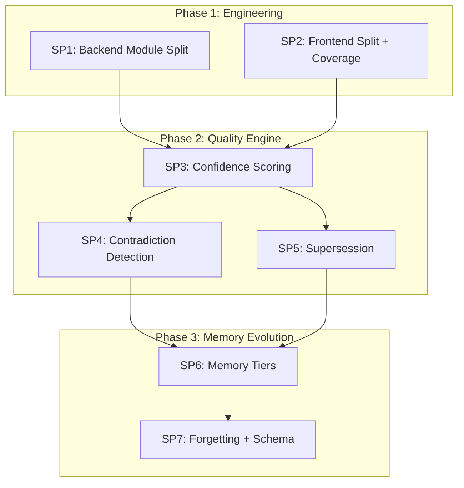

# LLM Wiki v2 — Full Upgrade Design

> **Status**: Approved  
> **Created**: 2026-04-26  
> **Scope**: 3 Phases, 7 Sub-Projects  
> **Approach**: Layered Progressive — Engineering Hardening → Knowledge Quality → Memory Evolution

---

## 1. Background & Motivation

### 1.1 Current State

The knowledge-base-service is a functional "AI Code Knowledge Base" with:
- **Ingest Pipeline** (incremental git diff + change detection)
- **Lint Health Check** (LintScheduler + AutoHealer)
- **Query/Q&A** (WikiAskService + Memory Loop)
- **Knowledge Graph** (FalkorDB entities + WikiPage + references)
- **Cross-Reference** (WikiLinks + Reference Graph)
- **Agent Interface** (MCP Server + AGENTS.md)
- **User Feedback** (thumbs up/down + backend persistence)

### 1.2 Gap Analysis (vs Karpathy LLM Wiki + DeepWiki + LLM Wiki v2)

| # | Missing Capability | Source | Impact |
|---|-------------------|--------|--------|
| 1 | Confidence Scoring | LLM Wiki v2 | HIGH |
| 2 | Contradiction Detection | Karpathy/BrainDB | HIGH |
| 3 | Supersession/Version Claims | LLM Wiki v2 | HIGH |
| 4 | Memory Consolidation Tiers | LLM Wiki v2 | MEDIUM |
| 5 | Forgetting Mechanism | LLM Wiki v2 | LOW |
| 6 | Schema/Convention Layer | Karpathy | MEDIUM |
| 7 | wiki_routes.py 1640-line monolith | Internal review | HIGH |
| 8 | wire_wiki_app_state god function | Internal review | MEDIUM |
| 9 | WikiShell/WikiContent split needed | Internal review | MEDIUM |
| 10 | No test coverage measurement | Internal review | MEDIUM |

### 1.3 Design Philosophy

> "先清理地基再建新楼" — Engineering hardening first, then knowledge intelligence.

Each Phase can be independently released. Phase 1 improves code quality to support subsequent complex features.

---

## 2. Phase 1: Engineering Hardening (2 SP)

### SP1: Backend Module Split

**Goal**: Decompose monolithic files into cohesive, single-responsibility modules.

#### Task 1: Split wiki_routes.py (1640 lines → 5 sub-modules)

| Module | Responsibility | Estimated Lines |
|--------|---------------|-----------------|
| `wiki_page_routes.py` | Page CRUD, list, search, annotations, versions | ~400 |
| `wiki_task_routes.py` | Task registry, status query, generation triggers | ~300 |
| `wiki_ask_routes.py` | Q&A streaming, deep research, suggested questions | ~250 |
| `wiki_feedback_routes.py` | Feedback, changelog, ingest, webhook | ~300 |
| `wiki_mcp_routes.py` | MCP HTTP tool call/list endpoints | ~80 |
| `wiki_routes.py` | Aggregator: imports sub-routers, `include_router()` | ~30 |

Shared models (`WikiPageFeedbackBody`, `IngestRequest`, etc.) move to `api/models/wiki_models.py`.

#### Task 2: Extract wire_wiki_app_state → wiki/bootstrap.py

```python
# wiki/bootstrap.py
async def bootstrap_wiki(app: FastAPI, settings: Settings) -> None:
    """Initialize all wiki services and attach to app.state."""
    ...

async def teardown_wiki(app: FastAPI) -> None:
    """Graceful cleanup of wiki resources."""
    ...
```

`main.py` becomes:
```python
@asynccontextmanager
async def lifespan(app: FastAPI):
    await bootstrap_wiki(app, get_settings())
    yield
    await teardown_wiki(app)
```

#### Task 3: Unify MCP error contract

`MCPWikiServer.handle_tool_call` reuses `_public_error_for_exception()` logic from `error_handler.py` to produce safe, structured error responses.

### SP2: Frontend Component Split + Coverage

#### Task 1: Split WikiShell.tsx (~420 lines → 3 modules)

| Component | Responsibility |
|-----------|---------------|
| `WikiToolTabStrip.tsx` | Tab button rendering, ARIA tablist, selection state |
| `WikiToolPanel.tsx` | Lazy panel renderer (Suspense + ErrorBoundary wrapper) |
| `WikiShell.tsx` | Layout coordinator only (~150 lines) |

#### Task 2: Split WikiContent.tsx (~525 lines → 4 modules)

| Component | Responsibility |
|-----------|---------------|
| `WikiVersionPicker.tsx` | Version dropdown + popover |
| `WikiSourceLocRow.tsx` | Source file/line display |
| `WikiCallChainSection.tsx` | Call chain visualization |
| `WikiContent.tsx` | Page chrome + composition (~250 lines) |

#### Task 3: Test Coverage Measurement

**Backend**:
- Add `pytest-cov` dependency
- Configure in `pyproject.toml`: `--cov=. --cov-report=term-missing --cov-fail-under=60`

**Frontend**:
- Add `@vitest/coverage-v8` devDependency
- Configure in `vitest.config.ts`: `coverage: { provider: 'v8', thresholds: { lines: 50 } }`

---

## 3. Phase 2: Knowledge Quality Engine (3 SP)

### SP3: Confidence Scoring

**Data Model**: `WikiPage` node gains `confidence_score: float` (0.0–1.0)

**Computation Formula**:
```
confidence = w1 * source_factor + w2 * freshness_factor + w3 * feedback_factor 
           + w4 * reference_factor - w5 * contradiction_penalty

where:
  source_factor    = min(source_entity_count / 3, 1.0)
  freshness_factor = max(1.0 - days_since_generated / 90, 0.0)
  feedback_factor  = up_count / (up_count + down_count + 1)
  reference_factor = min(inbound_ref_count / 5, 1.0)
  contradiction_penalty = contradiction_count * 0.15

  w1=0.25, w2=0.2, w3=0.2, w4=0.15, w5=1.0
```

**Implementation Files**:
- Create: `wiki/confidence_scorer.py`
- Modify: `wiki/service.py` (call scorer after generation)
- Modify: `wiki/lint.py` (recalculate during lint runs)
- Create: `dashboard/src/components/wiki/ConfidenceBadge.tsx`
- Test: `tests/wiki/test_confidence_scorer.py`

**Frontend**: ConfidenceBadge shows color-coded indicator:
- ≥0.8 → green "High Confidence"
- ≥0.5 → yellow "Medium"
- <0.5 → red "Low Confidence"

### SP4: Contradiction Detection

**Data Model**: New `WikiContradiction` node
```
(WikiContradiction {
  uid, page_uid_a, page_uid_b, description, severity,
  status: "detected" | "acknowledged" | "resolved",
  detected_at, resolved_at
})
(WikiPage)-[:HAS_CONTRADICTION]->(WikiContradiction)
```

**Detection Algorithm**:
1. Group WikiPages by entity name/FQN
2. For pages describing the same entity, compute content embedding similarity
3. If similarity < threshold (different descriptions for same entity), invoke LLM to judge
4. LLM returns: `{is_contradiction: bool, description: str, severity: "high"|"medium"|"low"}`
5. Create `WikiContradiction` node with status `detected`

**State Machine**: `detected → acknowledged → resolved`

**Implementation Files**:
- Create: `wiki/contradiction_detector.py`
- Modify: `wiki/lint.py` (run detection during lint)
- Create: `api/routes/wiki_contradiction_routes.py` (list/acknowledge/resolve)
- Create: `dashboard/src/components/wiki/ContradictionAlert.tsx`
- Test: `tests/wiki/test_contradiction_detector.py`

**Frontend**: Yellow warning banner on WikiContent when page has unresolved contradictions.

### SP5: Supersession / Version Claims

**Data Model**: `WikiClaimHistory` node
```
(WikiClaimHistory {
  uid, page_uid, claim_text, version, superseded_by,
  created_at, superseded_at
})
(WikiPage)-[:HAS_CLAIM]->(WikiClaimHistory)
```

**Generation Flow**:
1. Before regenerating a WikiPage, snapshot current claims as `WikiClaimHistory`
2. After regeneration, LLM compares old vs new content
3. Changed claims: old claim's `superseded_by` → new claim's uid
4. WikiPage gains `supersedes: list[str]` for quick lookup

**Implementation Files**:
- Create: `wiki/claim_tracker.py`
- Modify: `wiki/service.py` (snapshot + compare during generation)
- Create: `dashboard/src/components/wiki/ClaimHistoryPanel.tsx`
- Test: `tests/wiki/test_claim_tracker.py`

**Frontend**: Expandable section "Claim History" showing timeline of superseded claims.

---

## 4. Phase 3: Memory Evolution System (2 SP)

### SP6: Memory Consolidation Tiers

**Four-Tier Model**:

| Tier | Name | TTL | Promotion Criteria |
|------|------|-----|--------------------|
| 0 | Working | 24h | Immediate Q&A interactions |
| 1 | Episodic | 7d | Single session summaries |
| 2 | Semantic | Permanent | Multi-confirmation facts (access_count ≥ 3) |
| 3 | Procedural | Permanent | Validated patterns (confidence ≥ 0.8, access_count ≥ 10) |

**Data Model**: `MemoryNode` in graph
```
(MemoryNode {
  uid, tier: int, content, entity_name, repository,
  access_count, confirmation_count, last_accessed,
  created_at, promoted_at, stability_factor
})
```

**Promotion Logic** (runs during lint or on access):
```python
if tier == 0 and age > 24h:
    if access_count >= 2: promote(tier=1)
    else: expire()
if tier == 1 and age > 7d:
    if confirmation_count >= 3: promote(tier=2)
    else: expire()
if tier == 2 and access_count >= 10 and confidence >= 0.8:
    promote(tier=3)
```

**Implementation Files**:
- Create: `wiki/memory_tiers.py`
- Modify: `wiki/memory_loop.py` (integrate tier-aware retrieval)
- Create: `dashboard/src/components/wiki/MemoryTierIndicator.tsx`
- Test: `tests/wiki/test_memory_tiers.py`

### SP7: Forgetting Mechanism + Schema Layer

**Forgetting Mechanism** (Ebbinghaus-inspired):
```
retention(t) = e^(-t / S)
where S = stability_factor (increases with each access/confirmation)
```

- Each access/confirmation: `S = S * 1.5`
- Retention below 0.3: knowledge is "faded" (deprioritized in search/generation, not deleted)
- Retention below 0.1: knowledge moves to "archived" status

**Schema Layer**:
- Create: `wiki/schema.md` template defining page structure conventions
- Create: `wiki/schema_validator.py` validates pages against schema
- Lint integrates schema validation
- Users can customize schema per business/repository

**Implementation Files**:
- Create: `wiki/forgetting.py`
- Create: `wiki/schema_validator.py`
- Create: `wiki/schema.md` (default schema template)
- Modify: `wiki/lint.py` (integrate forgetting + schema validation)
- Test: `tests/wiki/test_forgetting.py`, `tests/wiki/test_schema_validator.py`

---

## 5. Dependency Graph



---

## 6. Risk Mitigation

| Risk | Mitigation |
|------|-----------|
| Module split breaks existing tests | Run full test suite after each split step |
| Confidence formula weights are wrong | Make weights configurable in WikiConfig |
| Contradiction LLM calls are expensive | Run detection only during lint (not real-time) |
| Memory tier promotion too aggressive | Conservative defaults + configurable thresholds |
| Forgetting removes useful knowledge | Never delete, only deprioritize (retention-based ranking) |

---

## 7. Feature Flags

All new capabilities gated in `WikiConfig`:

```python
# Phase 2
confidence_scoring_enabled: bool = False
contradiction_detection_enabled: bool = False
supersession_tracking_enabled: bool = False

# Phase 3
memory_tiers_enabled: bool = False
forgetting_enabled: bool = False
schema_validation_enabled: bool = False
```
