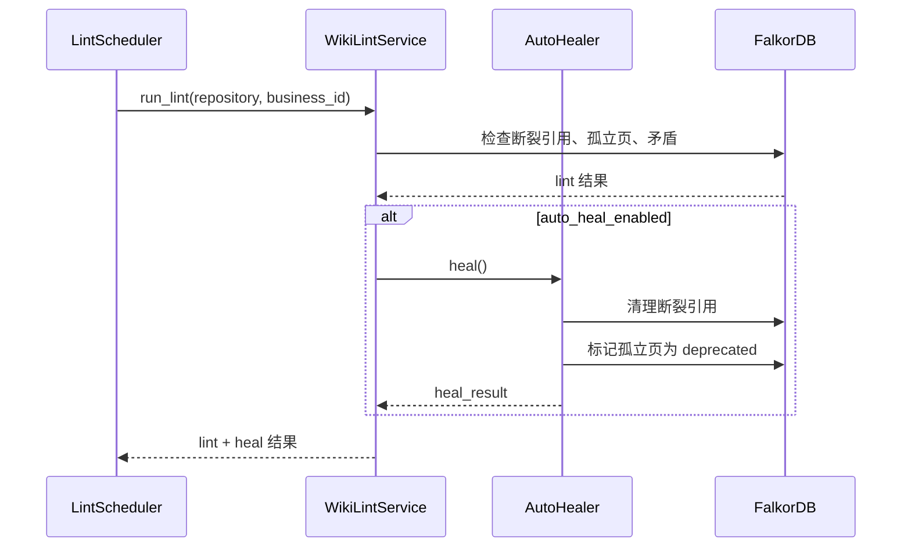

# Phase 0: 知识维护闭环修复

**状态**: Draft
**优先级**: 最高（立即可做）
**预计工期**: 1-2 天
**依赖**: 无（代码已就绪，仅需接入）

---

## 1. 背景与动机

### 1.1 问题描述

Karpathy 的 LLM Wiki 模式定义了三个核心操作：**Ingest（摄入）**、**Query（查询）**、**Lint（健康检查）**。当前 KBS 的 Ingest 和 Query 已成熟运行，但 Lint 闭环存在两个断裂点：

1. **AutoHealer 未接入运行时**：`wiki/auto_healer.py` 已实现断裂引用清理和孤立页弃用两个修复策略，但 `main.py`、`WikiLintService`、`LintScheduler` 均未调用它。`WIKI__AUTO_HEAL_ENABLED` 配置开关存在但不驱动任何运行时路径。

2. **Lint 调度默认关闭**：`lint_scheduler_enabled` 默认为 `false`，意味着即使 LintScheduler 代码就绪，也不会自动运行。知识库在生成后处于"无人看管"状态，会随着代码变更逐渐腐烂。

### 1.2 行业对标

| 系统 | Lint/维护机制 |
|------|--------------|
| Karpathy LLM Wiki | 建议每周 lint：扫描矛盾、孤立页、断裂链接、覆盖缺口 |
| DeepWiki | Wiki 缓存管理 + 结构验证 |
| KBS 当前 | LintScheduler + AutoHealer 代码就绪但均未激活 |

### 1.3 影响评估

不修复此问题意味着：
- Wiki 页面引用过时代码路径，用户信任度下降
- 已删除/重命名的实体仍在 Wiki 中被引用
- 孤立页面占据检索结果，降低搜索质量
- 矛盾检测结果无法自动处理

---

## 2. 设计方案

### 2.1 方案对比

| 方案 | 描述 | 优点 | 缺点 |
|------|------|------|------|
| **A: LintScheduler 调用 AutoHealer（推荐）** | 在 `LintScheduler` 的定期执行流程中，lint 完成后调用 `AutoHealer` | 代码改动最小；复用现有调度基础设施 | AutoHealer 执行时机与 lint 绑定 |
| B: 增量 Ingest 后触发 | 在 `POST /api/v1/wiki/ingest` 完成后自动触发 lint + heal | 变更后立即修复 | 增加 ingest 延迟；需要修改 ingest 流程 |
| C: 独立 AutoHeal 调度器 | 新建 `AutoHealScheduler` 独立调度 | 调度灵活性最高 | 增加复杂度；与 LintScheduler 逻辑重叠 |

**推荐方案 A**：最小改动，最快见效。

### 2.2 详细设计

#### 2.2.1 AutoHealer 接入 WikiLintService

```python
# wiki/lint.py — WikiLintService.run_lint() 末尾追加
if self._wiki_config.auto_heal_enabled:
    from wiki.auto_healer import AutoHealer
    healer = AutoHealer(self._graph)
    heal_result = await healer.heal()
    result["auto_heal"] = heal_result
```

#### 2.2.2 LintScheduler 默认行为调整

修改 `config.py` 中 `WikiConfig`：

```python
lint_scheduler_enabled: bool = True          # 从 False 改为 True
lint_scheduler_interval_hours: int = 6       # 保持 6 小时
auto_heal_enabled: bool = True               # 从 False 改为 True
```

#### 2.2.3 增量 Ingest 后可选 lint

在 `wiki/incremental.py` 的 `generate_incremental` 完成后，添加可选 lint 触发：

```python
if settings.wiki.auto_heal_enabled:
    lint_service = await app.state.wiki_lint_service_factory()
    await lint_service.run_lint(repository=repository, business_id=business_id)
```

此为**可选增强**，不在最小可行范围内。

### 2.3 数据流



---

## 3. 变更清单

| 文件 | 变更类型 | 描述 |
|------|----------|------|
| `config.py` | 修改 | `lint_scheduler_enabled` 和 `auto_heal_enabled` 默认值改为 `True` |
| `wiki/lint.py` | 修改 | `run_lint()` 末尾接入 `AutoHealer.heal()` |
| `wiki/auto_healer.py` | 可能修改 | 确认 `heal()` 方法签名和返回值与 lint 结果格式兼容 |
| `docs/DEPLOYMENT.md` | 修改 | 更新默认值说明 |

---

## 4. 测试计划

- [ ] 单元测试：`AutoHealer.heal()` 在有断裂引用时正确清理
- [ ] 单元测试：`AutoHealer.heal()` 在有孤立页时正确标记 deprecated
- [ ] 集成测试：`WikiLintService.run_lint()` 在 `auto_heal_enabled=True` 时调用 AutoHealer
- [ ] 集成测试：`WikiLintService.run_lint()` 在 `auto_heal_enabled=False` 时跳过 AutoHealer
- [ ] 配置测试：确认新默认值生效

---

## 5. 风险与缓解

| 风险 | 缓解措施 |
|------|----------|
| AutoHealer 误删正常页面 | AutoHealer 只做"标记 deprecated"而非物理删除；与遗忘机制一致 |
| Lint 调度频率过高影响性能 | 默认 6 小时间隔；可通过环境变量调整 |
| 已部署实例突然开启 lint | 通过 DEPLOYMENT.md 文档提醒运维人员新默认值 |

---

## 6. 成功标准

- [ ] `WIKI__AUTO_HEAL_ENABLED=true` 时，lint 运行后 AutoHealer 自动执行
- [ ] 断裂引用在 lint 后被清理
- [ ] 孤立页面被标记为 deprecated 而非删除
- [ ] 现有测试全部通过
- [ ] 1722+ 测试无回归
