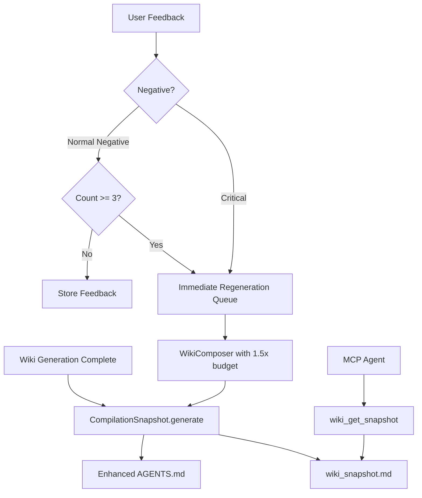

# Phase 1: 知识编译与反馈闭环

**状态**: Draft
**优先级**: 高（短期）
**预计工期**: 3-5 天
**依赖**: Phase 0（Lint 闭环修复）

---

## 1. 背景与动机

### 1.1 问题描述

Karpathy LLM Wiki 的核心洞察是 **"编译一次，使用多次"**：通过一次 Ingest 操作将原始文档编译为结构化的 Wiki 页面，后续查询直接读取编译结果，避免每次重新检索和组装上下文。

KBS 当前的问题：

1. **缺少编译快照**：每次 Agent 调用 Wiki MCP 工具查询时，系统仍需执行完整的检索流程（关键词+语义+BM25 → RRF → 可选 rerank → 图扩展）。对于稳定知识的反复查询，这既浪费 token 又可能产生不一致的结果。

2. **AGENTS.md 不够丰富**：`agents_md_generator.py` 产出的 AGENTS.md 是一个轻量级的工具指南，但缺少 Karpathy 模式中 `index.md` 那样的"全局知识地图"——让 Agent 可以在一次读取中了解整个知识库的结构和内容概览。

3. **反馈闭环未闭合**：`WikiPageFeedback` 前端组件和 `POST /api/v1/wiki/pages/{page_uid}/feedback` API 已实现，但负面反馈不会自动触发页面重新生成。SP5 设计了"反馈驱动 token budget 1.5x"，但实现状态不明。

### 1.2 Karpathy 模式对标

| Karpathy 概念 | KBS 对应 | 差距 |
|---------------|---------|------|
| `index.md` — 全局知识地图 | `AGENTS.md` | 缺少页面摘要和知识结构概览 |
| 编译层 — 稳定知识快照 | 无 | 每次查询都执行完整检索 |
| `log.md` — 变更日志 | `WikiChangeLog` | ✅ 已有 |
| Lint → 自动修复 | Phase 0 解决 | Phase 0 解决 |
| 人工审阅 git diff | Git publish | ✅ 已有 |

---

## 2. 设计方案

### 2.1 子特性 A: 知识编译快照（Wiki Compilation Snapshot）

#### 方案对比

| 方案 | 描述 | 优点 | 缺点 |
|------|------|------|------|
| **A1: Wiki 摘要文件（推荐）** | 每次生成/增量后，自动产出一个 `wiki_snapshot.md`，包含所有页面的标题+摘要+关键实体+wikilinks | 实现简单；Agent 可一次加载；token 效率高 | 需要定期更新 |
| A2: 预计算 QA 对 | 从 Wiki 页面预生成常见问答对，存入图谱 | 查询速度极快 | 覆盖有限；维护成本高 |
| A3: 向量化 Wiki 索引 | 将 Wiki 页面的摘要向量化为专用索引 | 语义检索更精准 | 与现有检索流程重叠 |

**推荐方案 A1**：与 Karpathy 的 `index.md` 理念一致，最小成本最大收益。

#### 详细设计

新增模块 `wiki/compilation_snapshot.py`:

```python
class WikiCompilationSnapshot:
    """Generates a compiled knowledge snapshot after wiki generation."""

    async def generate(self, business_id: str, repository: str) -> str:
        """Produce a markdown snapshot of all wiki pages."""
        # 1. Query all WikiPage nodes for the repository
        # 2. For each page: title, summary (first 200 chars), importance_tier, key entities
        # 3. Group by business_domain or tree structure
        # 4. Generate cross-reference map (which pages link to which)
        # 5. Append metadata: generation time, page count, coverage stats
        # 6. Write to wiki_snapshot.md and store as WikiPage node (type=snapshot)
```

输出格式示例：

```markdown
# Knowledge Base Snapshot — my-repo
Generated: 2026-04-27T10:30:00Z | Pages: 42 | Coverage: 78%

## Module: Authentication
- [[auth-service]]: OAuth2 + JWT authentication flow (core, confidence: 0.85)
- [[token-manager]]: Token lifecycle management (standard, confidence: 0.72)
  → references: auth-service, user-model

## Module: Data Pipeline
- [[indexer-pipeline]]: Tree-sitter based code indexing (core, confidence: 0.91)
...

## Cross-Reference Map
auth-service → token-manager, user-model, middleware
indexer-pipeline → embedding-generator, graph-store
...
```

#### 触发时机

- Wiki 全量生成完成后自动生成
- 增量 Ingest 完成后增量更新
- MCP 工具 `wiki_get_snapshot` 可按需获取

### 2.2 子特性 B: AGENTS.md 增强

在现有 `agents_md_generator.py` 的基础上增强：

```python
class AgentsMdGenerator:
    async def generate(self, ...) -> str:
        # 现有：工具列表 + 使用指南
        # 新增：
        # 1. 知识库概览（页面数、覆盖率、最近更新时间）
        # 2. 模块分类摘要（来自 compilation_snapshot）
        # 3. 推荐查询路径（常见问题 → 应该先查哪些页面）
        # 4. 知识质量仪表盘（平均置信度、矛盾数、陈旧页数）
```

### 2.3 子特性 C: 反馈驱动再生成闭环

#### 方案对比

| 方案 | 描述 | 优点 | 缺点 |
|------|------|------|------|
| **C1: 负面反馈触发异步重生成（推荐）** | 累计 N 条负面反馈或单条"严重不准确"时，自动排队重生成该页 | 自动化；可控 | 需要阈值调优 |
| C2: 手动触发 | 管理员在仪表盘查看反馈后手动点击重生成 | 简单安全 | 依赖人工；延迟高 |
| C3: 实时重生成 | 每条负面反馈立即触发重生成 | 最快修复 | LLM 成本不可控 |

**推荐方案 C1**：设定阈值（如 3 条负面反馈），自动排队异步重生成。

#### 详细设计

```python
# wiki/feedback_loop.py
class FeedbackDrivenRegeneration:
    NEGATIVE_THRESHOLD = 3  # 累计负面反馈数触发重生成
    CRITICAL_IMMEDIATE = True  # "严重不准确"标记立即触发

    async def on_feedback(self, page_uid: str, feedback: Feedback):
        if feedback.is_critical:
            await self._queue_regeneration(page_uid, priority="high", token_budget_multiplier=1.5)
        elif await self._count_negative(page_uid) >= self.NEGATIVE_THRESHOLD:
            await self._queue_regeneration(page_uid, priority="normal", token_budget_multiplier=1.2)

    async def _queue_regeneration(self, page_uid: str, priority: str, token_budget_multiplier: float):
        # 使用现有 task_registry 排队异步重生成任务
        # token_budget_multiplier 传递给 WikiComposer 以分配更多生成预算
```

---

## 3. 数据流



---

## 4. 变更清单

| 文件 | 变更类型 | 描述 |
|------|----------|------|
| `wiki/compilation_snapshot.py` | 新建 | 知识编译快照生成器 |
| `wiki/feedback_loop.py` | 新建 | 反馈驱动再生成逻辑 |
| `wiki/agents_md_generator.py` | 修改 | 增强输出内容 |
| `wiki/service.py` | 修改 | 生成完成后调用 `CompilationSnapshot` |
| `wiki/incremental.py` | 修改 | 增量完成后更新快照 |
| `api/routes/wiki_feedback_routes.py` | 修改 | 反馈 API 接入 `FeedbackDrivenRegeneration` |
| `api/routes/wiki_mcp_routes.py` | 修改 | 新增 `wiki_get_snapshot` MCP 工具 |
| `config.py` | 修改 | 新增 `feedback_regen_threshold`、`snapshot_enabled` 配置 |
| `wiki/bootstrap.py` | 修改 | 初始化 `CompilationSnapshot` 和 `FeedbackDrivenRegeneration` |

---

## 5. 新增 MCP 工具

| 工具名 | 类型 | 描述 |
|--------|------|------|
| `wiki_get_snapshot` | Viewer | 获取知识库编译快照（轻量级全局知识地图） |

---

## 6. 配置项

| 环境变量 | 默认值 | 描述 |
|----------|--------|------|
| `WIKI__SNAPSHOT_ENABLED` | `true` | 是否在生成后自动创建编译快照 |
| `WIKI__FEEDBACK_REGEN_THRESHOLD` | `3` | 触发自动重生成的负面反馈累计数 |
| `WIKI__FEEDBACK_REGEN_CRITICAL_IMMEDIATE` | `true` | "严重不准确"反馈是否立即触发重生成 |
| `WIKI__FEEDBACK_REGEN_TOKEN_MULTIPLIER` | `1.5` | 重生成时的 token 预算倍数 |

---

## 7. 测试计划

- [ ] 单元测试：`CompilationSnapshot.generate()` 正确汇总所有 Wiki 页面
- [ ] 单元测试：快照格式包含标题、摘要、置信度、交叉引用
- [ ] 单元测试：`FeedbackDrivenRegeneration` 在达到阈值时触发
- [ ] 单元测试：Critical 反馈立即触发
- [ ] 集成测试：Wiki 生成完成后快照自动创建
- [ ] 集成测试：增量 Ingest 后快照增量更新
- [ ] MCP 测试：`wiki_get_snapshot` 返回正确格式
- [ ] AGENTS.md 测试：增强后包含知识概览和质量指标

---

## 8. 风险与缓解

| 风险 | 缓解措施 |
|------|----------|
| 快照 token 开销 | 快照使用摘要而非全文；大型知识库分模块快照 |
| 反馈重生成循环 | 设置冷却期（同一页面 24 小时内最多重生成 1 次） |
| 快照与实际页面不同步 | 快照生成使用 graph 查询实时数据；增量更新机制 |
