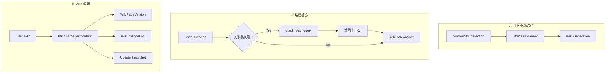

# Phase 2: 图社区驱动 Wiki 组织与编辑能力

> **实现状态：已完成（Phase 2）** — Implemented 2026-04-27. 本项已落地；当前运行时行为、默认开关与事实来源以 [IMPLEMENTATION-STATUS.md](../../IMPLEMENTATION-STATUS.md) 为准。下文保留历史问题陈述、方案与测试清单供审阅与追溯。

**状态**: 已实现 2026-04-27（原 Draft；见上方说明与 IMPLEMENTATION-STATUS）
**优先级**: 中（中期）
**预计工期**: 5-8 天
**依赖**: Phase 0 + Phase 1

---

## 1. 背景与动机

### 1.1 问题描述

KBS 拥有 FalkorDB 图存储这一核心优势，但图的结构化信息在 Wiki 生成中的利用率不足。同时，用户缺乏在系统内直接编辑 Wiki 的能力。

**三个核心缺口**：

1. **图社区未驱动 Wiki 结构**：`query/community_detection.py` 可以发现代码模块的自然聚类，但结果仅用于 UI 可视化。Wiki 的 `StructurePlanner` 依赖 LLM 规划页面结构，未利用图社区信息。这导致 Wiki 组织可能与代码的实际模块边界不匹配。

2. **缺少路径检索**：GraphRAG 最佳实践强调 path-based retrieval（找到两个实体之间的关系路径）。KBS 有 `blast_radius`（变更影响范围）和 `call_chain`（调用链），但缺少通用的"最短路径查询"能力。回答"A 和 B 之间有什么关系？"类问题时效果不佳。

3. **Wiki 无法编辑**：`WikiEditButton` 跳转到外部编辑器，用户无法在 Dashboard 内直接修改 Wiki 内容。Karpathy 模式强调"人工策展"——用户负责纠正和补充 LLM 产出的内容。

### 1.2 行业对标

| 能力 | GraphRAG 最佳实践 | DeepWiki | KBS 当前 |
|------|-------------------|----------|---------|
| 社区驱动结构 | ✅ Leiden/Louvain 社区 → 多层摘要 | ❌ | ❌ 社区仅用于 UI |
| 路径检索 | ✅ 子图检索 + 路径查询 | ❌ | ❌ 仅 blast_radius |
| 内容编辑 | N/A | ❌ 只读 | ❌ 跳转外部 |
| 人工策展 | Karpathy: git diff 审阅 | ❌ | ✅ git publish |

---

## 2. 设计方案

### 2.1 子特性 A: 图社区驱动的 Wiki 结构规划

#### 方案对比

| 方案 | 描述 | 优点 | 缺点 |
|------|------|------|------|
| **A1: 社区信息注入 StructurePlanner（推荐）** | 在 Wiki 结构规划阶段，将图社区检测结果作为额外上下文注入 LLM prompt | 最小改动；保留 LLM 灵活性；社区仅作参考 | LLM 可能忽略社区提示 |
| A2: 社区直接映射为 Wiki 章节 | 每个图社区自动成为一个 Wiki 模块 | 结构与代码完全对齐 | 过于机械；社区粒度可能不适合文档组织 |
| A3: 双策略合并 | 先 LLM 规划，后用社区结果修正 | 两全其美 | 合并逻辑复杂 |

**推荐方案 A1**：将社区检测结果序列化为 Markdown 格式，作为 `StructurePlanner` prompt 的一部分。LLM 在规划时参考但不强制遵循。

#### 详细设计

```python
# wiki/structure_planner.py — 增强
class WikiStructurePlanner:
    async def plan(self, scope, code_context, **kwargs):
        # 新增：获取图社区信息
        communities = await self._detect_communities(scope.repository)
        community_context = self._format_communities(communities)

        prompt = f"""
        ...existing prompt...

        ## Code Module Communities (from graph analysis)
        The following module clusters were detected from code dependency analysis.
        Consider using these as natural grouping boundaries for wiki sections:

        {community_context}
        """
```

社区格式化示例：

```markdown
### Community 1: Authentication & Authorization (12 entities)
- Core: AuthService, TokenManager, RoleGuard
- Supporting: JwtUtils, PasswordHasher, SessionStore
- Cohesion: 0.85

### Community 2: Data Indexing Pipeline (18 entities)
- Core: CodeGraphBuilder, EmbeddingGenerator, IncrementalIndexer
- Supporting: TreeSitterParser, ImportResolver, ChildChunker
- Cohesion: 0.91
```

### 2.2 子特性 B: 路径检索（Path-based Retrieval）

#### 方案对比

| 方案 | 描述 | 优点 | 缺点 |
|------|------|------|------|
| **B1: Cypher 最短路径查询（推荐）** | 新增 `graph_path` 查询类型，使用 FalkorDB 的 `shortestPath` | 原生支持；性能好 | 仅图上路径，不含文本上下文 |
| B2: 递归子图提取 | 从两端 BFS 到指定深度，取交集 | 可发现多条路径 | 计算量大；结果可能噪声多 |

**推荐方案 B1**：新增一个 MCP 工具和 API 端点。

#### 详细设计

新增 MCP 工具 `graph_path`:

```python
# api/mcp_server.py — 新增工具定义
{
    "name": "graph_path",
    "description": "Find the shortest relationship path between two code entities",
    "parameters": {
        "from_entity": "Source entity name (function, class, module)",
        "to_entity": "Target entity name",
        "max_depth": "Maximum path length (default: 5)",
        "repository": "Repository name"
    }
}
```

Cypher 查询：

```cypher
MATCH path = shortestPath(
    (a {name: $from_entity})-[*..5]-(b {name: $to_entity})
)
RETURN path, length(path) as depth,
       [n in nodes(path) | n.name + ':' + labels(n)[0]] as entities,
       [r in relationships(path) | type(r)] as relations
```

返回格式：

```json
{
    "from": "AuthService",
    "to": "UserRepository",
    "depth": 3,
    "path": [
        {"entity": "AuthService", "type": "Class", "relation": "CALLS"},
        {"entity": "UserService", "type": "Class", "relation": "CALLS"},
        {"entity": "UserRepository", "type": "Class", "relation": "USES"}
    ]
}
```

#### Wiki Ask 集成

在 `WikiAskService` 中，当问题包含"关系"、"之间"、"连接"等关键词时，自动执行路径查询作为额外上下文：

```python
# wiki/ask.py — 增强
if self._is_relationship_question(question):
    entities = self._extract_entity_pair(question)
    if entities:
        path = await self._graph_path_query(*entities)
        context += f"\n\nRelationship path: {self._format_path(path)}"
```

### 2.3 子特性 C: Wiki 内置编辑能力

#### 方案对比

| 方案 | 描述 | 优点 | 缺点 |
|------|------|------|------|
| **C1: Markdown 编辑器面板（推荐）** | 在 WikiContent 旁添加编辑按钮，展开为分栏编辑器 | 体验好；实时预览 | 前端工作量较大 |
| C2: 评论/建议模式 | 用户在页面上添加批注，由 LLM 整合 | 更安全（LLM 审核） | 间接；不能精确控制内容 |
| C3: 仅元数据编辑 | 允许编辑标题、标签、重要性，内容只能通过重生成更新 | 最简单 | 无法纠正具体错误 |

**推荐方案 C1**：提供直接编辑能力，同时保留版本历史。

#### 详细设计

**前端组件**:

```typescript
// dashboard/src/components/wiki/WikiEditor.tsx
// - 使用 textarea 或轻量 markdown 编辑器（如 @uiw/react-md-editor）
// - 分栏布局：左编辑 / 右预览
// - 保存时调用 PATCH /api/v1/wiki/pages/{page_uid}/content
// - 编辑历史通过 WikiVersionHistory 追踪
```

**后端 API**:

```python
# PATCH /api/v1/wiki/pages/{page_uid}/content
# Role: Editor
# Body: { "content": "new markdown content", "edit_reason": "Fixed incorrect API path" }
# 行为：
#   1. 保存旧版本到 WikiPageVersion
#   2. 更新 WikiPage.content
#   3. 标记 source="human_edit"（区别于 LLM 生成）
#   4. 更新 WikiChangeLog
#   5. 触发 compilation_snapshot 增量更新
```

**人工编辑保护**：

- 人工编辑的内容在后续 LLM 重生成时不会被覆盖
- 通过 `source` 字段区分：`"llm_generated"` vs `"human_edit"` vs `"human_approved"`
- 重生成时，如果页面有 `human_edit` 部分，LLM 以此为约束条件

---

## 3. 数据流



---

## 4. 变更清单

| 文件 | 变更类型 | 描述 |
|------|----------|------|
| `wiki/structure_planner.py` | 修改 | 注入社区检测上下文 |
| `query/community_detection.py` | 可能修改 | 确保可复用于 Wiki 管线 |
| `store/graph_queries.py` | 修改 | 新增 `shortest_path` 查询 |
| `api/mcp_server.py` | 修改 | 新增 `graph_path` MCP 工具 |
| `wiki/ask.py` | 修改 | 关系问题自动路径检索 |
| `api/routes/wiki_page_routes.py` | 修改 | 新增 `PATCH` 编辑端点 |
| `dashboard/src/components/wiki/WikiEditor.tsx` | 新建 | Markdown 编辑器组件 |
| `dashboard/src/components/wiki/WikiContent.tsx` | 修改 | 添加编辑入口 |
| `store/wiki_page_store.py` | 修改 | 支持内容更新和版本保存 |

---

## 5. 新增 MCP 工具

| 工具名 | 类型 | 描述 |
|--------|------|------|
| `graph_path` | Viewer | 查找两个代码实体之间的最短关系路径 |

---

## 6. 测试计划

- [ ] 单元测试：社区信息正确格式化并注入 StructurePlanner prompt
- [ ] 单元测试：`shortest_path` Cypher 查询返回正确路径
- [ ] 单元测试：关系问题检测逻辑正确识别
- [ ] 集成测试：`graph_path` MCP 工具端到端可用
- [ ] 前端测试：WikiEditor 组件渲染和保存
- [ ] 集成测试：编辑后版本历史正确记录
- [ ] 集成测试：人工编辑内容在重生成时不被覆盖

---

## 7. 风险与缓解

| 风险 | 缓解措施 |
|------|----------|
| 社区检测结果不稳定 | 使用缓存；仅在索引后更新社区 |
| 最短路径查询性能 | 限制 max_depth=5；大图上使用索引加速 |
| 用户编辑与 LLM 生成冲突 | `source` 字段标记；重生成时保护人工编辑 |
| 编辑器安全性（XSS） | 复用现有 `rehype-sanitize` 消毒策略 |
