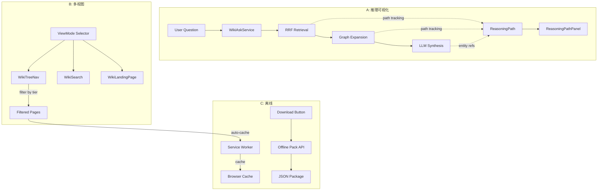

# Phase 3: 推理可视化与多视图模式

> **实现状态：后端已完成（Phase 3）** — Backend implemented 2026-04-27. **Frontend 组件待办**（例如部分 Dashboard 多视图/推理面板等）。以 [IMPLEMENTATION-STATUS.md](../../IMPLEMENTATION-STATUS.md) 为准。下文保留历史问题陈述、方案与测试清单供审阅与追溯。

**状态**: Backend implemented 2026-04-27. Frontend components pending.（原 Draft；见上方说明与 IMPLEMENTATION-STATUS）
**优先级**: 低（长期）
**预计工期**: 8-12 天
**依赖**: Phase 0 + Phase 1 + Phase 2

---

## 1. 背景与动机

### 1.1 问题描述

KBS 已具备强大的图谱检索和 Wiki 生成能力，但在"知识消费"体验上仍有提升空间。三个核心体验缺口：

1. **推理路径不透明**：当 `WikiAskService` 或 `DeepSearchEngine` 给出答案时，用户看到的是最终结果。GraphRAG 最佳实践强调可解释性——展示从问题到答案的图谱推理路径（经过了哪些实体和关系）。这对于建立用户信任和验证答案准确性至关重要。

2. **单一 Wiki 视图**：DeepWiki 提供 comprehensive（8-12 页详尽文档）和 concise（4-6 页快速参考）两种模式。KBS 有 `ImportanceTier`（core/standard/skeleton）分层，但用户无法在 Dashboard 上选择"我只想看核心模块"或"给我完整版"。

3. **离线能力缺失**：KBS 完全依赖在线服务。对于开发者日常使用场景，离线读取缓存的 Wiki 页面（如在飞机上、网络不稳时）会很有价值。结合 Phase 1 的编译快照，离线模式可以直接使用快照数据。

### 1.2 行业对标

| 能力 | GraphRAG | DeepWiki | Karpathy LLM Wiki | KBS 当前 |
|------|----------|----------|-------------------|---------|
| 推理路径展示 | ✅ 图遍历可视化 | ❌ | N/A (markdown) | ❌ |
| 多视图模式 | N/A | ✅ comprehensive/concise | N/A | ❌ |
| 离线访问 | ❌ | ❌ | ✅ 纯 markdown + Obsidian | ❌ (有 export) |

---

## 2. 设计方案

### 2.1 子特性 A: 推理路径可视化

#### 方案对比

| 方案 | 描述 | 优点 | 缺点 |
|------|------|------|------|
| **A1: 图谱路径卡片（推荐）** | 在 Q&A 答案旁展示一个可折叠的"推理路径"面板，显示经过的图谱实体和关系 | 信息密度高；不影响主要阅读体验 | 需要后端返回路径数据 |
| A2: 交互式图谱弹窗 | 使用 React Flow 渲染一个小型交互图谱，展示推理子图 | 最直观 | 实现复杂；性能开销大 |
| A3: 文本链接标注 | 在答案文本中为每个引用的实体添加链接，hover 显示关系 | 最轻量 | 信息量有限；无法展示全局路径 |

**推荐方案 A1**：平衡信息量和实现复杂度。

#### 详细设计

**后端变更**：在 `WikiAskService.ask` 和 `DeepSearchEngine.search` 的返回中增加 `reasoning_path` 字段：

```python
class AnswerWithReasoning:
    answer: str
    sources: list[SourceLocation]
    reasoning_path: list[ReasoningStep]  # 新增

class ReasoningStep:
    entity: str          # 实体名
    entity_type: str     # Function/Class/Module/WikiPage
    relation: str        # 到下一步的关系类型
    relevance: str       # 为什么选择这个实体（一句话）
    confidence: float    # 置信度
```

收集逻辑：
1. 在 RRF 融合时记录每个检索来源的路径
2. 在图扩展时记录扩展路径
3. 在 LLM 综合时，通过 prompt 要求 LLM 输出引用的实体列表
4. 将上述路径合并为 `reasoning_path`

**前端组件**:

```typescript
// dashboard/src/components/wiki/ReasoningPathPanel.tsx
// - 可折叠面板，默认收起
// - 展示推理步骤：Entity → [relation] → Entity → [relation] → ...
// - 每个实体可点击跳转到 Wiki 页面或图谱探索
// - 置信度用颜色编码（绿/黄/红）
```

### 2.2 子特性 B: 多视图 Wiki 模式

#### 方案对比

| 方案 | 描述 | 优点 | 缺点 |
|------|------|------|------|
| **B1: 基于 ImportanceTier 的视图过滤（推荐）** | 复用现有 `ImportanceTier`，用户可选择显示 core-only / core+standard / all | 零新生成成本；利用现有数据 | 粒度有限 |
| B2: 预生成两套 Wiki | 同时生成 comprehensive 和 concise 两套页面 | 各自优化 | LLM 成本翻倍；维护两套 |
| B3: 动态摘要 | 按需将完整页面压缩为摘要版 | 灵活 | 每次请求需 LLM 调用 |

**推荐方案 B1**：零额外 LLM 成本，利用已有的重要性分级。

#### 详细设计

**前端变更**:

```typescript
// dashboard/src/components/wiki/WikiViewModeSelector.tsx
type WikiViewMode = 'comprehensive' | 'standard' | 'essential';

// comprehensive: 显示所有页面
// standard: 仅显示 core + standard tier
// essential: 仅显示 core tier

// 通过 URL 参数持久化: ?view=essential
// 影响：WikiTreeNav 过滤、WikiSearchResults 过滤、WikiLandingPage 统计
```

**后端变更**:

```python
# GET /api/v1/wiki/tree?business_id=...&view_mode=essential
# 新增 view_mode 参数，过滤返回的页面树
# MCP 工具 wiki_get_pages 也支持 importance_filter 参数
```

### 2.3 子特性 C: 离线 Wiki 访问

#### 方案对比

| 方案 | 描述 | 优点 | 缺点 |
|------|------|------|------|
| **C1: Service Worker 缓存（推荐）** | 使用 Service Worker 缓存 Wiki 页面和编译快照 | 标准 Web 技术；渐进增强 | 仅缓存已访问的页面 |
| C2: 离线数据包下载 | 用户可下载完整 Wiki 数据包为 JSON/ZIP | 完整离线 | 用户主动操作；数据量大 |
| C3: PWA 完整模式 | 将 Dashboard 改造为 PWA，包含完整离线能力 | 最佳体验 | 改造工作量最大 |

**推荐方案 C1 + C2 结合**：Service Worker 自动缓存已访问页面 + 手动下载完整包选项。

#### 详细设计

**Service Worker**:

```typescript
// dashboard/public/sw.js
// 缓存策略：
// - /api/v1/wiki/pages/* → Cache First (stale-while-revalidate)
// - /api/v1/wiki/tree → Cache First (stale-while-revalidate)
// - wiki_snapshot.md → Cache First
// - 静态资源 → Cache First
// 离线指示器：
// - 导航栏显示"离线模式"标记
// - 搜索/Q&A 功能降级提示
```

**离线数据包**:

```python
# GET /api/v1/wiki/export/offline-pack?business_id=...
# 返回 JSON 包含：
# - wiki_snapshot.md（编译快照）
# - 所有 WikiPage 的 content（Markdown）
# - Wiki 树结构
# - 基本元数据（置信度、最后更新时间）
# 前端提供"下载离线包"按钮
```

---

## 3. 数据流



---

## 4. 变更清单

| 文件 | 变更类型 | 描述 |
|------|----------|------|
| `wiki/ask.py` | 修改 | 返回 reasoning_path |
| `query/deep_search.py` | 修改 | 返回 reasoning_path |
| `query/hybrid_query.py` | 修改 | 检索路径追踪 |
| `api/routes/wiki_ask_routes.py` | 修改 | 响应模型包含 reasoning_path |
| `dashboard/src/components/wiki/ReasoningPathPanel.tsx` | 新建 | 推理路径可视化面板 |
| `dashboard/src/components/wiki/WikiViewModeSelector.tsx` | 新建 | 视图模式选择器 |
| `dashboard/src/components/wiki/WikiTreeNav.tsx` | 修改 | 支持视图模式过滤 |
| `dashboard/src/components/wiki/WikiShell.tsx` | 修改 | 集成视图选择器和推理面板 |
| `api/routes/wiki_tree_routes.py` | 修改 | 支持 view_mode 参数 |
| `api/routes/wiki_page_routes.py` | 修改 | 新增离线包导出端点 |
| `dashboard/public/sw.js` | 新建 | Service Worker |
| `dashboard/src/hooks/useOfflineStatus.ts` | 新建 | 离线状态检测 hook |

---

## 5. 测试计划

- [ ] 单元测试：ReasoningStep 数据结构正确
- [ ] 单元测试：路径追踪在 RRF 和图扩展中正确收集
- [ ] 集成测试：WikiAsk 返回包含 reasoning_path
- [ ] 前端测试：ReasoningPathPanel 正确渲染
- [ ] 前端测试：WikiViewModeSelector 正确过滤页面树
- [ ] 前端测试：视图模式通过 URL 参数持久化
- [ ] E2E 测试：Service Worker 缓存 Wiki 页面
- [ ] E2E 测试：离线模式正确降级
- [ ] API 测试：离线包导出包含所有必要数据

---

## 6. 风险与缓解

| 风险 | 缓解措施 |
|------|----------|
| 推理路径收集增加查询延迟 | 路径追踪轻量化；可通过配置关闭 |
| 离线缓存存储空间 | 限制缓存大小（如 50MB）；LRU 淘汰策略 |
| Service Worker 更新问题 | 使用标准的 stale-while-revalidate 策略 |
| 视图模式造成用户困惑 | 默认 comprehensive；在 UI 中清晰标注当前模式 |

---

## 7. 分阶段实施建议

由于 Phase 3 工作量较大，建议分三个子迭代：

1. **Phase 3a**（3 天）：推理路径可视化（后端路径追踪 + 前端面板）
2. **Phase 3b**（2 天）：多视图 Wiki 模式（前后端过滤）
3. **Phase 3c**（3-4 天）：离线能力（Service Worker + 离线包）

每个子迭代独立可交付，不必一次性完成。
