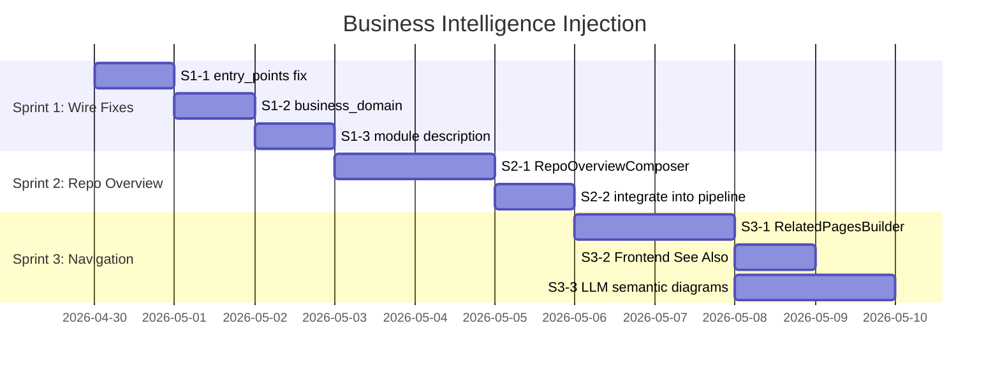

# Business Intelligence Injection — Wiki 业务含义增强设计

> **Status:** Draft — Awaiting Approval  
> **Created:** 2026-04-29  
> **Phase:** 5 (following Layers 0-3 and Token Budget Unification)  
> **Approach:** Sprint 进化 — 3 个独立可交付 Sprint

---

## 1. Background

### 1.1 当前状态

经过 Layer 0-3 实施和 Token Budget 统一后，系统已具备：

| 能力 | 状态 |
|------|------|
| 跨文件边解析 (CALLS/INHERITS/IMPLEMENTS) | ✅ |
| WikiEntityFilter (FULL_PAGE/STANDARD/MERGE) | ✅ |
| HierarchicalDecomposer (LLM 嵌套域树) | ✅ |
| ModuleDependencyGraph + 入口点识别 | ✅ |
| Parent Compose V2 (inter-child deps + 5 sections) | ✅ |
| 结构化输出模板 (_STRUCTURED_SECTIONS_*) | ✅ |
| annotations/semantic_roles/base_classes 注入 | ✅ |
| CommentFilter (Tier-1 docstring) | ✅ |
| TokenBudgetResolver 统一预算 | ✅ |
| inject_wikilinks 内联交叉链接 | ✅ |

### 1.2 核心问题

经过 8 步 Sequential Thinking 分析和代码深度审查，核心发现：

> **系统的主要问题是"接线断裂"——数据已存储在图中但未到达 LLM prompt，以及缺少"入口叙事"层（Repo Overview）。**

### 1.3 剩余缺陷（按 ROI 排序）

| # | 缺陷 | 类型 | 影响 | 成本 |
|---|------|------|------|------|
| A1 | `entry_points` 硬编码为 `[]` | 接线 | 域概览页 Entry Points 节永远为空 | 0.5d |
| A2 | `business_domain` 未注入 entity prompt | 接线 | LLM 不知道实体的业务归属 | 1d |
| A3 | Module `description` 未注入 prompt | 接线 | 已存储但浪费的上下文信号 | 0.5d |
| B1 | 无 Repo-Level 架构概览页 | 新功能 | 缺少"入口叙事"，读者无法快速理解系统 | 3d |
| B2 | 无跨页面交叉引用 | 新功能 | 页面间无导航，Wiki 体验碎片化 | 2d |
| B3 | 图表仍为纯 AST 机械生成 | 新功能 | 无 LLM 语义图表（业务流、时序图） | 3d |

### 1.4 不在范围内 (YAGNI)

| 排除项 | 理由 |
|--------|------|
| Two-Phase Compose (两阶段内容生成) | 单步质量未经评估前不需要 |
| Post-Generation 独立图表管线 | 待 Prompt-Inline 质量不足时再升级 |
| 页内 Ask 集成 | 体验优化，非内容质量 |
| 自适应复杂度分解 | 当前质量未经评估前不需要 |
| neighbor_tier 暴露 | 低影响 |

---

## 2. Design

### 2.1 Sprint Overview



---

### 2.2 Sprint 1: Wire Fixes — 让已有数据到达 LLM

#### S1-1: 修复 entry_points 硬编码 []

**问题**：`generate_business_wiki` 中 `domain_entry_points` 硬编码为空列表。

```python
# wiki/service.py — 当前代码 (简化)
domain_entry_points = []  # BUG: 应从 ModuleGraph 获取
overview = await self._domain_composer.compose(
    domain_name, domain_modules, language,
    domain_tree=domain_subtree,
    entry_points=domain_entry_points,  # 永远为空
)
```

**修复**：从 `ModuleGraph.entry_points` 筛选属于当前 domain 的入口点。

```python
module_graph = await dep_graph.build(repository)
all_entry_points = set(module_graph.entry_points)

# 在 per-domain 循环中：
domain_module_names = {m_name for _, m_name, _ in domain_modules}
domain_entry_points = [ep for ep in all_entry_points if ep in domain_module_names]
```

**文件变更**：`wiki/service.py`

---

#### S1-2: 向 entity prompt 注入 business_domain

**问题**：`compose_page` 不接收业务域信息，LLM 无法生成业务相关描述。

**设计**：

1. `compose_page` 新增 optional 参数 `business_domain: str | None = None`
2. `_entity_digest` 头部注入域信息：

```python
if business_domain:
    lines.append(f"- Business Domain: {business_domain}")
```

3. 在 `generate_business_wiki` 的 compose 循环中，从 `domain_mapping` 查找 entity 的域归属传入。

4. 增量路径 (`generate_incremental`) 中，从 WikiSection 的 HAS_CHILD 关系反查域名，或从 entity 节点的 `business_domain` 属性获取（需在全量生成时持久化到节点属性）。

**持久化决策**：在全量 wiki 生成时，将 domain classification 结果写入图节点的 `business_domain` 属性。这样增量路径可以直接从节点属性读取，无需重新分类。

**关键：domain 沿 CONTAINS 边向下传播**。`domain_mapping` 是 module-level 的，但 `compose_page` 处理所有层级实体（Module/Class/Function）。因此需要将 domain 从 Module 传播到其包含的 Class 和 Function：

```python
# 全量生成时持久化（含向下传播）
for module_name, domain_name in domain_mapping.items():
    # 1. Module 节点
    await store.set_node_property(repository, module_name, "business_domain", domain_name)
    # 2. 沿 CONTAINS 边向下传播
    children = await store.find_descendants(repository, module_name, edge_type="CONTAINS", max_depth=3)
    for child_uid in children:
        await store.set_node_property(repository, child_uid, "business_domain", domain_name)
```

在增量路径中，`compose_page` 直接从实体节点的 `business_domain` 属性读取：
```python
business_domain = node.properties.get("business_domain")
```

**文件变更**：`wiki/composer.py`, `wiki/service.py`, `store/falkordb_store.py`（复用已有 `set_node_property`）

---

#### S1-3: 注入 Module description

**问题**：Module 节点的 `description` 属性已存储但未在 `_entity_digest` 中使用。

**修复**：在 `_entity_digest` 中检查并注入：

```python
description = props.get("description", "")
if description and description != business_summary:
    lines.append(f"- Module Description: {description[:300]}")
```

**文件变更**：`wiki/composer.py`

---

### 2.3 Sprint 2: Repo Overview — 入口叙事层

#### S2-1: SystemOverviewComposer（跨仓库系统级概览）

**目标**：为整个业务 Wiki 生成一个**跨仓库统一概览页**，作为读者（人类和 Agent）的入口叙事。

> **设计决策**：在微服务多仓库场景下，生成**系统级**概览（而非 per-repo 概览）。每个仓库作为概览页内的一个小节。这样读者一页就能理解整体架构。

**树位置**：System Overview 作为 WikiSpace 根节点的第一个子节点（`sort_index=0`），在所有 Domain Section 之前：

```
WikiSpace (cross-repo business wiki root)
├── ⭐ System Architecture Overview (WikiPage, page_type=REPO_OVERVIEW, sort_index=0)
│   - 系统整体业务定位
│   - 微服务列表及职责（每个仓库一小节）
│   - 业务域总览 + 域间依赖 Mermaid 图
│   - 跨仓库入口点汇总
│   - 技术栈总览
├── Domain: User Management (WikiSection, sort_index=1)
│   ├── DomainOverview (已有)
│   ├── user-service/UserController
│   └── common-lib/UserDTO
└── Domain: Payment (WikiSection, sort_index=2)
    ├── DomainOverview (已有)
    └── payment-service/PaymentService
```

**新文件**：`wiki/system_overview_composer.py`

**输入**：

| 数据 | 来源 | 说明 |
|------|------|------|
| `repositories` | `generate_business_wiki` 参数 | 所有参与的仓库列表 |
| `domain_tree` | `CrossRepoBusinessDomainPlanner` | 跨仓库业务域树 |
| `entry_points_by_repo` | `ModuleDependencyGraph` per repo | 每个仓库的入口点 |
| `domain_overviews` | 已生成的 DomainOverview summaries | 域级摘要 |
| `stats_by_repo` | 图统计查询 | 每仓库的模块/类/函数数 |
| `languages_by_repo` | Module 节点 language 属性 | 每仓库技术栈 |

**LLM Prompt 策略**：

System:
```
You are a senior architect writing a system architecture overview for a microservice platform.
This system spans multiple repositories. Generate a comprehensive Markdown document with:
1. **System Purpose** — What this platform does in business terms
2. **Microservice Architecture** — MUST include a Mermaid graph showing how repos/services interact
3. **Repositories** — For EACH repository: its role, key modules, tech stack, entry points
4. **Business Domains** — Each domain with its purpose, which repos contribute to it
5. **Cross-Service Communication** — How services communicate (RPC, messaging, shared DB, etc.)
6. **Key Entry Points** — All API endpoints, RPC providers, message listeners across all repos
7. **Technology Stack Summary** — Languages, frameworks, databases, messaging systems
```

User: 注入 repositories + domain_tree + entry_points_by_repo + domain_overviews + stats

**输出**：`WikiPage` (page_type=`REPO_OVERVIEW`)，entity_uid 设为特殊值如 `system_overview_{business_id}`

**Token Budget**：`resolver.budget("decomposition")` — 系统概览需要全局视角。

#### S2-2: 集成到 generate_business_wiki

在所有 domain overview 生成完成后、`_link_pages_to_tree` 之前调用：

```python
# 收集所有仓库的入口点和统计
entry_points_by_repo = {}
stats_by_repo = {}
for repo in repositories:
    module_graph = await dep_graph.build(repo)
    entry_points_by_repo[repo] = module_graph.entry_points
    stats_by_repo[repo] = await self._store.get_repo_stats(repo)

system_overview = await self._system_overview_composer.compose(
    business_id=business_id,
    repositories=repositories,
    domain_tree=domain_tree,
    entry_points_by_repo=entry_points_by_repo,
    domain_overviews=domain_overview_summaries,
    stats_by_repo=stats_by_repo,
    language=language,
)
await self._wiki_store.upsert_page(business_id, system_overview)
# 链接为 WikiSpace 的第一个子节点
await self._wiki_store.add_has_child_edge(wiki_space_uid, system_overview.uid, sort_index=0)
```

**文件变更**：`wiki/system_overview_composer.py`（新建）, `wiki/service.py`, `store/falkordb_store.py`（新增 `get_repo_stats` 统计查询）

---

### 2.4 Sprint 3: Enhanced Navigation — 交叉引用 + LLM 语义图表

#### S3-1: RelatedPagesBuilder — 图边交叉引用

**新文件**：`wiki/related_pages_builder.py`

**三层关联策略**（按优先级）：

| 策略 | 方法 | 权重 |
|------|------|------|
| 图近邻 | CALLS/IMPORTS/INHERITS 边直接关联的实体的 Wiki 页面 | 1.0 |
| 域共属 | 同一 business_domain 内的实体 | 0.6 |
| 结构兄弟 | 同一父模块（CONTAINS）下的实体 | 0.4 |

**实现**：

```python
class RelatedPagesBuilder:
    MAX_RELATED = 10

    async def build(
        self, page_uid: str, entity_uid: str,
        repository: str, business_domain: str | None,
    ) -> list[RelatedPageInfo]:
        candidates: dict[str, float] = {}

        graph_neighbors = await self._store.find_related_entities(
            repository, entity_uid,
            edge_types=["CALLS", "IMPORTS", "INHERITS"],
            max_hops=1,
        )
        for uid, _ in graph_neighbors:
            candidates[uid] = candidates.get(uid, 0) + 1.0

        if business_domain:
            domain_siblings = await self._store.find_entities_by_domain(
                repository, business_domain, exclude_uid=entity_uid,
            )
            for uid in domain_siblings:
                candidates[uid] = candidates.get(uid, 0) + 0.6

        structural_siblings = await self._store.find_siblings(
            repository, entity_uid,
        )
        for uid in structural_siblings:
            candidates[uid] = candidates.get(uid, 0) + 0.4

        ranked = sorted(candidates.items(), key=lambda x: -x[1])[:self.MAX_RELATED]
        return await self._resolve_to_pages(repository, ranked)
```

**持久化**：在 FalkorDB 中基于**代码实体节点**（而非 WikiPage 节点）创建 `RELATED_TO` 边。代码实体已在图中，无需创建新节点：

```cypher
MATCH (a {uid: $source_entity_uid, repository: $repo})
MATCH (b {uid: $target_entity_uid, repository: $repo})
MERGE (a)-[r:RELATED_TO]->(b)
SET r.weight = $weight, r.strategy = $strategy
```

API 查询时通过 `entity_uid` 关联到 WikiPage：
```cypher
MATCH (entity {uid: $entity_uid})-[r:RELATED_TO]->(related)
MATCH (wp:WikiPage {entity_uid: related.uid})
RETURN wp.uid, wp.title, r.weight ORDER BY r.weight DESC LIMIT 10
```

> **注**：如 FalkorDB 不支持 UNION 语法，`find_related_entities` 拆为两次查询（出边 + 入边）后合并。

**调用时机**：在 `generate_business_wiki` 最末尾、所有页面和链接构建完成后。

**文件变更**：`wiki/related_pages_builder.py`（新建）, `store/falkordb_store.py`（新增查询）, `wiki/service.py`

---

#### S3-2: 前端 See Also 组件

**目标**：在 WikiPageViewer 中渲染 `RELATED_TO` 边为 "See Also" 区域。

**API 端点**：复用已有的 `/api/v1/wiki/pages/{page_uid}` 返回数据，新增 `related_pages` 字段：

```python
# api/models/wiki_models.py — WikiPageResponse 新增字段
class RelatedPageInfo(BaseModel):
    uid: str
    title: str
    page_type: str
    business_domain: str | None = None
    relevance_score: float

class WikiPageResponse(BaseModel):
    # ... 已有字段
    related_pages: list[RelatedPageInfo] = Field(default_factory=list)
```

**前端组件**：

```typescript
// dashboard/src/components/wiki/RelatedPages.tsx
interface RelatedPageInfo {
  uid: string;
  title: string;
  page_type: string;
  business_domain: string | null;
  relevance_score: number;
}

function RelatedPages({ pages }: { pages: RelatedPageInfo[] }) {
  if (!pages.length) return null;
  return (
    <aside className="related-pages">
      <h3>See Also</h3>
      <ul>
        {pages.map(p => (
          <li key={p.uid}>
            <Link to={`/wiki/page/${p.uid}`}>
              {p.title}
              {p.business_domain && <Badge>{p.business_domain}</Badge>}
            </Link>
          </li>
        ))}
      </ul>
    </aside>
  );
}
```

**集成位置**：`WikiPageViewer` 组件的侧边栏或页面底部。

**文件变更**：
- 后端：`api/models/wiki_models.py`, `api/routes/wiki_routes.py`（在 page detail 接口中查询 RELATED_TO 边并填充 related_pages）
- 前端：`dashboard/src/components/wiki/RelatedPages.tsx`（新建）, `dashboard/src/pages/wiki/WikiPageViewer.tsx`（集成组件）

---

#### S3-3: LLM 语义图表指令

**策略**：Prompt-Inline — 在现有 Tier-2 prompt 中增加图表生成指令，不额外调用 LLM。

**按实体类型增加的指令**：

| 实体类型 | 条件 | 图表指令 |
|---------|------|---------|
| Entry Point (Controller/RPC) | `is_entry_point=True` | 生成 Mermaid sequence diagram：请求处理流程 |
| Module | always | 生成 Mermaid flowchart：子组件如何协作 |
| Class | `methods_count > 5` | 生成 Mermaid sequence diagram：关键方法调用流 |
| Function | never | 不需要图表 |

**实现**：在 `_entity_digest` 末尾追加图表指令：

```python
if is_entry_point:
    lines.append(
        "\n### Diagram Requirement\n"
        "Generate a Mermaid **sequence diagram** showing the request processing flow "
        "for this entry point. Use business-level labels.\n"
        "Example: User → Controller → Service → Repository → Database"
    )
elif page_type == "module":
    lines.append(
        "\n### Diagram Requirement\n"
        "Generate a Mermaid **flowchart** showing how sub-components collaborate "
        "to fulfill the module's business purpose. Use business-level labels."
    )
elif page_type == "class" and methods_count > 5:
    lines.append(
        "\n### Diagram Requirement\n"
        "Generate a Mermaid **sequence diagram** showing the key method interaction flow "
        "within this class. Focus on the primary business workflow."
    )
```

**Entry Point 信息传递链**：

1. `generate_business_wiki` 中构建 `entry_point_set = set(module_graph.entry_points)`
2. 在 per-repo `generate()` 调用前，将 `entry_point_set` 传入或存储为实例变量
3. 在 compose 循环中（`_compose_all_pages` 或 `_compose_module_pages`），检查当前实体名是否在 `entry_point_set` 中
4. `compose_page` 新增 `is_entry_point: bool = False` 参数
5. `_entity_digest` 根据 `is_entry_point` 和 `page_type` 追加相应图表指令

增量路径中，从实体节点的 `semantic_roles` 属性判断（已包含 `http_controller`、`rpc_provider` 等角色标注），无需额外传递。

**文件变更**：`wiki/composer.py`

---

## 3. File Changes Summary

| Sprint | File | Type | Description |
|--------|------|------|-------------|
| 1 | `wiki/service.py` | Modify | 修复 entry_points []；传递 business_domain 和 is_entry_point 到 compose_page；持久化 domain 到节点属性 |
| 1 | `wiki/composer.py` | Modify | compose_page 新增 business_domain/is_entry_point 参数；_entity_digest 注入域+描述 |
| 1 | `store/falkordb_store.py` | Modify | 复用已有 `set_node_property` 方法持久化 business_domain |
| 2 | `wiki/system_overview_composer.py` | **New** | SystemOverviewComposer：LLM 驱动跨仓库系统架构概览 |
| 2 | `wiki/service.py` | Modify | 集成 SystemOverviewComposer 到 generate_business_wiki；收集 per-repo stats |
| 2 | `store/falkordb_store.py` | Modify | 新增 `get_repo_stats` 统计查询 |
| 3 | `wiki/related_pages_builder.py` | **New** | RelatedPagesBuilder：图近邻 + 域共属 + 结构兄弟 |
| 3 | `store/falkordb_store.py` | Modify | 新增 RELATED_TO 边的 Cypher 查询和写入 |
| 3 | `wiki/service.py` | Modify | 集成 RelatedPagesBuilder |
| 3 | `wiki/composer.py` | Modify | 增加 LLM 语义图表指令 |
| 3 | `api/models/wiki_models.py` | Modify | WikiPageResponse 新增 related_pages 字段 |
| 3 | `api/routes/wiki_routes.py` | Modify | page detail 接口查询 RELATED_TO 边 |
| 3 | `dashboard/src/components/wiki/RelatedPages.tsx` | **New** | See Also 前端组件 |
| 3 | `dashboard/src/pages/wiki/WikiPageViewer.tsx` | Modify | 集成 RelatedPages 组件 |

---

## 4. Test Plan

### Sprint 1 Tests

| Test | Description |
|------|-------------|
| `test_domain_entry_points_populated` | 验证 generate_business_wiki 传递非空 entry_points |
| `test_entity_digest_includes_business_domain` | 验证 business_domain 出现在 entity digest |
| `test_entity_digest_includes_module_description` | 验证 Module description 被注入 |
| `test_incremental_reads_domain_from_node` | 验证增量路径从节点属性读取 business_domain |

### Sprint 2 Tests

| Test | Description |
|------|-------------|
| `test_system_overview_includes_all_repos` | 验证概览页包含所有仓库的信息 |
| `test_system_overview_has_mermaid` | 验证概览页包含 Mermaid 微服务架构图 |
| `test_system_overview_cross_repo_domains` | 验证概览页展示跨仓库的业务域 |
| `test_system_overview_integrated` | 验证 generate_business_wiki 生成并持久化 system overview |
| `test_system_overview_tree_position` | 验证 overview 位于 WikiSpace 根的 sort_index=0 |
| `test_system_overview_token_budget` | 验证使用 decomposition budget |

### Sprint 3 Tests

| Test | Description |
|------|-------------|
| `test_related_pages_graph_proximity` | 验证 CALLS 边实体排名最高 |
| `test_related_pages_domain_membership` | 验证同域实体在结果中 |
| `test_related_pages_limit` | 验证最多 10 条 |
| `test_related_to_edges_persisted` | 验证 RELATED_TO 边写入图数据库 |
| `test_api_returns_related_pages` | 验证 API response 包含 related_pages |
| `test_entry_point_gets_sequence_diagram_instruction` | 验证入口点实体获得 sequence diagram 指令 |
| `test_module_gets_flowchart_instruction` | 验证模块获得 flowchart 指令 |
| `test_small_class_no_diagram_instruction` | 验证小类不获得图表指令 |

---

## 5. Risk Assessment

| Risk | Probability | Impact | Mitigation |
|------|:-----------:|:------:|------------|
| business_domain 持久化到节点属性影响现有索引 | Low | Medium | 使用 SET 而非 overwrite，不影响其他属性 |
| LLM 生成 Mermaid 语法错误 | High | Low | 前端已有 Mermaid 渲染错误处理；图表为增强非必需 |
| RepoOverviewComposer prompt 过长 | Medium | Medium | 使用 TokenBudgetResolver ceiling cap；仅注入 domain summaries 摘要 |
| RELATED_TO 边在大仓库中的查询性能 | Medium | Low | 限制 MAX_RELATED=10；索引 WikiPage.uid |
| entry_points 过滤不准确 | Low | Low | 基于已有 ModuleDependencyGraph 的 _identify_entry_points 逻辑 |

---

## 6. Decision Log

| # | Decision | Rationale |
|---|----------|-----------|
| D1 | Sprint 进化而非一次性交付 | 每个 Sprint 独立可验证，降低返工风险 |
| D2 | 交叉引用存储为图边 RELATED_TO | 符合 graph-first 设计哲学；Agent 可通过 MCP 导航 |
| D3 | 前端直接渲染 See Also，不用 content fallback | 保持 content 干净；前端改动包含在提案中 |
| D4 | LLM 图表使用 Prompt-Inline 而非独立管线 | YAGNI：先验证 Prompt-Inline 质量，不足时再升级 |
| D5 | domain 分类持久化到节点属性 | 增量路径需要访问域信息，避免重新分类 |
| D6 | System Overview 使用 decomposition budget | 架构概览需要全局视角，与域树分解预算一致 |
| D7 | 系统级概览而非 per-repo 概览 | 微服务场景下读者需要跨仓库全局视角；per-repo 信息作为概览页的小节 |
| D8 | RELATED_TO 边在代码实体间创建 | 代码实体已在图中；WikiPage 可能不在图数据库中；通过 entity_uid JOIN |
| D9 | business_domain 沿 CONTAINS 向下传播 | compose_page 处理所有层级实体，非 Module 也需要域信息 |

> Awaiting user approval.
