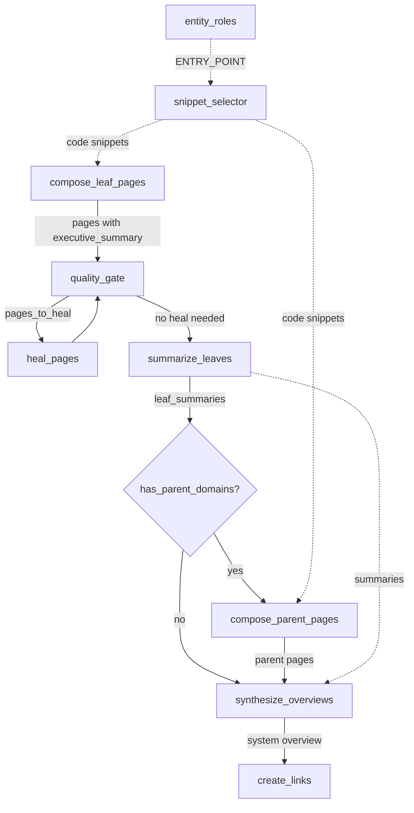

# Bottom-up 递归生成与代码注入设计

> **状态**: Draft  
> **创建**: 2026-05-01  
> **关联**: `DEEP_ANALYSIS_20260501_085742_wiki_gaps_and_bugs.md` Phase 3  
> **前置**: Phase 2 (CoT + 自适应推理) ✅ 已完成

---

## 1. 背景与动机

KB Service 在 Phase 1/2 中完成了叙事性 prompt、TargetedHeal、3 级自适应推理等核心能力。但与 DeepWiki/CodeWiki 相比，仍存在两个关键差距：

1. **Bottom-up 递归缺失**：所有页面平行生成，system overview 仅用域的前 200 字符拼凑，缺乏层级综合能力
2. **代码与文档脱节**：Wiki 内容不引用实际代码签名，与竞品 CodeWiki 的"关键方法签名嵌入文档"形成对比

## 2. 目标

1. 实现 leaf → parent → system 的 bottom-up 递归生成
2. 将关键代码签名注入 compose prompt，使文档与代码关联
3. 增加 ENTRY_POINT 实体角色，提升业务入口点的识别能力
4. 确保无嵌套域树时零额外开销

## 3. 非目标

- 完整代码片段注入（方法体），仅注入签名 + docstring
- 父域页面的 quality_gate/heal 循环（后续迭代）
- LLM 语义分组（C4，独立任务）
- Per-page RAG Chat（前端任务）

---

## 4. Pipeline 流程变更

### 4.1 当前流程

```
classify_entity_roles → detect_reorg → [skip?] → classify_domains →
decompose_hierarchy → set_review_status → compose_pages →
quality_gate ↔ heal_pages → synthesize_overviews → create_links → finalize
```

### 4.2 新流程

```
classify_entity_roles → detect_reorg → [skip?] → classify_domains →
decompose_hierarchy → set_review_status →
✏️ compose_leaf_pages →                    (renamed from compose_pages)
quality_gate ↔ heal_pages →
🆕 summarize_leaves →                      (new: rule-based summary extraction)
🆕 compose_parent_pages →                  (new: conditional, only with nested tree)
synthesize_overviews → create_links → finalize
```

### 4.3 条件路由

- `summarize_leaves` 无条件执行（扁平域树时也提取摘要供 synthesize_overviews 使用）
- `compose_parent_pages` 之前增加条件边 `has_parent_domains`：
  - 域树无嵌套 → 跳到 `synthesize_overviews`
  - 域树有嵌套 → 进入 `compose_parent_pages`
- `synthesize_overviews` 改用 `leaf_summaries` 中的结构化摘要替代现有的"前 200 字符"拼凑

### 4.4 Pipeline Graph 变更 (pipeline_graph.py)

```python
# Renamed node
graph.add_node("compose_leaf_pages", compose_leaf_pages_node)

# New nodes
graph.add_node("summarize_leaves", summarize_leaves_node)
graph.add_node("compose_parent_pages", compose_parent_pages_node)

# Edges: quality_gate (when no heal) → summarize_leaves (was → synthesize_overviews)
# should_heal conditional stays unchanged; "no heal" path now targets summarize_leaves
graph.add_edge("summarize_leaves", "route_parent_or_overview")

# Conditional: check BEFORE compose_parent_pages
graph.add_conditional_edges(
    "route_parent_or_overview",
    has_parent_domains,
    {True: "compose_parent_pages", False: "synthesize_overviews"}
)
graph.add_edge("compose_parent_pages", "synthesize_overviews")
```

---

## 5. 组件设计

### 5.1 `summarize_leaves_node` — 叶子摘要提取

**文件**: `wiki/pipeline_nodes.py` (新增函数)

**职责**: 从已生成的叶子页面中提取结构化摘要。

**输入**: `state["pages"]` (quality_gate/heal 后的叶子页面)  
**输出**: `{"leaf_summaries": dict[str, LeafSummary]}`

**数据结构** (新增到 `wiki/models.py`):

```python
@dataclass
class LeafSummary:
    domain_name: str
    summary_text: str          # 150-300 chars target
    module_count: int
    key_entities: list[str]    # core entity names in domain
    source: str                # "llm" | "rule_extracted"
```

**摘要提取策略（双路径）**:

1. **主路径**: 读取 `page.metadata.executive_summary` (compose 阶段 LLM 输出)
2. **回退路径** (优先级递减):
   a. 第一个 heading 后的第一段落
   b. 匹配常见概述标题 (`## 业务概述`, `## Overview`, `## Summary`)
   c. 前 300 字符

**状态更新**: `WikiPipelineState` 新增 `leaf_summaries: dict[str, Any]` 字段。

### 5.2 `compose_parent_pages_node` — 父域页面生成

**文件**: `wiki/pipeline_nodes.py` (新增函数)

**触发条件**: `has_parent_domains(state)` — 域树中存在有 children 的节点  
**跳过条件**: 域树完全扁平时，条件边跳到 `synthesize_overviews`

**实现策略**: 直接使用 `LLMPort.generate`（而非复用 TopicPageComposer），因为父域 prompt 结构与叶子域完全不同（综合性 vs 详细性）。

**生成逻辑**:

1. 遍历域树，收集有 children 的节点（parent domains）
2. 多层域树按自底向上顺序处理（先生成最低层父域）
3. 对每个父域:
   a. 收集子域摘要（从 `state["leaf_summaries"]`）
   b. 使用 `TokenBudgetCalculator.budget_for_parent_summaries` 计算摘要预算
   c. 使用 `TokenBudgetCalculator.budget_for_snippets` 计算签名预算
   d. 收集代码签名（`select_key_snippets(modules, entity_roles, budget_tokens=snippet_budget)`）
   e. 构建 parent compose prompt（强调综合性）
   f. 调用 `LLMPort.generate` 生成，page_type = `DOMAIN_OVERVIEW`
   g. 输出也包含 `executive_summary`（支持多层域树递归）
4. 并行生成同层父域页面（复用 Semaphore 机制）

**Parent Compose Prompt 模板**:

```
You are writing a domain overview page that synthesizes information from its sub-domains.

## Sub-domain Summaries
{child_summaries}

## Key Code Interfaces
{code_snippets}

Write a comprehensive overview that:
- Explains how these sub-domains relate to each other
- Describes the data flow between sub-domains
- Highlights the domain's role in the overall system
- References key interfaces naturally in your narrative
```

**输出**: `{"pages": [parent_pages...]}` (merger 合并到现有 pages)

### 5.3 `snippet_selector.py` — 代码签名选择器

**文件**: `wiki/snippet_selector.py` (新文件)

**接口**:

```python
def select_key_snippets(
    modules: list[dict],
    entity_roles: dict[str, str],
    budget_tokens: int = 2000,
    max_per_module: int = 3,
) -> list[CodeSnippet]:
    """Select most informative method signatures from domain modules."""
```

**排序算法** — 加权得分:

| 信号 | 权重 | 来源 |
|------|------|------|
| ENTRY_POINT 角色的模块中的方法 | 10 | `entity_roles` |
| 被调用次数 (in-degree) | × 3 | `calls`/edges |
| 有 docstring | 2 | `methods[].docstring` |
| 公开方法（非 `_` 开头） | 1 | `methods[].name` |
| 参数数量 > 3 | 1 | `methods[].signature` |

**约束**:
- 每个 module 最多 `max_per_module` 个方法
- 总 token 数不超过 `budget_tokens`
- 输出格式: `CodeSnippet(source=signature+docstring, file_path, lines, origin)`

**注入方式**: 在 `_compose_single_leaf_domain` 和 parent compose prompt 中添加 "Key Code Interfaces" section。

**调用链**: `compose_leaf_pages_node` / `compose_parent_pages_node` → `TokenBudgetCalculator.budget_for_snippets(module_count)` → `select_key_snippets(modules, entity_roles, budget_tokens=budget)` → prompt 注入。

**注意**: 实现前需验证 pipeline state 中 modules dict 的实际 schema（methods 的 key 名称、signature/docstring 是否存在）。

### 5.4 `ENTRY_POINT` 角色增强

**文件**: `wiki/entity_role_classifier.py`

**新增枚举值**:

```python
class WikiEntityRole(str, Enum):
    ENTRY_POINT = "entry_point"          # NEW
    HAS_BUSINESS_LOGIC = "has_business_logic"
    SUPPORTING = "supporting"
    DATA_MODEL = "data_model"
    FRAMEWORK_NOISE = "framework_noise"
```

**识别规则** (确定性, Phase 1 短路):

1. 包含 `main` 方法名
2. 包含 HTTP handler 注解 (`@app.route`, `@GetMapping`, `@RequestMapping`, `@PostMapping`, `@router.get` 等)
3. 包含 CLI 入口点模式 (`if __name__ == "__main__"`, `@click.command`, `@click.group`)
4. 文件名模式匹配 (`*Controller*`, `*Handler*`, `*Endpoint*`, `*Router*`, `*App*`)

**兼容性**:
- `ENTRY_POINT` 在域分类中视为 `has_business_logic` (向后兼容)
- `classify_domains_node` 的 module 筛选条件: `role in (HAS_BUSINESS_LOGIC, ENTRY_POINT)`
- 现有测试中对 `has_business_logic` 的断言不受影响

### 5.5 `TopicPageComposer` — executive_summary 输出

**文件**: `wiki/topic_page_composer.py`

**修改**: 在 JSON 输出格式中新增 `executive_summary` 字段。

Prompt 追加:
```
Include an "executive_summary" field (150-300 chars) that captures the domain's core purpose in 1-2 sentences.
```

**解析**: `WikiPage.from_dict` 将 `executive_summary` 存入 `metadata.executive_summary`。

**模型变更** (`wiki/models.py`):
```python
@dataclass
class WikiPageMetadata:
    # ... existing fields ...
    executive_summary: str | None = None
```

### 5.6 `TokenBudgetCalculator` — 动态 Token 预算

**文件**: `wiki/token_budget.py` (新文件)

```python
@dataclass
class TokenBudgetCalculator:
    context_window: int = 128_000
    reserved_output: int = 4_096
    reserved_system: int = 2_000

    @property
    def available_input(self) -> int:
        return self.context_window - self.reserved_output - self.reserved_system

    def budget_for_snippets(self, module_count: int) -> int:
        """Per-domain code snippet token budget."""
        return min(500 + module_count * 100, 3000)

    def budget_for_parent_summaries(self, child_count: int) -> int:
        """Parent domain prompt child summary budget."""
        return min(child_count * 300, 5000)

    def budget_for_system_overview(self, domain_count: int) -> int:
        """System overview domain summary budget."""
        return min(domain_count * 200, 8000)
```

**集成**: 通过 `WikiPipelineState` 配置中的 `model_context_window` 传入。

---

## 6. 数据流



---

## 7. 错误处理

| 场景 | 处理方式 |
|------|---------|
| 域树完全扁平（无嵌套） | 条件边跳过 `compose_parent_pages`，`summarize_leaves` 仍执行供 overview 使用 |
| 叶子页面生成失败（0 页面） | `summarize_leaves` 返回空 dict，后续节点优雅降级 |
| executive_summary 缺失 | 回退到规则提取（第一段落 → 概述标题 → 前 300 字符） |
| 代码签名为空 | snippet_selector 返回空列表，prompt 不注入代码 section |
| 域树深度 > 2 层 | `compose_parent_pages` 自底向上递归处理 |
| Token 预算溢出 | 按优先级截断签名/摘要 |
| LLM 调用异常 | 记录 ERROR 日志 + Hubble 告警，返回降级结果不阻断管道 |

---

## 8. 测试计划

### 8.1 单元测试

| 测试 | 覆盖点 |
|------|--------|
| `test_summarize_leaves_llm_path` | 从 metadata.executive_summary 提取 |
| `test_summarize_leaves_fallback` | 规则提取回退路径 |
| `test_snippet_selector_ranking` | 加权排序算法正确性 |
| `test_snippet_selector_budget` | token 预算截断 |
| `test_snippet_selector_per_module_limit` | 每模块上限 |
| `test_entry_point_detection` | ENTRY_POINT 角色识别规则 |
| `test_entry_point_backward_compat` | 兼容 has_business_logic 场景 |
| `test_compose_parent_basic` | 父域页面生成基本流程 |
| `test_compose_parent_multi_level` | 多层域树递归 |
| `test_token_budget_calculator` | 预算计算各分支 |

### 8.2 集成测试

| 测试 | 覆盖点 |
|------|--------|
| `test_pipeline_flat_tree` | 扁平域树跳过 compose_parents |
| `test_pipeline_nested_tree` | 完整 bottom-up 流程 |
| `test_pipeline_with_snippets` | 代码签名注入端到端 |

---

## 9. 新增文件清单

| 文件 | 类型 | 描述 |
|------|------|------|
| `wiki/snippet_selector.py` | 新增 | 代码签名选择器 |
| `wiki/token_budget.py` | 新增 | Token 预算计算器 |
| `tests/wiki/test_snippet_selector.py` | 新增 | 签名选择器测试 |
| `tests/wiki/test_summarize_leaves.py` | 新增 | 叶子摘要测试 |
| `tests/wiki/test_compose_parents.py` | 新增 | 父域页面测试 |
| `tests/wiki/test_entry_point_role.py` | 新增 | 入口点角色测试 |
| `tests/wiki/test_token_budget.py` | 新增 | Token 预算测试 |

## 10. 修改文件清单

| 文件 | 变更 |
|------|------|
| `wiki/pipeline_graph.py` | 重命名节点 + 新增节点/边 + 条件路由 |
| `wiki/pipeline_nodes.py` | 函数重命名 + 新增 `summarize_leaves_node` / `compose_parent_pages_node` |
| `wiki/pipeline_state.py` | 新增 `leaf_summaries` 字段 |
| `wiki/entity_role_classifier.py` | 新增 `ENTRY_POINT` 枚举 + 识别规则 |
| `wiki/topic_page_composer.py` | prompt 新增 `executive_summary` 输出 + 代码签名 section |
| `wiki/models.py` | `WikiPageMetadata` 新增 `executive_summary` + `LeafSummary` 数据类 |
| `wiki/prompts.py` | 新增 `SYSTEM_WIKI_PARENT_OVERVIEW` prompt 常量 |
| `wiki/context.py` | 无变更（LLMPort 已满足需求） |
