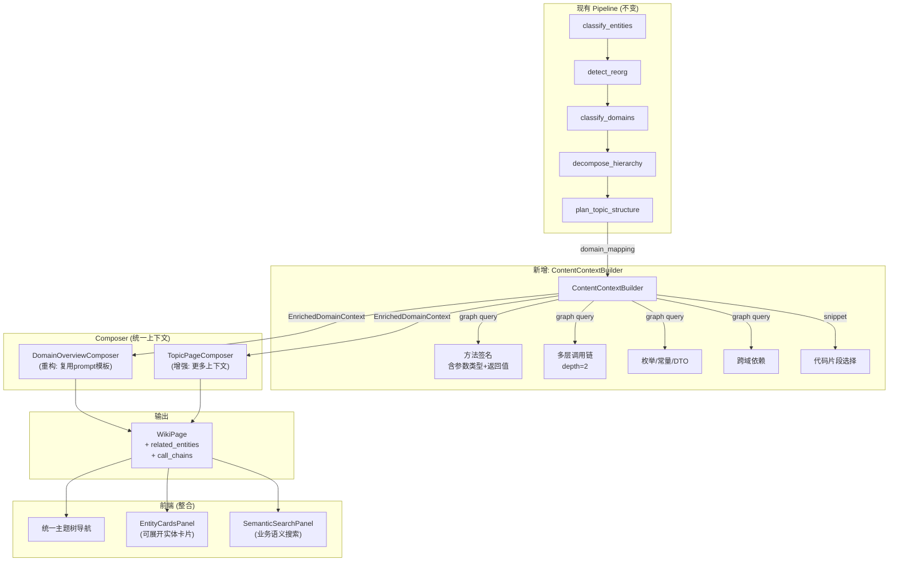
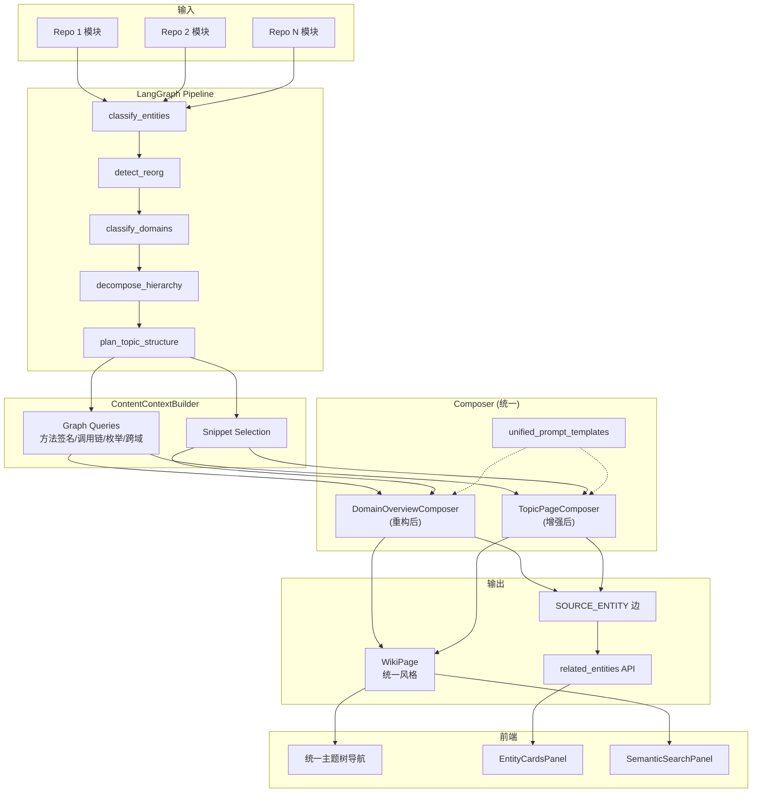

# 统一 Wiki 企业级知识库设计

**日期**: 2026-05-06
**状态**: 待审批
**范围**: wiki 生成管线全链路 — 风格统一 / 内容深度 / 实体关联 / 搜索增强 / 前端视角整合
**前置**: `2026-05-06-wiki-topic-filter-parallel-design.md`（过滤 / 并行优化，已批准待实施）

---

## 1. 背景与动机

### 1.1 现状问题

当前知识库生成了两种风格截然不同的 wiki 页面，且内容深度不足、缺少实体与代码的关联。

**问题 1：两种 Wiki 风格并存**

| 风格 | 示例页面 | 生成器 | 调用位置 | Prompt 输入量 |
|------|----------|--------|----------|---------------|
| **风格 A（简陋）** | Meeting | `DomainOverviewComposer` | `tree_linker.py` → `link_pages_to_nested_tree` | ~200 tokens（模块名+摘要） |
| **风格 B（较好）** | Meeting Initiation & Signaling | `TopicPageComposer` | `pipeline_nodes.py` → `compose_leaf_pages_node` | ~1500 tokens（方法/调用链/代码片段） |

根因：两个 Composer 各自独立采集数据，信息密度相差 5-10 倍。

**问题 2：内容深度不足**

即使是风格 B 的 Topic Page，仍然缺少：
- 完整方法签名（含参数类型和返回值）
- 多层调用链（当前仅 `calls[:5]`，无传递调用）
- 枚举值、常量、状态机等业务规则
- 跨域依赖关系标注

**问题 3：实体-代码关联缺失**

- 后端已有 `SOURCE_ENTITY` 边和 `covered_entity_uids`
- Wiki 页面 API 未返回关联实体的详细信息
- 前端无实体卡片展示区域
- 无法从 wiki 页面跳转到代码实体

**问题 4：前端两个 Tab 割裂**

- "主题树" 和 "代码结构" 是两个独立视角
- 用户需在两个 tab 间来回切换
- 代码结构视角的信息（Architecture / API Reference / Data Flow）可被吸收到业务主题页中

### 1.2 目标

构建一个面向开发、产品、Agent 的**企业级代码知识库**，实现：

1. **单一业务主题树**：只有一棵按业务域组织的 wiki 树，消除两种风格差异
2. **深度代码关联**：每个 wiki 页面内嵌源码实体卡片、调用链、方法签名
3. **双模板统一深度**：两种页面类型（域概览 + 主题详情）各有专属模板，但共享统一的视觉风格、输出格式和 system prompt
4. **智能搜索**：支持自然语言业务查询，联合返回 wiki + 代码实体 + 调用链

**页面模板体系**：

| 模板 | 页面类型 | 适用场景 | 核心 Sections | 生成者 |
|------|----------|----------|---------------|--------|
| **模板 A：域概览** | DOMAIN_OVERVIEW | 有子节点的域 + TopicPageComposer 拆分时的 overview | 业务概述 / 架构全景图 / 子主题导航 / 关键入口 / 跨域依赖 | `DomainOverviewComposer.compose_from_context()` |
| **模板 B：主题详情** | TOPIC | 叶子域 + sub-pages | 业务概述 / 核心业务流程 / 核心服务详解 / 数据模型(可选) / 设计要点 | `TopicPageComposer.compose_leaf_domain_from_context()` |

两种模板的**统一元素**：相同 system prompt、JSON `{executive_summary, content}` 输出格式、中文业务描述+英文代码引用、都从 `EnrichedDomainContext` 构建、都含 Mermaid 图和 `source://` 链接。

**量化目标**：

| 指标 | 优化前 | 优化后 |
|------|--------|--------|
| 页面风格一致性 | 2种风格 | 2种模板但统一视觉风格 |
| 页面平均内容量 | domain_overview ~300字 / topic ~1500字 | 均 ≥ 1200字 |
| 实体关联 | 后端有边但 UI 不展示 | 每页可展开实体卡片 |
| 前端导航视角 | 2个 Tab | 1棵主题树（代码结构降级或移除） |
| 搜索结果 | 仅 wiki 页面 | wiki + 代码实体 + 调用链 |

---

## 2. 整体架构

### 2.1 架构概览

核心思路：在现有 LangGraph pipeline 中新增 `ContentContextBuilder` 统一上下文层，让所有 Composer 接收相同丰富度的输入。



### 2.2 关键设计决策

| 决策 | 选择 | 理由 |
|------|------|------|
| 内容组织方式 | 单一业务主题树 | DeepWiki/CodeWiki 实践验证；减少用户认知负担 |
| 信息采集方式 | 新增 ContentContextBuilder | 统一数据源，不破坏现有 Composer |
| 代码关联方式 | 页面内嵌实体卡片 | 保持阅读连贯性，按需展开 |
| 代码结构视角 | 降级为"代码浏览器"辅助功能 | 其核心信息被业务主题页吸收 |

---

## 3. 变更单元

### U1: ContentContextBuilder — 统一上下文构建器

**文件**: `wiki/content_context_builder.py`（新增）
**改动**: ~300 行

#### 数据模型

```python
@dataclass
class MethodDetail:
    name: str
    signature: str          # 完整方法签名（含参数类型和返回值）
    file_path: str
    start_line: int
    repository: str
    docstring: str = ""

@dataclass
class CallChainStep:
    caller: str             # 调用者实体名
    callee: str             # 被调用者实体名
    caller_method: str
    callee_method: str
    relationship: str       # CALLS / IMPORTS

@dataclass
class EntityDetail:
    uid: str
    name: str
    repository: str
    file_path: str
    entity_type: str        # Module / Class / Interface
    business_summary: str
    methods: list[MethodDetail]
    call_chains: list[CallChainStep]

@dataclass
class EnrichedDomainContext:
    domain_name: str
    parent_domain: str

    biz_entities: list[EntityDetail]
    data_models: list[dict]

    intra_domain_calls: list[CallChainStep]     # 域内调用
    cross_domain_calls: list[CallChainStep]     # 跨域调用

    key_snippets: list[str]
    enums_and_constants: list[dict]

    sibling_domains: list[str]
    dependent_domains: list[str]
    dependee_domains: list[str]

    sub_topics: list[dict]  # [{title, description, entity_count}]
```

#### 核心方法

```python
class ContentContextBuilder:
    def __init__(self, graph_store, wiki_store):
        self._graph = graph_store
        self._wiki = wiki_store

    async def build_context(
        self,
        domain_name: str,
        module_names: list[str],
        module_index: dict[str, dict],
        entity_roles: dict[str, str],
        domain_mapping: dict[str, list],
        *,
        depth: int = 2,
    ) -> EnrichedDomainContext:
        """为一个域构建完整的上下文信息。

        1. 查询域内模块的方法签名（含参数类型和返回值）
        2. 查询 depth 层调用链
        3. 查询枚举/常量/DTO
        4. 查询跨域依赖关系
        5. 选择关键代码片段
        6. 计算兄弟域和依赖域
        """
```

#### 关键图查询

1. **方法签名**: `MATCH (m:Module)-[:CONTAINS*1..3]->(f:Function) WHERE m.name IN $names RETURN f.name, f.signature, f.file, f.start_line, f.docstring`（注：边类型需根据实际图 schema 确认，可能为 CONTAINS 链式遍历）
2. **调用链**: `MATCH path = (a:Module)-[:CALLS*1..2]->(b:Module) WHERE a.name IN $names RETURN [n IN nodes(path) | n.name] AS chain`
3. **枚举/常量**: `MATCH (m:Module)-[:CONTAINS]->(c) WHERE m.name IN $names AND (c:Enum OR c.is_constant = true) RETURN c`
4. **跨域依赖**: `MATCH (a:Module)-[:CALLS]->(b:Module) WHERE a.name IN $domain_a AND b.name IN $domain_b RETURN a.name, b.name`

#### 上下文继承：读取已有 Wiki 页面作为生成参考

**当前问题**：主生成流程中，Composer 不会读取已生成的 wiki 页面。导致：
- 域概览页不知道子页面已写了什么内容
- 子页面不知道兄弟页面写了什么（可能重复或不一致）
- 增量生成时，新页面无法参考已有页面的风格和内容

**解决方案**：在 `EnrichedDomainContext` 中新增 `existing_wiki_context` 字段：

```python
@dataclass
class EnrichedDomainContext:
    # ... 现有字段 ...
    
    existing_wiki_context: str = ""  # 同域/父域已有 wiki 内容摘要（用于一致性和避免重复）
```

`ContentContextBuilder.build_context()` 在构建上下文时，查询同域已有的 wiki 页面：

```python
async def _fetch_existing_wiki_context(self, domain_name: str) -> str:
    """查询同域已生成的 wiki 页面摘要，作为生成参考。"""
    pages = await self._wiki.get_pages_by_domain(domain_name)
    if not pages:
        return ""
    summaries = []
    for page in pages[:5]:  # 最多取5个已有页面
        exec_summary = page.get("executive_summary", "")
        title = page.get("title", "")
        if exec_summary:
            summaries.append(f"- **{title}**: {exec_summary}")
    return "\n".join(summaries) if summaries else ""
```

**在 prompt 中的使用**：当 `existing_wiki_context` 非空时，在 user prompt 末尾追加：

```
★ 同域已有页面参考（仅供上下文，避免重复内容）：
{existing_wiki_context}
```

**适用场景**：
- 拆分域生成 sub-pages 时：子页面参考 overview 页面和兄弟页面的摘要
- 增量生成时：新页面参考同域已有页面的内容方向
- 域概览页生成时：参考子页面的 executive_summary 来编写子主题导航

#### 集成方式

在 `pipeline_nodes.py` 的 `_compose_single_leaf_domain()` 开头和 `tree_linker.py` 的 `link_pages_to_nested_tree()` 中调用：

```python
ccb = ContentContextBuilder(graph_store, wiki_store)
context = await ccb.build_context(
    domain_name, module_names, module_index,
    entity_roles, domain_mapping, depth=2
)
```

---

### U2: 统一 Prompt 模板

**文件**: `wiki/unified_prompt_templates.py`（新增）
**改动**: ~250 行

提供共用的 prompt section builders + 两种页面类型的完整 prompt 模板 + 统一 system prompt。

#### 2a. 统一 System Prompt（替换现有的多个 system prompt）

```python
UNIFIED_WIKI_SYSTEM_PROMPT = """你是一位资深的技术文档作者，正在编写企业级代码知识库的业务域文档。

写作规则：
1. 以业务视角而非代码视角叙述，解释 WHY 而不仅是 WHAT
2. 中文描述业务逻辑，代码引用保留英文
3. 每个 section 至少 2-3 段落，禁止一句话带过
4. Mermaid 图必须基于提供的实际调用链数据绘制，禁止自行编造服务名或调用关系
5. 每提及一个服务时，必须包含其 source://repo/file:line 链接
6. 禁止解释框架、注解、通用设计模式——只联系具体业务场景
7. 禁止使用"开发人员可以…""可以通过…"等模糊表述，直接描述系统行为
8. 当描述跨仓库交互时，必须标注每个服务所属的仓库名

输出格式：仅返回有效 JSON，不含 markdown 围栏：
{"executive_summary": "<150-300字摘要>", "content": "<Markdown正文>"}
"""
```

#### 2b. Section Builder 函数

```python
def build_entity_section(entities: list[EntityDetail]) -> str:
    """生成实体描述段（含方法签名、文件路径、仓库来源）"""

def build_call_chain_section(
    intra_calls: list[CallChainStep],
    cross_calls: list[CallChainStep]
) -> str:
    """生成调用链描述段（域内 + 跨域）"""

def build_data_model_section(models: list[dict]) -> str:
    """生成数据模型表格"""

def build_enum_constants_section(items: list[dict]) -> str:
    """生成枚举/常量描述段"""

def build_cross_domain_section(
    dependent: list[str],
    dependee: list[str],
    cross_calls: list[CallChainStep]
) -> str:
    """生成跨域交互描述"""
```

#### 2c. 模板 A：域概览页 User Prompt

```python
def build_domain_overview_prompt(context: EnrichedDomainContext) -> str:
    """为 DOMAIN_OVERVIEW 页面构建 user prompt。"""
    return f"""为业务域「{context.domain_name}」生成域概览页。

★ 背景信息：
- 父域：{context.parent_domain}
- 兄弟域：{', '.join(context.sibling_domains) or '无'}
- 包含 {len(context.biz_entities)} 个核心服务

★ 域内核心服务：
{build_entity_section(context.biz_entities)}

★ 子主题：
{_format_sub_topics(context.sub_topics)}

★ 跨域依赖：
{build_cross_domain_section(context.dependent_domains, context.dependee_domains, context.cross_domain_calls)}

★ 输出要求：
JSON content 中必须包含以下 section：
1. ## 业务概述 — 该域解决什么业务问题，在系统中扮演什么角色（至少 2 段落）
2. ## 架构全景图 — Mermaid graph 展示子域和核心服务的关系（基于上面提供的服务列表和调用链数据）
3. ## 子主题导航 — 每个子主题的一句话概括和包含的实体数量
4. ## 关键入口 — entry_point 类型的模块列表（含文件路径和仓库名）
5. ## 跨域依赖与交互 — 本域与哪些域有调用关系，简要说明交互内容
"""
```

#### 2d. 模板 B：主题详情页 User Prompt

```python
def build_topic_detail_prompt(context: EnrichedDomainContext) -> str:
    """为 TOPIC 页面构建 user prompt。"""
    existing_ctx = ""
    if context.existing_wiki_context:
        existing_ctx = f"\n★ 同域已有页面参考（仅供上下文，避免重复内容）：\n{context.existing_wiki_context}\n"
    
    return f"""为业务子域「{context.domain_name}」生成主题详情页。
父域：{context.parent_domain} | 兄弟域：{', '.join(context.sibling_domains) or '无'}

★ 域内服务详情：
{build_entity_section(context.biz_entities)}

★ 调用链路：
{build_call_chain_section(context.intra_domain_calls, context.cross_domain_calls)}

★ 数据模型：
{build_data_model_section(context.data_models) or '无相关数据模型'}

★ 枚举与常量：
{build_enum_constants_section(context.enums_and_constants) or '无'}

★ 关键代码片段：
{chr(10).join(context.key_snippets) if context.key_snippets else '无'}
{existing_ctx}
★ 输出要求：
JSON content 中必须包含以下 section：
1. ## 业务概述 — WHY 这个子域存在，WHAT 它解决什么问题，HOW 它在父域中的位置（至少 2 段落）
2. ## 核心业务流程 — Mermaid sequenceDiagram，基于上面提供的调用链数据绘制（禁止编造不存在的服务名）
3. ## 核心服务详解 — 每个服务的：
   - 职责描述（2-3句）
   - 关键方法签名（从上面的服务详情中提取，包含参数类型和返回值）
   - 调用关系（谁调用它，它调用谁）
   - 源码位置 source://repo/file:line
4. ## 数据模型 — DTO/Entity 字段表（若无相关数据模型可省略此 section）
5. ## 设计要点与注意事项 — 架构决策、异常处理策略、业务规则、状态机（若有）
"""
```

---

### U3: DomainOverviewComposer 重构

**文件**: `wiki/domain_overview_composer.py`
**改动**: ~120 行修改

**当前问题**:
1. `compose()` 方法自行从 `list[tuple[str, str, GraphNode]]` 采集数据，信息贫乏
2. 输出纯 Markdown（无 JSON wrapper），与 TopicPageComposer 不一致
3. 使用独立的 system prompt，与 TopicPageComposer 风格不同

**重构方案**: 新增 `compose_from_context()` 方法，接收 `EnrichedDomainContext`：

```python
async def compose_from_context(
    self,
    context: EnrichedDomainContext,
    language: str = "zh",
) -> WikiPage:
    """基于 EnrichedDomainContext 生成 domain overview 页面（模板 A）。

    使用 UNIFIED_WIKI_SYSTEM_PROMPT + build_domain_overview_prompt() 构建 prompt。
    输出格式统一为 JSON {executive_summary, content}。

    页面结构（模板 A）:
    1. ## 业务概述 — 域的业务目的和系统定位（至少2段落）
    2. ## 架构全景图 — Mermaid graph 展示子域/模块间关系
    3. ## 子主题导航 — 子主题列表及一句话概括和实体数量
    4. ## 关键入口 — 入口模块列表（含文件路径和仓库名）
    5. ## 跨域依赖与交互 — 本域与其他域的调用关系
    """
```

**关键变更**：
- 使用 `UNIFIED_WIKI_SYSTEM_PROMPT` 替代原有的 `_llm_system()` 方法
- 使用 `build_domain_overview_prompt(context)` 替代原有的 `_llm_prompt()` 方法
- LLM 输出改为 JSON 格式，使用 `_parse_wiki_json_response()` 统一解析
- 旧方法 `compose()` 保留为兼容入口，内部转换参数后调用 `compose_from_context()`

**重要设计决策**：`TopicPageComposer` 在 MEDIUM/HIGH 复杂度时内部生成的 overview 页面，也应委托给 `DomainOverviewComposer.compose_from_context()` 来生成，确保所有 overview 页面结构一致。详见 U4 中的修改。

---

### U4: TopicPageComposer Prompt 增强 + Overview 委托

**文件**: `wiki/topic_page_composer.py`
**改动**: ~100 行修改

**增强点**：

| 当前 | 增强后 |
|------|--------|
| `methods[:10]`（仅方法名） | `MethodDetail`（含签名、参数类型、返回值） |
| `calls[:5]`（仅直接调用） | `CallChainStep` 2层深度调用链 |
| 无 | 枚举值和关键常量段 |
| 无 | 跨域调用关系标注 |
| `snippet_section`（接口级） | 核心业务方法的代码片段 |
| 内部独立生成 overview 页面 | 委托给 `DomainOverviewComposer.compose_from_context()` |

**变更 1：新增 `compose_leaf_domain_from_context()` 方法**

接收 `EnrichedDomainContext`，使用 `UNIFIED_WIKI_SYSTEM_PROMPT` + `build_topic_detail_prompt(context)` 构建 prompt（模板 B）。原有 `compose_leaf_domain(domain: dict)` 保留为兼容入口。

```python
async def compose_leaf_domain_from_context(
    self,
    context: EnrichedDomainContext,
    *,
    overview_composer: DomainOverviewComposer | None = None,
) -> list[dict[str, Any]]:
    """基于 EnrichedDomainContext 生成 TOPIC 页面（模板 B）。
    
    当复杂度为 MEDIUM/HIGH 时：
    - overview 页面委托给 overview_composer.compose_from_context()（模板 A）
    - sub-pages 使用 build_topic_detail_prompt()（模板 B）
    """
```

**变更 2：overview 生成委托**

在 `_compose_split_pages` 和 `_compose_grouped_pages` 中，将 overview 页面的生成委托给 `DomainOverviewComposer.compose_from_context()`，确保所有 DOMAIN_OVERVIEW 页面结构一致：

```python
async def _compose_split_pages(self, context, complexity):
    # overview 页面委托给 DomainOverviewComposer（模板 A）
    if self._overview_composer:
        overview_page = await self._overview_composer.compose_from_context(context)
        pages.append(overview_page.to_dict())
    else:
        # fallback: 使用原有逻辑
        overview_prompt = self._build_overview_prompt(domain)
        ...
    
    # sub-pages 使用 build_topic_detail_prompt（模板 B）
    for sub_context in sub_contexts:
        ...
```

**统一页面结构要求**（模板 B，在 `build_topic_detail_prompt()` 中定义）：

```
1. ## 业务概述 — WHY+WHAT+HOW（至少2段落）
2. ## 核心业务流程 — Mermaid sequenceDiagram（基于实际调用链数据，禁止编造）
3. ## 核心服务详解 — 每个服务: 职责、方法签名（含参数类型和返回值）、调用关系、source://
4. ## 数据模型 — DTO/Entity 字段表（可选）
5. ## 设计要点与注意事项 — 架构决策、异常处理、业务规则
```

---

### U5: Pipeline 集成

**文件**: `wiki/pipeline_nodes.py`
**改动**: ~80 行修改

#### 5a. `_compose_single_leaf_domain()` 集成 CCB

```python
async def _compose_single_leaf_domain(
    leaf: dict, module_index: dict, entity_roles: dict, llm, token_budget: int,
    *, graph_store=None, wiki_store=None, domain_mapping=None,
) -> tuple[list[dict], list[str]]:
    # 新增: 构建 EnrichedDomainContext
    if graph_store and wiki_store:
        ccb = ContentContextBuilder(graph_store, wiki_store)
        context = await ccb.build_context(
            domain_name, module_names, module_index,
            entity_roles, domain_mapping or {}, depth=2
        )
    else:
        # 兼容无图查询场景：从已有 module_index 和 entity_roles 构建基础上下文
        context = EnrichedDomainContext(
            domain_name=domain_name, parent_domain="root",
            biz_entities=_entities_from_module_index(module_names, module_index, entity_roles),
            data_models=[], intra_domain_calls=[], cross_domain_calls=[],
            key_snippets=[], enums_and_constants=[],
            sibling_domains=[], dependent_domains=[], dependee_domains=[],
            sub_topics=[],
        )

    composer = TopicPageComposer(llm, token_budget=token_budget, ...)
    pages = await composer.compose_leaf_domain_from_context(context)
    # ...
```

#### 5b. `compose_leaf_pages_node()` 传递 graph_store

从 pipeline config 中获取 `graph_store` 和 `wiki_store`，传入 `_compose_single_leaf_domain()`。

```python
async def compose_leaf_pages_node(state: dict, config: RunnableConfig | None = None):
    graph_store = (config or {}).get("configurable", {}).get("graph_store")
    wiki_store = (config or {}).get("configurable", {}).get("wiki_store")
    domain_mapping = state.get("domain_mapping", {})
    # ... 传入 _compose_single_leaf_domain
```

---

### U6: `tree_linker.py` 集成 CCB

**文件**: `wiki/tree_linker.py`
**改动**: ~30 行修改

在 `link_pages_to_nested_tree()` 中生成 domain overview 时，先调用 CCB 构建上下文，再传给重构后的 `DomainOverviewComposer.compose_from_context()`：

```python
# 替换原有的 DomainOverviewComposer.compose() 调用
ccb = ContentContextBuilder(self._graph_store, self._wiki_store)
context = await ccb.build_context(
    domain.name, domain.modules, module_index,
    entity_roles, domain_mapping, depth=2
)
context.sub_topics = [
    {"title": child.name, "description": child.description,
     "entity_count": len(child.modules)}
    for child in domain.children
]
overview_page = await overview_composer.compose_from_context(context, language)
```

---

### U7: 后端 API 扩展 — 实体关联

**文件**: `api/routes/wiki_routes.py`, `store/wiki_store.py`, `api/models/wiki_entity.py`
**改动**: ~100 行

#### 7a. Response Model

```python
# api/models/wiki_entity.py
class RelatedEntity(BaseModel):
    uid: str
    name: str
    entity_type: str        # Module / Class / Interface
    repository: str
    file_path: str
    business_summary: str
    key_methods: list[str]  # 前 5 个关键方法名

class WikiPageDetailResponse(BaseModel):
    # ... 现有字段 ...
    related_entities: list[RelatedEntity] = []
```

#### 7b. 图查询

```python
# store/wiki_store.py
async def get_related_entities(self, page_uid: str) -> list[dict]:
    query = """
    MATCH (wp:WikiPage {uid: $uid})-[:SOURCE_ENTITY]->(e)
    OPTIONAL MATCH (e)-[:CONTAINS|HAS_METHOD]->(f:Function)
    RETURN e.uid, e.name, labels(e), e.repository, e.file,
           e.business_summary, collect(DISTINCT f.name)[..5] AS methods
    """
    return await self.execute_query(query, {"uid": page_uid})
```

#### 7c. 路由扩展

在现有 `GET /api/v1/wiki/page/{page_id}` 处理函数中，查询 `related_entities` 并填入响应。

---

### U8: 业务语义搜索

**文件**: `query/semantic_wiki_query.py`（新增）, `api/routes/wiki_routes.py`
**改动**: ~160 行

#### 8a. API

```python
# POST /api/v1/wiki/search/semantic
class SemanticSearchRequest(BaseModel):
    query: str              # "用户发起会议时后端如何处理?"
    business_id: str
    max_results: int = 10

class SemanticSearchResult(BaseModel):
    wiki_pages: list[WikiPageHit]    # 匹配的 wiki 页面
    code_entities: list[EntityHit]   # 匹配的代码实体
    call_chains: list[CallChainHit]  # 匹配的调用链
```

#### 8b. 实现逻辑

```python
class SemanticWikiQuery:
    async def search(self, query: str, business_id: str) -> SemanticSearchResult:
        # 1. 向量化 query
        embedding = await self._embed(query)

        # 2. 并行搜索 wiki 页面和代码实体
        wiki_hits, entity_hits = await asyncio.gather(
            self._search_wiki_pages(embedding, business_id),
            self._search_code_entities(embedding, business_id),
        )

        # 3. 从命中实体出发，查询参与的调用链
        call_chain_hits = await self._expand_call_chains(entity_hits)

        # 4. RRF 融合排序
        return self._rrf_merge(wiki_hits, entity_hits, call_chain_hits)
```

---

### U9: 域名称稳定器

**文件**: `wiki/domain_stabilizer.py`（新增）, `wiki/pipeline_nodes.py`, `wiki/pipeline_graph.py`
**改动**: ~130 行

#### 9a. `domain_stabilizer.py`（新增）

实现 `DomainStabilizer` 类，通过嵌入余弦相似度将新域名锚定到已有域名。详见第 8.3 节。

#### 9b. `pipeline_nodes.py` — 新增 `stabilize_domains_node`

在 `classify_domains_node` 之后、`decompose_hierarchy_node` 之前，增量生成时调用 `DomainStabilizer.stabilize()`。

#### 9c. `pipeline_graph.py` — 接入新节点

```python
graph.add_node("stabilize_domains", stabilize_domains_node)
graph.add_edge("classify_domains", "stabilize_domains")
graph.add_edge("stabilize_domains", "decompose_hierarchy")
```

---

### U10: 前端整合

**文件**: 多个前端组件
**改动**: ~350 行

#### 9a. EntityCardsPanel（新增）

`dashboard/src/components/wiki/EntityCardsPanel.tsx`

```
┌─────────────────────────────────────────────────┐
│  📎 相关源码实体 (3)                     [展开/收起] │
│  ┌──────────────┐ ┌──────────────┐ ┌────────────┐│
│  │ MeetingSend  │ │ MeetingRecv  │ │ Meeting    ││
│  │ Business     │ │ Business     │ │ StateSync  ││
│  │ Handler      │ │ Handler      │ │ Handler    ││
│  │              │ │              │ │            ││
│  │ 📁 ultron-   │ │ 📁 ultron-   │ │ 📁 ultron- ││
│  │ composite    │ │ composite    │ │ composite  ││
│  │              │ │              │ │            ││
│  │ 关键方法:    │ │ 关键方法:    │ │ 关键方法:  ││
│  │ • handleSend │ │ • onReceive  │ │ • sync     ││
│  │ • validate   │ │ • dispatch   │ │ • check    ││
│  │              │ │              │ │            ││
│  │ [查看详情 →] │ │ [查看详情 →] │ │ [查看详情] ││
│  └──────────────┘ └──────────────┘ └────────────┘│
└─────────────────────────────────────────────────┘
```

- 默认收起，点击展开
- 每个卡片展示：实体名、仓库、关键方法列表
- "查看详情" 跳转到代码浏览器或展开方法签名面板

#### 9b. 主题树导航统一

修改 `WikiTopicTreeNav.tsx`，默认隐藏 "代码结构" Tab：

- 主题树作为默认且唯一的 wiki 导航入口
- 原代码结构视角的信息由 EntityCardsPanel 承载
- 代码结构 Tab 默认隐藏，保留 URL 直接访问入口（`/wiki?view=code_structure`）供高级用户使用
- 未来可考虑完全移除代码结构 Tab

#### 9c. 搜索增强

修改或新增 `SemanticSearchPanel.tsx`：

- 搜索结果分 3 个区域：Wiki 页面 / 代码实体 / 调用链
- 代码实体和调用链结果可点击跳转到对应 wiki 页面的实体卡片

---

## 4. 数据流



---

## 5. 配置项

| 配置 | 环境变量 | 默认值 | 说明 |
|------|----------|--------|------|
| `context_call_chain_depth` | `WIKI__CONTEXT_CALL_CHAIN_DEPTH` | `2` | 调用链查询深度 |
| `context_max_methods` | `WIKI__CONTEXT_MAX_METHODS` | `20` | 每实体最大方法数 |
| `context_max_snippets` | `WIKI__CONTEXT_MAX_SNIPPETS` | `10` | 每域最大代码片段数 |
| `page_min_content_length` | `WIKI__PAGE_MIN_CONTENT_LENGTH` | `800` | 页面最低字符数 |
| `entity_cards_default_expanded` | 前端配置 | `false` | 实体卡片默认展开 |
| `domain_similarity_threshold` | `WIKI__DOMAIN_SIMILARITY_THRESHOLD` | `0.85` | 域名称语义匹配阈值 |
| `domain_anchoring_enabled` | `WIKI__DOMAIN_ANCHORING_ENABLED` | `true` | 是否启用域名称锚定 |
| `domain_max_nesting_depth` | `WIKI__DOMAIN_MAX_NESTING_DEPTH` | `5` | 域嵌套最大深度 |
| `progressive_compose_enabled` | `WIKI__PROGRESSIVE_COMPOSE_ENABLED` | `true` | 是否启用渐进式多次 LLM 调用 |
| `progressive_compose_threshold` | `WIKI__PROGRESSIVE_COMPOSE_THRESHOLD` | `6000` | 触发渐进式生成的 token 阈值 |

---

## 6. 实施顺序

| Phase | 变更单元 | 说明 | 预估工作量 |
|-------|---------|------|-----------|
| Phase 1 | U11 | indexer 方法签名提取增强 | 1天 |
| Phase 2 | U1 + U2 | 新增 CCB + 统一 prompt 模板 | 2天 |
| Phase 3 | U12 + U3 + U4 + U5 + U6 | ProgressiveComposer + Composer 重构 + Pipeline 集成 | 3天 |
| Phase 4 | U9 | 域名称稳定器 | 1天 |
| Phase 5 | U7 | 实体关联 API | 1天 |
| Phase 6 | U8 | 语义搜索 | 1天 |
| Phase 7 | U10 | 前端整合 | 2天 |
| Phase 8 | 部署验证 | 重新生成 wiki + E2E 测试 | 1天 |

**验收标准**：
- DOMAIN_OVERVIEW 页面遵循模板 A 结构（5 sections：业务概述/架构全景图/子主题导航/关键入口/跨域依赖）
- TOPIC 页面遵循模板 B 结构（5 sections：业务概述/核心业务流程/核心服务详解/数据模型/设计要点）
- 所有 overview 页面（包括 TopicPageComposer 内部生成的）结构一致
- 所有页面使用统一的 JSON 输出格式和 system prompt
- domain overview 页面内容量 ≥ 1200 字
- 每个 wiki 页面有 ≥ 1 个关联实体卡片
- 搜索 "会议发起流程" 返回 wiki 页面 + 代码实体 + 调用链

---

## 7. 与前序设计的关系

本设计与 `2026-05-06-wiki-topic-filter-parallel-design.md` 互补：

| 前序设计（过滤/并行） | 本设计（质量/关联） |
|----------------------|-------------------|
| 解决页面数量过多（962→40-80） | 解决页面内容质量和风格 |
| 连通 importance_tiers | 在此基础上进一步丰富上下文 |
| 跳过 per-repo 冗余页面 | 将代码结构信息嵌入主题页 |
| 提升并发度 | 不影响并发逻辑 |

**实施建议**：先实施前序设计（减少页面数量），再实施本设计（提升页面质量）。前序设计中的 `plan_topic_structure_node` 和 `_compose_from_topic_structure` 已有，本设计在其基础上增加 CCB 层。

---

## 8. 增量场景、多仓库同域与域稳定性

### 8.1 增量场景处理

当前 `detect_reorg_node` 已识别4种 reorg 类型：`first_run / full / heavy / light / none`。CCB 需与增量逻辑兼容：

| 场景 | reorg_type | CCB 行为 |
|------|-----------|---------|
| 首次生成 | first_run | 全量构建所有域的 EnrichedDomainContext |
| 新增仓库 | heavy | 重新分类域 → 全量重建 CCB（因为域结构变化） |
| 已有仓库代码变更 | light | 仅重建受影响域的 CCB，其他域复用图缓存 |
| 无变化 | none | 跳过 CCB 构建和 compose |

**CCB 增量优化**：`build_context()` 新增 `reuse_cache: bool = False` 参数。当 `reorg_type == "light"` 时，对于未受影响的域，直接从 `WikiPage` 图节点加载已有页面内容，不重新生成。

```python
async def build_context(
    self, ..., reuse_cache: bool = False, existing_pages: dict[str, WikiPage] | None = None,
) -> EnrichedDomainContext:
    if reuse_cache and domain_name in (existing_pages or {}):
        # 从已有页面提取上下文摘要，跳过图查询
        return self._context_from_existing_page(existing_pages[domain_name])
    # 正常图查询路径
    ...
```

### 8.2 多仓库同域问题

当多个仓库的模块被分类到同一个业务域时（如 `ultron-composite` 和 `ultron-basic-user` 都有 "用户管理" 模块）：

**当前机制**：`CrossRepoBusinessDomainPlanner.classify()` 已支持跨仓库分类，`domain_mapping` 格式为 `{domain_name: [(repo, module_name), ...]}`。

**CCB 的处理**：`ContentContextBuilder.build_context()` 在构建 `biz_entities` 时已通过 `module_index[name]["_repo"]` 保留仓库来源。关键增强：

1. **跨仓库调用链查询**：Cypher 查询不限制 `repository` 字段，允许跨仓库的 CALLS 边：

```cypher
MATCH path = (a:Module)-[:CALLS*1..2]->(b:Module)
WHERE a.name IN $names
RETURN [n IN nodes(path) | {name: n.name, repo: n.repository}] AS chain
```

2. **prompt 中标注仓库来源**：`build_entity_section()` 为每个实体标注 `[repo_name]`，让 LLM 在叙述中区分不同仓库的服务。

3. **EntityCardsPanel 分组**：前端实体卡片按仓库分组展示。

### 8.3 域名称稳定性（LLM 域分类漂移问题）

**核心问题**：每次增量生成时，LLM 可能为相同的业务概念返回不同的域名（如 `meeting-management` vs `meeting` vs `meeting-and-conference`），导致域树结构不稳定。

**当前机制**：`pipeline_domain_tree` 快照持久化在 `WikiSpace` 节点上，但没有域名归一化。

**解决方案 — 域名称锚定 (Domain Name Anchoring)**：

新增 `wiki/domain_stabilizer.py`（~100 行）：

```python
class DomainStabilizer:
    """Stabilize domain names across incremental runs using semantic similarity."""

    def __init__(self, embedding_fn):
        self._embed = embedding_fn

    async def stabilize(
        self,
        new_mapping: dict[str, list],
        existing_domains: list[str],
        *,
        similarity_threshold: float = 0.85,
    ) -> dict[str, list]:
        """Map new domain names to existing ones when semantically equivalent.

        1. 对每个 new_domain_name 和每个 existing_domain_name 计算嵌入余弦相似度
        2. 若相似度 > threshold，将 new_domain_name 替换为 existing_domain_name
        3. 完全新的域保留原名
        4. 消失的域标记为 deprecated
        """
        if not existing_domains:
            return new_mapping

        new_names = list(new_mapping.keys())
        new_embs = await self._embed(new_names)
        old_embs = await self._embed(existing_domains)

        stabilized: dict[str, list] = {}
        used_old: set[str] = set()

        for i, new_name in enumerate(new_names):
            best_match = None
            best_score = 0.0
            for j, old_name in enumerate(existing_domains):
                if old_name in used_old:
                    continue
                score = cosine_similarity(new_embs[i], old_embs[j])
                if score > best_score:
                    best_score = score
                    best_match = old_name

            if best_match and best_score >= similarity_threshold:
                stabilized[best_match] = new_mapping[new_name]
                used_old.add(best_match)
                log.info("domain_name_anchored",
                         new=new_name, existing=best_match, score=best_score)
            else:
                stabilized[new_name] = new_mapping[new_name]

        return stabilized
```

**集成位置**：在 `classify_domains_node` 之后、`decompose_hierarchy_node` 之前调用：

```python
async def stabilize_domains_node(state: dict, config: RunnableConfig | None = None):
    domain_mapping = state.get("domain_mapping", {})
    existing_tree = state.get("domain_tree", [])
    existing_domains = [d["name"] for d in (existing_tree or [])]

    if existing_domains and state.get("is_incremental"):
        stabilizer = DomainStabilizer(embed_fn)
        domain_mapping = await stabilizer.stabilize(
            domain_mapping, existing_domains
        )

    return {"domain_mapping": domain_mapping}
```

**配置项**：

| 配置 | 环境变量 | 默认值 | 说明 |
|------|----------|--------|------|
| `domain_similarity_threshold` | `WIKI__DOMAIN_SIMILARITY_THRESHOLD` | `0.85` | 域名称语义匹配阈值 |
| `domain_anchoring_enabled` | `WIKI__DOMAIN_ANCHORING_ENABLED` | `true` | 是否启用域名称锚定 |

### 8.4 域嵌套关系

当前 `HierarchicalDecomposer` 已支持多层域树（`DomainNode` 有 `children` 字段）。关键问题是如何在 wiki 中正确展示和区分嵌套关系。

**设计规则**：

1. **叶子域 → Topic Page**：最底层的域生成详细的 topic wiki 页面
2. **父域 → Domain Overview**：非叶子域生成概览页面，包含子域导航
3. **深度限制**：最多 5 层嵌套（`max_depth=5`），超过的自动拍平

**在 CCB 中的处理**：`EnrichedDomainContext.sub_topics` 包含直接子域信息，`DomainOverviewComposer` 据此生成子主题导航。

**前端展示**：主题树导航中，嵌套域通过缩进和图标区分：

```
📂 Meeting (domain_overview)          ← 1级：域概览
  📄 Meeting Initiation (topic)        ← 2级：主题页
  📄 Meeting State Sync (topic)        ← 2级：主题页
  📂 Meeting Media (domain_overview)   ← 2级：子域概览
    📄 Audio Processing (topic)         ← 3级：主题页
    📄 Video Processing (topic)         ← 3级：主题页
```

**PageType 区分规则**：
- `domain_overview`：有 `children` 的域节点
- `topic`：叶子域节点
- 前端通过 `page_type` 字段区分图标和展开行为

---

### 8.5 Tree-sitter 完整方法签名提取

当前部分语言的 tree-sitter 解析器未完整提取方法签名（参数类型、返回值）。需要增强 indexer 的方法签名提取能力。

**文件**: `indexer/languages/*.py`（各语言适配器）
**改动范围**: 检查并增强所有已支持语言的签名提取

**当前支持的语言和签名提取状态**:

| 语言 | 方法名 | 参数列表 | 参数类型 | 返回值类型 | 需要增强 |
|------|--------|----------|----------|-----------|---------|
| Java | ✅ | ✅ | ✅ | ✅ | 检查确认 |
| Python | ✅ | ✅ | 部分（type hints） | 部分 | ✅ 增强 type hints 提取 |
| Go | ✅ | ✅ | ✅ | ✅ | 检查确认 |
| TypeScript | ✅ | ✅ | ✅ | ✅ | 检查确认 |
| Kotlin | ✅ | ✅ | ✅ | ✅ | 检查确认 |
| Swift | ✅ | ✅ | ✅ | ✅ | 检查确认 |
| Dart | ✅ | ✅ | ✅ | ✅ | 检查确认 |

**增强策略**:

1. **签名字段标准化**: 确保所有语言解析器输出统一的 `signature` 字段格式：`method_name(param1: Type1, param2: Type2) -> ReturnType`
2. **Python type hints**: 增强 Python 解析器提取 `def foo(x: int, y: str) -> bool` 中的类型信息
3. **存储格式**: 方法签名存入图节点的 `signature` 属性，格式为完整签名字符串
4. **Fallback 链**: signature → docstring 中的参数说明 → 纯方法名

**新增变更单元 U11**: `indexer/` 方法签名提取增强（详见各语言适配器，预估 ~150 行）

### 8.6 渐进式多次 LLM 调用（替代截断）

当单个域的上下文信息超过 LLM token 上限时，不能简单截断（会丢失关键信息）。采用**渐进式多次调用**策略。

**设计**:

新增 `wiki/progressive_composer.py`（~150 行）:

```python
class ProgressiveComposer:
    """分批调用 LLM 生成内容，确保不丢失信息。

    策略:
    1. 估算 context 总 token 量
    2. 若 < budget，单次调用（现有逻辑）
    3. 若 > budget，分批渐进生成:
       a. Round 1: 核心实体（entry_point + has_business_logic）→ 生成骨架
       b. Round 2: 补充 supporting 实体 + 调用链 → 丰富细节
       c. Round 3: 数据模型 + 枚举常量 → 附加结构化信息
       d. Final: 合并所有 round 结果为统一页面
    """

    async def compose_progressive(
        self,
        context: EnrichedDomainContext,
        llm: LLMPort,
        token_budget: int,
    ) -> str:
        estimated_tokens = self._estimate_tokens(context)

        if estimated_tokens <= token_budget:
            return await self._single_pass(context, llm, token_budget)

        # Round 1: 核心骨架
        core_context = self._extract_core(context)
        skeleton = await llm.generate(
            self._build_skeleton_prompt(core_context),
            system=SYSTEM_WIKI_AUTHOR,
            max_tokens=token_budget,
        )

        # Round 2: 补充细节
        detail_context = self._extract_details(context)
        enriched = await llm.generate(
            self._build_enrichment_prompt(skeleton, detail_context),
            system=SYSTEM_WIKI_AUTHOR,
            max_tokens=token_budget,
        )

        # Round 3: 结构化数据附加
        structured = self._append_structured_data(
            enriched,
            context.data_models,
            context.enums_and_constants,
        )

        return structured
```

**核心分批逻辑**:

| Round | 输入 | 输出 | 目的 |
|-------|------|------|------|
| Round 1 | entry_point + has_business_logic 实体 + 核心调用链 | 页面骨架（业务概述+核心流程图） | 确保核心信息不丢 |
| Round 2 | Round 1 骨架 + supporting 实体 + 跨域调用 | 丰富后的完整页面 | 补充细节和交互关系 |
| Round 3 | Round 2 结果 + 数据模型表 + 枚举常量表 | 最终页面 | 附加结构化参考信息 |

**集成方式**: `TopicPageComposer` 内部调用 `ProgressiveComposer`，当 `_estimate_tokens(context) > token_budget` 时自动切换为渐进模式。

**新增变更单元 U12**: `ProgressiveComposer` 渐进式内容生成（~150 行）

---

## 9. 风险与缓解

| 风险 | 影响 | 缓解 |
|------|------|------|
| 图查询延迟增加生成时间 | 每页增加 1-3s | CCB 内部批量查询 + asyncio.gather 并行 |
| 方法签名在图中不完整 | 部分语言 tree-sitter 未提取签名 | U11: 增强所有语言的签名提取 + Fallback 链 |
| prompt 过长导致 LLM token 溢出 | 信息丢失 | U12: ProgressiveComposer 渐进式多次调用 |
| 前端 Tab 变更影响用户习惯 | 用户找不到代码结构视图 | 保留 URL 直接访问 + 增加过渡引导 |
| 跨域依赖查询结果过多 | prompt 信息噪声 | 限制跨域调用条数（top 10） |

---

## 9. 测试计划

- [ ] U1: ContentContextBuilder 单元测试 — 验证图查询返回正确的方法签名、调用链
- [ ] U2: unified_prompt_templates 单元测试 — 验证各 builder 输出格式正确
- [ ] U3: DomainOverviewComposer 重构测试 — 验证 compose_from_context 输出包含5个必须 section
- [ ] U4: TopicPageComposer 增强测试 — 验证 prompt 包含方法签名和调用链
- [ ] U5: Pipeline 集成测试 — 验证 CCB 在 pipeline 中正确传递
- [ ] U7: API 测试 — 验证 wiki page API 返回 related_entities
- [ ] U8: 语义搜索测试 — 验证联合查询返回 wiki + code + chain
- [ ] U9: 域稳定器测试 — 验证语义相似域名被正确锚定（如 "meeting-management" → "meeting"）
- [ ] U9: 增量场景测试 — 验证新增仓库后域树结构稳定，域名不漂移
- [ ] U10: 前端 E2E — 验证实体卡片展示和点击跳转
- [ ] U10: 前端 E2E — 验证主题树为唯一导航入口
- [ ] U11: 方法签名提取测试 — 验证 Java/Python/Go/TS/Kotlin 各语言均提取完整签名
- [ ] U12: ProgressiveComposer 测试 — 验证大域（>50 实体）分批生成无信息丢失
- [ ] U12: ProgressiveComposer 测试 — 验证小域仍使用单次调用（无多余开销）
- [ ] 全流程: 重新生成 ultron-composite wiki，验证所有页面风格统一
- [ ] 全流程: 增量增加新仓库，验证域名称稳定、受影响域正确重建
