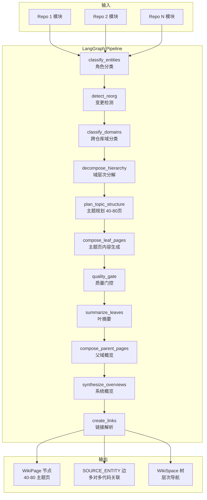

# Wiki 智能过滤、主题聚合与并行优化设计

**日期**: 2026-05-06
**状态**: ✅ Implemented (核心变更 U1/U2/U3a/U4 已在主线实现, 剩余项合并至 wiki-pipeline-integration 计划)
**范围**: wiki 生成管线 — 过滤 / 页面组织 / 并行度 / 增量策略

---

## 1. 背景与动机

### 1.1 现状问题

当前 `generate_business_wiki` 为 `ultron-composite` 项目生成了 **~962 页**，包含大量 DTO、枚举、工具类等低价值页面。生成耗时约 4-6 小时，Wiki 结构按 module 平铺而非按业务主题组织，不像人工撰写的业务文档。

**根因分析**：

| # | 问题 | 根因 |
|---|------|------|
| 1 | SKELETON 过滤从未生效 | `WikiService.generate()` 在 `plan()` **之后**才计算 `_importance_tiers`，未传入 planner |
| 2 | per-module 页面泛滥 | 业务 wiki 在 LangGraph pipeline 之后仍为每个 repo 调用 `self.generate()`，每个 module 一页 |
| 3 | 生成速度慢 | `compose_concurrency=3` 过低；跨仓库串行处理 |
| 4 | 主题页缺代码关联 | pipeline 生成的 topic page 无 `SOURCE_ENTITY` 边，无法导航到代码 |

### 1.2 目标

将 Wiki 从 "每个 module 一页" 转变为 "按业务主题层次展开"，最终效果类似人工撰写的业务文档：

```
📄 系统概览
├─ 📂 用户管理域
│   ├─ 📄 用户注册与认证
│   ├─ 📄 用户权限体系
│   └─ 📄 用户信息管理
├─ 📂 支付处理域
│   ├─ 📄 订单创建流程
│   ├─ 📄 支付网关集成
│   │   ├─ 📄 微信支付集成     ← 内容过多时自动拆分
│   │   └─ 📄 支付宝集成
│   └─ 📄 退款处理
└─ ...
```

**量化目标**：

| 指标 | 优化前 | 优化后 |
|------|--------|--------|
| 页面数量 | ~962 | ~40-80 |
| 生成时间 | ~4-6h | ~30-60min |
| LLM 调用次数 | ~1000+ | ~80-150 |
| Wiki 结构 | per-module 平铺 | 层次化业务主题树 |
| 代码关联 | ✅ (1:1) | ✅ (多对多) |
| 增量更新粒度 | repo 级 | domain 级 |

---

## 2. 变更单元

### U1: 连通 importance_tiers 到 planner

**文件**: `wiki/service.py`
**改动**: ~10 行

**现状 Bug**：
```python
# 第 327 行：plan 未传 tiers
structure = await self._planner.plan(repository, scope)

# 第 337-347 行：tiers 在 plan 之后才计算
_importance_tiers = await scorer.score_all(repository)

# 第 369 行：只传给了 composer
compose_all_pages(..., _importance_tiers, ...)
```

**修复**：将 `_importance_tiers` 计算移到 `plan()` 之前，并传入参数。

```python
# 修复后顺序
_importance_tiers = await self._compute_importance_tiers(repository)
structure = await self._planner.plan(
    repository, scope, importance_tiers=_importance_tiers
)
```

**效果**：`WikiStructurePlanner._is_skeleton()` 过滤逻辑生效，SKELETON 模块不再出现在结构树中。
**影响范围**：`generate()` 和 `generate_stream_events()` 两个入口。

---

### U2: 集成 TopicBasedStructurePlanner 到 LangGraph pipeline

**文件**: `wiki/pipeline_graph.py`, `wiki/pipeline_nodes.py`, `wiki/pipeline_state.py`
**改动**: ~60 行

**设计**：

在 `decompose_hierarchy` 之后、`compose_leaf_pages` 之前新增 `plan_topic_structure` 节点：

```
classify_entity_roles → detect_reorg → classify_domains → decompose_hierarchy
    → plan_topic_structure (新增) → compose_leaf_pages → quality_gate → ...
```

**`plan_topic_structure_node` 逻辑**：

1. 从 `state` 中获取 `domain_mapping`、`modules`、`entity_roles`
2. 收集 `module_metadata`：每个模块的 summary、methods、calls
3. 构建 `importance_tiers` 字典（从 `entity_roles` 推导）
4. 调用 `TopicBasedStructurePlanner.plan(domain_mapping, module_metadata, importance_tiers)`
5. 将结果写入 `state["topic_structure"]`

**`compose_leaf_pages_node` 修改**：

当 `state["topic_structure"]` 存在时，按 `TopicPage` 结构组合（每个 TopicPage 对应一个 wiki 页面），而非按原来的 leaf domain 逐个处理。每个 `TopicPage` 的 `covered_modules` 提供精确的模块列表。

**`TopicBasedStructurePlanner` 增强**（`wiki/topic_structure_planner.py`）：
- prompt 中增加对内容自动拆分的指导：当一个 topic 覆盖模块 > 10 个时，建议拆分为 sub-topics
- 已有 `sub_topics` 字段支持子页面结构

---

### U3a: 跳过 per-repo 生成开关

**文件**: `core/config.py`, `wiki/service.py`
**改动**: ~20 行

```python
# core/config.py - AppWikiFlags
business_wiki_skip_repo_pages: bool = Field(default=True)
```

在 `generate_business_wiki` 中，当 `business_wiki_skip_repo_pages=True` 时跳过 `for repo_name in all_modules: self.generate(...)` 循环。

通过环境变量 `WIKI__BUSINESS_WIKI_SKIP_REPO_PAGES=false` 可恢复旧行为。

---

### U3b: pipeline 主题页保留代码关联

**文件**: `wiki/pipeline_nodes.py`, `wiki/topic_page_composer.py`, `wiki/persistence.py`
**改动**: ~30 行

**`_compose_single_leaf_domain`** 修改：
- 收集所有 `biz_entities` 和 `data_models` 的 `uid`
- 在返回的 page dict 中增加 `covered_entity_uids: list[str]`

```python
covered_uids = [e["uid"] for e in biz_entities] + [d["uid"] for d in data_models]
return {
    "title": name,
    "content": content,
    "path": f"wiki/{name}",
    "page_type": "topic",
    "covered_entity_uids": covered_uids,
}
```

**`wiki/persistence.py`** (`persist_pages_to_graph`) 修改：
- 除了现有的 `entity_uid` 单实体关联外，支持 `covered_entity_uids` 多实体关联
- 为每个 `covered_entity_uid` 创建 `SOURCE_ENTITY` 边

**prompt 增强**（`wiki/topic_page_composer.py`）：
- `biz_entities` 中增加 `file_path` 和 `repository` 字段
- prompt 要求 LLM 在内容中使用 `source://` 引用标注代码位置
- 每个主题页底部自动附加 "相关源码" 引用表

---

### U3c: 跨仓库主题聚合增强

**文件**: `wiki/pipeline_nodes.py`
**改动**: ~15 行

**`_compose_single_leaf_domain`** 增强：
- `biz_entities` 中明确标注 `repository` 来源
- prompt 中要求 LLM 在描述业务流时标注不同仓库间的调用关系
- 微服务间调用关系通过 Mermaid sequenceDiagram 体现

```python
biz_entities.append({
    "uid": uid,
    "name": mod_name,
    "repository": repo_name,        # 新增
    "file_path": props.get("file", ""),  # 新增
    "summary": ...,
    "methods": ...,
    "calls": ...,
})
```

---

### U3d: 增量更新策略增强

**文件**: `wiki/pipeline_nodes.py`
**改动**: ~30 行

**`detect_reorg_node`** 增强：
- 当 `is_incremental=True` 时，记录 `affected_domains`：包含 `changed_repos` 模块的域列表
- 写入 `state["affected_domains"]`

**`compose_leaf_pages_node`** 增强：
- 当 `affected_domains` 非空时，只重新生成受影响的域页面
- 未受影响的域页面从现有 WikiPage 图节点加载并保留
- 通过 `state.get("affected_domains")` 控制

**增量场景**：

| 场景 | reorg_type | 行为 |
|------|-----------|------|
| 首次生成 | first_run | 全量构建所有域主题页 |
| 新增仓库 | heavy | 重新分类域 + 重生成受影响主题页 |
| 已有仓库代码变更 | light | 保留域结构，只重生成含变更模块的主题页 |
| 无变化 | none | 跳过 |

---

### U4: 并行优化

**文件**: `core/config.py`, `wiki/service.py`
**改动**: ~15 行

**4a. 调参**：
```python
# core/config.py
compose_concurrency: int = Field(default=6, ge=1)  # 3 → 6
```

**4b. 跨仓库并行**（当 `business_wiki_skip_repo_pages=false` 时）：
```python
# core/config.py
business_repo_concurrency: int = Field(default=3, ge=1)

# wiki/service.py
repo_sem = asyncio.Semaphore(app_cfg.business_repo_concurrency)
async def _gen_one(repo: str):
    async with repo_sem:
        await self.generate(repo, "repo", mode, ...)
await asyncio.gather(*[_gen_one(r) for r in changed_repos])
```

---

## 3. 数据流



---

## 4. 配置项汇总

| 配置 | 环境变量 | 默认值 | 说明 |
|------|----------|--------|------|
| `compose_concurrency` | `WIKI__COMPOSE_CONCURRENCY` | `6` (原 3) | 并发组合/丰富上限 |
| `business_wiki_skip_repo_pages` | `WIKI__BUSINESS_WIKI_SKIP_REPO_PAGES` | `true` | 跳过业务 wiki 中的 per-repo 生成 |
| `business_repo_concurrency` | `WIKI__BUSINESS_REPO_CONCURRENCY` | `3` | per-repo 并行数（仅 skip=false 时） |
| `code_budget_enabled` | `WIKI__CODE_BUDGET_ENABLED` | `true` | 是否启用重要度评分 |

---

## 5. 实施约束与注意事项

### 5.1 summarize_leaves_node 兼容性

当使用 TopicPage 时，compose_leaf_pages_node 输出的页面 dict 必须保持 `"domain"` 字段与 `domain_tree` 的 leaf name 一致，而非使用 TopicPage 的 title。否则 `summarize_leaves_node` 按 domain 分组提取摘要会失败。

**实施约束**：compose_leaf_pages_node 中使用 TopicPage 时，将每个 topic 的 `domain` 字段设为其所属的原始 domain name。

### 5.2 module_index 需保留 repo 信息

当前 `compose_leaf_pages_node` 中 `module_index` 按 name 索引，丢失了 repo 信息。U3c 需要修改 `module_index` 构建逻辑：

```python
# 现有：丢失 repo
for _repo, mod_list in modules.items():
    for mod_dict in mod_list:
        name = mod_dict.get("properties", {}).get("name", "")
        module_index[name] = mod_dict

# 修改后：保留 repo
for repo_name, mod_list in modules.items():
    for mod_dict in mod_list:
        name = mod_dict.get("properties", {}).get("name", "")
        mod_dict["_repo"] = repo_name  # 注入 repo 信息
        module_index[name] = mod_dict
```

### 5.3 实施分阶段建议

| Phase | 变更单元 | 说明 |
|-------|---------|------|
| Phase 1 | U1 + U4 + U3a | 快速见效，低风险。连通过滤、调参、跳过 per-repo |
| Phase 2 | U2 + U3b + U3c | 核心变更。集成 TopicPlanner、代码关联、跨仓库 |
| Phase 3 | U3d | 进阶优化。domain 级增量更新（需要 compose_leaf_pages_node 读图，架构变更较大） |

Phase 3 的 U3d 增量更新引入了 compose_leaf_pages_node 读取图数据库加载已有页面的依赖，这是较大的架构变更，建议在 Phase 1+2 验证稳定后单独实施。

---

## 6. 风险与缓解

| 风险 | 影响 | 缓解 |
|------|------|------|
| TopicBasedStructurePlanner LLM 失败 | 退回 domain-direct 映射 | 已有 `_fallback()` 机制 |
| 主题页覆盖不全 | 部分模块未出现在任何主题页 | planner 有 50% 覆盖率校验 |
| 跳过 per-repo 后详细 API 需求 | 无单独 module 页 | 可单独触发 repo-level wiki；可通过 MCP 查询代码细节 |
| 增量更新域边界变化 | 重分类可能改变域结构 | heavy reorg 触发全量重建 |
| FalkorDB 并发写入冲突 | 多个 compose 同时写入图 | persist 层已有 chunk + timeout 保护 |

---

## 7. 测试计划

- [ ] U1: 验证 SKELETON 模块从 structure 中被过滤（单元测试）
- [ ] U2: TopicBasedStructurePlanner 集成到 pipeline 后生成 40-80 页（集成测试）
- [ ] U3a: `business_wiki_skip_repo_pages=true` 时无 per-repo 页面（集成测试）
- [ ] U3b: topic page 有 SOURCE_ENTITY 边且可从 wiki 导航到代码（E2E 测试）
- [ ] U3c: 跨仓库主题页包含多仓库代码引用（集成测试）
- [ ] U3d: 增量更新只重生成受影响域（集成测试）
- [ ] U4: compose_concurrency=6 下无并发错误（压力测试）
- [ ] 全流程: ultron-composite 生成 ≤ 80 页主题 wiki，耗时 < 1h
