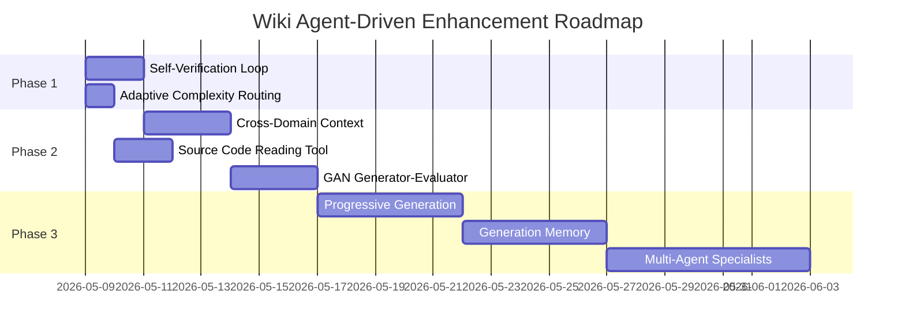

# Wiki Agent-Driven 增强能力深度分析

**状态**: Draft
**创建时间**: 2026-05-08
**方法论**: 对比 Cline/Roo Code/Codex/Gemini CLI + 前沿研究论文，使用 Sequential Thinking 深度分析

---

## 1. 背景

Wiki 生成管线的核心功能已全部实现并接入 LangGraph Pipeline（2966测试通过）。当前 WikiPageAgent 通过工具调用（图数据库查询）和 LLM 生成内容，已完成 CCB+Agent 融合（R5）。

本分析研究主流开源/商业 Agent 的能力，识别 Wiki 生成全面转向 Agent-Driven 后可借鉴的增强方向。

---

## 2. 研究对象

| Agent | 类型 | 关键能力 |
|-------|------|---------|
| Cline | 开源 IDE Agent | 上下文管理、File Deduplication、new_task 持久化 |
| Roo Code | 开源 IDE Agent | Boomerang 多Agent编排、Mode Delegation、GNAP |
| Codex (OpenAI) | 商业 Cloud Agent | Memory系统、Plan-Edit-Run-Observe-Repair、并行线程 |
| Gemini CLI | 开源 CLI Agent | Session Scratchpad、State Checkpointing、Auto-distillation |
| ReflexiCoder | 学术研究 | RL训练的自反思、自校正，40%推理开销减少 |
| Reflection-Driven Control | 学术研究 | 连续内部反思循环、反思记忆检索、约束注入 |

---

## 3. 六大增强维度

### 3.1 上下文管理 (Context Management)

**当前问题：**
- 每个 leaf domain 独立生成，无法利用已生成的兄弟域知识
- CCB 提供的 baseline 是静态的，无法根据 Agent 探索过程动态调整
- 没有跨域知识共享机制

**主流做法：**
- Cline: File Read Deduplication + Context Window Awareness (超50%时降级)
- Gemini: Session Scratchpad (存活于压缩) + State Checkpointing (不可变锚点)
- Codex: 外部化状态 (repo/docs) + Items/Turns/Threads 三层抽象

**可借鉴增强：**
1. **域间上下文传递** — 生成域A后提取关键知识作为域B的输入
2. **动态上下文缩放** — Agent 感知已有上下文量，决定继续探索或开始写作
3. **Progressive Context Building** — 已生成的 wiki 页面作为后续域的参考上下文

### 3.2 工具调用策略 (Tool Calling Strategy)

**当前问题：**
- 工具单一：只有 graph 查询类工具
- 无查询规划：Agent 随机决定查什么
- 缺少查询结果评估和回退机制

**主流做法：**
- Codex: Plan-Edit-Run-Observe-Repair 循环，每次工具后分析结果
- Cline: 不同工具类型有不同上下文注入策略
- Roo Code: Mode Delegation，不同模式有不同工具集

**可借鉴增强：**
1. **查询规划器** — 在 generate 前先生成"信息采集计划"
2. **源码读取工具** — Agent 直接读取关键模块源代码片段
3. **已有 Wiki 参考工具** — 查询已生成的相邻域页面
4. **查询结果评估器** — 每次工具返回后评估"信息够了吗？"

### 3.3 记忆系统 (Memory System)

**当前问题：**
- 无任何记忆，每次生成从零开始
- 增量生成时不知道上次生成了什么
- 用户反馈无法持久化影响后续生成

**主流做法：**
- Codex Memory: 跨会话记住用户偏好、纠正、获取的信息
- Cline new_task: 结构化上下文交接 + .clinerules 自动化
- Gemini Scratchpad: Agent 工作记忆存活于压缩

**可借鉴增强：**
1. **Domain Knowledge Cache** — 每个域生成完后提取"域摘要卡片"供后续域参考
2. **Generation History** — 记录每个域的生成历史，增量更新时知道什么变了
3. **Quality Feedback Loop** — 质量检查结果作为记忆存储，避免重复错误
4. **Style Memory** — 记住项目的写作风格偏好

### 3.4 自反思/自校正 (Self-Reflection & Self-Correction)

**当前问题：**
- 完全没有自反思能力
- 生成的内容可能有幻觉、遗漏、结构混乱，Agent 自己不会发现
- quality_gate 是外部的、事后的，而非生成过程中的

**主流做法：**
- ReflexiCoder: 内化自反思，不依赖外部反馈，RL训练自校正能力
- Reflection-Driven Control: 连续内部反思循环，检测风险时从反思记忆检索修复示例
- Vibe Engineering: 结构化自评估和验证循环，每个 turn 后注入

**可借鉴增强：**
1. **内嵌式自验证循环 (Generate-Reflect-Revise)**
   - 模块覆盖率检查：所有关键模块都被提及？
   - 幻觉检测：提及的函数/类在图中存在？
   - 结构完整性：有概述、有细节、有图表？
2. **Citation 确认循环** — 对每个技术声明回查图数据库确认
3. **多候选策略** — 关键段落生成多个候选，内部评分选最佳

### 3.5 多 Agent 编排 (Multi-Agent Orchestration)

**当前问题：**
- 单 Agent 负责整个域的生成
- 没有专业化分工
- 没有生成后的独立评审

**主流做法：**
- Roo Code Boomerang: 任务分解为子任务，专业化 modes，隔离上下文
- Codex: 多线程并行，每个 Thread 持久化容器
- GNAP: Git-Native 任务协调，多 Agent 通过 git 仓库协作

**可借鉴增强：**
1. **GAN-style Generator-Evaluator** — Generator 生成，Evaluator 评分+反馈，迭代直到达标
2. **Orchestrator 编排器** — 根据域复杂度决定用哪些 Specialist
3. **Cross-Domain Linker Agent** — 所有域生成完后专门添加跨域链接和参考

### 3.6 其他方向

1. **Adaptive Complexity Routing** — 根据域复杂度选择不同能力模型
2. **Progressive Disclosure Generation** — 骨架→内容→丰富化，每步可独立评估
3. **Structured Output Schema** — 强制 Agent 输出符合预定义 schema
4. **Execution Feedback** — 生成后"执行"验证（渲染Markdown、验证链接）
5. **Token Budget Intelligence** — 根据域复杂度自动分配 token 预算

---

## 4. 优先级矩阵

### P1：立即收益 (1-2天可实现)

| # | 增强方向 | 来源 | 预期效果 | 工作量 |
|---|----------|------|---------|--------|
| 1 | Self-Verification Loop | ReflexiCoder/Vibe | 减少40-60%幻觉和遗漏 | ~200行 |
| 2 | Adaptive Complexity Routing | Codex/Roo | 减少40-50% token消耗 | ~100行 |

### P2：中期收益 (3-5天)

| # | 增强方向 | 来源 | 预期效果 | 工作量 |
|---|----------|------|---------|--------|
| 3 | Cross-Domain Context Sharing | Gemini Scratchpad | 跨域一致性提升 | ~150行 |
| 4 | Source Code Reading Tool | Cline/Codex | 内容深度和准确性提升 | ~150行 |
| 5 | GAN-style Generator-Evaluator | Roo/Reflection | 关键域质量提升30-50% | ~400行 |

### P3：长期演进 (1-2周)

| # | 增强方向 | 来源 | 预期效果 | 工作量 |
|---|----------|------|---------|--------|
| 6 | Progressive Generation | Codex | 结构质量+可控性 | ~300行 |
| 7 | Generation Memory | Codex Memory | 增量更新质量 | ~500行 |
| 8 | Multi-Agent Specialists | Roo Boomerang | 内容多样性和深度 | ~600行 |
| 9 | Human Feedback Integration | Cline | 持续质量改进 | ~300行 |

---

## 5. 推荐实施路径



---

## 6. 架构设想：Enhanced WikiPageAgent Pipeline

```
_compose_single_leaf_domain(leaf)
  │
  ├─ ① CCB Context Building (已实现)
  │     └─ format_summary_for_agent(max_chars=6000)
  │
  ├─ ② Complexity Assessment (NEW - P1)
  │     └─ 根据 module_count、edge_count、entity_count 评估复杂度
  │     └─ complexity_level: simple | moderate | complex
  │
  ├─ ③ Cross-Domain Context Injection (NEW - P2)
  │     └─ 从已生成的兄弟域 wiki 中提取相关摘要
  │     └─ 调用链中涉及已生成域的部分，直接引用其内容
  │
  ├─ ④ Agent Generation (根据 complexity_level 调整策略)
  │     └─ simple: max_rounds=3, 轻量模型, 无工具调用
  │     └─ moderate: max_rounds=5, 标准模型, 标准工具
  │     └─ complex: max_rounds=8, 强模型, 扩展工具集(含源码读取)
  │
  ├─ ⑤ Self-Verification Loop (NEW - P1)
  │     └─ 检查 1: 模块覆盖率（所有关键模块都被提及？）
  │     └─ 检查 2: 幻觉检测（提及的函数/类在图中存在？）
  │     └─ 检查 3: 结构完整性（有概述、有细节、有图表？）
  │     └─ 如果任一检查失败 → 补充查询 + 修正
  │
  └─ ⑥ Output (已有: sanitize + quality_gate)
```

---

## 7. 风险与缓解

| 风险 | 缓解措施 |
|------|---------|
| 延迟增加 (自验证+修正循环) | Adaptive Routing 让简单域跳过验证 |
| Token 消耗增加 (多一轮反思) | 简单域用轻量模型，总体 token 反而下降 |
| 系统复杂度 | 逐步引入，每个增强独立可测 |
| 源码读取安全 | 只读取已索引仓库的文件，沙箱限制 |

---

## 8. Harness Engineering 视角：可靠性与准确性增强

### 8.1 核心原则

> "Agent = Model + Harness. 一个坚实的模型配一个优秀的 Harness，能超越一个优秀的模型配糟糕的 Harness。"

Harness 包含 10 个核心组件：system prompt, tool registry, sandbox, permission model, memory, context management, sub-agents, hooks, observability, evals。

**主导模式是 Planner/Generator/Evaluator 分离** — 消除自评分偏差。

### 8.2 可靠性复合问题

关键洞察：如果每步 95% 可靠，一个 8 步的 Wiki 生成任务只有 66% 成功率。

```
每步可靠性 → 8步任务成功率：
  90% → 43%
  95% → 66%
  99% → 92%
```

因此，**提升每一步的可靠性比增加步骤更重要**。

### 8.3 Eval 评估系统 (EDD 方法论)

三层评估架构：

| 层级 | 类型 | Wiki 应用 |
|------|------|----------|
| L1 | 确定性检查 | 模块覆盖率、结构完整性、Markdown有效性、无CONTEXT_GAP |
| L2 | LLM-as-Judge | 准确性(1-5)、完整性(1-5)、可读性(1-5)、忠实性(1-5) |
| L3 | 回归评估 | 金标准用例对比、A/B测试、时间序列质量追踪 |

**确定性检查 (L1) 示例：**
- 模块覆盖率：输入 module_names 中每个模块至少被提及 1 次
- 结构完整性：有标题、有概述段、有详细模块说明
- Markdown 有效性：无未关闭代码块、标题层次正确
- 字数范围：每页 500-8000 字
- 交叉引用存在：至少有 1 个跨域链接（对于有跨域调用的域）

### 8.4 Planner/Generator/Evaluator 分离

当前 WikiPageAgent 同时担任规划、生成、评估三个角色（自评分偏差）。

**推荐架构：**

```
Wiki Page Generation Harness:

1. Planner (确定性逻辑 / planning_prompt)
   输入: domain_name, module_names, CCB context
   输出: information_gathering_plan + outline_structure
   职责: 决定需要查询什么、页面应该包含什么结构

2. Generator (wiki_page_agent)
   输入: plan + gathered_info
   输出: wiki_page_content
   职责: 按照计划生成内容

3. Evaluator (独立 eval prompt + 确定性检查)
   输入: wiki_page_content + source_data (graph)
   输出: score + issues + suggestions
   职责: 独立评估质量，发现问题

4. Repair Loop:
   IF score < threshold → Generator 根据 Evaluator 反馈修正
   MAX 2 repair iterations（控制成本）
```

### 8.5 护栏系统 (Guardrails)

| 类型 | 护栏 | 作用 |
|------|------|------|
| 工具调用 | max_tool_calls=15 | 防止死循环 |
| 工具调用 | 重复检测 (同样查询>2次) | 打断循环 |
| 工具调用 | token消耗上限 50000/域 | 成本控制 |
| 输出 | 最小长度 >500字 | 质量底线 |
| 输出 | 最大长度 <15000字 | 可读性 |
| 输出 | 敏感信息检测 | 安全合规 |
| 输出 | Markdown格式验证 | 格式正确 |

### 8.6 Hooks 生命周期

```python
class WikiGenerationHooks:
    pre_generation(domain, modules, context)
      → 验证 context 充分性，触发额外查询
    post_tool_call(tool_name, result)
      → 记录统计、检测冗余、建议替代查询
    post_generation(content, domain, modules)
      → 运行确定性检查、计算质量分数、决定是否 repair
    on_error(error, context)
      → 记录错误、决定 fallback 策略
```

### 8.7 Observability 可观测性

生产监控指标：
- 每个域的生成时间、token 消耗、工具调用次数
- 质量分数分布（平均、P50、P90）
- 失败率和失败原因分类
- 异常检测（质量突降、token暴增、工具失败率飙升）

### 8.8 Harness Hill-Climbing (自动优化)

```
1. 收集一批域生成结果 + 评估分数
2. 识别低分模式 (哪类域得分低？什么问题最常见？)
3. 自动调整 system prompt 或工具策略
4. 重新评估同一批域
5. 保留更好的配置
```

可优化变量：
- System prompt 中的指导语
- max_rounds 数值
- 工具调用策略（先查调用链还是先查方法）
- format_summary 的 max_chars
- 模型选择（不同模型对不同类型域的表现）

---

## 9. 统一实施路线图（融合 Agent 能力 + Harness 工程）

### Phase 1: 评估基建 + 核心护栏 (2-3天)

| 任务 | 来源 | 效果 |
|------|------|------|
| 三层 Eval 评估系统 | EDD/Harness | 为所有优化提供计量基线 |
| Planner/Generator/Evaluator 分离 | Harness 主导模式 | 消除自评分偏差，质量提升30%+ |
| 护栏系统 | Harness Guardrails | 防止死循环、控制成本、保证格式 |
| Adaptive Complexity Routing | Codex/Roo | 简单域快速通过，复杂域重点处理 |

### Phase 2: 工具增强 + 上下文连续性 (3-5天)

| 任务 | 来源 | 效果 |
|------|------|------|
| Source Code Reading Tool | Cline/Codex | 深度验证准确性 |
| Cross-Domain Context Sharing | Gemini Scratchpad | 跨域一致性 |
| Hooks 生命周期 | Harness Hooks | 精细化控制 |
| Observability 可观测性 | Harness | 监控和诊断基础 |

### Phase 3: 自动进化 (1-2周)

| 任务 | 来源 | 效果 |
|------|------|------|
| Harness Hill-Climbing | LangChain Better-Harness | 自动优化 prompt/策略 |
| Generation Memory | Codex Memory | 增量更新质量 |
| Progressive Generation | Codex | 结构质量可控性 |
| Multi-Agent Specialists | Roo Boomerang | 内容深度和多样性 |

---

## 10. 上下文/记忆管理策略深度分析

### 10.1 场景特征分析

Wiki 生成与通用 Agent 对话的关键差异：

| 特征 | 通用 Agent | Wiki 生成 |
|------|-----------|----------|
| 交互模式 | 一问一答 | 批处理(63页/次) |
| 信息源 | 开放互联网 | 确定(图数据库+源码) |
| 输出结构 | 自由文本 | 固定(概述/流程/实现/依赖) |
| 跨任务关联 | 弱 | 强(域间调用关系) |
| 并行性 | 低 | 高(无依赖域可并行) |

### 10.2 各主流方案适用性评估

| 方案 | 核心思想 | 适用度 | 原因 |
|------|---------|--------|------|
| Cline Context Awareness | 监控使用率,超限压缩 | 5/10 | 压缩=丢失信息,对Wiki质量有害 |
| Codex External State | 中间结果不占context | 7/10 | 很契合,但需适配存储位置 |
| Gemini Scratchpad | 关键记忆不被压缩 | 6/10 | 好思想,但单平面结构不够 |
| 分段生成 | 每段独立上下文 | 7/10 | 实用,但需一致性处理 |
| Structured Scratchpad | 提取事实+精简生成 | 8/10 | 综合最优 |

### 10.3 推荐方案: "Plan-Gather-Distill-Generate" 四阶段模型

融合各家之长的混合方案：

```
Phase 1: PLAN (确定性, 0 LLM tokens)
  输入: domain, modules, CCB context, DomainSummaryCache
  输出: query_plan + page_outline + context_budget
  来源: Planner 确定性逻辑

Phase 2: GATHER (工具调用, 不用LLM决策)
  输入: query_plan
  输出: GatheredFacts dict {section_name: [Fact(source, content)]}
  特点: 按计划执行查询, 结果不占 LLM context
  来源: Codex "External State" 思想

Phase 3: DISTILL (精简, 确定性 or 轻量LLM)
  输入: GatheredFacts (30K原始数据)
  输出: DistilledContext (8-12K精简事实)
  操作: 去重 + 截断 + 按section分组 + 注入跨域 Summary Cards
  来源: Gemini "Auto-distillation" 思想

Phase 4: GENERATE (内容生成)
  simple域: system_prompt + distilled_context + "生成完整页面" (~15K total)
  complex域: 按section分段生成, 每段独立context (~35K total)
  来源: 分段生成 + Adaptive Routing
```

### 10.4 Token 消耗对比

| 场景 | 现有Agent流程 | 新方案 | 节省 |
|------|-------------|--------|------|
| 小域(1-5模块) | ~20K | ~12K | -40% |
| 中域(5-15模块) | ~41K | ~25K | -39% |
| 大域(15+模块) | ~55K | ~35K | -36% |
| 信息利用率 | ~40% | ~80% | +100% |

### 10.5 三层记忆架构

```
Layer 1: Domain Summary Cache (跨域共享, 持久化)
  ┌─────────────────────────────────────────────────┐
  │ 每域生成完成后提取 DomainSummaryCard:            │
  │ {domain_name, key_modules, entry_points,         │
  │  responsibilities, depends_on[], generated_at}   │
  │ 大小: ~200-500 tokens/card                       │
  │ 用途: 后续域生成时注入相关域摘要                  │
  │ 来源: Gemini "State Checkpoint" 思想             │
  └─────────────────────────────────────────────────┘

Layer 2: Generation History (增量更新用)
  ┌─────────────────────────────────────────────────┐
  │ 每页记录:                                        │
  │ {source_modules, source_entities, content_hash,  │
  │  generated_at, quality_score}                    │
  │ 当代码变更时 → 检查哪些页面的 source 受影响      │
  │ 只重新生成受影响页面                              │
  │ 来源: Codex "External State" 思想               │
  └─────────────────────────────────────────────────┘

Layer 3: Quality Feedback Memory (质量改进用)
  ┌─────────────────────────────────────────────────┐
  │ 记录评估中的常见问题模式:                        │
  │ {issue_pattern, frequency, affected_domain_types}│
  │ 下次生成同类域时注入"历史教训"                   │
  │ 来源: Codex "Memory" 思想                       │
  └─────────────────────────────────────────────────┘
```

### 10.6 大 Wiki 页面的具体策略

| 域规模 | 策略 | GATHER | DISTILL | GENERATE | 预估token |
|--------|------|--------|---------|----------|-----------|
| 小(1-5模块) | 整页一次性 | 3-5查询 | 确定性截断 | 整页 | ~12K |
| 中(5-15模块) | 整页+精简 | 8-12查询 | 确定性 | 整页 | ~25K |
| 大(15+模块) | 分段生成 | 15+查询 | 可选LLM | 按section | ~35K |

**大域的分段生成流程：**
1. PLAN 生成 4 个 section 的独立查询计划
2. GATHER 按 section 分组执行
3. DISTILL 为每个 section 生成独立的精简上下文
4. GENERATE 逐 section 生成 (每次 ~4K input)
5. Coherence Pass: 所有 section 生成后, 一次轻量检查修正交叉引用和风格一致性
