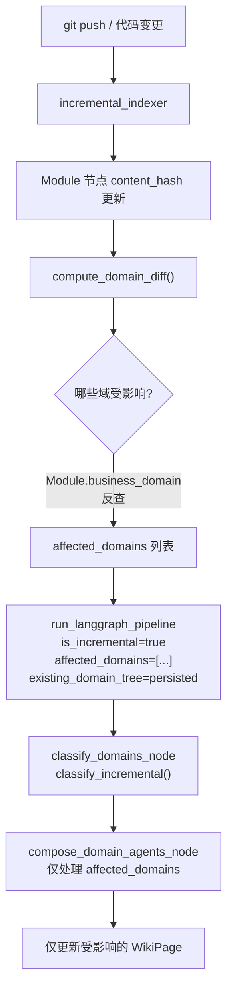

# Incremental Wiki Update Design

**日期**: 2026-05-11  
**状态**: Draft  
**作者**: AI Agent  
**前置**: Agent-Driven Wiki 管线已实现（Phase 1-4 ✅）

---

## 1. 问题定义

当前 `generate_business_wiki` 每次运行都重新生成**所有域**的文档，即使仅有少数模块发生了变化。对于中大型项目（100+ 模块），这意味着：

- **LLM 调用浪费**: 未变更域的 Agent 迭代是无意义的
- **延迟增加**: 全量生成可能需要 10-30 分钟
- **质量不稳定**: 频繁重新生成可能导致文档内容波动

**目标**: 实现域级粒度的增量更新 — 仅重新生成受代码变更影响的域。

---

## 2. 现有增量机制分析

### 2.1 已有的增量信号

| 信号 | 位置 | 粒度 | 限制 |
|------|------|------|------|
| `code_hash` vs `wiki_code_hash` | `wiki/incremental_diff.py` | 实体级 | 仅用于单仓库 `generate_incremental`，不含域映射 |
| `Module.business_domain` | FalkorDB 图节点 | 模块级 | 可反向查找受影响域 |
| `get_repo_wiki_freshness` | `store/wiki_page_store.py` | 仓库级 | 太粗粒度，无法定位具体域 |
| `is_incremental` + `affected_domains` | `wiki/pipeline_state.py` | 域级 | 已声明但 `generate_business_wiki` 未传入 |
| `detect_reorg_node` | `wiki/pipeline_graph.py` | 管线级 | 依赖 `existing_domain_tree`，当前总为 `None` |

### 2.2 关键缺口

1. `generate_business_wiki` 不传 `existing_domain_tree` 或 `affected_domains`
2. `compose_domain_agents_node` 没有 `affected_domains` 过滤（`compose_leaf_pages` 有）
3. `code_hash` 与 `content_hash` 命名不一致
4. 无域级脏标记机制

---

## 3. 设计方案

### 3.1 数据流



### 3.2 核心变更

#### 变更 1: `compute_domain_diff()` — 域级脏检测

新函数，基于现有 `compute_wiki_diff` 扩展：

```python
# wiki/incremental_diff.py
async def compute_domain_diff(
    store: Any,
    business_id: str,
) -> DomainDiff:
    """Identify domains affected by code changes since last wiki generation.
    
    1. Find modules where content_hash != wiki_code_hash
    2. Look up each module's business_domain property
    3. Return affected domain names
    """
    changed_result = await store.execute_query(
        "MATCH (n:Module) WHERE n.repository IN "
        "(MATCH (ws:WikiSpace {business_id: $bid}) "
        " OPTIONAL MATCH (ws)-[:HAS_CHILD*]->(wp:WikiPage) "
        " WITH collect(DISTINCT wp.repository) AS repos RETURN repos)[0] "
        "AND n.content_hash IS NOT NULL "
        "AND (n.wiki_code_hash IS NULL OR n.content_hash <> n.wiki_code_hash) "
        "RETURN n.uid AS uid, n.name AS name, "
        "       coalesce(n.business_domain, '') AS domain",
        {"bid": business_id},
    )
    
    affected_domains = set()
    changed_modules = []
    for row in changed_result.data:
        domain = row.get("domain", "")
        if domain:
            affected_domains.add(domain)
        changed_modules.append(row["uid"])
    
    return DomainDiff(
        affected_domains=list(affected_domains),
        changed_module_uids=changed_modules,
        total_changed=len(changed_modules),
    )
```

#### 变更 2: `generate_business_wiki` 传入增量参数

```python
# wiki/service.py — generate_business_wiki 修改
if incremental:
    # Load persisted domain tree from WikiSpace
    existing_tree = await self._wiki_store.get_pipeline_domain_tree(business_id)
    domain_diff = await compute_domain_diff(query_port, business_id)
    
    if domain_diff.total_changed == 0:
        log.info("wiki_no_changes", business_id=business_id)
        return PipelineResult(pages=[], ...)
    
    pipeline_result = await run_langgraph_pipeline(
        ...,
        is_incremental=True,
        existing_domain_tree=existing_tree,
        affected_domains=domain_diff.affected_domains,
    )
```

#### 变更 3: `compose_domain_agents_node` 增量过滤

```python
# wiki/nodes/domain_compose.py
async def compose_domain_agents_node(state, config=None):
    ...
    affected = set(state.get("affected_domains", []))
    is_incremental = state.get("is_incremental", False)
    
    if is_incremental and affected:
        leaf_domains = [d for d in leaf_domains 
                       if d["name"] in affected or d.get("parent") in affected]
        log.info("incremental_domain_filter", 
                 total=len(_collect_leaf_domains(domain_tree)),
                 filtered=len(leaf_domains))
    ...
```

#### 变更 4: 增量持久化 — 仅更新变更域的 WikiPage

```python
# wiki/persistence.py — persist_pages_to_graph 修改
# 增量模式下，cleanup_stale_wiki_pages 仅删除 affected_domains 的旧页面
if is_incremental and affected_domains:
    await self.cleanup_stale_wiki_pages_by_domain(
        repository=business_id,
        current_page_paths=new_page_paths,
        affected_domains=affected_domains,
    )
```

### 3.3 命名对齐

| 当前 | 修复后 | 位置 |
|------|--------|------|
| `content_hash` (indexer) | 不变 | `indexer/chunk_hash.py` |
| `code_hash` (wiki diff) | 改为 `content_hash` | `wiki/incremental_diff.py` Cypher |
| `wiki_code_hash` (wiki sync) | 改为 `wiki_content_hash` | `wiki/persistence.py` |

---

## 4. 测试计划

| # | 测试 | 覆盖 |
|---|------|------|
| 1 | `compute_domain_diff` 返回正确的 affected_domains | 单元测试 |
| 2 | `compose_domain_agents_node` 增量过滤仅处理 affected 域 | 单元测试 |
| 3 | 增量持久化仅清理 affected 域的旧页面 | 单元测试 |
| 4 | `generate_business_wiki` incremental=True 传入正确参数 | 集成测试 |
| 5 | 无变更时跳过生成 | 单元测试 |

---

## 5. 风险与缓解

| 风险 | 影响 | 缓解 |
|------|------|------|
| 域分类漂移 | 增量重分类可能改变域边界 | `classify_incremental` 保留旧域，仅对新模块分类 |
| 跨域依赖遗漏 | 模块 A 变更影响域 B 的文档 | 通过 `CALLS`/`IMPORTS` 边扩展 affected_domains |
| `content_hash` 缺失 | 旧索引的模块可能没有 `content_hash` | 回退到全量生成 |

---

## 6. 实施优先级

1. **P0**: `compute_domain_diff` + `generate_business_wiki` 传参（最小可行增量）
2. **P1**: `compose_domain_agents_node` 增量过滤
3. **P2**: 增量持久化 + 命名对齐
4. **P3**: 跨域依赖扩展
