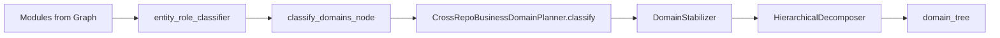

# Agent Wiki 质量修复 + 前端树适配统一提案

**Created:** 2026-05-12  
**Last Updated:** 2026-05-12 (合并域分类提案)  
**Status:** P0-P2 ✅ / Task F 核心 ✅ / Task G-H Proposed  
**Priority:** P0  
**Type:** 统一提案（Spec）

---

## 1. 背景

2026-05-12 完成了 Agent 管线的首次端到端调试验证，发现并修复了 3 个阻塞性 Bug：

1. **`USE_AGENT_COMPOSE` 环境变量无法从 .env 加载** — `pipeline_graph.py` 直接用 `os.environ.get()`，改用 `_get_env()` 修复
2. **`from __future__ import annotations` 导致 LangGraph config=None** — LangGraph 反射无法匹配字符串注解的 `RunnableConfig`，移除该 import 修复
3. **`_make_page` 字段名不兼容下游** — `"type"` → `"page_type"`，补全 `diagrams`/`source_locations`/`metadata` 字段

修复后 Agent 管线成功运行（24 个域页面，citation_density 0.56~1.75，含 Mermaid/代码块/source:// 链接），但仍存在以下问题。

---

## 2. 问题清单

### Issue A: 图分解输出未被 Agent 管线消费

`graph_decompose_node` 产出 `module_tree`（WCC/SCC 分解结果），但 `compose_domain_agents_node` 仅消费 `domain_tree` 和 `module_summaries`，不读取 `module_tree`。图分解作为管线的"结构基础"未能约束 Agent 的上下文边界。

### Issue B: Wiki 树前端显示不出内容

Agent 的 `_make_page()` 用 `key.replace(" ", "_")` 生成扁平 path（如 `挚友关系管理`），而 `WikiTreeLinker._create_sections()` 生成 synthetic overview path 为 `/__domains__/挚友关系管理/_overview`。前端用 exact path 匹配 → 找不到 Agent 内容。

### Issue C: Topic 文档缺失

Agent 管线仅生成 `domain_overview` 类型页面，不生成 `topic` 子页面。前端导航树中每个域只有一个节点。

### Issue D: 部分页面内容混入工具调用过程

某些页面包含 `read_code(...)` 等工具调用描述。已有 `strip_agent_artifacts()` 后处理但正则覆盖不完整。

### Issue E: quality_gate 100% 页面需要 heal

**根因（代码级确认）**：`wiki/quality_evaluator.py` 的 structural_check heading marker 与 Agent prompt 产出的标题不一致：

| 检查项 | evaluator 期望 | Agent 产出 | 匹配? | 扣分 |
|--------|---------------|-----------|-------|------|
| overview | `## 概述` | `## 概述` | ✅ | 0 |
| components | `## 核心服务要点` 等 | `## 关键实现` | ❌ | -0.25 |
| relationships | `## 关联主题` 等 | `## 依赖关系` | ❌ | -0.2 |
| diagrams | `page.diagrams` 非空 | Mermaid 在 content 中 | ❌ | -0.15 |

总扣分 ≥ 0.6，剩余 ≤ 0.4 < 阈值 0.5 → 100% heal。**修复不需要调阈值，只需扩展 marker。**

### Issue F: 内容深度不足

生产环境平均 3555 字符/页，POC 基线 10748 字符。原因：baseline 传入过多（500 字摘要）→ Agent 不深入探索；质量终止条件太容易满足；Explore/Write 在同一上下文中导致输出压缩。

---

## 3. 设计决策记录

### Issue B 方案选择：Agent 主导 + TreeLinker 兜底（方案 C'）

**三个候选方案：**

| 方案 | 描述 | 优势 | 劣势 |
|------|------|------|------|
| A | 修改 `_make_page()` path + TreeLinker 检测跳过 | 路径统一，修改量小 | Agent 与路径规范耦合 |
| B | 仅改 TreeLinker 适配 Agent 任意 path | Agent 不感知路径规范 | 两套路径共存，维护困难 |
| **C'** (选定) | Agent 使用标准路径 + TreeLinker 检测已有则跳过，未有则兜底 | **路径统一 + 失败兜底** | 略大于 A |

**选择理由**：路径是全局标识符，应有且仅有一种格式。方案 C' 在路径统一的基础上保证了 Agent 失败时仍有 synthetic overview 兜底。

**完整链路保证**：
1. Agent 页面在管线 `finalize` 阶段持久化（先于 TreeLinker）
2. TreeLinker 运行时检查 `WikiPage:{business_id}:{path}` 是否存在
3. 已有 → 直接链接，跳过合成；未有 → 生成 synthetic overview
4. UID 确定性：相同 path → 相同 UID → 不产生重复

### Issue F baseline 策略：拓扑关系 + 一行描述

**三个候选策略：**

| 策略 | 内容 | Agent 行为 |
|------|------|-----------|
| 完整摘要（当前） | 每模块 500 字 | 偷懒不用工具 (Issue #008) |
| **拓扑 + 一行（选定）** | 依赖关系 + 每模块一句话角色 | 知道全局结构，被迫深入代码 |
| 纯模块名 | 仅名称列表 | 花太多轮定位基本信息 |

**拓扑数据来源**：`state["module_tree"]` → 按域筛选 → 提取模块间依赖边。

### Issue C Topic 方案：_maybe_split 自动拆分

**选择理由**：YAGNI——当前大多数域文档不超过 5000 token 阈值，只有少数大域需要拆分。方案 1（自动拆分）零额外 LLM 调用、内容一致性好、已有框架代码。

---

## 4. 实施任务

### Task A: Wiki 树路径对齐 + quality_gate heading 修复 — P0

**阻塞性**：前端无法加载 Agent 页面 + 所有页面无意义 heal。

路径对齐：
- [x] `wiki/path_conventions.py`: 提取路径常量和辅助函数
- [x] `wiki/domain_doc_agent.py` `_make_page()`: path 使用 `domain_overview_path(key)`
- [x] `wiki/nodes/domain_compose.py` `_make_error_placeholder()`: 同步修改 path 格式
- [x] `wiki/tree_linker.py` `_create_sections()`: 生成 synthetic overview 前检查是否已有 Agent 页面，已有则跳过合成，直接建 HAS_CHILD 边
- [ ] 验证前端主题树正确加载 Agent 内容（需部署后验证）

Quality Gate heading 修复：
- [x] `wiki/quality_evaluator.py`: `_STRUCT_COMPONENT_MARKERS` 加入 `"## 关键实现"`
- [x] `wiki/quality_evaluator.py`: `_STRUCT_RELATIONSHIP_MARKERS` 加入 `"## 依赖关系"`, `"## 外部依赖"`
- [x] `wiki/quality_evaluator.py`: `structural_check` 中 diagram 检查也扫描 content 中 `` ```mermaid `` 块
- [ ] 验证 heal 比例 < 30%（需部署后验证）

### Task B: 内容质量提升（Prompt + baseline + 图分解注入） — P1

**合并原 Task B/C**：Prompt 优化、baseline 改造、图分解注入协同解决内容深度不足问题。

Prompt 输出规范（双层防护）：
- [x] `wiki/agent_prompts.py`: GENERATE prompt 增加输出规范（禁止工具痕迹）
- [x] `wiki/page_agent.py`: 加强 `strip_agent_artifacts()` 正则覆盖（`_TOOL_INVOCATION_LINE_RE`）

Baseline 改造：
- [x] `wiki/domain_doc_agent.py` `_build_baseline()`: 从 500 字摘要改为 "拓扑关系 + 一行描述"
- [x] 从 `state["module_tree"]` 提取域对应的模块依赖拓扑
- [x] `wiki/nodes/domain_compose.py`: 传入 `module_tree` 到 `_build_baseline()`

验证（需部署后验证）：
- [ ] citation_density ≥ 0.8（对比当前 0.56~1.75）
- [ ] 平均页面长度 ≥ 5000 字符（对比当前 3555）
- [x] 无工具调用痕迹（strip 正则已覆盖）

### Task C: Topic 页面支持 — P2

- [x] `wiki/domain_doc_agent.py` `_maybe_split()`: 完善拆分逻辑，子页面 path 使用 `domain_topic_path()` 格式
- [x] 子页面 `page_type` 设为 `topic`
- [ ] TreeLinker 链接子页面到域 section 下（需部署后验证）
- [ ] 待 Task A 完成后验证前端效果（需部署后验证）

### Task D: Robustness 加固 — P2

- [x] `grep_code` 文件数上限：`WikiPageAgent._tool_grep_code` 添加 `MAX_GREP_FILES = 500` 计数器
- [x] `HarnessConfig.from_env` 错误处理：环境变量解析失败时 log warning + fallback（`_safe_int`）
- [x] `WorkingMemory` FIFO 效率：`_enforce_limit` 优化为减法计数，避免每次重算

### Task E: L2 业务流文档生成 — P3（待 L1 质量稳定后启动）

- [ ] 创建 `BusinessFlowAgent`（基于 Agent 的入口点追踪：HTTP→RPC→Kafka 全链路）
- [ ] 创建 `compose_business_flow_node`（L2 业务流文档 + wikilink 引用 L1）
- [ ] 前端 Wiki 树：L3 概览 → L2 业务流 → L1 域文档 三层导航

### Task F: Explore/Write 代码分离 — 核心已完成，优化项 P3

核心架构已实现：
- [x] Explore 阶段：`WikiPageAgent.explore()` 独立 LLM 调用，仅执行工具调用，`WorkingMemory` 程序化组装 memo
- [x] Write 阶段：`WikiPageAgent.write()` 干净上下文 + memo，纯 `llm.generate()` 无工具
- [x] Quality loop：`DomainDocAgent.generate_with_iterations()` Explore→Write→Quality 循环
- [x] `WorkingMemory.merge()` 去重合并 + `MAX_TOTAL_CHARS` 200k
- [x] `generate()` 向后兼容（内部委托 explore+write）

优化项（P3，非核心）：
- [ ] 工具动态解锁：初始只注册核心工具（~6），复杂场景时动态注册进阶工具（~10）
- [ ] baseline 相关性排序：按被调用次数排序模块（PageRank 思路）

### Task G: 域分类准确度提升 — P1

> 原 `specs/2026-05-12-domain-classification-accuracy-and-adjustment.md` §2.1，已合并至此。

**问题**: 当前域分类仅靠类名+路径，语义不足；图信息利用不充分；缺乏业务先验知识；共享底层服务难分类。

**当前域分类数据流:**



#### G.1 丰富模块描述 + 优化 Prompt（P1）

| 改进项 | 当前 | 目标 |
|--------|------|------|
| 模块描述 | name + path + summary(多为空) | name + path + summary + key_methods + fan_in + fan_out |
| 关键方法 | 无 | 前 5 个 public method 名称 |
| 依赖信息 | pre_groups (连通组) | pre_groups + callers(谁调用我) + callees(我调用谁) |
| Prompt 引导 | 通用指令 | 注入业务上下文种子（如"该项目是 IM 社交应用"） |

**实现要点:**
1. `classify_domains_node` 中查询每个模块的 `CALLS` 入边/出边，构建 fan-in/fan-out
2. 查询模块内前 N 个 Function 节点名称作为 key_methods
3. `CrossRepoBusinessDomainPlanner._module_summary` 组装增强描述
4. Prompt 中增加项目级业务上下文（从 `business_id` 或配置注入）

**改动文件:**
| 文件 | 改动 |
|------|------|
| `wiki/nodes/classify.py` | 查询 CALLS 边构建 fan-in/out；查询模块内 Function 名 |
| `wiki/cross_repo_domain_planner.py` | `_module_summary` 增强；prompt 注入业务上下文种子 |

#### G.2 模块调用矩阵 + 种子域注入（P2）

1. **模块调用矩阵:** 将模块间 CALLS 关系压缩为邻接矩阵摘要，作为 LLM 上下文
2. **种子域注入:** 允许用户预定义核心域名（如"IM消息", "礼物系统", "VIP管理"），LLM 在此基础上分配和扩展

#### G.3 共享服务与多职责模块（P2）

**共享底层服务（高扇入模块）:**
1. 自动识别: fan-in 超过阈值的模块标记为"基础设施"
2. 专属域: 归入"基础设施"或"底层支撑组件"域
3. 依赖可视化: wiki 页面中自动生成"被依赖关系"章节

**多职责类/文件:**
1. 主域归属: 按 CALLS 图权重归入一个主域
2. 跨域引用: 其他依赖该类的域通过 `source://` 协议引用具体方法
3. "外部依赖"章节: 各域 wiki 页面末尾自动列出来自其他域的关键依赖

> 拒绝方法级分类——复杂度过高，收益不足。文件级分类 + 跨域引用足以满足导航需求。

### Task H: 域调整机制 (Dashboard) — P1

> 原 `specs/2026-05-12-domain-classification-accuracy-and-adjustment.md` §2.2，已合并至此。

用户通过 Dashboard UI 进行域调整，不需要 MCP 工具或 YAML 配置。

#### H.1 `domain_pinned` 标志

新增 FalkorDB Module 属性 `domain_pinned: boolean`：
- 用户手动调整的模块设置 `domain_pinned = true`
- 全量重新生成时，`classify_domains_node` 跳过 `domain_pinned = true` 的模块
- 保留用户调整结果，不被 LLM 重新分类覆盖

#### H.2 Dashboard 操作

| 操作 | API | 说明 |
|------|-----|------|
| 查看域下模块 | `GET /api/v1/wiki/domains/{domain}/modules` | 列出该域所有模块 |
| 移动模块到另一个域 | `PATCH /api/v1/wiki/modules/{uid}/domain` | 更新 `business_domain` + 设置 `domain_pinned=true` |
| 重命名域 | `PATCH /api/v1/wiki/domains/{domain}/rename` | 批量更新模块的 `business_domain` |
| 解锁模块 | `DELETE /api/v1/wiki/modules/{uid}/domain-pin` | 移除 `domain_pinned`，下次生成时 LLM 重新分类 |
| 触发域局部重新生成 | `POST /api/v1/wiki/domains/{domain}/regenerate` | 仅重新生成受影响域的 wiki 页面 |

**改动文件:**
| 文件 | 改动 |
|------|------|
| `api/routes/wiki_page_routes.py` | 新增域调整 REST API |
| `wiki/nodes/classify.py` | 分类时跳过 `domain_pinned` 模块 |
| `store/falkordb_wiki.py` | Module 属性更新方法 |
| `dashboard/src/` | 域管理 UI 组件 |

### 已推迟

- **Anti-Hallucination Layer 2-3**：L1 citation_verifier + prompt 约束已足够，Agent 通过工具获取真实代码后幻觉问题大幅缓解。待实际使用中发现新的幻觉问题时再启动。

---

## 5. 历史遗留已知问题

### Issue #003 — `HierarchicalDecomposer` 批次分解超时

| 状态 | 已缓解（`timeout=120`），P2 |
|------|------|

### Issue #004 — Qwen3 思维链导致分类慢

| 状态 | 待调查，P2 |
|------|------|

### Issue #005 — LLM 幻觉

| 状态 | L1 已修复；L2-3 推迟 |
|------|------|

### Issue #006 — `_enrich_leaf_context` UID/name 不匹配

| 状态 | 已绕过（旧管线废弃） |
|------|------|

### Issue #007 — Phase1/2 排除不一致

| 状态 | 已绕过（旧管线废弃） |
|------|------|

### Issue #008 — Agent 管线质量低于 POC

| 状态 | ✅ 已修复 (2026-05-12) |
|------|------|

---

## 6. 已完成工作（2026-05-12 调试）

- [x] `wiki/pipeline_graph.py`: `_get_env()` 读取 `USE_AGENT_COMPOSE`
- [x] `wiki/nodes/domain_compose.py`: 移除 `from __future__ import annotations`
- [x] `wiki/domain_doc_agent.py`: `_make_page()` 字段名修复 + 补全必要字段
- [x] `wiki/nodes/domain_compose.py`: `_make_error_placeholder()` 同步修复
- [x] 调试日志清理

---

## 7. 已清理的文档

| 文件 | 处理 |
|------|------|
| `plans/2026-05-11-agent-driven-wiki-implementation.md` | 已删除（Phase 1-3 完成） |
| `plans/2026-05-11-incremental-wiki-update.md` | 已删除（全部完成） |
| `plans/2026-05-12-agent-l1-quality-fix-and-robustness.md` | 已删除（被本提案取代） |
| `plans/2026-05-12-l2-business-flow-and-hardening.md` | 已删除（被本提案取代） |
| `specs/2026-05-11-agent-wiki-implementation-proposal.md` | 已删除（已合并） |
| `specs/2026-05-11-incremental-wiki-update-design.md` | 已删除（全部完成） |
| `specs/2026-05-11-agent-driven-business-wiki-design.md` | 已删除（遗留项迁移至本提案） |
| `DEEP_ANALYSIS_20260502_101930_code_audit_and_competitor_gap.md` | 已删除（审计完成） |
| `KNOWN-ISSUES.md` | 已删除（合并至本提案 §5） |
| `specs/2026-05-12-domain-classification-accuracy-and-adjustment.md` | 已删除（域分类+域调整内容合并至本提案 Task G/H） |
| `specs/2026-05-12-explore-write-separation-design.md` | 已删除（核心已实现，固化至代码） |
| `specs/2026-05-12-domain-retry-and-code-linking-design.md` | 已删除（已实现，固化至代码） |
| `plans/2026-05-12-explore-write-separation.md` | 已删除（已实现） |
| `plans/2026-05-12-domain-retry-and-code-linking.md` | 已删除（已实现） |
| `plans/2026-05-12-agent-wiki-quality-and-tree-fix.md` | 已删除（P0-P2 已完成） |
