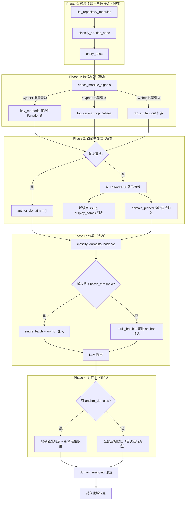
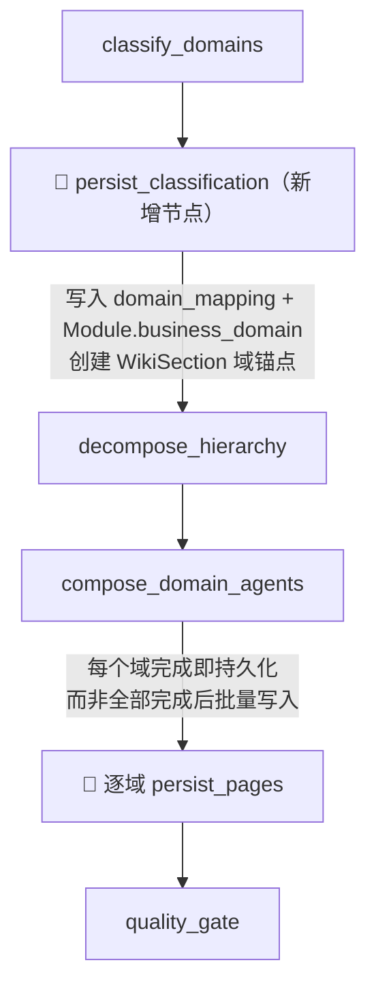

# Agent Wiki 质量修复 + 域分类 v2 统一提案

**Created:** 2026-05-12  
**Last Updated:** 2026-05-12 (slug 全链路 + 质量修复已实现)  
**Status:** Task A-F ✅ / Task G 核心已实现（slug + 质量 + 持久化） / Task H 待实现（Dashboard API/UI）  
**Priority:** P0  
**Type:** 统一提案（Spec）

---

## 1. 背景

### 1.1 已解决的问题（Task A-F）

2026-05-12 完成了 Agent 管线首次端到端调试验证，发现并修复了阻塞性 Bug（环境变量加载、LangGraph 注解反射、字段名兼容），随后完成以下工作：

| Task | 内容 | 状态 |
|------|------|------|
| A | Wiki 树路径对齐 + quality_gate heading 修复 | ✅ 已实现（待部署验证） |
| B | 内容质量提升（Prompt + baseline + 图分解注入） | ✅ 已实现（待部署验证） |
| C | Topic 页面支持（_maybe_split 自动拆分） | ✅ 已实现（待部署验证） |
| D | Robustness 加固（grep 上限、env fallback、FIFO 优化） | ✅ 已实现 |
| E | L2 业务流文档生成 | P3 推迟 |
| F | Explore/Write 代码分离 | ✅ 核心已实现（P3 优化项推迟） |

详细实施记录见 §7。

### 1.2 当前核心问题：域分类质量

域分类管线存在三个严重问题，按影响程度排序：

**P1: 域名不稳定** — 每次重新生成域名都变（名称变体、模块漂移、域数量波动共存）。根因是 LLM 每次从零创建域，没有持久化状态。

**P2: 分类不准确** — 模块被分到错误的域。根因是 LLM 输入信号太弱（`_module_summary` 多为空，只靠类名+路径猜测）。

**P3: 用户无法手动修正** — 分类结果只能全量重新生成，用户无法微调单个模块的归属。

---

## 2. 域分类 v2 设计

### 2.1 设计目标

混合模式：首次自动分类 → 用户通过 Dashboard 微调 → 后续生成维持稳定。

### 2.2 整体架构



### 2.3 域双标识体系（slug + display_name）

**问题**: 中文域名在 URL 中需要 percent-encoding，导致路由、API、日志都不友好。

**方案**: 每个域同时具有 ASCII 安全的 `slug` 和中文 `display_name`。

| 属性 | 用途 | 示例 |
|------|------|------|
| `slug` | URL 路径、API 参数、graph key、内部引用 | `gift-system` |
| `display_name` | Dashboard 展示、wiki 页面标题 | `礼物系统` |

**路径格式变化**:
```
旧: /__domains__/礼物系统/_overview
新: /__domains__/gift-system/_overview

WikiSection.slug = "gift-system"
WikiSection.title = "礼物系统"（展示用）
```

**slug 生成**: 由 LLM 在分类时同时输出 slug 和 display_name。三层防护保证一致性：

1. **锚点约束**（根本解决）：首次运行后 slug 持久化为锚点，后续运行 prompt 注入已有 `(slug, display_name)` 对，LLM 直接复用
2. **输出校验**：`_normalize_slug()` 确保 kebab-case 规范，非法字符自动修复
3. **Stabilizer 双字段匹配**：slug 精确匹配 > display_name 相似度匹配 > slug 相似度匹配

**子主题也使用 slug**: HierarchicalDecomposer 的 DomainNode 增加 slug 字段，子主题路径统一为 ASCII。

**锚点持久化时机**: 域锚点通过 TreeLinker 创建 WikiSection 时自动持久化（slug + title 同时写入），不需要额外的持久化步骤。`persist_domain_anchors` 方法仅供 Dashboard 手动创建/预定义域时使用。

**domain_mapping 格式兼容**: 保持 `domain_mapping: dict[str, list[tuple[str, str]]]` 原有格式不变（key 从中文名改为 slug），额外在 pipeline state 中添加 `domain_display_names: dict[str, str]`（slug → 中文名映射），最小化下游组件改动。

### 2.4 信号增强（Phase 1）

**位置**: `wiki/nodes/classify.py` 中新增 `enrich_module_signals()`，在 `classify_entities_node` 之后执行。

**3 个批量 Cypher 查询**:

```cypher
-- Q1: 每个模块的前 5 个 Function 名称
MATCH (m:Module)-[:CONTAINS*1..2]->(f:Function)
WHERE m.repository IN $repos AND m.name IN $names
RETURN m.name AS module_name, m.repository AS repo,
       collect(DISTINCT f.name)[0..5] AS key_methods

-- Q2: 模块间耦合（Function CALLS 上卷 → callees + fan_out）
MATCH (m1:Module)-[:CONTAINS*1..3]->(f1:Function)
      -[:CALLS]->(f2:Function)<-[:CONTAINS*1..3]-(m2:Module)
WHERE m1.repository IN $repos AND m1 <> m2
RETURN m1.name AS source, m1.repository AS repo,
       collect(DISTINCT m2.name)[0..5] AS callees,
       count(DISTINCT m2) AS fan_out

-- Q3: 反向耦合（callers + fan_in）
MATCH (m1:Module)-[:CONTAINS*1..3]->(f1:Function)
      -[:CALLS]->(f2:Function)<-[:CONTAINS*1..3]-(m2:Module)
WHERE m2.repository IN $repos AND m1 <> m2
RETURN m2.name AS target, m2.repository AS repo,
       collect(DISTINCT m1.name)[0..5] AS callers,
       count(DISTINCT m1) AS fan_in
```

**增强后的模块描述**（LLM 可见）:
```json
{
  "repository": "ultron",
  "name": "GiftOrderService",
  "summary": "methods: sendGift, createOrder, cancelOrder, queryOrderList, refundGift",
  "path": "src/.../GiftOrderService.java",
  "callers": ["GiftController", "GiftMoaService", "GiftScheduleTask"],
  "callees": ["OrderRepository", "PaymentService", "GiftInventory"],
  "fan_in": 8,
  "fan_out": 5
}
```

**设计决策**:
- `key_methods` 放入 `summary` 字段（summary 为空时自动 fallback），减少 prompt 模板改动
- `fan_in > 15` 的模块附加 `[high-fanin]` 标签，引导 LLM 将其归入基础设施域
- 查询结果缓存在 pipeline state 中，可被 HierarchicalDecomposer 复用（共享 `ModuleEnricher`）

### 2.5 锚定域机制（Phase 2）

**域锚点来源**: FalkorDB 中 `WikiSection(section_type='business_domain')` 的 `slug` + `title` 字段。

```cypher
MATCH (s:WikiSection {section_type: 'business_domain', business_id: $bid})
RETURN s.slug AS slug, s.title AS display_name
```

首次运行查询结果为空，`anchor_domains = []`。

**domain_pinned 机制**:

Module 节点新增属性：
- `domain_pinned: boolean` — 用户已锁定
- `business_domain: string` — 当前归属域 slug（已有属性，值改为 slug）

```python
# classify_domains_node 中
for mod in filtered_modules:
    if mod.properties.get("domain_pinned"):
        pinned_domain = mod.properties.get("business_domain", "")
        if pinned_domain:
            pinned_mapping.setdefault(pinned_domain, []).append((repo, name))
            continue
    unpinned_modules.append(mod)
```

### 2.6 Prompt 改造（Phase 3）

**语言统一**: 所有分类 prompt 统一为中文指令 + 中文域名。消除当前英文/中文/kebab-case 混用。

**anchor_domains 注入**（后续运行时）:
```
已有业务域（必须使用完全一致的 slug 和 display_name）:
  - gift-system: 礼物系统
  - im-messaging: IM消息
  - user-relations: 用户关系

仅当模块明确不属于任何已有域时，才允许创建新域。
新域的 slug 必须为英文 kebab-case（1-3 单词），display_name 为简短中文。
```

**输出格式改造**:
```json
{
  "gift-system": {
    "display_name": "礼物系统",
    "modules": [["ultron", "GiftOrderService"], ...]
  }
}
```

**业务上下文种子**: 从 `WikiSpace.description` 或配置注入一句业务描述（如"该项目是 IM 社交应用"）。为空时不注入，行为降级。

**共享基础设施**: 不再使用 `__infrastructure__` 作为特殊 catch-all，改为正式命名域（如 slug: `shared-infrastructure`, display_name: `共享基础设施`）。

**增量分类支持**: `classify_incremental` 方法同样接收 `anchor_domains` 参数。新模块优先分配到已有域，anchor 机制天然适配增量场景。

**per-repo BusinessDomainPlanner 也注入 anchor**: multi-batch 路径下每个 repo 的 `BusinessDomainPlanner._build_prompt` 同样注入 anchor_domains，确保子批次间域名一致。

### 2.7 200 Cap 优化

**去掉硬 Cap**: 不再在 `classify_domains_node` 中截断到 200。

**全量模块进入 multi-batch**: 利用已有 `batch_threshold=100` + `sub_batch_size=80`，全部 500+ 模块分批分类。

**每个子批次注入 anchor_domains**: 子批次间域名通过 anchor 约束天然一致，消除当前 lightweight merge 的不可靠性。

### 2.8 Stabilizer 改造（Phase 4）

**双字段匹配**:
1. slug 完全一致 → 直接复用（最高优先级）
2. display_name 相似度 ≥ 0.85 → 复用已有 slug
3. slug 相似度 ≥ 0.85 → 复用已有 slug
4. 均不匹配 → 作为新域保留

**有锚点时简化**: 大部分域直接精确匹配锚点，仅新域走相似度逻辑。

### 2.9 HierarchicalDecomposer 协同

**slug 扩展**: `DomainNode` 增加 `slug` 字段，子主题路径也使用 slug。

**信号复用**: Phase 1 信号增强结果缓存在 state 中，`ModuleDependencyGraph.build()` 和 `classify_domains_node` 共享同一份数据，避免重复 Cypher 查询。

**父域名称协调**: HierarchicalDecomposer 的 prompt 注入父域 `display_name`，子主题命名与父域风格一致。

### 2.10 管线中间持久化

**问题**: 当前管线全部 14 个节点完成后才持久化到 FalkorDB。任何节点失败（尤其是最耗时的 `compose_domain_agents`）导致全部工作丢失，需从头重来。

**改造方案**: 在管线关键节点后增加中间持久化。



**新增管线节点**: `persist_classification_node`

位于 `classify_domains` 之后、`decompose_hierarchy` 之前。职责：
1. 写入 `domain_mapping`（slug → modules）到 state 的同时，更新 FalkorDB 中每个 Module 的 `business_domain` 属性
2. 创建/更新 `WikiSection(section_type='business_domain')` 节点（域锚点 slug + title）
3. 后续步骤失败时，域分类结果已持久化——Dashboard 可查、锚点已保存、下次运行可复用

**compose_domain_agents 逐域持久化**:

当前 `compose_domain_agents_node` 为所有域的 Agent 任务并发执行，全部完成后返回 pages 列表。改为：每个域的 Agent 任务完成后立即 `persist_pages_to_graph` 该域的页面。

效果：10 个域中 8 个成功、2 个失败时，8 个域的 wiki 页面已经可用。

**LangGraph Checkpointer 升级**:

将默认 `MemorySaver` 改为 `AsyncSqliteSaver`（本地 SQLite 文件）。管线崩溃后可从最后成功的节点恢复，无需重跑已完成的节点。

**失败恢复策略**:

三种恢复模式，由 Dashboard 或 API 触发：

| 模式 | 触发 | 行为 | 适用场景 |
|------|------|------|---------|
| **断点恢复** | `POST /{bid}/resume` | 从 LangGraph checkpoint 恢复，跳过已完成节点 | 管线崩溃后继续 |
| **单域重生成** | `POST /{bid}/domains/{slug}/regenerate` | 仅重新运行该域的 Agent + persist | 某个域内容不满意 |
| **全量重执行** | `POST /{bid}/regenerate` | 清除 checkpoint，全部节点重跑 | 常规定期更新 |

**全量重执行的两种子模式**:

| 子模式 | 参数 | 锚点 | domain_pinned | 效果 |
|--------|------|------|---------------|------|
| **保持锚点**（默认） | `reset_anchors=false` | 保留：LLM 受锚点约束 | 保留：用户调整持续 | 分类稳定，内容刷新 |
| **完全重置** | `reset_anchors=true` | 清除：LLM 自由分类 | 清除：全部模块重新分类 | 从零开始，域结构可能完全改变 |

默认保持锚点——适合代码变更后的定期更新（新模块分入已有域，老模块位置不变）。完全重置用于"域结构需要重新规划"的极端场景。

**LangGraph Checkpoint 管理**:

- 使用 `AsyncSqliteSaver`，checkpoint 存储在本地 SQLite
- 每个 `business_id` 维护一个 `thread_id = f"{business_id}_wiki_gen"`
- 成功完成后自动清除 checkpoint（避免累积）
- resume API 检查 checkpoint 是否存在，存在则恢复，否则提示"无可恢复的任务"

**Checkpoint 信息查询 API**:

```
GET /api/v1/wiki/{business_id}/checkpoint
```

返回：
```json
{
  "exists": true,
  "thread_id": "ultron_wiki_gen",
  "last_node": "compose_domain_agents",
  "created_at": "2026-05-12T10:30:00Z",
  "completed_nodes": ["list_repository_modules", "classify_entities", "classify_domains", "persist_classification", "decompose_hierarchy"],
  "pending_nodes": ["compose_domain_agents", "quality_gate", "build_tree"]
}
```

**Checkpoint 清除 API**:

```
DELETE /api/v1/wiki/{business_id}/checkpoint
```

手动清除 checkpoint，用于放弃未完成的管线恢复（如知道数据已损坏不想继续）。

**Dashboard Checkpoint 面板**:

在生成控制区域显示 checkpoint 状态：

| 状态 | UI 展示 | 操作 |
|------|---------|------|
| 无 checkpoint | "无待恢复任务" | 仅显示"全量生成"按钮 |
| 有 checkpoint | 黄色提示条：显示中断节点、完成比例、时间 | "恢复执行"按钮 + "放弃(清除)"按钮 |

```
⚠️ 发现未完成的管线任务
中断位置: compose_domain_agents (5/8 节点已完成)
中断时间: 2026-05-12 10:30:00

[恢复执行]  [放弃并清除]
```

**改动文件**:
| 文件 | 改动 |
|------|------|
| `wiki/pipeline_graph.py` | 新增 `persist_classification_node`；默认使用 `AsyncSqliteSaver` |
| `wiki/nodes/classify.py` | 增加中间持久化逻辑 |
| `wiki/nodes/domain_compose.py` | 逐域持久化（每个域完成即写入） |
| `wiki/service.py` | 适配恢复策略 + 全量重执行子模式 |
| `api/routes/wiki_page_routes.py` | 新增 resume / regenerate API |

---

## 3. Dashboard 域调整机制

### 3.1 分层架构

```
api/routes/wiki_page_routes.py  → 路由 + 参数校验
wiki/service.py                 → 业务逻辑编排
store/falkordb_wiki.py          → 所有 Graph 读写操作
```

所有 API 以 `business_id` 为顶级作用域，`slug` 为域标识。内部 `business_id → repos` 映射对用户完全透明。

### 3.2 REST API

| 操作 | Method | Path | Body |
|------|--------|------|------|
| 域列表 | `GET` | `/api/v1/wiki/{business_id}/domains` | — |
| 域下模块 | `GET` | `/api/v1/wiki/{business_id}/domains/{slug}/modules` | — |
| 移动模块 | `PATCH` | `/api/v1/wiki/{business_id}/modules/{module_uid}/domain` | `{target_slug}` |
| 重命名域 | `PATCH` | `/api/v1/wiki/{business_id}/domains/{slug}` | `{new_slug, new_display_name}` |
| 解锁模块 | `DELETE` | `/api/v1/wiki/{business_id}/modules/{module_uid}/domain-pin` | — |
| 删除空域 | `DELETE` | `/api/v1/wiki/{business_id}/domains/{slug}` | — |
| 单域重生成 | `POST` | `/api/v1/wiki/{business_id}/domains/{slug}/regenerate` | — |
| 断点恢复 | `POST` | `/api/v1/wiki/{business_id}/resume` | — |
| 全量重执行 | `POST` | `/api/v1/wiki/{business_id}/regenerate` | `{reset_anchors?: bool}` |
| 查询 checkpoint | `GET` | `/api/v1/wiki/{business_id}/checkpoint` | — |
| 清除 checkpoint | `DELETE` | `/api/v1/wiki/{business_id}/checkpoint` | — |

删除空域：仅当域下无模块时允许删除，清理 WikiSection + WikiPage。已有模块的域不允许直接删除（需先移动模块）。

### 3.3 存储层新增方法（`store/falkordb_wiki.py`）

| 方法 | 职责 |
|------|------|
| `list_domains(business_id)` | 查询域列表（slug + display_name + module_count） |
| `list_domain_modules(business_id, slug)` | 查询域下模块（含 pinned 状态） |
| `move_module_domain(module_uid, target_slug)` | 更新 business_domain + 设置 domain_pinned |
| `rename_domain(business_id, old_slug, new_slug, new_display_name)` | 批量更新模块 + WikiSection + WikiPage 路径 |
| `clear_domain_pin(module_uid)` | 清除 domain_pinned |
| `load_anchor_domains(business_id)` | 查询域锚点 |
| `persist_domain_anchors(business_id, anchors)` | 持久化域锚点到 WikiSection（供 Dashboard 预创建域用） |
| `delete_empty_domain(business_id, slug)` | 删除空域（WikiSection + WikiPage） |
| `get_checkpoint_info(business_id)` | 查询 checkpoint 状态（从 AsyncSqliteSaver） |
| `delete_checkpoint(business_id)` | 清除 checkpoint |

### 3.4 Dashboard UI

**域管理页面** (`/wiki/domains`):

| 视图 | 功能 |
|------|------|
| **域列表** | 展示 display_name、slug、模块数；操作：重命名、删除空域、单域重生成 |
| **域详情** | 域下模块列表 + pinned 状态；操作：移动模块、锁定/解锁 |
| **生成控制** | 全量重生成（保持锚点/完全重置）、断点恢复、生成进度实时展示 |

**生成进度展示**: Dashboard 通过 SSE 或轮询展示管线节点执行状态：

```
classify_entity_roles ✅ (2.1s)
graph_decompose      ✅ (5.3s)
classify_domains     ✅ (12.7s) → 15 个域
persist_classification ✅ (1.2s)
decompose_hierarchy  ✅ (8.4s)
compose_domain_agents ⏳ 8/15 域完成 (进行中...)
  ├── gift-system      ✅
  ├── im-messaging     ✅
  ├── user-relations   ⏳
  └── ...
```

### 3.5 触发脚本更新

`scripts/trigger_wiki_generate.sh` 新增命令支持：

```bash
# 现有命令（保持兼容）
./trigger_wiki_generate.sh --business-id ultron

# 新增：断点恢复
./trigger_wiki_generate.sh --resume --business-id ultron

# 新增：单域重生成
./trigger_wiki_generate.sh --regenerate-domain gift-system --business-id ultron

# 新增：全量重执行（完全重置锚点）
./trigger_wiki_generate.sh --reset-anchors --business-id ultron

# 新增：查看域列表
./trigger_wiki_generate.sh --list-domains --business-id ultron

# 新增：移动模块
./trigger_wiki_generate.sh --move-module MODULE_UID --to-domain gift-system --business-id ultron
```

---

## 4. 实施任务清单

| # | 任务 | 优先级 | 状态 | 改动文件 | 依赖 |
|---|------|--------|------|---------|------|
| T1 | 域双标识体系：slug + display_name 全链路传播 | P0 | ✅ | `wiki/path_conventions.py`, `wiki/cross_repo_domain_planner.py`, `wiki/nodes/classify.py`, `wiki/nodes/utils.py`, `wiki/nodes/domain_compose.py`, `wiki/domain_doc_agent.py` | — |
| T2 | 存储层新增域管理方法（7 个） | P0 | 🔲 待实现 | `store/falkordb_wiki.py` | T1 |
| T3 | 信号增强：`enrich_module_signals` + 3 个 Cypher 查询 | P1 | ✅ | `wiki/nodes/classify.py`, `wiki/cypher_queries.py`, `wiki/module_enricher.py` | — |
| T4 | 锚定域加载 + domain_pinned 跳过 | P1 | ✅ | `wiki/nodes/classify.py`, `wiki/persistence.py` | T1, T2 |
| T5 | Prompt 改造：anchor 注入 + slug 双输出 + 代码片段要求 | P1 | ✅ | `wiki/cross_repo_domain_planner.py`, `wiki/unified_prompt_templates.py` | T3, T4 |
| T6 | DomainStabilizer 双字段匹配 + slug normalize | P1 | ✅ | `wiki/domain_stabilizer.py`, `wiki/nodes/classify.py` | T1 |
| T7 | 去掉 200 Cap + 子批次 anchor 注入 | P1 | ✅ | `wiki/nodes/classify.py`, `wiki/cross_repo_domain_planner.py` | T5 |
| T8 | 管线中间持久化：`persist_classification_node` + 逐域 persist | P1 | ✅ | `wiki/pipeline_graph.py`, `wiki/nodes/persist_classification.py`, `wiki/nodes/domain_compose.py` | T1, T4 |
| T9 | LangGraph Checkpointer 升级为 AsyncSqliteSaver | P2 | ✅ | `wiki/pipeline_graph.py`, `wiki/persistence.py` | — |
| T10 | Dashboard API（11 个端点：域管理 7 + 恢复/重执行 2 + checkpoint 查询/清除 2） | P1 | 🔲 待实现 | `api/routes/wiki_page_routes.py`, `wiki/service.py` | T2, T8 |
| T11 | Dashboard UI：域列表 + 域详情 + checkpoint 面板 + 恢复/重生成/清除操作 + 生成进度展示 | P2 | 🔲 待实现 | `dashboard/src/` | T10 |
| T12 | `trigger_wiki_generate.sh` 支持新命令：resume / regenerate-domain / reset-anchors | P1 | 🔲 待实现 | `scripts/trigger_wiki_generate.sh` | T10 |
| T13 | 分类稳定性回归测试 | P1 | ✅ | `tests/wiki/` | T5, T6 |

### 质量修复（已完成，非原计划任务）

| 修复 | 内容 | 状态 |
|------|------|------|
| Q1 | 质量退出条件分级（perfect / acceptable / max-iter 三级） | ✅ |
| Q2 | `citation_density` 纳入内联代码引用计算 | ✅ |
| Q3 | Prompt 强制要求 ≥3 代码片段 | ✅ |
| Q4 | Agent Compose 作为默认管线，移除 `compose_bottomup` | ✅ |
| Q5 | `source_locations` 同时附加到 domain_overview 和 topic 页面 | ✅ |

### 风险评估

| 风险 | 影响 | 缓解 |
|------|------|------|
| 信号增强 Cypher 性能 | 分类变慢 | 3 查询合并 UNION；`repository` 索引过滤 |
| LLM 不遵循 slug 格式 | 输出解析失败 | `_normalize_slug` 兜底 + JSON schema 校验 |
| slug 引入后旧 wiki 路径不兼容 | 前端 404 | 不迁移，重新生成即可 |

---

## 5. 历史遗留已知问题

| Issue | 描述 | 状态 |
|-------|------|------|
| #003 | HierarchicalDecomposer 批次分解超时 | 已缓解（timeout=120），P2 |
| #004 | Qwen3 思维链导致分类慢 | 待调查，P2 |
| #005 | LLM 幻觉 | L1 已修复；L2-3 推迟 |
| #006 | `_enrich_leaf_context` UID/name 不匹配 | 已绕过（旧管线废弃） |
| #007 | Phase1/2 排除不一致 | 已绕过（旧管线废弃） |
| #008 | Agent 管线质量低于 POC | ✅ 已修复 |

---

## 6. 已推迟事项

- **Task E: L2 业务流文档生成** — P3，待 L1 质量稳定后启动
- **Task F P3 优化** — 工具动态解锁、baseline PageRank 排序
- **Anti-Hallucination Layer 2-3** — 待发现新幻觉问题时启动
- **多视图 Wiki 结构** — 见 `specs/2026-05-12-multi-view-wiki-structure-idea.md`
- **域概览/主题内容定位改造** — 见同上文档
- **Agent 组件抽象化** — 见同上文档

---

## 7. 已完成工作详细记录

### Task A: Wiki 树路径对齐 + quality_gate heading 修复 — ✅

- [x] `wiki/path_conventions.py`: 路径常量和辅助函数
- [x] `wiki/domain_doc_agent.py`: path 使用 `domain_overview_path(key)`
- [x] `wiki/nodes/domain_compose.py`: error placeholder 路径同步
- [x] `wiki/tree_linker.py`: Agent 页面存在则跳过合成
- [x] `wiki/quality_evaluator.py`: heading marker 扩展 + Mermaid 检测
- [ ] 待部署验证：前端加载 + heal 比例

### Task B: 内容质量提升 — ✅

- [x] Prompt 输出规范 + strip_agent_artifacts 正则覆盖
- [x] baseline 改造：500 字摘要 → 拓扑关系 + 一行描述
- [x] 图分解拓扑注入 `_build_baseline()`
- [ ] 待部署验证：citation_density ≥ 0.8、页面长度 ≥ 5000

### Task C: Topic 页面支持 — ✅

- [x] `_maybe_split()` + `domain_topic_path()` + page_type=topic
- [ ] 待部署验证：TreeLinker 子页面链接

### Task D: Robustness 加固 — ✅

- [x] grep_code 文件上限、env fallback、WorkingMemory FIFO 优化

### Task F: Explore/Write 代码分离 — ✅ 核心

- [x] `explore()` + `write()` + WorkingMemory + quality loop
- [x] `generate()` 向后兼容

### 其他已完成

- [x] Domain Agent 弹性超时（per-phase explore/write timeout + write retry）
- [x] Code Linking（WorkingMemory.discovered_entity_uids + Cypher uid 字段 + SOURCE_ENTITY 边）
- [x] `_attach_domain_sources` merge（非 overwrite）covered_entity_uids

---

## 8. 已清理的文档

| 文件 | 处理 |
|------|------|
| `plans/2026-05-11-agent-driven-wiki-implementation.md` | 已删除 |
| `plans/2026-05-11-incremental-wiki-update.md` | 已删除 |
| `plans/2026-05-12-agent-l1-quality-fix-and-robustness.md` | 已删除 |
| `plans/2026-05-12-l2-business-flow-and-hardening.md` | 已删除 |
| `specs/2026-05-11-agent-wiki-implementation-proposal.md` | 已删除 |
| `specs/2026-05-11-incremental-wiki-update-design.md` | 已删除 |
| `specs/2026-05-11-agent-driven-business-wiki-design.md` | 已删除 |
| `DEEP_ANALYSIS_20260502_101930_code_audit_and_competitor_gap.md` | 已删除 |
| `KNOWN-ISSUES.md` | 已删除 |
| `specs/2026-05-12-domain-classification-accuracy-and-adjustment.md` | 已删除 |
| `specs/2026-05-12-explore-write-separation-design.md` | 已删除 |
| `specs/2026-05-12-domain-retry-and-code-linking-design.md` | 已删除 |
| `plans/2026-05-12-explore-write-separation.md` | 已删除 |
| `plans/2026-05-12-domain-retry-and-code-linking.md` | 已删除 |
| `plans/2026-05-12-agent-wiki-quality-and-tree-fix.md` | 已删除 |
