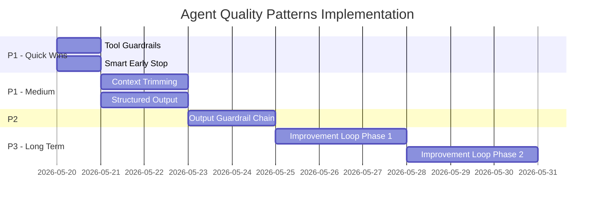

# Agent Quality Patterns Design — 渐进式增强

> Date: 2026-05-19
> Status: Draft / Awaiting Approval
> Approach: 方案 A（渐进式增强，逐层叠加到现有架构）

## 1. 目标

借鉴 OpenAI Agents SDK 的成熟模式，在**不更换框架**的前提下，通过 6 个独立增强来提升 Wiki 生成质量。

## 2. 设计原则

- 每个 Pattern 独立实现、独立测试
- 直接替换原有实现（无 feature flag）
- 确保代码质量、测试覆盖
- 不引入新的外部依赖

## 3. Pattern 设计

---

### 3.1 Tool Guardrails（工具护栏）

**改动文件**: `wiki/agents/base_agent.py`

**设计**: 在 `ToolRegistry.dispatch()` 前后添加 pre/post hooks

```python
class ToolGuardrail(Protocol):
    async def pre_call(self, tool_name: str, args: dict) -> dict | None:
        """Return None to reject, modified args to proceed."""
        ...

    async def post_call(self, tool_name: str, args: dict, result: str) -> str:
        """Transform or validate tool result before it enters memory."""
        ...

class DefaultToolGuardrail:
    """Built-in guardrails for common quality issues."""

    MAX_RESULT_CHARS = 8000

    async def pre_call(self, tool_name: str, args: dict) -> dict | None:
        if tool_name == "query_call_chain" and not args.get("method_name"):
            return None
        if tool_name == "grep_code" and not args.get("pattern"):
            return None
        return args

    async def post_call(self, tool_name: str, args: dict, result: str) -> str:
        if not result or not result.strip():
            return f"[EMPTY_RESULT] No data returned for {tool_name}"
        if len(result) > self.MAX_RESULT_CHARS:
            return result[: self.MAX_RESULT_CHARS] + "\n[TRUNCATED]"
        return result
```

**集成点**: `ToolRegistry.dispatch()` 内部调用 guardrail chain

**集成方式**: 直接替换 `ToolRegistry.dispatch()` 和 `WikiPageAgent._execute_tool()` 中的 dispatch 逻辑

---

### 3.2 Structured Output（结构化输出）

**改动文件**: `wiki/page_agent.py`, `wiki/agents/doc_orchestrator.py`

**设计**: 在 write 阶段使用 JSON Schema 约束 LLM 输出格式

```python
class WikiSection(BaseModel):
    heading: str
    content: str
    code_refs: list[str] = []

class WikiPageOutput(BaseModel):
    title: str
    summary: str
    sections: list[WikiSection]
    modules_covered: list[str]
    dependencies_mentioned: list[str] = []

# write phase:
response = await self._llm.generate(
    prompt=user_prompt,
    system=AGENT_WRITE_SYSTEM,
    response_format={"type": "json_schema", "json_schema": {
        "name": "wiki_page",
        "schema": WikiPageOutput.model_json_schema(),
        "strict": True,
    }},
)
page_data = WikiPageOutput.model_validate_json(response)
markdown = render_wiki_page(page_data)
```

**降级策略**: 如果 LLM 不支持 `response_format`（某些模型），fallback 到当前纯文本生成

**集成方式**: 直接替换 write 阶段的 LLM 调用方式

**质量改进**:
- `modules_covered` 可自动与 expected_modules 对比检测缺失
- `code_refs` 可自动送入 code_block_verifier
- 强制结构化避免格式混乱

---

### 3.3 Output Guardrail（输出质量门控集中化）

**改动文件**: 新建 `wiki/agents/output_guardrail.py`

**设计**: 将分散的质量检查逻辑集中为统一的 guardrail chain

```python
class OutputCheck(Protocol):
    name: str
    async def check(self, page_content: str, context: dict) -> CheckResult: ...

@dataclass
class CheckResult:
    passed: bool
    score: float
    issues: list[str]

class OutputGuardrailChain:
    def __init__(self, checks: list[OutputCheck]):
        self._checks = checks

    async def evaluate(self, page_content: str, context: dict) -> GuardrailResult:
        results = await asyncio.gather(
            *(c.check(page_content, context) for c in self._checks)
        )
        return GuardrailResult(
            passed=all(r.passed for r in results),
            details={r.name: r for r in results},
        )

# Built-in checks:
class FormatCheck(OutputCheck):
    """Validate Markdown structure, heading levels, code block syntax."""

class CoverageCheck(OutputCheck):
    """Compare modules_covered vs expected_modules."""

class CodeRefCheck(OutputCheck):
    """Verify code references exist in the graph (lightweight)."""

class LengthCheck(OutputCheck):
    """Ensure page is within reasonable length bounds."""
```

**集成点**: `DomainDocAgent.generate_with_iterations()` 的 evaluate 步骤

**集成方式**: 直接替换 `DomainDocAgent.generate_with_iterations()` 中分散的质量检查

---

### 3.4 Context Trimming（上下文压缩）

**改动文件**: `wiki/page_agent.py` (explore 阶段的 messages 管理)

**设计**: 当 explore 阶段的 messages 接近 context window 时，压缩早期结果

```python
class ContextManager:
    def __init__(self, max_context_tokens: int, keep_recent_rounds: int = 3):
        self._max_tokens = max_context_tokens
        self._keep_recent = keep_recent_rounds

    def trim_messages(self, messages: list[dict], current_round: int) -> list[dict]:
        """Trim messages to fit within context window.

        Strategy:
        - Always keep system prompt (messages[0])
        - Always keep most recent N rounds fully
        - Compress older tool results to summaries
        """
        estimated_tokens = self._estimate_tokens(messages)
        if estimated_tokens <= self._max_tokens * 0.8:
            return messages

        trimmed = [messages[0]]  # system prompt
        old_boundary = self._find_round_boundary(messages, current_round - self._keep_recent)

        for msg in messages[1:old_boundary]:
            if msg.get("role") == "tool":
                trimmed.append({
                    "role": "tool",
                    "tool_call_id": msg["tool_call_id"],
                    "content": self._summarize(msg["content"]),
                })
            else:
                trimmed.append(msg)

        trimmed.extend(messages[old_boundary:])
        return trimmed

    def _summarize(self, content: str) -> str:
        if len(content) <= 500:
            return content
        return content[:200] + "\n...[compressed]...\n" + content[-200:]
```

**集成点**: `WikiPageAgent.explore()` 每轮开始前调用

**集成方式**: 替换 `explore()` 中 `len(messages) > 30` 的粗暴截断为渐进式压缩

---

### 3.5 Smart Early Stop（智能提前终止）

**改动文件**: `wiki/page_agent.py`

**设计**: 当 explore 连续多轮未获取有价值新信息时提前终止

```python
class EarlyStopDetector:
    def __init__(self, max_empty_rounds: int = 2):
        self._max_empty = max_empty_rounds
        self._consecutive_empty = 0

    def should_stop(self, round_results: list[str]) -> bool:
        """Check if this round produced meaningful new information."""
        meaningful = [r for r in round_results if not r.startswith("[EMPTY_RESULT]")]
        if not meaningful:
            self._consecutive_empty += 1
        else:
            self._consecutive_empty = 0
        return self._consecutive_empty >= self._max_empty

    def reset(self):
        self._consecutive_empty = 0
```

**集成点**: `WikiPageAgent.explore()` 的 round loop 末尾

**集成方式**: 直接嵌入 `explore()` round loop 末尾，替代仅靠 `max_rounds` 硬性截止

---

### 3.6 Agent Improvement Loop（持续改进飞轮）

**改动文件**: 新建 `wiki/quality_trace.py`, `wiki/quality_evaluator.py`

**设计**: 记录生成 trace，收集反馈，用于改进策略

```
┌────────────────────────────────────────────────┐
│                Improvement Loop                  │
│                                                  │
│  Generate → Trace → Feedback → Eval → Optimize  │
│     ↑                                    │       │
│     └────────────────────────────────────┘       │
└────────────────────────────────────────────────┘
```

#### 3.6.1 Trace Collection

```python
@dataclass
class AgentTrace:
    domain: str
    page_title: str
    timestamp: datetime
    explore_rounds: int
    tools_called: list[ToolCallRecord]
    quality_score: float
    modules_expected: list[str]
    modules_covered: list[str]
    context_gaps: int
    generation_time_ms: int

class TraceCollector:
    async def record(self, trace: AgentTrace) -> None:
        """Persist trace to FalkorDB (AgentTrace node) or file."""
        ...
```

#### 3.6.2 Feedback Collection

```python
class FeedbackSource(Protocol):
    async def collect(self, page_id: str) -> list[Feedback]: ...

class QualityScoreFeedback(FeedbackSource):
    """Auto-generated from evaluate_quality()."""

class UserEditFeedback(FeedbackSource):
    """Detected when user edits a wiki page (diff analysis)."""

class ContextGapFeedback(FeedbackSource):
    """Count CONTEXT_GAP markers in final page."""
```

#### 3.6.3 Eval Set Generation

```python
class EvalSetGenerator:
    async def generate(self, traces: list[AgentTrace]) -> EvalSet:
        """Group traces into good (score >= 0.8) and bad (score < 0.5) examples.

        Extract common patterns:
        - Good: which tools were used, what exploration depth, what prompts worked
        - Bad: what was missing, what went wrong
        """
        ...
```

#### 3.6.4 Strategy Optimization

```python
class StrategyOptimizer:
    """Adjust agent parameters based on eval results."""

    async def suggest_improvements(self, eval_set: EvalSet) -> list[Suggestion]:
        """Analyze patterns and suggest:
        - Prompt adjustments (explore instructions, write instructions)
        - Tool usage hints (which tools produce best results for which domains)
        - Exploration depth tuning (some domains need more rounds)
        """
        ...
```

**实现分期**:
- Phase 1: Trace Collection（自动记录，无需人工干预）
- Phase 2: Feedback Collection（自动质量分 + 用户编辑检测）
- Phase 3: Eval + Optimization（需要足够 trace 数据后才有意义）

**集成方式**: Phase 1 (Trace) 直接写入生成流程，无条件记录

---

## 4. 实现顺序



**建议实现顺序**:
1. Tool Guardrails + Smart Early Stop（最快见效，1 天）
2. Context Trimming + Structured Output（2 天）
3. Output Guardrail Chain（1 天）
4. Improvement Loop Phase 1（3 天）

## 5. 集成方式

所有 Pattern 直接替换原有实现，无 feature flag。通过充分的单元测试确保行为正确。

## 6. 测试策略

每个 Pattern 独立测试：

| Pattern | 测试方式 |
|---------|---------|
| Tool Guardrails | Unit test: 验证 pre/post hooks 正确拦截/转换 |
| Structured Output | Unit test: 验证 schema 生成、fallback 降级 |
| Output Guardrail | Unit test: 各 Check 的通过/失败条件 |
| Context Trimming | Unit test: 验证压缩后 token 在限制内 |
| Smart Early Stop | Unit test: 连续空轮检测 |
| Improvement Loop | Integration test: trace 写入/读取 |

## 7. 不做什么

- ❌ 不迁移到 OpenAI Agents SDK
- ❌ 不修改 LangGraph pipeline
- ❌ 不改变 LLMPort 协议
- ❌ 不新增外部依赖
- ❌ 不影响现有 MCP 对外接口
