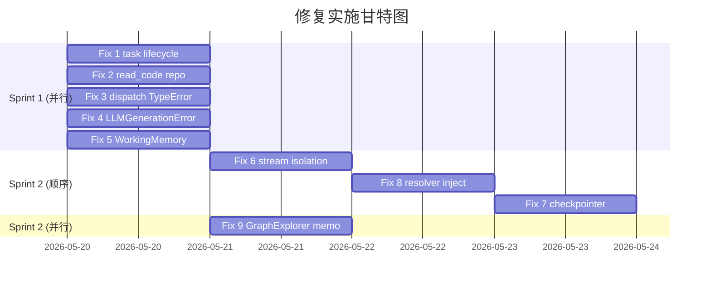

# 审计剩余问题修复设计

**Created:** 2026-05-20
**Status:** Approved
**Priority:** P2
**Type:** Bug Fix + Reliability Enhancement

---

## 背景

2026-05-20 深度审计发现 23 个后端 + 22 个前端问题。其中 12 项已即时修复（commit `4b7d3bb`）。本提案覆盖剩余 9 项需要更多上下文或结构性改动的问题。

---

## Sprint 1: 精确修复（独立，可并行）

### Fix 1: trigger_page_regeneration 生命周期管理

**文件:** `wiki/service.py` ~L1718-1752

**问题:** bare `asyncio.create_task` 无注册、无取消、无状态查询。进程关闭时任务被静默丢弃。

**方案:**
```python
# WikiService.__init__ 新增:
self._background_tasks: set[asyncio.Task] = set()

# _run_regeneration 包装:
task = asyncio.create_task(self._run_regeneration(...))
self._background_tasks.add(task)
task.add_done_callback(self._background_tasks.discard)

# shutdown 时（通过 AppContainer.shutdown 或 lifespan callback）:
for t in self._background_tasks:
    t.cancel()
await asyncio.gather(*self._background_tasks, return_exceptions=True)
```

**测试:** 验证 shutdown 时 pending tasks 被 cancel。

---

### Fix 2: read_code 仓库过滤

**文件:** `wiki/page_agent.py` ~L1071-1083

**问题:** `ENTITY_LOCATION_CY` 仅按 entity_name 查询，多仓库图中可能命中错误仓库的同名实体。

**方案:**
```python
# 修改 Cypher 查询添加 repository 约束:
_ENTITY_LOCATION_CY_REPO = """
MATCH (n {name: $name, repository: $repo})-[:DEFINED_IN]->(f:File)
RETURN n.name AS name, f.path AS file_path, n.start_line AS start, n.end_line AS end
LIMIT 1
"""
# 传入 self._repo_path 作为 $repo 参数
```

**测试:** mock 图中存在同名跨仓实体，验证只返回目标仓库的结果。

---

### Fix 3: ToolRegistry dispatch TypeError 吞噬

**文件:** `wiki/agents/base_agent.py` ~L107-111

**问题:** `TypeError` 被捕获后 fallback 为不带 ctx 的调用，可能掩盖工具函数内部真实 TypeError。

**方案:**
```python
import inspect

async def dispatch(self, tool_name, args, post_call=False, ctx=None):
    handler = self._handlers.get(tool_name)
    if handler is None:
        return {"error": f"unknown tool: {tool_name}"}, ...
    
    # 检查 handler 签名是否接受 ctx 参数
    sig = inspect.signature(handler)
    accepts_ctx = "ctx" in sig.parameters or any(
        p.kind == inspect.Parameter.VAR_KEYWORD for p in sig.parameters.values()
    )
    
    if ctx and accepts_ctx:
        result = await handler(**args, ctx=ctx)
    else:
        result = await handler(**args)
```

**测试:** 验证工具函数内部 TypeError 正常传播而不被吞噬。

---

### Fix 4: run_generation 空字符串 → 异常

**文件:** `wiki/agents/base_agent.py` ~L256-260

**问题:** LLM 失败时返回 `""`，调用方可能将空字符串视为成功。

**方案:**
```python
class LLMGenerationError(Exception):
    """Raised when the LLM fails to produce output."""
    pass

async def run_generation(self, ...):
    ...
    except Exception as exc:
        log.warning("generation_failed", exc_info=True)
        raise LLMGenerationError(f"LLM generation failed: {exc}") from exc
```

调用方需在 try/except 中处理 `LLMGenerationError`。影响点:
- `DocOrchestrator._generate_with_context()`
- `wiki/page_agent.py` 中 `write()` 方法
- `wiki/agents/doc_orchestrator.py` 中的 fallback 逻辑

**测试:** 验证 LLM 失败时抛出 LLMGenerationError，调用方正确 fallback。

---

### Fix 5: WorkingMemory 内存突破

**文件:** `wiki/page_agent.py` ~L399-422

**问题:** 高 relevance 条目不会被淘汰，当全部条目 relevance ≥ 1 时限制失效。

**方案:**
```python
def _enforce_limit(self):
    total = sum(len(e.content) for e in self._entries)
    while total > MAX_TOTAL_CHARS and len(self._entries) > 1:
        # 移除最旧的条目，无论 relevance
        oldest = self._entries.pop(0)
        total -= len(oldest.content)
```

如果全部移除后仍超限（单条目 > 200KB），截断该条目。

**测试:** 构造全部 relevance=1.0 的条目使总量超过 200KB，验证强制淘汰。

---

## Sprint 2: 基础设施增强（有依赖关系）

### Fix 6: generate_stream_events 错误隔离

**文件:** `wiki/service.py` ~L906-962

**问题:** 单页组合失败中断整个 SSE 流。

**方案:**
```python
for node in walk_stream:
    try:
        page = await self._composer.compose_page(node, ...)
        yield {"type": "page", "path": node.path, "content": page.content}
    except Exception as exc:
        log.warning("stream_page_failed", path=node.path, exc_info=True)
        yield {"type": "page_error", "path": node.path, "error": str(exc)[:200]}
        continue
# 流结束后发送 complete 事件
yield {"type": "complete", "total": total, "errors": error_count}
```

**测试:** mock 单页 compose 抛异常，验证流继续且最终有 complete 事件。

---

### Fix 7: LangGraph 持久化 Checkpointer

**文件:** `wiki/pipeline_graph.py` ~L365-369, `config.py`

**问题:** MemorySaver 在进程重启后丢失全部状态，长时间业务 wiki 生成无法恢复。

**方案:** 使用 `langgraph-checkpoint-sqlite` 的 `AsyncSqliteSaver`。

```python
# config.py 新增:
class WikiConfig:
    checkpoint_dir: str = Field(default="data/wiki_checkpoints")

# wiki/pipeline_graph.py 修改 build_wiki_pipeline():
from langgraph.checkpoint.sqlite.aio import AsyncSqliteSaver
import os

def _get_checkpointer(config: WikiConfig | None = None):
    if config and config.checkpoint_dir:
        os.makedirs(config.checkpoint_dir, exist_ok=True)
        db_path = os.path.join(config.checkpoint_dir, "pipeline.db")
        return AsyncSqliteSaver.from_conn_string(f"sqlite:///{db_path}")
    return MemorySaver()  # fallback for tests
```

**依赖:** 需要 `pip install langgraph-checkpoint-sqlite`
**测试:** 验证 pipeline 使用 SQLite checkpointer 时可以从中间状态恢复。

---

### Fix 8: 全局 TokenBudgetResolver 消除

**文件:** `wiki/service.py`, `wiki/ask.py`, `wiki/tiered_prompts.py`

**问题:** `set_default_resolver()` 修改全局变量，多租户环境下并发请求可能读到错误 resolver。

**方案:**
1. 移除 `wiki/service.py` 中 `set_default_resolver(self._budget_resolver)` 调用
2. 将 `_budget_resolver` 作为显式参数传入需要它的方法:
   - `WikiAskService.__init__(budget_resolver=...)` 
   - `TieredPromptBuilder.__init__(budget_resolver=...)`
3. 从 `AppContainer` 构造时直接注入，不经过全局状态

**测试:** 并发创建两个不同 budget 的 WikiService 实例，验证彼此不互相污染。

---

### Fix 9: GraphExplorer dagre 重复布局

**文件:** `dashboard/src/pages/GraphExplorer.tsx`

**问题:** filter/highlight/theme 切换时重复运行完整 dagre 布局（O(V+E)），对 500 节点图造成卡顿。

**方案:**
```typescript
// 将 applyGraphLayout 的结果缓存:
const layoutPositions = useMemo(() => {
  return computeDagreLayout(apiNodes, apiEdges);
}, [apiNodes, apiEdges]); // 仅在数据变化时重算

// filter/highlight 只更新视觉属性，不重新布局:
const displayNodes = useMemo(() => {
  return layoutPositions.map(node => ({
    ...node,
    hidden: !visibilityFilter(node),
    style: getNodeStyle(node, highlights, theme),
  }));
}, [layoutPositions, visibilityFilter, highlights, theme]);
```

**测试:** Vitest 验证 filter 切换不触发 dagre 调用。

---

## 实施顺序



---

## 成功标准

- 全部 9 项修复后，后端测试 pass 且 coverage ≥ 83%
- 前端测试 pass 且 TypeScript 编译无错误
- 每项修复有对应的新增/修改测试覆盖修复行为
- 不引入新的 god object 或增加已知 monolith 行数

---

*与代码不一致时，以源码与测试为准。*
