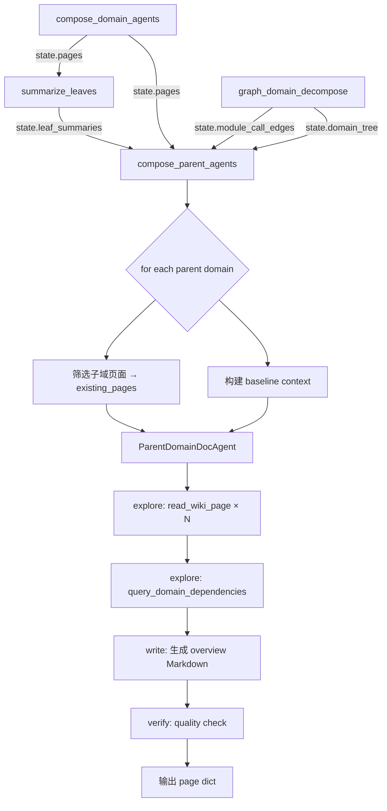

# Parent Domain Overview Agent 重构设计

> 状态: 提案 | 创建: 2026-05-20

## 1. 背景与问题

当前 `compose_parent_pages_node` 使用单次 LLM 调用生成父域 overview 页面。存在以下问题：

| 问题 | 影响 |
|------|------|
| 输入受限于摘要 | prompt 仅包含 `leaf_summaries` 的简短摘要文本，无法获取子域文档的完整内容 |
| 无法主动探索 | 缺乏工具调用能力，无法查询跨域调用链和接口依赖 |
| Prompt 冗余 | system prompt 和 user prompt 存在重复指令（Mermaid、语言、叙事风格） |
| 输出深度不足 | 单次生成无法保证输出的详细度和准确度 |
| display_name 缺失 | prompt 传入 slug 而非 display_name |
| 无子域数量自适应 | 2 个子域和 10 个子域使用相同 prompt |

## 2. 设计目标

1. 将父域 overview 生成重构为 Agent 模式，使其能主动读取子域 wiki 页面和 topic 页面的完整内容
2. 注入 Wiki 工具（`read_wiki_page`、`query_domain_dependencies`、`query_call_chain` 等），使 Agent 能自行探索跨域关系
3. 优化 prompt 结构，消除冗余，输出更详细且明确的 overview
4. 保持降级兼容——Agent 失败时回退到现有直接 LLM 模式

## 3. 架构设计

### 3.1 新增 ParentDomainDocAgent

```
DocOrchestrator (template method: explore → write → verify)
├── DomainDocAgent       — 叶子域：探索代码 → 写模块详解
├── ParentDomainDocAgent — 父域：探索子域文档 → 写综合概述  ← NEW
├── TopicDocAgent
└── FlowDocAgent
```

`ParentDomainDocAgent` 继承 `DocOrchestrator`，复用 explore → write → verify 模板方法，但具有完全不同的探索策略和写入目标：

| 维度 | DomainDocAgent (叶子域) | ParentDomainDocAgent (父域) |
|------|------|------|
| 探索对象 | 代码（模块、方法、源文件） | 子域 wiki 页面、topic 页面 |
| 核心工具 | read_code, query_module_detail | read_wiki_page, query_domain_dependencies |
| 输出目标 | 模块详解文档 | 子域综合概述 |
| Topic 拆分 | 支持 _plan_topics | 不拆分，仅生成单个 overview 页面 |
| max_rounds | 20 | 10 |
| max_iterations | 3 | 2 |

### 3.2 WikiPageAgent 工具注入

ParentDomainDocAgent 创建 WikiPageAgent 时，将 pipeline state 中子域已生成的页面注入 `existing_pages`：

```python
# 筛选当前父域的子域页面
child_domain_names = {c["name"] for c in parent_domain.get("children", [])}
child_pages = [
    p for p in state_pages
    if p.get("business_domain") in child_domain_names
]

page_agent = WikiPageAgent(
    llm, graph_store,
    max_rounds=10,
    existing_pages=child_pages,  # Agent 可通过 read_wiki_page 读取
)
```

Agent 可用的工具及其在父域场景下的用途：

| 工具 | Tier | 父域用途 |
|------|------|---------|
| `read_wiki_page` | 1 (提升) | 读取子域 overview 和 topic 页面内容 |
| `query_domain_dependencies` | 1 (提升) | 查询子域间的调用依赖关系 |
| `query_call_chain` | 1 | 追踪跨域调用路径 |
| `query_callers` / `query_callees` | 2 | 补充跨域调用细节 |
| `search_entities` | 2 | 搜索跨域共享实体 |
| `query_module_detail` | 3 | 按需查看跨域核心模块 |

注意：`read_code`、`read_file`、`grep_code` 等代码探索工具仍然可用但不在 explore prompt 中引导使用，Agent 可自行决定是否需要。

### 3.3 Pipeline 集成

```
compose_leaf_modules → compose_domain_agents → summarize_leaves → compose_parent_agents → quality_gate
                                                                    ↑ 替换 compose_parent_pages
```

**compose_parent_agents_node** 设计：

1. 收集父域列表（按层次自底向上）
2. 同层父域并发处理（复用 `DOMAIN_AGENT_CONCURRENCY` semaphore）
3. 每个父域创建 `ParentDomainDocAgent` 实例
4. 超时保护（复用 `DOMAIN_AGENT_TIMEOUT_SEC`）
5. 失败降级：Agent 异常时回退到现有 `compose_parent_pages_node` 的直接 LLM 逻辑

**配置开关**：`wiki.parent_overview_agent_mode: bool = True`（默认启用 Agent 模式）

### 3.4 数据流



## 4. Prompt 设计

### 4.1 PARENT_EXPLORE_SYSTEM

```
你是一个域架构分析 Agent。你的职责是通过阅读子域文档和查询域间调用关系，收集用于生成父域概述的上下文信息。

## 探索策略

### 步骤 1：阅读子域文档（必须）
使用 `read_wiki_page` 逐个读取以下子域的 wiki 页面：
{child_names_list}

对每个子域，记录：
- 业务职责概述
- 核心模块列表和分工
- 关键业务流程

### 步骤 2：查询域间依赖（必须）
对每个子域的核心模块调用 `query_domain_dependencies`，了解跨域调用关系。

### 步骤 3：追踪交叉调用链（可选）
如果发现两个子域之间有强依赖，使用 `query_call_chain` 追踪具体调用路径。

### 步骤 4：补充搜索（可选）
如需查找跨域共享的实体或接口，使用 `search_entities`。

## 规则
- 每一轮只发出工具调用，不要输出任何文本内容
- 确保每个子域都被 read_wiki_page 读取
- 最多 {max_rounds} 轮工具调用
```

### 4.2 PARENT_WRITE_SYSTEM

```
你是一个企业级代码知识库 Wiki 作者。基于探索阶段收集的子域文档和域间依赖信息，生成一篇父域综合概述文档。

{constraints}

## 输出结构
直接输出 Markdown（不要 JSON 包装），按以下章节顺序：

1. ## 域业务概述
   - 本域的整体业务价值和在系统中的定位（3-4段）
   - 子域分工一览表（子域名 | 业务职责 | 核心模块数 | 关键接口）

2. ## 子域架构
   - Mermaid flowchart 展示子域之间的关系和数据流向
   - 每个子域的业务职责概述（2-3句，基于 read_wiki_page 结果）
   - 子域之间的协作关系说明

3. ## 核心业务流程
   - 基于探索发现的跨域调用关系，提炼 2-3 个关键业务流程
   - 每个流程包含 Mermaid sequenceDiagram + 文字描述
   - 明确标注每个参与者属于哪个子域
   - 无跨域调用数据时标记 <!-- CONTEXT_GAP -->

4. ## 跨域调用关系
   - 基于 query_domain_dependencies 结果的跨域依赖分析
   - Mermaid 依赖图
   - 标注调用方向和业务含义

5. ## 核心接口
   - 域内对外暴露的关键接口/服务
   - 每个接口所属子域 + 业务用途

## 约束
- 全文使用{language}撰写
- 禁止复制子域文档的原文，应综合提炼
- 每个子域都必须被提及
- 内容不少于 2000 字
- 基于真实探索数据，不要编造域间关系
```

### 4.3 Baseline Context 模板

```
# 父域概述基线

## 域信息
- 域名: {parent_slug}
- 显示名: {parent_display_name}
- 子域数量: {child_count}

## 子域列表
{child_list_with_module_counts}

## 子域摘要
{leaf_summaries_text}

## 跨域调用统计
{cross_domain_stats}
```

## 5. 实现文件清单

| 文件 | 变更 | 说明 |
|------|------|------|
| `wiki/parent_domain_doc_agent.py` | 新建 | ParentDomainDocAgent 类、baseline 构建 |
| `wiki/agent_prompts.py` | 修改 | 新增 PARENT_EXPLORE_SYSTEM + PARENT_WRITE_SYSTEM |
| `wiki/nodes/aggregate.py` | 修改 | 新增 compose_parent_agents_node，保留旧 compose_parent_pages_node 作为降级 |
| `wiki/pipeline_graph.py` | 修改 | 将 compose_parent_pages 替换为 compose_parent_agents |
| `wiki/pipeline_nodes.py` | 修改 | 导出新节点 |
| `core/config.py` | 修改 | 新增 `parent_overview_agent_mode: bool = True` |
| `tests/wiki/test_parent_domain_agent.py` | 新建 | Agent 单元测试 |
| `tests/wiki/test_compose_parents.py` | 修改 | 更新集成测试 |

## 6. 成本与风险分析

### LLM 调用成本对比

| 方案 | 每父域 LLM 调用 | 典型 5 父域总调用 |
|------|--------|--------|
| 当前（直接 LLM） | 1 | 5 |
| Agent 模式 | ~10-15 | 50-75 |

成本增加约 10-15 倍，但父域数量少（典型 3-8 个），绝对增量可接受。

### 风险控制

| 风险 | 控制措施 |
|------|---------|
| Agent 超时 | 复用 DOMAIN_AGENT_TIMEOUT_SEC |
| Agent 失败 | 降级到直接 LLM 生成（保留 compose_parent_pages_node） |
| 输出质量不稳定 | quality_gate + heal 循环修复 |
| 成本失控 | max_rounds=10 限制 + 配置开关关闭 Agent 模式 |
| 并发竞争 | 复用 DOMAIN_AGENT_CONCURRENCY semaphore |

## 7. 向后兼容

- 配置 `wiki.parent_overview_agent_mode = False` 时回退到现有直接 LLM 模式
- 旧的 `compose_parent_pages_node` 保留为 fallback
- 输出格式不变：page dict 包含 page_type, title, content, path, executive_summary
- 路径约定不变：`/__domains__/{slug}/_overview`
