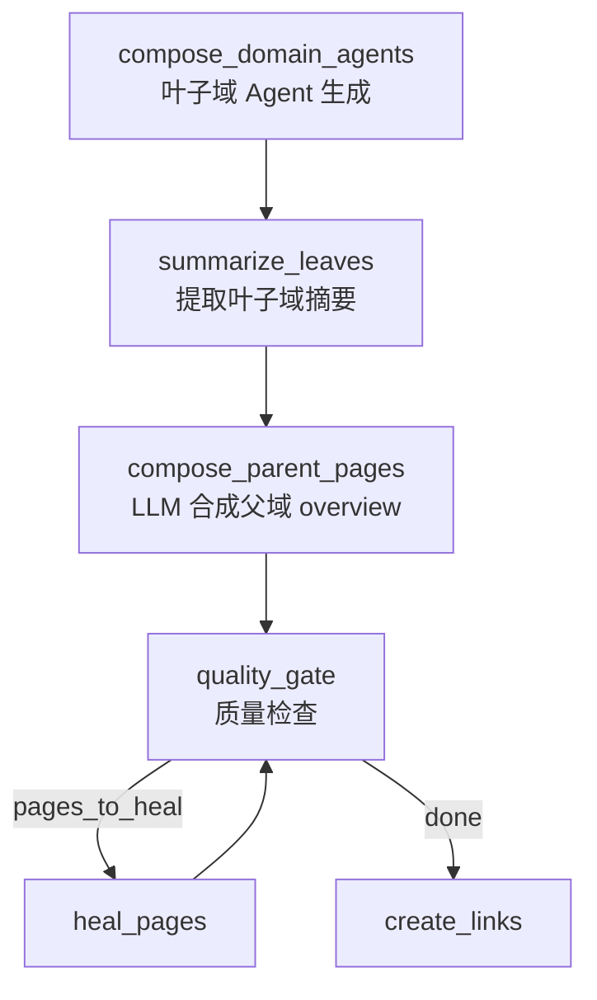

# Wiki 树形目录结构增强 — 设计规格

**状态**: DRAFT
**日期**: 2026-05-20
**前序提案**: `2026-05-20-wiki-tree-structure-enhancement.md` (已替代)

---

## 1. 问题陈述

### 现象

当前 Wiki 生成管线对每个**叶子域**独立生成 overview + topic 页面，存在三个结构性缺陷:

1. **父域无内容页** — 有子域的顶级域（如 `family-core-operations`：54 模块 / 9 子域）没有 LLM 生成的高质量 overview，`WikiTreeLinker` 后处理生成的静态拼接页面质量低（模板化列表，无业务洞察，无架构图）
2. **Topic 拆分被动** — `_maybe_split()` 基于纯 token 阈值（5000 tokens）机械拆分 `##` 标题，不考虑语义分组，且完全依赖 LLM 输出格式
3. **页面间缺少导航元数据** — `NavigationContext` 已定义 `parent_path`/`child_paths`/`breadcrumbs` 字段，但管线从未填充

### 根因

- 管线只处理叶子域（`_collect_leaf_domains()` 是门控），父域被跳过
- 已有 `compose_parent_pages_node` 和 `summarize_leaves_node` 代码（`wiki/nodes/aggregate.py`），但未接入 LangGraph 流程
- Topic 拆分在生成**之后**发生，Agent 不知道自己的 `##` 标题会变成独立页面

---

## 2. 设计目标

实现"书籍目录式"的 Wiki 树形结构:

- 每个域（含父域和子域）都有 LLM 生成的高质量 overview 页面
- 叶子域的 topic 拆分由 Agent 在 explore 阶段主动规划，而非被动拆分
- 页面之间通过 `NavigationContext` 维护完整的父子/兄弟索引关系

### 目标页面结构

```
family-core-operations/                    (顶层父域)
  ├── _overview                            (LLM 合成: 概述 + 子域关系 + 架构图)
  ├── family-interaction/                  (子域)
  │   ├── _overview                        (Agent 生成: 域概述)
  │   └── [topic-*.md]                     (按 Agent topic_outline 拆分)
  ├── family-core-service/                 (子域, 模块多)
  │   ├── _overview                        (Agent 生成: 域概述)
  │   └── [topic-1.md, topic-2.md, ...]    (按 Agent topic_outline 拆分)
  └── ...

user-profile-management/                   (无子域的小域, ≤5 模块)
  └── _overview                            (overview + topic 合并为一页)
```

---

## 3. 设计方案

### 3.1 管线节点激活 — 父域 Overview 生成

**变更**: 将已有但未连入的 `summarize_leaves_node` 和 `compose_parent_pages_node` 激活到 LangGraph 流程中。

#### 当前管线流程

```
... → compose_domain_agents → quality_gate → heal_pages → create_links → finalize
```

#### 新管线流程

```
... → compose_domain_agents → summarize_leaves → compose_parent_pages → quality_gate → heal_pages → create_links → finalize
```

#### 改动文件

| 文件 | 变更 |
|------|------|
| `wiki/pipeline_graph.py` | 新增 2 个节点和 3 条边 |
| `wiki/pipeline_nodes.py` | 确认 re-export `summarize_leaves_node`、`compose_parent_pages_node` |
| `wiki/nodes/aggregate.py` | 修复路径约定: `wiki/{slug}` → `/__domains__/{slug}/_overview` |

#### `compose_parent_pages_node` 修复项

当前实现（`aggregate.py:87-241`）需要以下调整:

1. **路径约定对齐**: 输出路径从 `wiki/{slug}` 改为 `domain_overview_path(slug)` (即 `/__domains__/{slug}/_overview`)，与 Agent 叶子域页面一致
2. **display_name 传递**: 使用 `domain_tree` 中的 `display_name` 作为页面标题，而非 `parent_name` slug
3. **metadata 完善**: 添加 `business_domain` 字段到输出页面，确保 TreeLinker 可正确链接
4. **语言参数化**: 当前 prompt 硬编码中文，改为根据 `wiki_cfg.language` 动态选择语言

#### Prompt 改进

**当前 `SYSTEM_WIKI_PARENT_OVERVIEW` 问题**: 硬编码中文、缺少内容结构指导、没有跨域调用统计输入。

**改进后的 prompt 结构**:

```
SYSTEM (SYSTEM_WIKI_PARENT_OVERVIEW):
You are a senior technical writer creating a domain overview page.
Your role is to SYNTHESIZE sub-domain information into a coherent narrative
that explains how these sub-domains form a complete business capability.

Output requirements:
1. Title: Use the domain's display name
2. Structure your content with these sections:
   - ## 业务概述: Domain's purpose and position in the system (2-3 paragraphs)
   - ## 子域架构: How sub-domains relate, with a Mermaid flowchart
   - ## 数据流: Key data flows between sub-domains (Mermaid sequence diagram)
   - ## 核心接口: Key interfaces referenced from code
3. Write in {language} for all business descriptions
4. Do NOT just list sub-domains; explain the STORY of how they work together
5. Include at least one Mermaid diagram showing sub-domain interactions

USER:
## Domain: {parent_display_name}
{parent_description}

## Sub-domain Summaries
{child_summaries_text}

## Key Code Interfaces
{snippet_text}

## Cross-Domain Call Statistics
{cross_domain_call_stats}

Return ONLY valid JSON with keys: "title", "content", "executive_summary", "page_type".
```

**新增 `cross_domain_call_stats`**: 从 `domain_tree` + `module_call_edges` 中提取子域间的调用关系统计，帮助 LLM 理解子域间的实际交互模式（如 "family-interaction → family-core-service: 15 calls"）。

#### 流程说明



- `summarize_leaves_node` 从叶子域 overview 页面提取 `executive_summary`（优先 LLM 生成的，fallback 规则提取）
- `compose_parent_pages_node` 基于 child summaries + key code snippets，通过 LLM 合成父域 overview
- 父域 overview 与叶子域 overview 一起进入 quality_gate，享有同等质量保障

### 3.2 Agent 主动规划 Topic 结构

**变更**: 修改 `DomainDocAgent` 的 explore 阶段输出，增加 `topic_outline` 结构化字段。Write 阶段按 outline 分 topic 执行。

#### 当前 DomainDocAgent 流程

```
explore (ReAct loop) → write (single call) → _maybe_split (post-hoc)
```

#### 新流程

```
explore (ReAct loop, 输出含 topic_outline) → write_per_topic (per-topic ReAct) → assemble_overview
```

#### topic_outline 结构

```python
@dataclass
class TopicPlan:
    title: str                  # Topic 标题 (如 "家族任务系统")
    modules: list[str]          # 覆盖的模块列表
    description: str            # 一句话描述

@dataclass
class DomainTopicOutline:
    should_split: bool          # False = 单页模式
    topics: list[TopicPlan]     # 拆分后的 topic 列表
```

#### 新增 plan_topics 步骤

**关键设计决策**: topic_outline 不在 explore 的 ReAct loop 中输出（ReAct loop 的输出是自由文本，不适合结构化），而是在 explore 结束后做一次**独立的 plan_topics() LLM 调用**。

`DomainDocAgent` 流程变为:

```
explore (ReAct loop) → plan_topics (single LLM call) → write_per_topic (per-topic write)
```

`topic_outline` 作为 `WorkingMemory` 的新属性存储（`WorkingMemory.topic_outline: DomainTopicOutline | None`），由 `DomainDocAgent._plan_topics()` 在 explore 完成后调用 LLM 生成并写入 memory。

**plan_topics prompt**:

```
SYSTEM:
You are a technical documentation architect. Based on the module analysis,
plan cohesive topic pages for a business domain.

USER:
## Domain: {domain_display_name}

## Module List ({module_count} modules)
{module_names_with_one_line_descriptions}

## Key Call Relationships
{call_relationships_from_working_memory}

## Task
Group these modules into cohesive topics. Rules:
- Each topic should cover 3-8 functionally related modules
- Topic titles must reflect business capability (not technical suffixes)
- Every module must be assigned to exactly one topic
- Maximum 6 topics to avoid fragmentation
- If the domain has ≤5 modules, set should_split=false

Return JSON only:
{
  "should_split": boolean,
  "topics": [
    {"title": "...", "modules": ["ModA", "ModB"], "description": "one sentence"}
  ]
}
```

**触发条件**:
- 当域的模块数 ≤ 5 时: 跳过 LLM 调用，直接 `should_split = False`
- 当域的模块数 > 5 时: 调用 LLM 生成 topic plan
- LLM 调用失败或 JSON 解析失败时: `topic_outline` 保持 `None`，write 阶段退化为当前单页行为

#### write 阶段变更

```python
async def _write_with_outline(self, outline: DomainTopicOutline, memory: WorkingMemory) -> list[dict]:
    if not outline.should_split or len(outline.topics) <= 1:
        content = await self._page_agent.write(self.domain_name, context, memory)
        return [_make_page(content, self.domain_name, self.domain_display_name)]
    
    pages = []
    for topic in outline.topics:
        topic_content = await self._page_agent.write(
            self.domain_name,
            _build_topic_context(topic, context),
            memory,
        )
        pages.append(_make_topic_page(topic_content, self.domain_name, topic))
    
    overview = _build_overview_from_topics(self.domain_name, outline, pages)
    return [overview, *pages]
```

**write_per_topic prompt 调整**: 每个 topic 的 write 调用中，context 只包含该 topic 覆盖的模块信息（通过 `_build_topic_context` 从完整 context 中过滤），并在 system prompt 中明确声明当前 topic 的边界:

```
You are writing the "{topic_title}" section of the {domain_name} domain.
Focus ONLY on these modules: {topic.modules}
Explain their business purpose, interactions, and key interfaces.
Do NOT cover modules outside this scope.
```

#### _maybe_split 保留为兜底

当 topic_outline 失败或单 topic 输出超长时，`_maybe_split()` 作为 fallback:
- 保持现有逻辑不变
- 增加小 section 合并: 相邻 sections 合计 < 1000 tokens 时合并
- 保证 parent 页面至少包含域概述段落

#### 改动文件

| 文件 | 变更 |
|------|------|
| `wiki/domain_doc_agent.py` | 新增 `_plan_topics()` 方法、`_write_with_outline()` 方法；`_maybe_split()` 增加合并逻辑 |
| `wiki/agent_prompts.py` | 新增 `SYSTEM_TOPIC_PLANNER` prompt；调整 write prompt 增加 topic scope |
| `wiki/agents/context.py` | `WorkingMemory` 增加 `topic_outline: DomainTopicOutline | None` 属性 |

### 3.3 NavigationContext 填充

**变更**: 在管线节点中填充已有的 `NavigationContext` 字段，不新增数据模型字段。

#### 已有 NavigationContext 字段

```python
@dataclass
class NavigationContext:
    parent_path: str = ""
    parent_title: str = ""
    sibling_paths: list[str] = field(default_factory=list)
    child_paths: list[str] = field(default_factory=list)
    related_flow_paths: list[str] = field(default_factory=list)
    breadcrumbs: list[str] = field(default_factory=list)
```

#### 填充时机与机制

在 `create_links_node` 中增加 NavigationContext 填充逻辑，复用 `wiki/helpers.py` 中已有的 `_populate_navigation_context()` 遍历模式（该函数基于 `WikiStructureNode` 树填充，本次需要基于 `domain_tree` + pages 做类似遍历）。

NavigationContext 存储在 pipeline state 的 page dict 的 `navigation` 字段中。persist 步骤（`WikiService._persist_pages_to_graph`）将其序列化为 `navigation_json` 属性存入 FalkorDB。

**填充规则**:

1. 遍历 `domain_tree`，为每个域的 overview 页面设置:
   - `parent_path`: 父域 overview 路径（顶层域为空）
   - `child_paths`: 子域 overview 路径列表 + topic 页面路径列表
   - `sibling_paths`: 同级域 overview 路径列表
   - `breadcrumbs`: 从根到当前域的路径链

2. 为 topic 页面设置:
   - `parent_path`: 所属域的 overview 路径
   - `sibling_paths`: 同域其他 topic 页面路径

**边界情况**:
- 单层域（无子域, 少模块）: 只设置 `sibling_paths`（同级其他域）
- 单层域（无子域, 多模块, 有 topic 拆分）: overview 的 `child_paths` 指向 topic 页面

#### 改动文件

| 文件 | 变更 |
|------|------|
| `wiki/nodes/links.py` | `create_links_node` 增加 NavigationContext 填充逻辑 |

### 3.4 API 响应增强

Wiki 页面 API 已返回 `navigation` 字段（来自 `navigation_json` 属性），无需新增 API 字段。当 NavigationContext 被正确填充后，前端自动获得导航数据。

#### 前端交互行为

1. **点击域** → 直接显示该域的 overview 页面
2. **如果是子域且有 topic 页面** → 通过 `child_paths` 展开 topic 列表
3. **面包屑导航** → 通过 `breadcrumbs` 字段渲染层级路径

前端改动属于后续独立任务（利用已有 `useWikiNavigation` hook），不在本 spec 范围内。

---

## 4. 与已有系统的关系

### WikiTreeLinker 行为变更

`link_pages_to_nested_tree()` 的核心逻辑**不变**:
- 仍然创建 `WikiSection` 层级 + `HAS_CHILD` 边
- 仍然检测 `agent_overview_paths` 以跳过静态生成
- 变化: 由于 `compose_parent_pages_node` 现在生成父域 overview，`agent_overview_paths` 集合将包含父域路径，TreeLinker 的静态拼接将自动跳过（已有 `if overview_path not in agent_overview_paths` 逻辑）

### _maybe_split 兜底角色

`_maybe_split()` 从主要拆分机制降级为**兜底 fallback**:
- 当 Agent topic_outline 解析失败 → 退化为当前行为
- 当单 topic write 输出超长 → 二次拆分
- 新增: 小 section 合并逻辑（避免碎片化）

### 已有测试的影响

| 测试文件 | 影响 |
|----------|------|
| `test_compose_parents.py` | 需更新路径断言 (`wiki/{slug}` → `/__domains__/{slug}/_overview`) |
| `test_summarize_leaves.py` | 无影响 |
| `test_domain_doc_agent.py` | 需新增 topic_outline 相关测试 |
| `test_tree_linker*.py` | 无影响（TreeLinker 逻辑不变） |
| `test_pipeline_graph_v2.py` | 需更新节点列表断言（新增 2 个节点） |

---

## 5. 不做什么 (Out of Scope)

- 不改变域分类 / 社区检测逻辑（`graph_driven_domain_decompose_node`）
- 不改变 `compose_leaf_modules_node` 的 module_summaries 生成逻辑
- 不新增数据模型字段（复用 `NavigationContext`）
- 不引入新的外部依赖
- 不改变前端组件（前端利用已有 `navigation` 字段，后续独立任务）
- 不修改 `WikiTreeLinker` 的 `HAS_CHILD` 边创建逻辑

---

## 6. 实施顺序

### Phase 1: 管线节点激活（父域 Overview）

1. `pipeline_graph.py`: 接入 `summarize_leaves` 和 `compose_parent_pages` 节点
2. `aggregate.py`: 修复路径约定和 metadata
3. 更新管线测试

### Phase 2: Agent Topic 规划

4. `agent_prompts.py`: Explore prompt 增加 topic_outline 输出要求
5. `domain_doc_agent.py`: 实现 `_write_with_outline` 逻辑
6. `domain_doc_agent.py`: `_maybe_split()` 增加小 section 合并 + 兜底角色

### Phase 3: 导航元数据

7. `nodes/links.py`: NavigationContext 填充逻辑
8. 端到端集成测试
