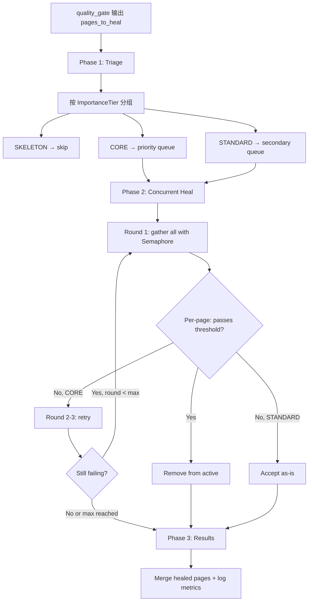

# Heal 全面重设计 + 统一 LLM 频控

**Status:** Draft  
**Created:** 2026-05-22  
**Scope:** `wiki/nodes/heal.py`, `core/config.py`, pipeline concurrency layer

---

## 1. 背景与问题

### 1.1 Heal 性能问题

`heal_pages_node` 是 Wiki 生成管线中唯一的**零并发节点**。当 `quality_gate` 标记 143 页需要修复时，串行处理导致 35-107 分钟的等待。

```
当前流程:
for page_path in active:          # 逐页串行
    await _heal_one_page(...)     # ~15-20s/page (LLM call)
```

实测数据 (2026-05-22, 开发环境):
- quality_gate 评估 522 页，标记 143 页 (27%) 需 heal
- 每页 ~15-20s，3 轮最坏 ~107 分钟
- 对比 `compose_domain_agents_node` 使用 `asyncio.gather` + `Semaphore(3)` 仅需 ~33 分钟处理 30 个域

### 1.2 LLM 频控碎片化

Pipeline 各节点的并发控制分散、不统一：

| 节点 | 并发度 | 配置来源 | 问题 |
|------|--------|----------|------|
| `graph_nodes.py` (bottomup) | 24 | 硬编码 | 过大，不可配置 |
| `domain_compose.py` | 3 | env var `DOMAIN_AGENT_CONCURRENCY` | 独立环境变量 |
| `compose.py` (leaf modules) | 12 | config `compose_concurrency` | ✓ 唯一正确做法 |
| `repo_composer.py` | 3 | 硬编码 `MAX_CONCURRENT_MODULE_COMPOSE` | 不可配置 |
| `wiki_shared.py` (API) | 5 | 硬编码 | 不可配置 |
| `enrichment_coordinator.py` | 3-12 | config `compose_concurrency` | 复用他人配置 |
| **`heal.py`** | **1 (串行)** | **无** | **根本缺陷** |

**结果：** 无法全局协调，调优依赖改代码，新节点容易遗漏并发。

---

## 2. 设计目标

1. **Heal 提速 5-7x** — 从 ~35 分钟降至 ~5-8 分钟
2. **统一频控入口** — 所有 pipeline 节点的并发配置集中管理
3. **双层架构** — Provider 全局上限 + 阶段逻辑控制
4. **向后兼容** — 现有 env var 和配置继续生效
5. **可观测** — 新增日志和 metrics 显示并发利用率

---

## 3. 架构设计

### 3.1 双层频控模型

```
┌───────────────────────────────────────────────┐
│ Layer 1: LLMProvider._semaphore (max_concurrent=50)  │  ← 全局 HTTP 连接上限
├───────────────────────────────────────────────┤
│ Layer 2: Per-stage semaphores                        │  ← 逻辑并发控制
│  ┌─────────┐ ┌─────────┐ ┌─────────┐ ┌─────────┐  │
│  │domain=3 │ │compose=12│ │heal=5   │ │title=12 │  │
│  └─────────┘ └─────────┘ └─────────┘ └─────────┘  │
└───────────────────────────────────────────────┘
```

- **Layer 1** 已存在（`LLMProvider._semaphore`），保持不变
- **Layer 2** 各节点独立 Semaphore，从统一配置读取

### 3.2 统一配置 (AppWikiFlags 扩展)

```python
# core/config.py - AppWikiFlags 新增字段
class AppWikiFlags(BaseModel):
    # --- Existing ---
    compose_concurrency: int = 12

    # --- Pipeline Concurrency (新增, 统一管理) ---
    domain_agent_concurrency: int = Field(
        default=3,
        description="compose_domain_agents 阶段并发度",
    )
    heal_concurrency: int = Field(
        default=5,
        description="heal_pages 阶段并发度",
    )
    bottomup_concurrency: int = Field(
        default=24,
        description="bottomup compose / title gen 并发度 (保持原值兼容)",
    )
    module_compose_concurrency: int = Field(
        default=3,
        description="repo_composer 模块级 compose 并发度",
    )

    # --- Heal Strategy (新增) ---
    heal_max_rounds_core: int = Field(
        default=3,
        description="CORE tier 页面最大 heal 轮次",
    )
    heal_max_rounds_standard: int = Field(
        default=1,
        description="STANDARD tier 页面最大 heal 轮次",
    )
```

### 3.3 PipelineConcurrency 工具类

```python
# wiki/pipeline_concurrency.py (新文件)
"""Centralized pipeline concurrency management."""
from __future__ import annotations

import asyncio
from core.config import get_settings


class PipelineConcurrency:
    """Provides stage-specific semaphores from unified config.

    Priority: env var WIKI_{STAGE}_CONCURRENCY > config field > default.
    Legacy env vars (e.g. DOMAIN_AGENT_CONCURRENCY) are also checked for
    backward compatibility.
    """

    _LEGACY_ENV_ALIASES: ClassVar[dict[str, str]] = {
        "domain_agent": "DOMAIN_AGENT_CONCURRENCY",
    }

    @classmethod
    def _resolve_limit(cls, stage: str) -> int:
        # 1. Check new-style env var: WIKI_DOMAIN_AGENT_CONCURRENCY
        env_key = f"WIKI_{stage.upper()}_CONCURRENCY"
        env_val = os.environ.get(env_key)
        if env_val is not None:
            return int(env_val)

        # 2. Check legacy env var alias
        legacy_key = cls._LEGACY_ENV_ALIASES.get(stage)
        if legacy_key:
            legacy_val = os.environ.get(legacy_key)
            if legacy_val is not None:
                return int(legacy_val)

        # 3. Read from config
        cfg = get_settings().wiki
        mapping = {
            "domain_agent": cfg.domain_agent_concurrency,
            "heal": cfg.heal_concurrency,
            "compose": cfg.compose_concurrency,
            "bottomup": cfg.bottomup_concurrency,
            "title_gen": cfg.bottomup_concurrency,
            "module_compose": cfg.module_compose_concurrency,
        }
        return mapping.get(stage, cfg.compose_concurrency)

    @classmethod
    def semaphore(cls, stage: str) -> asyncio.Semaphore:
        return asyncio.Semaphore(cls._resolve_limit(stage))

    @classmethod
    def limit(cls, stage: str) -> int:
        """Return concurrency limit as int (for logging/metrics)."""
        return cls._resolve_limit(stage)
```

---

## 4. Heal 节点重设计

### 4.1 新流程



### 4.2 核心代码结构

```python
async def heal_pages_node(state, config=None):
    """Redesigned: concurrent + tier-aware heal."""
    configurable = (config or {}).get("configurable", {})
    llm = configurable.get("llm")
    graph_store = configurable.get("graph_store")
    wiki_cfg = get_settings().wiki
    evaluator = WikiQualityEvaluator()

    # Phase 1: Triage
    pages_to_heal = list(set(state.get("pages_to_heal", [])))
    if not pages_to_heal:
        return {"pages_to_heal": [], ...}

    page_by_path = {p["path"]: dict(p) for p in state.get("pages", []) if p.get("path") in set(pages_to_heal)}
    importance_tiers = (state.get("config") or {}).get("importance_tiers", {})

    core_pages = []
    standard_pages = []
    for path in pages_to_heal:
        tier = importance_tiers.get(path, "standard")
        if tier == "skeleton":
            continue
        elif tier == "core":
            core_pages.append(path)
        else:
            standard_pages.append(path)

    # Phase 2: Concurrent heal
    sem = asyncio.Semaphore(wiki_cfg.heal_concurrency)
    heal_attempts = dict(state.get("heal_attempts", {}))
    heal_hints = dict(state.get("heal_hints", {}))
    healed_by_path = {}

    async def _bounded_heal(page_path):
        async with sem:
            page_dict = page_by_path.get(page_path)
            if not page_dict:
                return
            heal_attempts[page_path] = heal_attempts.get(page_path, 0) + 1
            ok = await _heal_one_page(...)
            if ok:
                healed_by_path[page_path] = dict(page_dict)

    # CORE: up to heal_max_rounds_core rounds
    active_core = list(core_pages)
    for round_num in range(wiki_cfg.heal_max_rounds_core):
        if not active_core:
            break
        await asyncio.gather(*[_bounded_heal(p) for p in active_core])
        # Filter out pages that now pass
        active_core = [p for p in active_core if not _page_passes(page_by_path.get(p), ...)]

    # STANDARD: exactly 1 round
    await asyncio.gather(*[_bounded_heal(p) for p in standard_pages])

    # Phase 3: Results
    log.info("heal_pages_done", core_healed=..., standard_healed=..., still_failing=...)
    return {...}
```

### 4.3 配置降级

| 配置 | 默认值 | 降级行为 |
|------|--------|----------|
| `heal_concurrency` | 5 | 最低 1 (保持串行兼容) |
| `heal_max_rounds_core` | 3 | 与原 `_MAX_HEAL_ROUNDS` 一致 |
| `heal_max_rounds_standard` | 1 | 降低无效重试 |
| LLM 不可用 | - | 仅执行 structural hint 更新，跳过 LLM heal |

---

## 5. 迁移计划

### 5.1 各节点迁移

| 节点 | 当前 | 迁移后 | 改动范围 |
|------|------|--------|----------|
| `domain_compose.py` | `os.environ.get("DOMAIN_AGENT_CONCURRENCY", "3")` | `PipelineConcurrency.semaphore("domain_agent")` | 2 行 |
| `graph_nodes.py` | `_BOTTOMUP_CONCURRENCY = 24` | `PipelineConcurrency.semaphore("bottomup")` | 4 行 (default=24 保持兼容) |
| `compose.py` | `_COMPOSE_CONCURRENCY = settings.wiki.compose_concurrency` | `PipelineConcurrency.semaphore("compose")` | 保持 (已符合) |
| `repo_composer.py` | `MAX_CONCURRENT_MODULE_COMPOSE = 3` | `PipelineConcurrency.semaphore("module_compose")` | 2 行 |
| `heal.py` | 无 (串行) | `PipelineConcurrency.semaphore("heal")` | 重写 |

### 5.2 向后兼容

- `DOMAIN_AGENT_CONCURRENCY` env var: 保留作为 override (优先级 env > config > default)
- `compose_concurrency` config field: 保持不变
- `_BOTTOMUP_CONCURRENCY` 硬编码: 降级为 fallback default

---

## 6. 测试计划

### 6.1 单元测试

- [ ] `PipelineConcurrency.semaphore()` 正确读取 config
- [ ] `heal_pages_node` 并发执行验证 (mock LLM, 检查并发度)
- [ ] Tier 分组逻辑: CORE 3 轮 / STANDARD 1 轮 / SKELETON 跳过
- [ ] Per-page early exit: 第 1 轮通过后不进入第 2 轮
- [ ] 降级: LLM 不可用时仅更新 hints
- [ ] 各节点迁移后行为不变

### 6.2 集成测试

- [ ] 完整 pipeline 运行, heal 节点正确嵌入
- [ ] 并发度不超过配置值 (通过 semaphore counter 验证)
- [ ] env var override 优先级验证

### 6.3 性能验证

- [ ] 开发环境 benchmark: heal 阶段耗时从 ~35 分钟降至 < 10 分钟

---

## 7. 风险与缓解

| 风险 | 严重度 | 缓解措施 |
|------|--------|----------|
| 并发 heal 导致 LLM rate limit | 中 | heal_concurrency 默认 5, 低于 provider 上限; LLM retry 机制兜底 |
| healed_by_path 并发写入 | 低 | asyncio 单线程模型保证无竞争; 每个 task 操作独立的 page_dict 副本 |
| STANDARD 页仅 1 轮可能质量不够 | 低 | 可通过配置调整; 首次生成后 incremental heal 会补充 |
| 配置迁移期间两种方式共存 | 低 | 明确优先级: env > config > default |
| bottomup_concurrency 默认 24 偏高 | 低 | 保持向后兼容; 用户可自行调低; Provider semaphore 兜底 |

---

## 8. 设计说明

### 8.1 线程安全

Python asyncio 是单线程协作式并发模型。`asyncio.gather` 中的协程在 `await` 点交替执行，不存在真正的并行写入。每个 `_bounded_heal` 操作其独立的 `page_dict` 副本（来自 `page_by_path` 的 `dict(p)` 深拷贝），无共享可变状态。

### 8.2 Pipeline 顺序保证

LangGraph StateGraph 保证节点严格按 edge 顺序执行。`heal_pages` 在 `quality_gate` 之后、`create_links` 之前运行。不会与 `compose_domain_agents` 等 LLM 密集节点同时运行。因此各阶段的 semaphore 是独立控制，不会互相竞争 provider 的全局 50 连接上限。

### 8.3 并发度调优指南

| 场景 | 推荐 heal_concurrency | 理由 |
|------|----------------------|------|
| 自部署 LLM (无 rate limit) | 8-10 | 瓶颈在 GPU 推理，可充分利用 |
| OpenAI API (TPM 限制) | 3-5 | 避免触发 429，依赖 provider retry |
| 内部 Gateway (已有队列) | 5-8 | Gateway 自带排队，适度提高 |
