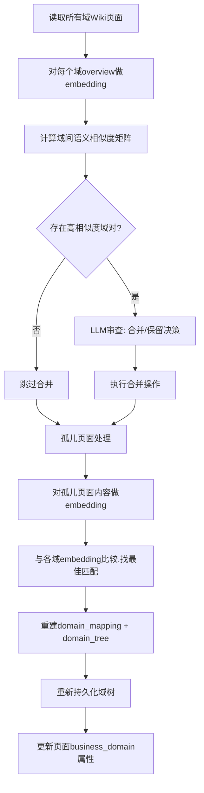

# Wiki 内容驱动的域重组设计

> 状态: 提案 | 创建: 2026-05-22

## 1. 背景与问题

### 1.1 当前管线流程

```
compose_leaf_modules → classify_domains → persist → compose_domain_agents → summarize → compose_parent_pages → quality_gate → create_links → finalize
```

域分类（`classify_domains` = `graph_driven_domain_decompose_node`）在 Wiki 生成之前执行，使用 `module_summaries`（200-500 字结构化摘要）的 embedding + 调用图边进行 HAC 聚类。`build_embedding_texts` 拼接格式为 `"{name} [{path}] — {summary_text}"`。

### 1.2 问题

| 问题 | 根因 | 影响 |
|------|------|------|
| 域分类不准确 | 单模块 embedding 缺乏"组级"语义视角，只能捕捉文本相似性而非业务归属 | 模块被归入错误的业务功能组 |
| 孤儿页面错误归属 | `_adopt_orphan_domain_pages` 使用 CJK 字符重叠匹配 | 页面被链接到不相关的域 |
| 无法发现域级合并机会 | 初始 HAC 聚类产生的域粒度可能过细，两个域描述相同业务功能 | 域树结构冗余 |
| 无法自校正 | 域分类在 Wiki 生成前一次完成，不利用生成后的丰富语义 | 即使发现分类错误也无法修正 |

### 1.3 核心洞察

- **域概览提供"组级聚合语义"**：单模块 summary（200-500 字）只能描述单一模块的职责，而域概览（500-2000 字）是对一组模块的高级概括，能捕捉"组级"业务含义。
- **域间相似度只有在域概览生成后才能计算**：两个域是否应合并，需要比较它们各自的聚合描述，而非逐一比较各模块。
- **鸡生蛋解法**：先用初始分类生成域 Wiki，再用域 Wiki 的聚合语义纠偏域组织结构。

### 1.4 整体策略：粗分→生成→精调

```
模块 Summaries (200-500字/模块)
    ↓ Embedding + HAC 聚类 [低成本、确定性]
初始域结构 (粗分, 召回优先)
    ↓ LLM Namer + Corrector [少量LLM调用]
域结构 v1 (已命名、已纠偏)
    ↓ DomainDocAgent [生成域概览Wiki]
域概览 Wiki (500-2000字/域, 组级聚合语义)
    ↓ Embedding 相似度 + LLM 审查 [reassembly]
域结构 v2 (精调: 合并冗余域 + 匹配孤儿)
```

每一层利用上一层产出的更丰富语义信号来优化域结构。初始 HAC 聚类提供"足够好"的起点（使域概览生成有意义），reassembly 利用域概览的聚合语义做最终精调。

## 2. 设计目标

1. 在 Wiki 生成后增加域重组阶段，利用 Wiki 内容的语义信号纠正初始分类的错误
2. 通过 embedding 相似度 + LLM 审查实现域合并/孤儿重匹配
3. 保持域的层级结构（父域 → 子域 → 叶子域）
4. 提供配置开关和降级策略，确保向后兼容

## 3. 架构设计

### 3.1 新管线流程

```
compose_leaf_modules
  → classify_domains (初始分类，保持不变)
  → persist_classification
  → set_review_status
  → compose_domain_agents (生成域Wiki)
  → summarize_leaves
  → compose_parent_pages
  → ★reassemble_domains★ (新：Wiki内容驱动的域重组)
  → quality_gate
  → heal_pages
  → create_links
  → finalize
```

### 3.2 reassemble_domains 节点



### 3.3 数据流

**输入（从 state 读取）**：
- `pages: list[dict]` — 所有已生成的 Wiki 页面（含完整 Markdown 内容）
- `domain_mapping: dict[str, list]` — 初始域→模块映射
- `domain_tree: list[dict]` — 初始域树
- `domain_display_names: dict[str, str]` — 域显示名
- `module_call_edges: list[dict]` — 模块间调用关系

**输出（更新 state）**：
- `domain_mapping` — 重组后的域→模块映射
- `domain_tree` — 重组后的域树
- `domain_display_names` — 更新后的域显示名
- `reassembly_actions: list[dict]` — 执行的重组操作记录

### 3.4 重组算法详细流程

#### Step 1：域 Wiki 内容嵌入

```python
domain_embeddings: dict[str, np.ndarray] = {}
for page in state["pages"]:
    if page["path"].endswith("/_overview"):
        slug = extract_domain_slug(page["path"])
        content = page["content"][:2000]  # 截取前2000字符
        emb = await embedding_generator.generate([content])
        domain_embeddings[slug] = emb[0]
```

#### Step 2：域间相似度矩阵 + 合并候选

```python
merge_candidates = []
for (d1, e1), (d2, e2) in itertools.combinations(domain_embeddings.items(), 2):
    sim = cosine_similarity(e1, e2)
    if sim > config.reassembly_merge_threshold:
        merge_candidates.append({"source": d1, "target": d2, "similarity": sim})

# 按相似度降序
merge_candidates.sort(key=lambda x: -x["similarity"])
```

#### Step 3：LLM 审查（单次调用）

仅在存在合并候选时调用。Prompt 包含候选域对的 overview 摘要，LLM 返回批准/拒绝每个合并操作。

#### Step 4：孤儿页面 Embedding 匹配

```python
# 查找未被链接到域树的域overview页面
orphan_pages = find_unlinked_domain_pages(state["pages"], domain_mapping)

for orphan in orphan_pages:
    orphan_emb = await embedding_generator.generate([orphan["content"][:2000]])
    scores = {slug: cosine_sim(orphan_emb, emb) for slug, emb in domain_embeddings.items()}
    best_domain = max(scores, key=scores.get)
    if scores[best_domain] >= config.reassembly_orphan_threshold:
        assign_page_to_domain(orphan, best_domain)
```

#### Step 5：重建域树

使用现有 `_build_domain_tree` 逻辑，基于更新后的 `domain_mapping` 重新构建层级结构。

### 3.5 与现有组件的交互

| 组件 | 交互方式 |
|------|---------|
| `GraphSemanticCorrector` | 初始阶段仍使用；reassembly 是其补充 |
| `DomainStabilizer` | reassembly 后再次调用，确保域名稳定 |
| `_adopt_orphan_domain_pages` | 简化——reassembly 已处理孤儿匹配 |
| `persist_classification_node` | reassembly 后调用二次持久化逻辑 |
| `EmbeddingGenerator` | 复用 `EmbeddingGenerator.shared()` 实例 |

## 4. 配置

| 配置项 | 类型 | 默认值 | 说明 |
|--------|------|--------|------|
| `wiki.domain_reassembly_enabled` | `bool` | `True` | 是否启用域重组 |
| `wiki.reassembly_merge_threshold` | `float` | `0.85` | 域间语义相似度合并阈值 |
| `wiki.reassembly_orphan_threshold` | `float` | `0.60` | 孤儿页面匹配最低相似度 |
| `wiki.reassembly_max_moves_pct` | `float` | `0.30` | 最大允许变动比例(超过则回退) |
| `wiki.reassembly_respect_user_modified` | `bool` | `True` | 是否尊重人工调整的域（跳过 user_modified 域） |

## 5. 降级策略

| 场景 | 处理 |
|------|------|
| Embedding 生成失败 | 跳过重组，保持初始分类，记录 warning |
| LLM 审查调用失败 | 跳过合并操作，仅执行孤儿 embedding 匹配 |
| 重组变动 >30% 模块移动 | 回退到初始分类，记录 warning |
| 无域 Wiki 页面（管线异常） | 跳过重组 |
| 配置 `reassembly_enabled=False` | 跳过重组 |
| 域有 `user_modified=true` 标记 | 该域不参与合并和孤儿匹配（保护人工调整） |

## 6. 实现文件清单

| 文件 | 变更 | 说明 |
|------|------|------|
| `wiki/nodes/reassemble_domains.py` | **新建** | 域重组节点：embedding + LLM 审查 + 孤儿匹配 |
| `wiki/pipeline_graph.py` | 修改 | compose_parent_pages → reassemble_domains → quality_gate |
| `wiki/pipeline_nodes.py` | 修改 | 导出 reassemble_domains_node |
| `wiki/pipeline_state.py` | 修改 | 新增 `reassembly_actions` 字段 |
| `core/config.py` | 修改 | WikiSettings 新增 5 个 reassembly 配置项 |
| `wiki/tree_linker.py` | 修改 | 简化 `_adopt_orphan_domain_pages`（reassembly 兜底） |
| `wiki/nodes/persist_classification.py` | 修改 | 抽取可复用的持久化逻辑 |
| `tests/wiki/test_reassemble_domains.py` | **新建** | 单元测试：合并、孤儿匹配、降级 |
| `tests/wiki/test_reassemble_integration.py` | **新建** | 集成测试：管线中完整流程 |

## 7. 成本分析

| 阶段 | LLM 调用 | Embedding 调用 | 说明 |
|------|---------|---------------|------|
| 初始分类 | ~1-2 (namer + corrector) | N 个模块 | 不变 |
| ★域重组★ | 0~1 (仅合并候选时) | M 个域 (~5-15) | 新增，成本低 |

Embedding 调用对 5~15 个域的 overview 做嵌入，远小于模块数量（通常几十到几百），成本可忽略。
LLM 审查仅在存在合并候选时调用一次（且非必须），成本极低。

## 8. 关键设计决策

### Q: 为什么不跳过初始分类，直接先生成 Wiki 再构建域？

**不可行——存在鸡生蛋依赖。** 理由：

1. **当前系统的"Wiki"就是域概览页面**（一组模块的聚合描述），而非每个 module 单独的页面。生成域概览的前提是已知域的边界（哪些模块属于同一个域）。
2. **无域结构就无法生成域 Wiki**：`compose_domain_agents` 节点需要 `domain_mapping` 来确定为哪些模块组合生成聚合描述。
3. **用户不需要 module 级 Wiki**：如果增加"每个 module 独立 Wiki 页面"的步骤来绕过依赖，会引入大量 LLM 调用且产出物不符合需求。
4. **初始分类的成本极低**：Embedding + HAC 聚类使用本地 bge-m3 模型，只需极少量 LLM 调用（namer + corrector），整体成本远低于一轮完整的域 Wiki 生成。

因此最优策略是：**用低成本的 Embedding HAC 做初始分类（召回优先），生成域 Wiki 后再利用域级聚合语义做高质量纠偏。**

### Q: 为什么 reassembly 用 Embedding 而非纯 LLM 做域间相似度？

**Embedding 做召回 + LLM 做决策的混合策略。** 对比：

| 维度 | Embedding 相似度 | 纯 LLM 分类 |
|------|------|------|
| 成本 | 本地模型，几乎零成本 | 所有域概览内容作为输入，token 费用高 |
| 稳定性 | 相同输入 → 相同结果 | 每次运行可能不同结论 |
| 扩展性 | O(n²) 向量运算，毫秒级 | 域数量多时超出 context window |
| 业务理解 | 弱（纯语义距离） | 强（能推理业务关联） |

本设计中 Embedding 负责**筛选合并候选**（高效、确定性），LLM 负责**审批合并决策**（理解业务语义）。这是"召回 + 精排"的标准模式：Embedding 保证不遗漏，LLM 保证不误判。

### Q: 合并域后，域 Wiki 内容是否需要重新生成？

**不重新生成**。理由：
1. 重组阶段的目标是修正域组织结构，不是优化 Wiki 质量
2. 被合并的域 Wiki 内容仍然有效（描述的模块功能没变）
3. 域概览由 compose_parent_pages 生成，它会在下次增量运行时基于新结构更新
4. 当前运行中，quality_gate + heal 可以修复被重组影响的页面质量问题

### Q: 重组移动的是「模块」还是「页面」？

**移动的是页面在域树中的归属**（即 HAS_CHILD 边的变更），不移动模块的 domain_mapping。
- 合并操作：将 source 域的所有模块和页面合并到 target 域下
- 孤儿匹配：将无归属的域 overview 页面链接到最匹配的域 section

### Q: 是否应支持域拆分和新建？

**当前版本不支持，作为已知局限和未来扩展。** 理由：

1. **拆分复杂度远高于合并**：合并只需发现"两个域像" → 合并；拆分需要发现"域内不一致" → 确定边界 → 命名新域 → 重分配模块，需要多步 LLM 推理。
2. **初始阶段已有拆分机制**：`GraphSemanticCorrector` 在初始分类后已经负责检测并修正单模块级的归属错误（相当于微观拆分）。
3. **渐进策略**：先实现合并（高置信度、低风险），积累经验后再考虑拆分。

**未来扩展方向**：可通过检测域内模块 embedding 离散度（标准差过高 → 该域可能包含不相关模块）来触发拆分候选。

### Q: 人工调整的域如何保护？

**尊重 `user_modified` 标记，跳过人工固定的域。** 设计：

现有系统已有 `WikiSection.user_modified` 属性和 `auto_generated` 标记。reassembly 应遵循：

1. **pinned 检测**：在执行合并/孤儿匹配前，检查域对应的 `WikiSection` 节点是否 `user_modified = true`
2. **保护规则**：
   - `user_modified = true` 的域不作为合并的 source（不被吞并）
   - `user_modified = true` 的域不作为合并的 target（不接收新模块）
   - 人工固定的域下的页面不参与孤儿重匹配
3. **降级配置**：新增 `wiki.reassembly_respect_user_modified`（默认 `True`），允许管理员在特殊场景下强制重组

实现时在 reassembly 节点开始阶段查询：
```python
pinned_domains: set[str] = set()
for section in wiki_tree_store.get_sections(business_id):
    if section.get("user_modified"):
        pinned_domains.add(section["slug"])
```

合并候选过滤时排除 pinned_domains 中的域。

## 9. 测试计划

- [ ] 合并：两个相似度 >0.85 的域正确合并
- [ ] 不合并：相似度 <0.85 的域保持独立
- [ ] 孤儿匹配：无链接的域页面被正确匹配到最近域
- [ ] 孤儿阈值：低于 0.6 的孤儿页面不被强制匹配
- [ ] 降级：embedding 失败时跳过重组
- [ ] 降级：变动过大时回退初始分类
- [ ] 域树层级：重组后保持父域→子域→叶子域结构
- [ ] 持久化：重组结果正确写入 graph db
- [ ] 配置开关：`reassembly_enabled=False` 时完全跳过
- [ ] 人工保护：`user_modified=true` 的域不参与合并（不做 source 也不做 target）
- [ ] 人工保护：`user_modified=true` 的域下的页面不参与孤儿重匹配
- [ ] 人工保护：`reassembly_respect_user_modified=False` 时可强制忽略保护
