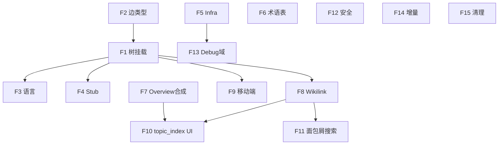

# Wiki Quality Fix V6 — 全量修复设计

**Created:** 2026-05-26
**Author:** AI Agent (brainstorming)
**Source:** V7 全维度审计报告 (`docs/wiki-quality-audit.md`)
**Scope:** 15 个修复点，覆盖管线核心、域结构、链接图、前端、安全、架构

---

## 背景

V7 审计通过 10 个独立 subagent 从产品UX、跨域冗余、元数据、管线代码、域命名、内容质量、前端渲染、安全、架构可扩展性、链接图完整性 10 个角度进行深度分析，发现 18 项问题（本次修复 15 项，排除 LLM 限流开启和两项 P2 域合并/冗余治理）。

综合评分从 V6 的 5.5 降至 V7 的 4.8（新维度拉低），Topic 从 0→34 是结构性突破，但交付链路（树挂载+中文质量+链接图+前端）成为新主战场。

---

## 修复清单概览

| ID | 修复项 | 优先级 | 预估行数 | 涉及文件 |
|----|--------|--------|---------|---------|
| F1 | Topic 树挂载恢复 | P0 | 25-35 | `wiki/tree_linker.py` |
| F2 | 链接图边类型统一 | P0 | 20-30 | `wiki/confidence_inputs.py`, `store/wiki_page_store.py`, `wiki/lint.py` |
| F3 | Topic 语言质量 | P0 | 35-55 | `wiki/domain_doc_agent.py`, `wiki/output_guardrail.py`, `wiki/page_agent.py` |
| F4 | Stub Topic 拦截 | P0 | 25-35 | `wiki/nodes/finalize.py`, `wiki/nodes/quality_gate.py`, `core/config.py` |
| F5 | Infra 过滤扩展 | P1 | 15-20 | `core/config.py`, `wiki/nodes/graph_domain_decompose.py` |
| F6 | 术语表默认值 | P1 | 5-10 | `core/config.py` |
| F7 | Topic Index Overview 合成 | P1 | 40-60 | `wiki/domain_doc_agent.py` |
| F8 | Wikilink 复合键 | P1 | 30-40 | `wiki/wikilink_cache.py`, `wiki/nodes/links.py`, `wiki/domain_doc_agent.py` |
| F9 | 移动端侧栏 | P0 | 10-15 | `dashboard/src/components/wiki/WikiToolbar.tsx` |
| F10 | topic_index 渲染 | P1 | 30-40 | `dashboard/src/components/wiki/WikiToolPanel.tsx` |
| F11 | 面包屑与搜索 | P1 | 40-60 | `WikiBreadcrumbs.tsx`, `WikiSemanticSearchResults`, API |
| F12 | SensitiveContentGuardrail | P1 | 80-120 | `wiki/output_guardrail.py`, `wiki/nodes/finalize.py` |
| F13 | Debug 域排除 | P1 | 由 F5 覆盖 | — |
| F14 | 增量默认开启 | P1 | 5-10 | `core/config.py` |
| F15 | 数据清理 | P2 | 30 | `scripts/cleanup_module_overviews.py`, `wiki/persistence.py` |

**合计预估：370-530 行改动**

---

## F1 — Topic 树挂载恢复（P0，致命）

### 问题

34 个 topic 全部不在导航树中。`tree_linker.py` L566-585 的 `elif` 逻辑阻断了模糊匹配。

### 修改

**文件：`wiki/tree_linker.py`**

1. `tp_q` Cypher 查询增加 `w.business_domain AS business_domain`：

```python
# L550 附近，tp_q 的 RETURN 子句
"RETURN w.uid AS uid, w.path AS path, w.canonical_key AS canonical_key, "
"w.business_domain AS business_domain, w.title AS title"
```

2. L566-585 匹配逻辑重构为链式 fallback：

```python
ck = str(row.get("canonical_key") or "").strip()
bd = str(row.get("business_domain") or "").strip()

matched_domain = None

# Priority 1: business_domain 精确匹配域名
if bd and bd in domain_name_set:
    matched_domain = bd

# Priority 2: canonical_key 在模块映射表中
if not matched_domain and ck:
    matched_domain = canonical_key_to_domain.get(ck)

# Priority 3: canonical_key 本身是域 slug
if not matched_domain and ck and ck in domain_name_set:
    matched_domain = ck

# Priority 4: 路径模糊匹配（仅当前三级全失败）
if not matched_domain:
    matched_domain = _find_best_domain(top_level)
    if matched_domain:
        log.info("nested_tree_topic_domain_fuzzy_fallback", ...)

if not matched_domain:
    log.warning("nested_tree_topic_unresolvable", ...)

if matched_domain:
    topic_pages_by_domain.setdefault(matched_domain, []).append(uid)
```

3. 构建 `domain_name_set`：在 `build_canonical_key_maps` 后新增

```python
domain_name_set = {d.name for d in all_domains}
```

### 回归测试

- 更新 `test_nested_tree_topic_canonical_key_overrides_path_fuzzy_domain`：保持模块级精确匹配优先
- 更新 `test_nested_tree_topic_unknown_canonical_key_skips_fuzzy_match`：改为 business_domain 兜底成功
- 新增 `test_nested_tree_topic_business_domain_match`：验证 business_domain 优先级
- 新增 `test_nested_tree_topic_canonical_key_as_domain_slug`：验证 ck=域slug 场景

### 预期效果

Section→Page 48→82，34 topic 进入侧边栏导航。

---

## F2 — 链接图边类型统一（P0）

### 问题

代码查询 `:WIKILINK` 边类型，但图中实际只有 `:WIKI_REFERENCES {relation_type: 'wikilink'}`。导致置信度 `inbound_wikilink_count` 恒为 0，孤岛检测假阳性。

### 修改

**文件 1：`wiki/confidence_inputs.py` L71**

```python
# Before
"OPTIONAL MATCH (wp)<-[:WIKILINK]-(linker) "
# After
"OPTIONAL MATCH (wp)<-[:WIKI_REFERENCES {relation_type: 'wikilink'}]-(linker) "
```

**文件 2：`store/wiki_page_store.py` L143-149**

```python
# Before
"OPTIONAL MATCH (wp)<-[wl:WIKILINK]-() "
# After
"OPTIONAL MATCH (wp)<-[wl:WIKI_REFERENCES {relation_type: 'wikilink'}]-() "
```

**文件 3：`wiki/lint.py`**

同样将所有 `:WIKILINK` 引用替换为 `:WIKI_REFERENCES {relation_type: 'wikilink'}`。

### 回归测试

- 更新相关 mock 中的 `WIKILINK` → `WIKI_REFERENCES`

---

## F3 — Topic 语言质量（P0）

### 问题

12/34 topic 中文比例 < 15%，根因是 TOPIC SCOPE 英文硬编码 + 结构化输出无语言约束。

### 修改

**文件 1：`wiki/domain_doc_agent.py` L739-751**

将 TOPIC SCOPE 按 `content_language` 切换：

```python
if self._is_chinese_language():
    scope_text = (
        f"--- 主题范围 ---\n"
        f"你正在撰写「{topic.title}」章节。\n"
        f"仅聚焦以下模块：{topic_module_list}\n"
        f"描述：{topic.description}\n"
    )
else:
    scope_text = (
        f"--- TOPIC SCOPE ---\n"
        f"You are writing the \"{topic.title}\" section.\n"
        f"Focus ONLY on these modules: {topic_module_list}\n"
        f"Description: {topic.description}\n"
    )

topic_context = f"{baseline_context}\n\n{scope_text}" + glossary_section
```

**文件 2：`wiki/output_guardrail.py`**

`LanguageConsistencyCheck.check()` 对 topic 硬化：

```python
# 当 page_type == "topic" 且 cn_ratio < cn_ratio_threshold 时
# passed = False 且设置 result.should_heal = True
if page_type == "topic" and cn_ratio < self.cn_ratio_threshold:
    return CheckResult(
        passed=False,
        should_heal=True,
        message=f"Topic cn_ratio={cn_ratio:.2f} < {self.cn_ratio_threshold}, requires heal",
    )
```

**文件 3：`wiki/domain_doc_agent.py`**

`_write_topics()` 或 `_write_with_outline()` 中检查 guardrail 结果后，对 `should_heal=True` 触发重写。

### 回归测试

- 新增 `test_topic_scope_chinese_when_chinese_language`
- 新增 `test_language_guardrail_hard_fail_for_topic`

---

## F4 — Stub Topic 拦截（P0）

### 问题

239 chars stub topic 绕过全部检查被发布。

### 修改

**文件 1：`core/config.py`**

```python
topic_min_content_chars: int = Field(default=1000, description="Minimum content chars for topic pages")
```

**文件 2：`wiki/nodes/quality_gate.py`**

`_check_min_content_length()` 从 `AppWikiFlags` 读取 `topic_min_content_chars`：

```python
topic_min = getattr(settings.wiki, "topic_min_content_chars", 1000)
```

`_page_passes_post_heal()` 增加长度校验：

```python
content_len = len(page.get("content", ""))
page_type = page.get("page_type", "")
if page_type == "topic":
    min_chars = getattr(settings.wiki, "topic_min_content_chars", 1000)
    if content_len < min_chars:
        return False
```

**文件 3：`wiki/nodes/finalize.py` L179-195**

扩展 skeleton banner 到 topic：

```python
is_topic = page.get("page_type") == "topic"
is_overview = page.get("page_type") == "domain_overview"
if (is_overview or is_topic) and len(content) < _get_skeleton_threshold() and not is_topic_index:
    ...
```

### 回归测试

- 更新 `test_topic_page_no_banner` → `test_stub_topic_gets_banner`
- 新增 `test_post_heal_rejects_short_topic`

---

## F5 — Infra 过滤扩展（P1）

### 问题

`handler`, `executor`, `debug` 不在 infra 关键词中，导致 `statisticsbehaviorhandler`、`debug-groovy-executor` 等域混入。

### 修改

**文件 1：`core/config.py`**

```python
infrastructure_slug_keywords: list[str] = Field(
    default=["configuration", "typehandler", "aspect", "package-info", "wrapper",
             "handler", "executor", "debug", "groovy", "impl"],
    ...
)
```

**文件 2：`wiki/nodes/graph_domain_decompose.py`**

`_INFRA_CLASS_SUFFIXES` 追加：

```python
_INFRA_CLASS_SUFFIXES = (
    "Impl", "Configuration", "Config", "TypeHandler",
    ...,
    "Handler", "Executor",  # 新增
)
```

### 注意

`handler` 关键词可能过度过滤含 "handler" 的业务域。建议：仅当域**仅包含单个 Handler 类**且无其他业务模块时才过滤。可通过 `domain.modules` 数量和名称多样性判断。

---

## F6 — 术语表默认值（P1）

### 修改

**文件：`core/config.py`**

```python
term_overrides: dict[str, str] = Field(
    default={"closed-friend": "挚友", "closed friend": "挚友"},
    description="Default term overrides for content generation",
)
```

---

## F7 — Topic Index Overview 合成（P1）

### 问题

有 topic 的域（7 个）overview 退化为纯索引页（1400-3400 chars），缺乏业务叙事。

### 修改

**文件：`wiki/domain_doc_agent.py` L772-787**

在程序化索引拼装后，追加 LLM 合成概述：

```python
overview_content = f"# {self.domain_display_name}\n\n"

# LLM 合成 100-200 字业务概述
summary_prompt = (
    f"为「{self.domain_display_name}」域撰写 100-200 字的业务概述段落。"
    f"该域包含以下子主题：{', '.join(t.title for t in outline.topics)}。"
    f"只写一段业务价值和整体架构的概述，不要列举子主题。"
)
summary_text = await self._llm_call(summary_prompt)
overview_content += f"{summary_text}\n\n"

# 子主题索引
overview_content += "\n".join(
    f"## {t.title}\n{t.description}\n"
    for t in outline.topics
)
overview_content += f"\n{nav_heading}\n\n" + "\n".join(topic_links)
```

### 预期效果

topic_index overview 从纯列表（~1500 chars）增加到 ~2500-3500 chars，含业务叙事。

---

## F8 — Wikilink 复合键（P1）

### 问题

`[[domain/title]]` 格式从建图到渲染全链路断裂。

### 修改

**方案：短期止血 — 生成端改用纯标题格式**

**文件 1：`wiki/domain_doc_agent.py` L770**

```python
# Before
topic_links.append(f"- [[{self.domain_name}/{topic.title}]]")
# After
topic_links.append(f"- [[{topic.title}]]")
```

**方案：中期加固 — 缓存端支持复合键**

**文件 2：`wiki/wikilink_cache.py`**

```python
def register(self, title: str, path: str, business_domain: str = "") -> None:
    ...
    self._title_to_url[t] = url
    if business_domain:
        composite = f"{business_domain}/{t}"
        self._title_to_url[composite] = url
```

**文件 3：`wiki/nodes/links.py`**

`create_links_node` 增加 `domain/title` 格式匹配：

```python
# 增加 domain/title → path 映射
for p in pages:
    bd = p.get("business_domain", "")
    title = p.get("title", "")
    if bd and title:
        composite_key = f"{bd}/{title}".lower()
        page_titles[composite_key] = p.get("path", "")
```

---

## F9 — 移动端侧栏（P0）

### 问题

折叠按钮 `hidden lg:flex` 导致移动端无法操作侧栏。

### 修改

**文件：`dashboard/src/components/wiki/WikiToolbar.tsx` L49-57**

```tsx
// Before
className="hidden ... lg:flex"
// After
className="flex ..."
```

同时在 `WikiShell.tsx` 中小屏默认折叠：

```tsx
const [sidebarCollapsed, setSidebarCollapsed] = useState(
  () => window.innerWidth < 1024 || localStorage.getItem('wiki-sidebar-collapsed') === 'true'
);
```

---

## F10 — topic_index 渲染（P1）

### 问题

`overview_kind === "topic_index"` 在前端零引用，索引型 overview 与普通页无差别。

### 修改

**文件：`dashboard/src/components/wiki/WikiToolPanel.tsx`**

当 `context.overview_kind === "topic_index"` 或 `page_type === "domain_overview"` 且内容包含 `## 章节导航` 时，渲染子 topic 卡片列表：

```tsx
if (overviewKind === "topic_index") {
  return <WikiTopicIndexView page={page} topics={childTopics} />;
}
```

新增 `WikiTopicIndexView` 组件：卡片布局展示子 topic 标题 + 描述 + 链接。

### 依赖

需要 API 返回 `overview_kind` 元数据（目前 `wiki_page_store` 可能未返回此字段）。

---

## F11 — 面包屑与搜索（P1）

### 面包屑

**文件：`dashboard/src/components/wiki/WikiBreadcrumbs.tsx` L28-43**

从 page API 或 topic-tree 提供 `{ slug: string, title: string }[]` 映射：

```tsx
const label = titleMap?.[seg] || decodeURIComponent(seg);
```

需要后端在 page API 增加 `breadcrumbs` 字段，或前端从 topic-tree 遍历构建映射。

### 搜索结果 page_type

**后端**：`wiki/search_service.py` 的 `WikiSemanticWikiHit` 增加 `page_type` 字段，从 FalkorDB 查询返回。

**前端**：`WikiSemanticSearchResults` 在标题旁显示 badge（overview / topic / module）。

---

## F12 — SensitiveContentGuardrail（P1）

### 问题

全管线无敏感信息检测/脱敏。

### 修改

**文件：`wiki/output_guardrail.py`**

新增 `SensitiveContentCheck`：

```python
class SensitiveContentCheck(OutputCheck):
    SENSITIVE_PATTERNS = [
        (r"https?://(?:10\.|192\.168\.|172\.(?:1[6-9]|2\d|3[01])\.|internal\.)", "[INTERNAL_URL]"),
        (r"(?:password|secret|api[_-]?key)\s*[:=]\s*\S+", "[REDACTED_CREDENTIAL]"),
        (r"redis[._]key\s*[:=]\s*\S+", "[REDACTED_REDIS_KEY]"),
    ]

    def check(self, content: str, **kwargs) -> CheckResult:
        findings = []
        for pattern, _ in self.SENSITIVE_PATTERNS:
            if re.search(pattern, content, re.IGNORECASE):
                findings.append(pattern)
        if findings:
            return CheckResult(passed=False, message=f"Sensitive patterns found: {len(findings)}")
        return CheckResult(passed=True)
```

**文件：`wiki/nodes/finalize.py`**

在 `_sanitize_published_content()` 中增加脱敏替换：

```python
for pattern, replacement in SensitiveContentCheck.SENSITIVE_PATTERNS:
    content = re.sub(pattern, replacement, content, flags=re.IGNORECASE)
```

### 注意

正则模式需要调优，避免误伤正常内容（如 "password reset flow" 不应被替换）。建议模式匹配 `key=value` 格式而非单独关键词。

---

## F14 — 增量默认开启（P1）

### 修改

**文件：`core/config.py`**

```python
incremental_enabled: bool = Field(default=True, description="Enable incremental wiki generation")
```

### 风险

首次运行无历史数据时会 fallback 全量。需确认 `compute_domain_diff` 在无 `wiki_code_hash` 时的行为。

---

## F15 — 数据清理（P2）

### 修改

**文件 1：新增 `scripts/cleanup_module_overviews.py`**

```python
async def cleanup():
    """Delete 20 legacy module_overview pages from FalkorDB."""
    q = (
        "MATCH (wp:WikiPage {repository: $repo, page_type: 'module_overview'}) "
        "DETACH DELETE wp "
        "RETURN count(wp) AS deleted"
    )
    result = await graph.query(q, {"repo": business_id})
    print(f"Deleted {result} module_overview pages")
```

**文件 2：`wiki/persistence.py`**

`cleanup_stale_wiki_pages` 的 `page_type IN` 列表追加 `'module_overview'`：

```python
"AND w.page_type IN ['topic', 'domain_overview', 'module_overview'] "
```

---

## 验证计划

| 修复 | 验证方法 |
|------|---------|
| F1 | 运行 `audit_wiki_data.py`：Section→Page 应为 82 |
| F2 | `confidence_inputs` 单测返回非零 wikilink_count |
| F3 | 重生 topic 后 `cn_ratio > 0.3` for all |
| F4 | 239 chars 页应被拒绝或加 banner |
| F5 | `statisticsbehaviorhandler` / `debug-groovy-executor` 被过滤 |
| F6 | "关闭好友" 不再出现 |
| F7 | topic_index overview > 2000 chars |
| F8 | Overview 内 wikilink 可点击跳转 |
| F9 | 移动端侧栏可 toggle |
| F10 | topic_index 页显示卡片布局 |
| F11 | 面包屑显示中文；搜索有 type 标签 |
| F12 | 无内网 URL/密钥模式出现在 wiki |
| F14 | 单模块变更只重生相关域页面 |
| F15 | 0 module_overview 残留 |

---

## 依赖关系



F2 → F1 → {F3, F4, F8, F9} → {F10, F11} 为主链路。F5/F6/F7/F12/F14/F15 可并行。

---

*本文档为 V6 修复设计的单一事实来源。实施前需用户审批。*
