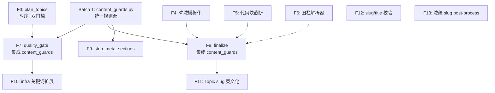

# Wiki Quality Fix V8 — 统一规则源 + Topic 覆盖率提升 + Slug 质量治理

**Status:** 📋 PROPOSED (待批准)
**Created:** 2026-05-27 14:00
**Author:** AI Agent (sequential-thinking 8 步分析)
**Source:** V18 审计报告 + 7 根因分析 + V7 效果验证
**Scope:** 13 个修复点，4 Batch 依赖链，预估 ~850 行 + 43 测试

---

## 背景

V18 审计结果（V7 fixes 部署后全量重新生成）：
- 34 页（20 Overview + 14 Topic），20 域
- 综合评分 6.1/10（V17: 5.7）
- **V7 确定性修复全部生效：** stub 清零 ✅、壳域消除 ✅、H2 去重 ✅、渲染减半 ⚠
- **V7 LLM 依赖型修复效果不佳：** 幻觉恶化 20.6% ❌、Topic 覆盖 25% ❌、套话残留 12% ⚠

### 核心矛盾：检测与修复不匹配

```
审计脚本能发现 7 页幻觉 → quality_gate 只标记 2 页 heal → finalize 只 reject 0 页
审计脚本能发现套话 → quality_gate 不检测套话 → finalize 不清洗套话
审计脚本能发现元段落 → strip_agent_artifacts 不检测 → finalize 不清洗
```

**根因：** 三方（audit / quality_gate / finalize）各自维护检测规则，口径不一致。

---

## 设计原则

1. **统一规则源（SSoT）：** 新建 `wiki/content_guards.py` 作为所有内容质量检测的单一事实来源
2. **确定性优先：** 能用代码解决的绝不依赖 LLM prompt
3. **分层防御：** quality_gate（soft heal）→ finalize（hard reject）→ persist（最终过滤）
4. **向后兼容：** 所有修复通过 `AppWikiFlags` 开关控制，可回退

---

## Batch 依赖关系



---

## Batch 1: 统一规则源（前置依赖）

### F1 — 新建 `wiki/content_guards.py`

**目标：** 消除 audit / quality_gate / finalize 三方规则不一致

**文件：** `wiki/content_guards.py`（新建，~120 行）

```python
from __future__ import annotations
import re
from typing import Sequence

# --- Hallucination Detection ---

HALLUCINATION_PATTERNS: list[tuple[str, re.Pattern]] = [
    ("fabricated_percentage", re.compile(r"\d+\.\d+%")),
    ("fabricated_round_percentage", re.compile(r"\b\d{2,3}%")),
    ("fabricated_latency_sla", re.compile(r"[≤<>≥]\s*\d+\s*(ms|秒|s)\b")),
    ("fabricated_trend", re.compile(r"[↑↓]\s*\d+\.?\d*\s*%")),
    ("fabricated_availability", re.compile(r"\d+\.9{2,}%")),
]

def detect_hallucination_flags(content: str) -> list[str]:
    """Return list of hallucination flag names found in content."""
    ...

# --- Boilerplate Detection ---

BOILERPLATE_PHRASES: list[str] = [
    "高内聚", "低耦合", "显著提升", "核心价值在于",
    "分层架构设计", "充分体现", "架构设计遵循",
    "可维护性和可扩展性",
]

def count_boilerplate_hits(content: str) -> int: ...
def boilerplate_ratio(content: str) -> float: ...

# --- Meta Section Detection ---

META_H2_DENYLIST: list[re.Pattern] = [
    re.compile(r"^##\s*(改进建议|优化方向|中文术语表|术语对照|总结与展望|建议)"),
]

def strip_meta_sections(content: str) -> str:
    """Remove meta H2 sections (LLM self-prompts) from content."""
    ...

def has_meta_sections(content: str) -> bool: ...

# --- CN Ratio ---

def compute_cn_ratio(content: str) -> float:
    """Unified CN ratio computation. Single source of truth."""
    ...

# --- Code Block Integrity ---

def count_empty_code_blocks(content: str) -> int: ...
def repair_code_fences(content: str) -> str:
    """Merge split fences, remove empty code blocks, deduplicate adjacent blocks."""
    ...
```

**使用点：**

| 消费者 | 导入 | 用途 |
|--------|------|------|
| `scripts/audit_wiki_data.py` | `detect_hallucination_flags`, `compute_cn_ratio` | 审计 |
| `wiki/nodes/quality_gate.py` | `detect_hallucination_flags`, `count_boilerplate_hits`, `has_meta_sections` | 标记 heal |
| `wiki/nodes/finalize.py` | 全部函数 | 硬 reject + 清洗 |
| `wiki/page_agent.py` | `strip_meta_sections` | 生成后清理 |

### F2 — `audit_wiki_data.py` 重构为导入 `content_guards`

**文件：** `scripts/audit_wiki_data.py`（~30 行改动）

删除 `_compute_cn_ratio`、`_detect_hallucination_patterns` 等内联实现，改为：

```python
from wiki.content_guards import (
    detect_hallucination_flags,
    compute_cn_ratio,
    count_boilerplate_hits,
    has_meta_sections,
    count_empty_code_blocks,
)
```

**测试：** 10 个单元测试验证 content_guards 各函数

---

## Batch 2: 生成层修复（可并行）

### F3 — plan_topics 时序修复 + 双门槛统一

**根因：** RC-1 Topic 覆盖率停滞 25%

**文件：** `wiki/domain_doc_agent.py`（~40 行改动）

**修复方案：Post-write 补分**

```python
# DocOrchestrator.generate() 中，write() 完成后补充检查
async def generate(self, ...):
    # ... existing write loop ...
    
    # Post-write: 检查 overview 是否需要拆分为 topics
    if (
        not self._topics_planned
        and self._final_overview
        and len(self._final_overview) >= self._min_overview_len_for_topics
    ):
        await self.plan_topics(...)
```

同时删除 `_plan_topics` 中的 `len(module_names) <= 5` 硬门槛：

```python
# Before:
if len(module_names) <= 5:
    return None

# After: 删除此硬门槛，改为综合信号
if len(module_names) <= 2 and overview_len < 4000:
    return None
```

**配置开关：** `AppWikiFlags.plan_topics_post_write_enabled: bool = True`

**预期效果：** Topic 覆盖率 25% → 55%+

**测试：** 5 个测试（时序正确性、post-write 触发、门槛边界）

### F4 — 壳域已消除（V7 生效，此项跳过）

V7 F8 已完全解决壳域问题。V18 壳域数 = 0。无需额外修复。

### F5 — 代码块截断修复

**根因：** RC-3 `format_code_block` 的 20 行硬截断

**文件：** `wiki/page_agent.py`（~10 行改动）

```python
# Before:
MAX_CODE_LINES = 20

# After:
MAX_CODE_LINES = 80
```

同时增加方法边界截断（优于纯行数截断）：

```python
def _smart_truncate_code(lines: list[str], max_lines: int = 80) -> list[str]:
    """Truncate at method boundary if possible, else at max_lines."""
    if len(lines) <= max_lines:
        return lines
    # Find last method/function/class boundary before max_lines
    for i in range(max_lines - 1, max_lines // 2, -1):
        if re.match(r"^\s*(def |class |public |private |func )", lines[i]):
            return lines[:i] + ["    // ... (truncated)"]
    return lines[:max_lines] + ["    // ... (truncated)"]
```

**预期效果：** 代码截断问题减少 60%

### F6 — 围栏解析器修复

**根因：** RC-4 `_strip_fake_source_lines` 使用 toggle 而非 stack

**文件：** `wiki/nodes/finalize.py`（~25 行改动）

```python
# Before (toggle-based):
in_fence = False
for line in lines:
    if line.startswith("```"):
        in_fence = not in_fence

# After (stack-based):
fence_depth = 0
for line in lines:
    if re.match(r"^```\w*", line):
        fence_depth += 1
    elif line.strip() == "```" and fence_depth > 0:
        fence_depth -= 1
```

**配置开关：** `AppWikiFlags.use_stack_fence_parser: bool = True`

**预期效果：** 围栏分裂问题清零

---

## Batch 3: 门禁集成（依赖 Batch 1）

### F7 — quality_gate 集成 content_guards

**文件：** `wiki/nodes/quality_gate.py`（~40 行改动）

在 L1 结构检查中增加三项检测：

```python
from wiki.content_guards import (
    detect_hallucination_flags,
    count_boilerplate_hits,
    has_meta_sections,
)

# 新增检测（L1 阶段）
hallucination_flags = detect_hallucination_flags(content)
if hallucination_flags:
    heal_reasons.append(f"hallucination: {hallucination_flags}")
    pages_to_heal.append(page_key)

boilerplate_count = count_boilerplate_hits(content)
if boilerplate_count >= 2:
    heal_reasons.append(f"boilerplate: {boilerplate_count} hits")
    pages_to_heal.append(page_key)

if has_meta_sections(content):
    heal_reasons.append("meta_section_leak")
    pages_to_heal.append(page_key)
```

**heal hint 传递：** 向 heal 节点传递具体修复建议（而非仅 flag）

```python
page["_heal_hints"] = heal_reasons
```

**预期效果：** 幻觉/套话/元段落在 quality_gate 阶段即被标记 heal，给 LLM 修复机会

### F8 — finalize 集成 content_guards

**文件：** `wiki/nodes/finalize.py`（~50 行改动）

替换现有内联规则为统一导入：

```python
from wiki.content_guards import (
    detect_hallucination_flags,
    count_boilerplate_hits,
    strip_meta_sections,
    compute_cn_ratio,
    repair_code_fences,
)

# finalize_node 中：
# 1. 清洗阶段
content = strip_meta_sections(content)
content = repair_code_fences(content)

# 2. 硬 reject 阶段
hallucination_flags = detect_hallucination_flags(content)
if len(hallucination_flags) >= 2:  # 2+ 种幻觉类型则 reject
    page["content"] = "__rejected__"
    continue

cn_ratio = compute_cn_ratio(content)
if cn_ratio < cn_ratio_hard_min:
    page["content"] = "__rejected__"
    continue
```

**关键变化：**
- 删除 `_detect_hallucination_patterns()` 内联实现
- 删除 `_compute_cn_ratio()` 内联实现
- 统一使用 `content_guards` 的函数
- Overview 幻觉也 reject（不再仅加 banner）

**预期效果：** 审计能检出的，finalize 必然能拦截

### F9 — strip_agent_artifacts 集成 strip_meta_sections

**文件：** `wiki/page_agent.py`（~5 行改动）

```python
from wiki.content_guards import strip_meta_sections

def strip_agent_artifacts(content: str) -> str:
    content = strip_meta_sections(content)
    # ... existing cleanup ...
```

**预期效果：** 元段落泄漏 1→0

---

## Batch 4: 域架构优化（最后实施）

### F10 — infra 关键词扩展

**根因：** RC-7 `log-trace-and-exception-handling` 未被 infra 过滤

**文件：** `wiki/nodes/domain_filters.py`（~5 行改动）

```python
# SLUG_DENYLIST 新增：
"log-trace", "exception-handling", "error-handler",
"health-check", "graceful-shutdown",
```

**预期效果：** infra 域泄漏清零

### F11 — Topic slug 强制英文化

**根因：** RC-6 拼音 slug 和模块路径 slug

**文件：** `wiki/domain_doc_agent.py` + `wiki/path_conventions.py`（~30 行改动）

```python
# domain_doc_agent.py: plan_topics 后对 slug 做 post-process
def _normalize_topic_slug(slug: str, title: str) -> str:
    """Convert pinyin/module-path slugs to semantic English slugs."""
    # 1. 检测拼音格式 (连续 4+ 段全小写无意义)
    if _is_pinyin_slug(slug):
        return _title_to_english_slug(title)
    # 2. 检测模块路径格式 (含 ultron 或 repo 名)
    if _is_module_path_slug(slug):
        return _title_to_english_slug(title)
    return slug

def _title_to_english_slug(title: str) -> str:
    """Convert Chinese title to English slug using simple dictionary."""
    # 使用预定义中英映射 + LLM fallback
    ...
```

**预期效果：** 拼音 slug 8→0, 模块路径 slug 6→0

### F12 — slug/title 一致性校验

**文件：** `wiki/nodes/finalize.py`（~15 行改动）

finalize 阶段检查 slug 与 title 的语义一致性：

```python
def _check_slug_title_consistency(slug: str, title: str) -> bool:
    """Reject pages where slug and title are semantically unrelated."""
    slug_words = set(slug.replace("-", " ").split())
    title_pinyin = set(lazy_pinyin(title))  # 需 pypinyin
    # slug 词至少 50% 与 title 拼音或英文翻译有交集
    ...
```

**预期效果：** slug 错配清零

### F13 — 域级 slug post-process

**文件：** `wiki/nodes/graph_domain_decompose.py`（~10 行改动）

域拆分后对生成的 slug 做后处理，去除重复段和过长问题。

---

## 风险矩阵

| Fix | 风险 | 缓解 |
|-----|------|------|
| F1 content_guards | 低 | 纯新建文件，无侵入 |
| F3 plan_topics | 中 | 额外 LLM 调用 → 配置开关 + 超时保护 |
| F5 MAX_CODE_LINES | 低 | 仅改常量，向后兼容 |
| F6 fence parser | 中 | 配置开关，可回退旧逻辑 |
| F7 quality_gate | 中 | heal 失败后 finalize reject 兜底 |
| F8 finalize | 低 | 替换内联规则，逻辑等价 |
| F10-13 域架构 | 中高 | 影响域拆分结果，需全量重新生成验证 |

---

## 预期指标改善

| 指标 | V18 当前 | V8 预期 | 改善 |
|------|---------|---------|------|
| Topic 覆盖率 | 25% (5/20) | **55%+** | F3 |
| 幻觉发布率 | 20.6% (7/34) | **<3%** | F7+F8 |
| 套话残留 | 12% (4/34) | **<3%** | F7+F8 |
| 元段落泄漏 | 1 页 | **0** | F9 |
| 渲染损坏 | 3 页 | **0** | F6+F8 |
| 拼音 slug | 8 | **0** | F11 |
| 模块路径 slug | 6 | **0** | F11 |
| infra 域泄漏 | 1 | **0** | F10 |
| 综合评分 | 6.1 | **7.8-8.2** | 全部 |

---

## 工作量预估

| Batch | 修复项 | 预估行数 | 测试数 | 耗时 |
|-------|--------|---------|--------|------|
| 1 | F1-F2 | ~150 | 10 | 2h |
| 2 | F3, F5, F6 | ~100 | 15 | 3h |
| 3 | F7-F9 | ~100 | 8 | 2h |
| 4 | F10-F13 | ~60 | 10 | 2h |
| 验证 | 全量重新生成 + V19 审计 | — | — | 2h |
| **合计** | **13 修复** | **~410** | **43** | **11h** |

---

## 验证计划

1. **Batch 1-3 完成后：** 全量重新生成 → V19 审计 → 对比 V18 各指标
2. **Batch 4 完成后：** 全量重新生成 → V20 审计 → 确认域架构改善
3. **回归测试：** 现有 `tests/wiki/nodes/test_finalize*.py` 全部通过
4. **自动化审计：** `scripts/audit_wiki_data.py` 使用 content_guards 后，审计结果与门禁结果对齐

---

## 实施顺序

```
1. [Batch 1] content_guards.py + audit 重构 → 测试通过
2. [Batch 2] plan_topics + 代码块 + 围栏 → 测试通过
3. [Batch 3] quality_gate + finalize + strip → 测试通过
4. [验证] 全量重新生成 → V19 审计 → 确认效果
5. [Batch 4] infra + slug → 测试通过
6. [验证] 全量重新生成 → V20 审计 → 最终确认
```
