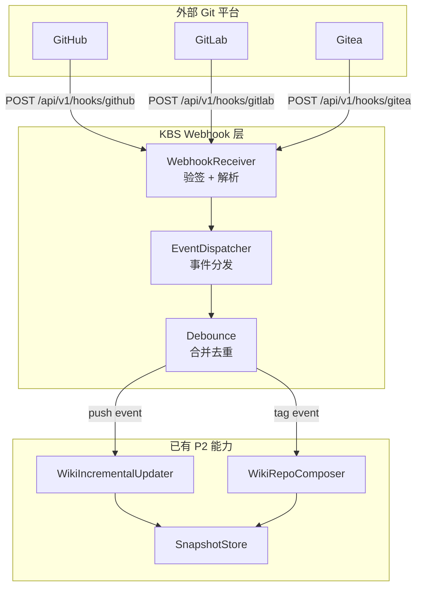
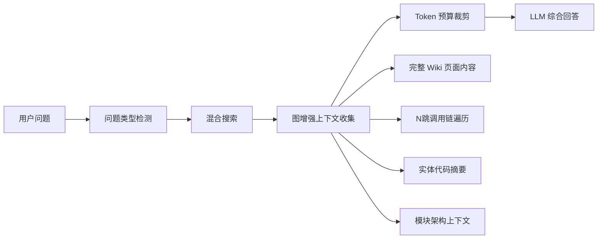
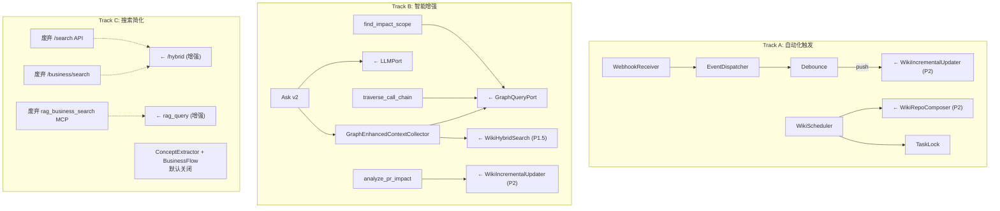

# P3 详细设计提案 — 自动化触发与 Wiki 智能

**状态:** `[AwaitingApproval]`
**创建时间:** 2026-04-18 17:54
**关联 Spec:** `2026-04-17-wiki-generation-design.md` Section 5 — P3
**前置:** P1 + P1.5 + P2 均已完成

---

## 1. 背景与目标

P2 完成后，KBS Wiki 已具备以下核心能力：
- 全仓库 Wiki 生成（6 种页面类型）
- 增量更新（文件→节点映射、1跳邻居扩展、术语漂移检测、断链修复）
- 混合搜索（Graph x2 + FTS x1.5 + Vector x1, RRF 融合）
- 代码问答 Ask（SSE 流式）
- 多 LLM 提供商（Gateway + OpenAI + Azure + Custom + 降级链）
- 持久化两级缓存（内存 LRU + 磁盘 JSON）
- Dashboard Wiki 浏览（树状导航 + Mermaid + IDE 深链接 + Ask 面板）
- 5 个 MCP 工具
- 磁盘导出（index.md + 交叉引用）

**P3 目标：** 将 Wiki 从"按需生成"进化为"自动化闭环"，同时增强 Ask 的深度代码理解能力并提供面向 Agent 的图遍历工具集。

**架构原则：**
1. KBS 的定位是**数据提供者**而非推理执行者。MCP 用户已具备 Agent + LLM 能力，KBS 应专注于提供精准的图数据和代码知识。
2. KBS **不对接外部 Git 平台 API**（如发 PR comment）。PR Bot 等集成由外部服务调用 KBS 的数据 API 完成。

---

## 2. 功能优先级矩阵

| 优先级 | 功能 | 业务价值 | 工作量 | Track |
|--------|------|----------|--------|-------|
| **P0** | Webhook push 触发自动更新 | 高 | ~3d | A |
| **P0** | Ask v2（图增强上下文，支持业务流程类问题） | 高 | ~3d | B |
| **P0** | 图遍历 MCP 工具集（3 个纯数据工具） | 高 | ~2d | B |
| **P0** | 搜索能力简化（废弃冗余 API + MCP 工具） | 中 | ~1d | C |
| **P1** | 定时 Wiki 再生 | 中 | ~1d | A |
| **P1** | 索引期 LLM 增强默认关闭（ConceptExtractor + BusinessFlowInferencer） | 低 | ~0.5d | C |
| **延后** | Wiki Snapshot + Diff 可视化 | 中 | ~5d | P3+ |
| **延后** | PR Bot comment 发送 | - | - | 外部服务负责 |
| **延后** | 自定义模板（Jinja） | 低 | ~5d | P3+ |
| **延后** | Redis 缓存层 | 低 | ~3d | P3+ |

**核心策略:**
- Track A（自动化触发）：Webhook + 定时再生
- Track B（智能增强）：Ask v2 + 图遍历 MCP 工具
- Track C（搜索简化）：废弃冗余搜索 API 和 MCP 工具，统一入口
- KBS 只提供数据 API，不对接 Git 平台发送 comment（由外部 PR Bot 服务负责）

---

## 3. Track A: 自动化触发

### 3.1 Webhook 触发系统

#### 3.1.1 架构总览



#### 3.1.2 Webhook 事件模型

```python
@dataclass
class WebhookEvent:
    provider: str          # 'github' | 'gitlab' | 'gitea'
    event_type: str        # 'push' | 'pull_request' | 'merge_request' | 'tag_push'
    delivery_id: str       # 平台提供的去重 ID
    repository: str
    ref: str               # refs/heads/main
    before: str            # commit SHA (before)
    after: str             # commit SHA (after)
    changed_files: list[ChangedFile]
    sender: str
    timestamp: datetime

@dataclass
class ChangedFile:
    path: str
    status: str            # 'added' | 'modified' | 'removed' | 'renamed'
    old_path: str | None   # renamed 时的旧路径
```

#### 3.1.3 Webhook 安全机制

| 平台 | 验签方式 | Header |
|------|----------|--------|
| GitHub | HMAC-SHA256 | `X-Hub-Signature-256` |
| GitLab | Secret Token 直接比较 | `X-Gitlab-Token` |
| Gitea | HMAC-SHA256（同 GitHub） | `X-Gitea-Signature` |

验签失败返回 `401 Unauthorized`，不触发任何后续处理。

#### 3.1.4 去重与合并（Debounce）

- **事件去重:** 使用 `delivery_id` 进行幂等判断，内存 LRU（maxsize=1000, TTL=1h）
- **Push 合并:** 同一仓库同一分支在 30s 窗口内的连续 push 合并为一次增量更新
  - 合并策略：取最早的 `before` 和最晚的 `after`，union 所有 `changed_files`
- **分支过滤:** 仅处理配置的分支（默认 `main`, `master`），其他分支忽略

#### 3.1.5 配置模型扩展

**存储方式：** 随 `config.yaml` 一起加载，通过 `config.py` 统一管理。PUT API 更新后持久化到 YAML 文件。

```python
@dataclass
class WebhookConfig:
    enabled: bool = False
    providers: dict[str, ProviderWebhookConfig] = field(default_factory=dict)
    debounce_seconds: int = 30
    auto_update_branches: list[str] = field(
        default_factory=lambda: ["main", "master"]
    )
    last_processed_sha: dict[str, str] = field(default_factory=dict)
    notification: NotificationConfig | None = None

@dataclass
class ProviderWebhookConfig:
    secret: str = ""
    events: list[str] = field(default_factory=lambda: ["push"])

@dataclass
class NotificationConfig:
    webhook_url: str = ""
    template: str = "Wiki 已自动更新: {repository} ({pages_updated} 页面受影响)"
```

> **设计决策：**
> - `last_processed_sha`: 每个仓库记录最后处理的 commit SHA。KBS 重启后，可通过比对当前 HEAD 与 last_processed_sha 进行补差量更新。
> - `NotificationConfig` 简化为通用 Webhook 通知（POST JSON 到配置的 URL），不区分 Slack/企微/飞书。各平台消息格式转换延后至 P3+。

#### 3.1.6 API 设计

```
POST /api/v1/hooks/{provider}
  Headers: X-Hub-Signature-256 / X-Gitlab-Token / X-Gitea-Signature
  Body: 原始 webhook JSON payload
  Response: 202 Accepted { "delivery_id": "...", "status": "queued" }

GET  /api/v1/hooks/config
  Response: 200 OK { WebhookConfig JSON }

PUT  /api/v1/hooks/config
  Body: WebhookConfig JSON
  Response: 200 OK { "status": "updated" }
```

---

### 3.2 PR 影响分析（纯数据 API）

> **架构决策：** KBS 不对接 Git 平台 API（不发 PR comment、不读 PR 文件列表）。KBS 只提供 `analyze_pr_impact` 数据 API，由外部 PR Bot 服务负责调用此 API 并组装 comment 发送到 Git 平台。

#### 3.2.1 职责分离

```
┌───────────────┐         ┌──────────────┐         ┌──────────────┐
│  Git 平台      │ webhook │ 外部 PR Bot   │  调用   │  KBS          │
│ (GitHub/GitLab)│────────>│  服务         │────────>│              │
│               │         │              │         │ analyze_pr   │
│               │<────────│ 组装 comment  │<────────│ _impact API  │
│               │ comment │ 发送到 Git    │ 数据    │ (MCP/HTTP)   │
└───────────────┘         └──────────────┘         └──────────────┘
```

#### 3.2.2 analyze_pr_impact 接口设计

见 Section 4.2.3 中的 MCP 工具 `analyze_pr_impact`。同时提供 HTTP API：

```
POST /api/v1/wiki/{repository}/analyze-impact
  Body: {
    "changed_files": [
      { "path": "src/auth/service.py", "status": "modified" },
      { "path": "src/auth/oauth.py", "status": "added" }
    ]
  }
  Response: 200 OK {
    "affected_pages": [
      {
        "wiki_page_path": "modules/auth/AuthService",
        "impact_level": "high",
        "reason": "3 个类被直接修改",
        "affected_entities": ["AuthService", "TokenValidator"]
      }
    ],
    "summary": { "high_impact": 2, "medium_impact": 3, "total": 5 }
  }
```

---

### 3.3 定时 Wiki 再生

#### 3.3.1 调度设计

- 使用 `asyncio` 内置定时器（避免引入 APScheduler 重依赖）
- 配置粒度：每个仓库可独立配置

```python
@dataclass
class ScheduleConfig:
    schedule_type: str = "none"    # 'none' | 'interval'
    interval_hours: int = 24       # interval 模式下的间隔
    enabled_repositories: list[str] = field(default_factory=list)
```

> **设计决策：** P3 仅支持 interval 模式（固定间隔），cron 表达式需要引入 `croniter` 依赖或自行实现解析器，延后至 P3+。

#### 3.3.2 任务锁

- 同一仓库同一时间仅允许一个生成任务（使用 `asyncio.Lock` per repository）
- Webhook 触发 vs 定时触发冲突时：Webhook 优先（取消等待中的定时任务）
- 锁超时：10 分钟自动释放

#### 3.3.3 API 设计

```
GET /api/v1/scheduler/status
  Response: 200 OK {
    "repositories": [
      {
        "repository": "my-repo",
        "schedule_type": "interval",
        "interval_hours": 24,
        "last_run": "2026-04-18T03:00:00Z",
        "last_result": "success",
        "next_run": "2026-04-19T03:00:00Z"
      }
    ]
  }
```

---

## 4. Track B: 智能增强

### 4.1 Ask v2 — 图增强上下文

#### 4.1.1 当前 Ask 的局限性

P1.5 的 Ask 流程：`search → top 5 snippets (240字符) → LLM 回答`

| 问题类型 | 当前 Ask 能回答吗 | 原因 |
|----------|------------------|------|
| "AuthService 是什么" | ✅ 可以 | Wiki 页面包含描述 |
| "用户登录的完整流程" | ❌ 不行 | 需要跟踪调用链，当前只有浅层摘要 |
| "订单创建后会触发哪些事件" | ❌ 不行 | 需要跨模块关联 |
| "修改 UserRepo 会影响什么" | ❌ 不行 | 需要影响范围分析 |

#### 4.1.2 增强方案：图增强上下文收集

**当前流程:**

```
question → search(top 5 snippets) → LLM
```

**增强流程:**



#### 4.1.3 问题类型与上下文策略

| 问题类型 | 检测关键词 | 上下文收集策略 |
|----------|-----------|---------------|
| **概念类** "什么是 X" | `是什么`, `what is`, `定义` | Wiki 页面完整内容 |
| **流程类** "X 怎么工作" | `怎么`, `流程`, `how`, `步骤` | 调用链遍历 (callees, 2-3跳) |
| **关系类** "X 和 Y 的关系" | `关系`, `区别`, `vs`, `比较` | 双向图路径查找 |
| **影响类** "修改 X 会影响什么" | `影响`, `依赖`, `impact` | N-hop 影响范围扩展 |
| **通用** (默认) | - | Wiki 页面 + 1跳邻居 |

#### 4.1.4 图增强上下文收集器

```python
class GraphEnhancedContextCollector:
    """Collects richer context by traversing the code graph."""

    async def collect(
        self,
        repository: str,
        search_results: list[SearchResult],
        question_type: str,
        token_budget: int = 8000,
    ) -> str:
        """Build enriched context string within token budget."""
        ...
```

收集顺序（按优先级）：
1. 命中的 Wiki 页面**完整内容**（不再只取 240 字符）
2. 命中实体的**调用链上下文**（根据问题类型选择 callers/callees，1-3跳）
3. 命中实体的**代码签名摘要**（docstring, parameters, return type）
4. 所在模块的**架构上下文**（module overview 摘要）

全部上下文按相关性排序，超过 token_budget 则截断低优先级内容。

#### 4.1.5 对现有代码的修改

| 文件 | 修改 |
|------|------|
| `wiki/ask.py` | 在 `_format_search_results` 后增加图增强上下文收集步骤 |
| `wiki/ask.py` | 新增 `GraphEnhancedContextCollector` 类 |
| `wiki/ask.py` | `_build_messages` 中使用增强后的上下文替代原始 snippet |
| `wiki/ask.py` | 新增 `_detect_question_type` 分类器（关键词匹配，不用 LLM） |

#### 4.1.6 效果对比

```
问题: "用户登录的完整流程是怎样的？"

【P1.5 Ask 回答】
基于 240 字符 snippet:
"AuthService 负责用户认证，包含 login()、logout() 方法..."
→ 回答浅薄，只能说有什么方法

【P3 Ask v2 回答】
基于图增强上下文:
- AuthController.login() 的完整 Wiki 描述
- 调用链: AuthController → AuthService.login() → UserRepo.find_by_email() → PasswordHasher.verify()
- SessionManager.create_session() 的调用关系
- OAuth2Provider 的集成路径
→ 回答深入，完整描述登录流程的每一步
```

---

### 4.2 图遍历 MCP 工具集

> **架构决策：** 原 DeepResearch 设计（KBS 内部使用 LLM 做规划/综合）违背了 KBS 作为数据提供者的定位。MCP 用户已具备 Agent + LLM 能力，不需要消耗 KBS 的 LLM 资源。因此将 DeepResearch 替换为纯数据的图遍历工具集，让 Agent 自由组合这些工具完成深度研究。

#### 4.2.1 设计原则

| 原则 | 说明 |
|------|------|
| **零 LLM 消耗** | 所有工具仅做图遍历和数据检索，不调用 LLM |
| **Agent 自由组合** | 工具返回结构化数据，Agent 自行规划和综合 |
| **高可复用性** | 每个工具独立可用，也可组合使用 |
| **精准数据** | 基于 AST 解析的真实代码关系，非 LLM 猜测 |

#### 4.2.2 与 P1.5 Ask 的定位区分

| 维度 | ask_about_code (P1.5) | 图遍历工具 (P3) |
|------|----------------------|----------------|
| 目标用户 | 人类（Dashboard 用户） | Agent（MCP 客户端） |
| LLM 使用 | 消耗 KBS LLM 生成自然语言回答 | 零 LLM 消耗 |
| 输出格式 | 自然语言 Markdown | 结构化 JSON |
| 适用场景 | 快速问答 | 深度代码分析 |

#### 4.2.3 新增 MCP 工具

**工具 1: `traverse_call_chain`**

跟踪函数/方法的调用链路（向上找调用者 or 向下找被调用者）。

```json
{
  "name": "traverse_call_chain",
  "inputSchema": {
    "repository": "string (required)",
    "node_name": "string (required)",
    "direction": "'callers' | 'callees' (default: 'callees')",
    "max_depth": "int (default: 3, max: 5)"
  },
  "output": {
    "root": { "name": "...", "type": "...", "file": "...", "line": 42 },
    "chain": [
      {
        "depth": 1,
        "node": { "name": "...", "type": "...", "file": "...", "line": 55 },
        "edge_type": "CALLS",
        "wiki_page_path": "modules/auth/AuthService"
      }
    ],
    "total_nodes": 12
  }
}
```

**工具 2: `find_impact_scope`**

给定一个代码实体，计算其变更的影响范围（N跳邻居扩展）。

```json
{
  "name": "find_impact_scope",
  "inputSchema": {
    "repository": "string (required)",
    "node_name": "string (required)",
    "max_hops": "int (default: 2, max: 3)"
  },
  "output": {
    "target": { "name": "...", "type": "...", "file": "...", "line": 42 },
    "impact_by_hop": {
      "0": [{ "name": "...", "wiki_page": "..." }],
      "1": [{ "name": "...", "wiki_page": "..." }],
      "2": [{ "name": "...", "wiki_page": "..." }]
    },
    "affected_wiki_pages": ["modules/auth/AuthService", "classes/TokenValidator"],
    "total_affected": 8
  }
}
```

**工具 3: `analyze_pr_impact`**

给定变更文件列表，返回受影响的 Wiki 页面和影响程度。

```json
{
  "name": "analyze_pr_impact",
  "inputSchema": {
    "repository": "string (required)",
    "changed_files": "list[{path: string, status: 'added'|'modified'|'removed'}] (required)"
  },
  "output": {
    "affected_pages": [
      {
        "wiki_page_path": "modules/auth/AuthService",
        "impact_level": "high",
        "reason": "3 个类被直接修改",
        "affected_entities": ["AuthService", "TokenValidator", "SessionManager"]
      }
    ],
    "summary": {
      "high_impact": 2,
      "medium_impact": 3,
      "total_affected_pages": 5
    }
  }
}
```

#### 4.2.4 P3 完成后 MCP 工具总览

| # | 工具名 | 来源 | LLM | 目标用户 |
|---|--------|------|-----|----------|
| 1 | `generate_wiki` | P1 | 可选 | Agent + 人类 |
| 2 | `get_wiki_page` | P1 | 无 | Agent + 人类 |
| 3 | `list_wiki_pages` | P1 | 无 | Agent + 人类 |
| 4 | `search_wiki` | P1.5 | 无 | Agent + 人类 |
| 5 | `ask_about_code` | P1.5 | 是 | 人类 (Dashboard) |
| 6 | `traverse_call_chain` | **P3** | **无** | **Agent** |
| 7 | `find_impact_scope` | **P3** | **无** | **Agent** |
| 8 | `analyze_pr_impact` | **P3** | **无** | **Agent + 外部 PR Bot** |

P3 完成后总 MCP 工具数：5 (P2) + 3 = **8**

#### 4.2.5 Agent 使用示例

Agent 可自由组合以上工具完成深度研究，例如：

```
Agent 收到用户问题: "这个项目的认证流程是怎样的？"

Agent 调用 search_wiki(query="认证 auth login")
  → 找到相关 Wiki 页面

Agent 调用 traverse_call_chain(node="AuthController.login", direction="callees")
  → 追踪从 Controller 到 Service 到 Repository 的调用链

Agent 调用 find_impact_scope(node="AuthService", max_hops=1)
  → 了解认证模块的关联范围

Agent 使用自身 LLM 综合以上数据生成回答
```

KBS 提供精准数据，Agent 的 LLM 负责推理综合。职责清晰，零额外 LLM 成本。

---

## 5. Track C: 搜索能力简化（技术债务清理）

> **背景：** 经过 P1~P2 的迭代，KBS 积累了多个搜索入口和索引增强模块，部分功能存在重叠。P3 需趁架构调整的机会进行统一简化。

### 5.1 搜索能力全景审计

#### 5.1.1 底层引擎（5 个，全部保留）

| 引擎 | 用途 | 结论 |
|------|------|------|
| FalkorDB vector_search | 语义向量搜索 | ✅ 核心，保留 |
| FalkorDB keyword_search | FQN/name/fuzzy 关键词匹配 | ✅ 核心，保留 |
| FalkorDB FTS (WikiPage) | Wiki 页面全文搜索 | ✅ 核心，保留 |
| Graph Cypher 查询 | 图结构遍历和关系查询 | ✅ 核心，保留 |
| Cross-encoder Reranker | 可选的结果重排序 | ✅ 质量增强，保留 |

#### 5.1.2 HTTP API 简化（6 → 4）

| 现有 API | 操作 | 原因 |
|----------|------|------|
| `POST /api/v1/search` | ❌ **废弃** | 被 `/hybrid` 完全替代（hybrid = keyword + vector + graph + reranker） |
| `POST /api/v1/hybrid` | ✅ 保留，升级为**唯一通用搜索入口** | 新增 `entity_type` 过滤参数，吸收 /business/search 功能 |
| `POST /api/v1/business/search` | ❌ **废弃** | 合并到 `/hybrid`（通过 `entity_type=BusinessFlow` 过滤即可实现） |
| `POST /api/v1/deep-search` | ✅ 保留 | 面向 Dashboard 前端的 LLM 驱动深度搜索，与 Ask v2 服务不同场景 |
| `GET /api/v1/search/architecture` | ✅ 保留 | 架构层专用搜索 |
| `POST /api/v1/wiki/search` | ✅ 保留 | 搜索目标不同（WikiPage vs CodeEntity） |

**废弃策略：**
1. P3 发布时标记 `/search` 和 `/business/search` 为 `@deprecated`（响应 Header 中添加 `Deprecation: true`）
2. 日志记录调用量，确认无外部依赖后在下一版本移除
3. Dashboard 前端同步迁移至 `/hybrid`

#### 5.1.3 MCP 工具简化（4 → 3）

| 现有工具 | 操作 | 原因 |
|----------|------|------|
| `rag_query` | ✅ 保留 | 通用混合搜索，供 Agent 使用 |
| `rag_graph` | ✅ 保留 | 图查询是核心能力 |
| `rag_business_search` | ❌ **废弃** | 合并到 `rag_query`（通过 `entity_type` 参数过滤） |
| `search_wiki` | ✅ 保留 | 搜索目标不同（WikiPage） |

#### 5.1.4 索引期 LLM 增强简化

| 模块 | 操作 | 原因 |
|------|------|------|
| `CodeSummaryEnricher` (business_summary) | ✅ **保留，保持默认开启** | 搜索质量基石：将代码实体的业务语义嵌入 embedding，直接提升向量搜索命中率。无替代方案。 |
| `ConceptExtractor` (BusinessConcept) | ⚠️ **保留代码，默认关闭** | 有 business_summary + Wiki 页面后，BusinessConcept 节点提供的额外搜索增益有限。但代码已实现且可配置，保留作为可选增强。 |
| `BusinessFlowInferencer` (BusinessFlow) | ⚠️ **保留代码，默认关闭** | 同上。P3 Ask v2 + 图遍历工具可通过调用链动态获取业务流程，不再依赖索引期 LLM 推断的静态流程。 |

**配置变更：**

```python
# config.yaml 变更
enrichment:
  business_summary_enabled: true      # 保持开启（搜索质量基石）
  concept_extraction_enabled: false   # 默认关闭（原 true）
  business_flow_enabled: false        # 默认关闭（原 true）
```

> **设计决策：** 保留代码但默认关闭。用户可按需开启，不增加删代码风险。索引成本从"每个实体 3 次 LLM 调用"降为"1 次"（仅 business_summary）。

### 5.2 `/deep-search` 与 Ask v2 的定位区分

| 维度 | `/deep-search` (DeepSearchEngine) | Ask v2 (WikiAskService) |
|------|-----------------------------------|------------------------|
| **目标用户** | Dashboard 前端用户 | Wiki 问答 / MCP Agent |
| **搜索目标** | 代码实体 (CodeEntity) | Wiki 页面 + 图遍历上下文 |
| **LLM 使用** | LLM 规划搜索策略 + 多轮迭代 + 综合回答 | LLM 综合回答（单轮） |
| **上下文来源** | 多轮搜索结果 | 图增强深度上下文收集 |
| **对话历史** | 无 | 有（多轮对话） |
| **输出** | 结构化搜索报告 | 自然语言流式回答 |

**结论：** 两者服务不同场景，不完全重叠，均保留。

### 5.3 简化后的搜索架构总览

```
用户/Agent
  ├─ MCP 工具
  │    ├─ rag_query (通用混合搜索，含 entity_type 过滤)
  │    ├─ rag_graph (图查询)
  │    ├─ search_wiki (Wiki 搜索)
  │    ├─ ask_about_code (Wiki 问答, P3 增强为 v2)
  │    ├─ traverse_call_chain (P3 新增)
  │    ├─ find_impact_scope (P3 新增)
  │    └─ analyze_pr_impact (P3 新增)
  │
  ├─ HTTP API
  │    ├─ /hybrid (通用搜索，吸收原 /search + /business/search)
  │    ├─ /deep-search (Dashboard 深度搜索)
  │    ├─ /search/architecture (架构层搜索)
  │    ├─ /wiki/search (Wiki 搜索)
  │    ├─ /wiki/ask (Wiki 问答, P3 增强为 v2)
  │    └─ /wiki/{repo}/analyze-impact (P3 新增)
  │
  └─ 底层引擎
       ├─ FalkorDB vector_search
       ├─ FalkorDB keyword_search
       ├─ FalkorDB FTS (WikiPage)
       ├─ Graph Cypher
       └─ Cross-encoder Reranker (可选)
```

### 5.4 影响总结

| 维度 | 简化前 | 简化后 | 变化 |
|------|--------|--------|------|
| HTTP 搜索 API | 6 个 | 4 个 | -2 |
| MCP 搜索工具 | 4 个 | 3 个 | -1 |
| 索引期 LLM 调用 | 每实体 3 次 | 每实体 1 次（默认） | 成本降 67% |
| 前端需迁移 | - | Dashboard SearchPage | 1 处 |

---

## 6. 新增文件结构

```
knowledge-base-service/
  wiki/
    webhook/                    # Track A: 自动化触发
      __init__.py
      receiver.py               # WebhookReceiver: 解析 + 验签
      event_model.py            # WebhookEvent, ChangedFile 模型
      dispatcher.py             # EventDispatcher: 事件分发（仅 push）
      providers/
        __init__.py
        github.py               # GitHub webhook 解析器
        gitlab.py               # GitLab webhook 解析器
        gitea.py                # Gitea webhook 解析器
      debounce.py               # Debounce 合并逻辑
    scheduler/                  # Track A: 定时任务
      __init__.py
      wiki_scheduler.py         # WikiScheduler: 定时触发逻辑
      task_lock.py              # 任务锁管理
    ask.py (增强)                # Track B: Ask v2 图增强上下文
    mcp_tools.py (扩展)          # Track B: +3 图遍历 MCP 工具
  api/routes/
    webhook_routes.py           # Webhook HTTP 端点（新增）
    (wiki_routes.py 扩展)       # analyze-impact API
  tests/wiki/
    test_webhook/
      test_receiver.py
      test_dispatcher.py
      test_providers.py
      test_debounce.py
    test_scheduler/
      test_wiki_scheduler.py
      test_task_lock.py
    test_ask_v2.py              # Ask v2 图增强上下文测试
    test_mcp_graph_tools.py     # 图遍历 MCP 工具测试
    test_p3_integration.py      # P3 集成测试
```

---

## 6. 依赖关系图



---

## 7. API 端点变更汇总

### 7.1 新增端点

| 方法 | 路径 | 说明 | Track |
|------|------|------|-------|
| POST | `/api/v1/hooks/{provider}` | Webhook 接收（仅 push） | A |
| GET | `/api/v1/hooks/config` | 获取 Webhook 配置 | A |
| PUT | `/api/v1/hooks/config` | 更新 Webhook 配置 | A |
| POST | `/api/v1/wiki/{repo}/analyze-impact` | PR 影响分析（纯数据） | B |
| GET | `/api/v1/scheduler/status` | 调度器状态 | A |

### 7.2 废弃端点

| 方法 | 路径 | 操作 | 替代方案 | Track |
|------|------|------|----------|-------|
| POST | `/api/v1/search` | ❌ 标记 deprecated | 使用 `POST /api/v1/hybrid` | C |
| POST | `/api/v1/business/search` | ❌ 标记 deprecated | 使用 `POST /api/v1/hybrid` + `entity_type` 过滤 | C |

### 7.3 增强端点

| 方法 | 路径 | 变更 | Track |
|------|------|------|-------|
| POST | `/api/v1/hybrid` | 新增 `entity_type` 可选参数，支持按实体类型过滤 | C |

### 7.4 废弃 MCP 工具

| 工具名 | 操作 | 替代方案 | Track |
|--------|------|----------|-------|
| `rag_business_search` | ❌ 废弃 | 使用 `rag_query` + `entity_type` 参数 | C |

> **注意：** 图遍历工具同时通过 MCP 和 HTTP API 暴露。`analyze_pr_impact` 既是 MCP 工具也是 HTTP 端点，供外部 PR Bot 服务调用。

---

## 8. Subagent 派发计划

### P3.1: Webhook 触发 + 事件分发 [~3d]

| Subagent | 输出文件 | 测试文件 | 依赖 |
|----------|----------|----------|------|
| SA-1: 事件模型 + 接收器 | `event_model.py`, `receiver.py` | `test_receiver.py` | 无 |
| SA-2: Provider 解析器 | `providers/*.py` | `test_providers.py` | SA-1 |
| SA-3: 事件分发 + Debounce | `dispatcher.py`, `debounce.py` | `test_dispatcher.py`, `test_debounce.py` | SA-1 |
| SA-4: Webhook 路由 + 集成 | `webhook_routes.py` | 集成测试 | SA-1~3 |

SA-2 和 SA-3 可并行执行。

### P3.2: 定时再生 + 任务锁 [~1d]

| Subagent | 输出文件 | 测试文件 | 依赖 |
|----------|----------|----------|------|
| SA-5: 定时调度器 | `wiki_scheduler.py`, `task_lock.py` | `test_wiki_scheduler.py`, `test_task_lock.py` | 无 |

SA-5 独立，可与其他 Track 并行。

### P3.3: Ask v2 图增强上下文 [~3d]

| Subagent | 输出文件 | 测试文件 | 依赖 |
|----------|----------|----------|------|
| SA-6: 问题类型检测 + 图上下文收集器 | `ask.py` 增强 | `test_ask_v2.py` | 无 |
| SA-7: Ask v2 集成测试 | 集成测试 | 集成测试 | SA-6 |

### P3.4: 图遍历 MCP 工具 + PR 影响 API [~2d]

| Subagent | 输出文件 | 测试文件 | 依赖 |
|----------|----------|----------|------|
| SA-8: 图遍历工具 + MCP 注册 | `mcp_tools.py` 扩展 | `test_mcp_graph_tools.py` | 无 |
| SA-9: analyze-impact HTTP API | `wiki_routes.py` 扩展 | API 测试 | SA-8 |

SA-8 可与 P3.1~P3.3 并行执行。

### P3.5: 搜索能力简化 [~1.5d]

| Subagent | 输出文件 | 测试文件 | 依赖 |
|----------|----------|----------|------|
| SA-10: API 废弃标记 + /hybrid 增强 | `main.py`, `hybrid_query.py`, `wiki_routes.py` | `test_search_deprecation.py` | 无 |
| SA-11: MCP 工具废弃 + rag_query 增强 | `mcp_server.py` | `test_mcp_deprecation.py` | 无 |
| SA-12: 索引配置默认值变更 | `config.py`, `config.yaml` | `test_config_defaults.py` | 无 |

SA-10、SA-11、SA-12 互相独立，可全并行。

### P3.6: 集成测试 + 文档 [~2d]

| Subagent | 输出文件 | 依赖 |
|----------|----------|------|
| SA-13: P3 集成测试 | `test_p3_integration.py` | SA-1~12 |
| SA-14: 文档更新 | `README.md`, `docs/` 更新 | SA-13 |

---

## 9. 预估工期

| 阶段 | 工期 | 可并行 |
|------|------|--------|
| P3.1 Webhook | 3d | SA-2, SA-3 并行 |
| P3.2 定时再生 | 1d | SA-5 独立并行 |
| P3.3 Ask v2 | 3d | SA-6→7 顺序 |
| P3.4 图遍历+PR影响 | 2d | SA-8→9 顺序 |
| P3.5 搜索简化 | 1.5d | SA-10, SA-11, SA-12 全并行 |
| P3.6 集成+文档 | 2d | SA-13→14 顺序 |
| **总计** | **~12.5d** | **最优并行可压缩至 ~7.5d** |

**最优并行执行批次：**

| 批次 | Subagent | 并行数 |
|------|----------|--------|
| 第1批 | SA-1, SA-5, SA-6, SA-8, SA-10, SA-11, SA-12 | 7（无依赖，全并行） |
| 第2批 | SA-2, SA-3, SA-7, SA-9 | 4 |
| 第3批 | SA-4 | 1 |
| 第4批 | SA-13 (集成测试) | 1 |
| 第5批 | SA-14 (文档更新) | 1 |

---

## 10. Review 发现与修订记录

本提案经过 4 轮 sequential-thinking 深度审阅 + 3 轮用户反馈修订：

### 第 1 轮：初始 Review（12 项）

| # | 类别 | 问题 | 修订 |
|---|------|------|------|
| A1 | 架构 | DeepResearch 违背 KBS 数据提供者定位 | 替换为图遍历 MCP 工具集 |
| B1 | Webhook | 配置存储位置未明确 | 明确使用 YAML 配置文件 |
| B2 | Webhook | Notification 过度设计 | 简化为通用 Webhook 通知 |
| B3 | Webhook | 掉线重试机制缺失 | 新增 last_processed_sha 重启补差 |
| B6 | 定时 | cron 解析复杂度高 | P3 仅支持 interval 模式 |

### 第 2 轮：用户反馈修订

| # | 反馈 | 修订 |
|---|------|------|
| U1 | Ask 能力不足以回答业务流程类问题 | 新增 Ask v2 图增强上下文设计 |
| U2 | PR Bot 不应发 comment，只提供数据 | 移除 review_bot/ 目录，PR 影响分析改为纯数据 API |
| U3 | Snapshot + Diff 优先级不高 | 延后至 P3+ |
| U4 | get_module_structure 与现有工具重叠 | 移除 |

### 第 3 轮：搜索能力审计（4 步 sequential-thinking）

| # | 发现 | 修订 |
|---|------|------|
| S1 | `POST /search` 被 `/hybrid` 完全替代 | 标记 deprecated，新增 Track C |
| S2 | `POST /business/search` 可合并到 `/hybrid` | 标记 deprecated，/hybrid 增加 entity_type 参数 |
| S3 | MCP `rag_business_search` 可合并到 `rag_query` | 标记 deprecated |
| S4 | ConceptExtractor + BusinessFlowInferencer 在有 business_summary + Wiki + Ask v2 后边际价值低 | 保留代码，默认关闭 |
| S5 | `/deep-search` 与 Ask v2 场景不同（Dashboard vs Wiki 问答） | 两者保留 |
| S6 | CodeSummaryEnricher 是搜索质量基石 | 确认保留 |

### 最终精简结果

| 维度 | 初始提案 | 最终提案 |
|------|---------|---------|
| Subagent 数量 | 16 → 14 → 11 | **14**（含 Track C 3 个） |
| MCP 新增工具 | 4 → 3 | **3**（另废弃 1 个） |
| 新增 HTTP API | 8 → 5 | **5**（另废弃 2 个） |
| 工期（串行） | ~20d → ~11d | **~12.5d** |
| 工期（并行） | ~12d → ~7d | **~7.5d** |
| 新增目录 | 5 → 2 | **2 个**（webhook/, scheduler/）|
| 索引期 LLM 成本 | 每实体 3 次调用 | **每实体 1 次（默认）** |

---

## 11. 审批清单

请逐项审阅并批准：

- [ ] 架构原则：KBS 作为数据提供者；不对接 Git 平台 API
- [ ] 功能优先级矩阵（Webhook/Ask v2/图工具/搜索简化为 P0；定时/配置变更为 P1；Diff/PR Bot comment 延后）
- [ ] **Track A：** Webhook push 触发设计（验签、去重、合并、配置存储、重启补差）
- [ ] **Track A：** 定时再生设计（asyncio 调度器、仅 interval 模式、任务锁）
- [ ] **Track B：** Ask v2 图增强上下文设计（问题类型检测、深度上下文收集、token 预算裁剪）
- [ ] **Track B：** 图遍历 MCP 工具集（traverse_call_chain、find_impact_scope、analyze_pr_impact）
- [ ] **Track B：** PR 影响分析为纯数据 API（MCP + HTTP，不发 comment）
- [ ] **Track C：** 废弃 `/search` 和 `/business/search`，统一到 `/hybrid`
- [ ] **Track C：** 废弃 MCP `rag_business_search`，合并到 `rag_query`
- [ ] **Track C：** ConceptExtractor + BusinessFlowInferencer 默认关闭（保留代码）
- [ ] **Track C：** `/deep-search` 与 Ask v2 保持各自定位（不合并）
- [ ] 文件结构（无 review_bot/、无 snapshot/、无 research/）
- [ ] Subagent 派发计划（14 个 Subagent，5 批并行执行，~7.5d）
- [ ] 延后项：Snapshot+Diff、自定义模板、Redis、cron 至 P3+
