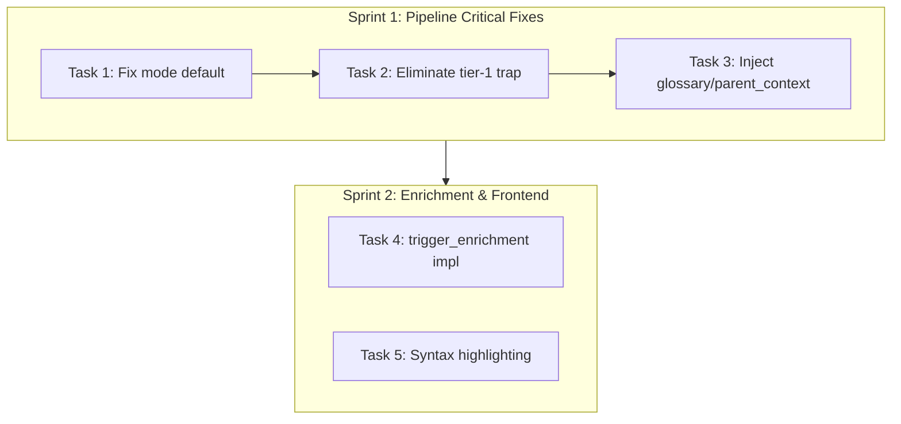

# Wiki Content Quality Sprint — Pipeline Repair

> **Status:** 📝 Draft (Awaiting Approval)  
> **Created:** 2026-04-29  
> **Scope:** Backend pipeline fixes + Frontend UX improvements  
> **Estimated Effort:** ~2 days (5 tasks, 2 sprints)  
> **Prerequisite:** Business Intelligence Injection Sprint (✅ Completed)

---

## 1. Background

### 1.1 Gap Analysis Correction

The previous gap analysis (`wiki-gap-analysis-deepwiki-codewiki.md`) identified 11 shortcomings. Deep code exploration reveals **6 are false positives** — the capabilities already exist:

| Original Gap | Actual Status | Evidence |
|-------------|--------------|---------|
| G2: Structured output templates | **FALSE POSITIVE** | `_STRUCTURED_SECTIONS_MODULE/CLASS/FUNCTION` at `composer.py:57-81` |
| G4: annotations/semantic_roles not injected | **FALSE POSITIVE** | Injected at `composer.py:721-730` via `_entity_digest` |
| G7: Module docstring missing | **FALSE POSITIVE** | Extracted by `code_graph_builder.py:734-745`, used at `composer.py:706-708` |
| G5: Parent aggregation quality low | **FALSE POSITIVE** | `_PARENT_SYSTEM_PROMPT` (L38-46) + `inter_child_edges` injection (L364-369) already robust |
| G3: Incremental path missing glossary | **FALSE POSITIVE** | `generate_incremental` passes `glossary` (L753-761) + `parent_context` (L811-829) |
| G1 (frontend): mode default | **FIXED** | `useWikiRegenerate.ts:155` sends `mode='full'` |

### 1.2 True Remaining Gaps

After eliminating false positives, **3 critical pipeline bugs** and **3 UX gaps** remain:

#### Critical Pipeline Bugs

**GAP-A: Backend `generate_business_wiki` mode default is `"structure"`**
- Location: `wiki/service.py:1165`
- Impact: MCP tools and direct API calls without explicit `mode` parameter get structure-only (no LLM) content
- Frontend is already fixed (`useWikiRegenerate.ts:155` sends `"full"`)

**GAP-G: Tier-1 Backfill Trap (Newly Discovered)**
- Location: `wiki/composer.py:245-248` + `264-271`
- Mechanism:
  1. First generation: tier-2 LLM produces rich content → backfills `business_summary` (max 100 chars)
  2. Subsequent regeneration: `business_summary` exists → tier-1 shortcut → description = 100-char summary
  3. Result: Page content **degrades** from rich LLM output to a single sentence after first generation
- Impact: The system is effectively a **one-shot** LLM generator. All re-generations produce degraded content.

**GAP-B: Full-generation path missing `glossary`/`parent_context` on leaf pages**
- Location: `wiki/service.py:2009-2019`
- `compose_page` called without `parent_context` or `glossary`
- Impact: Full generation (the primary path) produces less coherent content than incremental updates

#### UX Gaps

**GAP-C: `trigger_enrichment` is a dry-run stub**
- Location: `wiki/service.py:2775-2805`
- Only counts eligible pages; does not execute enrichment

**GAP-E: No code syntax highlighting in frontend**
- `MarkdownRenderer.tsx` renders code blocks as styled `<code>` without a syntax highlighter

~~**GAP-F: `source_locations` not clickable**~~ → **FALSE POSITIVE**
- `WikiSourceLocRow.tsx` already renders source locations as clickable IDE links (Cursor/VSCode/IDEA)
- Integrated into `WikiContent.tsx` at line 338

---

## 2. Design

### 2.1 Sprint 1: Pipeline Critical Fixes

#### Task 1: Fix `generate_business_wiki` mode default

**Change:** `wiki/service.py:1165`

```python
# Before
mode: str = "structure",

# After
mode: str = "full",
```

No other changes needed. The `mode` parameter is forwarded to `self.generate()` at L1494-1497.

#### Task 2: Eliminate Tier-1 Backfill Trap

**Design:** Reorder the tier decision to prevent `business_summary` backfill from permanently blocking LLM re-generation.

**Change:** `wiki/composer.py` — `compose_page` tier decision (L245-285)

Current flow:
```
IF business_summary exists → tier-1 (use summary AS description)  ← THE TRAP
ELIF mode='structure'      → tier-3 (structural template)
ELIF LLM available         → tier-2 (LLM generation)
ELSE                       → tier-3
```

New flow:
```
IF mode='structure' AND business_summary → tier-1 (use summary; best available in structure mode)
ELIF mode='structure'                    → tier-3 (structural template)
ELIF LLM available                       → tier-2 (LLM generation, business_summary as CONTEXT via _entity_digest)
ELIF business_summary exists             → tier-1 (no-LLM fallback only)
ELSE                                     → tier-3 (structural template)
```

Key points:
- In `mode='structure'`, `business_summary` is STILL preferred over a structural template (it's the best content available without LLM)
- In `mode='full'`, LLM is ALWAYS used when available, regardless of `business_summary` existence
- `business_summary` is already injected into `_entity_digest` at L709-711 as `"- Business summary: {bs}"`, so the LLM sees it as input context in tier-2
- tier-2 backfill of `business_summary` is **kept** — it's useful for parent page child summaries and incremental diff detection
- tier-1 becomes a **no-LLM fallback only** (or structure-mode optimization)

#### Task 3: Inject glossary + parent_context in full-generation leaf pages

**Design:** In `_compose_all_pages`, before composing leaf pages:

1. **Build lightweight glossary:** Construct a glossary from entity names and their `business_summary` first lines — **without** an LLM call (unlike `build_glossary` in the incremental path, which uses LLM). This avoids adding latency to full generation.
2. **Construct parent_context:** For each leaf node, extract parent node's `business_summary` + `description` + `name` from graph properties as lightweight parent context.
3. **Pass both to `compose_page()`**

**Change:** `wiki/service.py` — `_compose_all_pages` leaf composition section (~L2009-2020)

```python
page = await composer.compose_page(
    page_data,
    node.page_type,
    config,
    parent_context=_parent_ctx,   # NEW
    glossary=glossary,            # NEW
    importance_tier=tier,
    skeleton_strategy=skeleton_strat,
    skeleton_light_model=skeleton_light_model,
    business_domain=_biz_domain,
    is_entry_point=_is_entry,
)
```

Lightweight glossary construction (no LLM call):
```python
def _build_lightweight_glossary(entities: list[GraphNode]) -> str:
    terms = []
    for node in entities:
        name = node.properties.get("name", "")
        bs = (node.properties.get("business_summary", "") or "")[:80]
        if name and bs:
            terms.append(f"- **{name}**: {bs}")
    return "\n".join(terms) if terms else ""
```

Parent context construction:
```python
def _build_lightweight_parent_context(parent_node: GraphNode | None) -> str:
    if parent_node is None:
        return ""
    props = parent_node.properties
    parts = []
    name = props.get("name", "")
    if name:
        parts.append(f"Parent module: {name}")
    bs = props.get("business_summary", "")
    if bs:
        parts.append(f"Context: {bs}")
    desc = props.get("description", "")
    if desc and desc != bs:
        parts.append(f"Description: {desc[:200]}")
    return ". ".join(parts)
```

### 2.2 Sprint 2: Enrichment & Frontend Quality

#### Task 4: Implement `trigger_enrichment` as background task

**Design:** Transform the stub into a functional async enrichment trigger.

**Change:** `wiki/service.py` — `trigger_enrichment` method

1. Query eligible pages (existing logic)
2. If count > 0, create a background task that:
   - Fetches eligible WikiPage objects from DB
   - Uses `ImportanceTier.STANDARD` as default tier for all eligible pages (importance tiers are computed during generation but NOT persisted, so recomputation would require full graph analysis — using STANDARD is a safe default that ensures enrichment runs with moderate depth)
   - Creates `AsyncEnrichmentPipeline` and runs enrichment rounds
   - Updates `enrichment_level` on enriched pages
3. Return updated response shape:

```json
// Before (stub)
{"eligible_pages": 42, "repository": "...", "note": "..."}

// After (functional)
{"task_id": "enrich-xxx", "eligible_pages": 42, "repository": "...", "status": "started"}
```

Follows the existing background task pattern used by `generate_business_wiki`.

#### Task 5: Add code syntax highlighting to MarkdownRenderer

**Design:** Integrate `react-syntax-highlighter` (Prism light build) into `MarkdownRenderer.tsx`.

- Use `PrismLight` with selective language imports (python, java, go, javascript, typescript, bash, json, yaml)
- Theme: `oneLight` (light mode) / `oneDark` (dark mode), switchable via existing theme context
- Replace current `<code>` rendering in fenced code blocks with `SyntaxHighlighter` component
- Preserve Mermaid block handling (no syntax highlighting for mermaid blocks)

```tsx
import { PrismLight as SyntaxHighlighter } from "react-syntax-highlighter";
import { oneLight, oneDark } from "react-syntax-highlighter/dist/esm/styles/prism";
import python from "react-syntax-highlighter/dist/esm/languages/prism/python";
// ... other languages

SyntaxHighlighter.registerLanguage("python", python);
```

~~#### Task 6: Make source_locations clickable~~ → **REMOVED (False Positive)**

`WikiSourceLocRow.tsx` already renders clickable IDE links (Cursor/VSCode/IDEA) and is integrated in `WikiContent.tsx`.

---

## 3. Testing Strategy

### Sprint 1 Tests
- **Task 1:** Verify `generate_business_wiki` default mode is `"full"` via function signature inspection
- **Task 2:** Verify `compose_page` calls tier-2 when LLM available, even when `business_summary` exists; verify tier-1 only used when LLM is None
- **Task 3:** Verify `_compose_all_pages` passes `glossary` and `parent_context` to `compose_page`; verify parent_context construction from graph node

### Sprint 2 Tests
- **Task 4:** Verify `trigger_enrichment` returns task_id and actually enriches eligible pages
- **Task 5:** Verify code blocks render with syntax highlighting for supported languages; verify mermaid blocks unaffected

---

## 4. Risks & Mitigations

| Risk | Impact | Mitigation |
|------|--------|-----------|
| Tier-1 removal increases LLM calls | Higher API cost | TokenBudgetResolver already manages budget; business_summary as context reduces LLM "exploration" tokens |
| Glossary construction adds latency to full-gen | Slower generation | Build glossary once per repo (not per entity); use lightweight term extraction |
| react-syntax-highlighter bundle size | Frontend performance | PrismLight + selective imports (~50KB vs ~400KB full) |
| trigger_enrichment long-running | API timeout | Background task pattern (return task_id) |

> **Note:** Updated from 6 tasks to 5 tasks. GAP-F (source_locations) was a false positive — `WikiSourceLocRow.tsx` already provides clickable IDE links.

---

## 5. Out of Scope

The following items from the original gap analysis are explicitly **excluded** from this proposal:

| Item | Reason |
|------|--------|
| Page-level Ask/Chat integration | Separate feature proposal needed |
| Adaptive complexity decomposition (DP) | Research-level change, separate proposal |
| Multi-language Wiki output | Separate i18n effort |
| Streaming generation Phase 2 | Legacy path, lower priority |
| BusinessFlow page integration | Separate feature (Composer exists but not integrated) |

---

## 6. Dependency Graph



Sprint 1 tasks are sequential (each makes the next more impactful). Sprint 2 tasks are independent and can be parallelized.
