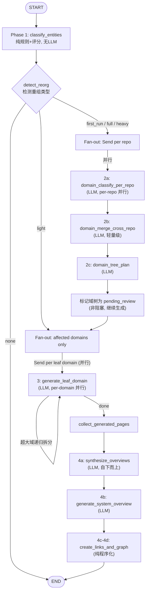
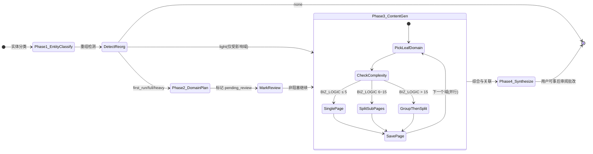

# 业务领域 Wiki 树重构提案（v2 — 基于用户反馈修订）

> 创建时间: 2026-04-30  
> 修订时间: 2026-04-30 (v2)  
> 状态: **Draft — Awaiting Approval**  
> 关联: KNOWN-ISSUES#1 (Wiki 页面粒度过细)

### v2 变更摘要（基于用户反馈）

| 反馈 | v1 方案 | v2 调整 |
|------|---------|---------|
| Business 不要自动推断 | 从 GitLab group path 自动推断 | **强制用户创建 Business 并手动绑定仓库** |
| CORE_SERVICE 如何区分定义 | 纯注解规则表 | **两阶段：确定性规则 + 业务逻辑密度评分模型** |
| 复杂逻辑子页面拆分 | 一次性 LLM 输出整页 | **渐进式 4 阶段生成，每步保存，复杂子域自动拆分子页** |

---

## 1. 问题总结

### 1.1 现状数据（来自打包机 dev 实测）

| 指标 | 当前值 | 目标值 |
|------|--------|--------|
| 顶层业务域 | 86 个（大量空域、重复域） | 8-15 个 |
| Wiki 页面数 | ~967（每个代码实体一页） | 40-80（主题页） |
| 空域占比 | ~90%（86 域中仅 __root__ 有子节点） | 0% |
| 域名质量 | 存在 enums/data_structures/infrastructure 等非业务域 | 纯业务域 |
| businessId | 只有 "default"，无业务管理 | 用户手动创建并绑定仓库 |

### 1.2 根因分析

1. **实体过滤太宽松**: entity_filter 仅过滤 methods_count=0 AND loc<20 的类，大量 DTO/VO/PO/枚举通过
2. **域分类输入污染**: 967 个实体全部发给 LLM，包括 Data/Enum/Config 类 → LLM 创建了 enums/data_structures 等伪域
3. **域分类合并不完整**: per-repo 分类后 lightweight merge 只合并域名不合并实体 → 同义域并存（user/user-profile/user_profile）
4. **无 business 管理**: businessId 写死 "default"，repository path 带 GitLab group 前缀（ultron/xxx）→ LLM 误将 ultron 作为域名

### 1.3 打包机日志佐证

```
entity_uid=Module::ConfirmPrePaymentData:0  methods_count=0  child_count=1  → 生成了独立页面
entity_uid=Module::ConversationInfo:0       methods_count=0  child_count=1  → 生成了独立页面
entity_uid=Module::IMOrderPo:0              methods_count=0  child_count=2  → 生成了独立页面
entity_uid=Module::TeamGiftRecordEntity:0   methods_count=0  child_count=1  → 生成了独立页面
```

这些全是 DTO/PO/Entity 类，不应独立成页。

---

## 2. 调研结论

### DeepWiki 方法
- **不解析到类级别**，以文件树为输入
- LLM 分析文件树 → 生成 XML wiki 结构（8-12 主题页）
- 每个主题页覆盖一个功能领域，引用相关文件
- 关键：**结构由 LLM 决定，不机械映射代码结构**

### CodeWiki 方法 (ACL 2026)
- Tree-sitter AST → 依赖图 → **特征导向模块树**
- 层级分解（DP 启发）：根据组件依赖和语义内聚性递归分区
- 叶子模块分配 Agent 生成文档，**父模块通过 LLM 综合子文档生成**
- 动态委派：模块复杂度超标时自动分拆
- 交叉引用管理：全局注册表追踪已文档化组件

### 关键借鉴
| 能力 | DeepWiki | CodeWiki | 本方案 v2 |
|------|----------|----------|-----------|
| 结构决策 | LLM 决定 | 层级分解 | 规则过滤 + 评分模型 + LLM 域规划 |
| 粒度控制 | 功能主题级 | 模块级 | 业务主题级（HAS_BUSINESS_LOGIC 聚合） |
| 非核心实体 | 不单独处理 | 合并到父模块 | DATA_MODEL 内联，NOISE 跳过 |
| 内容生成 | 一次性 | 递归综合 | **渐进式 4 阶段，每步保存** |
| 跨模块关联 | 无 | 交叉引用 | 图数据库边 + wiki 互链 |
| 多仓库 | 不支持 | 不支持 | 支持（微服务聚合） |

---

## 3. 解决方案设计

### 3.1 架构总览 — 基于 LangGraph StateGraph

**现有实现状态**：项目已有 LangGraph 骨架（`wiki/pipeline_graph.py` + `wiki/pipeline_state.py`），包含 8 个节点但大部分是 stub，实际 wiki 生成逻辑仍在 `wiki/service.py` 的 `generate_business_wiki` 中。本次重构将填充 stub 节点为真实逻辑，并扩展新节点。

**核心决策**：
- **统一流程**：首次全量、增量更新、智能重组使用同一个 StateGraph，通过条件路由自动选择路径
- **并行生成**：LangGraph Send API 实现 per-repo 域分类和 per-domain 内容生成并行
- **状态持久化**：LangGraph Checkpoint 自动实现中断恢复，无需手写
- **非阻塞审阅**：域规划等存疑步骤**不阻塞流程**，标记为 `pending_review` 继续生成，用户在 Dashboard 事后审阅并触发局部重新生成



#### WikiPipelineState 扩展（基于现有 `pipeline_state.py`）

现有字段保留不变（business_id, repositories, config, modules, domain_mapping, domain_tree, topic_structure, pages, quality_scores, pages_to_heal, heal_attempts, heal_hints, stage_timings, llm_call_count, errors）。新增以下字段：

```python
# 新增字段
entity_roles: dict[str, str]           # entity_uid -> wiki_role (Phase 1 输出)
role_stats: dict[str, int]             # role -> count (Phase 1 统计)
is_incremental: bool                   # 是否增量更新
reorg_type: str                        # first_run/full/heavy/light/none
affected_domains: list[str]            # 受影响的域列表
review_status: dict[str, str]          # domain_id/page_path -> pending_review/approved/needs_revision/revised
review_notes: dict[str, str]           # page_path -> 用户批注
generated_topic_pages: list[str]       # Phase 3 已生成的主题页 uid
overview_pages: list[str]              # Phase 4a 域概览页 uid
system_overview_uid: str               # Phase 4b 全局概览页 uid
```

#### LangGraph 核心能力映射

| 需求 | LangGraph 能力 | 实现 |
|------|---------------|------|
| Per-repo 并行域分类 | Send API | `Send("classify_per_repo", {repo: r})` × N repos |
| Per-domain 并行内容生成 | Send API | `Send("generate_leaf_domain", {domain: d})` × N domains |
| 增量 vs 全量智能路由 | Conditional edges | `route_by_reorg_type()` 条件函数 |
| 中断恢复 | Checkpoint | `MemorySaver`(dev) / `PostgresSaver`(prod) |
| 域规划事后审阅 | State 标记 | 域树标记 `pending_review`，生成继续不阻塞 |
| 超大域递归拆分 | 条件回环边 | `gen_leaf → gen_leaf`（当域 > 15 实体时） |
| LLM 并发控制 | Semaphore in node | 限制最多 3 个 LLM 并行调用 |

#### 与现有 LangGraph 骨架的集成

当前 `pipeline_graph.py` 已有的骨架节点映射：

| 现有 stub 节点 | 新 Pipeline 对应 | 操作 |
|---------------|-----------------|------|
| `collect_modules` | Phase 1 入口 | 填充：加载仓库模块 + 运行 EntityRoleClassifier |
| `classify_domains` | Phase 2a-2b | 填充：per-repo 域分类 + 跨仓库合并 |
| `decompose_hierarchy` | Phase 2c | 填充：域树规划 |
| `plan_structure` | 标记 pending_review | 填充：域树标记 + 非阻塞继续 |
| `compose_pages` | Phase 3 | **重构**：用 Send API 并行 per-domain 生成 |
| `quality_gate` | 保留 | 已实现，增加对新 TopicPage 的评估 |
| `heal_pages` | 保留 | 已实现 |
| `finalize` | Phase 4 扩展 | 填充：域概览综合 + System Overview + 互链 |

新增节点：
- `detect_reorg` — 增量重组检测（classify_domains 前插入）
- `generate_leaf_domain` — Send API 并行叶子域内容生成
- `synthesize_overviews` — Phase 4a 域概览综合
- `generate_system_overview` — Phase 4b 全局概览
- `create_links_and_graph` — Phase 4c-4d 互链和知识图谱

`WikiPipelineState` 扩展字段：
```python
# 新增字段（追加到现有 TypedDict）
entity_roles: dict[str, str]       # entity_uid -> wiki_role
role_stats: dict[str, int]         # role -> count
reorg_type: str                    # first_run/full/heavy/light/none
affected_domains: list[str]
is_incremental: bool
review_status: dict[str, str]      # domain_id -> pending_review/approved/adjusted
```

#### 文件结构

```
wiki/
├── pipeline_graph.py         (MODIFY) 扩展 StateGraph，添加新节点和条件路由
├── pipeline_state.py         (MODIFY) 扩展 WikiPipelineState
├── pipeline_nodes.py         (NEW) 新增节点的实现函数
├── entity_role_classifier.py (NEW) Phase 1 实体分类逻辑
├── topic_page_composer.py    (NEW) Phase 3 主题页内容生成
├── domain_overview_composer.py     (MODIFY) Phase 4 域概览综合增强
├── business_domain_planner.py      Phase 2a 增强
├── cross_repo_domain_planner.py    Phase 2b 增强
├── topic_structure_planner.py      Phase 2c 增强
└── service.py                      简化为调用 pipeline.invoke()
```

### 3.2 Layer 1 — 实体角色分类（EntityRoleClassifier）— **v2 重新设计**

**核心变更：两阶段分类，不再依赖纯注解匹配**

```python
class WikiEntityRole(str, Enum):
    HAS_BUSINESS_LOGIC = "has_business_logic"  # 主题页主角，参与域分类
    SUPPORTING = "supporting"                   # 在关联主题中被动提及
    DATA_MODEL = "data_model"                   # 内联到主题页数据模型节
    FRAMEWORK_NOISE = "framework_noise"         # 完全跳过
```

#### 阶段 1：确定性规则（快速路径）

对每个实体先用确定性规则做快速判定。命中则直接返回，不进入评分模型。

| # | 条件 | 角色 | 说明 |
|---|------|------|------|
| 1 | annotations 含 @Data/@Value/@Builder/@Getter 且 methods_count ≤ 3 | DATA_MODEL | 纯数据载体 |
| 2 | 名称以 DTO/VO/PO/Bo/Param/Request/Response/Entity/Form/Query 结尾 | DATA_MODEL | 命名约定 |
| 3 | is_enum=true 或名称以 Enum/Constants 结尾 | DATA_MODEL | 枚举/常量 |
| 4 | 实现 Serializable 且 methods_count=0 | DATA_MODEL | 序列化容器 |
| 5 | loc < 10 且 methods_count=0 且 edge_count=0 | FRAMEWORK_NOISE | 空壳 |
| 6 | annotations 仅含 @Component/@Configuration/@EnableXxx 且 methods_count=0 | FRAMEWORK_NOISE | 纯配置类 |
| 7 | 其他 → 进入**阶段 2** | — | 需要评分 |

#### 阶段 2：业务逻辑密度评分

对未被阶段 1 命中的实体，计算**业务逻辑密度分数**（满分 100）。

| 维度 | 权重 | 计算公式 | 说明 |
|------|------|----------|------|
| 有效方法数 | 35% | `min((methods_count - getter_setter_count) / 5, 1.0)` × 35 | 排除 getter/setter 后的业务方法 |
| 图连接度 | 25% | `min((calls_in + calls_out) / 20, 1.0)` × 25 | 被调用/调用其他越多越重要 |
| 语义角色 | 25% | 规则判定（见下表）| Controller/Service/Listener 加分 |
| 代码量 | 15% | `min(loc / 200, 1.0)` × 15 | 代码越多越可能有业务逻辑 |

**语义角色评分细则**：

| 角色特征 | 得分（/ 25） |
|----------|-------------|
| semantic_roles 含 http_controller/rpc_provider/message_listener | 25 |
| annotations 含 @RestController/@Controller/@Service/@KafkaListener | 20 |
| annotations 含 @Repository/@Mapper | 15 |
| annotations 含 @Component 且 methods_count > 3 | 10 |
| 无明确角色但 methods_count > 0 | 5 |

**分数映射**：

| 分数范围 | 角色 | 说明 |
|----------|------|------|
| ≥ 40 | HAS_BUSINESS_LOGIC | 参与域分类，成为主题页主角 |
| 15 - 39 | SUPPORTING | 在关联主题中被动提及，不参与域分类 |
| < 15 | DATA_MODEL | 内联到主题页 |

**与现有 ImportanceTier 的关系**：复用 ImportanceScorer 现有基础设施，wiki_role 作为额外属性保存到图节点，不替换 ImportanceTier。

**实现位置**: 新文件 `wiki/entity_role_classifier.py`，在 `generate_business_wiki` 流程中域分类前调用。

### 3.3 Layer 2 — 多级域规划（增强 BusinessDomainPlanner）

**变更点**:

1. **输入过滤**: 只将 HAS_BUSINESS_LOGIC 实体发给 LLM 分类（~180 vs 967）
2. **Prompt 增强**:
   ```
   规则:
   - 生成 8-15 个业务域，每域可有 2-5 个子域（最多 3 级嵌套）
   - 子域示例：消息系统 > 私聊 / 群聊 / 系统消息
   - 禁止创建 enums/data_structures/utilities/infrastructure 类型域名
   - 同一业务流程的模块必须归入同一域（即使来自不同仓库）
   - 输出嵌套 JSON: {name, description, sub_domains: [...], modules: [...]}
   ```
3. **Repository path 清洗**: 移除 GitLab group 前缀（`ultron/ultron-basic-user` → `ultron-basic-user`）
4. **Prompt 上下文增强**: 明确告诉 LLM 这些是同一微服务系统的不同服务

**DATA_MODEL 自动关联**: 通过图的 CALLS/IMPORTS 边，将 DATA_MODEL 实体关联到引用它的 HAS_BUSINESS_LOGIC 实体所在的主题页。

### 3.4 Layer 3 — 渐进式内容生成 — **v2 重新设计**

**核心变更：4 阶段渐进式生成，每步保存，不要求 LLM 一次性输出完整内容**



#### Phase 1 — 实体分类（同 3.2）
- 纯规则 + 评分，**不涉及 LLM**
- 输入: 每个图节点的属性（loc, methods_count, annotations, semantic_roles, edge_count）
- 输出: wiki_role 属性保存到每个图节点
- 传递给 Phase 2: HAS_BUSINESS_LOGIC 实体列表（带简要属性）
- **Phase 1 完成后即保存状态**

#### Phase 2 — 域规划

##### 2a: Per-repo 域分类（LLM）
- 输入: 单个仓库的 HAS_BUSINESS_LOGIC 实体，每实体携带:
  - name (~20 token) + summary (~50 token) + methods 列表 (~30 token) + 主要调用关系 (~30 token)
  - ≈ 130 token/实体，单仓库 ~30 实体 → ~3900 token（单批次可接受）
  - 超过 50 实体时按现有机制分批次
- 输出: 域名 → 实体列表映射
- 保存: per-repo 域分类结果

##### 2b: Cross-repo 域合并（LLM，轻量级）
- 输入: 所有 per-repo 域名列表（**不带实体详情**）
  - 每域: name + 实体数 + 所属仓库 ≈ 30 token/域
  - ~20 域/仓 × 5 仓 ≈ 3000 token
- 输出: 合并后的统一域名映射（old → new）
- 保存: 合并映射

##### 2c: 域树规划（LLM）
- 输入: 合并后的域 + 每域实体摘要
  - 每域: name + 实体列表（名称 + 一句话摘要） ≈ 100 token/域
  - 15 域 → ~1500 token
- 输出: 多级域树（包含子域划分）
- 保存: WikiSection 节点
- **Phase 2 完成后域树标记为 `pending_review`，Pipeline 继续执行不阻塞**
- **Dashboard 事后审阅**：用户在生成完成后可查看域树，调整后触发受影响域的局部重新生成

#### Phase 3 — 叶子域内容生成（核心变更）

对每个**叶子域**独立生成内容，根据复杂度动态决策：

| 条件 | 策略 | 输出 |
|------|------|------|
| HAS_BUSINESS_LOGIC 实体 ≤ 5 | 生成 1 个主题页 | 包含所有核心服务 + 内联 DATA_MODEL |
| HAS_BUSINESS_LOGIC 实体 6-15 | 生成 1 个概览页 + N 个子页（按功能拆分） | 概览页描述整体流程，子页各自详述 |
| HAS_BUSINESS_LOGIC 实体 > 15 | 先 LLM 分组，再每组生成子页 | 先逻辑分组，再每组独立生成 |

##### 简单域（≤ 5 实体）上下文
- 输入:
  - 域名 + 域在树中的位置（父域名）
  - 该域所有 HAS_BUSINESS_LOGIC 实体详细信息（方法、CALLS 边、代码摘要）
  - 关联 DATA_MODEL 实体（字段列表）
  - 兄弟域的标题和一句话描述
  - ≈ 2000-4000 token
- 输出: 1 个完整主题页

##### 复杂域（> 15 实体）上下文
- Step 0（LLM 分组）:
  - 输入: 实体列表（名称 + 摘要 + CALLS 关系）≈ 130 token/实体 × 20 ≈ 2600 token
  - 输出: 分组方案（每组 3-7 实体）

**子页拆分时的上下文组织策略（分层携带）**：

当一个叶子域需要拆分为多个子页时，采用分层生成，每步携带适量上下文：

```
Step 1: 生成「域概览草稿」
  输入: 该域所有 HAS_BUSINESS_LOGIC 实体的简要信息（名称、摘要、角色）
  输出: 域整体描述 + 子页分组方案
  → 保存为 WikiPage(type=draft)

Step 2: 生成每个子页（可并行）
  输入:
    [全局上下文 ~500 token]
    - 当前域名 + 域概览草稿（整体描述，不含详细内容）
    - 兄弟子页标题和一句话描述（知道同域其他子页在讲什么）

    [当前子页上下文 ~2000-5000 token]
    - 该子页包含的 HAS_BUSINESS_LOGIC 实体详细信息（代码摘要、方法列表、CALLS 边）
    - 该子页关联的 DATA_MODEL 实体列表（字段信息）

    [不携带]
    - 兄弟子页的完整内容（避免 token 膨胀）
    - 其他域的信息
  输出: 完整子页内容
  → 每页生成后立即保存为 WikiPage

Step 3 (Phase 4): 正式域概览
  输入: 已生成的所有子页内容摘要（每子页 ~200 token 摘要）
  输出: 升级域概览草稿为正式版，补充子页间关系叙事
```

这样每步 LLM 上下文可控（~3000-6000 token），子页知道自己在域中的位置，能引用兄弟子页标题，但不会因携带完整内容而 token 爆炸。

每个主题页内容结构：

```markdown
# {子域名} — {描述}

## 业务概述
{LLM 生成的业务能力描述}

## 核心业务流程
{Mermaid sequence/flowchart 图 — 基于 CALLS 边生成}

## 核心服务详情
### {ServiceA}（来自 repo-1）
{职责、关键 API、入参出参摘要}

### {ServiceB}（来自 repo-2）
{职责、关键 API、入参出参摘要}

## 数据模型
<details>
<summary>相关 DTO/VO/枚举（{N} 个）</summary>

| 类名 | 类型 | 字段 | 说明 |
|------|------|------|------|
| UserDTO | DTO | id, name, avatar | 用户基本信息 |
| StatusEnum | Enum | ONLINE, OFFLINE, BUSY | 用户状态 |
</details>

## 关联主题
- [[支付系统]] — 通过 PaymentService 调用
- [[用户系统]] — 通过 UserInfoService 查询
```

**每页生成后立即保存到 FalkorDB**（WikiPage 节点），支持中断恢复。

#### Phase 4 — 综合与关联

##### 4a: 域概览正式版（LLM）
- 输入:
  - 域概览草稿（如有，Phase 3 Step 1 生成的）
  - 该域所有子页的摘要（每子页 ~200 token 提取前 3 句）
  - 子域间的 CALLS 关系统计
  - ≈ 1000-2000 token
- 输出: 正式域概览页（含架构图、子域关系叙事）
- **自下而上，先生成叶子域概览，再生成父域概览**

##### 4b: System Overview（LLM）
- 输入:
  - 所有域概览页的摘要（每域 ~200 token × 12 域 ≈ 2400 token）
  - 域间关系图（调用次数 top-N）
- 输出: 全局架构概览页

##### 4c: Wiki 互链（纯程序化，不需要 LLM）
- 基于 CALLS 边创建 [[link]]，当两个实体分属不同主题页时自动生成互链

##### 4d: 知识图谱边（纯程序化，不需要 LLM）
- 基于 CALLS 边统计域间调用次数，生成域间关系权重

### 3.5 BusinessId 管理改造 — **v2 重新设计**

**核心变更：去掉自动推断，强制用户手动创建和绑定**

1. **Business 数据模型**（存储在 FalkorDB）:
   ```
   (:Business {id, name, description, created_at})
   (:Business)-[:CONTAINS_REPO]->(:Repository)
   ```
   - **不再有 `auto_inferred` 字段**
   - Business 必须由用户主动创建

2. **API**:
   - `GET /api/v1/businesses` — 列出所有 business
   - `POST /api/v1/businesses` — 创建 business（必填 name + description）
   - `PUT /api/v1/businesses/{id}` — 更新 business 信息
   - `PUT /api/v1/businesses/{id}/repositories` — 绑定/解绑仓库列表
   - `DELETE /api/v1/businesses/{id}` — 删除 business
   - `GET /api/v1/businesses/{id}/repositories` — 查看已绑定仓库

3. **约束**:
   - **Wiki 生成必须指定 business_id**，去掉所有 `default="default"` 默认值
   - 未绑定到任何 Business 的仓库不参与业务 Wiki 生成
   - 一个仓库可以绑定到多个 Business（同一仓库可能服务多个业务线）

4. **迁移方案**:
   - 现有 `default` Business 保留，但标记为 `[待配置]`
   - Dashboard 首次进入 Wiki 功能时，若无 Business，引导用户创建

5. **CI 集成**:
   - GitLab CI 模板增加 `KB_BUSINESS_ID` 变量（必填）
   - 未配置 `KB_BUSINESS_ID` 时仅触发索引，不触发 Wiki 生成
   - `repository` 参数仍使用 `$CI_PROJECT_PATH`，但清洗 group 前缀后仅作为仓库标识

### 3.6 Dashboard 配套改造

#### 3.6.1 Business 管理页面（新增）
- **Business 列表页**: 展示所有 Business，含名称、描述、绑定仓库数、Wiki 状态
- **Business 创建/编辑表单**: name（必填）、description（必填）
- **仓库绑定面板**: 左侧已索引仓库列表（可搜索），右侧已绑定列表，拖拽或勾选绑定
- **入口**: 顶部导航 → 设置 → Business 管理

#### 3.6.2 Business 选择器
- 顶部导航栏增加 Business 下拉选择器
- 选择后所有 Wiki 相关查询自动带上 business_id
- 未选择时提示先选择 Business

#### 3.6.3 Wiki 树视图重构
- **business_domain 视图**改为展示主题树：
  ```
  消息系统
  ├── 域概览（架构图 + 域间关系）
  ├── 私聊
  ├── 群聊
  └── 系统消息
  支付系统
  ├── 域概览
  └── ...
  ```
- 节点类型：Domain → SubDomain → TopicPage
- 不再展示 ~967 个类节点

#### 3.6.4 主题页内容展示增强
- 核心服务卡片：每个 HAS_BUSINESS_LOGIC 实体的摘要卡片
- 数据模型折叠区：相关 DTO/枚举的可展开卡片组
- Mermaid 业务流图：嵌入页面顶部
- 关联主题导航：右侧边栏显示关联主题链接

#### 3.6.5 生成控制面板增强
- 过滤统计展示：总实体数 / HAS_BUSINESS_LOGIC / DATA_MODEL / SUPPORTING / NOISE
- **域树审阅面板**：生成完成后展示域树结构，标记为 `pending_review` 的域可调整
  - 用户可拖拽模块到其他域
  - 用户可合并/拆分域
  - 调整后点击"重新生成受影响域"→ 仅对修改的域重新运行 Phase 3-4
- **生成进度面板**: 按域显示生成进度（Phase 3 每完成一个叶子域更新一次）
- 支持暂停/恢复生成

#### 3.6.6 Wiki 审阅与批改功能

生成完毕后，用户可在 Dashboard 中对 Wiki 内容进行多层级审阅和批改：

**域树级批改**（调整结构）：
- 拖拽模块到其他域 → 触发受影响域重新生成
- 合并/拆分域 → 触发域重新规划和内容重新生成
- 新建/删除域 → 触发增量重组流程

**页面级批改**（修正内容）：
- 在主题页查看界面，每个段落旁显示"反馈"按钮
- 用户可选择：
  - **标记问题**：标记某段内容有误/不完整，添加批注
  - **指定修改**：输入具体修改意见（如"这里缺少 XX 流程的描述"）
  - **手动编辑**：直接编辑 Wiki 内容并保存
- 标记问题/指定修改后，可一键触发"重新生成此页"：
  - 将用户反馈作为 LLM 上下文的一部分（heal hint）
  - 复用现有 `quality_gate → heal_pages` 机制
  - 重新生成该页，保留用户未批注的部分

**批量批改**：
- 提供"审阅模式"：逐页快速浏览，标记 ✓（通过）/ ✗（需修改）/ 📝（有意见）
- 批量标记完成后，一键触发所有标记为 ✗ 或 📝 的页面重新生成

**审阅状态追踪**：
```python
class ReviewStatus(str, Enum):
    PENDING_REVIEW = "pending_review"   # 新生成，待审阅
    APPROVED = "approved"               # 用户确认通过
    NEEDS_REVISION = "needs_revision"   # 用户标记需修改
    REVISED = "revised"                 # 已根据反馈重新生成
```

每个 WikiPage 和 WikiSection 节点增加 `review_status` 和 `review_notes` 属性。

**与 heal_pages 机制的集成**：
- 用户的批注/修改意见 → 转化为 `heal_hints`
- 触发重新生成 → 走现有 `compose_pages → quality_gate → heal_pages` 路径
- 重新生成时 LLM 上下文包含：原页面内容 + 用户反馈 + heal hint

#### 3.6.7 知识图谱视图（新增 Tab）
- 使用 xyflow 渲染域间关系图
- 节点 = 业务域，边 = 域间调用关系
- 点击节点跳转到域概览页
- 支持下钻到子域级别

---

## 4. Wiki 树最终结构

```
WikiSpace (business: "社交平台" — 用户手动创建)
├── System Overview（自动生成全局架构图）
├── 消息系统 (domain)
│   ├── 域概览页（子域关系 + 涉及仓库 + 架构图 — Phase 4 综合生成）
│   ├── 私聊 (sub-domain topic page — Phase 3 独立生成)
│   │   └── 内含: P2PChatService + P2PMessageHandler + 相关DTO内联
│   ├── 群聊 (sub-domain topic page)
│   │   └── 内含: GroupChatService + GroupMemberService + 相关DTO内联
│   └── 系统消息 (sub-domain topic page)
├── 礼物系统 (domain)
│   ├── 域概览页
│   ├── 个人礼物 (sub-domain)
│   └── 团队礼物 (sub-domain)
├── 支付系统 (domain — 复杂域, HAS_BUSINESS_LOGIC > 15)
│   ├── 域概览页
│   ├── 支付核心 (auto-split sub-page)
│   │   └── PaymentService + OrderService + ...
│   ├── 退款处理 (auto-split sub-page)
│   │   └── RefundService + RefundHandler + ...
│   └── 账务管理 (auto-split sub-page)
├── 用户系统 (domain)
│   └── ...
└── 基础设施（公共工具/框架封装，可折叠）
```

---

## 5. 实施计划

### Sprint 1: Business 管理 + 实体分类 + LangGraph 基础（2-3 天）

| # | 任务 | 文件 | 验证 |
|---|------|------|------|
| 1.1 | Business CRUD API + 仓库绑定 | `api/routes/business_routes.py` (new) | API 测试 |
| 1.2 | 去掉 wiki 路由 business_id 默认值 | `api/routes/wiki_page_routes.py` 等 | business_id 必传 |
| 1.3 | 实现 EntityRoleClassifier（两阶段） | `wiki/entity_role_classifier.py` (new) | 单元测试：967 实体 → ~180 BIZ / ~100 SUP / ~520 DATA / ~167 NOISE |
| 1.4 | 扩展 WikiPipelineState | `wiki/pipeline_state.py` (modify) | 新增 entity_roles, reorg_type, review_status 等字段 |
| 1.5 | 填充 collect_modules stub | `wiki/pipeline_graph.py` (modify) | 加载模块 + 运行 EntityRoleClassifier |
| 1.6 | 填充 classify_domains stub + 新增 detect_reorg 节点 | `wiki/pipeline_graph.py`, `wiki/pipeline_nodes.py` (new) | 条件路由正确 |
| 1.7 | 增强域分类 prompt + repo path 清洗 | `wiki/business_domain_planner.py`, `wiki/cross_repo_domain_planner.py` | 禁止非业务域名 |
| 1.8 | 扩展 TokenBudgetResolver RATIOS | `wiki/token_budget.py` (modify) | 新增 pipeline 组件 ratio |
| 1.9 | 在打包机重新分类验证 | — | 域数从 86 降至 8-15 |

### Sprint 2: LangGraph Pipeline 完整集成 + 渐进式内容生成（3-4 天）

| # | 任务 | 文件 | 验证 |
|---|------|------|------|
| 2.1 | Phase 3 叶子域内容生成器 | `wiki/topic_page_composer.py` (new) | 按复杂度动态拆分策略 |
| 2.2 | DATA_MODEL 内联 + SUPPORTING 关联 | `wiki/topic_page_composer.py` | DTO/枚举以表格内联 |
| 2.3 | 业务流图生成（基于 CALLS 边） | `wiki/topic_page_composer.py` | 每主题页含 Mermaid 图 |
| 2.4 | Phase 4 域概览综合生成 | `wiki/domain_overview_composer.py` (modify) | 自下而上综合子页摘要 |
| 2.5 | Wiki 互链 + 知识图谱边 | `wiki/pipeline_nodes.py` | 交叉引用 |
| 2.6 | 填充剩余 pipeline stub 节点 | `wiki/pipeline_graph.py` (modify) | compose_pages 用 Send API 并行 |
| 2.7 | 配置 LangGraph Checkpoint 后端 | `wiki/pipeline_graph.py` | AsyncSqliteSaver/MemorySaver 切换 |
| 2.8 | 适配 quality_gate 支持 TopicPage | `wiki/pipeline_graph.py` (modify) | TopicPage 结构的评分规则 |
| 2.9 | service.py 简化为调用 pipeline.invoke() | `wiki/service.py` (modify) | 端到端生成验证 |

### Sprint 3: Dashboard 改造（2-3 天）

| # | 任务 | 文件 | 验证 |
|---|------|------|------|
| 3.1 | Business 管理页面 | `dashboard/src/pages/` (new) | 创建/编辑/绑定仓库 |
| 3.2 | Business 选择器 | `dashboard/src/components/` | 导航栏下拉 |
| 3.3 | Wiki 主题树视图 | `dashboard/src/components/wiki/` | Domain → SubDomain → TopicPage |
| 3.4 | 主题页内容展示 | `dashboard/src/components/wiki/` | 折叠卡片/Mermaid |
| 3.5 | 域树审阅面板 | `dashboard/src/components/wiki/` | 生成后可调整域树 |
| 3.6 | 生成进度面板 | `dashboard/src/components/wiki/` | 实时进度 |
| 3.7 | Wiki 审阅与批改功能 | `dashboard/src/components/wiki/` | 页面级标记/反馈/重新生成 |
| 3.8 | 知识图谱视图 | `dashboard/src/components/wiki/WikiKnowledgeGraph.tsx` (new) | xyflow 域关系图 |

---

## 6. 风险与缓解

| 风险 | 概率 | 影响 | 缓解 |
|------|------|------|------|
| 评分模型阈值需调优 | 中 | 部分实体分类偏差 | 在打包机实测后微调阈值；默认 SUPPORTING |
| 域分类质量仍不理想 | 低 | 域名不准确 | 只发 HAS_BUSINESS_LOGIC 大幅减少噪音 |
| 复杂域子页拆分不准确 | 中 | 子页逻辑不内聚 | LLM 先分组后人工微调（Dashboard 支持） |
| 渐进式生成增加总耗时 | 低 | 生成变慢 | 每步保存 + 并行生成不同域 |
| 向后兼容性 | 低 | 现有 API 客户端受影响 | code_structure 视图不变；主题页是新增层 |
| Business 强制配置增加用户门槛 | 中 | 新用户需先创建 Business | Dashboard 引导流程；首次进入 Wiki 提示创建 |

---

## 7. 成功指标

| 指标 | 当前 | Sprint 1 后 | Sprint 2 后 | Sprint 3 后 |
|------|------|------------|------------|------------|
| 顶层域数 | 86 | 8-15 | 8-15 | 8-15 |
| Wiki 页面数（business_domain 视图） | ~967 | — | 40-80 主题页 | 40-80 |
| 空域占比 | ~90% | 0% | 0% | 0% |
| 域名质量 | 有 enums/data_structures | 纯业务域 | 纯业务域 | 纯业务域 |
| businessId 管理 | 只有 default | 用户创建 + 绑定 | 用户创建 + 绑定 | 完整管理 UI |
| 生成中断恢复 | 不支持 | — | 支持 | 支持 |
| Dashboard 主题树 | 展示类列表 | — | — | 展示主题树 |

---

## 8. 全流程上下文流转总览

每个 LLM 调用的上下文预算由 `TokenBudgetResolver` 根据 LLM 上下文窗口自动计算（参见 Section 8 末尾的 RATIOS 扩展）。以下为各阶段的上下文流转示意（token 数为 base=30K 时的参考值）：

```
Phase 1 (纯规则，无LLM)
  图节点属性 ──→ EntityRoleClassifier ──→ wiki_role 属性（保存到图）
                                          │
                                          ▼ HAS_BUSINESS_LOGIC 列表
Phase 2a (LLM, per-repo)
  实体简要信息 ──→ 域分类 ──→ per-repo 域映射（保存）
  ~130 token/实体             │
                              ▼ 域名列表（不带实体详情）
Phase 2b (LLM, 轻量级)
  域名+实体数 ──→ 域合并 ──→ 统一域名映射（保存）
  ~3000 token                 │
                              ▼ 合并后域 + 实体摘要
Phase 2c (LLM)
  域+实体摘要 ──→ 域树规划 ──→ WikiSection 节点（保存）
  ~1500 token                 │         ↓ [用户可预览确认]
                              ▼
Phase 3 (LLM, per-leaf-domain)
  ┌────────────────────────────────────────────┐
  │ 简单域(≤5):                                 │
  │   实体详情+DATA_MODEL+兄弟域标题 → 1页      │
  │   ~2000-4000 token                          │
  ├────────────────────────────────────────────┤
  │ 中等域(6-15):                               │
  │   Step1: 实体简要 → 域概览草稿(保存) + 分组  │
  │   Step2: 草稿+兄弟标题+子页实体详情 → 子页   │
  │          每子页 ~3000-6000 token (可并行)     │
  ├────────────────────────────────────────────┤
  │ 复杂域(>15):                                │
  │   Step0: 实体列表+CALLS → LLM分组           │
  │   Step1-2: 同中等域                          │
  └────────────────────────────────────────────┘
  每页生成后立即保存 WikiPage │
                              ▼ 子页摘要（每页~200 token）
Phase 4a (LLM, per-domain)
  草稿+子页摘要+CALLS统计 ──→ 正式域概览页（保存）
  ~1000-2000 token            │
                              ▼ 域概览摘要（每域~200 token）
Phase 4b (LLM)
  域概览摘要+域间关系 ──→ System Overview（保存）
  ~2400 token

Phase 4c-4d (纯程序化，无LLM)
  CALLS边 ──→ Wiki 互链 + 知识图谱边
```

**设计原则**：
- Token 预算**复用现有 `TokenBudgetResolver`**，根据 LLM 上下文窗口（`ceiling`）自动计算，不硬编码。新增 Pipeline 组件的 ratio 注册到 `RATIOS` 中（见下）
- 通过**摘要传递**连接各步（子页 → 域概览 → System Overview）
- 每步输出**立即保存**到 FalkorDB，支持中断恢复
- 兄弟/父节点通过**标题+一句话描述**感知（而非完整内容）

**TokenBudgetResolver 扩展**：

```python
RATIOS: dict[str, float] = {
    # 现有
    "decomposition": 1.0,
    "ask_concept": 0.33,
    # ...
    # 新增 Pipeline 组件
    "domain_classify": 0.50,      # Phase 2a: per-repo 域分类
    "domain_merge": 0.20,         # Phase 2b: 跨仓库域合并
    "domain_tree_plan": 0.15,     # Phase 2c: 域树规划
    "topic_page_generate": 0.60,  # Phase 3: 叶子域内容生成
    "domain_overview": 0.30,      # Phase 4a: 域概览综合
    "system_overview": 0.25,      # Phase 4b: 全局概览
    "entity_group": 0.20,         # Phase 3 复杂域分组
}
```

这样当切换更大上下文窗口的 LLM 时，所有组件预算自动按比例增大。

---

## 9. 增量更新与 Wiki 重组机制

当代码增量更新导致域内实体数跨越策略阈值时，需要对 Wiki 结构进行重组。

### 9.1 重组检测（每次增量更新后）

```
增量更新后 → 重新运行 Phase 1 (EntityRoleClassifier)
           → 对比每个叶子域的 HAS_BUSINESS_LOGIC 实体数变化
           → 检测是否需要重组
```

**触发条件**：

| 场景 | 检测条件 | 重组类型 |
|------|----------|----------|
| 域内扩张 | 域从 ≤5 变为 6-15，或从 6-15 变为 >15 | 轻量重组 |
| 域内收缩 | 子页仅剩 ≤1 个实体 | 子页合并 |
| 新实体无域 | 新增 HAS_BUSINESS_LOGIC 实体不属于任何现有域 | 重度重组 |
| 大规模变化 | 变化实体数 / 总实体数 ≥ 20% | 全量重组 |

### 9.2 重组策略

#### 轻量重组（域内实体数跨越阈值）
1. **保留现有子页内容**（不重新生成未变化的子页）
2. 仅对新增实体生成新子页，或将原单页拆分为概览页 + 子页
3. 重新生成域概览页（基于更新后的子页摘要）
4. 更新 Wiki 互链

#### 重度重组（出现新域或域合并）
1. 重新运行 Phase 2（域规划），Dashboard 预览后确认
2. 对**变化的域**重新运行 Phase 3-4
3. **未变化的域**保留现有页面

#### 子页拆分流程
```
原: 支付核心（1 个主题页，含 4 个实体）
                ↓ 增量更新新增 PaySplitService, PayChannelRouter, PayRetryHandler
新: 支付核心（域概览页）
    ├── 支付处理（子页: PaymentService, OrderService, PayCallback, PaySplitService）
    └── 支付路由（子页: PayChannelRouter, PayRetryHandler, PayGateway）

步骤:
1. LLM 分组: 将 7 个实体分为 2 组（上下文: 实体名+摘要 ~1000 token）
2. 生成子页 1: 读取原主题页中 PaymentService 等内容作为参考（~2000 token）
3. 生成子页 2: 为新实体生成（~2000 token）
4. 重新生成域概览页（基于 2 个子页摘要）
```

#### 子页合并流程
```
原: 退款处理（域概览 + 2 个子页）
                ↓ 代码重构，RefundHandler 被合并到 RefundService
新: 退款处理（1 个主题页，含 RefundService）

步骤:
1. 检测: 退款处理域仅剩 1 个 HAS_BUSINESS_LOGIC 实体
2. 合并: 将现有子页内容综合为 1 个主题页（LLM 综合，~2000 token）
3. 删除旧子页和域概览页
```

### 9.3 LangGraph 统一实现

首次全量和增量更新使用**同一个 StateGraph**，通过 `detect_reorg` 节点的条件路由自动选择路径：

```python
def detect_reorg(state: WikiPipelineState) -> WikiPipelineState:
    """Phase 1 完成后，检测重组类型"""
    if not state["is_incremental"]:
        return {**state, "reorg_type": "first_run", "affected_domains": []}
    
    old_roles = load_previous_entity_roles(state["business_id"])
    new_roles = state["entity_roles"]
    changed = compute_changes(old_roles, new_roles)
    
    change_ratio = len(changed) / len(new_roles)
    if change_ratio >= 0.20:
        return {**state, "reorg_type": "full"}
    
    domain_tree = load_existing_domain_tree(state["business_id"])
    affected = find_affected_domains(domain_tree, changed)
    
    if needs_new_domains(changed, domain_tree):
        return {**state, "reorg_type": "heavy", "affected_domains": affected}
    elif affected:
        return {**state, "reorg_type": "light", "affected_domains": affected}
    else:
        return {**state, "reorg_type": "none"}

def route_by_reorg_type(state: WikiPipelineState) -> str:
    return state["reorg_type"]  # → conditional edge routing
```

**首次全量/超大仓库**: `reorg_type="first_run"` → 完整 Phase 2-3-4，但 per-repo 和 per-domain 通过 Send API **并行化**

**增量更新**: `reorg_type="light"/"heavy"` → 只处理受影响的域，其他域保留现有页面

**Send API 并行化示例**（处理超大仓库/多仓库）：
```python
def fan_out_to_repos(state) -> list[Send]:
    """8 个仓库并行域分类"""
    return [Send("classify_per_repo", {"repo": r, **state}) for r in state["repositories"]]

def fan_out_to_domains(state) -> list[Send]:
    """12 个叶子域并行内容生成"""
    domains = get_leaf_domains(state["domain_tree"])
    if state["reorg_type"] == "light":
        domains = [d for d in domains if d.id in state["affected_domains"]]
    return [Send("generate_leaf_domain", {"domain": d, **state}) for d in domains]
```

**自适应分批（处理超大仓库单 repo 200+ 实体）**：
```python
def classify_per_repo(state):
    entities = state["biz_logic_entities_for_repo"]
    if len(entities) <= 100:
        return classify_single_batch(entities)
    else:
        batches = chunk(entities, 80)
        results = []
        for batch in batches:
            ctx = {"existing_domains": [r.domain for r in results]}
            results.extend(classify_single_batch(batch, ctx))
        return merge_batch_results(results)
```
